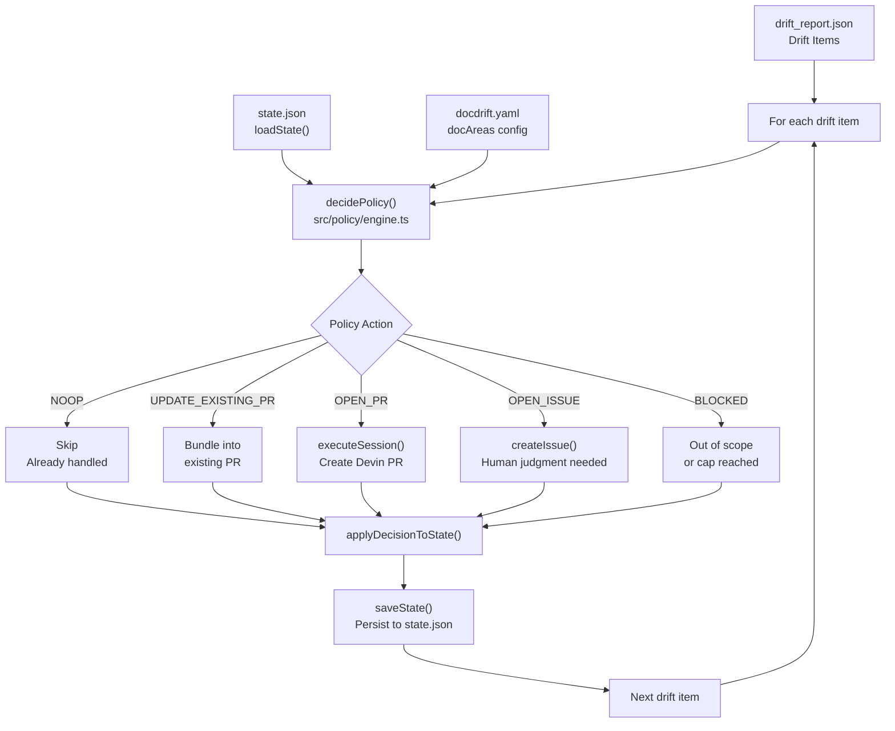
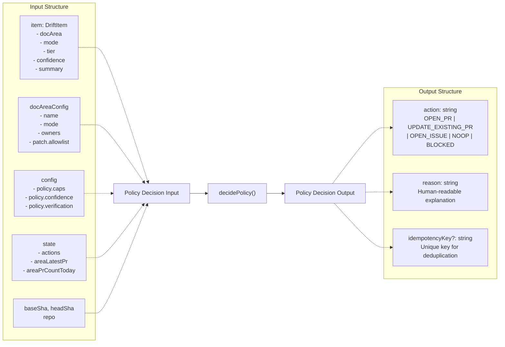
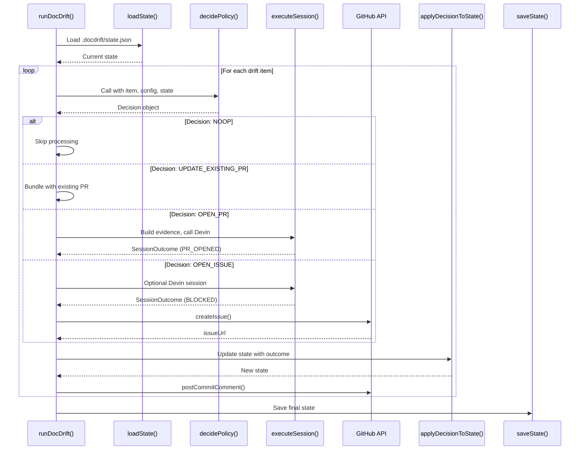
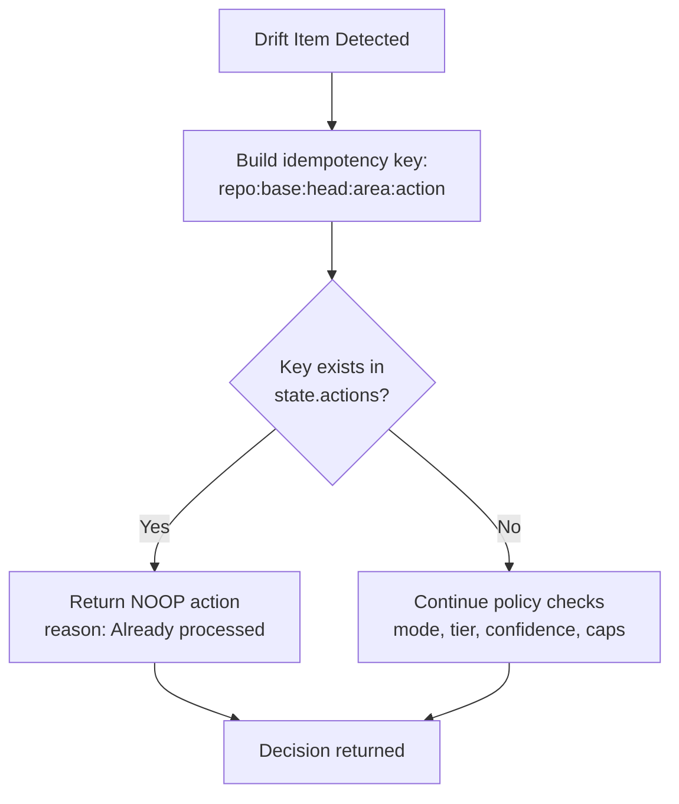
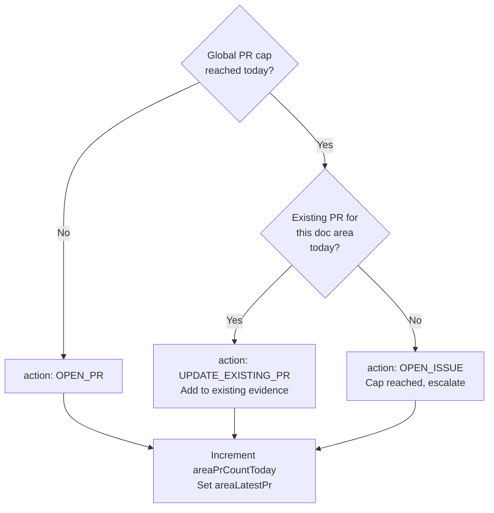
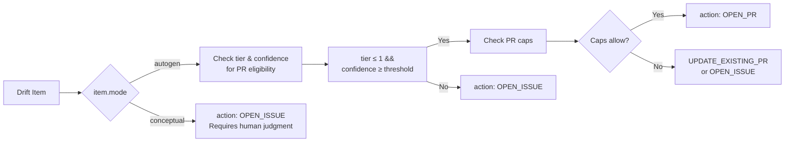
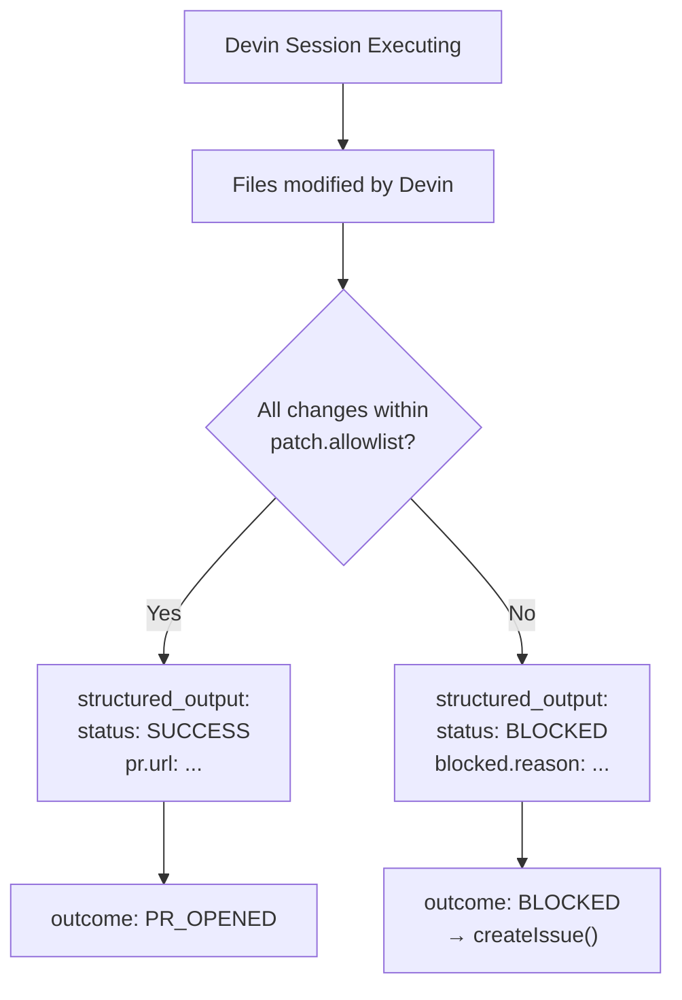
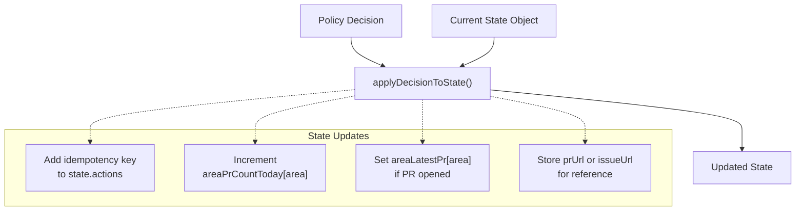

<details>
<summary>Relevant source files</summary>

The following files were used as context for generating this wiki page:

- [.gitignore](.gitignore)
- [README.md](README.md)
- [docdrift-yml.md](docdrift-yml.md)
- [src/index.ts](src/index.ts)

</details>


The Policy Engine is the gating layer that determines what action to take after drift is detected. It receives drift items from the Detection System ([#4](#4)) and routes them to appropriate remediation paths based on doc area mode, signal confidence, existing state, and configured policies. The engine enforces noise reduction through PR caps, bundling, confidence thresholds, and idempotency checks.

For detailed decision logic, see [Decision Logic](#5.1). For noise reduction mechanisms, see [Noise Reduction](#5.2). For state persistence, see [State Management](#5.3).

**Sources:** [README.md:16-21](), [src/index.ts:179-377]()

---

## Policy Architecture

The policy engine operates as a pure decision function that takes drift items and returns policy decisions without side effects. The orchestration layer ([src/index.ts:179-377]()) then executes those decisions by calling external services or updating state.



**Sources:** [src/index.ts:213-263](), [README.md:34-42]()

---

## Policy Actions

The policy engine returns one of five action types from the `decidePolicy()` function:

| Action | Description | When Used | Next Step |
|--------|-------------|-----------|-----------|
| `NOOP` | No operation; skip this item | Idempotency key already exists in state | Continue to next item |
| `OPEN_PR` | Create new Devin session for PR | High confidence, low tier, within caps, no existing PR | Execute Devin session with evidence bundle |
| `UPDATE_EXISTING_PR` | Bundle changes into existing PR | PR cap reached but existing PR exists for this doc area today | Add to evidence, skip Devin session |
| `OPEN_ISSUE` | Escalate to GitHub issue | Conceptual mode, low confidence, or high tier | Create issue with questions for humans |
| `BLOCKED` | Cannot process | Changes outside allowlist, caps exhausted without fallback | Log reason, possibly create issue |

**Sources:** [src/index.ts:221-263](), [README.md:37]()

---

## Decision Function Interface

The core policy decision function is `decidePolicy()`, invoked once per drift item:



**Sources:** [src/index.ts:221-229]()

---

## Orchestration Flow

The orchestration layer in `runDocDrift()` executes policy decisions:



**Sources:** [src/index.ts:179-377]()

---

## Confidence and Tier Gating

The policy engine uses confidence scores and tier levels to route drift:

| Tier | Confidence Range | Typical Action | Rationale |
|------|------------------|----------------|-----------|
| 0 (docs:check fail) | N/A | `OPEN_ISSUE` | Build/validation failure requires investigation |
| 1 (OpenAPI diff) | ≥ autopatchThreshold | `OPEN_PR` | Structural API changes are mechanically fixable |
| 1 (OpenAPI diff) | < autopatchThreshold | `OPEN_ISSUE` | Low confidence suggests ambiguous changes |
| 2 (heuristic) | Any | `OPEN_ISSUE` | Path-based detection is conceptual, needs human review |

The `autopatchThreshold` is configured in `docdrift.yaml` under `policy.confidence.autopatchThreshold` (default: 0.7).

**Sources:** [README.md:23-26](), [src/index.ts:83-97]()

---

## Idempotency and Deduplication

The policy engine prevents duplicate actions using idempotency keys. The key format is:

```
{repo}:{baseSha}:{headSha}:{docArea}:{action}
```

Before taking any action, `decidePolicy()` checks if this key exists in `state.actions`. If found, it returns `NOOP`.



**Sources:** [README.md:21](), [src/index.ts:231-238]()

---

## PR Cap Enforcement

The policy engine enforces two types of caps to limit noise:

1. **Global Daily Cap**: Maximum PRs opened per day across all doc areas
2. **Per-Area Bundling**: Maximum one PR per doc area per day



Cap configuration in `docdrift.yaml`:

```yaml
policy:
  caps:
    maxPrsPerDay: 5
    resetHour: 0  # UTC hour when counters reset
```

**Sources:** [README.md:17-18](), [src/index.ts:241-263]()

---

## Mode-Based Routing

The doc area mode determines the default remediation path:



**Sources:** [README.md:20](), [src/index.ts:82-97]()

---

## Allowlist Enforcement

The policy engine ensures that Devin sessions only modify files within configured allowlists:

| Doc Area | Allowlist Example | Purpose |
|----------|------------------|---------|
| `api_reference` | `["docs/reference/**", "openapi/**"]` | Limit autogen to API docs and specs |
| `auth_guide` | `["docs/guides/auth.md"]` | Restrict conceptual updates to specific guides |

The allowlist is passed to the Devin prompt ([src/index.ts:88]()) and validated in the session. If changes are detected outside the allowlist, the session returns `BLOCKED`.



**Sources:** [src/index.ts:86-89](), [README.md:57]()

---

## State Application

After executing a decision, `applyDecisionToState()` updates the state object:



The updated state is persisted to `.docdrift/state.json` via `saveState()` after all drift items are processed.

**Sources:** [src/index.ts:256-262](), [src/index.ts:356-363]()

---

## Integration with Execution Layer

The policy engine is stateless and returns decisions; the orchestration layer executes them:

| Policy Action | Execution Path | Code Location |
|---------------|----------------|---------------|
| `NOOP` | Skip processing, continue loop | [src/index.ts:231-238]() |
| `UPDATE_EXISTING_PR` | Log bundling, skip Devin session | [src/index.ts:241-263]() |
| `OPEN_PR` | Build evidence bundle, call `executeSession()` | [src/index.ts:265-293]() |
| `OPEN_ISSUE` | Call `executeSession()` then `createIssue()` | [src/index.ts:295-316]() |
| `BLOCKED` | Create issue with blocking reason | [src/index.ts:295-316]() |

The separation of decision and execution enables testing policy logic without side effects and allows policy configuration to change without modifying orchestration code.

**Sources:** [src/index.ts:213-363]()

---

## Policy Configuration Schema

The policy engine reads configuration from `docdrift.yaml`:

```yaml
policy:
  caps:
    maxPrsPerDay: 5        # Global daily cap
    resetHour: 0           # UTC hour for reset (0-23)
  
  confidence:
    autopatchThreshold: 0.7  # Minimum confidence for OPEN_PR
  
  verification:
    commands:              # Commands to run post-patch
      - "npm run docs:check"
      - "npm run docs:build"
  
  allowlist:               # Default allowlist (overridden per doc area)
    - "docs/**"
    - "openapi/**"
```

Doc area-specific overrides:

```yaml
docAreas:
  - name: api_reference
    mode: autogen
    patch:
      allowlist:
        - "docs/reference/openapi.json"
        - "docs/reference/api.md"
        - "openapi/generated.json"
```

**Sources:** [README.md:52](), [src/index.ts:86-89]()

---

## Example Policy Flow

Consider a drift item detected from an OpenAPI schema change:

```json
{
  "docArea": "api_reference",
  "mode": "autogen",
  "tier": 1,
  "confidence": 0.85,
  "summary": "Field 'name' renamed to 'fullName' in User model"
}
```

Policy evaluation:

1. **Idempotency**: Key `org/repo:abc123:def456:api_reference:OPEN_PR` not in state → Continue
2. **Mode**: `autogen` → Check tier and confidence
3. **Tier**: `1` (≤ 1) → Eligible for PR
4. **Confidence**: `0.85` (≥ 0.7 threshold) → Eligible for PR
5. **Global Cap**: 2 PRs today, max 5 → Within limit
6. **Area Cap**: No PR for `api_reference` today → No bundling needed
7. **Decision**: `OPEN_PR`

Execution:

1. Build evidence bundle with OpenAPI diff
2. Upload to Devin, create session
3. Poll until terminal status
4. Devin opens PR
5. Post commit comment with PR link
6. Update state: add idempotency key, increment `areaPrCountToday.api_reference`, set `areaLatestPr.api_reference`
7. Save state to `.docdrift/state.json`

**Sources:** [README.md:34-42](), [src/index.ts:213-363]()

---