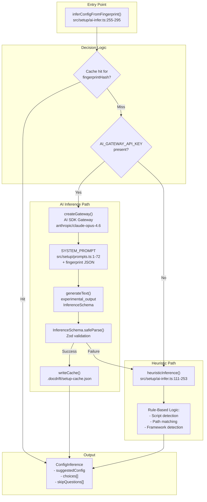
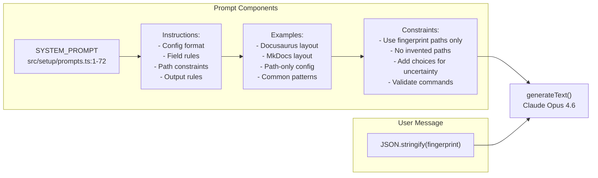
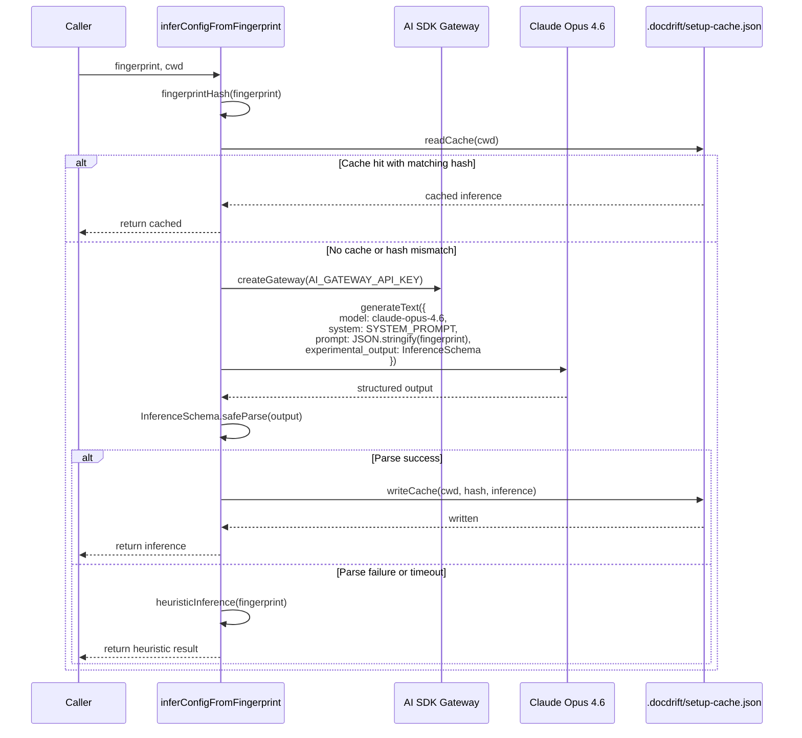
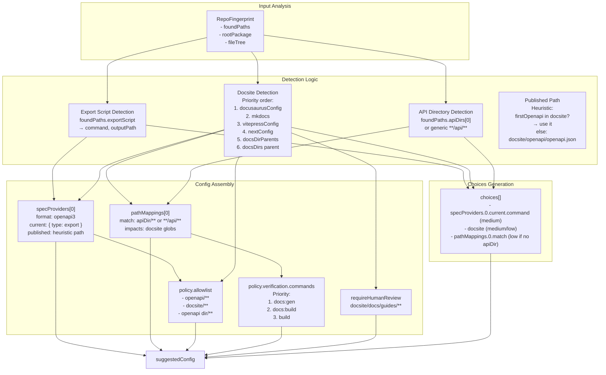
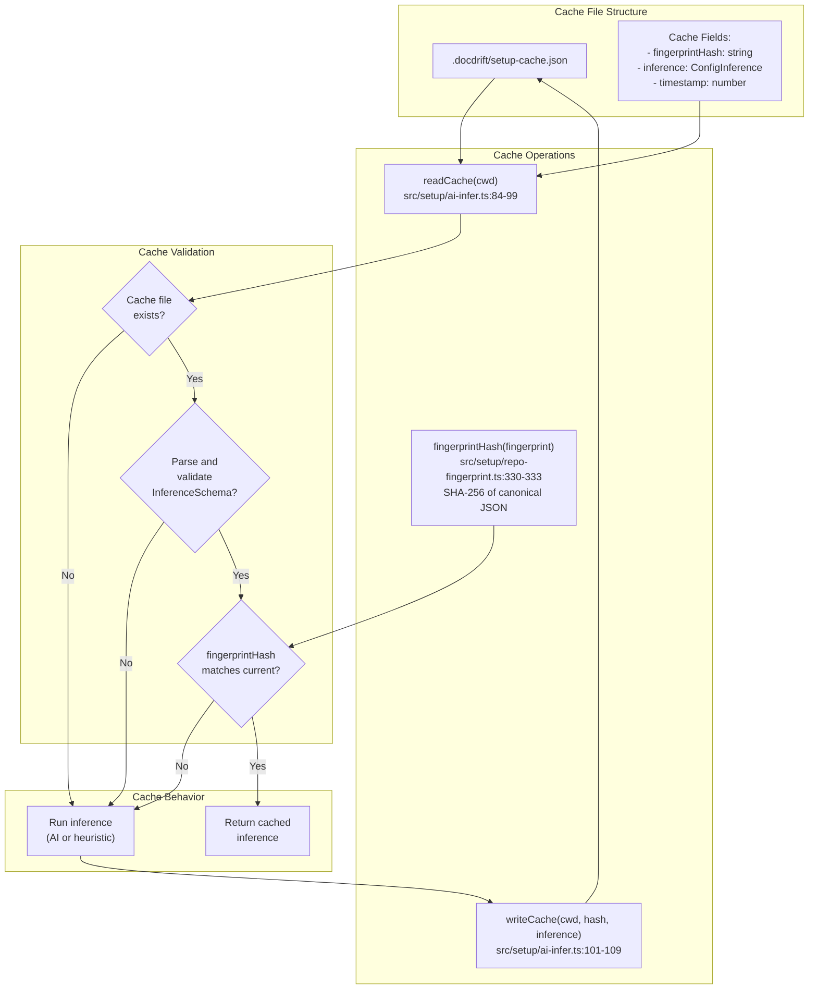
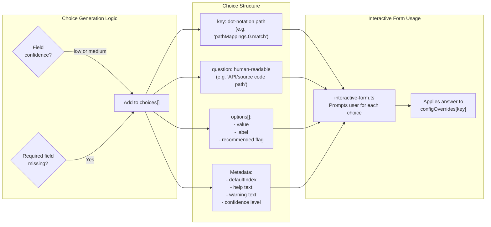
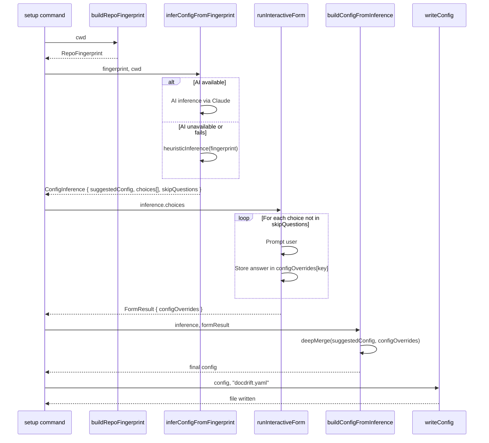
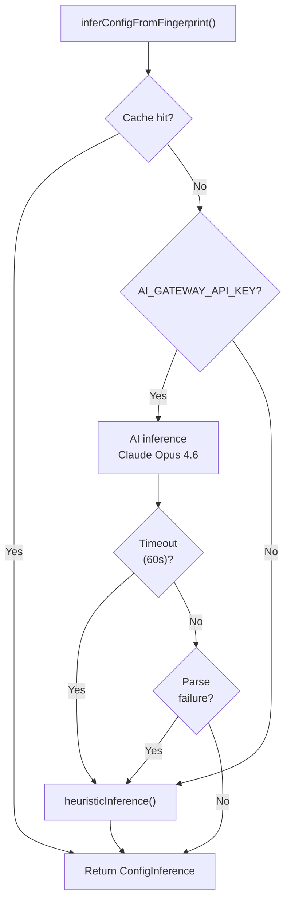

# AI Inference and Heuristics

<details>
<summary>Relevant source files</summary>

The following files were used as context for generating this wiki page:

- [src/setup/ai-infer.ts](src/setup/ai-infer.ts)
- [src/setup/generate-yaml.ts](src/setup/generate-yaml.ts)
- [src/setup/prompts.ts](src/setup/prompts.ts)
- [src/setup/repo-fingerprint.ts](src/setup/repo-fingerprint.ts)
- [test/setup-infer.test.ts](test/setup-infer.test.ts)

</details>


## Purpose and Scope

This page documents the AI inference and heuristic fallback system used during setup to automatically generate `docdrift.yaml` configuration from repository structure. The inference system analyzes the repository fingerprint (see [Repository Fingerprinting](#5.4)) and produces a suggested configuration plus interactive choices for uncertain fields.

The system operates in two modes: **AI inference** using Claude via the AI SDK Gateway, and **heuristic fallback** using rule-based logic when AI is unavailable. Both modes produce identical output structures but differ in sophistication and accuracy.

For the overall setup flow, see [Setup Overview](#5.1). For how the inference output is consumed, see [Manual Setup Flow](#5.2).

---

## Inference Architecture

The inference system provides a unified interface that delegates to either AI or heuristics based on API key availability:



**Sources:** [src/setup/ai-infer.ts:255-295](), [src/setup/prompts.ts:1-72]()

---

## Inference Schema

The `InferenceSchema` defines the output structure for both AI and heuristic inference. It uses Zod for runtime validation:

| Field | Type | Purpose |
|-------|------|---------|
| `suggestedConfig` | Partial config object | Pre-filled configuration values with high confidence |
| `choices[]` | Array of interactive questions | Fields requiring user input due to low confidence |
| `skipQuestions[]` | Array of keys | Fields to skip in interactive form (high confidence) |

### ConfigInference Type Structure

```typescript
// From src/setup/ai-infer.ts:75
type ConfigInference = {
  suggestedConfig: {
    version?: 2
    specProviders?: Array<SpecProvider>
    docsite?: string | string[]
    exclude?: string[]
    requireHumanReview?: string[]
    pathMappings?: Array<PathRule>
    mode?: "strict" | "auto"
    devin?: DevinConfig
    policy?: PolicyConfig
  }
  choices: Array<{
    key: string                    // Dot-notation path (e.g., "docsite", "pathMappings.0.match")
    question: string               // Human-readable question
    options: Array<{
      value: string
      label: string
      recommended?: boolean
    }>
    defaultIndex: number
    help?: string
    warning?: string
    confidence: "high" | "medium" | "low"
  }>
  skipQuestions?: string[]
}
```

**Sources:** [src/setup/ai-infer.ts:25-75]()

---

## AI Inference Pipeline

### System Prompt Design

The AI inference uses a carefully crafted system prompt that instructs Claude to analyze the repository fingerprint and generate configuration:



**Key Prompt Directives** (from [src/setup/prompts.ts:1-72]()):

- **Path-only rule**: Use paths from `foundPaths` only; never invent paths
- **Choice generation**: Add fields with low confidence to `choices[]` for user input
- **Command validation**: Use npm script names from `rootPackage.scripts`, never raw script bodies
- **Common patterns**: Recognize Docusaurus, MkDocs, VitePress, Next.js layouts
- **Path-only mode**: Support configurations without spec providers if no OpenAPI detected

### AI Generation Flow



**Sources:** [src/setup/ai-infer.ts:255-295](), [src/setup/prompts.ts:1-72]()

### AI Configuration Parameters

| Parameter | Value | Rationale |
|-----------|-------|-----------|
| Model | `anthropic/claude-opus-4.6` | High-quality structured output generation |
| Gateway | `https://ai-gateway.vercel.sh/v1/ai` | Vercel AI SDK Gateway for provider abstraction |
| Output mode | `experimental_output` with Zod schema | Structured JSON output matching `InferenceSchema` |
| Max retries | 2 | Limited retries for fast fallback to heuristics |
| Timeout | 60 seconds | Prevent hanging; fall back to heuristics on timeout |

**Sources:** [src/setup/ai-infer.ts:267-284]()

---

## Heuristic Fallback

The `heuristicInference` function provides rule-based configuration generation when AI is unavailable or fails. It analyzes the `RepoFingerprint` using deterministic logic:



**Sources:** [src/setup/ai-infer.ts:111-253]()

### Heuristic Decision Table

| Field | Detection Logic | Confidence |
|-------|----------------|------------|
| `specProviders[0].current.command` | Use `exportScript.scriptName` wrapped in `npm run`, or default to `npm run openapi:export` | medium |
| `specProviders[0].current.outputPath` | Use `exportScript.inferredOutputPath`, or first OpenAPI not in docs/, or `openapi/generated.json` | medium |
| `specProviders[0].published` | If first OpenAPI is under docsite, use it; else `{docsite}/openapi/openapi.json` | medium |
| `docsite` | First match from: docusaurusConfig dir → mkdocs dir → vitepressConfig dir → nextConfig dir → docsDirParents[0] → docsDirs[0] parent | medium if found, low if missing |
| `pathMappings[0].match` | Use `apiDirs[0]/**` if available, else generic `**/api/**` | medium if apiDir, low otherwise |
| `pathMappings[0].impacts` | If docsite: `[{docsite}/docs/**, {docsite}/openapi/**]`, else `[**/docs/**, **/openapi/**]` | medium |
| `policy.allowlist` | Always includes `openapi/**`, plus docsite glob, plus OpenAPI dir glob if different | high |
| `policy.verification.commands` | Priority: `docs:gen` → `docs:build` → `build` (from scripts) | medium |
| `requireHumanReview` | If docsite and docs dirs exist: `[{docsite}/docs/guides/**]` else `[]` | medium |

**Sources:** [src/setup/ai-infer.ts:111-253]()

### Example Heuristic Output

From test case [test/setup-infer.test.ts:42-64](), showing packages/api + packages/docs layout:

```typescript
{
  suggestedConfig: {
    version: 2,
    specProviders: [{
      format: "openapi3",
      current: {
        type: "export",
        command: "npm run openapi:export",
        outputPath: "openapi/generated.json"
      },
      published: "packages/docs/openapi/openapi.json"
    }],
    docsite: "packages/docs",
    pathMappings: [{
      match: "packages/api/**",
      impacts: ["packages/docs/docs/**", "packages/docs/openapi/**"]
    }],
    exclude: ["**/CHANGELOG*", "**/blog/**"],
    requireHumanReview: ["packages/docs/docs/guides/**"],
    mode: "strict",
    policy: {
      allowlist: ["openapi/**", "packages/docs/**"],
      verification: { commands: ["npm run docs:gen", "npm run docs:build"] }
      // ... other policy fields
    }
  },
  choices: [
    {
      key: "specProviders.0.current.command",
      question: "OpenAPI export command",
      options: [{ value: "npm run openapi:export", label: "npm run openapi:export", recommended: true }],
      defaultIndex: 0,
      confidence: "medium"
    },
    {
      key: "docsite",
      question: "Docsite path",
      options: [{ value: "packages/docs", label: "packages/docs", recommended: true }],
      defaultIndex: 0,
      confidence: "medium"
    }
  ]
}
```

**Sources:** [test/setup-infer.test.ts:42-64]()

---

## Caching Strategy

The inference system caches AI results to avoid redundant API calls for unchanged repositories:



**Sources:** [src/setup/ai-infer.ts:77-109](), [src/setup/repo-fingerprint.ts:330-333]()

### Cache Invalidation Rules

The cache is invalidated when:

1. **Fingerprint hash mismatch**: Repository structure, package.json, or detected paths change
2. **Schema validation failure**: Cached inference no longer matches current `InferenceSchema`
3. **Missing cache file**: First run or manual deletion of `.docdrift/setup-cache.json`

The `fingerprintHash` function generates a deterministic SHA-256 hash from the canonicalized fingerprint JSON (sorted keys), ensuring any structural change invalidates the cache.

**Sources:** [src/setup/repo-fingerprint.ts:330-333](), [src/setup/ai-infer.ts:260-263]()

---

## Choice Generation

Both AI and heuristic inference produce a `choices[]` array for interactive user input. Choices represent configuration fields where the system has low or medium confidence:



**Sources:** [src/setup/ai-infer.ts:181-218]()

### Example Choice Objects

From heuristic inference [src/setup/ai-infer.ts:181-218]():

```typescript
// High confidence field: docsite detected
{
  key: "docsite",
  question: "Docsite path",
  options: [{ value: "packages/docs", label: "packages/docs", recommended: true }],
  defaultIndex: 0,
  confidence: "medium"
}

// Low confidence field: docsite NOT detected
{
  key: "docsite",
  question: "Docsite path",
  options: [{ value: "", label: "(specify path to docs site root)", recommended: false }],
  defaultIndex: 0,
  help: "Path to Docusaurus, MkDocs, VitePress, or other docs site root.",
  confidence: "low"
}

// Low confidence field: API directory not detected
{
  key: "pathMappings.0.match",
  question: "API/source code path (pathMappings.match)",
  options: [{ value: "**/api/**", label: "**/api/** (generic)", recommended: true }],
  defaultIndex: 0,
  help: "Glob for API or source code that, when changed, may require doc updates.",
  confidence: "low"
}
```

**Sources:** [src/setup/ai-infer.ts:181-218]()

---

## Integration with Setup Flow

The inference output flows into the manual setup's interactive form:



**Sources:** [src/setup/ai-infer.ts:255-295](), [src/setup/generate-yaml.ts:95-105]()

### Configuration Assembly

The `buildConfigFromInference` function merges the inference output with user overrides:

1. **Start with defaults**: Structural defaults from `DEFAULT_CONFIG` [src/setup/generate-yaml.ts:67-93]()
2. **Merge suggested config**: Deep merge `inference.suggestedConfig` over defaults
3. **Apply user overrides**: Apply `formResult.configOverrides` using dot-notation keys
4. **Write YAML**: Serialize with schema hint comment for IDE support

**Sources:** [src/setup/generate-yaml.ts:95-105]()

---

## Error Handling and Fallback Chain

The system provides multiple fallback layers:



**Fallback Guarantees:**

- **Cache miss → AI fails → Heuristic always succeeds**: The heuristic path never throws; it always produces valid output
- **Timeout protection**: 60-second abort signal prevents hanging on slow AI responses
- **Parse validation**: Zod schema validation catches malformed AI output
- **Zero user-facing errors**: All error paths resolve to heuristic fallback, ensuring setup always completes

**Sources:** [src/setup/ai-infer.ts:274-294]()

---

## Testing and Validation

The inference system includes comprehensive test coverage for heuristic logic:

### Test Scenarios

From [test/setup-infer.test.ts]():

| Test Case | Layout | Expected Behavior |
|-----------|--------|-------------------|
| Packages layout | packages/api + packages/docs | Uses exact paths, no generic globs |
| Root docs | docs/ + openapi/ at root | No workspace-specific paths in allowlist |
| MkDocs | mkdocs.yml in docs/ | Detects docs/ as docsite |
| Export script | exportScript with inferredApiDir | Uses script command and API dir |
| Missing docsite | OpenAPI but no doc framework | Adds docsite to choices with low confidence |
| Generic API | No apiDirs detected | Uses `**/api/**` with low confidence choice |

**Sources:** [test/setup-infer.test.ts:41-148]()

---

## Summary

The AI inference and heuristics system provides a robust, multi-layered approach to configuration generation:

- **Dual-mode architecture**: AI for sophisticated analysis, heuristics for reliability
- **Caching**: Avoids redundant API calls with fingerprint-based cache invalidation
- **Structured output**: Zod schema ensures consistent output format from both modes
- **Interactive refinement**: Low-confidence fields surface as user choices
- **Zero-failure design**: All error paths resolve to working heuristic output

**Key Functions:**
- `inferConfigFromFingerprint`: Main entry point with cache and AI/heuristic dispatch
- `heuristicInference`: Rule-based fallback with framework detection
- `fingerprintHash`: Cache invalidation via SHA-256 hash

**Sources:** [src/setup/ai-infer.ts](), [src/setup/prompts.ts](), [src/setup/repo-fingerprint.ts]()

---