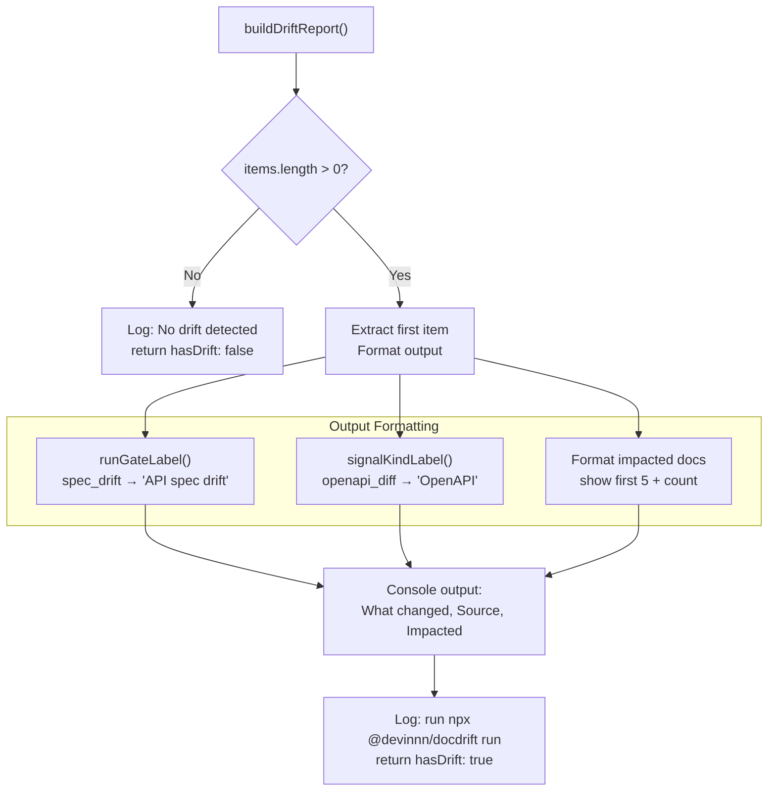

# drift_report.json

<details>
<summary>Relevant source files</summary>

The following files were used as context for generating this wiki page:

- [.docdrift/drift_report.json](.docdrift/drift_report.json)
- [docdrift-yml.md](docdrift-yml.md)
- [src/index.ts](src/index.ts)

</details>


## Purpose and Scope

The `drift_report.json` file is the primary output artifact produced by docdrift's detection pipeline. It contains structured metadata about detected documentation drift, including run context, drift items with signals, impacted documentation paths, and recommended actions. This file serves as the evidence base for policy decisions and Devin AI session creation.

For information about how this report is generated during detection, see [Detection Pipeline](#6.1). For details on how the report is consumed to build evidence bundles for Devin sessions, see [Evidence Bundles](#8.2). For other output artifacts, see [metrics.json](#10.2), [state.json](#10.3), and [run-output.json](#10.5).

---

## File Location and Lifecycle

The drift report is written to `.docdrift/drift_report.json` at the repository root during each detection run. It persists between runs and is overwritten on each execution.

### Generation Flow


**Sources:** [src/index.ts:210-217](), [src/index.ts:256-264]()

---

## Schema Structure

The drift report has two top-level sections: `run` metadata and `items` array.

### Top-Level Schema

| Field | Type | Required | Description |
|-------|------|----------|-------------|
| `run` | object | Yes | Metadata about the detection run itself |
| `items` | array | Yes | Array of drift items detected (may be empty) |

---

## Run Metadata

The `run` object captures the context in which drift detection was executed.

### Run Schema

| Field | Type | Required | Description |
|-------|------|----------|-------------|
| `repo` | string | Yes | Repository identifier (e.g. `"owner/repo"` or `"local/docdrift"` for local runs) |
| `baseSha` | string | Yes | Git SHA of the base commit for comparison |
| `headSha` | string | Yes | Git SHA of the head commit (or `"HEAD"` for local runs) |
| `trigger` | string | Yes | Trigger type: `"push"`, `"pull_request"`, `"schedule"`, or `"manual"` |
| `timestamp` | string | Yes | ISO 8601 timestamp when the run started |
| `prNumber` | number | No | Pull request number if `trigger` is `"pull_request"` |

### Example Run Object

```json
{
  "run": {
    "repo": "cameronking4/docdrift",
    "baseSha": "a1b2c3d4",
    "headSha": "e5f6g7h8",
    "trigger": "push",
    "timestamp": "2026-02-16T00:49:23.975Z"
  }
}
```

**Sources:** [.docdrift/drift_report.json:1-8](), [src/index.ts:256-264]()

---

## Items Array Structure

Each item in the `items` array represents a detected drift event, typically one per `docArea`. In the simplified v2 config (openapi + docsite), there is at most one item with `docArea: "docsite"`.

### Item Schema

| Field | Type | Required | Description |
|-------|------|----------|-------------|
| `docArea` | string | Yes | Name of the documentation area (e.g. `"docsite"`, `"api_reference"`) |
| `mode` | string | Yes | Detection mode: `"autogen"` or `"conceptual"` |
| `summary` | string | No | Human-readable summary of what changed |
| `signals` | array | Yes | Array of detection signals that triggered this item |
| `impactedDocs` | array | Yes | List of documentation file paths that may need updates |
| `recommendedAction` | string | No | Suggested next step (e.g. `"UPDATE_PR"`, `"REVIEW_REQUIRED"`) |
| `confidence` | number | No | Confidence score between 0 and 1 |

### Example Item

```json
{
  "docArea": "docsite",
  "mode": "autogen",
  "summary": "OpenAPI schema changes detected in /users endpoint",
  "signals": [
    {
      "kind": "openapi_diff",
      "confidence": 0.95,
      "details": {
        "endpoint": "POST /users",
        "changes": ["Added required field 'email'"]
      }
    }
  ],
  "impactedDocs": [
    "apps/docs-site/docs/api/users.md",
    "apps/docs-site/openapi/openapi.json"
  ],
  "recommendedAction": "UPDATE_PR",
  "confidence": 0.95
}
```

**Sources:** [src/index.ts:224-241]()

---

## Signal Object Structure

Signals are the atomic units of drift detection. Each signal represents evidence from a specific detection mechanism.

### Signal Schema

| Field | Type | Required | Description |
|-------|------|----------|-------------|
| `kind` | string | Yes | Signal type identifier |
| `confidence` | number | Yes | Confidence score for this signal (0-1) |
| `details` | object | No | Signal-specific metadata |
| `source` | string | No | Detection mechanism that generated this signal |

### Signal Kinds

| Kind | Detection Source | Confidence Typical |
|------|-----------------|-------------------|
| `openapi_diff` | OpenAPI spec comparison | 0.9-1.0 |
| `swagger2_diff` | Swagger 2.0 spec comparison | 0.9-1.0 |
| `graphql_diff` | GraphQL schema comparison | 0.9-1.0 |
| `fern_diff` | Fern definition comparison | 0.9-1.0 |
| `postman_diff` | Postman collection comparison | 0.8-0.9 |
| `heuristic_path_impact` | Path mapping heuristics | 0.5-0.8 |
| `infer_mode` | Inferred from file patterns | 0.3-0.6 |

### Signal Kind Display Labels

The codebase maps internal signal kinds to human-readable labels for display:


**Sources:** [src/index.ts:187-199]()

---

## Generation Pipeline

The drift report is generated by `buildDriftReport()` in the detection pipeline. This function orchestrates multiple detection mechanisms and aggregates their results.

### Detection to Report Flow


**Sources:** [src/index.ts:210-217](), [src/index.ts:256-264]()

---

## Consumption in Policy Engine

The drift report is the primary input to the policy decision engine, which determines whether to create a PR, update an existing PR, open an issue, or take no action.

### Policy Decision Flow


**Sources:** [src/index.ts:294-302]()

---

## Consumption in Evidence Bundle

The drift report is packaged into an evidence bundle when creating Devin AI sessions. The report is uploaded as an attachment and referenced in the session prompt.

### Evidence Bundle Creation


**Sources:** [src/index.ts:336-337](), [src/index.ts:96-99]()

---

## Empty Report Example

When no drift is detected, the report contains an empty `items` array:

```json
{
  "run": {
    "repo": "local/docdrift",
    "baseSha": "8d71d83ecbe54da77b0ab0bb396fd5161df715fa",
    "headSha": "HEAD",
    "trigger": "manual",
    "timestamp": "2026-02-16T00:49:23.975Z"
  },
  "items": []
}
```

**Sources:** [.docdrift/drift_report.json:1-10]()

---

## Report Processing in Detect Command

The `docdrift detect` command generates the report and provides human-readable output without triggering remediation:

### Detect Output Logic



**Sources:** [src/index.ts:201-242]()

---

## Report Processing in Run Command

The `docdrift run` command generates the report and uses it to trigger Devin sessions:

### Run Processing Flow

| Step | Function | Input | Output |
|------|----------|-------|--------|
| 1. Build Report | `buildDriftReport()` | config, baseSha, headSha | `report`, `runGate`, `aggregated` |
| 2. Check Gate | Logic in `runDocDrift()` | `runGate`, `report.items` | Continue or exit early |
| 3. Policy Decision | `decidePolicy()` | `report.items[0]`, state, config | Policy action |
| 4. Build Evidence | `buildEvidenceBundle()` | `runInfo`, `item` from report | Evidence bundle |
| 5. Execute Session | `executeSessionSingle()` | attachments, aggregated | Session outcome |

**Sources:** [src/index.ts:244-530]()

---

## Field Reference

### Comprehensive Field List

| JSON Path | Type | Optional | Description |
|-----------|------|----------|-------------|
| `run.repo` | string | No | Repository identifier |
| `run.baseSha` | string | No | Base commit SHA |
| `run.headSha` | string | No | Head commit SHA |
| `run.trigger` | string | No | Trigger type |
| `run.timestamp` | string | No | ISO 8601 timestamp |
| `run.prNumber` | number | Yes | PR number if applicable |
| `items` | array | No | Drift items (may be empty) |
| `items[].docArea` | string | No | Doc area name |
| `items[].mode` | string | No | `"autogen"` or `"conceptual"` |
| `items[].summary` | string | Yes | Human-readable summary |
| `items[].signals` | array | No | Detection signals |
| `items[].signals[].kind` | string | No | Signal type identifier |
| `items[].signals[].confidence` | number | No | Confidence score 0-1 |
| `items[].signals[].details` | object | Yes | Signal-specific data |
| `items[].signals[].source` | string | Yes | Detection mechanism |
| `items[].impactedDocs` | array | No | Impacted doc file paths |
| `items[].recommendedAction` | string | Yes | Suggested action |
| `items[].confidence` | number | Yes | Overall confidence |

**Sources:** [src/index.ts:224-241](), [.docdrift/drift_report.json:1-10]()

---

## Integration Points

The drift report integrates with multiple subsystems:

### System Integration Map


**Sources:** [src/index.ts:201-242](), [src/index.ts:244-530]()

---

## Run Gate Context

The drift report is generated alongside a `runGate` value that determines the priority and confidence of detected drift:

### Run Gate to Report Mapping

| Run Gate | Typical Signal Kinds | Item Confidence | Policy Behavior |
|----------|---------------------|-----------------|-----------------|
| `spec_drift` | `openapi_diff`, `graphql_diff` | 0.9-1.0 | High priority, auto-patch likely |
| `conceptual_only` | `heuristic_path_impact` | 0.5-0.8 | Medium priority, may require review |
| `infer` | `infer_mode` | 0.3-0.6 | Low priority, low confidence |
| `none` | (empty items array) | N/A | No action taken |

**Sources:** [src/index.ts:172-185]()

---