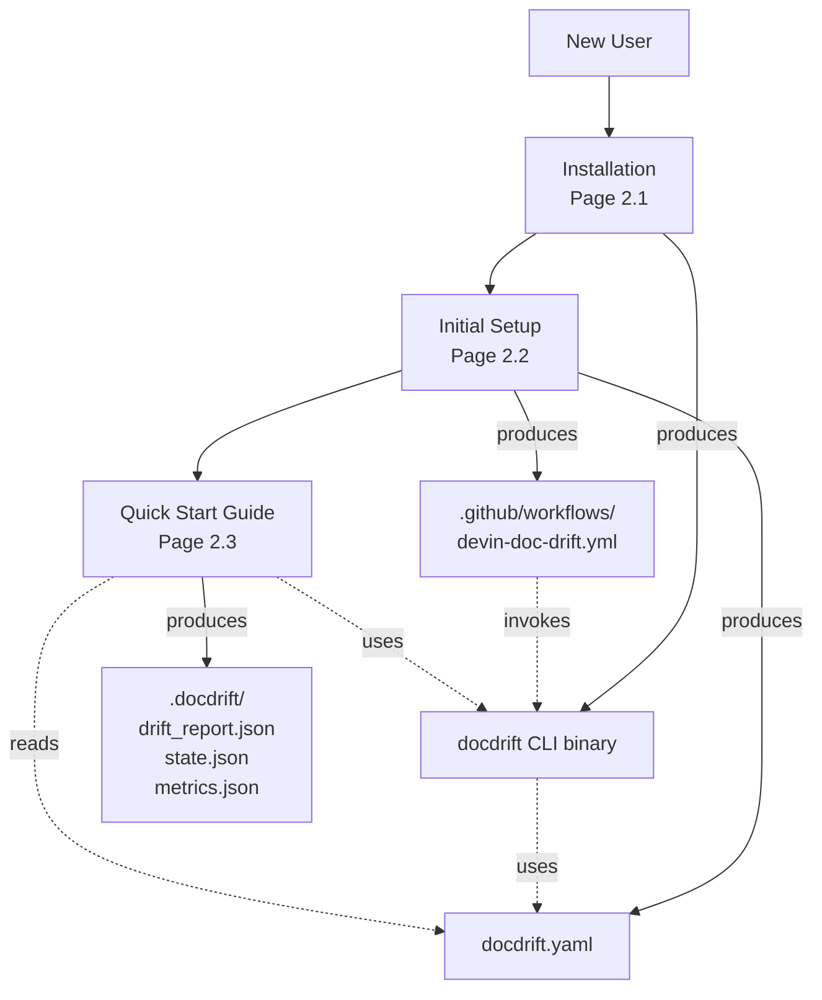
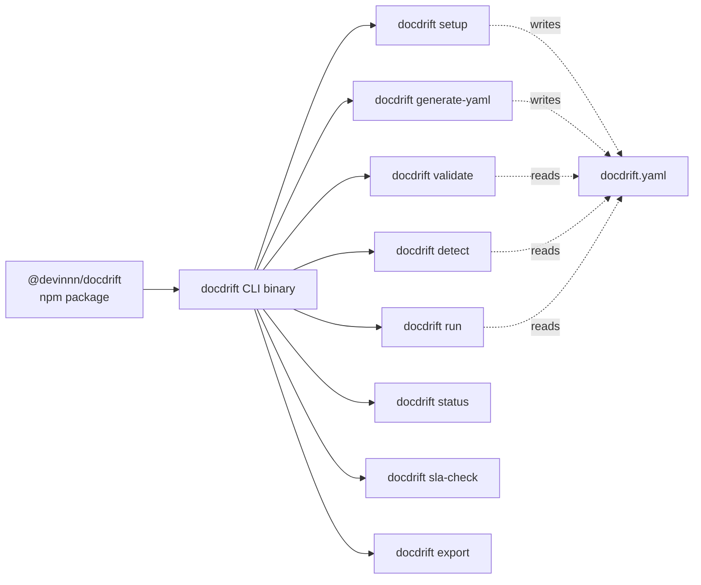
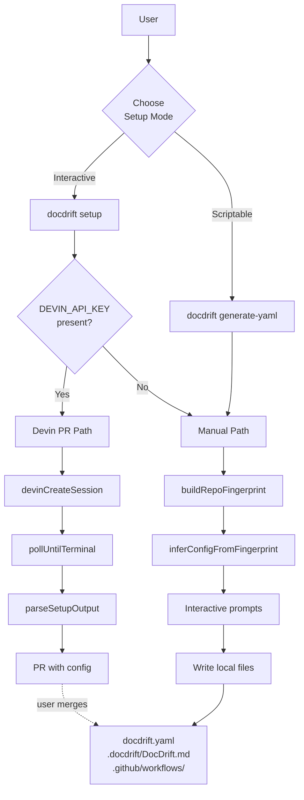
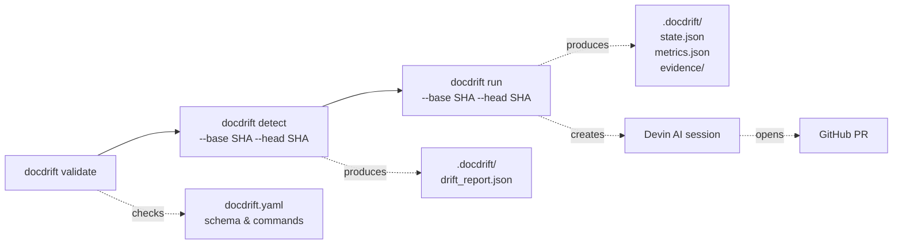
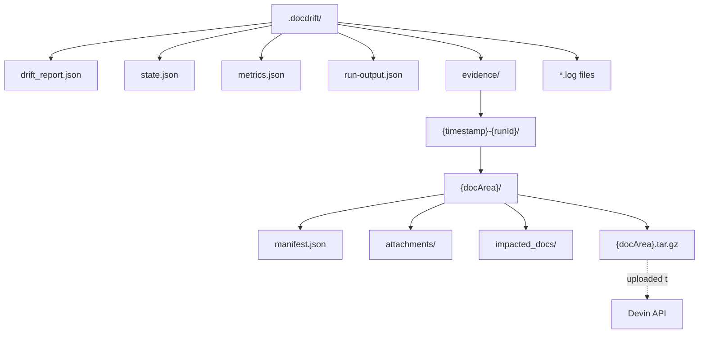

# Getting Started

<details>
<summary>Relevant source files</summary>

The following files were used as context for generating this wiki page:

- [.gitignore](.gitignore)
- [README.md](README.md)
- [package.json](package.json)

</details>


This page guides you through the complete getting started journey with docdrift, from installation to running your first drift detection and remediation. The process consists of three main steps:

1. **Installation** — Install the `@devinnn/docdrift` npm package
2. **Setup** — Generate a `docdrift.yaml` configuration file
3. **First Run** — Execute drift detection and remediation

Each step is covered in detail in the child pages. This overview introduces the workflow and key concepts.

## Overview of Getting Started Flow

The getting started workflow follows a linear progression from installation through configuration to execution:



**Sources:** [README.md:33-41](), [package.json:8]()

## Prerequisites

Before starting, ensure your environment meets these requirements:

| Requirement | Details | Verified By |
|------------|---------|-------------|
| Node.js | >=20 | `node --version` |
| Git repository | At least 2 commits | `git log --oneline` |
| DEVIN_API_KEY | For AI remediation | Environment variable |
| GITHUB_TOKEN | Optional, for GitHub API | Environment variable |

The CLI performs commit-to-commit comparisons to detect drift, so a Git repository with history is required. The `DEVIN_API_KEY` is needed only for the `run` command (full remediation); the `detect` command (drift checking only) does not require it.

**Sources:** [package.json:11-13](), [README.md:36-40]()

## Installation Overview

The `@devinnn/docdrift` package can be installed via npm or used directly with `npx`. The package exposes a `docdrift` CLI binary that provides eight commands:



The three primary installation methods are:

1. **Direct execution with npx** — No installation required, recommended for first-time setup
2. **Local package installation** — Install as a dependency for scripting
3. **CI/CD integration** — Use in GitHub Actions workflows

For detailed installation instructions, environment setup, and verification steps, see [Installation](#2.1).

**Sources:** [package.json:7-8](), [README.md:17-25]()

## Setup Overview

After installation, you must generate a `docdrift.yaml` configuration file that defines how drift is detected and remediated for your repository. The setup system provides two modes:

**Setup Command Modes**

| Mode | Command | Method | Output Location |
|------|---------|--------|-----------------|
| **Interactive** | `docdrift setup` | Manual or Devin PR | Local files or PR |
| **Scriptable** | `docdrift generate-yaml` | Manual only | Local files |



The **Manual path** scans your repository, infers configuration using AI or heuristics, prompts for confirmation, and writes files locally. The **Devin PR path** creates a Devin AI session that analyzes your repository and opens a PR with generated configuration files.

For detailed setup instructions, configuration inference, and the interactive workflow, see [Initial Setup](#2.2).

**Sources:** [README.md:33-41]()

## Running Your First Drift Detection

After setup completes, you can run drift detection. The workflow consists of three progressively more comprehensive commands:

**Core Commands Workflow**



| Command | Purpose | Requires API Key | Creates PR |
|---------|---------|-----------------|------------|
| `validate` | Check config validity | No | No |
| `detect` | Detect drift only | No | No |
| `run` | Full detection + remediation | Yes | Yes |

**Basic Execution Pattern**

```bash
# Step 1: Validate configuration
npx @devinnn/docdrift validate

# Step 2: Detect drift (dry run)
npx @devinnn/docdrift detect --base <base-sha> --head <head-sha>

# Step 3: Run full workflow (requires DEVIN_API_KEY)
export DEVIN_API_KEY=your_api_key_here
npx @devinnn/docdrift run --base <base-sha> --head <head-sha>
```

The `run` command executes the complete pipeline: validates config, builds drift report, applies policy decisions, creates evidence bundles, uploads to Devin, creates AI session, polls for completion, and posts GitHub comments.

For a detailed walkthrough with real examples, output interpretation, and troubleshooting, see [Quick Start Guide](#2.3).

**Sources:** [README.md:17-25](), [README.md:47-56]()

## Understanding Output Artifacts

All docdrift outputs are written to the `.docdrift/` directory in your repository root. This directory contains detection reports, state files, metrics, and evidence bundles:

**Output Directory Structure**



| File | Generated By | Purpose |
|------|--------------|---------|
| `drift_report.json` | `detect`, `run` | Structured drift findings with confidence scores |
| `state.json` | `run` | Persistent state for PR history and rate limiting |
| `metrics.json` | `run` | Timing data, drift counts, policy decisions |
| `run-output.json` | `run` | Per-area outcomes and session URLs |
| `evidence/{runId}/` | `run` | Evidence bundles uploaded to Devin |

The `.docdrift/` directory should typically be added to `.gitignore` to avoid committing transient artifacts. Only `docdrift.yaml` and potentially `.docdrift/DocDrift.md` should be version-controlled.

For detailed documentation of each artifact's structure and contents, see [Output and Artifacts](#10).

**Sources:** [.gitignore:5-8]()

## Verification and Troubleshooting

After completing setup and first run, verify the system is working correctly:

**Verification Checklist**

| Check | Command | Expected Output |
|-------|---------|-----------------|
| Config valid | `docdrift validate` | "Configuration is valid" |
| CLI accessible | `which docdrift` | Path to binary |
| Git history | `git log --oneline \| wc -l` | At least 2 commits |
| Environment | `echo $DEVIN_API_KEY` | Non-empty for `run` |

**Common Issues**

| Symptom | Cause | Solution |
|---------|-------|----------|
| `command not found: docdrift` | Package not installed | Run `npm install -g @devinnn/docdrift` |
| "No drift detected" | No API spec changes | Change an API endpoint and commit |
| Session timeout | Network issues | Check firewall, retry with `--verbose` |
| Config validation fails | Invalid YAML | Check syntax with `yamllint docdrift.yaml` |

For detailed troubleshooting steps and advanced configuration examples, see [Quick Start Guide](#2.3).

**Sources:** [README.md:17-25]()

## Next Steps

After completing initial setup and running your first drift detection, explore:

- [Configuration](#2.2) for detailed configuration options
- [CLI Reference](#3) for complete command documentation  
- [Detection System](#4) to understand the three-tier detection mechanism
- [Policy Engine](#5) to learn about decision logic and noise reduction
- [Devin Integration](#6) for information about AI-powered remediation

---