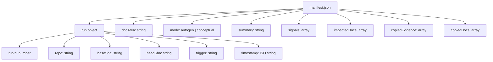
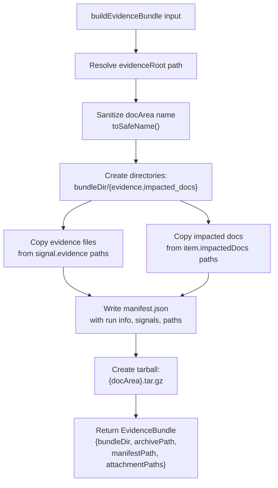
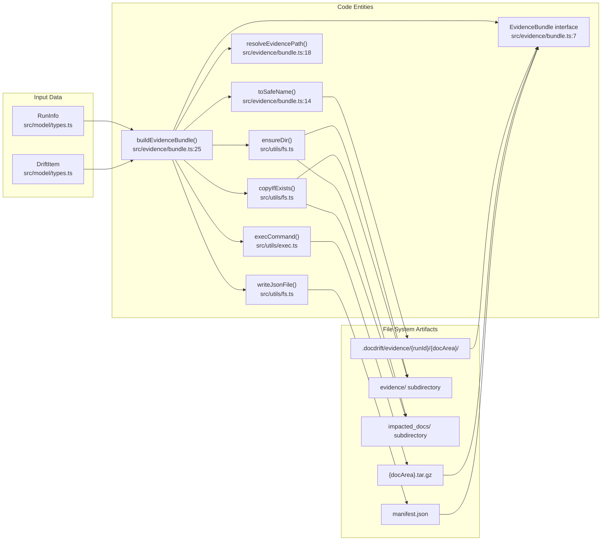
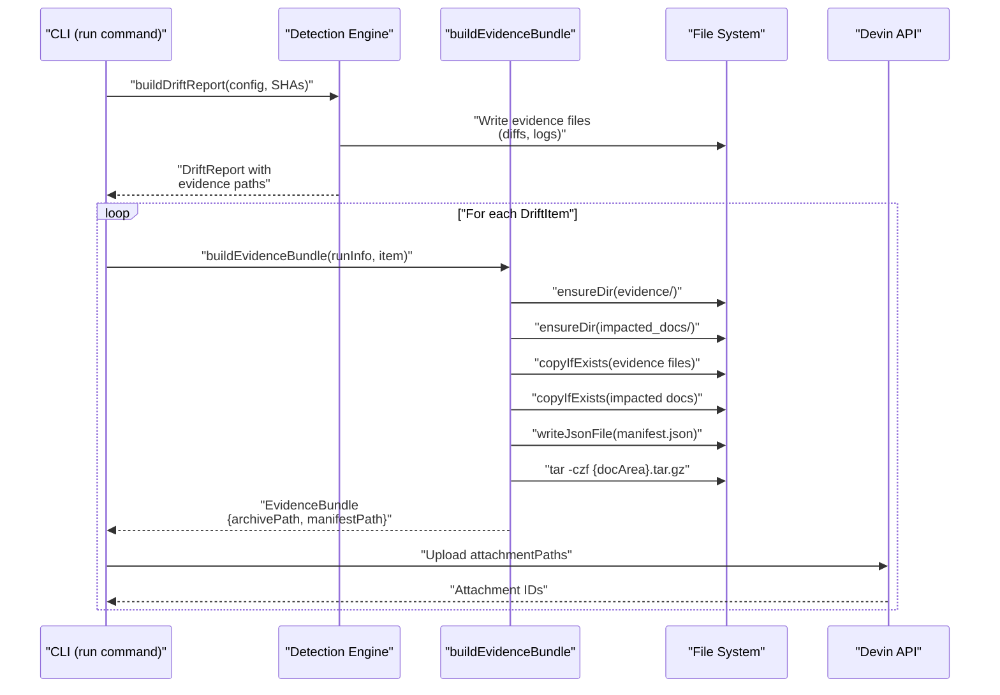

# Evidence Directory Structure

<details>
<summary>Relevant source files</summary>

The following files were used as context for generating this wiki page:

- [.github/workflows/devin-doc-drift.yml](.github/workflows/devin-doc-drift.yml)
- [docdrift-yml.md](docdrift-yml.md)
- [src/config/validate.ts](src/config/validate.ts)
- [src/devin/prompts.ts](src/devin/prompts.ts)
- [src/github/client.ts](src/github/client.ts)
- [src/index.ts](src/index.ts)

</details>


## Purpose and Scope

This document describes the hierarchical directory structure used to organize evidence bundles in the `.docdrift/` directory. Evidence bundles contain all artifacts needed for Devin AI sessions to remediate detected drift, including signal evidence files, impacted documentation files, and metadata manifests. Each bundle is organized by run ID and doc area, then compressed into tarballs for upload.

For information about the drift detection report that references evidence paths, see [drift_report.json](#8.1). For details on Devin session integration and how evidence bundles are uploaded, see [Evidence Bundles](#6.1).

## Directory Hierarchy

Evidence is stored under `.docdrift/evidence/` with the following structure:

```
.docdrift/
├── evidence/
│   └── {runId}/                    # Timestamp-based run identifier
│       ├── {docArea}/              # Doc area name (sanitized)
│       │   ├── evidence/           # Signal evidence files
│       │   │   └── *.diff.txt
│       │   │   └── *.log
│       │   ├── impacted_docs/      # Copies of affected docs
│       │   │   └── docs_reference_*.json
│       │   │   └── docs_reference_*.md
│       │   └── manifest.json       # Bundle metadata
│       └── {docArea}.tar.gz        # Compressed archive
```

The `{runId}` is a timestamp (e.g., `1771047518477`) generated at runtime. The `{docArea}` is sanitized to replace special characters with underscores (e.g., `api_reference`).

**Sources:** [src/evidence/bundle.ts:25-94](), [README.md:98]()

## Evidence Subdirectory

The `evidence/` subdirectory within each doc area bundle contains files referenced by drift signals. These are typically:

| File Type | Description | Example |
|-----------|-------------|---------|
| OpenAPI diffs | Textual diffs between generated and published specs | `api_reference.openapi.diff.txt` |
| Command logs | Output from failed validation commands | `docs_check.log` |
| Path analysis | Heuristic impact analysis results | `auth_impact.txt` |

Evidence files are copied from their source locations (specified in `signal.evidence` arrays) and renamed using `toSafeName()` to sanitize filenames. The function at [src/evidence/bundle.ts:14-16]() replaces non-alphanumeric characters (except `.`, `_`, `-`) with underscores.

**Sources:** [src/evidence/bundle.ts:39-49](), [.docdrift/drift_report.json:18-20]()

## Impacted Docs Subdirectory

The `impacted_docs/` subdirectory contains copies of documentation files affected by the detected drift. These files provide context for Devin AI sessions, allowing the agent to understand the current state of documentation before making changes.

Files are copied from paths listed in `driftItem.impactedDocs` and stored with sanitized names. For example:
- `docs/reference/openapi.json` → `docs_reference_openapi.json`
- `docs/guides/auth.md` → `docs_guides_auth.md`

The relative paths (relative to the bundle directory) are recorded in `manifest.json` under `copiedDocs`.

**Sources:** [src/evidence/bundle.ts:51-58](), [.docdrift/drift_report.json:23-26]()

## Manifest Structure



**Manifest Structure Diagram**

Each bundle directory contains a `manifest.json` file with the following structure:

| Field | Type | Description |
|-------|------|-------------|
| `run` | `object` | Run metadata including `runId`, `repo`, `baseSha`, `headSha`, `trigger`, `timestamp` |
| `docArea` | `string` | Name of the documentation area |
| `mode` | `string` | Either `"autogen"` or `"conceptual"` |
| `summary` | `string` | Human-readable drift summary |
| `signals` | `array` | Array of signal objects with `kind`, `tier`, `confidence`, `evidence` |
| `impactedDocs` | `array` | Original paths of affected documentation files |
| `copiedEvidence` | `array` | Relative paths of copied evidence files within bundle |
| `copiedDocs` | `array` | Relative paths of copied documentation files within bundle |

The manifest provides a self-contained record of what the bundle contains and why it was created.

**Sources:** [src/evidence/bundle.ts:60-77]()

## Bundle Creation Process



**Evidence Bundle Creation Flow**

The `buildEvidenceBundle` function at [src/evidence/bundle.ts:25-94]() orchestrates the creation process:

1. **Resolve paths** - Converts the `evidenceRoot` (typically `.docdrift/evidence/{runId}`) to an absolute path
2. **Sanitize names** - Applies `toSafeName()` to the doc area to create a safe directory name
3. **Create directories** - Uses `ensureDir()` to create `{bundleDir}/evidence` and `{bundleDir}/impacted_docs`
4. **Copy evidence files** - Iterates through `signal.evidence` arrays, resolving absolute paths and copying to `evidence/` subdirectory
5. **Copy impacted docs** - Iterates through `item.impactedDocs`, copying to `impacted_docs/` subdirectory
6. **Write manifest** - Generates `manifest.json` with run metadata, signals, and relative paths of copied files
7. **Create tarball** - Executes `tar -czf` command to compress the bundle directory into `{docArea}.tar.gz`

The function returns an `EvidenceBundle` object containing paths to the bundle directory, archive, manifest, and an array of attachment paths for upload.

**Sources:** [src/evidence/bundle.ts:25-94]()

## Code Entity Mapping



**Code-to-Artifact Mapping Diagram**

**Sources:** [src/evidence/bundle.ts:1-99]()

## Tarball Creation

The tarball is created using the `tar` command via `execCommand()` from [src/utils/exec.ts](). The command executed is:

```bash
tar -czf {bundleDir}.tar.gz -C {parent} {name}
```

Where:
- `{bundleDir}.tar.gz` is the output archive path (e.g., `.docdrift/evidence/1771047518477/api_reference.tar.gz`)
- `{parent}` is the parent directory (e.g., `.docdrift/evidence/1771047518477/`)
- `{name}` is the directory name to compress (e.g., `api_reference`)

The `-C` flag changes to the parent directory before archiving, ensuring the tarball contains relative paths starting from the doc area name rather than absolute paths. If the command fails (non-zero exit code), an error is thrown with the stderr/stdout output.

The tarball path is included in the `EvidenceBundle.attachmentPaths` array along with the manifest path, enabling both files to be uploaded to Devin AI sessions.

**Sources:** [src/evidence/bundle.ts:79-93]()

## Attachment Paths

The `EvidenceBundle` interface at [src/evidence/bundle.ts:7-12]() returns:

```typescript
interface EvidenceBundle {
  bundleDir: string;        // Full path to uncompressed bundle
  archivePath: string;       // Path to .tar.gz file
  manifestPath: string;      // Path to manifest.json
  attachmentPaths: string[]; // [archivePath, manifestPath]
}
```

The `attachmentPaths` array contains exactly two files that are uploaded to Devin API:
1. The compressed tarball (`{docArea}.tar.gz`) containing all evidence and impacted docs
2. The standalone manifest (`manifest.json`) for quick reference without decompression

This dual-upload approach allows Devin sessions to quickly read metadata from the manifest while having full access to all files via the tarball.

**Sources:** [src/evidence/bundle.ts:7-12](), [src/evidence/bundle.ts:88-93]()

## Storage and Cleanup

Evidence bundles are organized by run ID to prevent conflicts between concurrent or sequential runs. Each run creates a new timestamped directory, allowing:

- **Parallel execution** - Multiple runs can execute simultaneously without collision
- **Historical retention** - Previous runs remain available for auditing
- **Selective cleanup** - Old evidence can be deleted by removing entire run directories

The `.docdrift/` directory should be added to `.gitignore` in consuming repositories to prevent committing run artifacts. The directory structure enables simple cleanup strategies:

```bash
# Remove all evidence older than 7 days
find .docdrift/evidence -type d -mtime +7 -exec rm -rf {} +

# Remove specific run
rm -rf .docdrift/evidence/1771047518477
```

**Sources:** [README.md:32](), [README.md:98-100]()

## Integration with Detection Flow



**Evidence Bundle Integration Flow**

The evidence directory structure is created during the `run` command flow after drift detection completes. The detection engine writes evidence files (diffs, logs) to temporary locations, which are then organized into structured bundles by doc area. Each bundle is compressed and uploaded to Devin API as session attachments, providing the AI agent with all necessary context for remediation.

**Sources:** [src/evidence/bundle.ts:25-94](), [README.md:34-42]()

---