# Project Structure

<details>
<summary>Relevant source files</summary>

The following files were used as context for generating this wiki page:

- [package.json](package.json)

</details>


This page documents the physical organization of the DocDrift repository, including directory structure, key files, and their relationships. This guide is intended for developers who want to understand where to find specific functionality, how modules relate to each other, and how the build system works.

For information about the logical architecture and system components, see [Architecture](#1.1). For build and test commands, see [Building and Testing](#11.2).

---

## Overview

The DocDrift repository is organized as a TypeScript project with the following top-level structure:

```
docdrift/
├── src/              # Core CLI and detection engine
├── apps/             # Example applications
├── scripts/          # Build and validation utilities
├── .github/          # GitHub Actions workflows
├── .docdrift/        # Runtime output directory
├── dist/             # Compiled JavaScript output
├── package.json      # NPM package configuration
├── tsconfig.json     # TypeScript compiler configuration
├── docdrift.yaml     # DocDrift configuration
└── README.md         # User documentation
```

The codebase follows a clear separation between:
- **Source code** (`src/`, `apps/`) - TypeScript source files
- **Build artifacts** (`dist/`) - Compiled JavaScript
- **Runtime outputs** (`.docdrift/`) - Detection results and evidence
- **Configuration** (root level) - Project and system configuration

**Sources:** [package.json:1-42](), [.gitignore:1-11]()

---

## Directory Structure

### Core Source Directory (`src/`)

The `src/` directory contains the core DocDrift system implementation. Based on the entry points defined in `package.json`, the structure includes:

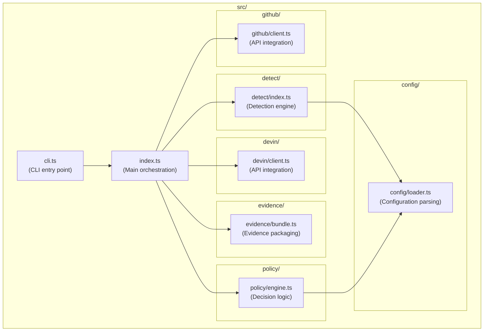

**Key Files:**

| File Path | Purpose | Exported Symbols |
|-----------|---------|------------------|
| `src/cli.ts` | CLI entry point, argument parsing | `main()` function |
| `src/index.ts` | Main orchestration, command implementations | `runValidate()`, `runDetect()`, `runDocDrift()`, `runStatus()` |
| `src/detect/index.ts` | Three-tier detection engine | `buildDriftReport()` |
| `src/evidence/bundle.ts` | Evidence collection and tarball creation | `createEvidenceBundle()` |
| `src/policy/` | Policy engine and decision logic | `decidePolicy()` |
| `src/devin/` | Devin API client and session management | Devin client classes |
| `src/github/` | GitHub API client for issues and comments | GitHub client classes |
| `src/config/` | Configuration loading and validation | `loadConfig()` |

**Sources:** [package.json:6-9](), [src/cli.ts:1-67]()

---

### Example Applications (`apps/`)

The `apps/` directory contains example applications that demonstrate DocDrift capabilities. Currently, this includes a Fastify-based API server used for OpenAPI drift detection testing.

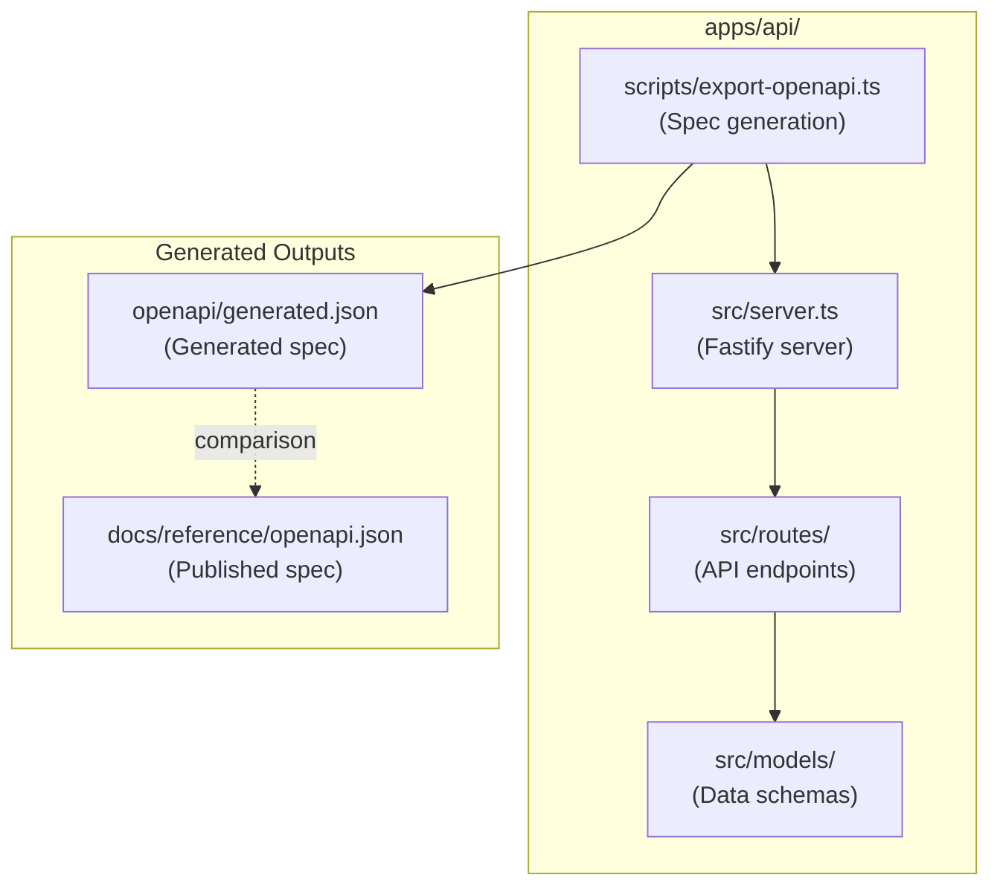

**Directory Contents:**

| Path | Purpose |
|------|---------|
| `apps/api/src/server.ts` | Fastify server setup and routing |
| `apps/api/src/routes/users.ts` | User management endpoints |
| `apps/api/src/models/user.ts` | User schema definitions with Zod |
| `apps/api/scripts/export-openapi.ts` | OpenAPI spec generation script |

The API application serves two purposes:
1. **Demonstration** - Shows how DocDrift detects OpenAPI drift
2. **Testing** - Provides a real codebase for integration tests

**Sources:** [package.json:23](), High-Level Diagram references to `apps/api/scripts/export-openapi.ts`

---

### Build Utilities (`scripts/`)

The `scripts/` directory contains Node.js scripts for build validation and utilities.

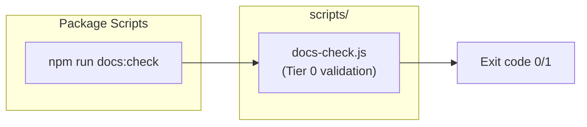

**Known Scripts:**

| File | Purpose | Invocation |
|------|---------|------------|
| `scripts/docs-check.js` | Validates documentation builds correctly | `npm run docs:check` |

This script is referenced in `docdrift.yaml` configurations as the Tier 0 detection command. It typically checks that documentation can be built without errors, links are valid, and formatting is correct.

**Sources:** [package.json:24](), High-Level Diagram Tier 0 references

---

## Configuration Files

### Package Configuration (`package.json`)

The package configuration defines the NPM package structure and available commands.

**Key Configuration Sections:**

| Section | Purpose |
|---------|---------|
| `name` | Package name: `@devinnn/docdrift` |
| `version` | Semantic version: `0.1.0` |
| `main` | Entry point: `dist/src/index.js` |
| `bin.docdrift` | CLI executable: `dist/src/cli.js` |
| `engines.node` | Required Node.js version: `>=20` |
| `files` | Published files: `dist/src` only |
| `scripts` | Development and build commands |

**Available Scripts:**

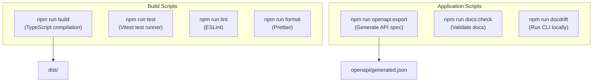

**Sources:** [package.json:1-42]()

---

### TypeScript Configuration (`tsconfig.json`)

While not shown in the provided files, the repository uses TypeScript with a `tsconfig.json` that compiles `src/` to `dist/`.

**Expected Configuration:**
- **Input:** `src/**/*.ts`, `apps/**/*.ts`
- **Output:** `dist/` (with directory structure preserved)
- **Target:** ES2022 or later (Node.js 20+)
- **Module:** CommonJS (as specified in `package.json`)

**Sources:** [package.json:10-13,19]()

---

### DocDrift Configuration (`docdrift.yaml`)

The `docdrift.yaml` file is the primary user-facing configuration file for DocDrift itself. This is where users define doc areas, detection rules, and policy settings.

The structure and options are fully documented in [Configuration Reference](#9). For loading and validation internals, see [Configuration Loading](#11.3).

**Sources:** High-Level Diagram references, [Configuration Reference](#9)

---

## Build Outputs

### Compiled Distribution (`dist/`)

The `dist/` directory contains compiled JavaScript files from TypeScript source. This directory is:
- **Generated** by `npm run build`
- **Published** to npm (as specified in `package.json` `files` field)
- **Gitignored** (not committed to version control)

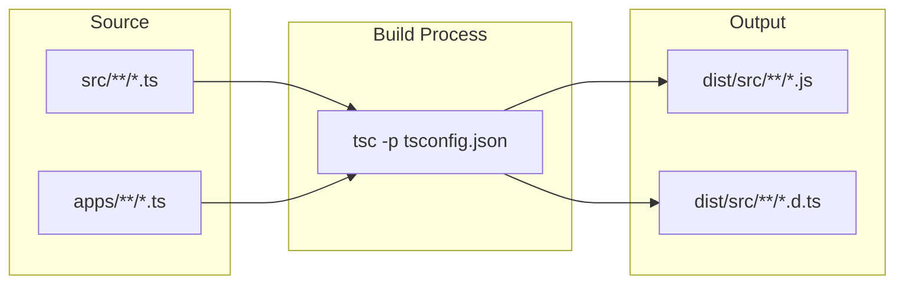

**Structure:**

```
dist/
└── src/
    ├── cli.js           # CLI entry (executable)
    ├── index.js         # Main exports
    ├── detect/
    │   └── index.js
    ├── evidence/
    │   └── bundle.js
    └── ...
```

The `package.json` `bin` field points to `dist/src/cli.js`, making it executable via the `docdrift` command after installation.

**Sources:** [package.json:6-9,14,19](), [.gitignore:2]()

---

## Runtime Directories

### Output Directory (`.docdrift/`)

The `.docdrift/` directory is created at runtime in the consuming repository. It stores all detection results, evidence, state, and logs.

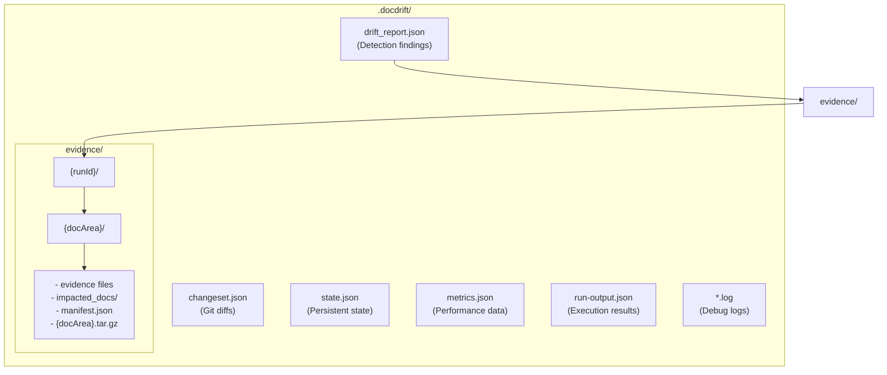

**Key Files:**

| File | Purpose | Gitignored |
|------|---------|------------|
| `drift_report.json` | Complete detection results with all drift items | No (committed) |
| `changeset.json` | Git diffs between base and head SHAs | No (committed) |
| `state.json` | PR counts, session history, idempotency tracking | Yes (runtime only) |
| `metrics.json` | Performance timing data | No (committed) |
| `run-output.json` | Final command output summary | Yes (runtime only) |
| `evidence/{runId}/{docArea}/` | Evidence bundles per doc area | Yes (large files) |
| `*.log` | Debug and trace logs | Yes (runtime only) |

**Gitignore Strategy:**

The `.gitignore` file selectively ignores runtime-only files while allowing committed artifacts:

```
.docdrift/evidence    # Evidence bundles (large, temporary)
.docdrift/*.log       # Log files (debugging only)
.docdrift/state.json  # Persistent state (changes frequently)
.docdrift/run-output.json  # Command output (runtime)
```

This allows the drift report and metrics to be committed for historical tracking while keeping large evidence files and frequently-changing state out of version control.

**Sources:** [.gitignore:4-7](), High-Level Diagram "Artifact Generation and Storage"

---

## Module Dependencies

The following diagram shows the dependency relationships between major source modules:

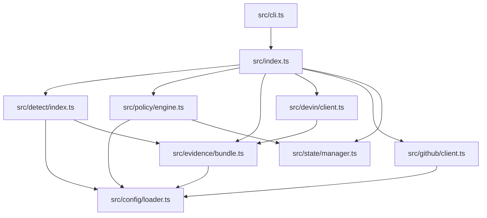

**Import Patterns:**

- `src/cli.ts` imports command implementations from `src/index.ts`
- `src/index.ts` orchestrates all subsystems (detect, policy, devin, github)
- Detection engine (`src/detect/`) depends on configuration and evidence modules
- Policy engine (`src/policy/`) depends on configuration and state modules
- External service clients (devin, github) are isolated with no cross-dependencies

This architecture maintains clear separation of concerns with unidirectional dependencies flowing from high-level orchestration down to low-level utilities.

**Sources:** [src/cli.ts:1-10](), High-Level Architecture Diagrams

---

## Entry Points

### CLI Entry Point

The `docdrift` command resolves to `dist/src/cli.js` when installed:

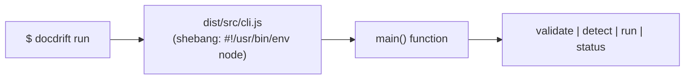

The CLI uses a simple switch statement to route to command implementations in `src/index.ts`:

| Command | Function | Description |
|---------|----------|-------------|
| `validate` | `runValidate()` | Validate configuration and environment |
| `detect` | `runDetect()` | Build drift report without remediation |
| `run` | `runDocDrift()` | Full detection and remediation workflow |
| `status` | `runStatus()` | Check recent Devin sessions |

**Sources:** [package.json:8](), [src/cli.ts:1-67]()

---

### Programmatic Entry Point

The main module exports can be imported by other Node.js applications:

```typescript
import {
  runValidate,
  runDetect,
  runDocDrift,
  runStatus,
  // ... other exports
} from '@devinnn/docdrift';
```

The `package.json` `main` field points to `dist/src/index.js`, which exports all public APIs.

**Sources:** [package.json:6]()

---

## Build Process Flow

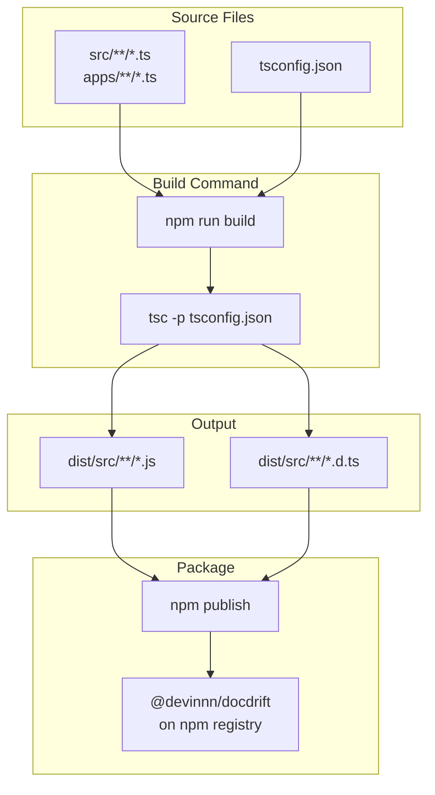

**Build Steps:**

1. **Compile:** `npm run build` runs TypeScript compiler
2. **Output:** JavaScript and type definitions written to `dist/src/`
3. **Package:** Only `dist/src/` is included in published package (per `files` field)
4. **Execute:** CLI entry point `dist/src/cli.js` becomes the `docdrift` command

**Sources:** [package.json:14,19]()

---

## GitHub Integration Structure

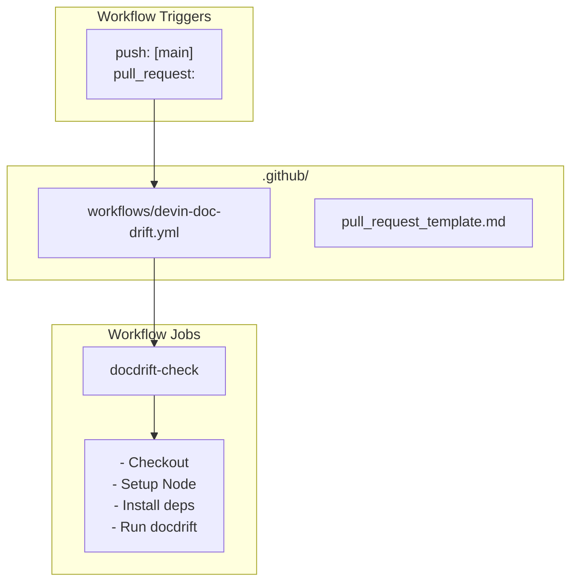

**GitHub Integration Files:**

| File | Purpose |
|------|---------|
| `.github/workflows/devin-doc-drift.yml` | GitHub Actions workflow for CI/CD |
| `.github/pull_request_template.md` | PR template for docdrift-generated PRs (expected) |

The workflow automatically runs DocDrift on pushes and pull requests, detecting drift and creating remediation PRs when appropriate.

**Sources:** High-Level Diagram "External Service Integration", [GitHub Actions Workflow](#7.1)

---

## Development Workflow

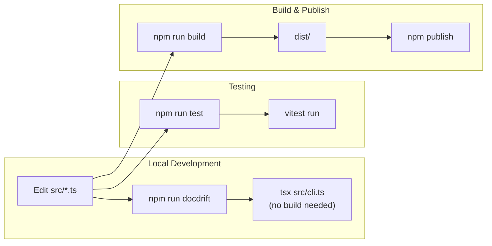

**Development Scripts:**

- **`npm run docdrift`** - Run CLI directly from source using `tsx` (no build required)
- **`npm run test`** - Run test suite with Vitest
- **`npm run lint`** - Lint code with ESLint
- **`npm run format`** - Format code with Prettier
- **`npm run build`** - Compile TypeScript to JavaScript
- **`npm run openapi:export`** - Generate OpenAPI spec from example API
- **`npm run docs:check`** - Validate documentation builds

The `tsx` package allows running TypeScript directly without compilation during development, speeding up the edit-test cycle.

**Sources:** [package.json:18-26]()

---