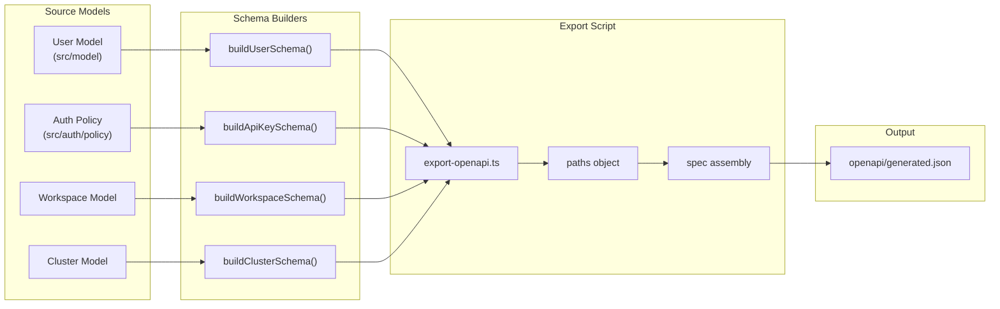
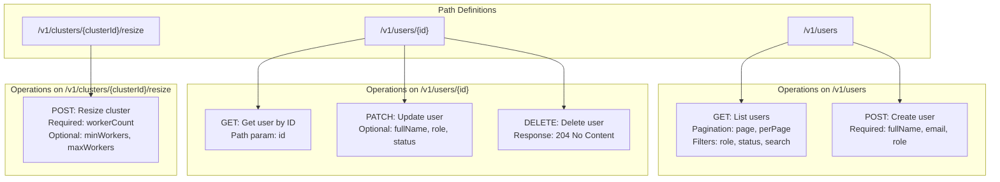
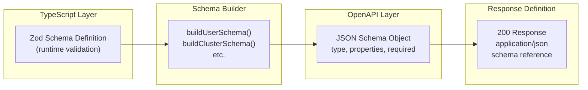
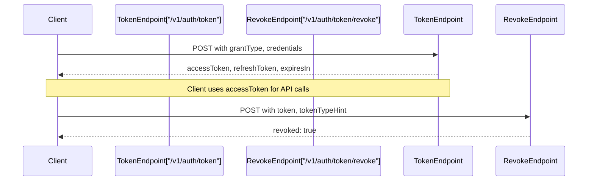
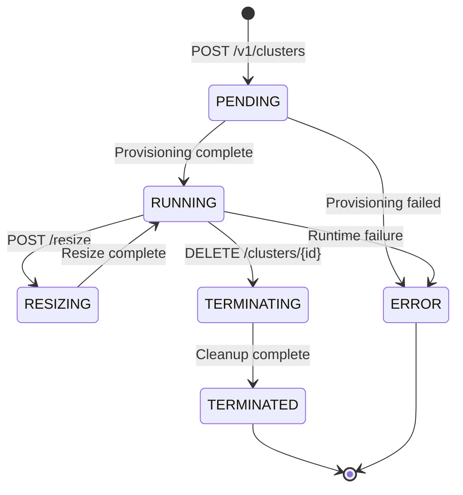
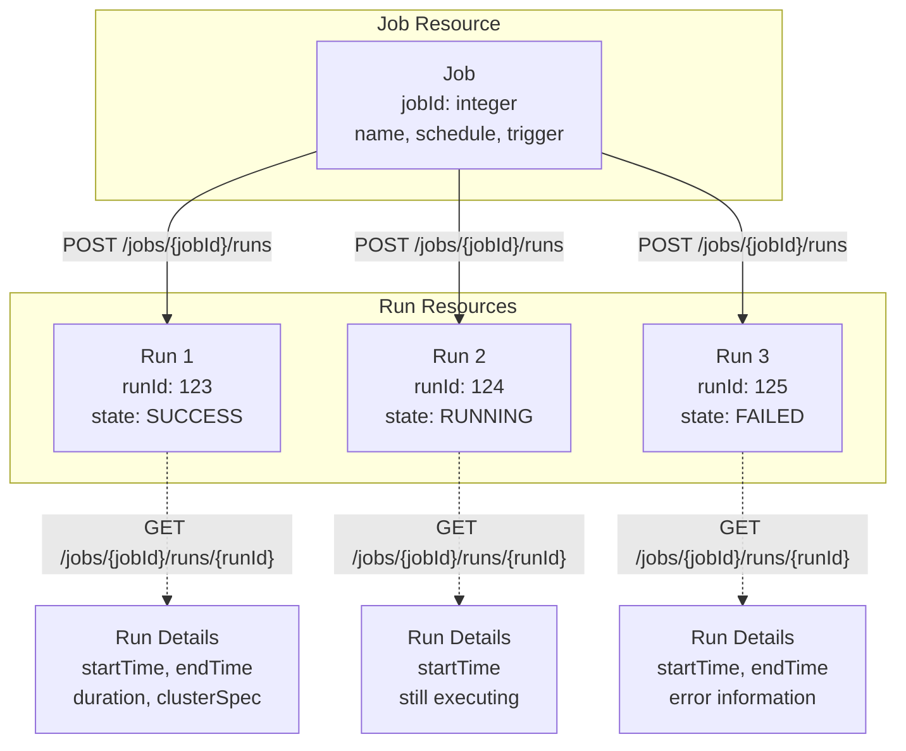
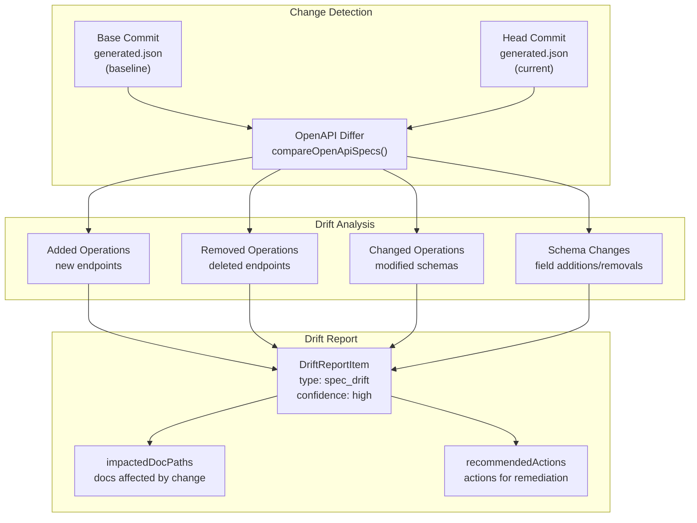
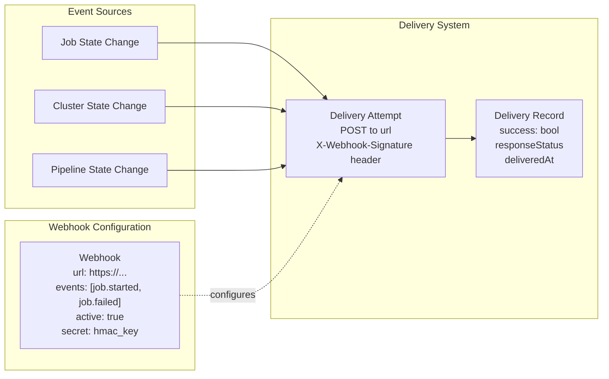

# OpenAPI Specification

<details>
<summary>Relevant source files</summary>

The following files were used as context for generating this wiki page:

- [apps/api/scripts/export-openapi.ts](apps/api/scripts/export-openapi.ts)
- [openapi/generated.json](openapi/generated.json)

</details>


This document describes the OpenAPI 3.1.0 specification generated for the DataStack API example and how it demonstrates spec-based drift detection in docdrift. The specification is generated programmatically from TypeScript schema definitions and serves as the source of truth for API documentation.

For information about how docdrift detects changes in this specification, see [Spec Provider Detection](#6.2). For the script that generates this specification, see [Schema Generation Script](#11.3). For example endpoints defined in this spec, see [Example API Endpoints](#11.4).

---

## Spec Overview

The DataStack API OpenAPI specification is located at [openapi/generated.json:1-3691]() and defines a comprehensive REST API for a data platform service. The specification follows OpenAPI 3.1.0 standards and includes 34 endpoints across 9 functional areas.

**Specification Metadata:**

| Field | Value |
|-------|-------|
| OpenAPI Version | 3.1.0 |
| API Title | DataStack API |
| API Version | 2.0.0 |
| Total Endpoints | 34 |
| Total Tags | 9 |
| File Size | ~150KB |

The specification is organized into path definitions, schema definitions, and metadata that collectively describe the API surface area. When changes occur in the underlying TypeScript models, the regenerated OpenAPI spec provides a machine-readable diff that docdrift can detect.

**Sources:** [openapi/generated.json:1-7](), [openapi/generated.json:652-671]()

---

## Generation Architecture

The OpenAPI specification is generated by executing a TypeScript script that transforms Zod schemas into OpenAPI-compatible JSON Schema definitions. This process ensures that the API documentation stays synchronized with the implementation.



The generation process executes the following steps:

1. **Import Schema Builders** - The script imports schema builder functions from model files [apps/api/scripts/export-openapi.ts:3-29]()
2. **Define Path Operations** - Each endpoint is defined with request/response schemas [apps/api/scripts/export-openapi.ts:64-650]()
3. **Assemble Specification** - Paths, tags, and metadata are combined into the OpenAPI document [apps/api/scripts/export-openapi.ts:652-671]()
4. **Write to Disk** - The complete specification is written to `openapi/generated.json` [apps/api/scripts/export-openapi.ts:673-676]()

**Sources:** [apps/api/scripts/export-openapi.ts:1-677]()

---

## Functional Areas and Tags

The API is organized into 9 functional areas, each represented by an OpenAPI tag. This organization mirrors the conceptual structure of the DataStack platform and provides semantic grouping for documentation.

| Tag | Description | Endpoint Count | Example Operations |
|-----|-------------|----------------|-------------------|
| Authentication | OAuth2 token exchange and API key management | 5 | Token exchange, API key CRUD |
| Identity & Access | Users and permissions | 5 | User CRUD, role management |
| Workspaces | Workspace management | 2 | List, get workspace |
| Compute / Clusters | Spark compute clusters | 5 | Create, resize, terminate clusters |
| Jobs | Scheduled and triggered jobs | 4 | Job runs, triggers |
| Notebooks | Notebook CRUD and export | 3 | Create, list, export notebooks |
| Pipelines | Delta Live Tables pipeline management | 6 | Pipeline lifecycle, events |
| SQL Warehouses | SQL warehouse lifecycle | 4 | Start, stop SQL warehouses |
| Webhooks | Webhook registration and delivery tracking | 6 | Webhook CRUD, delivery history |

The tag definitions are specified at [openapi/generated.json:8-45]() and associate each endpoint with its functional area via the `tags` property in path operations.

**Sources:** [openapi/generated.json:8-45](), [apps/api/scripts/export-openapi.ts:659-669]()

---

## Path Structure and Operations

Each path in the specification defines one or more HTTP operations (GET, POST, PATCH, DELETE, PUT). The paths follow RESTful conventions with resource-oriented URLs and standard HTTP methods.



**Path Pattern Categories:**

1. **Collection Paths** - Base resource paths like `/v1/users`, `/v1/clusters` [openapi/generated.json:850-1135]()
2. **Detail Paths** - Resource-specific paths like `/v1/users/{id}`, `/v1/clusters/{clusterId}` [openapi/generated.json:559-849]()
3. **Action Paths** - Operation-specific paths like `/v1/clusters/{clusterId}/resize`, `/v1/jobs/{jobId}/runs` [openapi/generated.json:1706-1854]()
4. **Nested Resource Paths** - Sub-resource paths like `/v1/jobs/{jobId}/runs/{runId}` [openapi/generated.json:2167-2262]()

Each operation includes:
- `summary` - Brief description of the operation
- `tags` - Functional area classification
- `parameters` - Path, query, and header parameters
- `requestBody` - Request schema (for POST/PATCH/PUT)
- `responses` - Response schemas by status code

**Sources:** [openapi/generated.json:46-3691](), [apps/api/scripts/export-openapi.ts:64-650]()

---

## Schema Definitions and Type System

The OpenAPI specification uses JSON Schema to define request and response structures. These schemas are generated from TypeScript Zod validators, ensuring type safety between the API implementation and its documentation.

**Schema Construction Pattern:**



**Example: User Schema Structure**

The user schema [openapi/generated.json:581-636]() demonstrates the schema pattern:

| Property | Type | Format | Required | Description |
|----------|------|--------|----------|-------------|
| `id` | string | - | Yes | Unique user identifier |
| `fullName` | string | - | Yes | User's full name |
| `email` | string | email | Yes | User's email address |
| `avatarUrl` | string | - | No | Profile image URL |
| `department` | string | - | No | User's department |
| `createdAt` | string | date-time | Yes | Creation timestamp |
| `updatedAt` | string | date-time | No | Last update timestamp |
| `role` | string | enum: admin, editor, viewer | Yes | User's role |
| `status` | string | enum: active, suspended, pending_verification | Yes | Account status |
| `lastLoginAt` | string | date-time | No | Last login timestamp |

The schema builder functions are imported from model files and invoked during spec generation [apps/api/scripts/export-openapi.ts:31-36]():

- `pathResp()` - Wraps a schema in a 200 OK response
- `pathResp201()` - Wraps a schema in a 201 Created response
- `errResp()` - Generates error response schemas

**Sources:** [openapi/generated.json:581-636](), [apps/api/scripts/export-openapi.ts:31-62]()

---

## Request and Response Patterns

The specification follows consistent patterns for request bodies, query parameters, and response structures across all endpoints.

**Query Parameter Patterns:**

| Pattern | Parameters | Usage Example |
|---------|-----------|---------------|
| Pagination | `page`, `perPage` | `/v1/users?page=2&perPage=20` |
| Token Pagination | `pageSize`, `pageToken` | `/v1/workspaces?pageSize=25&pageToken=abc` |
| Offset Pagination | `limit`, `offset` | `/v1/notebooks?limit=25&offset=50` |
| Filtering | `status`, `role`, `state` | `/v1/clusters?state=RUNNING` |
| Search | `search`, `pathPrefix` | `/v1/users?search=john` |

**Response Envelope Patterns:**

1. **List Responses** - Collection endpoints return arrays with metadata [openapi/generated.json:910-1005]():
   - `data` or resource-specific array (e.g., `users`, `clusters`)
   - `pagination` object with `total`, `page`, `perPage`, `hasMore`
   - Or `totalCount` with `nextPageToken`

2. **Detail Responses** - Single resource responses return the resource object directly [openapi/generated.json:576-638]()

3. **Action Responses** - Operations return updated resource state or confirmation [openapi/generated.json:1689-1701]()

**Error Response Structure:**

All error responses follow a consistent schema [apps/api/scripts/export-openapi.ts:43-62]():

```
{
  "code": "string",      // Machine-readable error code
  "message": "string",   // Human-readable message
  "details": {}          // Optional additional context
}
```

Common error status codes used throughout the API:
- `400 Bad Request` - Invalid request parameters
- `401 Unauthorized` - Missing or invalid authentication
- `403 Forbidden` - Insufficient permissions
- `404 Not Found` - Resource does not exist

**Sources:** [openapi/generated.json:856-904](), [apps/api/scripts/export-openapi.ts:43-62]()

---

## Authentication Endpoints

The authentication section demonstrates OAuth2 token exchange patterns and API key management. These endpoints are critical for docdrift's drift detection because authentication changes frequently impact all other API operations.

**Token Exchange Flow:**



**Key Endpoints:**

| Endpoint | Method | Purpose | Request Schema | Response Schema |
|----------|--------|---------|----------------|-----------------|
| `/v1/auth/token` | POST | Exchange credentials for token | `grantType`, `clientId`, `clientSecret` | `accessToken`, `refreshToken`, `tokenType`, `expiresIn` |
| `/v1/auth/token/revoke` | POST | Revoke access/refresh token | `token`, `tokenTypeHint` | `revoked` boolean |
| `/v1/auth/api-keys` | GET | List API keys | `status` query param | Array of API key objects |
| `/v1/auth/api-keys` | POST | Create new API key | `name`, `scopes`, `expiresInDays` | Complete key object with secret |
| `/v1/auth/api-keys/{keyId}` | DELETE | Revoke API key | `keyId` path param | Updated key object |

The token response schema [openapi/generated.json:86-128]() includes OAuth2-standard fields:
- `accessToken` - JWT or opaque token for API authentication
- `refreshToken` - Optional token for obtaining new access tokens
- `tokenType` - Always "Bearer"
- `expiresIn` - Token lifetime in seconds
- `scopes` - Array of granted scope strings

**Sources:** [openapi/generated.json:47-230](), [apps/api/scripts/export-openapi.ts:65-161]()

---

## Cluster Management Endpoints

The compute cluster endpoints demonstrate complex resource lifecycle management with state machines and nested operations. These endpoints show how OpenAPI can model sophisticated infrastructure APIs.

**Cluster Lifecycle States:**



**Cluster Schema Fields [openapi/generated.json:1346-1416]():**

| Field | Type | Required | Description |
|-------|------|----------|-------------|
| `id` | string | Yes | Cluster identifier |
| `name` | string | Yes | Human-readable name |
| `workspaceId` | string | Yes | Parent workspace |
| `region` | string | Yes | Cloud region (e.g., us-east-1) |
| `state` | enum | Yes | Current lifecycle state |
| `sparkVersion` | string | No | Apache Spark version |
| `nodeType` | string | No | Instance type (e.g., m5.xlarge) |
| `workerCount` | integer | No | Current worker count |
| `minWorkers` | integer | No | Minimum for autoscaling |
| `maxWorkers` | integer | No | Maximum for autoscaling |
| `enableAutoscaling` | boolean | No | Autoscaling enabled flag |
| `autoTerminationMinutes` | integer | No | Idle timeout |
| `tags` | object | No | Key-value metadata |
| `createdAt` | string | Yes | Creation timestamp |
| `createdBy` | string | No | Creator user ID |

**Cluster Operations:**

1. **List Clusters** [openapi/generated.json:1287-1431]() - GET with filters for `workspaceId`, `state`, pagination
2. **Create Cluster** [openapi/generated.json:1432-1570]() - POST with required fields `name`, `workspaceId`, `sparkVersion`, `nodeType`
3. **Get Cluster** [openapi/generated.json:1572-1671]() - GET by `clusterId`
4. **Resize Cluster** [openapi/generated.json:1706-1853]() - POST to `/resize` with `workerCount`
5. **Terminate Cluster** [openapi/generated.json:1672-1704]() - DELETE returns simple confirmation message

**Sources:** [openapi/generated.json:1287-1853](), [apps/api/scripts/export-openapi.ts:252-327]()

---

## Job Execution Endpoints

The jobs section models scheduled and on-demand job execution with detailed run tracking. This demonstrates how OpenAPI can represent asynchronous operations and nested resources.

**Job and Run Relationship:**



**Job Run State Machine [openapi/generated.json:2109-2120]():**

The run state enum defines the execution lifecycle:
- `QUEUED` - Waiting for cluster availability
- `PENDING` - Cluster is starting
- `RUNNING` - Actively executing
- `SUCCESS` - Completed successfully
- `FAILED` - Terminated with error
- `CANCELED` - User-initiated cancellation
- `TIMED_OUT` - Exceeded timeout threshold
- `SKIPPED` - Skipped due to policy

**Job Schema [openapi/generated.json:1906-1956]():**

| Field | Type | Description |
|-------|------|-------------|
| `jobId` | integer | Unique job identifier |
| `name` | string | Job name |
| `description` | string | Job description |
| `schedule` | string | Cron expression for periodic jobs |
| `trigger` | enum | PERIODIC, MANUAL, or ONE_TIME |
| `settings.clusterId` | string | Target cluster |
| `settings.notebookPath` | string | Notebook to execute |
| `settings.timeoutSeconds` | integer | Maximum runtime |
| `createdAt` | string | Creation timestamp |
| `createdBy` | string | Creator user ID |

**Trigger Job Run Request [apps/api/scripts/export-openapi.ts:350-357]():**

The job run endpoint accepts runtime parameters:
- `pythonParams` - Array of Python script arguments
- `sparkSubmitParams` - Array of Spark submit arguments
- `idempotencyKey` - String for preventing duplicate runs

**Sources:** [openapi/generated.json:1855-2262](), [apps/api/scripts/export-openapi.ts:329-369]()

---

## Drift Detection Integration

The OpenAPI specification serves as the primary source for spec-based drift detection in docdrift. When configured as a spec provider, docdrift can automatically detect API changes and trigger documentation updates.

**Spec Provider Configuration:**

```yaml
specProviders:
  - name: "datastack-api"
    type: "openapi"
    specPath: "openapi/generated.json"
    docPaths:
      - "docs/api-reference/**/*.md"
```

**Detection Mechanism:**



**Detectable Changes:**

1. **Endpoint Changes:**
   - New paths added to `paths` object
   - Paths removed from specification
   - HTTP methods added/removed from existing paths

2. **Schema Changes:**
   - New properties added to request/response schemas
   - Properties removed from schemas
   - Property types changed (e.g., string → integer)
   - Required fields added or removed
   - Enum values added or removed

3. **Metadata Changes:**
   - Summary or description text updated
   - Tags added or removed
   - Parameter definitions changed
   - Response status codes added or removed

**Example Drift Scenario:**

If a developer adds a new field `displayName` to the User schema [openapi/generated.json:581-636](), the OpenAPI differ would detect:
- Schema change in `/v1/users` GET response
- Schema change in `/v1/users/{id}` GET response
- Schema change in `/v1/users` POST response
- Schema change in `/v1/users/{id}` PATCH response

This would generate a drift report item with:
- `type: "spec_drift"`
- `confidence: "high"`
- `impactedDocPaths: ["docs/api-reference/users.md"]`
- `signal: { changeType: "MODIFIED_OPERATION", path: "/v1/users", method: "GET" }`

**Sources:** See [Spec Provider Detection](#6.2) for implementation details of the OpenAPI diff logic

---

## Pipeline and Warehouse Endpoints

The pipeline and SQL warehouse sections demonstrate how OpenAPI models continuous processing infrastructure with rich state management and configuration options.

**Pipeline Configuration Schema [openapi/generated.json:3010-3089]():**

| Field | Type | Description |
|-------|------|-------------|
| `id` | string | Pipeline identifier |
| `name` | string | Pipeline name |
| `workspaceId` | string | Parent workspace |
| `state` | enum | IDLE, RUNNING, FAILED, STOPPING, DELETED |
| `target` | enum | DEVELOPMENT or PRODUCTION |
| `catalog` | string | Unity Catalog name |
| `schema` | string | Database schema name |
| `continuous` | boolean | Continuous vs. triggered mode |
| `photon` | boolean | Photon engine enabled |
| `edition` | enum | CORE, PRO, or ADVANCED |
| `clusters` | array | Cluster configuration array |
| `createdAt` | string | Creation timestamp |
| `createdBy` | string | Creator user ID |
| `lastRunAt` | string | Last execution timestamp |

**SQL Warehouse Schema [openapi/generated.json:2560-2631]():**

| Field | Type | Description |
|-------|------|-------------|
| `id` | string | Warehouse identifier |
| `name` | string | Warehouse name |
| `workspaceId` | string | Parent workspace |
| `clusterSize` | string | Size configuration |
| `warehouseType` | enum | CLASSIC, PRO, or SERVERLESS |
| `state` | enum | STARTING, RUNNING, STOPPING, STOPPED, DELETED, DEGRADED |
| `maxNumClusters` | integer | Maximum cluster count |
| `minNumClusters` | integer | Minimum cluster count |
| `enableServerlessCompute` | boolean | Serverless mode flag |
| `jdbcUrl` | string | JDBC connection string |
| `odbcUrl` | string | ODBC connection string |
| `httpPath` | string | HTTP endpoint path |
| `tags` | object | Metadata tags |

**Pipeline Lifecycle Operations:**

1. **Create Pipeline** [apps/api/scripts/export-openapi.ts:454-490]() - POST with name, workspace, target, and cluster config
2. **Start Pipeline** [apps/api/scripts/export-openapi.ts:506-525]() - POST to `/start` with optional `fullRefresh` and `refreshSelection`
3. **Stop Pipeline** [apps/api/scripts/export-openapi.ts:527-533]() - POST to `/stop` endpoint
4. **List Events** [apps/api/scripts/export-openapi.ts:535-552]() - GET with timestamp ordering

**Sources:** [openapi/generated.json:2954-3691](), [apps/api/scripts/export-openapi.ts:442-649]()

---

## Webhook Management

The webhook endpoints demonstrate event-driven integration patterns with delivery tracking and testing capabilities.

**Webhook Event Flow:**



**Webhook Schema [openapi/generated.json:3376-3417]():**

| Field | Type | Description |
|-------|------|-------------|
| `id` | string | Webhook identifier |
| `url` | string (uri) | Destination endpoint URL |
| `events` | string[] | Event types to subscribe to |
| `secret` | string | HMAC signature secret |
| `active` | boolean | Enable/disable webhook |
| `createdAt` | string | Creation timestamp |
| `updatedAt` | string | Last update timestamp |
| `lastDeliveryAt` | string | Most recent delivery |
| `failureCount` | integer | Consecutive failures |

**Webhook Operations:**

1. **Create Webhook** [apps/api/scripts/export-openapi.ts:564-584]() - POST with `url` (required), `events` (required), `secret`, `active`
2. **Update Webhook** [apps/api/scripts/export-openapi.ts:593-613]() - PATCH with any field updates
3. **Test Webhook** [apps/api/scripts/export-openapi.ts:623-629]() - POST to `/test` endpoint, returns delivery record
4. **List Deliveries** [apps/api/scripts/export-openapi.ts:631-648]() - GET deliveries with `limit` and `success` filters

**Delivery Record Schema:**

Webhook deliveries [openapi/generated.json:3601-3640]() track:
- `id` - Delivery attempt identifier
- `webhookId` - Parent webhook
- `success` - Boolean delivery status
- `responseStatus` - HTTP status code received
- `responseBody` - Response content
- `errorMessage` - Error description if failed
- `deliveredAt` - Delivery timestamp
- `duration` - Request duration in milliseconds

**Sources:** [openapi/generated.json:3344-3691](), [apps/api/scripts/export-openapi.ts:554-649]()

---