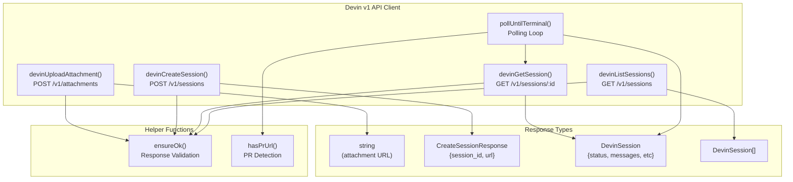
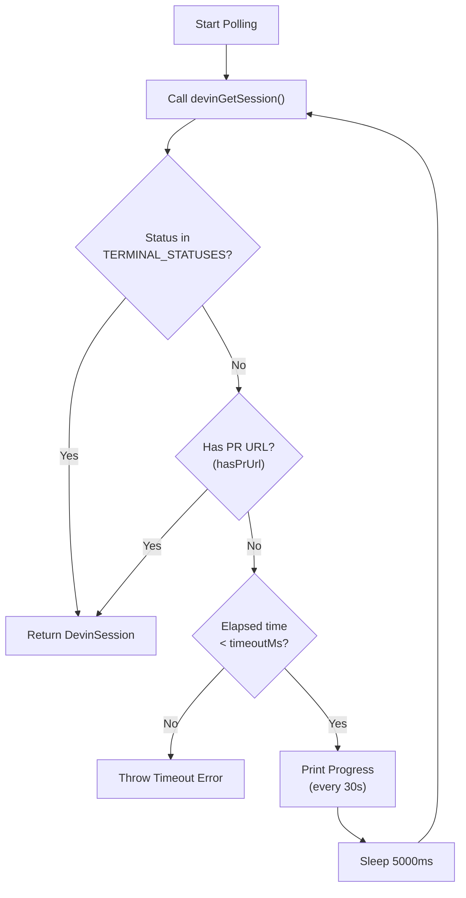

# Devin Client API

<details>
<summary>Relevant source files</summary>

The following files were used as context for generating this wiki page:

- [src/cli.ts](src/cli.ts)
- [src/devin/v1.ts](src/devin/v1.ts)

</details>


This document covers the Devin v1 API client implementation located in [src/devin/v1.ts](). The client provides low-level HTTP operations for interacting with Devin AI's REST API, including session management, attachment uploads, and status polling. For information about how sessions are used in the complete lifecycle, see [Session Lifecycle](#8.3). For details on building prompts that are sent to sessions, see [Prompt Generation](#8.4). For information on preparing evidence to upload, see [Evidence Bundles](#8.2).

## Purpose and Scope

The Devin Client API module ([src/devin/v1.ts]()) provides a thin wrapper around Devin AI's HTTP API endpoints. It handles:

- **Authentication**: Bearer token authorization for all requests
- **Attachment Uploads**: Multipart form data uploads for evidence files
- **Session Operations**: Creating, retrieving, and listing Devin sessions
- **Polling Logic**: Asynchronous waiting for session completion with timeout handling
- **Error Handling**: Response validation and parsing

This module does not handle prompt generation, evidence bundling, or outcome interpretation—those responsibilities belong to higher-level modules.

Sources: [src/devin/v1.ts:1-181]()

## API Base URL and Authentication

All API operations target the base URL `https://api.devin.ai/v1`. Authentication uses a bearer token passed in the `Authorization` header:

```
Authorization: Bearer ${apiKey}
```

The API key is typically sourced from the `DEVIN_API_KEY` environment variable and passed explicitly to each function call.

Sources: [src/devin/v1.ts:44-48](), [src/devin/v1.ts:73-78]()

## Core Data Structures

### CreateSessionResponse

Returned when creating a new Devin session.

| Field | Type | Description |
|-------|------|-------------|
| `session_id` | `string` | Unique identifier for the created session |
| `url` | `string` | Web URL to view the session in Devin's interface |
| `is_new_session` | `boolean \| null` | Optional flag indicating if this is a newly created session |

Sources: [src/devin/v1.ts:4-8]()

### DevinSessionMessage

Represents a single message in the session's chat history.

| Field | Type | Description |
|-------|------|-------------|
| `role` | `string` | Optional role identifier (e.g., "user", "assistant") |
| `content` | `string` | Optional message content |
| `text` | `string` | Alternative field for message text |

Sources: [src/devin/v1.ts:10-15]()

### DevinSession

Complete session object returned by get and list operations.

| Field | Type | Description |
|-------|------|-------------|
| `session_id` | `string` | Primary session identifier |
| `id` | `string` | Alternative identifier field |
| `url` | `string` | Web URL for the session |
| `status` | `string` | Human-readable status string |
| `status_enum` | `string` | Enumerated status value |
| `structured_output` | `unknown` | Parsed structured output if available |
| `data` | `Record<string, unknown>` | Additional session data |
| `pull_request_url` | `string` | URL of created pull request if applicable |
| `pr_url` | `string` | Alternative PR URL field |
| `messages` | `DevinSessionMessage[]` | Chat history for fallback parsing |

Sources: [src/devin/v1.ts:17-29]()

## API Operations

### Devin Client API Functions



Sources: [src/devin/v1.ts:31-181]()

### devinUploadAttachment

Uploads a file as an attachment that can be referenced in session creation.

**Function Signature:**
```typescript
async function devinUploadAttachment(
  apiKey: string, 
  filePath: string
): Promise<string>
```

**Parameters:**
| Parameter | Type | Description |
|-----------|------|-------------|
| `apiKey` | `string` | Devin API bearer token |
| `filePath` | `string` | Local filesystem path to upload |

**Returns:** URL string that can be used to reference the attachment in session prompts.

**Implementation Details:**
- Resolves the file path to an absolute path
- Reads file contents synchronously using `fs.readFileSync`
- Creates a `FormData` object with the file as a `Blob`
- POSTs to `https://api.devin.ai/v1/attachments`
- Parses response, handling both string and object formats
- Throws error if response is not OK or cannot be parsed

Sources: [src/devin/v1.ts:37-67]()

### devinCreateSession

Creates a new Devin session with a prompt and optional attachments.

**Function Signature:**
```typescript
async function devinCreateSession(
  apiKey: string,
  body: unknown
): Promise<CreateSessionResponse>
```

**Parameters:**
| Parameter | Type | Description |
|-----------|------|-------------|
| `apiKey` | `string` | Devin API bearer token |
| `body` | `unknown` | Session configuration object (see [Prompt Generation](#8.4)) |

**Returns:** `CreateSessionResponse` containing `session_id` and `url`.

**Implementation Details:**
- POSTs JSON body to `https://api.devin.ai/v1/sessions`
- Sets `Content-Type: application/json` header
- Returns parsed response containing session identifiers

Sources: [src/devin/v1.ts:69-85]()

### devinGetSession

Retrieves current state of a specific session.

**Function Signature:**
```typescript
async function devinGetSession(
  apiKey: string, 
  sessionId: string
): Promise<DevinSession>
```

**Parameters:**
| Parameter | Type | Description |
|-----------|------|-------------|
| `apiKey` | `string` | Devin API bearer token |
| `sessionId` | `string` | Session identifier from creation response |

**Returns:** `DevinSession` object containing current status and output.

**Implementation Details:**
- GETs from `https://api.devin.ai/v1/sessions/${sessionId}`
- Returns full session object including status and messages

Sources: [src/devin/v1.ts:87-97]()

### devinListSessions

Lists sessions with optional filtering by tag.

**Function Signature:**
```typescript
async function devinListSessions(
  apiKey: string,
  params?: { limit?: number; tag?: string }
): Promise<DevinSession[]>
```

**Parameters:**
| Parameter | Type | Description |
|-----------|------|-------------|
| `apiKey` | `string` | Devin API bearer token |
| `params.limit` | `number` | Optional maximum number of sessions to return |
| `params.tag` | `string` | Optional tag filter (e.g., "docdrift") |

**Returns:** Array of `DevinSession` objects.

**Implementation Details:**
- Constructs URL with query parameters for limit and tag
- GETs from `https://api.devin.ai/v1/sessions`
- Handles response formats: direct array or `{sessions: [...]}` wrapper
- Returns empty array if response format is unrecognized

Sources: [src/devin/v1.ts:99-129]()

### pollUntilTerminal

Polls a session until it reaches a terminal state or produces a pull request.

**Function Signature:**
```typescript
async function pollUntilTerminal(
  apiKey: string,
  sessionId: string,
  timeoutMs?: number
): Promise<DevinSession>
```

**Parameters:**
| Parameter | Type | Default | Description |
|-----------|------|---------|-------------|
| `apiKey` | `string` | - | Devin API bearer token |
| `sessionId` | `string` | - | Session identifier to poll |
| `timeoutMs` | `number` | `1,800,000` (30 min) | Maximum polling duration |

**Returns:** Final `DevinSession` object when terminal or PR detected.

**Polling Strategy:**



**Implementation Details:**
- Polls every **5 seconds** by default
- Default timeout is **30 minutes** (1,800,000 ms)
- Prints progress message every **30 seconds** to stdout
- Checks for terminal statuses: `finished`, `blocked`, `error`, `cancelled`, `done`, `complete`, `completed`, `success`, `terminated`
- Early exits if PR URL detected in session (optimization to avoid waiting for status flip)
- Throws error if timeout exceeded before terminal state reached

Sources: [src/devin/v1.ts:131-181]()

## Terminal Status Detection

### TERMINAL_STATUSES Constant

The polling logic recognizes nine terminal status values:

```typescript
const TERMINAL_STATUSES = [
  "finished",
  "blocked",
  "error",
  "cancelled",
  "done",
  "complete",
  "completed",
  "success",
  "terminated",
];
```

Status is extracted from either `session.status_enum` or `session.status`, normalized to lowercase, and checked against this list.

Sources: [src/devin/v1.ts:131-141]()

### hasPrUrl Helper Function

Internal helper that detects if a session has produced a pull request URL:

```typescript
function hasPrUrl(session: DevinSession): boolean
```

Checks multiple fields in priority order:
1. `session.pull_request_url` (direct field)
2. `session.pr_url` (alternative field)
3. `session.structured_output.pr.url` (nested structured output)
4. `session.data.structured_output.pr.url` (alternative data path)

This function enables early exit from polling when a PR is created, even if the session status hasn't transitioned to a terminal value yet.

Sources: [src/devin/v1.ts:143-149]()

## Error Handling

### ensureOk Function

All API operations use a shared error validation function:

```typescript
function ensureOk(
  response: Response, 
  body: string, 
  context: string
): void
```

**Behavior:**
- Checks `response.ok` status
- Throws descriptive error if not OK: `"${context} failed: ${status} ${body}"`
- Used in upload, create, get, and list operations

**Example Error Messages:**
- `"Upload attachment failed: 401 Unauthorized"`
- `"Create session failed: 400 Bad Request"`
- `"Get session failed: 404 Not Found"`

Sources: [src/devin/v1.ts:31-35]()

## Usage Flow

### Typical Session Creation and Polling Flow

```mermaid
sequenceDiagram
    participant Caller
    participant devinUploadAttachment
    participant devinCreateSession
    participant pollUntilTerminal
    participant devinGetSession
    participant DevinAPI["Devin API<br/>(api.devin.ai)"]
    
    Caller->>devinUploadAttachment: Upload evidence files
    devinUploadAttachment->>DevinAPI: POST /v1/attachments
    DevinAPI-->>devinUploadAttachment: attachment URL
    devinUploadAttachment-->>Caller: URL strings
    
    Note over Caller: Build session body<br/>with prompt + attachments
    
    Caller->>devinCreateSession: Create session with body
    devinCreateSession->>DevinAPI: POST /v1/sessions
    DevinAPI-->>devinCreateSession: {session_id, url}
    devinCreateSession-->>Caller: CreateSessionResponse
    
    Caller->>pollUntilTerminal: Poll with session_id
    
    loop Every 5 seconds until terminal
        pollUntilTerminal->>devinGetSession: Get session status
        devinGetSession->>DevinAPI: GET /v1/sessions/:id
        DevinAPI-->>devinGetSession: DevinSession
        devinGetSession-->>pollUntilTerminal: Session object
        
        alt Terminal status or PR detected
            pollUntilTerminal-->>Caller: Final DevinSession
        else Still active
            Note over pollUntilTerminal: Sleep 5s, continue polling
        end
    end
```

Sources: [src/devin/v1.ts:37-181]()

## Integration Points

The Devin Client API is consumed by higher-level modules in the docdrift system:

| Consumer Module | Usage | Reference |
|-----------------|-------|-----------|
| Evidence Bundle Builder | Calls `devinUploadAttachment` for each file in evidence | See [Evidence Bundles](#8.2) |
| Session Lifecycle Manager | Calls `devinCreateSession` to start remediation | See [Session Lifecycle](#8.3) |
| Polling Orchestrator | Uses `pollUntilTerminal` for async waiting | See [Session Lifecycle](#8.3) |
| Status Command | Calls `devinListSessions` to display history | See [status](#3.5) |
| Outcome Parser | Processes `DevinSession` objects returned by polling | See [Structured Output Parsing](#8.5) |

Sources: [src/devin/v1.ts:1-181]()

## Progress Reporting

The `pollUntilTerminal` function prints progress updates to stdout every 30 seconds during polling:

```
Still waiting for Devin… (30s elapsed; open session URL in browser to watch)
Still waiting for Devin… (60s elapsed; open session URL in browser to watch)
...
```

This provides feedback during long-running operations and reminds users they can monitor the session in Devin's web interface.

Sources: [src/devin/v1.ts:151-175]()

## API Operation Summary Table

| Function | Method | Endpoint | Purpose | Timeout |
|----------|--------|----------|---------|---------|
| `devinUploadAttachment` | POST | `/v1/attachments` | Upload evidence files | None |
| `devinCreateSession` | POST | `/v1/sessions` | Start new Devin session | None |
| `devinGetSession` | GET | `/v1/sessions/:id` | Get session status | None |
| `devinListSessions` | GET | `/v1/sessions` | List sessions by tag | None |
| `pollUntilTerminal` | N/A | Polling wrapper | Wait for session completion | 30 min default |

Sources: [src/devin/v1.ts:37-181]()

---