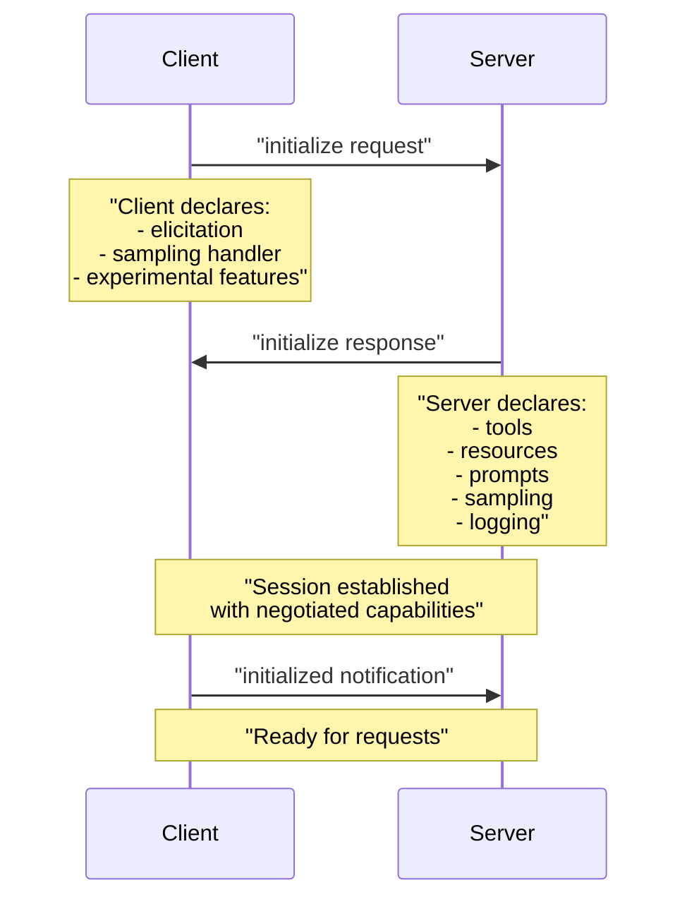
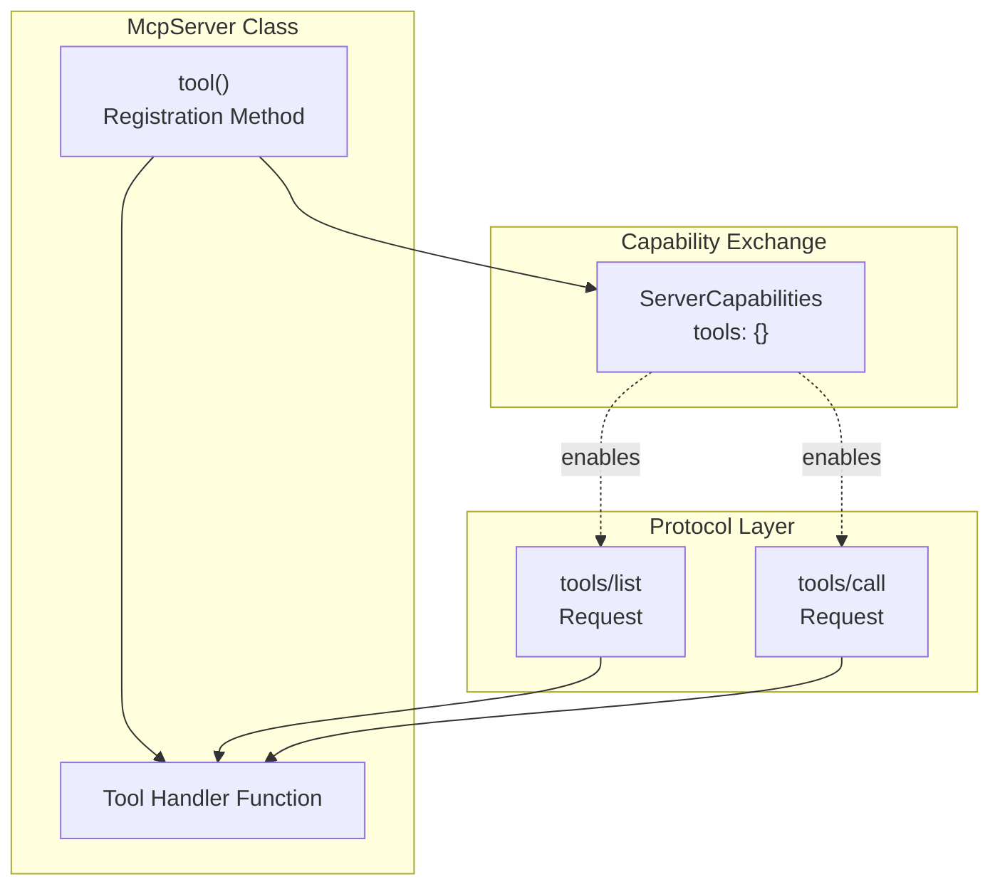
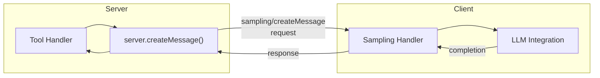
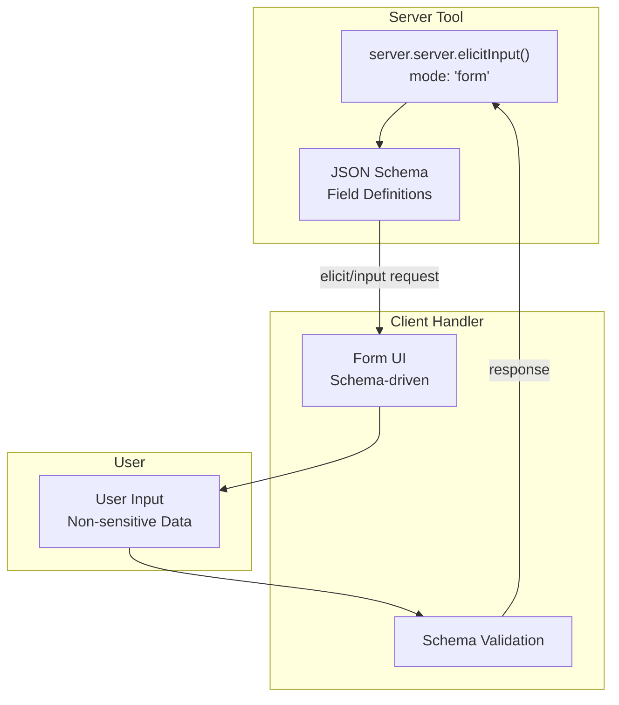
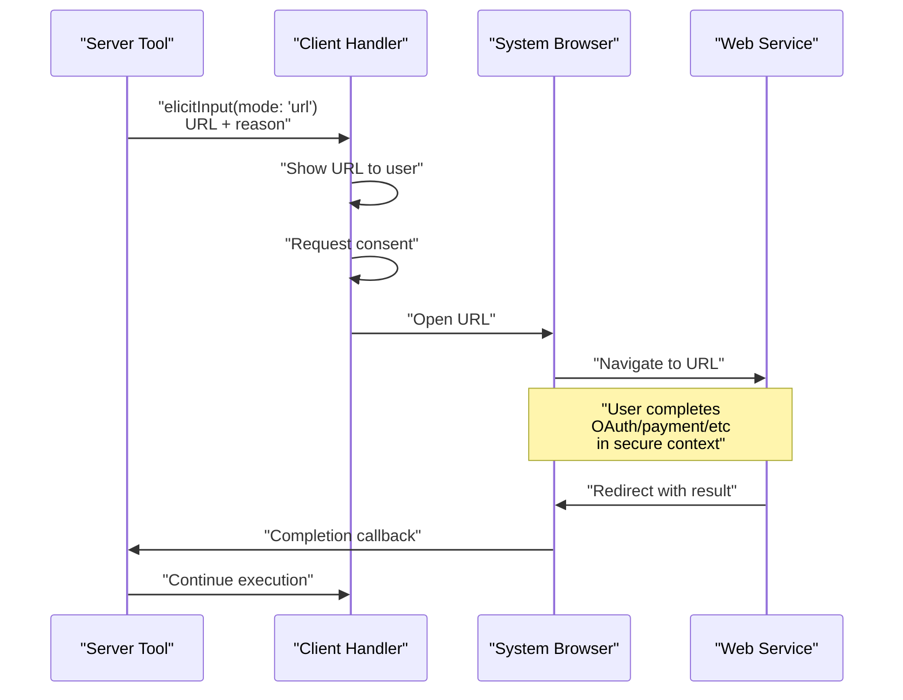
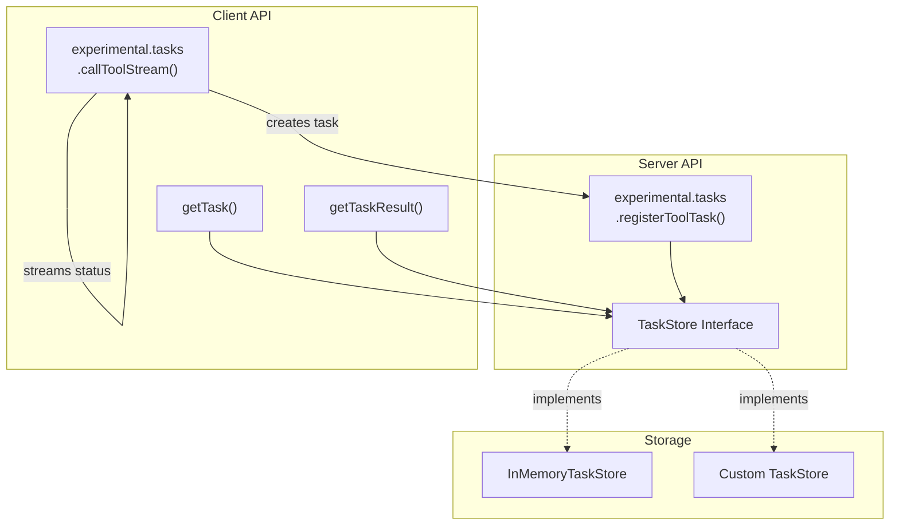

# Capabilities System

<details>
<summary>Relevant source files</summary>

The following files were used as context for generating this wiki page:

- [examples/client/src/simpleStreamableHttp.ts](examples/client/src/simpleStreamableHttp.ts)
- [examples/client/src/simpleTaskInteractiveClient.ts](examples/client/src/simpleTaskInteractiveClient.ts)
- [packages/client/src/client/client.ts](packages/client/src/client/client.ts)
- [packages/core/src/shared/protocol.ts](packages/core/src/shared/protocol.ts)
- [packages/core/src/types/types.ts](packages/core/src/types/types.ts)
- [packages/core/test/shared/protocol.test.ts](packages/core/test/shared/protocol.test.ts)
- [packages/server/src/server/mcp.ts](packages/server/src/server/mcp.ts)
- [packages/server/src/server/server.ts](packages/server/src/server/server.ts)
- [test/integration/test/client/client.test.ts](test/integration/test/client/client.test.ts)
- [test/integration/test/server.test.ts](test/integration/test/server.test.ts)
- [test/integration/test/server/mcp.test.ts](test/integration/test/server/mcp.test.ts)
- [test/integration/test/taskLifecycle.test.ts](test/integration/test/taskLifecycle.test.ts)

</details>


This document describes the MCP protocol's capability negotiation mechanism and the available capabilities that clients and servers can exchange. For implementation details of building servers and clients, see [Server Implementation](#3) and [Client Implementation](#4). For transport-level configuration, see [Transport System](#6).

## Overview

The capabilities system enables MCP clients and servers to negotiate supported features during the initialization handshake. This allows implementations to support different feature subsets and safely degrade when connecting to implementations with different capability sets. Capabilities are declared during initialization and remain fixed for the duration of the session.

Capabilities fall into three categories:

1. **Server Capabilities** - Features offered by the server (tools, resources, prompts, sampling, logging)
2. **Client Capabilities** - Features offered by the client (elicitation, sampling handlers)
3. **Experimental Features** - Pre-release capabilities that may change (task-based execution)

Sources: [README.md:24-34](), [docs/capabilities.md:1-86]()

## Capability Negotiation Flow

During connection establishment, the client sends an `initialize` request containing its capabilities, and the server responds with its own capabilities. This bidirectional exchange determines which features are available for the session.



**Figure: Capability Negotiation During Initialization**

The negotiation occurs once per connection. If either side attempts to use a capability that wasn't declared during initialization, the other side should reject the request.

Sources: [README.md:24-27](), [docs/capabilities.md:1-4]()

## Server Capabilities

Servers declare capabilities in the `ServerCapabilities` type and register handlers for each enabled feature. The `McpServer` class provides registration methods that automatically enable the corresponding capability flags.

### Tools Capability

The tools capability allows servers to expose executable actions that clients can invoke. Tools are registered using `McpServer.tool()` and are discoverable via the `tools/list` method.



**Figure: Tools Capability Architecture**

Tools receive arguments, can send notifications during execution, and return structured content. The test suite demonstrates tool registration with notification support:

[test/integration/test/taskResumability.test.ts:63-83]()

Sources: [docs/capabilities.md:9-19](), [test/integration/test/taskResumability.test.ts:63-114]()

### Resources Capability

The resources capability enables servers to expose data sources that clients can read. Resources use URI-based addressing and support both listing available resources and reading their contents.

Implementation pattern:
- Register resources via `McpServer.resource()` or similar methods
- Clients discover resources via `resources/list`
- Clients retrieve content via `resources/read`

Sources: [README.md:30-31](), [docs/capabilities.md:1-4]()

### Prompts Capability

The prompts capability allows servers to provide reusable templates for model interactions. Prompts can include variables and are designed to standardize common interaction patterns.

Implementation pattern:
- Register prompt templates on the server
- Clients list available prompts via `prompts/list`
- Clients retrieve rendered prompts via `prompts/get`

Sources: [README.md:30-31](), [docs/capabilities.md:1-4]()

### Sampling Capability

The sampling capability enables servers to request LLM completions from connected clients. This allows tools to delegate text generation, summarization, or other language model tasks to the client's LLM integration.



**Figure: Sampling Request Flow**

Server-side usage example from documentation:
- Declare sampling capability in server options
- Call `server.server.createMessage(...)` from tool handlers
- Process the model's response and return to the client

[docs/capabilities.md:5-19]()

Sources: [docs/capabilities.md:5-19]()

### Logging Capability

The logging capability allows servers to send diagnostic messages to clients. Log messages have severity levels (debug, info, warning, error) and can include structured data.

Example from test suite showing logging capability enabled:

[test/integration/test/taskResumability.test.ts:60]()

Sources: [test/integration/test/taskResumability.test.ts:60-83]()

## Client Capabilities

Clients declare capabilities that allow servers to request services. The two primary client capabilities are elicitation and sampling handlers.

### Elicitation Capability

Elicitation enables servers to request additional information from users during tool execution. The protocol defines two distinct modes with different security characteristics.

#### Form Elicitation

Form elicitation is designed for collecting **non-sensitive** data via schema-driven forms. The server provides a JSON schema and message, and the client collects the data through its UI.



**Figure: Form Elicitation Flow**

Example implementations:
- Server: [docs/capabilities.md:28-32]() references `elicitationFormExample.ts`
- Client: [docs/capabilities.md:30]() references `simpleStreamableHttp.ts`

Sources: [docs/capabilities.md:23-32]()

#### URL Elicitation

URL elicitation is designed for **sensitive operations** and secure web-based flows. Instead of collecting data directly, the server provides a URL that the client opens in a browser. This enables OAuth flows, payment confirmations, API key collection, and other security-sensitive operations.



**Figure: URL Elicitation Security Flow**

Key security requirements:
- Use `mode: 'url'` when calling elicitation APIs
- Client must show the full URL and reason to the user
- User must explicitly consent before opening the URL
- Sensitive data (API keys, passwords, payment info) must never use form elicitation

Example implementations referenced in [docs/capabilities.md:36-50]()

Sources: [docs/capabilities.md:34-51]()

### Sampling Handler Capability

The sampling handler capability allows clients to provide LLM completion services to servers. When a server requests sampling, the client invokes its LLM integration and returns the completion.

Implementation pattern:
- Client declares sampling support in capabilities
- Server calls `createMessage()` during tool execution
- Client routes request to its LLM
- Server processes the completion in tool context

Sources: [docs/capabilities.md:5-19]()

## Experimental Task-Based Execution

Task-based execution is an experimental capability that enables "call-now, fetch-later" patterns for long-running operations. Tools create tasks that persist beyond the execution scope, allowing clients to disconnect and check results later.

### Task Architecture



**Figure: Task-Based Execution Architecture**

Sources: [docs/capabilities.md:53-85]()

### Server-Side Task Registration

Servers implement task-based tools by:

1. Providing a `TaskStore` implementation for persistence
2. Enabling the `tasks` capability in server options
3. Registering tools via `server.experimental.tasks.registerToolTask(...)`

The SDK includes an in-memory store reference implementation:
- Implementation: [docs/capabilities.md:70]() references `packages/core/src/experimental/tasks/stores/in-memory.ts`
- Example server: [docs/capabilities.md:68-70]() references `toolWithSampleServer.ts`

Sources: [docs/capabilities.md:59-71]()

### Client-Side Task Handling

Clients interact with tasks through three primary methods:

| Method | Purpose | Returns |
|--------|---------|---------|
| `experimental.tasks.callToolStream()` | Start tool execution, may create task | Stream of status updates |
| `getTask()` | Check task status after reconnecting | Task metadata and current status |
| `getTaskResult()` | Fetch completed task results | Task result content |

Client implementation example: [docs/capabilities.md:79-82]() references `simpleStreamableHttp.ts`

Sources: [docs/capabilities.md:72-85]()

### Task Lifecycle

Tasks progress through a defined lifecycle with TTL handling:

1. **Created** - Task initiated by tool call
2. **Running** - Task execution in progress, status updates emitted
3. **Completed/Failed** - Terminal state reached
4. **Expired** - TTL elapsed, task cleaned up

The task store is responsible for TTL enforcement and cleanup. Clients can disconnect during execution and reconnect later to fetch results using the task ID.

Sources: [docs/capabilities.md:53-85]()

## Capability Declaration Examples

### Server Capability Declaration

```typescript
const mcpServer = new McpServer(
  { 
    name: 'test-server', 
    version: '1.0.0' 
  }, 
  { 
    capabilities: { 
      logging: {},
      tools: {},
      resources: {},
      // ... other capabilities
    } 
  }
);
```

From [test/integration/test/taskResumability.test.ts:60]()

### Client Capability Declaration

Clients declare capabilities when constructing the `Client` instance. The specific API is shown in client examples:
- [docs/client.md:24-31]() demonstrates client initialization
- [docs/client.md:32]() references interactive client with capability handlers

Sources: [test/integration/test/taskResumability.test.ts:60](), [docs/client.md:24-32]()

## Capability Enforcement

The protocol enforces capability constraints:

- Requests for undeclared capabilities should be rejected
- Capability sets are immutable after initialization
- Both client and server must honor capability restrictions

This prevents version skew issues and ensures predictable behavior across different SDK versions and implementations.

Sources: [README.md:24-34](), [docs/capabilities.md:1-86]()

---