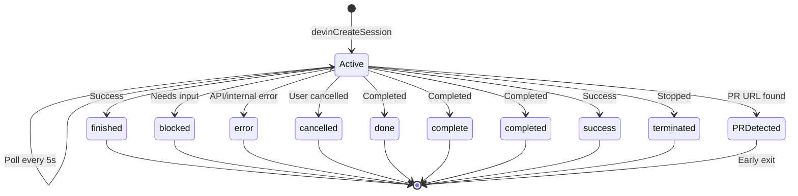
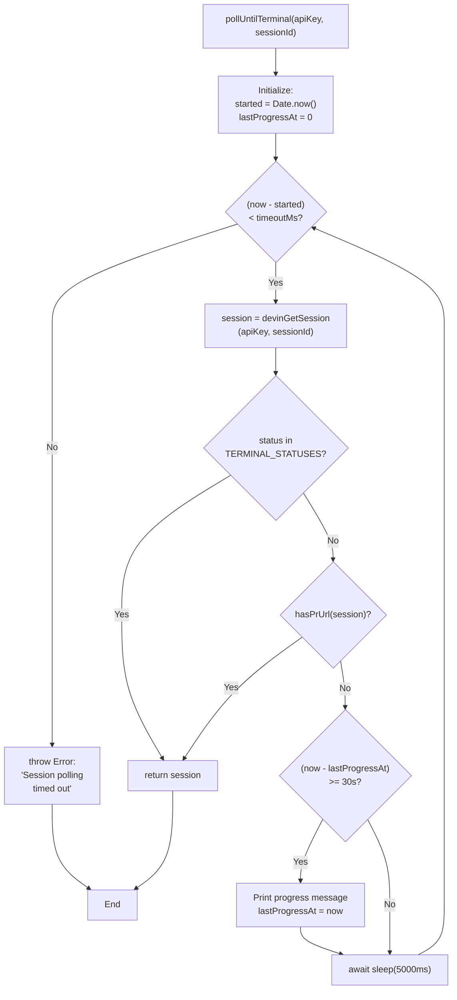
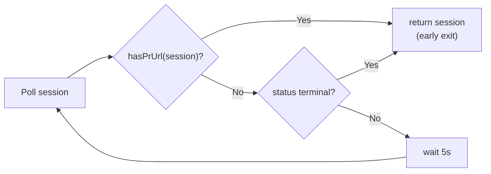
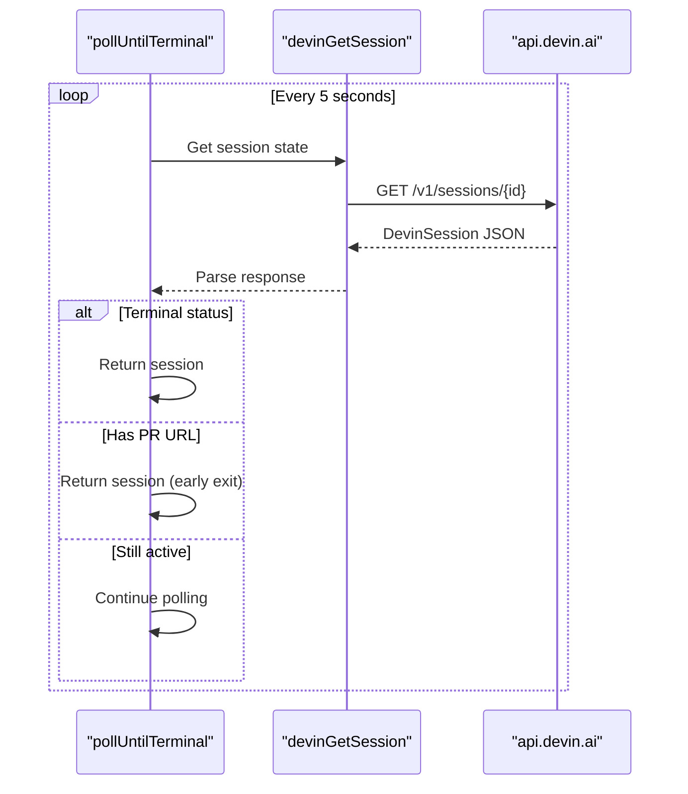
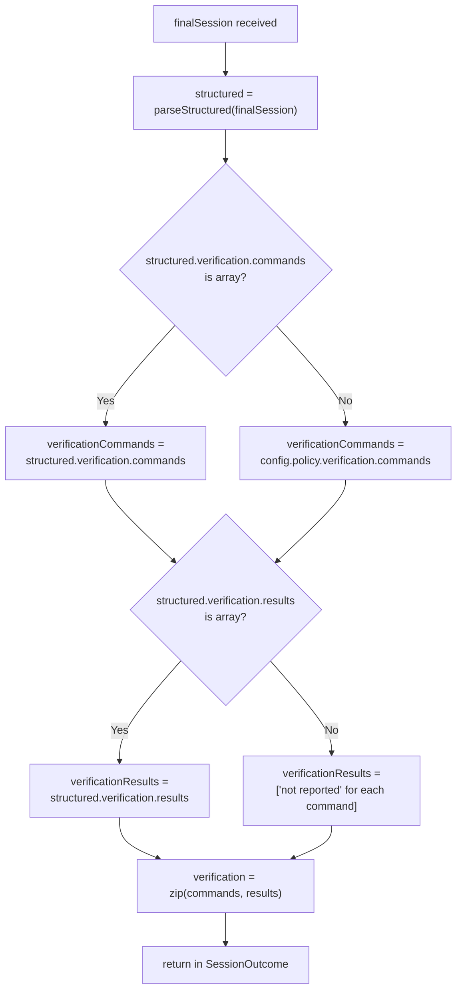

# Session Lifecycle

<details>
<summary>Relevant source files</summary>

The following files were used as context for generating this wiki page:

- [docdrift-yml.md](docdrift-yml.md)
- [src/cli.ts](src/cli.ts)
- [src/devin/v1.ts](src/devin/v1.ts)
- [src/index.ts](src/index.ts)

</details>


This page documents the lifecycle of a Devin AI session from creation through completion. It covers session creation parameters, polling strategy, terminal status detection, timeout handling, and outcome extraction. For information about building the prompts and evidence bundles that are sent to sessions, see [Evidence Bundles](#8.2) and [Prompt Generation](#8.4). For details on parsing structured outputs and inferring results, see [Structured Output Parsing](#8.5).

## Overview

A Devin session lifecycle consists of five phases:

1. **Creation** — Upload attachments, build prompt, create session via API
2. **Polling** — Query session status every 5 seconds until terminal state or timeout
3. **Early Exit** — Stop polling if a PR URL is detected (session succeeded)
4. **Terminal Detection** — Recognize completion statuses (finished, blocked, error, etc.)
5. **Outcome Extraction** — Parse structured output and infer result type (PR_OPENED, BLOCKED, NO_CHANGE)

The system implements a robust polling strategy with progress reporting, timeout protection, and multiple exit conditions to handle long-running AI sessions.

Sources: [src/devin/v1.ts:1-181](), [src/index.ts:83-169]()

## Session States and Transitions

The Devin API tracks sessions through multiple states. Sessions begin in an active (non-terminal) state and transition to one of nine terminal states upon completion.



**Terminal Statuses**

The system recognizes nine terminal status values that indicate a session has completed:

| Status | Meaning |
|--------|---------|
| `finished` | Session completed successfully |
| `blocked` | Session blocked, needs human input |
| `error` | Session encountered an error |
| `cancelled` | Session was cancelled by user |
| `done` | Generic completion status |
| `complete` | Generic completion status |
| `completed` | Generic completion status |
| `success` | Session succeeded |
| `terminated` | Session was terminated |

These statuses are checked case-insensitively. The polling loop examines both `status_enum` and `status` fields to handle API response variations.

Sources: [src/devin/v1.ts:131-141](), [src/devin/v1.ts:153-178]()

## Session Creation

Sessions are created using `devinCreateSession`, which sends a POST request to `https://api.devin.ai/v1/sessions` with authentication, prompt, configuration, and attachments.

```mermaid
sequenceDiagram
    participant Client as "docdrift"
    participant Upload as "devinUploadAttachment"
    participant API as "api.devin.ai"
    participant Create as "devinCreateSession"
    
    Client->>Upload: Upload evidence attachments
    Upload->>API: POST /v1/attachments (multipart)
    API-->>Upload: attachment URL
    
    Client->>Create: Build request body
    Note over Create: prompt, attachments,<br/>structured_output schema,<br/>tags, metadata
    Create->>API: POST /v1/sessions
    API-->>Create: {session_id, url}
    Create-->>Client: CreateSessionResponse
```

**Creation Parameters**

The session request body includes:

| Field | Type | Description |
|-------|------|-------------|
| `prompt` | string | Full Devin prompt (from `buildWholeDocsitePrompt`) |
| `unlisted` | boolean | Whether session appears in user's session list |
| `max_acu_limit` | integer | Maximum ACU (compute) limit |
| `tags` | array | Tags for filtering (always includes `"docdrift"`) |
| `attachments` | array | URLs of uploaded evidence files |
| `structured_output.schema` | object | JSON Schema for structured response (PatchPlanSchema) |
| `metadata` | object | Custom metadata (repository, docArea, mode) |

The `structured_output` field instructs Devin to return a JSON object conforming to `PatchPlanSchema`, enabling programmatic extraction of PR URLs, verification results, and block reasons.

Sources: [src/devin/v1.ts:69-85](), [src/index.ts:111-125]()

## Polling Strategy

After session creation, `pollUntilTerminal` polls the session status every 5 seconds until a terminal condition is met or a 30-minute timeout is reached.



**Polling Intervals**

| Parameter | Value | Purpose |
|-----------|-------|---------|
| Poll interval | 5 seconds | Balance between responsiveness and API load |
| Progress reporting | 30 seconds | Inform user that polling is active |
| Default timeout | 30 minutes | Prevent infinite loops for stuck sessions |

**Progress Reporting**

Every 30 seconds, if the session is still active, the system prints a progress message:

```
  Still waiting for Devin… (45s elapsed; open session URL in browser to watch)
```

This feedback reassures users during long-running sessions and provides the elapsed time.

Sources: [src/devin/v1.ts:153-180](), [src/devin/v1.ts:151-152]()

## Early Exit on PR Detection

The polling loop implements an early exit condition: if a PR URL is detected in the session response, polling stops immediately even if the session has not reached a terminal status.



**PR URL Detection**

The `hasPrUrl` function checks three possible locations for a PR URL:

1. `session.pull_request_url` — Direct field on session object
2. `session.pr_url` — Alternative field name
3. `session.structured_output.pr.url` — Nested in structured output

This early exit prevents timeouts when a session successfully opens a PR but continues running additional tasks (like verification commands or documentation updates).

Sources: [src/devin/v1.ts:143-149](), [src/devin/v1.ts:166-169]()

## Session Query API

The `devinGetSession` function fetches the current session state by making a GET request to `https://api.devin.ai/v1/sessions/{sessionId}`.



**DevinSession Response Fields**

| Field | Type | Description |
|-------|------|-------------|
| `session_id` / `id` | string | Session identifier |
| `url` | string | Browser URL to view session |
| `status` / `status_enum` | string | Current status (active or terminal) |
| `structured_output` | object | Structured JSON response from Devin |
| `data` | object | Alternative location for structured output |
| `pull_request_url` / `pr_url` | string | PR URL if opened |
| `messages` | array | Chat messages (fallback for parsing) |

The system checks both `status_enum` and `status` to handle API response variations, converting the value to lowercase before comparison with terminal statuses.

Sources: [src/devin/v1.ts:87-97](), [src/devin/v1.ts:17-29]()

## Timeout Handling

If 30 minutes elapse without reaching a terminal state or detecting a PR, the polling loop throws an error to prevent indefinite waiting.

```typescript
// Simplified logic from pollUntilTerminal
const timeoutMs = 30 * 60_000; // 30 minutes
const started = Date.now();

while (Date.now() - started < timeoutMs) {
  // Poll session
  // Check terminal conditions
  // Wait 5 seconds
}

throw new Error(`Session polling timed out for ${sessionId}`);
```

**Timeout Configuration**

The timeout is hardcoded to 30 minutes (`30 * 60_000` milliseconds). This value balances:
- **User experience**: Most sessions complete within 5-15 minutes
- **Resource constraints**: Prevents workflows from running indefinitely
- **Cost control**: Limits API polling costs for stuck sessions

If a session times out, the error is propagated to the caller, and the run is marked as failed. No recovery mechanism is attempted.

Sources: [src/devin/v1.ts:156-179]()

## Session Lifecycle Orchestration

The `executeSessionSingle` function orchestrates the complete session lifecycle from evidence upload through outcome extraction.

```mermaid
sequenceDiagram
    participant Caller as "runDocDrift"
    participant Exec as "executeSessionSingle"
    participant Upload as "devinUploadAttachment"
    participant Prompt as "buildWholeDocsitePrompt"
    participant Create as "devinCreateSession"
    participant Poll as "pollUntilTerminal"
    participant Parse as "parseStructured"
    
    Caller->>Exec: Call with evidence, config
    
    loop For each attachment
        Exec->>Upload: Upload file
        Upload-->>Exec: attachment URL
    end
    
    Exec->>Prompt: Build prompt
    Prompt-->>Exec: prompt string
    
    Exec->>Create: Create session
    Create-->>Exec: {session_id, url}
    
    Exec->>Poll: Poll until terminal
    Poll-->>Exec: finalSession
    
    Exec->>Parse: parseStructured(finalSession)
    Parse-->>Exec: structured output
    
    Exec->>Exec: inferPrUrl(finalSession, structured)
    Exec->>Exec: Determine outcome type
    
    Exec-->>Caller: SessionOutcome
```

**Outcome Types**

The function maps session results to one of four outcome types:

| Outcome | Condition | Description |
|---------|-----------|-------------|
| `PR_OPENED` | `prUrl` is present | Session successfully opened a PR |
| `BLOCKED` | Status is `blocked` or structured output has `status: "BLOCKED"` | Session needs human input |
| `NO_CHANGE` | No PR, not blocked | Session completed without changes |
| `ISSUE_OPENED` | N/A (handled by caller) | Escalated to issue instead of PR |

The outcome includes:
- `summary`: Human-readable description from structured output
- `sessionUrl`: Browser URL to view session
- `prUrl`: PR URL if opened
- `questions`: List of questions if blocked
- `verification`: Array of verification command results

Sources: [src/index.ts:83-169](), [src/index.ts:39-47]()

## Verification Result Extraction

After polling completes, the system extracts verification results from the structured output or falls back to configured commands.



**Verification Structure**

Each verification entry pairs a command with its result:

```typescript
{
  command: "npm run docs:check",
  result: "✓ All checks passed"
}
```

If Devin does not report verification results, each command is paired with `"not reported"`.

Sources: [src/index.ts:131-141]()

## Session Metadata

Sessions are tagged with metadata for filtering and debugging:

```typescript
metadata: {
  repository: "owner/repo",
  docArea: "docsite",
  mode: "autogen"
}
```

Tags include:
- `"docdrift"` — Always present for filtering in `runStatus`
- Doc area name — Enables grouping sessions by documentation area
- Custom tags from `config.devin.tags` — User-defined tags for organization

The `runStatus` command queries sessions by the `"docdrift"` tag to show recent activity.

Sources: [src/index.ts:115-125](), [src/index.ts:597-622]()

---