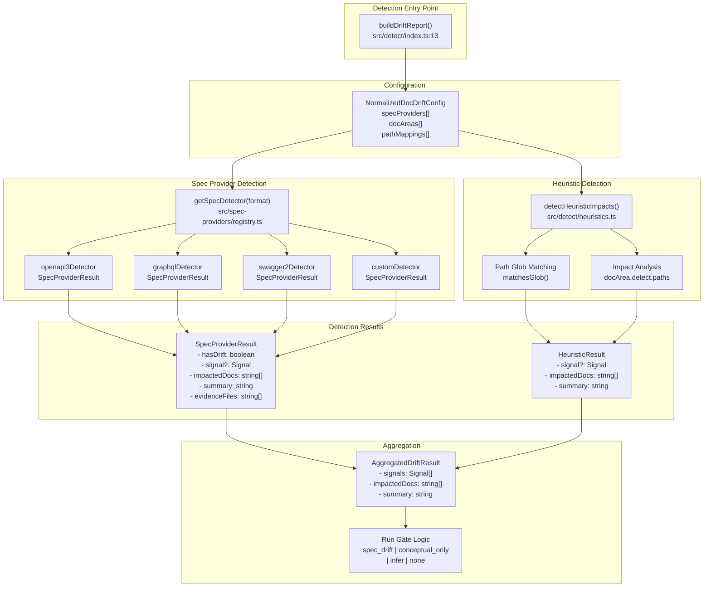
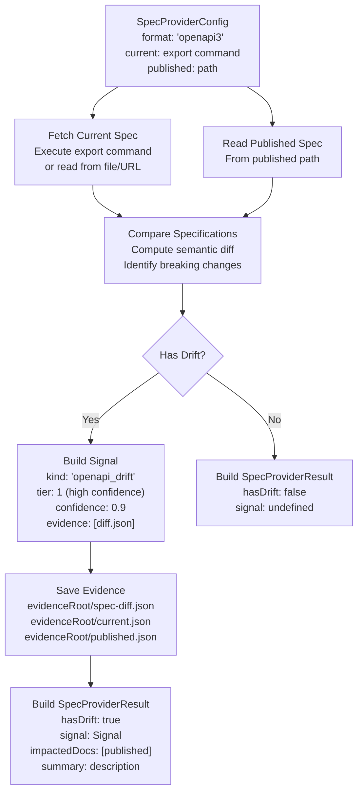
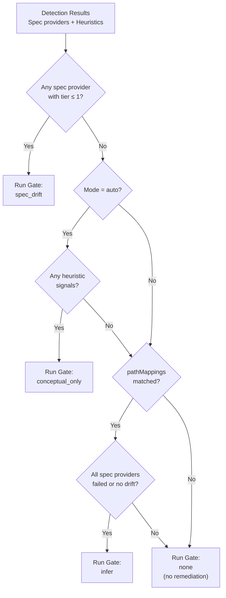

# Adding Detection Mechanisms

<details>
<summary>Relevant source files</summary>

The following files were used as context for generating this wiki page:

- [docdrift.schema.json](docdrift.schema.json)
- [src/config/normalize.ts](src/config/normalize.ts)
- [src/config/schema.ts](src/config/schema.ts)
- [src/detect/index.ts](src/detect/index.ts)
- [test/config.test.ts](test/config.test.ts)

</details>


This guide explains how to extend docdrift's drift detection capabilities by adding new spec providers or custom detection heuristics. Spec providers enable detection of API specification drift for formats like OpenAPI, GraphQL, or proprietary formats. Path heuristics enable custom logic for mapping code changes to documentation impacts.

For information about how detection works at runtime, see [Detection Pipeline](#6.1). For configuration of existing detection mechanisms, see [Spec Providers](#4.4) and [Path Mappings](#4.5).

---

## Detection Architecture Overview

The detection system follows a plugin-based architecture where detection mechanisms are registered in a central registry and invoked during drift analysis. The `buildDriftReport` function orchestrates all detection mechanisms in parallel, aggregates their results, and applies run gate logic to determine if remediation should proceed.

**Diagram: Detection System Architecture**



Sources: [src/detect/index.ts:13-198]()

---

## Spec Provider Interface

A spec provider is a function that detects drift in a specific API specification format. All spec providers must implement the `SpecProviderDetector` function signature and return a `SpecProviderResult`.

**Required Types and Interfaces**

```typescript
// Types defined in src/spec-providers/types.ts
interface SpecProviderResult {
  hasDrift: boolean;
  signal?: Signal;
  impactedDocs: string[];
  summary: string;
  evidenceFiles: string[];
}

type SpecProviderDetector = (
  provider: SpecProviderConfig,
  evidenceRoot: string
) => Promise<SpecProviderResult>;
```

The `SpecProviderConfig` is defined in the configuration schema and includes:
- `format`: One of `"openapi3" | "swagger2" | "graphql" | "fern" | "postman"`
- `current`: Source specification (URL, local path, or export command)
- `published`: Path to the published specification in documentation

Sources: [src/config/schema.ts:33-40]()

**Diagram: Spec Provider Execution Flow**



Sources: [src/detect/index.ts:58-84]()

---

## Adding a New Spec Provider

To add support for a new API specification format, you need to:

1. **Create a detector implementation file** in `src/spec-providers/`
2. **Implement the detection logic** following the `SpecProviderDetector` signature
3. **Register the detector** in the spec provider registry
4. **Add the format** to the configuration schema
5. **Write tests** for the detector

**Step 1: Detector Implementation Structure**

Create a file like `src/spec-providers/my-format.ts`:

```typescript
import { SpecProviderConfig } from "../config/schema";
import { Signal } from "../model/types";
import { SpecProviderResult } from "./types";
import { writeJsonFile } from "../utils/fs";
import path from "node:path";

export async function myFormatDetector(
  provider: SpecProviderConfig,
  evidenceRoot: string
): Promise<SpecProviderResult> {
  // 1. Fetch current specification
  const currentSpec = await fetchCurrentSpec(provider.current);
  
  // 2. Read published specification
  const publishedSpec = await readPublishedSpec(provider.published);
  
  // 3. Compare specifications and compute diff
  const diff = computeDiff(currentSpec, publishedSpec);
  
  // 4. Determine if there is drift
  const hasDrift = diff.changes.length > 0;
  
  // 5. Save evidence files
  const evidenceFiles: string[] = [];
  if (hasDrift) {
    const diffPath = path.join(evidenceRoot, "my-format-diff.json");
    writeJsonFile(diffPath, diff);
    evidenceFiles.push(diffPath);
  }
  
  // 6. Build signal if drift detected
  let signal: Signal | undefined;
  if (hasDrift) {
    signal = {
      kind: "my_format_drift",
      tier: 1, // High confidence
      confidence: 0.9,
      evidence: evidenceFiles,
    };
  }
  
  // 7. Return result
  return {
    hasDrift,
    signal,
    impactedDocs: hasDrift ? [provider.published] : [],
    summary: hasDrift
      ? `MyFormat spec has ${diff.changes.length} changes`
      : "No MyFormat spec drift detected",
    evidenceFiles,
  };
}
```

**Step 2: Register in Registry**

Update `src/spec-providers/registry.ts`:

```typescript
import { myFormatDetector } from "./my-format";

export function getSpecDetector(format: string): SpecProviderDetector {
  switch (format) {
    case "openapi3":
      return openapi3Detector;
    case "swagger2":
      return swagger2Detector;
    case "graphql":
      return graphqlDetector;
    case "my-format": // Add your format
      return myFormatDetector;
    default:
      throw new Error(`Unknown spec format: ${format}`);
  }
}
```

**Step 3: Update Configuration Schema**

Add your format to the enum in [src/config/schema.ts:33]():

```typescript
const specFormatSchema = z.enum([
  "openapi3",
  "swagger2", 
  "graphql",
  "fern",
  "postman",
  "my-format", // Add here
]);
```

**Step 4: Handle Spec Source Types**

The `current` field in `SpecProviderConfig` can be one of three types:

| Type | Usage | Implementation |
|------|-------|----------------|
| `url` | Remote specification URL | Fetch via HTTP request |
| `local` | Local file path | Read from filesystem |
| `export` | Generate via command | Execute command, read output from `outputPath` |

Example handling:

```typescript
async function fetchCurrentSpec(source: SpecSource): Promise<any> {
  switch (source.type) {
    case "url":
      return await fetch(source.url).then(r => r.json());
    case "local":
      return readJsonFile(source.path);
    case "export":
      await execCommand(source.command);
      return readJsonFile(source.outputPath);
  }
}
```

Sources: [src/config/schema.ts:22-31]()

---

## Detection Signals and Confidence

Every detection mechanism produces a `Signal` that indicates the type and confidence of detected drift. Signals control policy decisions and run gate behavior.

**Signal Structure**

| Field | Type | Description |
|-------|------|-------------|
| `kind` | string | Signal type identifier (e.g., `"openapi_drift"`, `"heuristic_path_impact"`) |
| `tier` | number | Confidence tier: 1 (high), 2 (medium), 3+ (low) |
| `confidence` | number | Numeric confidence score 0.0-1.0 |
| `evidence` | string[] | Paths to evidence files |

**Signal Tiers and Run Gate Impact**

```typescript
// From src/detect/index.ts:70-73
const anySpecDrift = providerResults.some(
  (r) => r.hasDrift && r.signal && r.signal.tier <= 1
);
```

- **Tier 1 signals** trigger the `spec_drift` run gate (highest priority)
- **Tier 2+ signals** only trigger gates in `auto` mode
- Multiple signals are aggregated for policy evaluation

**Common Signal Kinds**

| Signal Kind | Detector | Tier | Confidence |
|-------------|----------|------|------------|
| `openapi_drift` | OpenAPI spec provider | 1 | 0.9 |
| `graphql_drift` | GraphQL spec provider | 1 | 0.9 |
| `heuristic_path_impact` | Path heuristics | 2 | 0.7 |
| `infer_mode` | Inference fallback | 2 | 0.6 |

Sources: [src/detect/index.ts:70-136]()

---

## Path-Based Heuristic Detection

Path heuristics map changed file paths to impacted documentation areas using glob patterns. This mechanism is invoked for each `docArea` with configured path rules.

**Heuristic Detection Flow**

The `detectHeuristicImpacts` function (referenced at [src/detect/index.ts:89]()) processes each docArea's path rules:

```typescript
// Invoked for each docArea with detect.paths configured
for (const docArea of config.docAreas) {
  if (docArea.detect.paths?.length) {
    const heuristicResult = detectHeuristicImpacts(
      docArea,
      changedPaths,
      evidenceRoot
    );
    if (heuristicResult.signal) {
      signals.push(heuristicResult.signal);
      heuristicResult.impactedDocs.forEach((d) => impactedDocs.add(d));
      summaries.push(heuristicResult.summary);
    }
  }
}
```

**Path Rule Structure**

Path rules are defined in configuration as `pathRuleSchema`:

| Field | Type | Description |
|-------|------|-------------|
| `match` | string | Glob pattern for matching changed files |
| `impacts` | string[] | Glob patterns for impacted documentation files |

Example configuration:

```yaml
docAreas:
  - name: user_guides
    mode: conceptual
    detect:
      paths:
        - match: "src/auth/**"
          impacts: ["docs/guides/authentication/**"]
        - match: "src/payments/**"
          impacts: ["docs/guides/payments/**"]
```

Sources: [src/config/schema.ts:3-7](), [src/detect/index.ts:86-96]()

**Adding Custom Heuristic Logic**

To extend path-based detection with custom logic:

1. **Modify `detectHeuristicImpacts`** in `src/detect/heuristics.ts`
2. **Add custom matching logic** beyond glob patterns
3. **Return appropriate signals** with tier 2+ confidence

Example custom heuristic:

```typescript
// In src/detect/heuristics.ts
export function detectHeuristicImpacts(
  docArea: DocAreaConfig,
  changedPaths: string[],
  evidenceRoot: string
): HeuristicResult {
  const impactedDocs = new Set<string>();
  
  // Standard glob matching
  for (const rule of docArea.detect.paths || []) {
    for (const changedPath of changedPaths) {
      if (matchesGlob(rule.match, changedPath)) {
        rule.impacts.forEach((impact) => impactedDocs.add(impact));
      }
    }
  }
  
  // Custom heuristic: detect database schema changes
  const hasSchemaChange = changedPaths.some(p => 
    p.includes("migrations/") || p.includes("schema.sql")
  );
  if (hasSchemaChange) {
    impactedDocs.add("docs/database/**");
  }
  
  // Custom heuristic: detect API route changes
  const hasRouteChange = changedPaths.some(p =>
    p.match(/routes\/.*\.(ts|js)$/)
  );
  if (hasRouteChange) {
    impactedDocs.add("docs/api-reference/**");
  }
  
  if (impactedDocs.size === 0) {
    return { impactedDocs: [], summary: "" };
  }
  
  const signal: Signal = {
    kind: "heuristic_path_impact",
    tier: 2,
    confidence: 0.7,
    evidence: [path.join(evidenceRoot, "changeset.json")],
  };
  
  return {
    signal,
    impactedDocs: [...impactedDocs],
    summary: `Path heuristics matched ${impactedDocs.size} doc areas`,
  };
}
```

Sources: [src/detect/index.ts:7]()

---

## Run Gate Integration

Detection mechanisms feed into run gate logic that determines whether remediation should proceed. Understanding run gates is essential for tuning detector confidence and tier values.

**Run Gate Decision Tree**



**Run Gate Priority**

1. **`spec_drift`**: Highest priority. Triggered by tier 1 signals from spec providers.
2. **`conceptual_only`**: Medium priority. Triggered by heuristic signals in `auto` mode.
3. **`infer`**: Fallback. Triggered by path mappings when no spec drift detected.
4. **`none`**: No drift detected. No remediation triggered.

**Code Reference**

The run gate logic is implemented in [src/detect/index.ts:104-136]():

```typescript
// Line 107: Check for high-confidence spec drift
if (anySpecDrift) {
  runGate = "spec_drift";
}
// Line 109: Auto mode enables heuristic-triggered gates
else if (isAuto && hasHeuristicMatch) {
  runGate = "conceptual_only";
}
// Line 111: Inference mode for path mappings
else if (isAuto && hasPathMappingMatch && allSpecFailedOrNoDrift) {
  runGate = "infer";
}
```

Sources: [src/detect/index.ts:104-136]()

---

## Testing Detection Mechanisms

All detection mechanisms should include comprehensive unit tests covering:

1. **Drift detection** - Verify that actual changes are detected
2. **No-drift scenarios** - Verify no false positives
3. **Signal generation** - Verify correct tier and confidence
4. **Evidence file creation** - Verify evidence is saved
5. **Error handling** - Handle invalid specs, missing files, command failures

**Test Structure Example**

```typescript
// In test/spec-providers/my-format.test.ts
import { describe, it, expect } from "vitest";
import { myFormatDetector } from "../../src/spec-providers/my-format";

describe("myFormatDetector", () => {
  it("detects drift when specs differ", async () => {
    const provider = {
      format: "my-format",
      current: { type: "local", path: "test/fixtures/current.json" },
      published: "test/fixtures/published.json",
    };
    
    const result = await myFormatDetector(provider, "/tmp/evidence");
    
    expect(result.hasDrift).toBe(true);
    expect(result.signal).toBeDefined();
    expect(result.signal?.tier).toBe(1);
    expect(result.signal?.confidence).toBeGreaterThan(0.8);
    expect(result.impactedDocs).toContain(provider.published);
    expect(result.evidenceFiles.length).toBeGreaterThan(0);
  });
  
  it("returns no drift when specs match", async () => {
    const provider = {
      format: "my-format",
      current: { type: "local", path: "test/fixtures/same.json" },
      published: "test/fixtures/same.json",
    };
    
    const result = await myFormatDetector(provider, "/tmp/evidence");
    
    expect(result.hasDrift).toBe(false);
    expect(result.signal).toBeUndefined();
    expect(result.impactedDocs).toHaveLength(0);
  });
  
  it("handles export command specs", async () => {
    const provider = {
      format: "my-format",
      current: {
        type: "export",
        command: "npm run export-spec",
        outputPath: "dist/spec.json",
      },
      published: "docs/spec.json",
    };
    
    const result = await myFormatDetector(provider, "/tmp/evidence");
    
    // Verify command was executed and output was read
    expect(result).toBeDefined();
  });
});
```

**Integration Test Considerations**

Configuration validation tests should verify the new format is accepted. See [test/config.test.ts:155-176]() for examples of spec provider configuration validation.

Sources: [test/config.test.ts:1-209]()

---

## Configuration Schema Updates

When adding new detection mechanisms, update the JSON schema to enable IDE autocomplete and validation.

**Regenerating the Schema**

The JSON schema at [docdrift.schema.json]() is generated from Zod schemas in [src/config/schema.ts](). After modifying spec format enums or adding new configuration fields:

1. **Update the Zod schema** in `src/config/schema.ts`
2. **Regenerate JSON schema** by running the schema generation script
3. **Verify IDE autocomplete** in `docdrift.yaml` files

**Schema Update Checklist**

- [ ] Add new format to `specFormatSchema` enum
- [ ] Update `SpecProviderConfig` type if adding new fields
- [ ] Regenerate `docdrift.schema.json`
- [ ] Test configuration validation with new format
- [ ] Update documentation examples

Sources: [src/config/schema.ts:33](), [docdrift.schema.json:20-28]()

---

## Summary Table: Extension Points

| Extension Point | File Location | Interface | Key Method |
|----------------|---------------|-----------|------------|
| Spec Provider | `src/spec-providers/` | `SpecProviderDetector` | Return `SpecProviderResult` |
| Heuristic Logic | `src/detect/heuristics.ts` | Direct modification | `detectHeuristicImpacts()` |
| Registry | `src/spec-providers/registry.ts` | Add case to switch | `getSpecDetector()` |
| Config Schema | `src/config/schema.ts` | Add to enum | `specFormatSchema` |
| Tests | `test/spec-providers/` | Standard test suite | Vitest tests |

Sources: [src/detect/index.ts:8](), [src/config/schema.ts:33]()

---