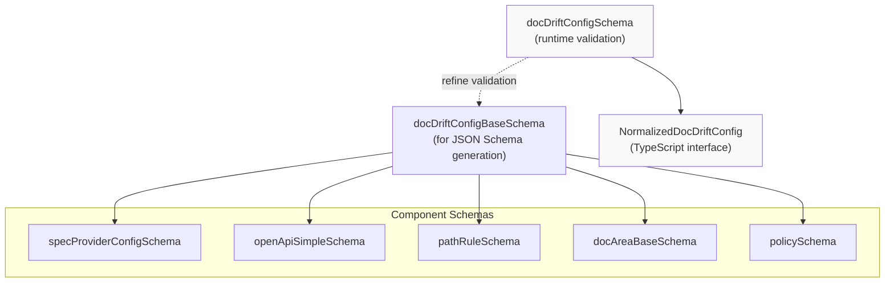
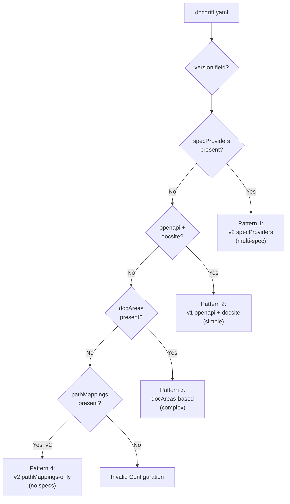
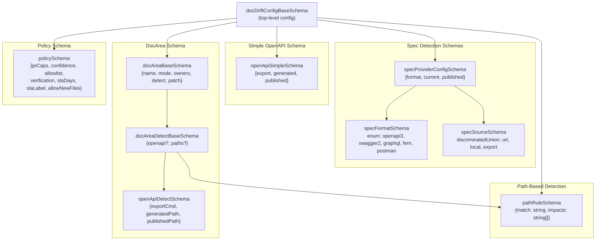
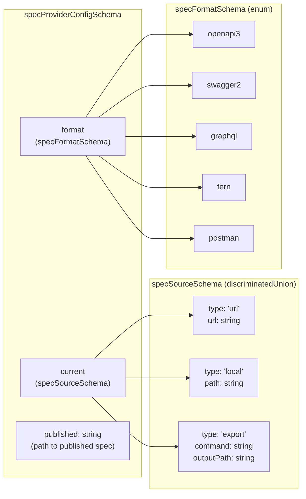
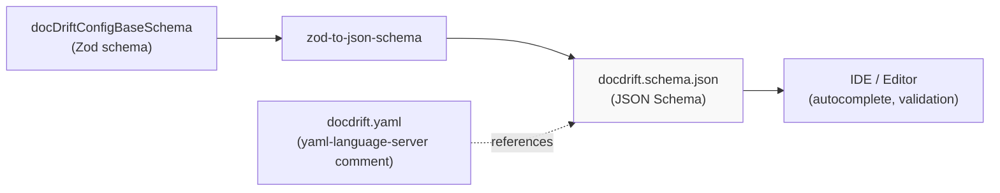

# Configuration Schema

<details>
<summary>Relevant source files</summary>

The following files were used as context for generating this wiki page:

- [docdrift.schema.json](docdrift.schema.json)
- [src/config/normalize.ts](src/config/normalize.ts)
- [src/config/schema.ts](src/config/schema.ts)
- [src/detect/index.ts](src/detect/index.ts)
- [src/setup/generate-yaml.ts](src/setup/generate-yaml.ts)
- [test/config.test.ts](test/config.test.ts)

</details>


This page documents the structure and types that define the `docdrift.yaml` configuration file. It covers the Zod schema definitions, supported configuration versions, and the four distinct configuration patterns that the schema accommodates.

For detailed field-by-field documentation, see [Configuration File Reference](#4.3). For information about how configurations are validated and transformed into a normalized form, see [Validation and Normalization](#4.2).

---

## Schema Versions

The docdrift configuration supports two schema versions, specified via the `version` field:

| Version | Purpose | Key Features |
|---------|---------|--------------|
| `1` | Legacy format | Supports `openapi` + `docsite` simple config, or `docAreas` complex config |
| `2` | Current format | Introduces `specProviders` array for multiple API specs, supports `mode: "auto"` |

Both versions share the same core structure for `devin`, `policy`, and other operational settings. The primary difference is how API specification detection is configured.

**Sources:** [src/config/schema.ts:1-169](), [docdrift.schema.json:8-13]()

---

## Core Schema Types

The configuration schema is implemented using Zod in [src/config/schema.ts]() and generates a JSON Schema at [docdrift.schema.json]() for IDE tooling.

### Primary Schema Exports



**Key Distinctions:**

- **`docDriftConfigBaseSchema`**: Used for JSON Schema generation via `zod-to-json-schema`. Does not include `.refine()` validators because they cannot be represented in JSON Schema.
- **`docDriftConfigSchema`**: Runtime validation schema with refinement rules that enforce cross-field constraints.
- **`NormalizedDocDriftConfig`**: TypeScript interface representing the unified internal format after normalization.

**Sources:** [src/config/schema.ts:101-169]()

---

## Four Configuration Patterns

The schema accommodates four distinct configuration patterns, allowing projects to choose the appropriate level of complexity:

### Configuration Pattern Decision Tree



### Pattern Details

| Pattern | Version | Primary Fields | Use Case |
|---------|---------|----------------|----------|
| 1. Multi-Spec | `2` | `specProviders[]` | Projects with multiple API specs (OpenAPI, GraphQL, etc.) |
| 2. Simple | `1` | `openapi`, `docsite` | Single OpenAPI spec with optional `pathMappings` |
| 3. DocAreas | `1` | `docAreas[]` | Complex projects with multiple documentation areas and detection rules |
| 4. PathMappings-Only | `2` | `pathMappings[]` | Projects without API specs, using path-based detection only |

**Sources:** [src/config/schema.ts:145-154](), [src/config/normalize.ts:8-142](), [test/config.test.ts:79-176]()

---

## Schema Type Hierarchy

The following diagram maps the Zod schema types to their TypeScript representations and shows how they compose:

### Component Schema Structure



**Sources:** [src/config/schema.ts:4-121]()

---

## Top-Level Schema Fields

The `docDriftConfigBaseSchema` defines the following top-level structure:

| Field | Type | Required | Default | Description |
|-------|------|----------|---------|-------------|
| `version` | `1 \| 2` | Yes | - | Schema version identifier |
| `specProviders` | `SpecProviderConfig[]` | No | - | Array of API spec providers (v2) |
| `openapi` | `OpenApiSimpleSchema` | No | - | Simple OpenAPI config (v1) |
| `docsite` | `string \| string[]` | No | - | Documentation site root path(s) |
| `exclude` | `string[]` | No | `[]` | Glob patterns to exclude from processing |
| `requireHumanReview` | `string[]` | No | `[]` | Paths requiring manual review before PR |
| `pathMappings` | `PathRule[]` | No | `[]` | Code-to-docs impact mappings |
| `mode` | `"strict" \| "auto"` | No | `"strict"` | Run gate behavior (see [Run Gate Logic](#6.4)) |
| `devin` | `DevinConfig` | Yes | - | Devin AI session configuration |
| `policy` | `PolicyConfig` | Yes | - | Policy engine settings |
| `docAreas` | `DocAreaConfig[]` | No | `[]` | Per-area detection and patching rules |

**Sources:** [src/config/schema.ts:101-121](), [docdrift.schema.json:6-437]()

---

## Schema Validation Rules

The runtime schema `docDriftConfigSchema` applies additional validation beyond basic type checking:

### Cross-Field Validation

```typescript
// From src/config/schema.ts:145-154
docDriftConfigSchema.refine(
  (v) => {
    if (v.specProviders && v.specProviders.length >= 1) return true;
    if (v.openapi && v.docsite) return true;
    if (v.docAreas.length >= 1) return true;
    if (v.version === 2 && (v.pathMappings?.length ?? 0) >= 1) return true;
    return false;
  },
  { message: "Config must include specProviders, (openapi + docsite), docAreas, or (v2 + pathMappings)" }
)
```

This refinement ensures at least one detection mechanism is configured. Valid combinations:
1. `specProviders` array with ≥1 provider
2. `openapi` object AND `docsite` field
3. `docAreas` array with ≥1 area
4. Version 2 with `pathMappings` array with ≥1 mapping

### DocArea Detection Validation

```typescript
// From src/config/schema.ts:67-69
docAreaDetectBaseSchema.refine(
  (v) => Boolean(v.openapi) || Boolean(v.paths?.length),
  { message: "docArea.detect must include openapi or paths" }
)
```

Each `docArea` must specify at least one detection mechanism: either OpenAPI spec detection or path-based rules.

**Sources:** [src/config/schema.ts:61-74](), [src/config/schema.ts:145-154]()

---

## SpecProviderConfig Schema

The `specProviderConfigSchema` defines how API specifications are sourced and compared:

### SpecProviderConfig Structure



**Example Configuration:**

```yaml
specProviders:
  - format: openapi3
    current:
      type: export
      command: npm run openapi:export
      outputPath: openapi/generated.json
    published: apps/docs-site/openapi/openapi.json
```

**Sources:** [src/config/schema.ts:23-40](), [docdrift.schema.json:15-105]()

---

## PathRule Schema

The `pathRuleSchema` defines code-to-documentation impact mappings:

```typescript
// From src/config/schema.ts:4-7
export const pathRuleSchema = z.object({
  match: z.string().min(1),      // Glob pattern for source code files
  impacts: z.array(z.string().min(1)).min(1),  // Affected doc paths
});
```

Used in two contexts:
1. **`pathMappings`** (top-level): Global code-to-docs mappings
2. **`docArea.detect.paths`**: Per-area detection rules

**Example:**

```yaml
pathMappings:
  - match: "src/api/users/**"
    impacts:
      - "docs/guides/user-management.md"
      - "docs/reference/users-api.md"
```

**Sources:** [src/config/schema.ts:4-7](), [docdrift.schema.json:160-184]()

---

## JSON Schema Generation

The JSON Schema at [docdrift.schema.json]() is automatically generated from `docDriftConfigBaseSchema` (not `docDriftConfigSchema`) because Zod's `.refine()` validators cannot be represented in JSON Schema.

### Schema Generation Flow



**YAML File Header:**

```yaml
# yaml-language-server: $schema=https://unpkg.com/@devinnn/docdrift@latest/docdrift.schema.json
version: 2
# ... rest of config
```

This comment enables schema-aware editing in VSCode and other editors that support YAML Language Server.

**Sources:** [src/setup/generate-yaml.ts:113-117](), [docdrift.schema.json:1-438]()

---

## Default Configuration Values

The setup system applies structural defaults when generating configurations:

### DEFAULT_CONFIG Constants

```typescript
// From src/setup/generate-yaml.ts:67-93
const DEFAULT_CONFIG = {
  version: 2,
  specProviders: [],
  exclude: [],
  requireHumanReview: [],
  pathMappings: [],
  mode: "strict",
  devin: {
    apiVersion: "v1",
    unlisted: true,
    maxAcuLimit: 2,
    tags: ["docdrift"],
  },
  policy: {
    prCaps: { maxPrsPerDay: 5, maxFilesTouched: 30 },
    confidence: { autopatchThreshold: 0.8 },
    allowlist: ["openapi/**"],
    verification: { commands: ["npm run build"] },
    slaDays: 7,
    slaLabel: "docdrift",
    allowNewFiles: false,
  },
};
```

Note: Path-specific fields (`docsite`, `specProviders`, `allowlist` paths) are populated by inference, not defaults.

**Sources:** [src/setup/generate-yaml.ts:66-93]()

---

## Schema Validation Entry Points

The schema is validated at multiple points in the system:

| Function | Location | Purpose |
|----------|----------|---------|
| `docDriftConfigSchema.safeParse()` | [src/config/schema.ts:145-154]() | Runtime config validation |
| `validateYamlContent()` | [src/setup/generate-yaml.ts:120-132]() | YAML string validation |
| `validateGeneratedConfig()` | [src/setup/generate-yaml.ts:134-141]() | Post-generation validation |
| `validateRuntimeConfig()` | Referenced in [CLI Reference](#3.2) | Command-level validation with executable checks |

**Sources:** [src/setup/generate-yaml.ts:120-141](), [src/config/schema.ts:145-154]()

---