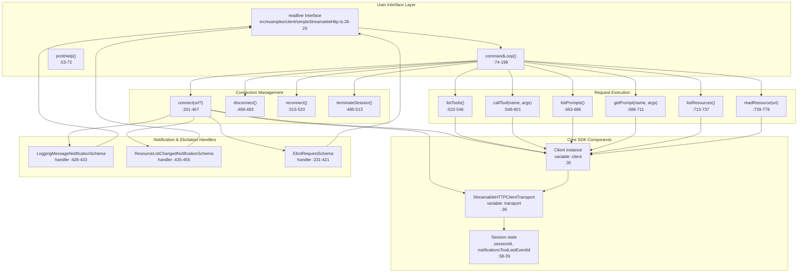
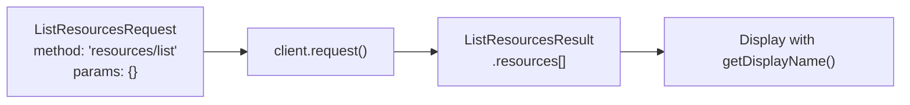
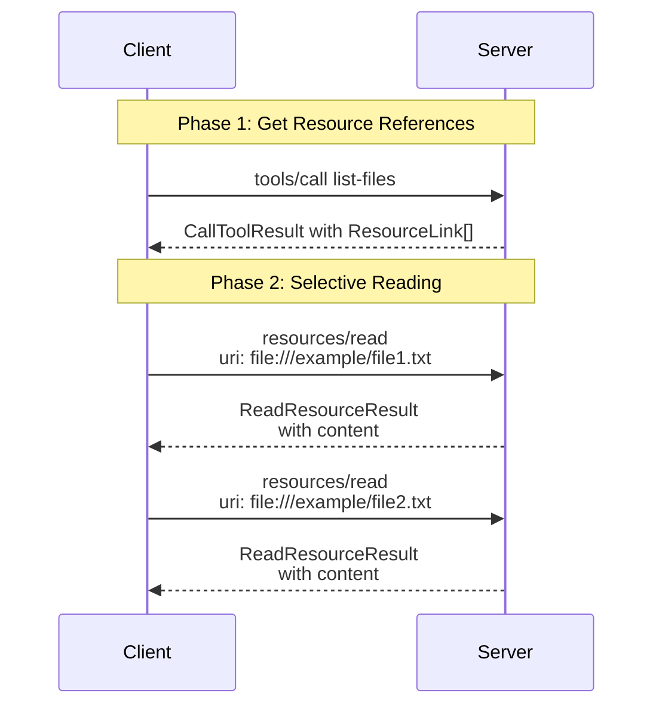
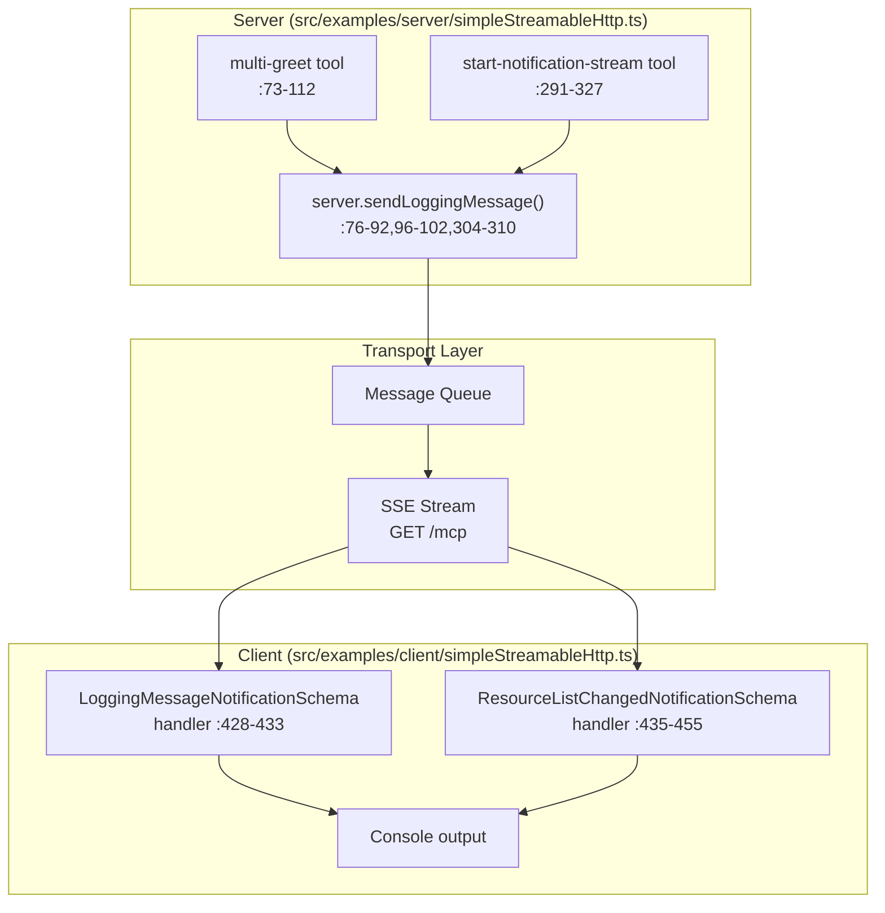
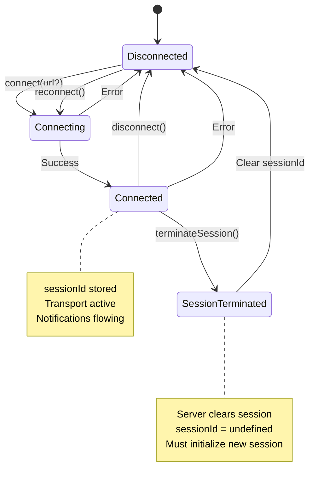

# Client Examples and Patterns

<details>
<summary>Relevant source files</summary>

The following files were used as context for generating this wiki page:

- [examples/server/src/elicitationUrlExample.ts](examples/server/src/elicitationUrlExample.ts)
- [examples/server/src/jsonResponseStreamableHttp.ts](examples/server/src/jsonResponseStreamableHttp.ts)
- [examples/server/src/simpleStatelessStreamableHttp.ts](examples/server/src/simpleStatelessStreamableHttp.ts)
- [examples/server/src/simpleStreamableHttp.ts](examples/server/src/simpleStreamableHttp.ts)
- [packages/server/package.json](packages/server/package.json)
- [packages/server/src/experimental/tasks/mcpServer.ts](packages/server/src/experimental/tasks/mcpServer.ts)
- [pnpm-lock.yaml](pnpm-lock.yaml)
- [pnpm-workspace.yaml](pnpm-workspace.yaml)
- [test/integration/test/client/client.test.ts](test/integration/test/client/client.test.ts)
- [test/integration/test/server.test.ts](test/integration/test/server.test.ts)
- [test/integration/test/server/mcp.test.ts](test/integration/test/server/mcp.test.ts)
- [test/integration/test/taskLifecycle.test.ts](test/integration/test/taskLifecycle.test.ts)

</details>


## Purpose and Scope

This page demonstrates practical patterns for building MCP clients through runnable example implementations. It covers connection management, capability invocation (tools, resources, prompts), notification handling, elicitation workflows, transport fallback strategies, and parallel operations. For low-level details on the Client protocol class, see [4.1](#4.1). For transport-specific configuration, see [4.2](#4.2), [4.3](#4.3), and [4.4](#4.4).

The examples on this page reference multiple client implementations:

- **Interactive CLI client**: [examples/client/src/simpleStreamableHttp.ts]() - comprehensive demonstration of client capabilities
- **Transport fallback client**: [examples/client/src/streamableHttpWithSseFallbackClient.ts]() - backwards compatibility pattern
- **Parallel clients**: [examples/client/src/multipleClientsParallel.ts]() - concurrent connection management
- **Parallel tool calls**: [examples/client/src/parallelToolCallsClient.ts]() - concurrent tool execution
- **SSE polling client**: [examples/client/src/ssePollingClient.ts]() - legacy SSE transport usage

Corresponding server examples are located in [examples/server/]().

**Sources:** [README.md:85-125](), [docs/client.md:13-19]()

---

## Interactive Client Architecture

The example client demonstrates a command-driven architecture for exploring MCP servers interactively. The design separates concerns between connection management, request execution, and user interaction.



**Sources:** [src/examples/client/simpleStreamableHttp.ts:1-838]()

---

## Basic Client Setup Pattern

The client initialization pattern demonstrates creating a `Client` instance with declared capabilities, configuring notification handlers, and establishing transport connections. This pattern is foundational for all MCP client implementations.

### Client Instance Creation

```typescript
// Pattern: Create client with capabilities declaration
const client = new Client(
    { name: 'example-client', version: '1.0.0' },
    { capabilities: { elicitation: {} } }
);

// Pattern: Set error handler for protocol-level errors
client.onerror = error => {
    console.error('Client error:', error);
};
```

The client declares its capabilities during initialization [src/examples/client/simpleStreamableHttp.ts:215-228](). The `elicitation` capability indicates this client can handle `ElicitRequestSchema` requests from the server.

### Transport Connection

```typescript
// Pattern: Create transport with optional session resumption
transport = new StreamableHTTPClientTransport(
    new URL(serverUrl),
    { sessionId: sessionId }  // Resume existing session if available
);

// Pattern: Connect client to transport
await client.connect(transport);

// Pattern: Store session ID for reconnection
sessionId = transport.sessionId;
```

Connection establishment follows a three-step pattern: create transport, connect client, capture session identifier [src/examples/client/simpleStreamableHttp.ts:423-461]().

### Notification Handler Registration

Notification handlers must be registered before calling `client.connect()` to ensure no early notifications are missed:

```typescript
// Pattern: Register notification handlers before connection
client.setNotificationHandler(LoggingMessageNotificationSchema, notification => {
    console.log(`${notification.params.level}: ${notification.params.data}`);
});

client.setNotificationHandler(ResourceListChangedNotificationSchema, async _ => {
    // Re-fetch resources when list changes
    const resources = await client.request(
        { method: 'resources/list', params: {} },
        ListResourcesResultSchema
    );
});
```

Two notification handlers are configured: `LoggingMessageNotificationSchema` for server log messages [src/examples/client/simpleStreamableHttp.ts:428-433]() and `ResourceListChangedNotificationSchema` for dynamic resource updates [src/examples/client/simpleStreamableHttp.ts:435-455]().

**Sources:** [src/examples/client/simpleStreamableHttp.ts:201-467]()

---

## Tool Invocation Patterns

Tool invocation follows a request-response pattern with optional schema validation and specialized content handling for `ResourceLink` objects.

### Listing Available Tools

```mermaid
sequenceDiagram
    participant User
    participant listTools["listTools()<br/>:522-546"]
    participant Client["client: Client"]
    participant Server
    
    User->>listTools: list-tools command
    listTools->>Client: request(ListToolsRequest,<br/>ListToolsResultSchema)
    Client->>Server: tools/list
    Server-->>Client: ListToolsResult
    Client-->>listTools: toolsResult
    listTools->>listTools: Display with getDisplayName()
    listTools-->>User: Tool list output
```

The `listTools()` function requests available tools and displays them using the `getDisplayName()` utility [src/examples/client/simpleStreamableHttp.ts:522-546](). This utility respects the title field precedence: `title` → `annotations.title` → `name` [src/shared/metadataUtils.ts:13-29]().

### Calling Tools with Arguments

```typescript
// Pattern: Construct typed tool call request
const request: CallToolRequest = {
    method: 'tools/call',
    params: {
        name: toolName,
        arguments: toolArgs  // Record<string, unknown>
    }
};

// Pattern: Execute request with schema validation
const result = await client.request(request, CallToolResultSchema);
```

Tool invocation uses `CallToolRequest` and validates responses against `CallToolResultSchema` [src/examples/client/simpleStreamableHttp.ts:555-564]().

### Handling Tool Results with ResourceLinks

Tools may return `ResourceLink` content items that reference resources without embedding their full content. The pattern identifies and extracts these links for subsequent access:

```typescript
// Pattern: Process tool result content
const resourceLinks: ResourceLink[] = [];

result.content.forEach(item => {
    if (item.type === 'text') {
        console.log(item.text);
    } else if (item.type === 'resource_link') {
        const resourceLink = item as ResourceLink;
        resourceLinks.push(resourceLink);
        // Display link metadata: uri, name, mimeType, description
    } else if (item.type === 'resource') {
        // Embedded resource content
    } else if (item.type === 'image' || item.type === 'audio') {
        // Media content
    }
});

// Pattern: Offer to read linked resources
if (resourceLinks.length > 0) {
    console.log('Use read-resource <uri> to read their content.');
}
```

This pattern appears in `callTool()` [src/examples/client/simpleStreamableHttp.ts:567-597](). The server example demonstrates returning `ResourceLink` objects in the `list-files` tool [src/examples/server/simpleStreamableHttp.ts:402-424]().

### Specialized Tool Invocation: Multi-Greet Pattern

The `multi-greet` tool demonstrates handling tools that send logging notifications during execution:

```typescript
// Pattern: Tool with streaming notifications
await callTool('multi-greet', { name });
// Notifications arrive asynchronously via LoggingMessageNotificationSchema handler
```

The server sends `debug` and `info` level notifications with delays between them [src/examples/server/simpleStreamableHttp.ts:73-112](), demonstrating that tool execution and notification delivery are decoupled.

**Sources:** [src/examples/client/simpleStreamableHttp.ts:522-620](), [src/examples/server/simpleStreamableHttp.ts:62-113,392-440](), [src/shared/metadataUtils.ts:1-30]()

---

## Resource Access Patterns

Resource access follows a two-phase pattern: list available resources, then read specific resource contents by URI.

### Listing Resources



The `listResources()` function retrieves all available resources and displays their metadata [src/examples/client/simpleStreamableHttp.ts:713-737]().

### Reading Resource Contents

```typescript
// Pattern: Read resource by URI
const request: ReadResourceRequest = {
    method: 'resources/read',
    params: { uri }
};

const result = await client.request(request, ReadResourceResultSchema);

// Pattern: Process resource contents
for (const content of result.contents) {
    if ('text' in content && typeof content.text === 'string') {
        // Text content
    } else if ('blob' in content && typeof content.blob === 'string') {
        // Binary content (base64 encoded)
    }
}
```

The `readResource()` function handles both text and binary content [src/examples/client/simpleStreamableHttp.ts:739-778](). The server provides static resources at fixed URIs [src/examples/server/simpleStreamableHttp.ts:329-389]().

### ResourceLink Resolution Pattern

When tools return `ResourceLink` objects, the client can selectively read only needed resources:



This pattern avoids transferring large resource contents until explicitly requested. The `list-files` tool demonstrates this optimization [src/examples/server/simpleStreamableHttp.ts:392-440]().

### Dynamic Resource List Updates

The `ResourceListChangedNotificationSchema` handler demonstrates reacting to dynamic resource changes:

```typescript
// Pattern: Handle resource list changes
client.setNotificationHandler(ResourceListChangedNotificationSchema, async _ => {
    // Re-fetch resources when server notifies of changes
    const resourcesResult = await client.request(
        { method: 'resources/list', params: {} },
        ListResourcesResultSchema
    );
    console.log('Available resources count:', resourcesResult.resources.length);
});
```

This handler re-fetches the resource list when notified [src/examples/client/simpleStreamableHttp.ts:435-455](), maintaining consistency with server-side state changes.

**Sources:** [src/examples/client/simpleStreamableHttp.ts:435-455,713-778](), [src/examples/server/simpleStreamableHttp.ts:329-440]()

---

## Prompt Retrieval Patterns

Prompts provide reusable conversation templates. The client lists available prompts and retrieves specific prompt templates with arguments.

### Listing Prompts

```typescript
// Pattern: List all prompts
const promptsRequest: ListPromptsRequest = {
    method: 'prompts/list',
    params: {}
};

const promptsResult = await client.request(promptsRequest, ListPromptsResultSchema);

// Pattern: Display prompts with getDisplayName()
for (const prompt of promptsResult.prompts) {
    console.log(`id: ${prompt.name}, name: ${getDisplayName(prompt)}`);
}
```

The `listPrompts()` function retrieves and displays available prompts [src/examples/client/simpleStreamableHttp.ts:663-686]().

### Retrieving Prompt Templates

```typescript
// Pattern: Get prompt with arguments
const promptRequest: GetPromptRequest = {
    method: 'prompts/get',
    params: {
        name: promptName,
        arguments: promptArgs as Record<string, string>
    }
};

const promptResult = await client.request(promptRequest, GetPromptResultSchema);

// Pattern: Process prompt messages
promptResult.messages.forEach((msg, index) => {
    console.log(`[${index + 1}] ${msg.role}: ${msg.content.text}`);
});
```

The `getPrompt()` function retrieves prompt templates and displays their message structure [src/examples/client/simpleStreamableHttp.ts:688-711](). The server provides the `greeting-template` prompt that generates user-facing conversation starters [src/examples/server/simpleStreamableHttp.ts:265-287]().

**Sources:** [src/examples/client/simpleStreamableHttp.ts:663-711](), [src/examples/server/simpleStreamableHttp.ts:265-287]()

---

## Notification Handling Patterns

Notifications provide asynchronous updates from the server. The client registers handlers for different notification types before connection establishment.

### Notification Handler Architecture



### Logging Notification Pattern

```typescript
// Pattern: Handle server logging notifications
client.setNotificationHandler(LoggingMessageNotificationSchema, notification => {
    notificationCount++;
    console.log(`Notification #${notificationCount}: ${notification.params.level} - ${notification.params.data}`);
    process.stdout.write('> ');  // Re-display prompt
});
```

The logging notification handler displays server messages and maintains a count [src/examples/client/simpleStreamableHttp.ts:428-433](). The server sends logging notifications at different levels (`debug`, `info`) [src/examples/server/simpleStreamableHttp.ts:76-102]().

### List Changed Notification Pattern

```typescript
// Pattern: Handle dynamic capability list changes
client.setNotificationHandler(ResourceListChangedNotificationSchema, async _ => {
    console.log('Resource list changed notification received!');
    
    // Pattern: Re-fetch list to synchronize
    const resourcesResult = await client.request(
        { method: 'resources/list', params: {} },
        ListResourcesResultSchema
    );
    
    console.log('Available resources count:', resourcesResult.resources.length);
    process.stdout.write('> ');  // Re-display prompt
});
```

List changed notifications trigger re-fetching of the affected capability list [src/examples/client/simpleStreamableHttp.ts:435-455](). This maintains synchronization when servers dynamically add, remove, or update capabilities.

### Notification Count Tracking

The client tracks notification delivery for debugging resumability:

```typescript
// Pattern: Track notification delivery
let notificationCount = 0;

client.setNotificationHandler(LoggingMessageNotificationSchema, notification => {
    notificationCount++;
    // Process notification
});
```

The counter helps verify that resumption mechanisms (like Last-Event-ID) properly replay missed notifications [src/examples/client/simpleStreamableHttp.ts:32,429]().

**Sources:** [src/examples/client/simpleStreamableHttp.ts:32,428-455](), [src/examples/server/simpleStreamableHttp.ts:73-112,291-327]()

---

## Elicitation Pattern

Elicitation enables servers to collect structured user input during tool execution. The client implements a handler that validates input against JSON schemas provided by the server.

### Elicitation Flow

```mermaid
sequenceDiagram
    participant User
    participant Client["Client<br/>ElicitRequestSchema handler<br/>:231-421"]
    participant Validator["AJV Validator<br/>:242-243"]
    participant Server["Server<br/>collect-user-info tool<br/>:116-262"]
    
    User->>Server: Call tool 'collect-user-info'
    Server->>Client: ElicitRequest<br/>{message, requestedSchema}
    Client->>Client: Display schema to user
    Client->>User: Prompt for each field
    User-->>Client: Input values
    Client->>Validator: validate(content)
    Validator-->>Client: Validation result
    
    alt Validation passes
        Client->>User: Show collected data
        User-->>Client: Confirm (yes/no/cancel)
        alt User confirms
            Client-->>Server: {action: 'accept', content}
            Server-->>Client: Tool result with collected data
        else User declines
            Client-->>Server: {action: 'decline'}
            Server-->>Client: Tool result indicating declined
        end
    else Validation fails
        Client->>Client: Retry up to maxAttempts
    end
```

### Elicitation Handler Implementation

```typescript
// Pattern: Register elicitation handler
client.setRequestHandler(ElicitRequestSchema, async request => {
    const schema = request.params.requestedSchema;
    const properties = schema.properties;
    const required = schema.required || [];
    
    // Pattern: Create validator for requested schema
    const ajv = new Ajv();
    const validate = ajv.compile(schema);
    
    const maxAttempts = 3;
    let attempts = 0;
    
    while (attempts < maxAttempts) {
        attempts++;
        const content: Record<string, unknown> = {};
        
        // Pattern: Collect input for each field
        for (const [fieldName, fieldSchema] of Object.entries(properties)) {
            const field = fieldSchema as {
                type?: string;
                title?: string;
                description?: string;
                enum?: string[];
                minimum?: number;
                maximum?: number;
                // ... other JSON Schema properties
            };
            
            // Pattern: Build helpful prompt with schema information
            let prompt = `${field.title || fieldName}`;
            if (field.description) prompt += ` (${field.description})`;
            if (field.enum) prompt += ` [options: ${field.enum.join(', ')}]`;
            
            const answer = await getUserInput(prompt);
            
            // Pattern: Parse based on type
            if (field.type === 'boolean') {
                content[fieldName] = answer.toLowerCase() === 'true';
            } else if (field.type === 'number') {
                content[fieldName] = parseFloat(answer);
            } else if (field.type === 'integer') {
                content[fieldName] = parseInt(answer, 10);
            } else {
                content[fieldName] = answer;
            }
        }
        
        // Pattern: Validate complete object
        const isValid = validate(content);
        if (!isValid) {
            console.log('Validation errors:', validate.errors);
            continue;  // Retry
        }
        
        // Pattern: Confirm before submitting
        const confirmed = await getUserConfirmation();
        if (confirmed) {
            return { action: 'accept', content };
        }
    }
    
    return { action: 'decline' };
});
```

The full implementation handles type parsing, validation retries, and user confirmation [src/examples/client/simpleStreamableHttp.ts:231-421]().

### Server-Side Elicitation Trigger

The server's `collect-user-info` tool demonstrates triggering elicitation with different schemas based on the requested information type:

```typescript
// Server pattern: Trigger elicitation
const result = await server.server.elicitInput({
    message: 'Please provide your contact information',
    requestedSchema: {
        type: 'object',
        properties: {
            name: {
                type: 'string',
                title: 'Full Name',
                description: 'Your full name'
            },
            email: {
                type: 'string',
                title: 'Email Address',
                format: 'email'
            }
        },
        required: ['name', 'email']
    }
});

if (result.action === 'accept') {
    // Process collected content
} else if (result.action === 'decline') {
    // Handle user decline
}
```

The server provides different schemas for `contact`, `preferences`, and `feedback` information types [src/examples/server/simpleStreamableHttp.ts:116-262]().

### Elicitation Response Actions

The client can respond with three actions:

| Action | Description | Usage |
|--------|-------------|-------|
| `accept` | Submit collected content | User confirms valid input |
| `decline` | Refuse to provide information | User chooses not to provide data |
| `cancel` | Abort the operation | User cancels at any input stage |

The pattern checks for cancellation during field collection [src/examples/client/simpleStreamableHttp.ts:308-311,356-358,397-408]().

**Sources:** [src/examples/client/simpleStreamableHttp.ts:231-421](), [src/examples/server/simpleStreamableHttp.ts:116-262]()

---

## Session Management and Resumability

Session management enables persistent connections with reconnection support. The resumability pattern uses event IDs to replay missed notifications after disconnection.

### Session Lifecycle



### Session Initialization and Storage

```typescript
// Pattern: Initialize session on first connection
transport = new StreamableHTTPClientTransport(new URL(serverUrl), {
    sessionId: sessionId  // undefined for new session, stored value for reconnection
});

await client.connect(transport);

// Pattern: Store session ID for future reconnection
sessionId = transport.sessionId;
console.log('Transport created with session ID:', sessionId);
```

The client stores the session ID in a module-level variable [src/examples/client/simpleStreamableHttp.ts:39,423-461](). On subsequent connections, passing the stored `sessionId` enables session resumption without re-initialization.

### Reconnection Pattern

```typescript
// Pattern: Reconnect to same session
async function reconnect(): Promise<void> {
    if (client) {
        await disconnect();  // Close existing connection
    }
    await connect();  // Reconnect with stored sessionId
}
```

The `reconnect()` function closes the existing connection and creates a new one, reusing the stored session identifier [src/examples/client/simpleStreamableHttp.ts:515-520]().

### Session Termination

```typescript
// Pattern: Terminate session with server
await transport.terminateSession();

// Pattern: Check if server cleared session
if (!transport.sessionId) {
    console.log('Session ID has been cleared');
    sessionId = undefined;
    client = null;
    transport = null;
} else {
    console.log('Server responded with 405 (not supported)');
}
```

The `terminateSession()` method sends a DELETE request to the server [src/examples/client/simpleStreamableHttp.ts:485-513](). If the server supports termination, it clears the session and returns success. If not, it responds with HTTP 405 Method Not Allowed.

### Resumability with Event IDs

The resumability pattern uses Last-Event-ID headers to replay missed SSE events after reconnection:

```typescript
// Pattern: Track last event ID for resumption
let notificationsToolLastEventId: string | undefined = undefined;

// Pattern: Use resumption token in requests
const result = await client.request(
    request,
    CallToolResultSchema,
    {
        resumptionToken: notificationsToolLastEventId,
        onresumptiontoken: (eventId: string) => {
            notificationsToolLastEventId = eventId;
            console.log(`Updated resumption token: ${eventId}`);
        }
    }
);
```

The `onresumptiontoken` callback captures event IDs during long-running operations [src/examples/client/simpleStreamableHttp.ts:38,640-648](). When reconnecting, the transport sends the Last-Event-ID header, and the server replays events starting from that point.

### Connection State Management Table

| Variable | Type | Purpose | Lifecycle |
|----------|------|---------|-----------|
| `client` | `Client \| null` | Protocol instance | Created on connect, cleared on disconnect |
| `transport` | `StreamableHTTPClientTransport \| null` | Transport layer | Created on connect, cleared on disconnect |
| `sessionId` | `string \| undefined` | Session identifier | Stored across connections, cleared on terminate |
| `notificationsToolLastEventId` | `string \| undefined` | Resumption token | Updated during operations, used for replay |
| `serverUrl` | `string` | Server endpoint | Persistent, defaults to `http://localhost:3000/mcp` |

These variables maintain connection state across the client lifecycle [src/examples/client/simpleStreamableHttp.ts:35-39]().

**Sources:** [src/examples/client/simpleStreamableHttp.ts:35-39,201-520,622-661](), [src/examples/server/simpleStreamableHttp.ts:531-672]()

---

## Command-Line Interface Pattern

The interactive CLI demonstrates a complete client implementation with a command loop, input handling, and graceful shutdown.

### Command Processing Loop

```typescript
// Pattern: Interactive command loop
function commandLoop(): void {
    readline.question('\n> ', async input => {
        const args = input.trim().split(/\s+/);
        const command = args[0]?.toLowerCase();
        
        try {
            switch (command) {
                case 'connect':
                    await connect(args[1]);
                    break;
                case 'list-tools':
                    await listTools();
                    break;
                case 'call-tool':
                    await callTool(args[1], parseJSON(args[2]));
                    break;
                // ... other commands
            }
        } catch (error) {
            console.error(`Error executing command: ${error}`);
        }
        
        commandLoop();  // Continue loop
    });
}
```

The command loop parses user input and dispatches to handler functions [src/examples/client/simpleStreamableHttp.ts:74-198]().

### Graceful Shutdown Pattern

```typescript
// Pattern: Cleanup on exit
async function cleanup(): Promise<void> {
    if (client && transport) {
        try {
            // Pattern: Terminate session before exit
            if (transport.sessionId) {
                await transport.terminateSession();
            }
            
            // Pattern: Close transport
            await transport.close();
        } catch (error) {
            console.error('Error closing transport:', error);
        }
    }
    
    readline.close();
    process.exit(0);
}

// Pattern: Handle SIGINT (Ctrl+C)
process.on('SIGINT', async () => {
    await cleanup();
});
```

The cleanup function ensures graceful shutdown by terminating the session and closing the transport [src/examples/client/simpleStreamableHttp.ts:780-805,828-831]().

### Keyboard Interrupt Handling

```typescript
// Pattern: Enable raw mode for Escape key detection
process.stdin.setRawMode(true);
process.stdin.on('data', async data => {
    if (data.length === 1 && data[0] === 27) {  // ESC key
        console.log('ESC key pressed. Disconnecting from server...');
        if (client && transport) {
            await disconnect();
        }
        process.stdout.write('> ');  // Re-display prompt
    }
});
```

Raw mode enables detecting the Escape key for aborting operations [src/examples/client/simpleStreamableHttp.ts:808-825]().

### Available Commands Reference

| Command | Arguments | Description | Implementation |
|---------|-----------|-------------|----------------|
| `connect` | `[url]` | Connect to MCP server | [connect():201-467]() |
| `disconnect` | - | Close connection | [disconnect():469-483]() |
| `terminate-session` | - | End server session | [terminateSession():485-513]() |
| `reconnect` | - | Reconnect to server | [reconnect():515-520]() |
| `list-tools` | - | List available tools | [listTools():522-546]() |
| `call-tool` | `<name> [args]` | Invoke a tool | [callTool():548-601]() |
| `greet` | `[name]` | Call greet tool | [callGreetTool():603-605]() |
| `multi-greet` | `[name]` | Call multi-greet with notifications | [callMultiGreetTool():607-610]() |
| `collect-info` | `[type]` | Test elicitation | [callCollectInfoTool():612-615]() |
| `start-notifications` | `[interval] [count]` | Start notification stream | [startNotifications():617-620]() |
| `run-notifications-tool-with-resumability` | `[interval] [count]` | Test resumability | [runNotificationsToolWithResumability():622-661]() |
| `list-prompts` | - | List available prompts | [listPrompts():663-686]() |
| `get-prompt` | `<name> [args]` | Get prompt template | [getPrompt():688-711]() |
| `list-resources` | - | List available resources | [listResources():713-737]() |
| `read-resource` | `<uri>` | Read resource content | [readResource():739-778]() |
| `help` | - | Show help text | [printHelp():53-72]() |
| `quit` / `exit` | - | Exit program | [cleanup():780-805]() |

Commands are dispatched through the switch statement in `commandLoop()` [src/examples/client/simpleStreamableHttp.ts:80-191]().

**Sources:** [src/examples/client/simpleStreamableHttp.ts:41-51,53-198,780-837]()

---