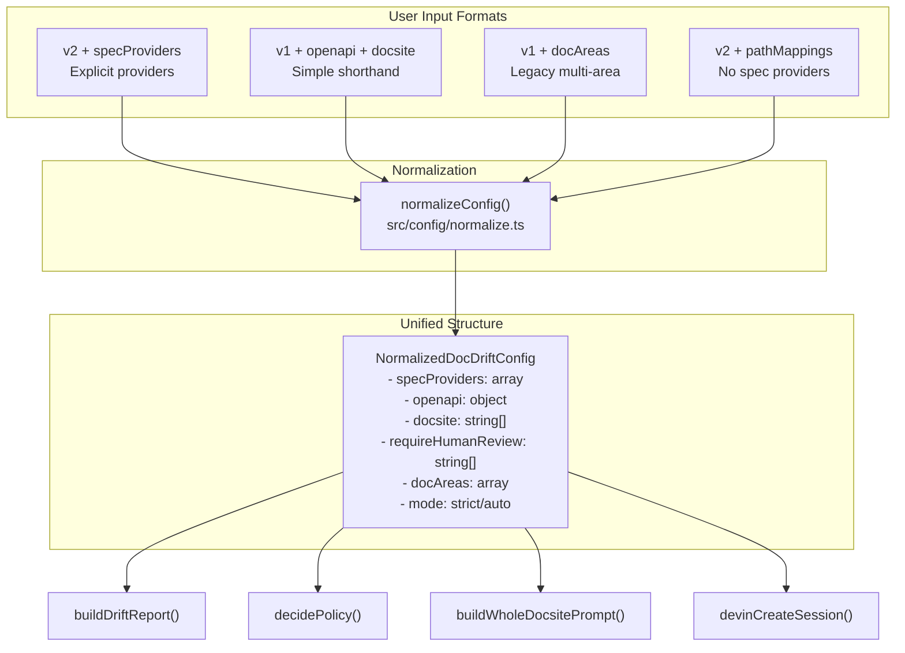
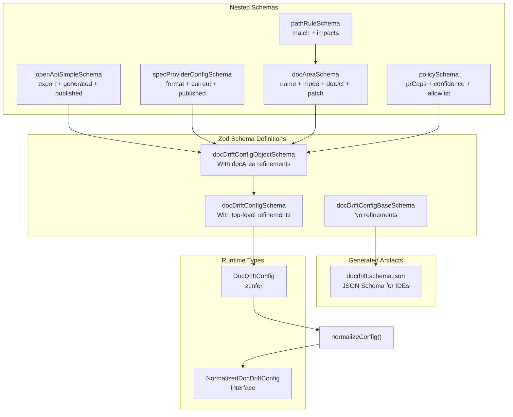
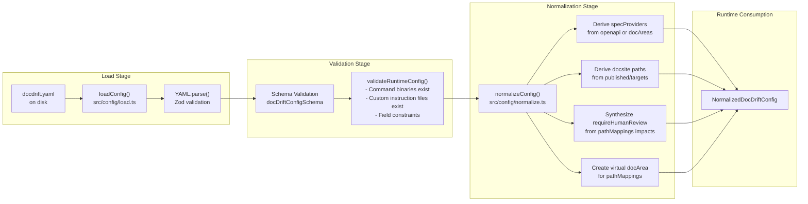
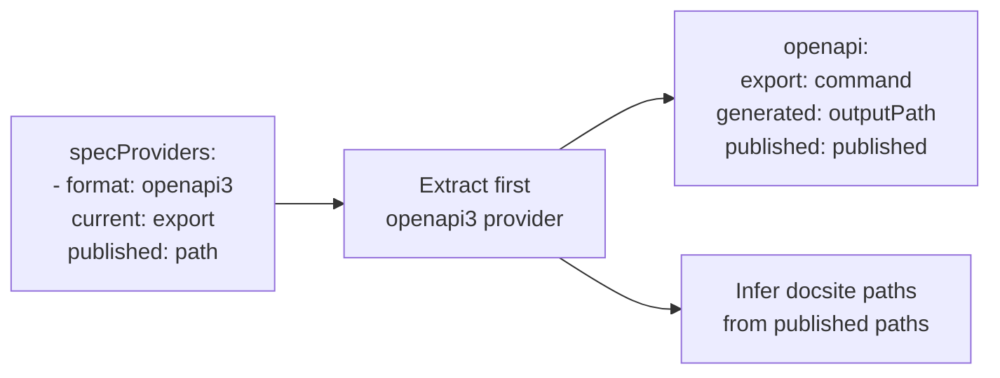
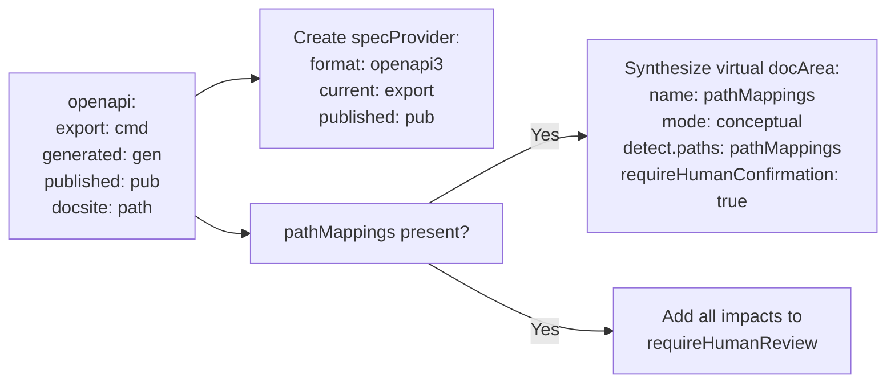
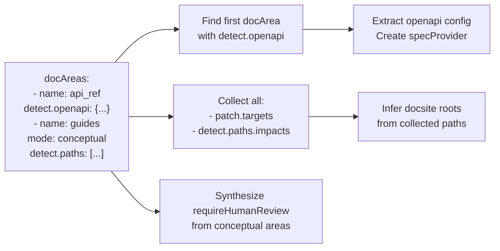
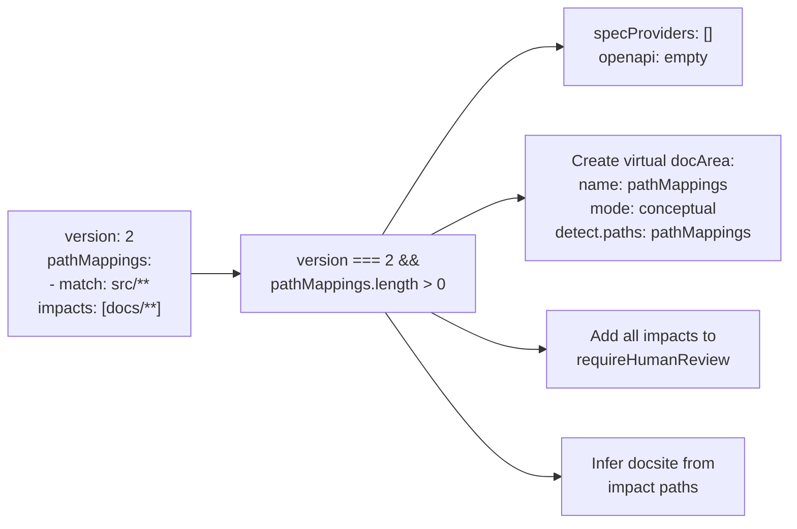
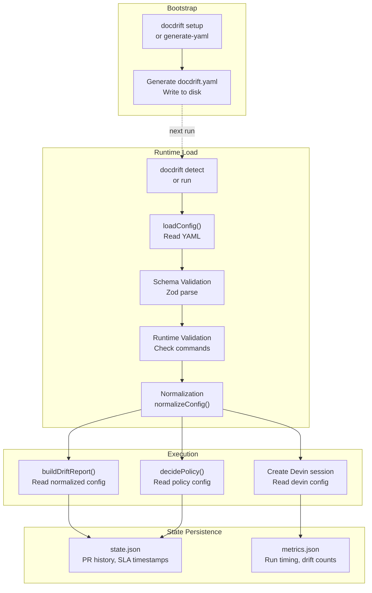

# Configuration System

<details>
<summary>Relevant source files</summary>

The following files were used as context for generating this wiki page:

- [docdrift-yml.md](docdrift-yml.md)
- [docdrift.schema.json](docdrift.schema.json)
- [src/config/normalize.ts](src/config/normalize.ts)
- [src/config/schema.ts](src/config/schema.ts)
- [src/detect/index.ts](src/detect/index.ts)
- [src/index.ts](src/index.ts)
- [test/config.test.ts](test/config.test.ts)

</details>


The Configuration System manages the `docdrift.yaml` file that controls drift detection, policy enforcement, and Devin session behavior. It provides schema validation, normalization of multiple configuration formats into a unified structure, and runtime validation of executable constraints.

This page covers the overall architecture and processing pipeline. For detailed field references, see [Configuration File Reference](#4.3). For setup workflows that generate configuration, see [Setup System](#5).

---

## Overview

The configuration system processes user-provided YAML through three stages:

1. **Schema Validation** - Zod schemas enforce structure and types
2. **Normalization** - Multiple config patterns are transformed into `NormalizedDocDriftConfig`
3. **Runtime Validation** - Executable constraints are checked (commands exist, paths are valid)

The system supports multiple configuration formats to accommodate different use cases:
- **v2 specProviders** - Explicit spec provider configuration
- **Simple config** - `openapi` + `docsite` shorthand
- **Legacy docAreas** - Multi-area configuration
- **pathMappings-only** - Path-based detection without spec providers

---

## Configuration Formats



**Sources:** [src/config/normalize.ts:1-143](), [src/config/schema.ts:156-170]()

---

## Schema Architecture

The configuration system uses Zod for schema definition and validation, generating JSON Schema for IDE support.

### Schema Hierarchy



**Sources:** [src/config/schema.ts:1-170](), [docdrift.schema.json:1-439]()

### Dual Schema Pattern

The system maintains two parallel schema definitions to support both runtime validation (Zod) and IDE tooling (JSON Schema):

| Schema | Purpose | Features |
|--------|---------|----------|
| `docDriftConfigBaseSchema` | JSON Schema generation | No `.refine()` calls (unsupported by zod-to-json-schema) |
| `docDriftConfigObjectSchema` | Runtime validation | Includes `.refine()` for cross-field validation |
| `docDriftConfigSchema` | Top-level validation | Root-level refinement ensuring at least one detection method |

**Sources:** [src/config/schema.ts:101-154]()

---

## Configuration Processing Pipeline



**Sources:** [src/config/load.ts]() (referenced in imports), [src/config/validate.ts]() (referenced in imports), [src/config/normalize.ts:1-143]()

---

## Validation System

Validation occurs in two stages with different concerns:

### Schema Validation

Enforced by Zod schemas at load time. Checks structure, types, and field constraints.

| Validation | Implementation |
|------------|----------------|
| Field types | Zod type definitions (string, number, array, etc.) |
| Required fields | `.required()` in schema definition |
| String lengths | `.min(1)` for non-empty strings |
| Array lengths | `.min(1)` for non-empty arrays |
| Number ranges | `.min()`, `.max()`, `.positive()`, `.int()` |
| Enum values | `z.enum()` for fixed options |
| Cross-field refinements | `.refine()` for docArea detect rules |

**Example refinement:** [src/config/schema.ts:67-69]()
```typescript
detect: docAreaDetectBaseSchema.refine((v) => Boolean(v.openapi) || Boolean(v.paths?.length), {
  message: "docArea.detect must include openapi or paths",
})
```

**Sources:** [src/config/schema.ts:1-170]()

### Runtime Validation

Enforced by `validateRuntimeConfig()` after schema validation. Checks executable constraints.

| Check | Purpose | Implementation |
|-------|---------|----------------|
| Command binaries | Verify `npm`, `pnpm`, etc. exist | `commandExists()` utility |
| Custom instruction files | Verify markdown files exist | File system checks |
| Export command existence | Verify `exportCmd` binary exists | Binary lookup |
| Mode consistency | Verify mode matches docArea patterns | Logic checks |

**Sources:** [src/config/validate.ts]() (referenced in [src/index.ts:4](), [src/index.ts:203-206](), [src/index.ts:246-249]())

---

## Normalization Pipeline

Normalization transforms four configuration patterns into a single `NormalizedDocDriftConfig` structure.

### Pattern 1: v2 specProviders

Explicit `specProviders` array. Derives `openapi` from first OpenAPI3 provider.



**Sources:** [src/config/normalize.ts:17-40]()

### Pattern 2: Simple Config (openapi + docsite)

Direct `openapi` and `docsite` fields. Creates single `specProviders` entry.



**Sources:** [src/config/normalize.ts:41-65]()

### Pattern 3: Legacy docAreas

Extract `openapi` from first docArea with `detect.openapi`. Synthesize `requireHumanReview` from conceptual areas.



**Sources:** [src/config/normalize.ts:66-105]()

### Pattern 4: pathMappings-only (v2)

No spec providers or openapi. Uses only `pathMappings` for detection.



**Sources:** [src/config/normalize.ts:106-130]()

---

## Normalized Configuration Structure

`NormalizedDocDriftConfig` is the runtime representation consumed by all subsystems.

### Key Transformations

| Source Field | Normalized Field | Transformation |
|--------------|------------------|----------------|
| `openapi` or `docAreas[0].detect.openapi` | `specProviders[0]` | Create `SpecProviderConfig` with format `openapi3` |
| `openapi.export` | `openapi.export` | Direct copy or extracted from docArea |
| `docsite` (string or array) | `docsite: string[]` | Always array |
| `pathMappings[].impacts` | `requireHumanReview` | Union of all impacts |
| `pathMappings` | `docAreas` (virtual) | Synthesize conceptual docArea |
| `docAreas` (conceptual mode) | `requireHumanReview` | Union of all targets/impacts |

**Sources:** [src/config/normalize.ts:8-142](), [src/config/schema.ts:160-169]()

### Runtime Usage

```mermaid
graph TB
    Normalized["NormalizedDocDriftConfig"]
    
    subgraph "Detection System"
        Detect["buildDriftReport()<br/>Uses: specProviders, pathMappings, mode"]
        Registry["getSpecDetector()<br/>Uses: specProviders[].format"]
    end
    
    subgraph "Policy Engine"
        Policy["decidePolicy()<br/>Uses: policy.prCaps, confidence, allowlist"]
        State["State Management<br/>Uses: policy.slaDays, slaLabel"]
    end
    
    subgraph "Devin Integration"
        Prompt["buildWholeDocsitePrompt()<br/>Uses: devin settings, exclude patterns"]
        Session["devinCreateSession()<br/>Uses: devin.tags, maxAcuLimit, unlisted"]
    end
    
    subgraph "Evidence Bundle"
        Bundle["buildEvidenceBundle()<br/>Uses: openapi paths, docsite paths"]
        Attach["Attachment Collection<br/>Uses: specProviders[].published"]
    end
    
    Normalized --> Detect
    Normalized --> Registry
    Normalized --> Policy
    Normalized --> State
    Normalized --> Prompt
    Normalized --> Session
    Normalized --> Bundle
    Normalized --> Attach
```



**Sources:** [src/detect/index.ts:13-198](), [src/index.ts:294-302](), [src/devin/prompts.ts]() (referenced in [src/index.ts:22]()), [src/evidence/bundle.ts]() (referenced in [src/index.ts:6]())

---

## Configuration Lifecycle



**Sources:** [src/index.ts:201-242](), [src/setup/index.ts]() (referenced), [src/policy/state.ts]() (referenced in [src/index.ts:20]()), [src/evidence/bundle.ts:6]() (referenced)

---

## Configuration Validation Entry Points

The configuration validation occurs at multiple CLI commands:

| Command | Validation | Purpose |
|---------|------------|---------|
| `docdrift validate` | Schema + Runtime | Explicit validation check |
| `docdrift detect` | Schema + Runtime | Required before detection |
| `docdrift run` | Schema + Runtime | Required before remediation |
| `docdrift setup` | (Generates config) | No validation (creates file) |

**Validation workflow in `runDetect()` and `runDocDrift()`:**

1. `loadConfig()` - Load YAML, parse with Zod schema
2. `validateRuntimeConfig()` - Check executable constraints
3. `loadNormalizedConfig()` - Apply normalization
4. Proceed with detection or run

**Sources:** [src/index.ts:201-206](), [src/index.ts:244-249](), [src/index.ts:532-540]()

---

## Schema Extension Points

The configuration schema is designed for extension:

### Adding New Spec Formats

1. Add enum value to `specFormatSchema`: [src/config/schema.ts:33]()
2. Implement detector in `src/spec-providers/`
3. Register in `getSpecDetector()` registry

### Adding Configuration Fields

1. Add field to `docDriftConfigBaseSchema` (for JSON Schema)
2. Add field to `docDriftConfigObjectSchema` (for runtime validation)
3. Update `NormalizedDocDriftConfig` interface if field is normalized
4. Update `normalizeConfig()` to handle new field

**Sources:** [src/config/schema.ts:33](), [src/config/schema.ts:101-121](), [src/config/schema.ts:160-169](), [src/config/normalize.ts:8-142]()

---

## Configuration Defaults

Default values are applied at schema level (Zod `.default()`) and normalization level:

| Field | Default | Applied At |
|-------|---------|------------|
| `devin.unlisted` | `true` | Schema |
| `devin.maxAcuLimit` | `2` | Schema |
| `devin.tags` | `["docdrift"]` | Schema |
| `policy.prCaps.maxPrsPerDay` | `1` | Schema |
| `policy.prCaps.maxFilesTouched` | `12` | Schema |
| `policy.confidence.autopatchThreshold` | `0.8` | Schema |
| `policy.slaDays` | `7` | Schema |
| `policy.slaLabel` | `"docdrift"` | Schema |
| `policy.allowNewFiles` | `false` | Schema |
| `mode` | `"strict"` | Schema |
| `exclude` | `[]` | Schema |
| `requireHumanReview` | `[]` | Schema |
| `pathMappings` | `[]` | Schema |
| `docAreas` | `[]` | Schema |
| `docsite` | Inferred from published paths | Normalization |
| `specProviders` | Derived from openapi/docAreas | Normalization |

**Sources:** [src/config/schema.ts:76-98](), [src/config/schema.ts:107-120](), [src/config/normalize.ts:8-142]()

---