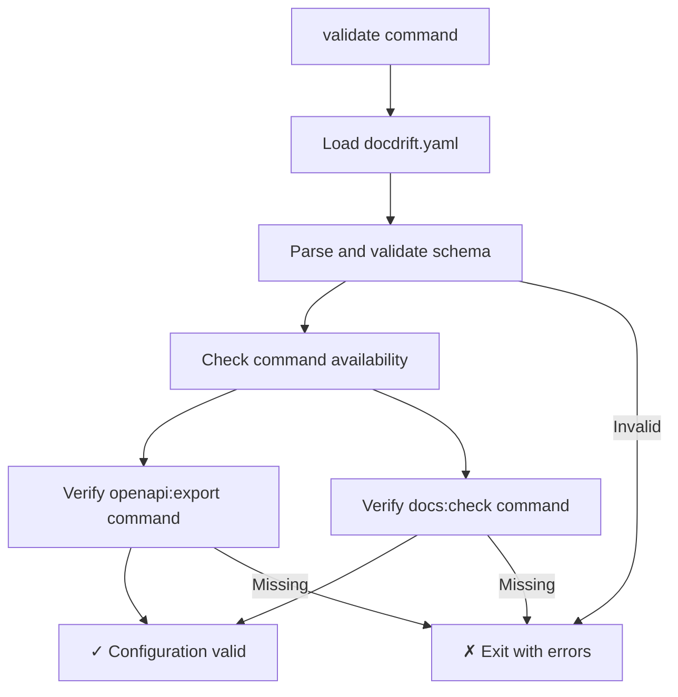
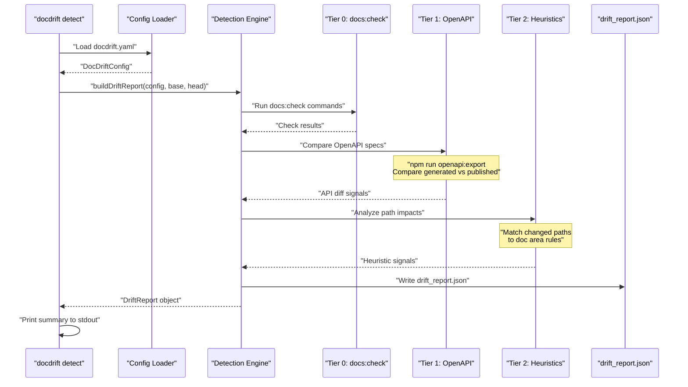
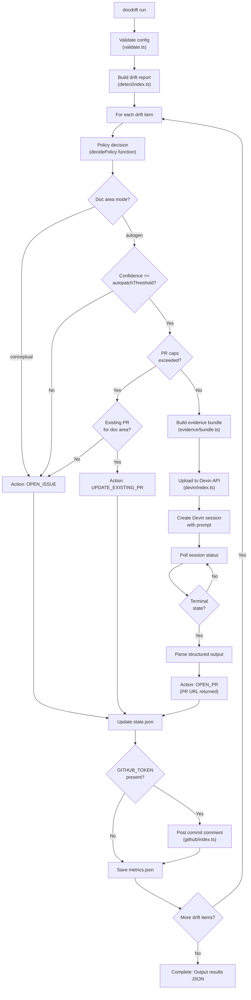
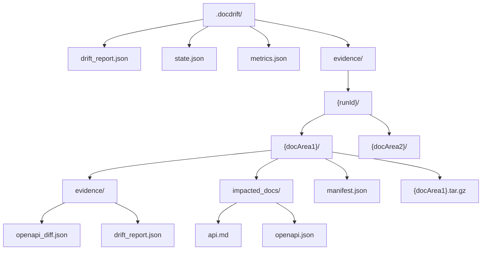

# Quick Start

<details>
<summary>Relevant source files</summary>

The following files were used as context for generating this wiki page:

- [.gitignore](.gitignore)
- [README.md](README.md)
- [docdrift-yml.md](docdrift-yml.md)
- [src/cli.ts](src/cli.ts)
- [src/devin/v1.ts](src/devin/v1.ts)
- [src/index.ts](src/index.ts)

</details>


This page provides a minimal working example to detect and remediate documentation drift in a sample repository. It walks through the complete workflow from initial validation through drift detection and automated remediation.

For detailed installation instructions, see [Installation](#2.1). For comprehensive configuration reference, see [Configuration](#2.2) and [Configuration Reference](#9). For understanding how detection works, see [Detection System](#4).

## Prerequisites

Before running DocDrift, ensure you have:

| Requirement | Description |
|------------|-------------|
| Node.js 18+ | Required for CLI execution |
| Git repository | With at least two commits to compare |
| `docdrift.yaml` | Configuration file at repository root |
| Environment variables | `DEVIN_API_KEY` (required for `run`), `GITHUB_TOKEN` (optional for GitHub integration) |

Your repository should have intentional drift between two commits. For example:
- **Base commit**: Documentation matches API implementation
- **Head commit**: API code changed (e.g., field renamed in `apps/api/src/model.ts`) but documentation unchanged

Sources: [README.md:62-101]()

## Step 1: Validate Configuration

The `validate` command verifies that your configuration is valid and required commands are available.

```bash
npx tsx src/cli.ts validate
```

This command performs the following checks:



**Expected output**:
```
✓ Configuration loaded from docdrift.yaml
✓ All required commands available
✓ Doc areas configured: api_reference, auth_guide
```

**What this validates** ([src/config/validate.ts]() and [src/index.ts:144-154]()):
- `docdrift.yaml` syntax and required fields
- Availability of `npm run openapi:export` (if Tier 1 detection configured)
- Availability of `npm run docs:check` (if verification enabled)
- Doc area configurations are well-formed

Sources: [README.md:65](), [docdrift.yaml:1-48]()

## Step 2: Detect Drift

The `detect` command builds a drift report without triggering remediation. This is useful for understanding what drift exists before taking action.

```bash
npx tsx src/cli.ts detect --base <base-sha> --head <head-sha>
```

Replace `<base-sha>` and `<head-sha>` with actual commit SHAs. Use `git log --oneline -5` to identify appropriate commits.

**Example**:
```bash
npx tsx src/cli.ts detect --base b0f624f --head 6030902
```

### Detection Workflow



**Expected output structure**:

The command generates `.docdrift/drift_report.json` with the following structure:

| Field | Description |
|-------|-------------|
| `runId` | Unique identifier for this detection run |
| `baseSHA` | Base commit SHA |
| `headSHA` | Head commit SHA |
| `timestamp` | ISO 8601 timestamp |
| `driftItems` | Array of detected drift items |

Each drift item contains:

| Field | Description | Example |
|-------|-------------|---------|
| `docArea` | Name from `docdrift.yaml` | `"api_reference"` |
| `tier` | Detection tier (0, 1, or 2) | `1` |
| `confidence` | Confidence score (0.0-1.0) | `0.95` |
| `signal` | Detection mechanism | `"openapi_diff"` |
| `summary` | Human-readable description | `"Field renamed: name → fullName"` |
| `impactedDocs` | List of affected documentation files | `["docs/reference/api.md"]` |

**Console output example**:
```
Drift Report Summary
====================
Run ID: 20240115-143022-abc123
Commits: b0f624f → 6030902

Doc Area: api_reference (autogen)
  ├─ Tier 1 signal: openapi_diff (confidence: 0.95)
  ├─ Summary: 4 schema changes detected
  └─ Impacted: docs/reference/openapi.json, docs/reference/api.md

Doc Area: auth_guide (conceptual)
  ├─ Tier 2 signal: path_heuristic (confidence: 0.65)
  ├─ Summary: Changes in apps/api/src/auth/
  └─ Impacted: docs/guides/auth.md

Total: 2 drift items detected
Report written to: .docdrift/drift_report.json
```

Sources: [README.md:8](), [README.md:66-67](), [src/detect/index.ts:21-114](), [src/index.ts:144-290]()

## Step 3: Run Full Remediation

The `run` command performs drift detection and executes the full remediation workflow based on policy decisions.

```bash
export DEVIN_API_KEY=<your-devin-api-key>
export GITHUB_TOKEN=<your-github-token>
export GITHUB_REPOSITORY=owner/repo
export GITHUB_SHA=<head-sha>

npx tsx src/cli.ts run --base <base-sha> --head <head-sha>
```

### Environment Variables

| Variable | Required | Purpose |
|----------|----------|---------|
| `DEVIN_API_KEY` | Yes | Authenticate with Devin API for session creation |
| `GITHUB_TOKEN` | Optional | Post commit comments and create issues |
| `GITHUB_REPOSITORY` | Optional | GitHub repo identifier (format: `owner/repo`) |
| `GITHUB_SHA` | Optional | Commit SHA for GitHub comment context |

**Note**: Omitting `GITHUB_TOKEN` runs the full workflow without GitHub integration. Results are printed to stdout and written to `.docdrift/state.json` and `.docdrift/metrics.json`.

### Full Workflow Execution



**Execution phases** (implemented in [src/index.ts:144-290]()):

1. **Detection**: Runs all three tiers, generates drift report
2. **Policy Decision**: For each drift item, determines action (OPEN_PR, UPDATE_EXISTING_PR, OPEN_ISSUE, NOOP)
3. **Evidence Bundling**: Creates tarball with drift report, OpenAPI diff, impacted doc snippets
4. **Devin Session**: Uploads evidence, creates session with prompt, polls to completion
5. **State Update**: Records PR counts, session results in `.docdrift/state.json`
6. **GitHub Integration**: Posts commit comment with results, creates issues for low-confidence drift
7. **Metrics**: Writes performance data to `.docdrift/metrics.json`

Sources: [README.md:34-42](), [README.md:68](), [README.md:88-100](), [src/index.ts:144-290]()

## Understanding the Outputs

After running `docdrift run`, several artifacts are generated in `.docdrift/`:

### Output Directory Structure



### Key Output Files

| File | Purpose | Generated By |
|------|---------|--------------|
| `drift_report.json` | Complete drift detection results | `detect` or `run` command |
| `state.json` | Persistent state for idempotency and caps | `run` command |
| `metrics.json` | Performance metrics and execution summary | `run` command |
| `evidence/{runId}/{docArea}/` | Evidence bundles per doc area | `run` command |
| `evidence/{runId}/{docArea}/*.tar.gz` | Compressed evidence for Devin upload | `run` command |

### Interpreting Results

**Console output** from `run` command:

```json
{
  "runId": "20240115-143022-abc123",
  "summary": {
    "totalDriftItems": 2,
    "actionsExecuted": {
      "OPEN_PR": 1,
      "OPEN_ISSUE": 1,
      "UPDATE_EXISTING_PR": 0,
      "NOOP": 0
    }
  },
  "results": [
    {
      "docArea": "api_reference",
      "action": "OPEN_PR",
      "outcome": "success",
      "sessionUrl": "https://preview.devin.ai/sessions/...",
      "prUrl": "https://github.com/owner/repo/pull/123"
    },
    {
      "docArea": "auth_guide",
      "action": "OPEN_ISSUE",
      "outcome": "success",
      "issueUrl": "https://github.com/owner/repo/issues/45"
    }
  ]
}
```

**What the outcomes mean**:

| Action | Meaning | What Happens Next |
|--------|---------|-------------------|
| `OPEN_PR` | High-confidence autogen drift, PR created by Devin | Review and merge the PR in GitHub |
| `OPEN_ISSUE` | Low-confidence or conceptual drift | Respond to questions in GitHub issue, make manual updates |
| `UPDATE_EXISTING_PR` | Bundled with existing PR for same doc area | Additional changes added to existing PR |
| `NOOP` | Already handled (idempotency) | No action needed |

Sources: [README.md:96-101](), [.docdrift/drift_report.json:1-30](), [src/index.ts:170-177]()

## Local Demo Without GitHub

You can run a complete workflow locally without GitHub integration:

```bash
# Load environment variables (ensure DEVIN_API_KEY is set)
export $(grep -v '^#' .env | xargs)

# Remove GitHub variables to skip GitHub integration
unset GITHUB_TOKEN GITHUB_REPOSITORY GITHUB_SHA

# Run detection and remediation
npx tsx src/cli.ts run --base b0f624f --head 6030902
```

**What you'll see**:
- Detection runs all three tiers
- Policy decisions are made and logged
- Evidence bundles are created
- Devin session is created and polled (1-3 minutes)
- Results are printed to stdout
- State and metrics are persisted to `.docdrift/`
- No GitHub comments or issues are created

This mode is useful for:
- Testing configuration changes locally
- Understanding the detection and policy logic
- Debugging evidence bundle generation
- Verifying Devin integration without affecting GitHub

Sources: [README.md:71-101]()

## Next Steps

After completing this quick start:

1. **Review detection results**: Examine `.docdrift/drift_report.json` to understand what drift was detected and why
2. **Configure doc areas**: Adjust `docdrift.yaml` to match your repository's documentation structure (see [Doc Areas Configuration](#9.2))
3. **Set up CI/CD**: Integrate DocDrift into GitHub Actions for automatic drift detection on every merge (see [GitHub Actions Workflow](#7.1))
4. **Customize policy**: Tune confidence thresholds, PR caps, and allowlists (see [Policy Configuration](#9.4))
5. **Understand detection tiers**: Learn how each tier works and when they trigger (see [Detection System](#4))

For production usage in another repository, see [Using in another repo](#README.md:149-170).

Sources: [README.md:149-178](), [loom.md:1-32]()

---