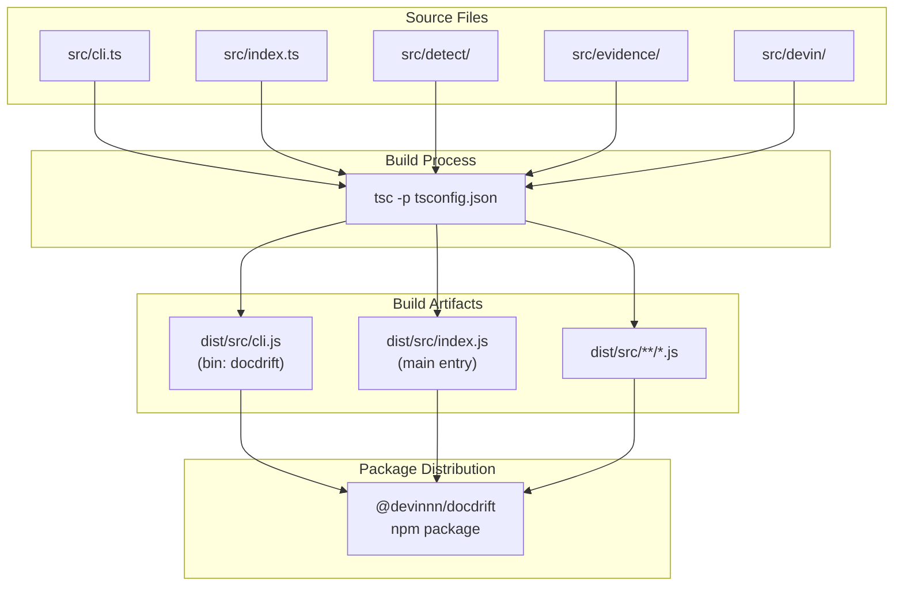
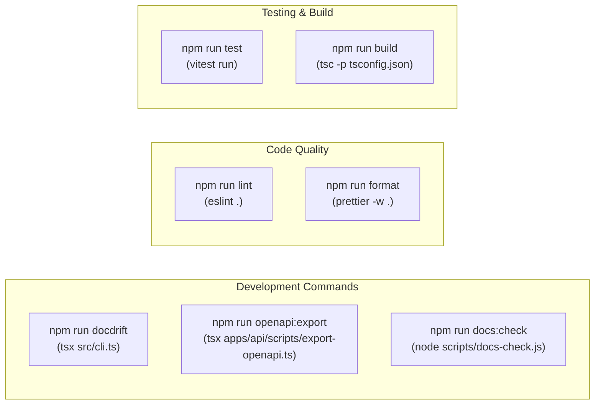
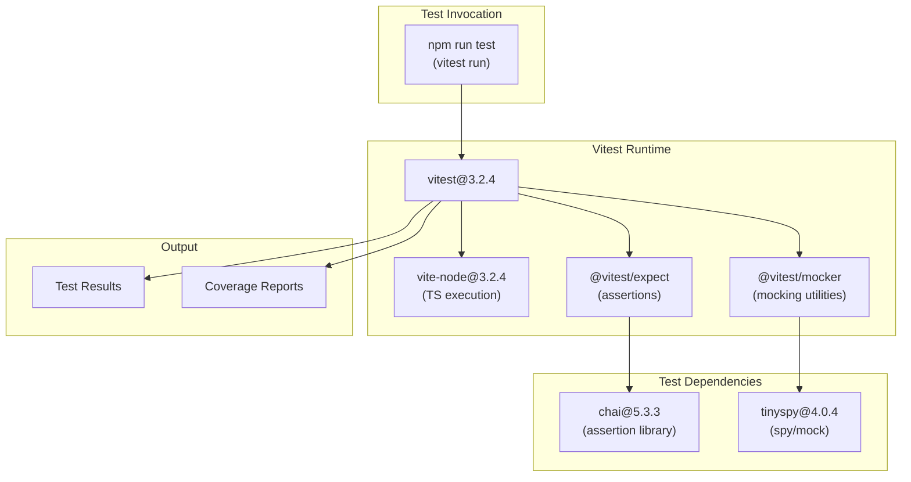
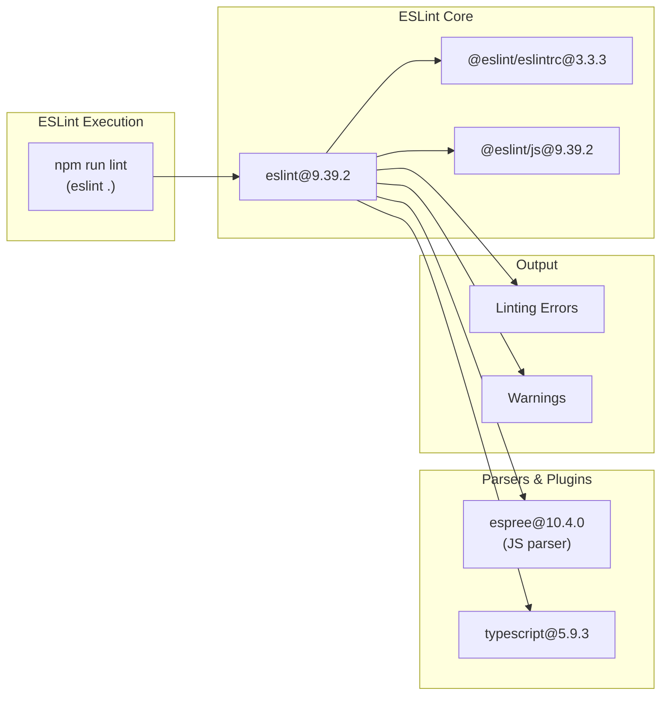
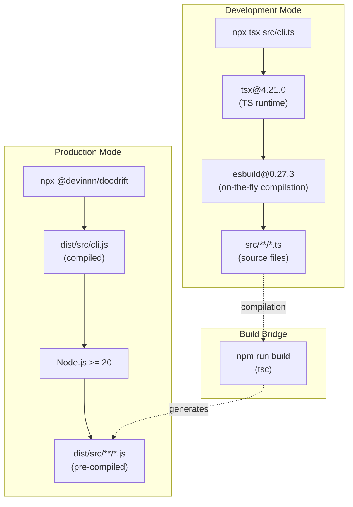

# Building and Testing

<details>
<summary>Relevant source files</summary>

The following files were used as context for generating this wiki page:

- [package.json](package.json)

</details>


This page documents the build system, testing framework, and development workflow for DocDrift. It covers TypeScript compilation, test execution with Vitest, code quality tools, and the package publishing process.

For information about the overall project structure, see [Project Structure](#11.1). For details about running DocDrift in production or CI/CD, see [CLI Reference](#3) and [GitHub Actions Workflow](#7.1).

---

## Overview

DocDrift is a TypeScript project that compiles to CommonJS for distribution as an npm package. The build system uses standard TypeScript compilation, while testing is performed with Vitest. The project includes comprehensive tooling for code quality, including ESLint for linting and Prettier for formatting.

**Sources:** [package.json:1-42](), [README.md:62-69](), [README.md:172-178]()

---

## Build System

### TypeScript Compilation

The project uses the TypeScript compiler (`tsc`) to transpile source code from `src/` to the `dist/` directory. The build command is defined in the `scripts` section of `package.json`:

```json
{
  "build": "tsc -p tsconfig.json"
}
```

The TypeScript configuration targets CommonJS module format, as indicated by the `"type": "commonjs"` field in `package.json`. This ensures compatibility with Node.js environments.

**Key Build Parameters:**
| Parameter | Value | Purpose |
|-----------|-------|---------|
| Module Type | `commonjs` | Node.js compatibility |
| Target | TypeScript 5.9.3 | Modern TypeScript features |
| Output Directory | `dist/src/` | Compiled JavaScript location |
| Engine Requirement | Node >= 20 | Minimum runtime version |

**Sources:** [package.json:10-14](), [package.json:19](), [package.json:39]()

### Build Output Structure



The `bin` field in `package.json` maps the `docdrift` command to `dist/src/cli.js`, making it available as a global CLI command after installation. The `main` field points to `dist/src/index.js` for programmatic imports.

**Sources:** [package.json:6-9](), [package.json:14]()

### Package Files

The `files` field in `package.json` restricts the published package to only include compiled output:

```json
{
  "files": ["dist/src"]
}
```

This excludes source files, tests, configuration files, and development artifacts from the published npm package. Consumers receive only the compiled JavaScript in the `dist/src/` directory.

**Sources:** [package.json:14](), [README.md:177]()

---

## Development Workflow

### Running Without Building

During development, the `tsx` package enables running TypeScript files directly without compilation:

```bash
npx tsx src/cli.ts validate
npx tsx src/cli.ts detect --base <sha> --head <sha>
npx tsx src/cli.ts run --base <sha> --head <sha>
```

This approach is documented in the README for local usage and provides faster iteration during development.

**Sources:** [README.md:64-68](), [package.json:38]()

### Development Scripts



The `docdrift` script provides a shorthand for running the CLI during development:

| Script | Command | Purpose |
|--------|---------|---------|
| `docdrift` | `tsx src/cli.ts` | Run CLI in development |
| `openapi:export` | `tsx apps/api/scripts/export-openapi.ts` | Generate OpenAPI spec |
| `docs:check` | `node scripts/docs-check.js` | Validate documentation |
| `test` | `vitest run` | Execute test suite |
| `build` | `tsc -p tsconfig.json` | Compile TypeScript |
| `lint` | `eslint .` | Check code style |
| `format` | `prettier -w .` | Format code |

**Sources:** [package.json:18-26]()

---

## Testing

### Test Framework Configuration

DocDrift uses Vitest 3.2.4 as its test framework. Vitest is a fast unit test framework built on Vite, providing native TypeScript support and modern testing features.

**Test Execution Flow:**



**Key Dependencies:**
- **vitest**: Main test runner with native TypeScript support
- **@vitest/expect**: Assertion utilities built on Chai
- **@vitest/spy**: Mocking and spying functionality
- **chai**: BDD/TDD assertion library (v5.3.3)

**Sources:** [package.json:20](), [package.json:40](), [pnpm-lock.yaml:1113-1165]()

### Running Tests

Execute the test suite with:

```bash
npm run test
```

This runs Vitest in "run" mode (single execution), as opposed to watch mode. The test command executes all test files and exits with a status code indicating success or failure.

**Sources:** [package.json:20]()

### Test Infrastructure

The Vitest configuration includes several supporting packages:

| Package | Version | Purpose |
|---------|---------|---------|
| `@vitest/runner` | 3.2.4 | Test execution engine |
| `@vitest/snapshot` | 3.2.4 | Snapshot testing utilities |
| `@vitest/utils` | 3.2.4 | Shared testing utilities |
| `vite-node` | 3.2.4 | TypeScript execution layer |
| `tinybench` | 2.9.0 | Benchmarking utilities |

**Sources:** [pnpm-lock.yaml:483-511]()

---

## Code Quality Tools

### Linting with ESLint



DocDrift uses ESLint 9.39.2 for static code analysis. The linting process checks all files in the repository:

```bash
npm run lint
```

**ESLint Dependencies:**
- **@eslint/eslintrc**: Configuration file support
- **@eslint/js**: Recommended JavaScript rules
- **espree**: JavaScript parser
- **eslint-scope**: Variable scope analysis

**Sources:** [package.json:21](), [package.json:36](), [pnpm-lock.yaml:648-702]()

### Formatting with Prettier

```bash
npm run format
```

This command runs Prettier 3.8.1 in write mode (`-w .`), automatically formatting all files in the repository according to Prettier's default style guide.

**Sources:** [package.json:22](), [package.json:37]()

---

## Publishing Process

### Pre-Publish Checklist

Before publishing to npm, ensure:

1. **Build the package:**
   ```bash
   npm run build
   ```

2. **Verify package.json settings:**
   - `"private": false` (or omit the field)
   - `"repository"` field is set correctly
   - Version number is updated

3. **Test the build output:**
   - Verify `dist/src/` contains compiled JavaScript
   - Confirm `dist/src/cli.js` is executable
   - Check `dist/src/index.js` exports correctly

**Sources:** [README.md:172-178]()

### Publishing to npm

```mermaid
graph TB
    subgraph "Pre-Publish"
        Build["npm run build"]
        Verify["Verify package.json"]
    end
    
    subgraph "Publish"
        Publish["npm publish --access public"]
    end
    
    subgraph "Package Structure"
        Files["dist/src/ only<br/>(from files field)"]
        Main["main: dist/src/index.js"]
        Bin["bin: dist/src/cli.js"]
    end
    
    subgraph "npm Registry"
        Registry["@devinnn/docdrift<br/>published package"]
    end
    
    Build --> Verify
    Verify --> Publish
    
    Files --> Publish
    Main --> Publish
    Bin --> Publish
    
    Publish --> Registry
```

For scoped packages (like `@devinnn/docdrift`), use the `--access public` flag:

```bash
npm publish --access public
```

Only files in the `dist/src/` directory are included in the published package, as specified by the `files` field in `package.json`.

**Sources:** [README.md:176-177](), [package.json:2](), [package.json:14]()

### Package Metadata

The published package includes the following metadata:

| Field | Value | Purpose |
|-------|-------|---------|
| `name` | `@devinnn/docdrift` | Package identifier |
| `version` | `0.1.0` | Semantic version |
| `description` | "Detect and remediate documentation drift with Devin sessions" | Package description |
| `main` | `dist/src/index.js` | Programmatic entry point |
| `bin.docdrift` | `dist/src/cli.js` | CLI command |
| `engines.node` | `>=20` | Minimum Node.js version |
| `keywords` | `["docs", "drift", "openapi", "devin", "github-actions"]` | npm search terms |

**Sources:** [package.json:1-17]()

---

## Development vs. Production Execution



**Development Mode:**
- Uses `tsx` for direct TypeScript execution
- No build step required
- Faster iteration cycle
- Uses `esbuild` for on-the-fly compilation
- Source files: `src/**/*.ts`

**Production Mode:**
- Uses pre-compiled JavaScript from `dist/`
- Requires `npm run build` before distribution
- Faster startup time
- Standard Node.js execution
- Distributed files: `dist/src/**/*.js`

**Sources:** [package.json:25](), [package.json:38](), [README.md:64-68]()

---