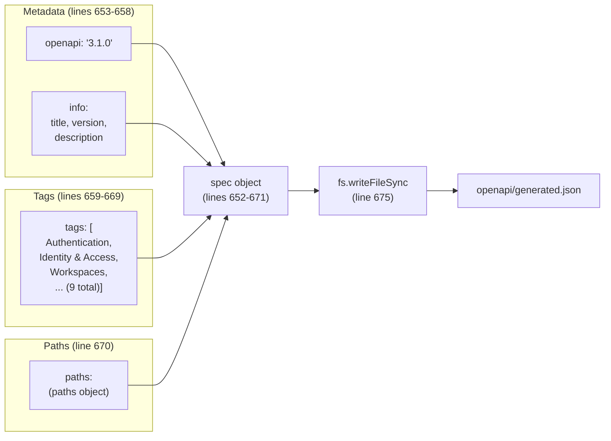
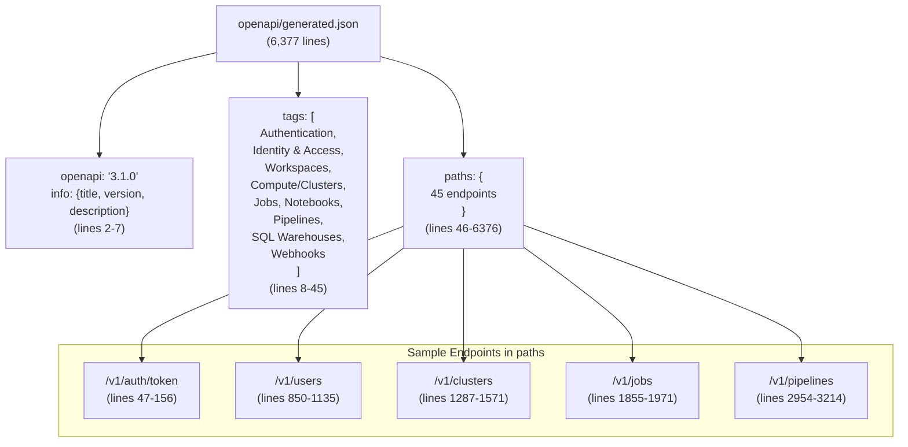
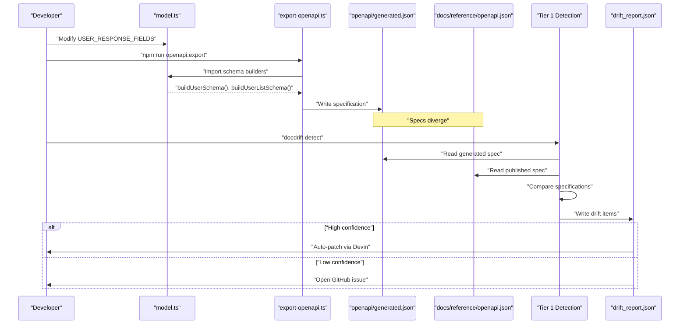

# Schema Generation Script

<details>
<summary>Relevant source files</summary>

The following files were used as context for generating this wiki page:

- [apps/api/scripts/export-openapi.ts](apps/api/scripts/export-openapi.ts)
- [openapi/generated.json](openapi/generated.json)

</details>


This page documents the `export-openapi.ts` script that generates the OpenAPI 3.1.0 specification for the DataStack API example application. The script programmatically constructs the specification from TypeScript schema builder functions, producing `openapi/generated.json` as output.

The generated specification serves as the source of truth for spec-based drift detection in docdrift. When API code changes, this script regenerates the specification, allowing drift detection to compare it against published documentation.

## Overview

The schema generation script follows a three-stage process:

1. **Schema Import**: Import schema builder functions from `model.ts` and `auth/policy.ts`
2. **Path Definition**: Construct endpoint definitions using helper functions (`pathResp`, `pathResp201`, `errResp`)
3. **Specification Output**: Combine metadata, tags, and paths into an OpenAPI 3.1.0 document and write to disk

The script is executed via `npm run openapi:export` and outputs to `openapi/generated.json`.

**Sources**: [apps/api/scripts/export-openapi.ts:1-677]()

## Imported Schema Builders

The script imports 23 schema builder functions from two modules: `../src/model` and `../src/auth/policy`. These functions return JSON Schema-compliant objects representing API request and response structures.

### Schema Builders from model.ts

The following builders are imported from [apps/api/src/model.ts:3-23]():

| Function | Purpose |
|----------|---------|
| `buildUserSchema()` | User object schema (id, fullName, email, role, status, timestamps) |
| `buildUserListSchema()` | Paginated user list with `data` array and `pagination` object |
| `buildWorkspaceSchema()` | Workspace object (id, name, region, status, deploymentUrl) |
| `buildWorkspaceListSchema()` | Workspace list with `workspaces` array and pagination |
| `buildClusterSchema()` | Compute cluster object (id, name, state, sparkVersion, nodeType, scaling config) |
| `buildClusterListSchema()` | Cluster list with `clusters` array and `totalCount` |
| `buildJobSchema()` | Job definition (jobId, name, trigger, schedule, settings) |
| `buildJobRunSchema()` | Job run status (runId, state, startTime, endTime, clusterSpec) |
| `buildJobListSchema()` | Job list with `jobs` array and `totalCount` |
| `buildNotebookSchema()` | Notebook object (path, language, format, content, timestamps) |
| `buildNotebookListSchema()` | Notebook list with `notebooks` array and `totalCount` |
| `buildPipelineSchema()` | Pipeline definition (id, name, state, target, catalog, clusters) |
| `buildPipelineListSchema()` | Pipeline list with `pipelines` array |
| `buildPipelineEventSchema()` | Pipeline event (timestamp, level, message) |
| `buildSqlWarehouseSchema()` | SQL warehouse (id, name, state, warehouseType, connection URLs) |
| `buildSqlWarehouseListSchema()` | SQL warehouse list with `warehouses` array |
| `buildWebhookSchema()` | Webhook configuration (id, url, events, secret, active status) |
| `buildWebhookListSchema()` | Webhook list with `webhooks` array |
| `buildWebhookDeliverySchema()` | Webhook delivery record (id, webhookId, success, response codes) |

### Schema Builders from auth/policy.ts

The following builders are imported from [apps/api/src/auth/policy.ts:24-29]():

| Function | Purpose |
|----------|---------|
| `buildTokenResponseSchema()` | OAuth2 token response (accessToken, refreshToken, expiresIn, scopes) |
| `buildApiKeySchema()` | API key object (id, name, prefix, scopes, status, timestamps) |
| `buildApiKeyListSchema()` | API key list with `apiKeys` array and `totalCount` |
| `buildApiKeyCreatedSchema()` | API key creation response (includes the full `key` value) |

These builders encapsulate the schema logic, ensuring consistency between the API implementation and the generated specification.

**Sources**: [apps/api/scripts/export-openapi.ts:3-29]()

## Helper Functions

Three helper functions simplify response definition construction by reducing boilerplate code.

### pathResp()

The `pathResp` function constructs a 200 OK response with a JSON schema:

```typescript
function pathResp(schema: object) {
  return {
    "200": { description: "OK", content: { "application/json": { schema } } },
  };
}
```

Usage example: `pathResp(buildUserSchema())` expands to a 200 response containing the user schema.

**Sources**: [apps/api/scripts/export-openapi.ts:31-35]()

### pathResp201()

The `pathResp201` function constructs a 201 Created response:

```typescript
function pathResp201(schema: object) {
  return {
    "201": { description: "Created", content: { "application/json": { schema } } },
  };
}
```

Usage example: `pathResp201(buildUserSchema())` for POST endpoints that create resources.

**Sources**: [apps/api/scripts/export-openapi.ts:37-41]()

### errResp()

The `errResp` function constructs error responses with a standard structure:

```typescript
function errResp(code: string, desc: string) {
  return {
    [code]: {
      description: desc,
      content: {
        "application/json": {
          schema: {
            type: "object",
            properties: {
              code: { type: "string" },
              message: { type: "string" },
              details: { type: "object" },
            },
            required: ["code", "message"],
          },
        },
      },
    },
  };
}
```

All error responses include `code` and `message` fields, with an optional `details` object.

**Sources**: [apps/api/scripts/export-openapi.ts:43-62]()

## Path Definitions

The `paths` object defines 45 API endpoints across 9 functional areas. Each path entry contains HTTP method objects (get, post, patch, delete) with:
- `summary`: Endpoint description
- `tags`: Categorization for documentation grouping
- `parameters`: Path, query, and header parameters
- `requestBody`: Request schema (for POST, PATCH, PUT)
- `responses`: Response schemas using helper functions

### Path Structure Overview

**Script Architecture for Path Definitions**

```mermaid
graph TB
    PathsObj["paths object<br/>(line 64)"]
    
    subgraph "Authentication (lines 65-161)"
        TokenPath["/v1/auth/token"]
        RevokePath["/v1/auth/token/revoke"]
        ApiKeysPath["/v1/auth/api-keys"]
        ApiKeyPath["/v1/auth/api-keys/{keyId}"]
    end
    
    subgraph "Identity & Access (lines 162-232)"
        UserPath["/v1/users/{id}"]
        UsersPath["/v1/users"]
    end
    
    subgraph "Workspaces (lines 233-251)"
        WorkspacesPath["/v1/workspaces"]
        WorkspacePath["/v1/workspaces/{workspaceId}"]
    end
    
    subgraph "Compute/Clusters (lines 252-328)"
        ClustersPath["/v1/clusters"]
        ClusterPath["/v1/clusters/{clusterId}"]
        ResizePath["/v1/clusters/{clusterId}/resize"]
    end
    
    subgraph "Jobs (lines 329-369)"
        JobsPath["/v1/jobs"]
        JobPath["/v1/jobs/{jobId}"]
        RunsPath["/v1/jobs/{jobId}/runs"]
        RunPath["/v1/jobs/{jobId}/runs/{runId}"]
    end
    
    subgraph "Notebooks (lines 370-404)"
        NotebooksPath["/v1/notebooks"]
        ExportPath["/v1/notebooks/export"]
    end
    
    subgraph "SQL Warehouses (lines 405-441)"
        WarehousesPath["/v1/sql/warehouses"]
        WarehousePath["/v1/sql/warehouses/{warehouseId}"]
        StartPath["/v1/sql/warehouses/{warehouseId}/start"]
        StopPath["/v1/sql/warehouses/{warehouseId}/stop"]
    end
    
    subgraph "Pipelines (lines 442-553)"
        PipelinesPath["/v1/pipelines"]
        PipelinePath["/v1/pipelines/{pipelineId}"]
        PipelineStartPath["/v1/pipelines/{pipelineId}/start"]
        PipelineStopPath["/v1/pipelines/{pipelineId}/stop"]
        EventsPath["/v1/pipelines/{pipelineId}/events"]
    end
    
    subgraph "Webhooks (lines 554-649)"
        WebhooksPath["/v1/webhooks"]
        WebhookPath["/v1/webhooks/{webhookId}"]
        TestPath["/v1/webhooks/{webhookId}/test"]
        DeliveriesPath["/v1/webhooks/{webhookId}/deliveries"]
    end
    
    PathsObj --> TokenPath
    PathsObj --> UserPath
    PathsObj --> WorkspacesPath
    PathsObj --> ClustersPath
    PathsObj --> JobsPath
    PathsObj --> NotebooksPath
    PathsObj --> WarehousesPath
    PathsObj --> PipelinesPath
    PathsObj --> WebhooksPath
```



**Sources**: [apps/api/scripts/export-openapi.ts:64-650]()

### Example Path Definition: POST /v1/users

The user creation endpoint demonstrates the typical path definition pattern:

```typescript
"/v1/users": {
  post: {
    summary: "Create user",
    tags: ["Identity & Access"],
    requestBody: {
      content: {
        "application/json": {
          schema: {
            type: "object",
            properties: {
              fullName: { type: "string" },
              email: { type: "string", format: "email" },
              role: { type: "string", enum: ["admin", "editor", "viewer"] },
            },
            required: ["fullName", "email", "role"],
          },
        },
      },
    },
    responses: { ...pathResp201(buildUserSchema()), ...errResp("400", "Bad Request") },
  },
}
```

The response object spreads `pathResp201(buildUserSchema())` for the success case and `errResp("400", "Bad Request")` for validation errors.

**Sources**: [apps/api/scripts/export-openapi.ts:212-231]()

### Tag Categories

The specification organizes endpoints into 9 tag categories:

| Tag | Description | Endpoint Count |
|-----|-------------|----------------|
| Authentication | OAuth2 token exchange and API key management | 4 |
| Identity & Access | Users and permissions | 5 |
| Workspaces | Workspace management | 2 |
| Compute / Clusters | Spark compute clusters | 5 |
| Jobs | Scheduled and triggered jobs | 4 |
| Notebooks | Notebook CRUD and export | 3 |
| Pipelines | Delta Live Tables pipeline management | 6 |
| SQL Warehouses | SQL warehouse lifecycle | 4 |
| Webhooks | Webhook registration and delivery tracking | 5 |

**Sources**: [apps/api/scripts/export-openapi.ts:659-669]()

## Specification Assembly and Output

After defining all paths, the script assembles the complete OpenAPI specification object and writes it to disk.

### Specification Object Structure

**Specification Assembly Flow**



The spec object contains:

| Field | Value |
|-------|-------|
| `openapi` | "3.1.0" |
| `info.title` | "DataStack API" |
| `info.version` | "2.0.0" |
| `info.description` | "REST API for DataStack: authentication, workspaces, compute clusters, jobs, notebooks, pipelines, SQL warehouses, and webhooks." |
| `tags` | Array of 9 tag objects with name and description |
| `paths` | The complete paths object (lines 64-650) |

**Sources**: [apps/api/scripts/export-openapi.ts:652-671]()

### File Output Process

The script writes the specification to `openapi/generated.json`:

```typescript
const outputPath = path.resolve(process.cwd(), "openapi/generated.json");
fs.mkdirSync(path.dirname(outputPath), { recursive: true });
fs.writeFileSync(outputPath, `${JSON.stringify(spec, null, 2)}\n`, "utf8");
console.log(`Wrote ${outputPath}`);
```

Operations performed:
1. Resolve absolute path to `openapi/generated.json` relative to current working directory
2. Create `openapi/` directory if it doesn't exist (`recursive: true` prevents errors if parent directories are missing)
3. Serialize `spec` object as JSON with 2-space indentation
4. Append trailing newline for POSIX compliance
5. Write to file with UTF-8 encoding
6. Log output path to console

**Sources**: [apps/api/scripts/export-openapi.ts:673-676]()

## Generated Specification Structure

The resulting `openapi/generated.json` file is a valid OpenAPI 3.1.0 document containing 45 endpoint definitions with 9 tag categories. The file is formatted with 2-space indentation for readability.

### Top-Level Structure

**Generated OpenAPI Document Structure**



**Sources**: [openapi/generated.json:1-6377]()

### Example Endpoint: GET /v1/users/{id}

The user retrieval endpoint demonstrates the generated schema structure:

**Endpoint Location**: [openapi/generated.json:559-666]()

Key components:
- **Summary**: "Get a user by ID"
- **Tags**: ["Identity & Access"]
- **Parameters**: Single path parameter `id` (string, required)
- **200 Response Schema**:
  - Type: object
  - Properties: `id`, `fullName`, `email`, `avatarUrl`, `department`, `createdAt`, `updatedAt`, `role`, `status`, `lastLoginAt`
  - Required fields: `id`, `fullName`, `email`, `createdAt`, `role`, `status`
  - Enum constraints on `role` (admin, editor, viewer) and `status` (active, suspended, pending_verification)
- **404 Response**: Standard error schema with `code`, `message`, and optional `details`

### Example Endpoint: POST /v1/clusters

The cluster creation endpoint demonstrates request body schema generation:

**Endpoint Location**: [openapi/generated.json:1432-1570]()

Key components:
- **Summary**: "Create cluster"
- **Tags**: ["Compute / Clusters"]
- **Request Body Schema**:
  - Type: object
  - Properties: `name`, `workspaceId`, `sparkVersion`, `nodeType`, `workerCount`, `enableAutoscaling`, `minWorkers`, `maxWorkers`, `autoTerminationMinutes`, `tags`
  - Required fields: `name`, `workspaceId`, `sparkVersion`, `nodeType`
  - Type constraints: integers for counts, boolean for autoscaling flag, object with string values for tags
- **201 Response**: Full cluster schema with additional computed fields (`id`, `clusterSize`, `region`, `state`, `createdAt`, `createdBy`)

**Sources**: [openapi/generated.json:1432-1570]()

## Integration with Drift Detection

The generated specification serves as input to DocDrift's Tier 1 detection system. The workflow connects the generation process to drift detection as follows:



**Sources**: [apps/api/scripts/export-openapi.ts:1-52](), [openapi/generated.json:1-142]()

### Detection Process

When `docdrift detect` or `docdrift run` executes with Tier 1 detection enabled:

1. The detection engine runs `npm run openapi:export` (or the configured command) to generate a fresh specification
2. The generated specification at `openapi/generated.json` is read
3. The published specification (typically at `docs/reference/openapi.json`) is read
4. The two specifications are compared using structural diff algorithms
5. Any differences (new endpoints, changed schemas, removed fields) are recorded as drift signals

The confidence and tier of the resulting drift signal determine whether DocDrift opens an automated PR or escalates to a GitHub issue. For more details on this decision process, see [Decision Logic](#5.1).

**Sources**: [apps/api/scripts/export-openapi.ts:1-52](), [openapi/generated.json:1-142]()

## Usage in Development

To regenerate the OpenAPI specification during development:

```bash
npm run openapi:export
```

This command executes the export script via `tsx`, writing the updated specification to `openapi/generated.json`. The script can be invoked manually or automatically as part of the documentation build process.

For configuration of the OpenAPI detection rules in `docdrift.yaml`, including how to specify the generated and published specification paths, see [Detection Rules](#9.3).

**Sources**: [apps/api/scripts/export-openapi.ts:48-51]()

---