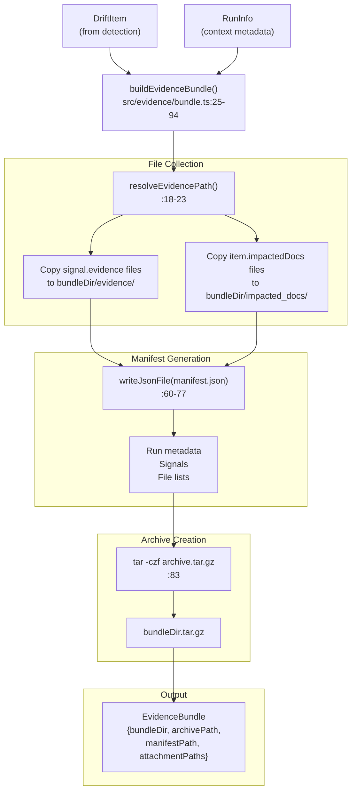
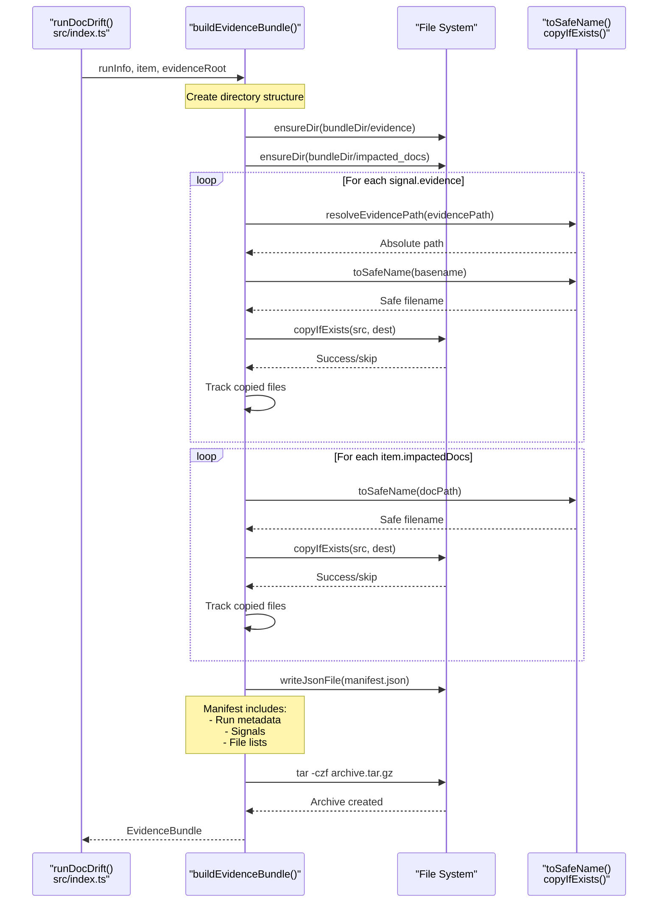
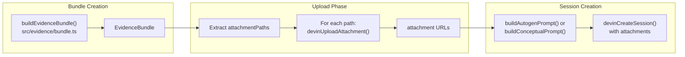

# Evidence Bundles

<details>
<summary>Relevant source files</summary>

The following files were used as context for generating this wiki page:

- [.github/workflows/devin-doc-drift.yml](.github/workflows/devin-doc-drift.yml)
- [docdrift-yml.md](docdrift-yml.md)
- [src/config/validate.ts](src/config/validate.ts)
- [src/devin/prompts.ts](src/devin/prompts.ts)
- [src/github/client.ts](src/github/client.ts)
- [src/index.ts](src/index.ts)

</details>


This page documents how DocDrift collects, organizes, and packages evidence for Devin sessions. Evidence bundles provide the AI agent with all necessary context to understand and remediate documentation drift, including signal evidence files, impacted documentation snippets, and metadata about the detected drift.

For information about how these bundles are uploaded and used in Devin sessions, see [Session Management](#6.2). For details on how the detection system generates the signals that populate evidence bundles, see [Detection System](#4).

## Purpose and Scope

Evidence bundles serve as the primary information payload sent to Devin AI sessions. Each bundle contains:

- **Signal evidence**: Files referenced by drift signals (e.g., OpenAPI diffs, changeset summaries)
- **Impacted documentation**: Copies of documentation files that may need updates
- **Manifest metadata**: Structured information about the drift item, run context, and bundle contents
- **Archive**: A compressed tarball for efficient upload

The bundling system ensures Devin has complete, self-contained context for each documentation area without requiring direct repository access during the session.

**Sources**: [README.md:38](), [README.md:56-60](), [src/evidence/bundle.ts:1-99]()

## Bundle Structure

Each evidence bundle is organized hierarchically under `.docdrift/evidence/` in the consuming repository:

```
.docdrift/
  evidence/
    <runId>/
      <docArea>/
        evidence/
          openapi_diff.json
          changeset.json
          ...
        impacted_docs/
          docs_reference_api.md
          docs_reference_openapi.json
          ...
        manifest.json
      <docArea>.tar.gz
```

The structure provides:
- **Isolation by run**: Each execution creates a unique `<runId>` directory
- **Grouping by doc area**: Each documentation area has its own subdirectory
- **Evidence categorization**: Separate directories for signal evidence vs. impacted docs
- **Self-describing archives**: Manifests document bundle contents and metadata

**Sources**: [README.md:28-33](), [README.md:98-99](), [src/evidence/bundle.ts:30-37]()

## Data Flow: Drift Detection to Bundle Creation



**Sources**: [src/evidence/bundle.ts:25-94](), [src/index.ts:266-267]()

## The buildEvidenceBundle Function

The `buildEvidenceBundle()` function in [src/evidence/bundle.ts:25-94]() orchestrates the entire bundle creation process:

| Input | Type | Source |
|-------|------|--------|
| `runInfo` | `RunInfo` | Contains `runId`, `repo`, `baseSha`, `headSha`, `trigger`, `timestamp` |
| `item` | `DriftItem` | Drift detection result with `docArea`, `mode`, `signals`, `impactedDocs`, `summary` |
| `evidenceRoot` | `string` | Base directory for evidence storage (typically `.docdrift/evidence/<runId>`) |

| Output | Type | Description |
|--------|------|-------------|
| `bundleDir` | `string` | Path to the doc area's bundle directory |
| `archivePath` | `string` | Path to the compressed tarball |
| `manifestPath` | `string` | Path to the manifest.json file |
| `attachmentPaths` | `string[]` | List of files to upload to Devin (archive + manifest) |

**Sources**: [src/evidence/bundle.ts:7-12](), [src/evidence/bundle.ts:25-94]()

## Evidence Collection Process



**Sources**: [src/evidence/bundle.ts:39-58](), [src/evidence/bundle.ts:14-23]()

### File Name Safety

The `toSafeName()` function [src/evidence/bundle.ts:14-16]() sanitizes file names by replacing non-alphanumeric characters (except `.`, `_`, `-`) with underscores. This prevents issues with:
- Special characters in file paths
- Path traversal attempts
- Archive extraction problems

For example, `docs/reference/api.md` becomes `docs_reference_api.md` in the bundle.

**Sources**: [src/evidence/bundle.ts:14-16](), [src/evidence/bundle.ts:43-44](), [src/evidence/bundle.ts:54]()

### Evidence Resolution

The `resolveEvidencePath()` function [src/evidence/bundle.ts:18-23]() converts evidence file paths to absolute paths, handling both:
- **Absolute paths**: Returned as-is
- **Relative paths**: Resolved against the current working directory

This ensures consistent file resolution regardless of where evidence files are located in the detection output.

**Sources**: [src/evidence/bundle.ts:18-23](), [src/evidence/bundle.ts:42]()

## Manifest Format

The manifest.json file provides structured metadata about the bundle contents:

```json
{
  "run": {
    "runId": "string",
    "repo": "owner/repo",
    "baseSha": "string",
    "headSha": "string", 
    "trigger": "push | manual | schedule",
    "timestamp": "ISO 8601 string"
  },
  "docArea": "string",
  "mode": "autogen | conceptual",
  "summary": "Human-readable drift description",
  "signals": [
    {
      "tier": 0 | 1 | 2,
      "confidence": 0.0-1.0,
      "type": "string",
      "evidence": ["relative/path/in/bundle"]
    }
  ],
  "impactedDocs": ["original/doc/path"],
  "copiedEvidence": ["evidence/file.json"],
  "copiedDocs": ["impacted_docs/file.md"]
}
```

The manifest serves multiple purposes:
- **Audit trail**: Records exactly what was bundled and when
- **Context for Devin**: Provides structured signal information
- **Debugging**: Enables verification of bundle contents without extracting the tarball
- **Idempotency**: Run metadata allows detection of duplicate actions

**Sources**: [src/evidence/bundle.ts:60-77]()

## Archive Creation

After collecting files and generating the manifest, the bundle is compressed into a tarball using [src/evidence/bundle.ts:79-86]():

```bash
tar -czf <bundleDir>.tar.gz -C <parent> <name>
```

The tarball creation:
- Compresses the entire bundle directory
- Uses gzip compression (`-z`) for efficient upload
- Creates the archive in the same parent directory as the bundle
- Returns an error if the tar command fails

The resulting archive path follows the pattern: `.docdrift/evidence/<runId>/<docArea>.tar.gz`

**Sources**: [src/evidence/bundle.ts:79-86](), [README.md:38]()

## Integration with Devin Workflow

Evidence bundles are consumed by the Devin integration workflow:



The workflow in [src/index.ts:266-283]():

1. **Build bundle**: Creates evidence bundle for each drift item
2. **Extract paths**: Gets `attachmentPaths` from bundle (tarball + manifest)
3. **Upload attachments**: Iterates through paths, uploading each to Devin
4. **Create session**: Passes attachment URLs to session creation with appropriate prompt

This separation allows the bundle creation to be independent of the Devin API integration, and enables local inspection of bundles before upload.

**Sources**: [src/index.ts:266-283](), [src/index.ts:76-80]()

## Bundle Lifecycle

| Phase | Location | Purpose |
|-------|----------|---------|
| **Creation** | [src/evidence/bundle.ts:25-94]() | Collect and package evidence files |
| **Storage** | `.docdrift/evidence/<runId>/<docArea>/` | Local persistence for audit and debugging |
| **Upload** | [src/index.ts:76-80]() | Transfer to Devin API as attachments |
| **Consumption** | Devin session | AI agent analyzes evidence and generates fixes |
| **Cleanup** | Manual or CI artifact expiry | Old bundles can be safely deleted |

The `runId` in the directory structure allows multiple runs to coexist without conflicts. CI systems can upload evidence directories as build artifacts [README.md:106-109]() for later inspection or debugging.

**Sources**: [src/evidence/bundle.ts:25-94](), [src/index.ts:266-283](), [README.md:106-109]()

## Key Implementation Details

### Attachment Path Deduplication

In [src/index.ts:267](), the system deduplicates attachment paths using a Set:

```typescript
const attachmentPaths = [...new Set([bundle.archivePath, ...bundle.attachmentPaths])];
```

This ensures that even if `bundle.attachmentPaths` already includes the archive path (which it does per [src/evidence/bundle.ts:92]()), it's only uploaded once.

**Sources**: [src/index.ts:267](), [src/evidence/bundle.ts:88-93]()

### Error Handling

Archive creation includes explicit error checking [src/evidence/bundle.ts:84-86]():
- Checks `exitCode !== 0` for tar command failures
- Throws descriptive error with stderr/stdout output
- Prevents proceeding with partial or missing archives

**Sources**: [src/evidence/bundle.ts:84-86]()

### File Copy Resilience

The `copyIfExists()` utility [src/evidence/bundle.ts:45](), [src/evidence/bundle.ts:55]() silently skips missing files rather than failing. This handles cases where:
- Evidence files may be generated conditionally
- Documentation files may have been deleted in the changes
- Path mappings may reference non-existent files

Only successfully copied files are tracked in the manifest's `copiedEvidence` and `copiedDocs` arrays.

**Sources**: [src/evidence/bundle.ts:45-47](), [src/evidence/bundle.ts:55-57](), [src/evidence/bundle.ts:75-76]()

---