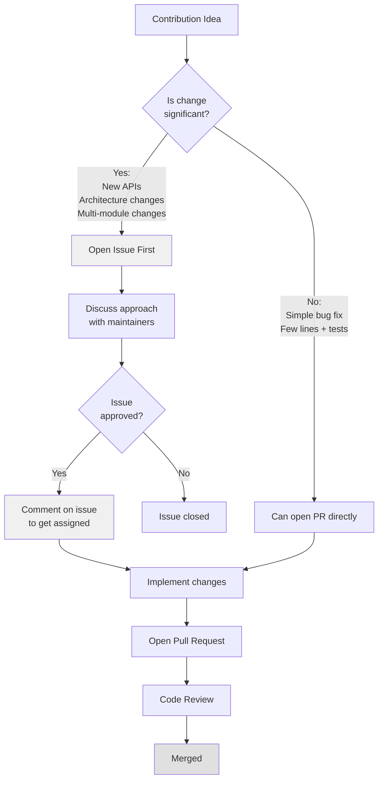
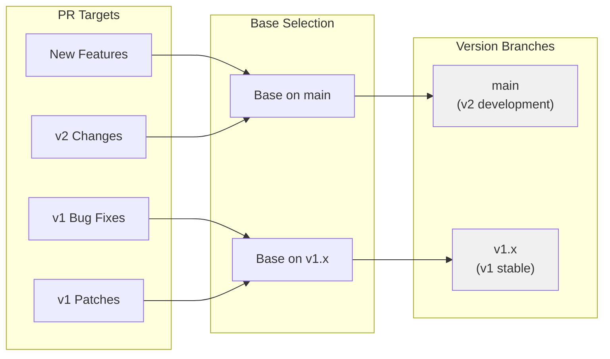
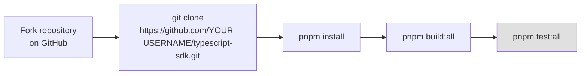
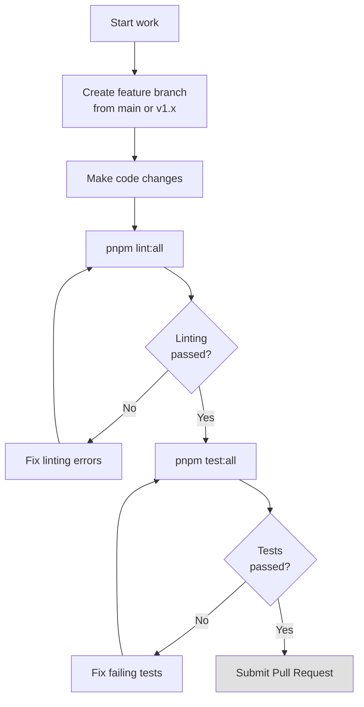
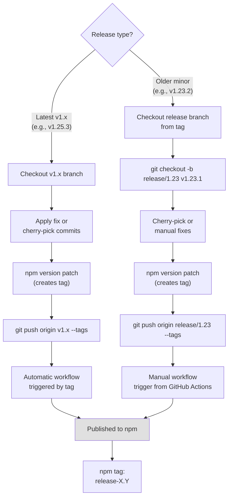
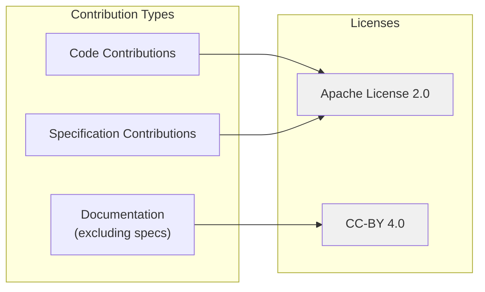

# Contributing Guidelines

<details>
<summary>Relevant source files</summary>

The following files were used as context for generating this wiki page:

- [.github/workflows/release-v1x.yml](.github/workflows/release-v1x.yml)
- [CONTRIBUTING.md](CONTRIBUTING.md)
- [LICENSE](LICENSE)
- [packages/server/src/index.ts](packages/server/src/index.ts)

</details>


This page provides comprehensive guidelines for external contributors to the MCP TypeScript SDK. It covers the complete contribution lifecycle from opening issues to submitting pull requests, including development setup, coding standards, and quality requirements.

For information about building and testing the SDK itself, see [Building and Testing](#8.1). For details on the CI/CD pipeline and automated releases, see [CI/CD and Release Process](#8.3).

---

## Purpose and Philosophy

The MCP TypeScript SDK follows a **discuss-first, code-second** approach to contributions. This philosophy ensures that:

- New features align with the SDK's goals before implementation effort is invested
- Complex changes are architecturally sound before code review
- The small maintainer team can effectively review and support merged features
- Contributors avoid wasted effort on features that may not be accepted

**Key principle**: Every merged feature becomes an ongoing maintenance burden. Prior discussion helps determine whether something belongs in the SDK.

**Sources**: [CONTRIBUTING.md:1-33]()

---

## Issue Workflow

### When to Open an Issue



**What counts as "significant"**:
- New public APIs or classes
- Architectural changes or refactoring
- Changes touching multiple modules
- Features requiring spec changes (these need a [SEP](https://modelcontextprotocol.io/community/sep-guidelines) first)

**Straightforward bug fixes** (a few lines of code with tests demonstrating the fix) can skip the issue step. For complex bugs requiring significant changes, consider opening an issue first.

**Sources**: [CONTRIBUTING.md:7-23]()

### Writing Effective Issues

**Good issues include**:
- Clear problem statement leading with what's broken or needed
- Runnable code demonstrating the problem
- Focused scope - one clear problem per issue
- Evidence of upfront debugging effort

**Issues that will be closed**:
- Low-effort submissions without investigation
- Obviously AI-generated content
- Vague problem descriptions without context

**Sources**: [CONTRIBUTING.md:24-32]()

### Finding Issues to Work On

| Label | Audience | Description |
|-------|----------|-------------|
| `good first issue` | Newcomers | Can tackle without deep codebase knowledge |
| `help wanted` | Experienced contributors | Maintainers probably won't get to this |
| `ready for work` | Maintainers | Triaged and ready for maintainer pickup |

**Labels indicating NOT ready for work**:
- `needs confirmation` - Requires reproduction verification
- `needs repro` - Missing reproduction steps
- `needs design` - Architectural approach undefined

**Before starting work**: Comment on the issue to request assignment. This prevents duplicate effort and signals to other contributors.

**Sources**: [CONTRIBUTING.md:34-44]()

---

## Pull Request Process

### Branch Strategy



The repository maintains two main branches:

- **`main`** - v2 SDK development (monorepo with split packages)
- **`v1.x`** - Stable v1 release for bug fixes and patches

**Branch selection rules**:
- For **new features** or **v2-related work**: base PR on `main`
- For **v1 bug fixes** or **patches**: base PR on `v1.x`

**Sources**: [CONTRIBUTING.md:50-60]()

### Pull Request Scope

**Small PRs get reviewed fast. Large PRs sit in the queue.**

The review burden scales non-linearly:
- **Few dozen lines**: Reviewed in minutes
- **Hundreds of lines across many files**: Requires significant verification effort, things slip through

**For large changes**:
- Break into a stack of smaller PRs, OR
- Get explicit maintainer alignment on approach in an issue before submitting

**Sources**: [CONTRIBUTING.md:62-67]()

### Rejection Criteria

PRs may be rejected for:

| Reason | Description |
|--------|-------------|
| **Lack of prior discussion** | Features or significant changes without an approved issue |
| **Scope creep** | Changes beyond what was discussed or unrequested features |
| **Misalignment with SDK direction** | Well-implemented features that don't fit SDK goals |
| **Insufficient quality** | Code not meeting clarity, maintainability, or style standards |
| **Overengineering** | Unnecessary complexity or abstraction for simple problems |

**Sources**: [CONTRIBUTING.md:69-78]()

### Submission Checklist

When submitting a PR:

1. ✓ Follow existing code style ([`.eslintrc.json`](), [`.prettierrc`]())
2. ✓ Include tests for new functionality
3. ✓ Update documentation as needed
4. ✓ Keep changes focused and atomic
5. ✓ Provide clear description of changes
6. ✓ Ensure "what" and "why" were settled in prior issue discussion

**Sources**: [CONTRIBUTING.md:79-85]()

---

## Development Setup

### Prerequisites

The project uses **pnpm** as its package manager. Enable it via corepack (included with Node.js 16.9+):

```bash
corepack enable
```

### Initial Setup



**Setup steps**:
1. Fork the repository on GitHub
2. Clone your fork: `git clone https://github.com/YOUR-USERNAME/typescript-sdk.git`
3. Install dependencies: `pnpm install`
4. Build the project: `pnpm build:all`
5. Run tests: `pnpm test:all`

**Sources**: [CONTRIBUTING.md:87-104]()

---

## Development Workflow

### Day-to-Day Development



**Standard workflow**:
1. Create a new branch for changes (based on `main` or `v1.x`)
2. Make code changes
3. Run `pnpm lint:all` to ensure code style compliance
4. Run `pnpm test:all` to verify all tests pass
5. Submit a pull request

**Sources**: [CONTRIBUTING.md:105-111]()

### Running Examples

The SDK includes runnable examples for both servers and clients. See [`examples/server/README.md`]() and [`examples/client/README.md`]() for complete lists.

**Quick start**:

```bash
# Run a server example
pnpm --filter @modelcontextprotocol/examples-server exec tsx src/simpleStreamableHttp.ts

# Run a client example (in another terminal)
pnpm --filter @modelcontextprotocol/examples-client exec tsx src/simpleStreamableHttp.ts
```

**Sources**: [CONTRIBUTING.md:113-125]()

---

## Release Management (v1.x)

### v1.x Release Workflow

Contributors may need to understand the v1.x release process for backporting fixes or maintaining older versions.



### Latest v1.x Release (e.g., v1.25.3)

```bash
git checkout v1.x
git pull origin v1.x
# Apply your fix or cherry-pick commits
npm version patch      # Bumps version and creates tag (e.g., v1.25.3)
git push origin v1.x --tags
```

The tag push automatically triggers the [`release-v1x.yml`]() workflow.

### Older Minor Versions (e.g., v1.23.2)

For patching older minor versions not on the `v1.x` branch:

```bash
# 1. Create a release branch from the last release tag
git checkout -b release/1.23 v1.23.1

# 2. Apply your fixes (cherry-pick or manual)
git cherry-pick <commit-hash>

# 3. Bump version and push
npm version patch      # Creates v1.23.2 tag
git push origin release/1.23 --tags
```

Then manually trigger the "Publish v1.x" workflow from [GitHub Actions](https://github.com/modelcontextprotocol/typescript-sdk/actions/workflows/release-v1x.yml), specifying the tag (e.g., `v1.23.2`).

### npm Tag Strategy

v1.x releases are published with `release-X.Y` npm tags (e.g., `release-1.25`), **not** `latest`. This allows users to pin to specific minor versions:

```bash
npm install @modelcontextprotocol/sdk@release-1.25
```

**Sources**: [CONTRIBUTING.md:127-168](), [.github/workflows/release-v1x.yml:1-106]()

---

## Quality Standards

### Code Style Requirements

The SDK enforces consistent code style through:

- **ESLint**: Linting rules defined in `.eslintrc.json`
- **Prettier**: Formatting rules defined in `.prettierrc`
- **TypeScript**: Type checking via `tsconfig.json` configurations

All code must pass:
```bash
pnpm lint:all      # ESLint + Prettier checks
pnpm typecheck:all # TypeScript validation
```

### Testing Requirements

**All new functionality must include tests**:
- Unit tests for individual functions/classes
- Integration tests for component interactions
- Conformance tests for protocol compliance (see [Conformance Testing](#8.2))

Run tests:
```bash
pnpm test:all                    # All tests
pnpm test:conformance:client     # Client conformance
pnpm test:conformance:server     # Server conformance
```

### Documentation Requirements

Contributors should update documentation when:
- Adding new public APIs
- Changing existing behavior
- Adding new features or capabilities
- Fixing bugs that affect documented behavior

**Sources**: [CONTRIBUTING.md:79-85]()

---

## Policies and Governance

### Code of Conduct

This project follows the [Code of Conduct](CODE_OF_CONDUCT.md). All contributors must review and adhere to it before contributing.

### Reporting Issues

- Use the [GitHub issue tracker](https://github.com/modelcontextprotocol/typescript-sdk/issues)
- Search existing issues before creating new ones
- Provide clear reproduction steps
- Include relevant environment information

### Security Issues

**Do not report security vulnerabilities in public issues**. Review the [Security Policy](SECURITY.md) for proper reporting procedures.

### Licensing



By contributing, you agree that:
- **Code contributions** are licensed under Apache License 2.0
- **Specification contributions** are licensed under Apache License 2.0
- **Documentation contributions** (excluding specifications) are licensed under CC-BY 4.0

The project is undergoing a licensing transition from MIT to Apache 2.0. See [LICENSE]() for full details.

**Sources**: [CONTRIBUTING.md:169-187](), [LICENSE:1-217]()

---

## Summary

The MCP TypeScript SDK contribution process emphasizes:

1. **Discussion before code** - Open issues for significant changes
2. **Small, focused PRs** - Easier to review and merge
3. **Quality over quantity** - Code must meet style, test, and documentation standards
4. **Aligned with SDK goals** - Features must fit the project's direction
5. **Respectful collaboration** - Follow Code of Conduct and engage constructively

For technical details on building and testing, see [Building and Testing](#8.1). For CI/CD pipeline details, see [CI/CD and Release Process](#8.3).

**Sources**: [CONTRIBUTING.md:1-188]()

---