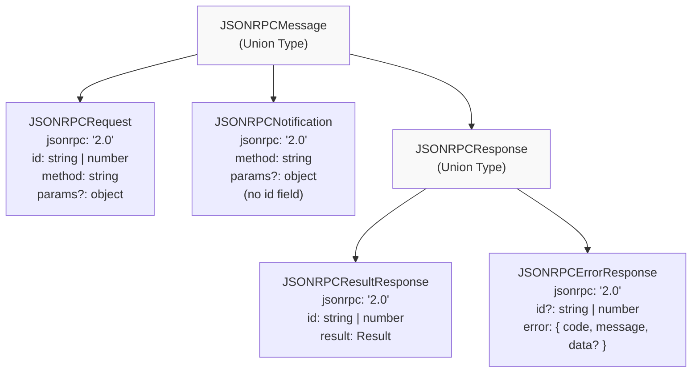
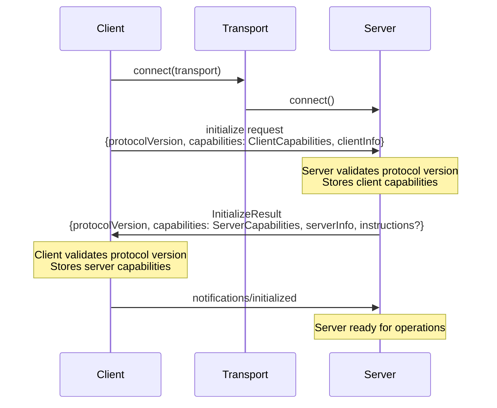
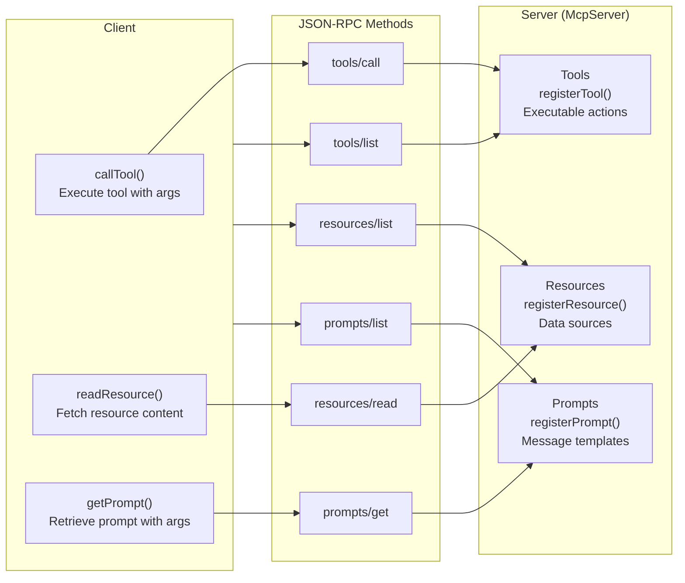
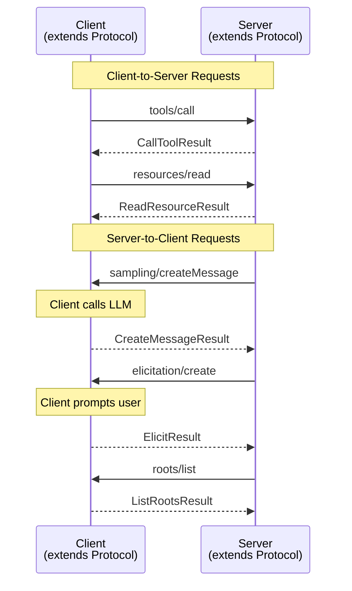
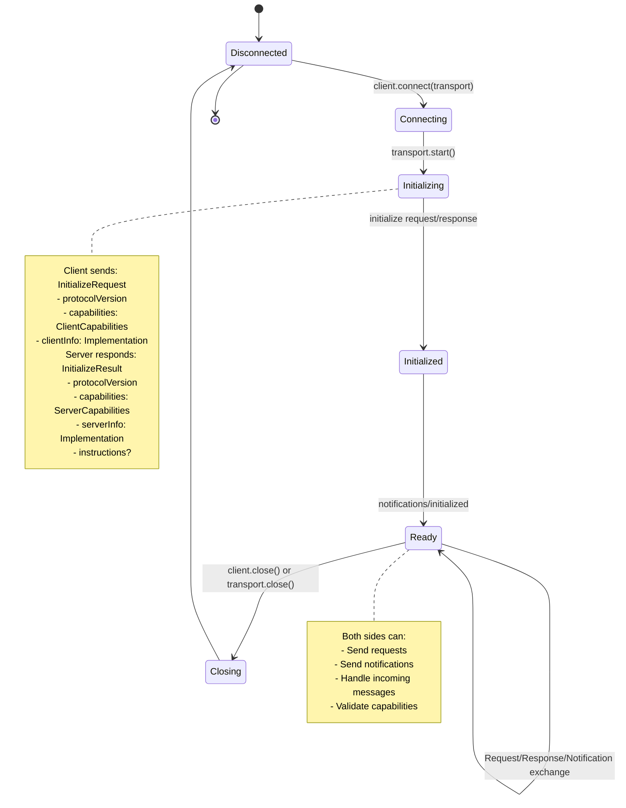
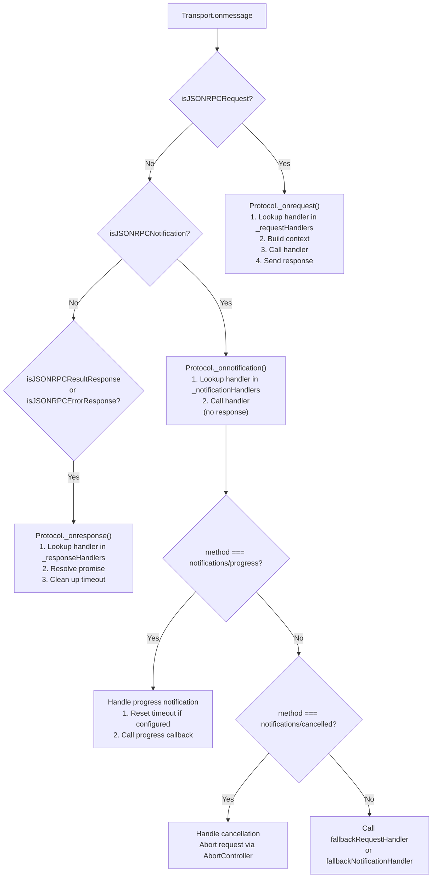

# Core Protocol Concepts

<details>
<summary>Relevant source files</summary>

The following files were used as context for generating this wiki page:

- [CLAUDE.md](CLAUDE.md)
- [docs/migration-SKILL.md](docs/migration-SKILL.md)
- [docs/migration.md](docs/migration.md)
- [examples/client/src/simpleStreamableHttp.ts](examples/client/src/simpleStreamableHttp.ts)
- [examples/client/src/simpleTaskInteractiveClient.ts](examples/client/src/simpleTaskInteractiveClient.ts)
- [packages/client/src/client/client.ts](packages/client/src/client/client.ts)
- [packages/core/src/shared/protocol.ts](packages/core/src/shared/protocol.ts)
- [packages/core/src/types/types.ts](packages/core/src/types/types.ts)
- [packages/core/test/shared/protocol.test.ts](packages/core/test/shared/protocol.test.ts)
- [packages/server/src/server/mcp.ts](packages/server/src/server/mcp.ts)
- [packages/server/src/server/server.ts](packages/server/src/server/server.ts)

</details>


This page introduces the fundamental concepts of the Model Context Protocol (MCP) as implemented in the TypeScript SDK. It covers JSON-RPC message structures, capability negotiation, core primitives (tools, resources, prompts), and bidirectional communication patterns. This provides the conceptual foundation needed to understand how MCP clients and servers communicate.

For implementation details of the Protocol class that handles message routing, see [Architecture](#2). For specific client and server APIs, see [Client Implementation](#4) and [Server Implementation](#3).

---

## JSON-RPC Message Foundation

MCP is built on JSON-RPC 2.0, using three fundamental message types defined in [packages/core/src/types/types.ts:10-274]():

**Message Type Hierarchy Diagram**



**Sources:** [packages/core/src/types/types.ts:176-274]()

### Request Messages

A `JSONRPCRequest` expects a response and includes an `id` field for correlation. All MCP operations (listing tools, calling tools, reading resources, etc.) use requests:

| Field | Type | Purpose |
|-------|------|---------|
| `jsonrpc` | `"2.0"` | Protocol version identifier |
| `id` | `string \| number` | Unique identifier for request/response correlation |
| `method` | `string` | Operation to perform (e.g., `"tools/call"`, `"resources/read"`) |
| `params` | `object` (optional) | Method-specific parameters |

**Sources:** [packages/core/src/types/types.ts:176-182]()

### Notification Messages

A `JSONRPCNotification` does not expect a response and has no `id` field. Used for events like progress updates or list changes:

| Field | Type | Purpose |
|-------|------|---------|
| `jsonrpc` | `"2.0"` | Protocol version identifier |
| `method` | `string` | Notification type (e.g., `"notifications/progress"`) |
| `params` | `object` (optional) | Notification data |

**Sources:** [packages/core/src/types/types.ts:189-194]()

### Response Messages

Responses come in two forms:

**Success (`JSONRPCResultResponse`):**
```typescript
{
  jsonrpc: "2.0",
  id: <requestId>,
  result: { ... }  // Method-specific result
}
```

**Error (`JSONRPCErrorResponse`):**
```typescript
{
  jsonrpc: "2.0",
  id: <requestId>,
  error: {
    code: -32602,      // ProtocolErrorCode enum value
    message: "Invalid params",
    data?: { ... }     // Optional additional error data
  }
}
```

**Sources:** [packages/core/src/types/types.ts:199-265]()

---

## Capability Negotiation

Capabilities define what operations a client or server supports. During the initialization handshake, both sides declare their capabilities, and the SDK enforces these throughout the connection lifecycle.

**Initialization Flow Diagram**



**Sources:** [packages/client/src/client/client.ts:419-471](), [packages/server/src/server/server.ts:423-439]()

### ClientCapabilities

Defined in [packages/core/src/types/types.ts:488-530](), `ClientCapabilities` declares what a client can handle:

```typescript
interface ClientCapabilities {
  experimental?: Record<string, object>;
  
  sampling?: {
    context?: object;  // Supports includeContext parameter
    tools?: object;    // Supports tool use in sampling
  };
  
  elicitation?: {
    form?: { applyDefaults?: boolean };
    url?: object;
  };
  
  roots?: {
    listChanged?: boolean;  // Can notify about root list changes
  };
  
  tasks?: ClientTasksCapability;  // Task creation support
}
```

**Key Client Capabilities:**

| Capability | Purpose | Required For |
|------------|---------|--------------|
| `sampling` | Client can call LLMs on behalf of server | `sampling/createMessage` requests from server |
| `elicitation` | Client can request user input | `elicitation/create` requests from server |
| `roots` | Client exposes filesystem roots | `roots/list` requests from server |
| `tasks` | Client supports task-based execution | Task augmentation of requests from server |

**Sources:** [packages/core/src/types/types.ts:488-530]()

### ServerCapabilities

Defined in [packages/core/src/types/types.ts:551-608](), `ServerCapabilities` declares what a server provides:

```typescript
interface ServerCapabilities {
  experimental?: Record<string, object>;
  
  logging?: object;  // Can send log messages
  
  prompts?: {
    listChanged?: boolean;  // Notifies when prompt list changes
  };
  
  resources?: {
    subscribe?: boolean;    // Supports resource subscriptions
    listChanged?: boolean;  // Notifies when resource list changes
  };
  
  tools?: {
    listChanged?: boolean;  // Notifies when tool list changes
  };
  
  completions?: object;  // Provides autocomplete suggestions
  
  tasks?: ServerTasksCapability;  // Task creation support
}
```

**Key Server Capabilities:**

| Capability | Purpose | Required For |
|------------|---------|--------------|
| `tools` | Server provides callable tools | `tools/list`, `tools/call` |
| `resources` | Server provides data sources | `resources/list`, `resources/read` |
| `prompts` | Server provides prompt templates | `prompts/list`, `prompts/get` |
| `logging` | Server can send log messages | `notifications/message` |
| `completions` | Server provides autocomplete | `completion/complete` |
| `tasks` | Server supports task-based execution | Task augmentation of tools |

**Sources:** [packages/core/src/types/types.ts:551-608]()

### Capability Enforcement

The SDK enforces capabilities in two directions:

1. **Outbound requests:** Before sending a request, the Protocol class calls `assertCapabilityForMethod()` to verify the remote side advertised support
2. **Handler registration:** When registering a handler, `assertRequestHandlerCapability()` verifies the local side advertised support

This prevents protocol violations at the SDK level.

**Sources:** [packages/client/src/client/client.ts:494-555](), [packages/server/src/server/server.ts:246-407](), [packages/core/src/shared/protocol.ts:392-852]()

---

## Core Primitives

MCP defines three primary abstractions for LLM interactions:

**Core Primitives Architecture**



**Sources:** [packages/server/src/server/mcp.ts:58-673](), [packages/client/src/client/client.ts:658-900]()

### Tools

Tools are functions that LLMs can call to perform actions or retrieve information. A tool consists of:

**Tool Definition (from `ListToolsResult`):**

| Field | Type | Description |
|-------|------|-------------|
| `name` | `string` | Unique identifier for the tool |
| `title` | `string` (optional) | Human-readable display name |
| `description` | `string` (optional) | What the tool does |
| `inputSchema` | `JSONSchema` | JSON Schema for tool arguments |
| `outputSchema` | `JSONSchema` (optional) | JSON Schema for structured output |
| `annotations` | `ToolAnnotations` (optional) | UI hints (audience, progress) |
| `execution` | `ToolExecution` (optional) | Execution hints (taskSupport) |

**Tool Registration Example (McpServer):**

The high-level API in [packages/server/src/server/mcp.ts:110-209]() handles tool registration:

```typescript
mcpServer.registerTool(
  'toolName',
  {
    description: 'Tool description',
    inputSchema: z.object({ param: z.string() }),
    outputSchema: z.object({ result: z.string() })
  },
  async ({ param }, ctx) => {
    // Tool implementation
    return {
      content: [{ type: 'text', text: 'result' }]
    };
  }
);
```

**Tool Invocation (Client):**

Clients call tools via [packages/client/src/client/client.ts:715-771]():

```typescript
const result = await client.callTool({
  name: 'toolName',
  arguments: { param: 'value' }
});
// result: CallToolResult with content array
```

**Sources:** [packages/core/src/types/types.ts:1257-1384](), [packages/server/src/server/mcp.ts:110-209](), [packages/client/src/client/client.ts:715-771]()

### Resources

Resources represent data sources (files, database records, API responses) that can be read by LLMs. Resources support both static URIs and templated URIs with variables.

**Resource Definition (from `ListResourcesResult`):**

| Field | Type | Description |
|-------|------|-------------|
| `uri` | `string` | Unique identifier (URI) |
| `name` | `string` | Name of the resource |
| `title` | `string` (optional) | Human-readable display name |
| `description` | `string` (optional) | What the resource contains |
| `mimeType` | `string` (optional) | Content MIME type |

**Resource Registration (Static URI):**

```typescript
mcpServer.registerResource(
  'config',
  'config://app',
  { description: 'Application config' },
  async (uri, ctx) => {
    return {
      contents: [{ uri: uri.href, text: '{"key":"value"}', mimeType: 'application/json' }]
    };
  }
);
```

**Resource Registration (Template URI):**

For dynamic resources, use `UriTemplate` from [packages/core/src/shared/uriTemplate.ts]():

```typescript
mcpServer.registerResource(
  'user-profile',
  new UriTemplate('user://{userId}/profile'),
  { description: 'User profile data' },
  async (uri, variables, ctx) => {
    const userId = variables.userId; // Extracted from URI
    return {
      contents: [{ uri: uri.href, text: `Profile for user ${userId}` }]
    };
  }
);
```

**Resource Reading (Client):**

```typescript
const result = await client.readResource({ uri: 'config://app' });
// result: ReadResourceResult with contents array
```

**Sources:** [packages/core/src/types/types.ts:1461-1598](), [packages/server/src/server/mcp.ts:419-497](), [packages/client/src/client/client.ts:703-713]()

### Prompts

Prompts are reusable message templates with arguments. They help standardize how LLMs are instructed to perform tasks.

**Prompt Definition (from `ListPromptsResult`):**

| Field | Type | Description |
|-------|------|-------------|
| `name` | `string` | Unique identifier |
| `title` | `string` (optional) | Human-readable display name |
| `description` | `string` (optional) | What the prompt does |
| `arguments` | `PromptArgument[]` (optional) | List of arguments with names and schemas |

**Prompt Registration:**

```typescript
mcpServer.registerPrompt(
  'summarize',
  {
    description: 'Summarize text',
    argsSchema: z.object({ text: z.string() })
  },
  async ({ text }, ctx) => {
    return {
      messages: [
        {
          role: 'user',
          content: { type: 'text', text: `Please summarize: ${text}` }
        }
      ]
    };
  }
);
```

**Prompt Invocation (Client):**

```typescript
const result = await client.getPrompt({
  name: 'summarize',
  arguments: { text: 'Long text to summarize...' }
});
// result: GetPromptResult with messages array
```

**Sources:** [packages/core/src/types/types.ts:1386-1459](), [packages/server/src/server/mcp.ts:500-546](), [packages/client/src/client/client.ts:670-681]()

---

## Bidirectional Communication

Unlike traditional client-server protocols, MCP is **bidirectional**: both clients and servers can send requests to each other. This enables advanced patterns like servers requesting LLM completions or user input.

**Bidirectional Request Flow**



**Sources:** [packages/core/src/shared/protocol.ts:392-852](), [CLAUDE.md:112-227]()

### Server-Initiated Requests

Servers can initiate requests when they need capabilities that the client provides:

**1. Sampling (`sampling/createMessage`)**

Servers request LLM completions from clients during tool execution. Defined in [packages/core/src/types/types.ts:1777-1930]().

**Server side (in tool handler):**
```typescript
// In server request handler context (ServerContext)
const result = await ctx.mcpReq.requestSampling({
  messages: [{ role: 'user', content: { type: 'text', text: 'Translate to French' } }],
  maxTokens: 100
});
```

**Client side (handler registration):**
```typescript
client.setRequestHandler('sampling/createMessage', async (request, ctx) => {
  // Client calls its LLM provider
  const completion = await callLLM(request.params);
  return {
    model: 'gpt-4',
    role: 'assistant',
    content: { type: 'text', text: completion }
  };
});
```

**2. Elicitation (`elicitation/create`)**

Servers request user input during tool execution. Supports two modes: `form` (structured data) and `url` (external webpage).

**Server side (in tool handler):**
```typescript
const result = await ctx.mcpReq.elicitInput({
  mode: 'form',
  message: 'Please confirm deletion',
  requestedSchema: {
    type: 'object',
    properties: { confirm: { type: 'boolean' } },
    required: ['confirm']
  }
});

if (result.action === 'accept') {
  const userConfirmed = result.content.confirm;
  // Proceed with action
}
```

**Client side (handler registration):**
```typescript
client.setRequestHandler('elicitation/create', async (request, ctx) => {
  // Show form to user, collect input
  const userInput = await promptUser(request.params.requestedSchema);
  
  return {
    action: 'accept',
    content: userInput  // Must match requestedSchema
  };
});
```

**3. Roots Listing (`roots/list`)**

Servers can query filesystem roots that the client exposes (requires `roots` capability).

**Sources:** [packages/server/src/server/server.ts:466-601](), [packages/client/src/client/client.ts:290-410](), [packages/core/src/types/types.ts:1699-1930]()

### Request Context

All request handlers receive a context object with utilities for bidirectional communication:

**`ServerContext` Structure:**

```typescript
interface ServerContext {
  sessionId?: string;
  
  mcpReq: {
    id: RequestId;
    method: string;
    _meta?: RequestMeta;
    signal: AbortSignal;
    send: (request, schema, options?) => Promise<Result>;
    notify: (notification) => Promise<void>;
    log: (level, data, logger?) => Promise<void>;
    elicitInput: (params, options?) => Promise<ElicitResult>;
    requestSampling: (params, options?) => Promise<CreateMessageResult>;
  };
  
  http?: {
    authInfo?: AuthInfo;
    req?: RequestInfo;
    closeSSE?: () => void;
    closeStandaloneSSE?: () => void;
  };
  
  task?: {
    id?: string;
    store: RequestTaskStore;
    requestedTtl?: number | null;
  };
}
```

**Key Context Methods:**

- `ctx.mcpReq.send()`: Send a request related to the current request
- `ctx.mcpReq.notify()`: Send a notification related to the current request
- `ctx.mcpReq.log()`: Send a log message (respects client's log level)
- `ctx.mcpReq.elicitInput()`: Request user input (wrapper for `elicitation/create`)
- `ctx.mcpReq.requestSampling()`: Request LLM completion (wrapper for `sampling/createMessage`)

**Sources:** [packages/core/src/shared/protocol.ts:196-374](), [packages/server/src/server/server.ts:131-151]()

---

## Protocol Lifecycle

Every MCP connection follows a defined lifecycle managed by the `Protocol` class:

**Protocol Lifecycle Diagram**



**Sources:** [packages/client/src/client/client.ts:419-471](), [packages/server/src/server/server.ts:423-439](), [packages/core/src/shared/protocol.ts:760-852]()

### Initialization Sequence

The initialization handshake establishes protocol version and capabilities:

1. **Client connects transport:** `await client.connect(transport)`
2. **Transport starts:** `await transport.start()`
3. **Client sends `initialize` request:**
   - Protocol version (e.g., `"2025-11-25"`)
   - Client capabilities
   - Client implementation info (name, version)
4. **Server responds with `InitializeResult`:**
   - Agreed protocol version (must be in client's supported list)
   - Server capabilities
   - Server implementation info
   - Optional instructions for LLM context
5. **Client sends `notifications/initialized`:** Signals ready state
6. **Connection ready:** Both sides can now exchange messages

**Sources:** [packages/client/src/client/client.ts:419-471](), [packages/server/src/server/server.ts:423-439]()

### Message Routing

The `Protocol` class handles all message routing via the transport's `onmessage` callback:

**Message Routing Flow**



**Sources:** [packages/core/src/shared/protocol.ts:853-1091]()

**Handler Registration:**

Handlers are registered in maps keyed by method name:

```typescript
// Request handlers
protocol.setRequestHandler('tools/call', async (request, ctx) => {
  return { content: [...] };
});

// Notification handlers
protocol.setNotificationHandler('notifications/message', async (notification) => {
  console.log(notification.params.data);
});
```

**Sources:** [packages/core/src/shared/protocol.ts:1092-1165]()

---

## Message Metadata and Progress

MCP supports metadata and progress tracking for long-running operations:

### Request Metadata (`_meta`)

All requests and notifications can include a `_meta` field for protocol-level metadata:

```typescript
interface RequestMeta {
  progressToken?: string | number;  // Token for progress notifications
  "io.modelcontextprotocol/related-task"?: {
    taskId: string;  // Associate request with a task
  };
}
```

**Progress Tracking:**

When a client includes `onprogress` in request options, the SDK automatically:
1. Generates a unique `progressToken`
2. Adds it to the request's `_meta.progressToken`
3. Registers a progress handler for that token
4. Invokes the callback when `notifications/progress` arrives with matching token

```typescript
const result = await client.callTool(
  { name: 'longRunningTool', arguments: {} },
  CallToolResultSchema,
  {
    onprogress: (progress) => {
      console.log(`Progress: ${progress.progress}/${progress.total}`);
    }
  }
);
```

**Sources:** [packages/core/src/types/types.ts:61-106](), [packages/core/src/shared/protocol.ts:521-600]()

### Notifications

Notifications are fire-and-forget messages used for events:

**Common Notification Methods:**

| Method | Direction | Purpose |
|--------|-----------|---------|
| `notifications/initialized` | Client → Server | Signals initialization complete |
| `notifications/cancelled` | Both | Cancels an in-flight request |
| `notifications/progress` | Both | Reports progress on a request |
| `notifications/message` | Server → Client | Log message |
| `notifications/resources/updated` | Server → Client | Resource content changed |
| `notifications/resources/list_changed` | Server → Client | Resource list changed |
| `notifications/tools/list_changed` | Server → Client | Tool list changed |
| `notifications/prompts/list_changed` | Server → Client | Prompt list changed |

**Sources:** [packages/core/src/types/types.ts:282-307](), [packages/core/src/types/types.ts:648-735]()

---

## Schema Validation

MCP uses **Zod v4** for runtime schema validation throughout the SDK. All protocol types are defined as Zod schemas in [packages/core/src/types/types.ts]().

### Type Generation Pattern

The SDK uses a consistent pattern for all protocol messages:

1. **Zod Schema:** Defines the shape and validation rules
2. **TypeScript Type:** Extracted from the schema using Zod's type inference
3. **Type Guard:** Runtime check function

**Example:**
```typescript
// 1. Zod Schema
export const CallToolRequestSchema = RequestSchema.extend({
  method: z.literal('tools/call'),
  params: z.object({
    name: z.string(),
    arguments: z.record(z.unknown()).optional()
  })
});

// 2. TypeScript Type (inferred)
export type CallToolRequest = z.infer<typeof CallToolRequestSchema>;

// 3. Type Guard
export const isCallToolRequest = (value: unknown): value is CallToolRequest =>
  CallToolRequestSchema.safeParse(value).success;
```

### Schema Usage in Protocol

The `Protocol.request()` method validates all responses against expected schemas:

```typescript
// Client calling a tool
const result = await client.request(
  { method: 'tools/call', params: { name: 'greet', arguments: { name: 'Alice' } } },
  CallToolResultSchema,  // Expected response schema
  options
);
```

The SDK will:
1. Send the request
2. Await the response
3. Validate against `CallToolResultSchema`
4. Throw `ProtocolError` if validation fails
5. Return the typed result

**Sources:** [packages/core/src/shared/protocol.ts:601-759](), [packages/core/src/util/schema.ts]()

---

## Error Handling

MCP defines two error classes for different error scenarios:

### ProtocolError

Protocol errors that cross the wire as JSON-RPC error responses. Defined in [packages/core/src/errors/protocolErrors.ts]():

```typescript
export class ProtocolError extends Error {
  constructor(
    public code: ProtocolErrorCode,
    message: string,
    public data?: unknown
  );
}

export enum ProtocolErrorCode {
  // Standard JSON-RPC errors
  ParseError = -32700,
  InvalidRequest = -32600,
  MethodNotFound = -32601,
  InvalidParams = -32602,
  InternalError = -32603,
  
  // MCP-specific errors
  UrlElicitationRequired = -32042
}
```

**When to use:** For errors that should be communicated to the remote side (invalid parameters, method not found, etc.).

### SdkError

Local SDK errors that never cross the wire. Defined in [packages/core/src/errors/sdkErrors.ts]():

```typescript
export class SdkError extends Error {
  constructor(
    public code: SdkErrorCode,
    message: string,
    public data?: unknown
  );
}

export enum SdkErrorCode {
  NotConnected = 'NOT_CONNECTED',
  AlreadyConnected = 'ALREADY_CONNECTED',
  RequestTimeout = 'REQUEST_TIMEOUT',
  ConnectionClosed = 'CONNECTION_CLOSED',
  CapabilityNotSupported = 'CAPABILITY_NOT_SUPPORTED',
  ClientHttp* = 'CLIENT_HTTP_*',  // HTTP transport errors
  // ... more codes
}
```

**When to use:** For local SDK conditions (not connected, timeout, capability checks, HTTP errors).

**Sources:** [packages/core/src/errors/protocolErrors.ts](), [packages/core/src/errors/sdkErrors.ts]()

---