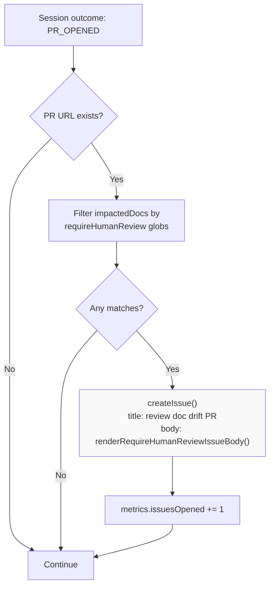
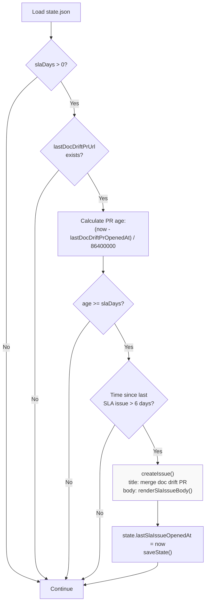
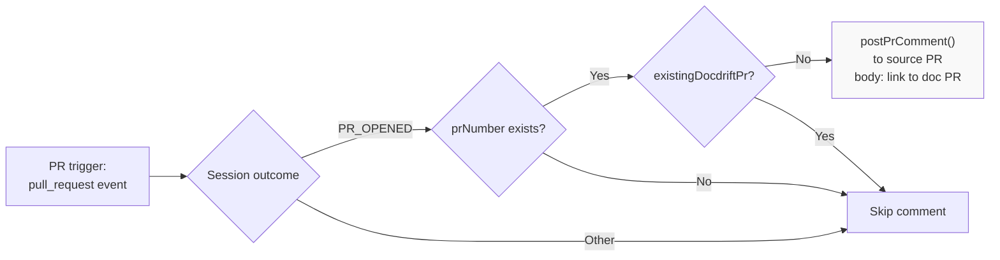

# Issues and Notifications

<details>
<summary>Relevant source files</summary>

The following files were used as context for generating this wiki page:

- [.github/workflows/devin-doc-drift.yml](.github/workflows/devin-doc-drift.yml)
- [docdrift-yml.md](docdrift-yml.md)
- [src/config/validate.ts](src/config/validate.ts)
- [src/devin/prompts.ts](src/devin/prompts.ts)
- [src/github/client.ts](src/github/client.ts)
- [src/index.ts](src/index.ts)

</details>


This document describes the GitHub issue and comment notification system used by docdrift to alert developers about documentation drift, blocked sessions, and stale PRs. Issues are created in specific circumstances to escalate problems that require human intervention, while comments provide status updates on drift detection runs.

For information about PR lifecycle management and how PRs are created and updated, see [PR Lifecycle Management](#9.2). For details on the GitHub Actions workflow that triggers these notifications, see [GitHub Actions Workflow](#9.1).

---

## Overview

The docdrift system uses GitHub's issue and comment APIs to provide targeted notifications. The notification strategy follows a low-noise design philosophy: issues are created **only** when human action is required, while commit comments provide status visibility for every run.

**Issue Creation Scenarios:**

1. **Human Review Required** — A doc PR touches paths specified in `requireHumanReview` configuration
2. **SLA Reminder** — A doc-drift PR has been open for 7+ days (configurable via `policy.slaDays`)
3. **Configuration Error** — `DEVIN_API_KEY` environment variable is missing

**Comment Types:**

1. **Commit Comments** — Posted to the commit SHA after every `docdrift run` execution
2. **PR Comments** — Posted to source PRs when doc-drift PRs are created in response

**Sources:** [src/index.ts:1-530](), [docdrift-yml.md:286-320]()

---

## Issue Types

### Human Review Issue

Created when a doc-drift PR successfully opens but touches paths that match `requireHumanReview` globs. This ensures human oversight for sensitive documentation areas like guides, conceptual docs, or user-facing prose.

**Trigger Condition:**
```
PR_OPENED outcome + touched paths match requireHumanReview globs
```

**Title Format:**
```
[docdrift] Docs out of sync — review doc drift PR
```

**Body Rendering:**
The issue body is generated by `renderRequireHumanReviewIssueBody()` and includes:
- Explanation of why human review is needed
- Link to the doc-drift PR
- List of touched paths requiring review (up to 20 shown)

**Implementation:**
[src/index.ts:403-420]() creates the issue after detecting touched paths that match review patterns. [src/github/client.ts:146-172]() renders the issue body.



**Diagram: Human Review Issue Creation Flow**

**Sources:** [src/index.ts:403-420](), [src/github/client.ts:146-172]()

---

### SLA Reminder Issue

Created when a doc-drift PR has been open for `policy.slaDays` or more (default: 7 days) and no SLA issue has been opened in the last 6 days (cooldown period). This prevents stale documentation from lingering unmerged.

**Trigger Condition:**
```
PR age >= slaDays + no SLA issue in last 6 days
```

**Title Format:**
```
[docdrift] Docs out of sync — merge doc drift PR(s)
```

**Body Rendering:**
The issue body is generated by `renderSlaIssueBody()` and includes:
- Explanation that PRs have been open too long
- List of PR URLs needing attention
- Instructions to merge or close

**Implementation:**
SLA checks occur in two places:

1. **Inline during run** — [src/index.ts:498-520]() checks SLA after a run completes if state contains `lastDocDriftPrUrl`
2. **Dedicated command** — [src/index.ts:542-595]() implements `runSlaCheck()` which lists open PRs with `slaLabel` and creates issues for stale ones



**Diagram: SLA Issue Creation Decision Tree**

**Configuration:**
The SLA system uses two configuration fields in `policy`:

| Field | Type | Default | Description |
|-------|------|---------|-------------|
| `slaDays` | number | `7` | Days before opening reminder. Set to `0` to disable. |
| `slaLabel` | string | `"docdrift"` | Label used to identify doc-drift PRs for SLA checks. |

**Sources:** [src/index.ts:498-520](), [src/index.ts:542-595](), [src/github/client.ts:174-190](), [docdrift-yml.md:130-136]()

---

### Configuration Error Issue (DEVIN_API_KEY Missing)

Created when `DEVIN_API_KEY` is not set in the environment, preventing Devin sessions from starting. This issue serves as a setup reminder for teams deploying docdrift.

**Trigger Condition:**
```
DEVIN_API_KEY undefined + outcome is BLOCKED with "DEVIN_API_KEY" in summary
```

**Title Format:**
```
[docdrift] Configuration required — set DEVIN_API_KEY
```

**Body Rendering:**
The issue body is generated by `renderBlockedIssueBody()` and includes:
- Doc area name
- Evidence summary explaining the missing key
- Question: "Set DEVIN_API_KEY in GitHub Actions secrets or environment."

**Implementation:**
[src/index.ts:421-443]() creates this issue specifically when the session outcome is `BLOCKED` and the summary contains "DEVIN_API_KEY". The fallback behavior at [src/index.ts:374-385]() sets this condition when the API key is missing.

**Sources:** [src/index.ts:374-385](), [src/index.ts:421-443](), [src/github/client.ts:112-144]()

---

## What Is NOT Created as an Issue

The following scenarios do **not** trigger issue creation, by design:

| Scenario | Action Taken | Rationale |
|----------|--------------|-----------|
| Devin session reports BLOCKED with evidence questions | Commit comment only | Evidence questions are informational; no action required immediately |
| Policy decision is `OPEN_ISSUE` | Commit comment only | Legacy action type, not implemented as actual issue |
| Session outcome is `NO_CHANGE` | Commit comment only | No PR opened, nothing to review |
| Policy decision is `NOOP` | No comment or issue | No drift detected or policy blocked action |

This design keeps issue noise low and focuses human attention on actionable items: PRs needing review, PRs needing merge, or configuration problems.

**Sources:** [src/index.ts:444-448](), [docdrift-yml.md:286-320]()

---

## Comment Notifications

### Commit Comments

Posted to the commit SHA after every `docdrift run` execution (when running in a real GitHub repository with a valid commit SHA). Provides a summary of the run outcome directly on the commit.

**Posting Condition:**
```typescript
canPostCommitComment(repository, commitSha) returns true
// True when: repository is not "local/docdrift" and commitSha matches /^[0-9a-f]{40}$/i
```

**Content Rendering:**
The comment body is generated by `renderRunComment()` at [src/github/client.ts:75-110]() and includes:

- Doc area name
- Policy decision (e.g., `CREATE_PR`, `UPDATE_EXISTING_PR`, `NOOP`)
- Session outcome (e.g., `PR_OPENED`, `BLOCKED`, `NO_CHANGE`)
- Summary text
- Devin session URL (if available)
- PR URL (if opened)
- Issue URL (if created)
- Verification command results

**Example Output:**
```markdown
## Doc Drift Result: docsite

- Decision: CREATE_PR
- Outcome: PR_OPENED
- Summary: PR opened by Devin
- Devin Session: https://preview.devin.ai/sessions/abc123
- PR: https://github.com/owner/repo/pull/456

### Validation
- `npm run docs:check`: passed
```

**Implementation:**
[src/index.ts:479-496]() posts the commit comment using `postCommitComment()` from the GitHub client.

**Sources:** [src/index.ts:77-81](), [src/index.ts:479-496](), [src/github/client.ts:17-34](), [src/github/client.ts:75-110]()

---

### PR Comments

Posted to source PRs when doc-drift PRs are created in response to pull request triggers. This links the API change PR to its corresponding documentation PR, ensuring developers are aware of required doc updates.

**Posting Condition:**
```typescript
trigger === "pull_request" + prNumber exists + PR_OPENED outcome + !existingDocdriftPr
```

The comment is only posted when creating a **new** doc-drift PR, not when updating an existing one (to avoid comment spam).

**Content:**
```markdown
## Doc drift detected

Draft doc PR: https://github.com/owner/repo/pull/789

Merge your API changes first, then review and merge this doc PR.
```

**Implementation:**
[src/index.ts:394-401]() posts the comment using `postPrComment()`, which calls GitHub's `issues.createComment` API (PRs are issues in the GitHub API).



**Diagram: PR Comment Posting Logic**

**Sources:** [src/index.ts:394-401](), [src/github/client.ts:36-54]()

---

## Rendering Functions

All notification bodies are generated by specialized rendering functions in [src/github/client.ts](). These functions ensure consistent formatting and structure.

### Function Reference

| Function | Purpose | Input | Output |
|----------|---------|-------|--------|
| `renderRunComment()` | Commit comment after run | docArea, decision, outcome, URLs, validation | Markdown with run summary |
| `renderBlockedIssueBody()` | Issue for blocked sessions | docArea, evidence, questions, sessionUrl | Markdown with evidence and questions |
| `renderRequireHumanReviewIssueBody()` | Issue for human review | prUrl, touchedPaths | Markdown with PR link and path list |
| `renderSlaIssueBody()` | Issue for SLA reminder | prUrls, slaDays | Markdown with PR list and instructions |

### Body Template Structure

All issue bodies follow a consistent pattern:

1. **Why this issue** — Explanation section
2. **What to do** — Action items for the developer
3. **Additional context** — Paths, URLs, or evidence

Example from `renderRequireHumanReviewIssueBody()`:
```markdown
## Why this issue

This doc-drift PR touches paths that require human review (guides, prose, or other non-technical docs).

## What to do

1. Review the PR: https://github.com/owner/repo/pull/123
2. Confirm the changes are correct or request modifications.
3. Merge or close the PR.

## Touched paths (require review)

- `apps/docs-site/docs/guides/auth.mdx`
- `apps/docs-site/docs/guides/billing.mdx`
```

**Sources:** [src/github/client.ts:75-190]()

---

## Issue Creation API

All issues are created through the `createIssue()` function at [src/github/client.ts:56-73](), which wraps the Octokit REST API.

### Function Signature

```typescript
async function createIssue(input: {
  token: string;
  repository: string;
  issue: IssueInput;
}): Promise<string>

interface IssueInput {
  title: string;
  body: string;
  labels?: string[];
}
```

### Common Label

All docdrift-created issues are labeled with `"docdrift"` by default. This label is also used by:

- `listOpenPrsWithLabel()` to find doc-drift PRs for SLA checks
- `policy.slaLabel` configuration to identify which PRs count toward SLA

**Sources:** [src/github/client.ts:11-73]()

---

## Issue Creation Locations in Code

The following table maps issue types to their creation locations:

| Issue Type | Created At | Rendering Function | Label |
|------------|-----------|-------------------|-------|
| Human Review | [src/index.ts:407-418]() | `renderRequireHumanReviewIssueBody()` | `["docdrift"]` |
| SLA (inline) | [src/index.ts:505-516]() | `renderSlaIssueBody()` | `["docdrift"]` |
| SLA (command) | [src/index.ts:582-590]() | `renderSlaIssueBody()` | `["docdrift"]` |
| DEVIN_API_KEY | [src/index.ts:426-441]() | `renderBlockedIssueBody()` | `["docdrift"]` |

**Sources:** [src/index.ts:388-520]()

---

## State Tracking for Issues

The system tracks issue creation timestamps in `state.json` to implement cooldown periods and prevent duplicate notifications.

### State Fields

| Field | Type | Purpose |
|-------|------|---------|
| `lastSlaIssueOpenedAt` | string (ISO 8601) | Timestamp of most recent SLA issue creation |
| `lastDocDriftPrUrl` | string | URL of most recently opened doc-drift PR |
| `lastDocDriftPrOpenedAt` | string (ISO 8601) | Timestamp when last doc-drift PR was opened |

### Cooldown Logic

SLA issues have a 6-day cooldown to prevent spam:

```typescript
const slaCooldown = 6 * 24 * 60 * 60 * 1000; // 6 days in milliseconds
if (Date.now() - lastSla < slaCooldown) {
  // Skip SLA issue creation
}
```

This logic appears at [src/index.ts:503]() (inline check) and [src/index.ts:576]() (sla-check command).

**Sources:** [src/index.ts:391-392](), [src/index.ts:473-475](), [src/index.ts:517](), [src/index.ts:591]()

---

## Complete Notification Flow

```mermaid
graph TB
    Start["runDocDrift() completes"]
    CheckOutcome{Session outcome?}
    
    PR["PR_OPENED"]
    Blocked["BLOCKED"]
    NoChange["NO_CHANGE"]
    
    CheckGitHub{GITHUB_TOKEN<br/>exists?}
    
    FilterReview["Filter impactedDocs<br/>by requireHumanReview"]
    CheckReviewMatches{Matches exist?}
    CreateReviewIssue["createIssue()<br/>Human Review Issue"]
    
    CheckBlockedType{Summary contains<br/>DEVIN_API_KEY?}
    CreateKeyIssue["createIssue()<br/>Config Error Issue"]
    
    CheckCommit{canPostCommitComment()?}
    PostCommit["postCommitComment()<br/>renderRunComment()"]
    
    CheckSLA{slaDays > 0 +<br/>PR age >= slaDays +<br/>cooldown passed?}
    CreateSLAIssue["createIssue()<br/>SLA Reminder Issue"]
    
    CheckPRTrigger{trigger == pull_request<br/>+ prNumber exists<br/>+ !existingPr?}
    PostPRComment["postPrComment()<br/>to source PR"]
    
    SaveState["saveState()<br/>update timestamps"]
    WriteMetrics["writeMetrics()"]
    End["Return results"]
    
    Start --> CheckOutcome
    
    CheckOutcome -->|PR_OPENED| PR
    CheckOutcome -->|BLOCKED| Blocked
    CheckOutcome -->|NO_CHANGE| NoChange
    
    PR --> CheckGitHub
    Blocked --> CheckGitHub
    NoChange --> CheckGitHub
    
    CheckGitHub -->|Yes, PR_OPENED| FilterReview
    CheckGitHub -->|Yes, BLOCKED| CheckBlockedType
    CheckGitHub -->|No| CheckCommit
    
    FilterReview --> CheckReviewMatches
    CheckReviewMatches -->|Yes| CreateReviewIssue
    CheckReviewMatches -->|No| CheckPRTrigger
    CreateReviewIssue --> CheckPRTrigger
    
    CheckBlockedType -->|Yes| CreateKeyIssue
    CheckBlockedType -->|No| CheckCommit
    CreateKeyIssue --> CheckCommit
    
    CheckPRTrigger -->|Yes| PostPRComment
    CheckPRTrigger -->|No| CheckCommit
    PostPRComment --> CheckCommit
    
    CheckCommit -->|Yes| PostCommit
    CheckCommit -->|No| CheckSLA
    PostCommit --> CheckSLA
    
    CheckSLA -->|Yes| CreateSLAIssue
    CheckSLA -->|No| SaveState
    CreateSLAIssue --> SaveState
    
    SaveState --> WriteMetrics
    WriteMetrics --> End
    
    style CreateReviewIssue fill:#f9f9f9
    style CreateKeyIssue fill:#f9f9f9
    style CreateSLAIssue fill:#f9f9f9
    style PostCommit fill:#f9f9f9
    style PostPRComment fill:#f9f9f9
```

**Diagram: Complete Notification Flow After Run Completion**

**Sources:** [src/index.ts:388-530]()

---

## SLA Check Command

The `docdrift sla-check` command provides a dedicated way to monitor and create SLA reminder issues without running full drift detection. This is useful for scheduled jobs that only check PR age.

### Command Implementation

Implemented by `runSlaCheck()` at [src/index.ts:542-595](). The function:

1. Validates `GITHUB_TOKEN` and `GITHUB_REPOSITORY` are set
2. Loads normalized config to get `slaDays` and `slaLabel`
3. Exits early if `slaDays <= 0`
4. Calls `listOpenPrsWithLabel()` to find all open PRs with the SLA label
5. Filters PRs older than `slaDays`
6. Checks SLA issue cooldown (6 days)
7. Creates issue with `renderSlaIssueBody()` if stale PRs exist
8. Updates `state.lastSlaIssueOpenedAt` and saves state

### GitHub Actions Usage

The workflow at [.github/workflows/devin-doc-drift.yml]() can be extended to run SLA checks on a schedule:

```yaml
- name: SLA Check
  if: github.event_name == 'schedule'
  env:
    GITHUB_TOKEN: ${{ secrets.GITHUB_TOKEN }}
    GITHUB_REPOSITORY: ${{ github.repository }}
  run: npx tsx src/cli.ts sla-check
```

**Sources:** [src/index.ts:542-595](), [src/github/client.ts:207-226]()

---

## Configuration Reference

### Policy Configuration

The notification behavior is controlled by these policy fields:

| Field | Type | Default | Effect on Notifications |
|-------|------|---------|------------------------|
| `policy.slaDays` | number | `7` | Days before SLA issue. Set to `0` to disable SLA checks. |
| `policy.slaLabel` | string | `"docdrift"` | Label used to identify doc-drift PRs for SLA tracking. |
| `requireHumanReview` | string[] | `[]` | Glob patterns. Matching paths trigger human review issues. |

### Example Configuration

```yaml
policy:
  slaDays: 7
  slaLabel: docdrift
  # ... other policy fields

requireHumanReview:
  - "apps/docs-site/docs/guides/**"
  - "apps/docs-site/docs/concepts/**"
```

**Sources:** [docdrift-yml.md:130-149]()

---

## Metrics Tracking

Issue and comment creation is tracked in `metrics.json`:

| Metric | Type | Description |
|--------|------|-------------|
| `issuesOpened` | number | Count of issues created during the run |
| `prsOpened` | number | Count of PRs created (separate from issues) |

The metrics are incremented at:
- [src/index.ts:419]() — Human review issue
- [src/index.ts:442]() — DEVIN_API_KEY issue

**Sources:** [src/index.ts:283-292](), [src/index.ts:419](), [src/index.ts:442]()

---