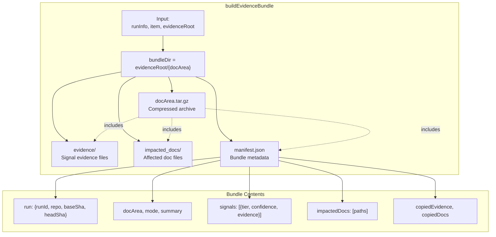
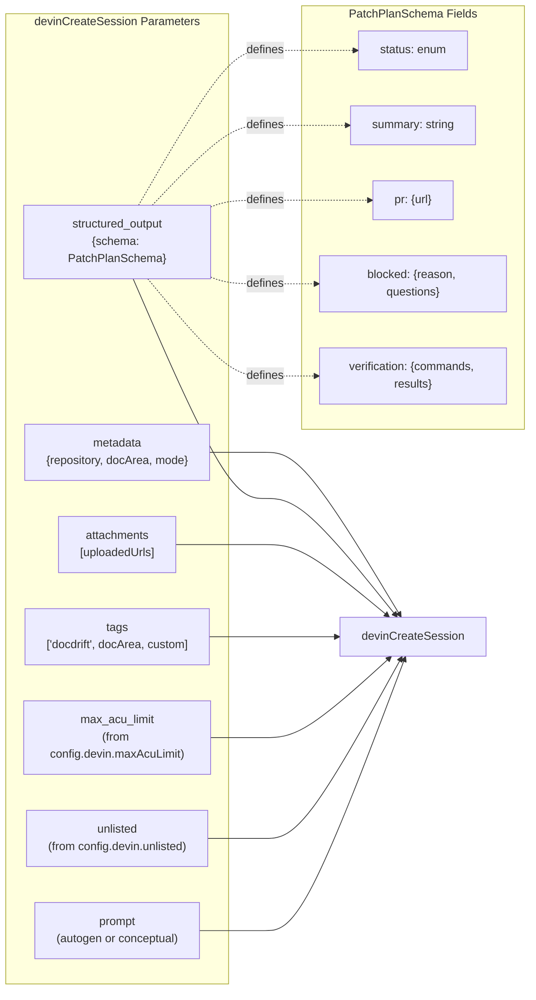
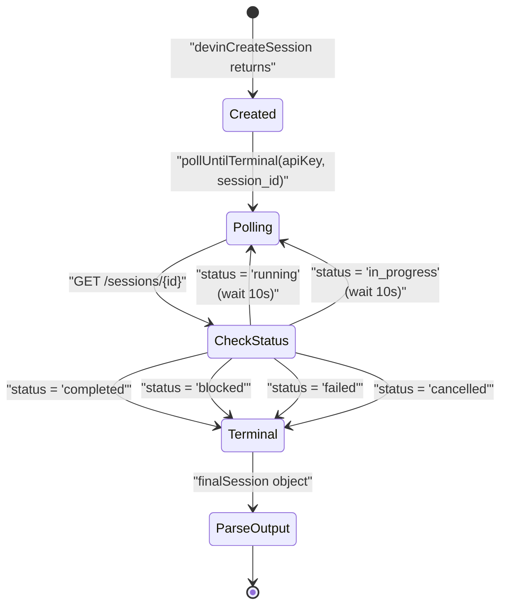
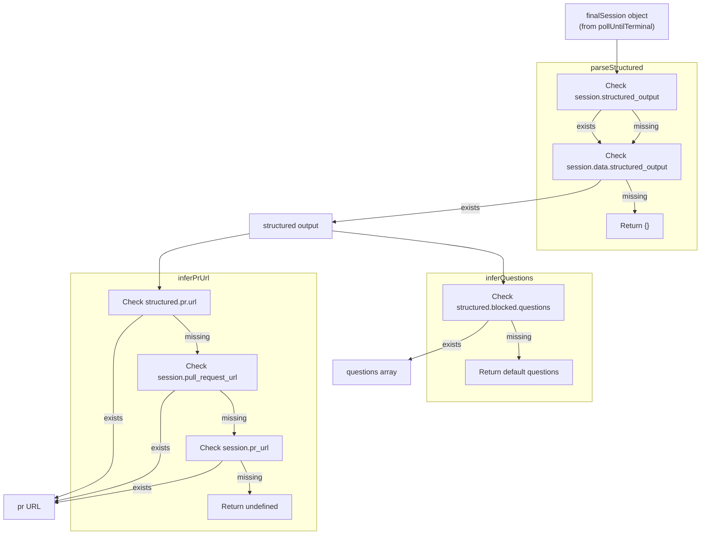
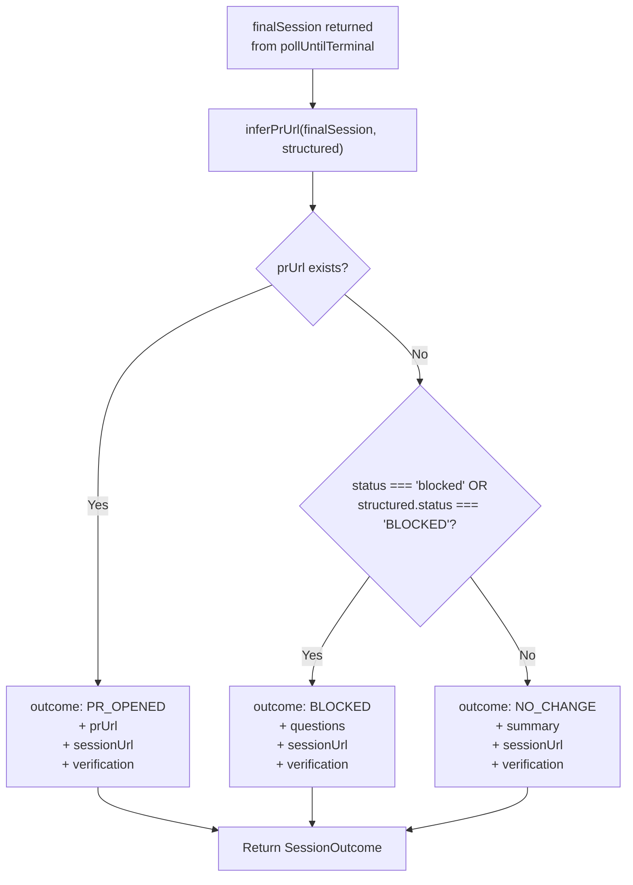

# Devin Integration

<details>
<summary>Relevant source files</summary>

The following files were used as context for generating this wiki page:

- [.github/workflows/devin-doc-drift.yml](.github/workflows/devin-doc-drift.yml)
- [docdrift-yml.md](docdrift-yml.md)
- [src/cli.ts](src/cli.ts)
- [src/config/validate.ts](src/config/validate.ts)
- [src/devin/prompts.ts](src/devin/prompts.ts)
- [src/devin/v1.ts](src/devin/v1.ts)
- [src/github/client.ts](src/github/client.ts)
- [src/index.ts](src/index.ts)

</details>


This document explains how DocDrift integrates with the Devin AI service to automatically remediate documentation drift. It covers the evidence bundling process, session creation and management, structured output parsing, and outcome handling.

For information about the detection system that identifies drift before Devin is invoked, see [Detection System](#4). For details on how the policy engine decides when to route drift to Devin versus GitHub issues, see [Policy Engine](#5).

## Overview

DocDrift uses the Devin API v1 to create AI-powered sessions that automatically fix documentation drift by opening pull requests. The integration workflow consists of five main steps:

1. **Evidence bundling** — Package drift signals, impacted docs, and OpenAPI diffs into compressed archives
2. **Attachment upload** — Upload evidence bundles to Devin's attachment storage
3. **Session creation** — Create a Devin session with prompts, constraints, and structured output schemas
4. **Status polling** — Poll the session until it reaches a terminal state
5. **Outcome parsing** — Extract PR URLs, blocking reasons, or other results from structured output

The integration is implemented primarily in [src/index.ts:69-157]() with support from helper modules for API calls, prompt generation, and evidence bundling.

**Sources:** README.md:54-60, src/index.ts:69-157, Diagram 5 from architecture overview

## Evidence Bundle Structure

Before creating a Devin session, DocDrift builds an evidence bundle that packages all context needed for the AI agent to understand and fix the drift. The bundling logic is in [src/evidence/bundle.ts:25-94]().

### Bundle Organization



The `buildEvidenceBundle` function creates a hierarchical directory structure under `.docdrift/evidence/{runId}/{docArea}/`:

| Directory/File | Purpose |
|----------------|---------|
| `evidence/` | Contains evidence files referenced in drift signals (e.g., `openapi_diff.json`) |
| `impacted_docs/` | Contains copies of documentation files affected by the drift |
| `manifest.json` | JSON file with run metadata, drift summary, signals, and file listings |
| `{docArea}.tar.gz` | Compressed archive of the entire bundle directory |

The function performs several safety operations:
- Uses `toSafeName()` [src/evidence/bundle.ts:14-16]() to sanitize file names
- Resolves all paths to absolute paths via `resolveEvidencePath()` [src/evidence/bundle.ts:18-23]()
- Copies files safely with `copyIfExists()` [src/evidence/bundle.ts:45-47]()
- Creates directories as needed with `ensureDir()` [src/evidence/bundle.ts:36-37]()

**Sources:** src/evidence/bundle.ts:25-94, README.md:38

## Session Execution Workflow

The `executeSession` function [src/index.ts:69-157]() orchestrates the complete Devin integration lifecycle. This is where evidence bundles are uploaded, sessions are created with prompts and schemas, and outcomes are parsed.

```mermaid
sequenceDiagram
    participant Main as "runDocDrift"
    participant Exec as "executeSession"
    participant Upload as "devinUploadAttachment"
    participant Prompt as "buildAutogenPrompt /<br/>buildConceptualPrompt"
    participant Create as "devinCreateSession"
    participant Poll as "pollUntilTerminal"
    participant Parse as "parseStructured /<br/>inferPrUrl"
    
    Main->>Exec: "executeSession({apiKey, item, attachmentPaths})"
    
    loop "For each attachment"
        Exec->>Upload: "devinUploadAttachment(apiKey, path)"
        Upload-->>Exec: "attachmentUrl"
    end
    
    alt "item.mode === 'autogen'"
        Exec->>Prompt: "buildAutogenPrompt({item, attachmentUrls})"
    else "item.mode === 'conceptual'"
        Exec->>Prompt: "buildConceptualPrompt({item, attachmentUrls})"
    end
    Prompt-->>Exec: "prompt text"
    
    Exec->>Create: "devinCreateSession(apiKey, {prompt, structured_output})"
    Create-->>Exec: "{session_id, url}"
    
    Exec->>Poll: "pollUntilTerminal(apiKey, session_id)"
    Note over Poll: "Polls every 10s until<br/>status is terminal"
    Poll-->>Exec: "finalSession"
    
    Exec->>Parse: "parseStructured(finalSession)"
    Parse-->>Exec: "structured output object"
    
    Exec->>Parse: "inferPrUrl(finalSession, structured)"
    Parse-->>Exec: "prUrl or undefined"
    
    alt "prUrl exists"
        Exec-->>Main: "{outcome: PR_OPENED, prUrl, sessionUrl}"
    else "status === 'blocked'"
        Exec-->>Main: "{outcome: BLOCKED, questions, sessionUrl}"
    else "no PR, not blocked"
        Exec-->>Main: "{outcome: NO_CHANGE, sessionUrl}"
    end
```

**Sources:** src/index.ts:69-157, README.md:39-42

## Session Creation Parameters

When creating a Devin session, DocDrift configures several key parameters to control behavior and ensure structured outputs:



### Key Configuration Elements

| Parameter | Source | Purpose |
|-----------|--------|---------|
| `prompt` | [src/devin/prompts.ts]() | Generated based on doc area mode (autogen vs conceptual) |
| `unlisted` | [docdrift.yaml]() `devin.unlisted` | Controls session visibility in Devin dashboard |
| `max_acu_limit` | [docdrift.yaml]() `devin.maxAcuLimit` | Sets compute budget cap for the session |
| `tags` | Config + defaults | Always includes `"docdrift"` and the doc area name for filtering |
| `attachments` | Evidence bundles | Uploaded attachment URLs from previous step |
| `structured_output` | Hardcoded schema | `PatchPlanSchema` enforces structured response format |
| `metadata` | Run context | Repository, doc area, and mode for tracking |

The `structured_output` parameter is critical — it uses `PatchPlanSchema` [src/devin/schemas.ts]() to ensure Devin returns parseable JSON with specific fields rather than unstructured text. This enables reliable outcome detection.

**Sources:** src/index.ts:99-113, README.md:57

## Polling and Status Management

After creating a session, DocDrift polls the Devin API until the session reaches a terminal state. The polling logic is implemented in `pollUntilTerminal` (referenced in [src/index.ts:115]()).

### Terminal Status Detection



The polling function continues until `finalSession.status_enum` or `finalSession.status` indicates a terminal state. Non-terminal statuses (like `"running"` or `"in_progress"`) trigger another poll after a short delay.

**Sources:** src/index.ts:115

## Structured Output Parsing

Once a session completes, DocDrift extracts actionable information from the structured output using multiple parsing functions [src/index.ts:41-67]().

### Parsing Strategy



### Parsing Functions

**`parseStructured(session)`** [src/index.ts:41-43]()
Extracts the structured output object from various possible locations in the session response. Falls back to empty object if not found.

**`inferPrUrl(session, structured)`** [src/index.ts:45-56]()
Searches multiple potential fields for a PR URL:
1. `structured?.pr?.url` (preferred location from schema)
2. `session?.pull_request_url` (fallback)
3. `session?.pr_url` (alternate fallback)

**`inferQuestions(structured)`** [src/index.ts:58-67]()
Extracts questions from `structured?.blocked?.questions` for blocked sessions. If missing, returns default questions like:
- "Which conceptual docs should be updated for this behavior change?"
- "What are the exact user-visible semantics after this merge?"

These functions handle variations in the Devin API response format, providing resilience against schema changes or missing fields.

**Sources:** src/index.ts:41-67

## Outcome Determination

Based on the parsed structured output and session status, `executeSession` returns a `SessionOutcome` object [src/index.ts:31-39]() with one of four possible outcomes:

### Outcome Decision Tree



### Outcome Types

| Outcome | Condition | Includes |
|---------|-----------|----------|
| `PR_OPENED` | `prUrl` is present | PR URL, session URL, summary, verification results |
| `BLOCKED` | Status is "blocked" and no PR | Blocking reason, questions for humans, session URL |
| `NO_CHANGE` | Session completed without PR and not blocked | Summary explaining why no action taken, session URL |

All outcomes include a `verification` array [src/index.ts:119-129]() that maps each verification command to its result. If the structured output includes `structured.verification.results`, those are used; otherwise, commands are mapped to `"not reported"`.

**Sources:** src/index.ts:131-156

## Integration with Main Run Loop

The `executeSession` function is called from the main `runDocDrift` loop [src/index.ts:275-293]() after policy decisions determine that a Devin session should be created:

```mermaid
sequenceDiagram
    participant Loop as "runDocDrift<br/>(for each drift item)"
    participant Policy as "decidePolicy"
    participant Bundle as "buildEvidenceBundle"
    participant Execute as "executeSession"
    participant GitHub as "GitHub API"
    participant State as "State Management"
    
    Loop->>Policy: "Evaluate drift item"
    Policy-->>Loop: "decision.action = OPEN_PR"
    
    Loop->>Bundle: "buildEvidenceBundle({runInfo, item})"
    Bundle-->>Loop: "{archivePath, attachmentPaths}"
    
    alt "DEVIN_API_KEY is set"
        Loop->>Execute: "executeSession({apiKey, item, attachmentPaths})"
        Execute-->>Loop: "{outcome, sessionUrl, prUrl, questions}"
    else "DEVIN_API_KEY missing"
        Note over Loop: "Fallback: outcome = BLOCKED<br/>questions = ['Set DEVIN_API_KEY']"
    end
    
    alt "outcome is BLOCKED or NO_CHANGE"
        Loop->>GitHub: "createIssue({title, body, questions})"
        GitHub-->>Loop: "issueUrl"
    end
    
    Loop->>GitHub: "postCommitComment({outcome, sessionUrl, prUrl})"
    Loop->>State: "applyDecisionToState({outcome, link})"
    State->>State: "Update state.json<br/>(PR counts, idempotency)"
```

Key integration points:

1. **Policy gating** — Only called when `decision.action === "OPEN_PR"` [src/index.ts:265-293]()
2. **Evidence preparation** — Bundle is built immediately before session creation
3. **Fallback handling** — If `DEVIN_API_KEY` is missing, creates a BLOCKED outcome with helpful message [src/index.ts:285-293]()
4. **GitHub escalation** — BLOCKED and NO_CHANGE outcomes trigger issue creation [src/index.ts:296-316]()
5. **State persistence** — All outcomes update state to enforce caps and prevent duplicate actions [src/index.ts:356-362]()

The integration ensures that even if a Devin session fails or blocks, the system creates a GitHub issue to surface the problem to human maintainers, fulfilling the "low-noise" design goal of always routing work appropriately.

**Sources:** src/index.ts:179-377, README.md:34-42

## Error Handling and Resilience

The Devin integration includes several layers of error handling:

### API Key Validation

If `DEVIN_API_KEY` is not set, the system creates a synthetic BLOCKED outcome [src/index.ts:285-293]() rather than throwing an error. This allows the run to complete and surface configuration issues via GitHub issues.

### Session Polling Robustness

The `pollUntilTerminal` function (referenced in [src/index.ts:115]()) likely includes timeout handling and retry logic, though the implementation details are in a separate file. The polling continues until a terminal status is reached, preventing the system from getting stuck on in-progress sessions.

### Structured Output Fallbacks

All parsing functions ([src/index.ts:41-67]()) provide sensible defaults:
- `parseStructured` returns empty object if output is missing
- `inferPrUrl` returns `undefined` after checking multiple fields
- `inferQuestions` returns default questions if none provided
- Verification results default to `"not reported"` if missing [src/index.ts:122-124]()

This defensive parsing ensures the system can handle variations in Devin API responses without crashing.

### Metrics Collection

The system tracks session execution time [src/index.ts:276-284]() and records it in `metrics.timeToSessionTerminalMs`. This enables monitoring of Devin session performance and detection of unusually slow sessions.

**Sources:** src/index.ts:41-67, src/index.ts:275-293, src/index.ts:276-284

---