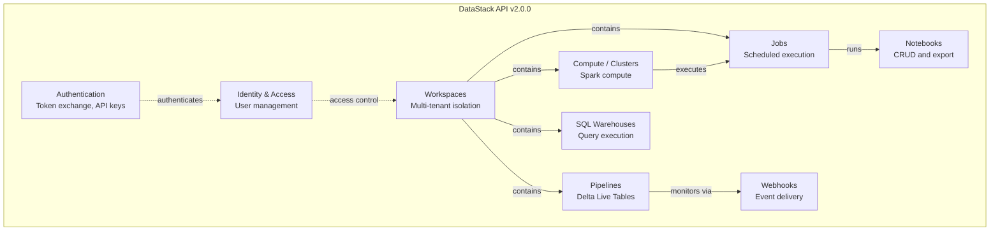
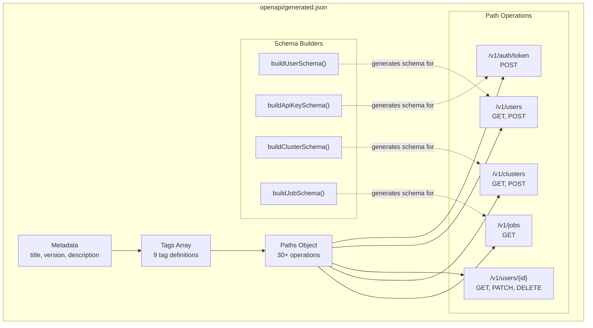
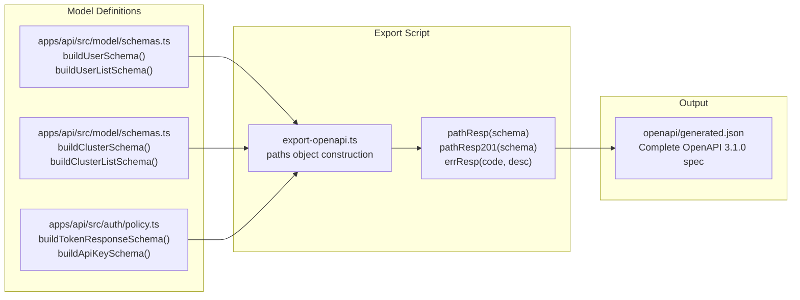
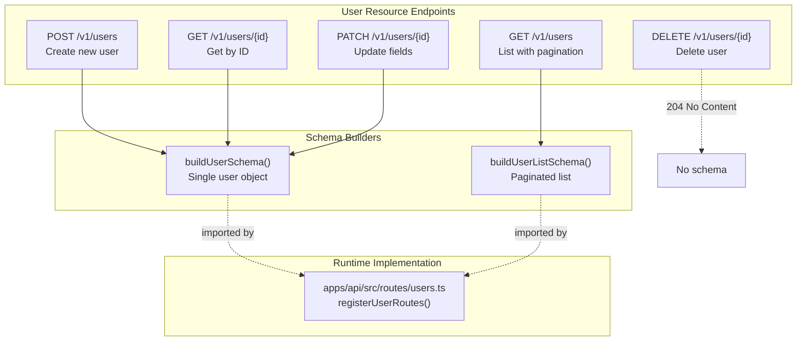
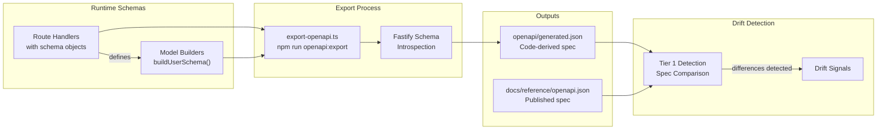

# Example: DataStack API

<details>
<summary>Relevant source files</summary>

The following files were used as context for generating this wiki page:

- [apps/api/scripts/export-openapi.ts](apps/api/scripts/export-openapi.ts)
- [apps/api/src/model/schemas.ts](apps/api/src/model/schemas.ts)
- [apps/api/src/routes/users.ts](apps/api/src/routes/users.ts)
- [openapi/generated.json](openapi/generated.json)

</details>


This document demonstrates docdrift capabilities using DataStack API, a complete example API application included in the repository at [apps/api/](). DataStack API is a fictitious data platform REST API that exposes endpoints for authentication, workspaces, compute clusters, jobs, notebooks, pipelines, SQL warehouses, and webhooks.

The example demonstrates:
- **OpenAPI-based drift detection**: Comparing code-generated specs against published documentation
- **Spec provider configuration**: Using the `openapi` spec provider type
- **Schema generation from code**: Programmatic OpenAPI spec construction
- **Multi-endpoint coverage**: Nine tag groups with 30+ operations

This example serves as a reference implementation for spec-based drift detection (see page 6.2 for detection mechanisms) and shows how code changes automatically flow into OpenAPI specs for drift analysis.

---

## DataStack API Structure

DataStack API is organized around nine resource domains, each represented as an OpenAPI tag. The API spans authentication, identity management, compute resources, data pipelines, and observability.

**API Tag Structure Diagram**



**Sources:** [openapi/generated.json:8-44]()

---

## Resource Coverage

The API provides 30+ operations across nine domains. Below is a summary of endpoints by resource:

| Tag | Operations | Key Paths | Purpose |
|-----|-----------|-----------|---------|
| Authentication | 5 | `/v1/auth/token`, `/v1/auth/api-keys` | OAuth2 token exchange, API key lifecycle |
| Identity & Access | 5 | `/v1/users`, `/v1/users/{id}` | User CRUD operations |
| Workspaces | 2 | `/v1/workspaces`, `/v1/workspaces/{workspaceId}` | Workspace management |
| Compute / Clusters | 4 | `/v1/clusters`, `/v1/clusters/{clusterId}/resize` | Spark cluster lifecycle |
| Jobs | 4 | `/v1/jobs`, `/v1/jobs/{jobId}/runs` | Job scheduling and execution |
| Notebooks | 3 | `/v1/notebooks`, `/v1/notebooks/export` | Notebook CRUD and export |
| Pipelines | 6 | `/v1/pipelines`, `/v1/pipelines/{pipelineId}/start` | DLT pipeline management |
| SQL Warehouses | 4 | `/v1/sql/warehouses`, `/v1/sql/warehouses/{warehouseId}/start` | SQL warehouse lifecycle |
| Webhooks | 6 | `/v1/webhooks`, `/v1/webhooks/{webhookId}/deliveries` | Webhook registration and tracking |

The API demonstrates realistic complexity for drift detection testing: multiple resource types, nested path parameters, query parameters, request bodies, and varied response schemas.

**Sources:** [openapi/generated.json:46-649]()

---

## OpenAPI Specification Structure

The generated OpenAPI specification follows OpenAPI 3.1.0 format with comprehensive metadata, path definitions, and reusable schema components. The specification is produced by [apps/api/scripts/export-openapi.ts]() and written to [openapi/generated.json]().

**Specification Anatomy Diagram**



### Top-Level Structure

The specification contains four main sections at [openapi/generated.json:2-7]():

```json
{
  "openapi": "3.1.0",
  "info": {
    "title": "DataStack API",
    "version": "2.0.0",
    "description": "REST API for DataStack: authentication, workspaces, compute clusters, jobs, notebooks, pipelines, SQL warehouses, and webhooks."
  },
  "tags": [...],
  "paths": {...}
}
```

The `info` object provides API-level metadata. The `tags` array defines organizational categories with descriptions at [openapi/generated.json:8-44](). The `paths` object contains all operation definitions at [openapi/generated.json:46-649]().

### Path Operation Pattern

Each path operation follows a consistent structure with `summary`, `tags`, `requestBody`/`parameters`, and `responses`. Example from authentication endpoint at [openapi/generated.json:47-155]():

```json
"/v1/auth/token": {
  "post": {
    "summary": "Exchange credentials for access token",
    "tags": ["Authentication"],
    "requestBody": {
      "content": {
        "application/json": {
          "schema": {
            "type": "object",
            "properties": {...},
            "required": [...]
          }
        }
      }
    },
    "responses": {
      "200": {...},
      "401": {...}
    }
  }
}
```

This structure enables docdrift's OpenAPI spec provider to parse operations, extract schemas, and detect drift when the generated spec diverges from published documentation.

**Sources:** [openapi/generated.json:1-649](), [apps/api/scripts/export-openapi.ts]()

---

## Schema Generation Script

The OpenAPI specification is generated programmatically by [apps/api/scripts/export-openapi.ts](), which constructs the entire `paths` object using schema builder functions imported from model files. The script demonstrates how code changes automatically flow into the OpenAPI spec for drift detection.

**Generation Flow Diagram**



### Helper Functions

The script defines three helper functions at [apps/api/scripts/export-openapi.ts:31-62]() for constructing response objects:

**`pathResp(schema)`** - Generates 200 OK response
```typescript
function pathResp(schema: object) {
  return {
    "200": { 
      description: "OK", 
      content: { "application/json": { schema } } 
    },
  };
}
```

**`pathResp201(schema)`** - Generates 201 Created response at [apps/api/scripts/export-openapi.ts:37-41]()

**`errResp(code, desc)`** - Generates error responses with standard error schema at [apps/api/scripts/export-openapi.ts:43-62]()

These helpers reduce duplication and ensure consistent response structure across all endpoints.

### Path Object Construction

The `paths` constant at [apps/api/scripts/export-openapi.ts:64-650]() defines all API operations using object literals. Each path key maps to an object containing HTTP method keys (`get`, `post`, `patch`, `delete`). Example authentication endpoint at [apps/api/scripts/export-openapi.ts:65-88]():

```typescript
const paths: Record<string, object> = {
  "/v1/auth/token": {
    post: {
      summary: "Exchange credentials for access token",
      tags: ["Authentication"],
      requestBody: {
        content: {
          "application/json": {
            schema: {
              type: "object",
              properties: {
                grantType: { type: "string", enum: ["client_credentials", "refresh_token"] },
                clientId: { type: "string" },
                clientSecret: { type: "string" },
                refreshToken: { type: "string" },
                scopes: { type: "array", items: { type: "string" } },
              },
              required: ["grantType"],
            },
          },
        },
      },
      responses: { 
        ...pathResp(buildTokenResponseSchema()), 
        ...errResp("401", "Unauthorized") 
      },
    },
  },
  // ... 30+ more paths
};
```

The script imports schema builders from [apps/api/src/model/schemas.ts]() at [apps/api/scripts/export-openapi.ts:3-23]() and [apps/api/src/auth/policy.ts]() at [apps/api/scripts/export-openapi.ts:24-29](). Each operation calls these builders to generate response schemas, ensuring the spec reflects the actual type definitions.

### Spec Assembly and Export

The final spec is assembled at [apps/api/scripts/export-openapi.ts:652-671]():

```typescript
const spec = {
  openapi: "3.1.0",
  info: {
    title: "DataStack API",
    version: "2.0.0",
    description: "REST API for DataStack: authentication, workspaces, compute clusters, jobs, notebooks, pipelines, SQL warehouses, and webhooks.",
  },
  tags: [
    { name: "Authentication", description: "OAuth2 token exchange and API key management" },
    { name: "Identity & Access", description: "Users and permissions" },
    // ... 7 more tags
  ],
  paths,
};
```

The script writes the spec to [openapi/generated.json]() at [apps/api/scripts/export-openapi.ts:673-676]():

```typescript
const outputPath = path.resolve(process.cwd(), "openapi/generated.json");
fs.mkdirSync(path.dirname(outputPath), { recursive: true });
fs.writeFileSync(outputPath, `${JSON.stringify(spec, null, 2)}\n`, "utf8");
console.log(`Wrote ${outputPath}`);
```

This script is invoked by docdrift's OpenAPI spec provider when `command` is configured. Any changes to model schemas or route definitions trigger regeneration, enabling automatic drift detection.

**Sources:** [apps/api/scripts/export-openapi.ts:1-677](), [apps/api/src/model/schemas.ts:1-393]()

---

## Example User Management Endpoints

The user management endpoints demonstrate realistic CRUD operations with pagination, query filtering, and schema validation. These endpoints showcase how docdrift detects changes to request/response schemas, path parameters, and query parameters.

**User Endpoint Structure Diagram**



### GET /v1/users - List Users

Returns a paginated list of users with optional filtering. Defined at [apps/api/src/routes/users.ts:47-100]() and exported at [openapi/generated.json:850-1006]().

**Request Parameters:**
| Parameter | Location | Type | Default | Description |
|-----------|----------|------|---------|-------------|
| `page` | query | integer | 1 | Page number for pagination |
| `perPage` | query | integer | 20 | Results per page |
| `role` | query | string | - | Filter by role: admin, editor, viewer |
| `status` | query | string | - | Filter by status: active, suspended, pending_verification |
| `search` | query | string | - | Search by name or email |

**Response Schema (200):**
Returns object with `data` array and `pagination` metadata at [openapi/generated.json:910-1001]():

```json
{
  "data": [
    {
      "id": "u1",
      "fullName": "Ada Lovelace",
      "email": "ada@datastack.dev",
      "avatarUrl": "https://api.datastack.dev/avatars/ada.png",
      "department": "Engineering",
      "createdAt": "2024-01-15T10:00:00Z",
      "updatedAt": "2024-06-01T15:30:00Z",
      "role": "admin",
      "status": "active",
      "lastLoginAt": "2024-06-10T08:00:00Z"
    }
  ],
  "pagination": {
    "total": 1,
    "page": 1,
    "perPage": 20,
    "hasMore": false
  }
}
```

### POST /v1/users - Create User

Creates a new user with required fields. Defined at [apps/api/src/routes/users.ts:102-142]() and exported at [openapi/generated.json:1007-1134]().

**Request Body:**
```json
{
  "fullName": "string",
  "email": "user@example.com",
  "role": "admin" | "editor" | "viewer"
}
```

All three fields are required at [openapi/generated.json:1034-1037](). The response returns a complete user object with `status` set to `"pending_verification"` at [apps/api/src/routes/users.ts:132-140]().

### GET /v1/users/{id} - Get User

Retrieves a single user by ID. Defined at [apps/api/src/routes/users.ts:6-45]() and exported at [openapi/generated.json:559-665]().

**Path Parameters:**
- `id` (string, required) - User identifier at [openapi/generated.json:567-572]()

**Response Schema:**
Returns complete user object with 10 fields defined by `buildUserSchema()` at [apps/api/src/model/schemas.ts:19-36](). Required fields include `id`, `fullName`, `email`, `createdAt`, `role`, and `status` at [openapi/generated.json:628-635]().

### PATCH /v1/users/{id} - Update User

Updates user fields via partial update. Defined at [apps/api/src/routes/users.ts:144-191]() and exported at [openapi/generated.json:667-801]().

**Request Body (all optional):**
```json
{
  "fullName": "string",
  "role": "admin" | "editor" | "viewer",
  "status": "active" | "suspended"
}
```

Note that `status` update only allows `"active"` and `"suspended"` at [openapi/generated.json:699-704](), while the full user schema includes `"pending_verification"`. This demonstrates how docdrift can detect schema inconsistencies between operations.

### DELETE /v1/users/{id} - Delete User

Deletes a user by ID. Defined at [apps/api/src/routes/users.ts:193-220]() and exported at [openapi/generated.json:803-848]().

**Response:**
- 204 No Content on success at [openapi/generated.json:819-820]()
- 404 Not Found with error schema if user doesn't exist at [openapi/generated.json:822-846]()

### Authentication Requirements

All user endpoints require authentication via the `AUTH_SCOPE_HEADER` header imported from [apps/api/src/auth/policy.ts]() at [apps/api/src/routes/users.ts:2](). The header must contain `AUTH_SCOPE_VALUE` (typically `"admin:read"` or similar scope).

Header validation is enforced at the Fastify schema level at [apps/api/src/routes/users.ts:17-22](), [apps/api/src/routes/users.ts:63-68](), [apps/api/src/routes/users.ts:117-122](), [apps/api/src/routes/users.ts:163-168](), and [apps/api/src/routes/users.ts:204-209]().

**Sources:** [apps/api/src/routes/users.ts:1-221](), [openapi/generated.json:559-1134](), [apps/api/src/model/schemas.ts:19-56]()

---

## OpenAPI Generation

The API application includes OpenAPI specification generation capabilities that integrate with DocDrift's Tier 1 detection system. While the export script is referenced in [apps/api/scripts/export-openapi.ts]() (mentioned in system diagrams but not provided in files), the schema-first design enables automatic OpenAPI generation.

### Generation Flow



### Integration with Drift Detection

The generated OpenAPI specification serves as the source of truth for what the API actually implements. DocDrift's Tier 1 detection compares this generated spec against the published documentation spec to identify:

1. **Endpoint Changes**: New routes, removed routes, or modified paths
2. **Schema Drift**: Changes to request/response schemas
3. **Authentication Changes**: Modified security requirements
4. **Contract Breaking Changes**: Type changes, required fields added/removed

When drift is detected between the generated and published specs, DocDrift can automatically generate PRs to update the published documentation (for autogen doc areas) or create issues for manual review (for conceptual doc areas).

The export script is invoked via `npm run openapi:export` as configured in the detection rules. See [Detection Rules](#9.3) for configuration details and [Tier 1: OpenAPI Drift](#4.2) for the comparison algorithm.

**Sources:** [apps/api/src/model.ts](), [apps/api/src/routes/users.ts](), system architecture diagrams

---