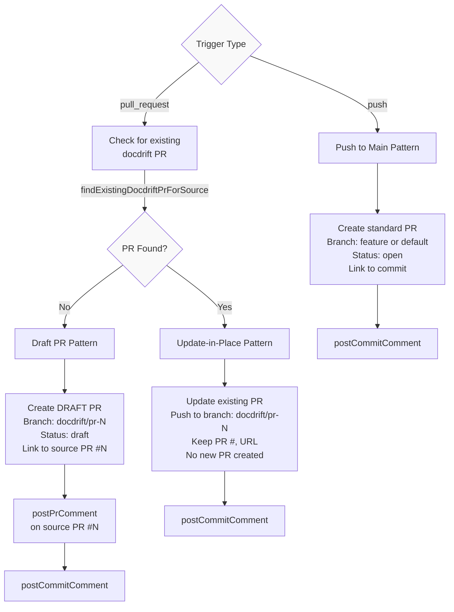
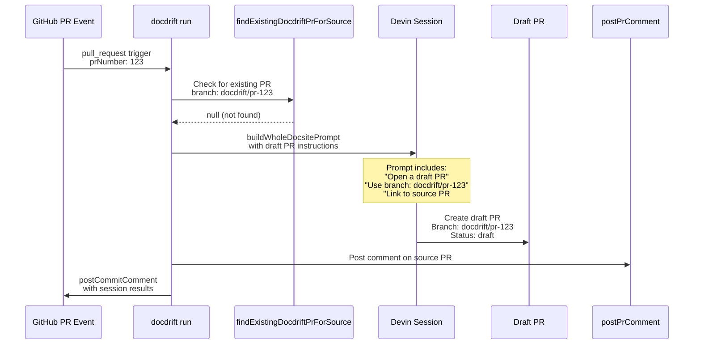
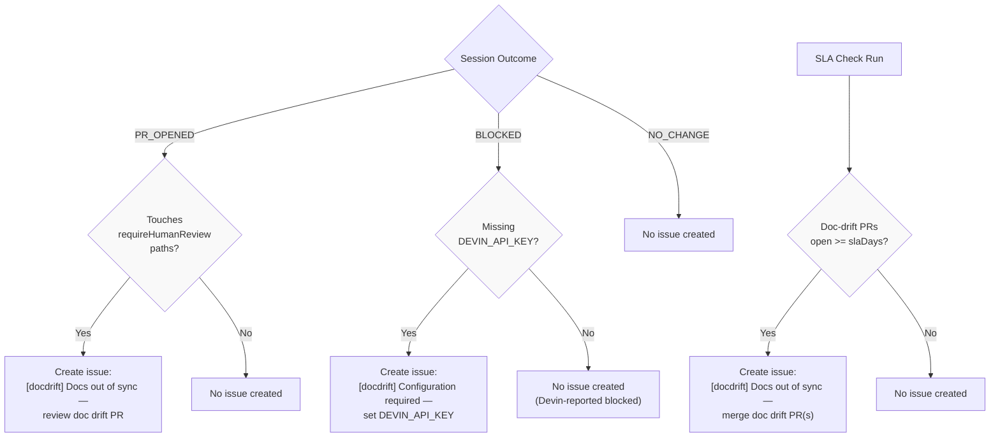
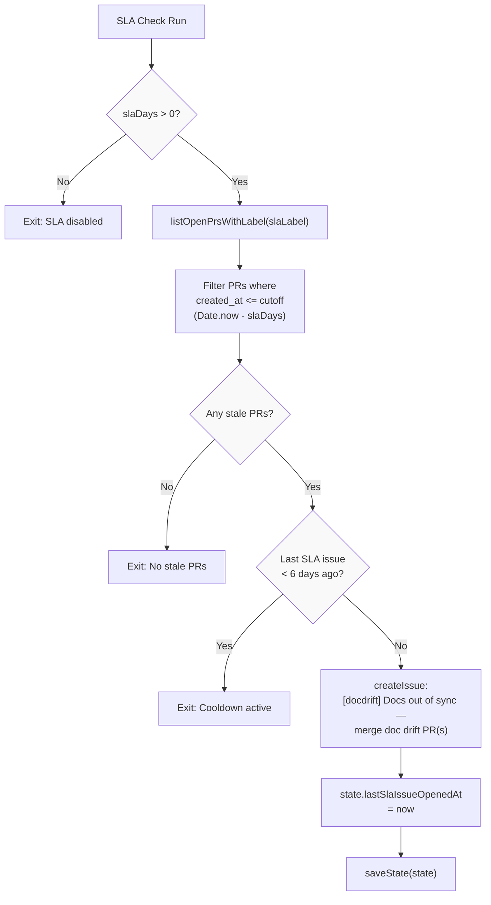

# PR Lifecycle Management

<details>
<summary>Relevant source files</summary>

The following files were used as context for generating this wiki page:

- [.github/workflows/devin-doc-drift.yml](.github/workflows/devin-doc-drift.yml)
- [docdrift-yml.md](docdrift-yml.md)
- [src/config/validate.ts](src/config/validate.ts)
- [src/devin/prompts.ts](src/devin/prompts.ts)
- [src/github/client.ts](src/github/client.ts)
- [src/index.ts](src/index.ts)

</details>


This document explains how docdrift manages the lifecycle of documentation PRs created by Devin AI. The system implements three distinct PR creation patterns based on trigger type (push vs pull_request), with special handling for updating existing PRs to avoid proliferation. This page covers branch naming conventions, comment posting, issue creation, and state tracking.

For information about the GitHub Actions workflow that triggers these patterns, see [GitHub Actions Workflow](#9.1). For details on issue types and notification content, see [Issues and Notifications](#9.3).

---

## PR Creation Patterns

The system implements three distinct patterns for PR creation depending on the trigger type and whether a documentation PR already exists for the source code changes.



**Diagram 1: PR Creation Pattern Decision Tree**

Sources: [src/index.ts:339-348](), [src/devin/prompts.ts:126-147](), [src/github/client.ts:232-253]()

---

### Push-to-Main Pattern

When the trigger is `push` to the main branch, the system creates a standard (non-draft) PR:

| Attribute | Value |
|-----------|-------|
| Branch naming | Standard feature branch or Devin's default |
| PR status | Open (not draft) |
| Target audience | Direct merge after review |
| Comment location | Commit comment on HEAD SHA |

This pattern is used for scheduled runs, manual runs, or pushes to main where the code changes have already been merged. The documentation PR is standalone and can be reviewed and merged independently.

**Sources:** [src/index.ts:479-496](), [.github/workflows/devin-doc-drift.yml:31-41]()

---

### Draft PR Pattern (Pull Request Trigger, No Existing PR)

When triggered by a `pull_request` event and no docdrift PR exists yet, the system creates a **draft PR** with special branch naming:



**Diagram 2: Draft PR Creation Sequence**

**Branch naming convention:** `docdrift/pr-{sourcePrNumber}`

This pattern ensures:
1. The documentation PR is clearly linked to the source API PR
2. The branch name is predictable for future runs to detect
3. The PR status is **draft** until the source PR is merged
4. A comment is posted on the source PR linking to the doc PR

**Prompt instructions for Devin:**

The prompt explicitly instructs Devin on branch naming and PR status [src/devin/prompts.ts:140-146]():

```
This run was triggered by an open API PR. Open a **draft** pull request.
In the PR description, link to the API PR (#N) and state: "Merge the API PR first, then review this doc PR."
Use branch name docdrift/pr-{N} (required for future runs to update this PR).
```

**Sources:** [src/index.ts:339-348](), [src/index.ts:394-401](), [src/devin/prompts.ts:140-146]()

---

### Update-in-Place Pattern (Pull Request Trigger, Existing PR Found)

When triggered by a `pull_request` event and a docdrift PR **already exists** for that source PR, the system instructs Devin to update the existing PR instead of creating a new one:

```mermaid
sequenceDiagram
    participant GH as GitHub PR Event
    participant DocDrift as docdrift run
    participant Find as findExistingDocdriftPrForSource
    participant Devin as Devin Session
    participant Branch as docdrift/pr-123
    participant ExistingPR as Existing PR #456
    
    GH->>DocDrift: pull_request trigger<br/>prNumber: 123 (updated)
    DocDrift->>Find: Check for existing PR<br/>branch: docdrift/pr-123
    Find-->>DocDrift: Found PR #456<br/>url, headRef: docdrift/pr-123
    
    Note over DocDrift: Log: "Found existing docdrift PR<br/>for source PR; will instruct<br/>Devin to update it"
    
    DocDrift->>Devin: buildWholeDocsitePrompt<br/>with existingDocdriftPr parameter
    
    Note over Devin: Prompt includes:<br/>"CRITICAL: An existing doc-drift PR<br/>already exists for this API PR."<br/>"You MUST UPDATE that PR —<br/>do NOT create a new one."<br/>"Existing PR: #456"<br/>"Branch to update: docdrift/pr-123"
    
    Devin->>Branch: Checkout docdrift/pr-123<br/>Pull latest main<br/>Apply doc changes<br/>Push to branch
    
    Branch->>ExistingPR: PR #456 automatically<br/>updates with new commits
    
    DocDrift->>GH: postCommitComment<br/>(no PR comment, PR already exists)
```

**Diagram 3: Update-in-Place Pattern**

The key difference is that `findExistingDocdriftPrForSource` returns a non-null result, which is passed to the prompt builder [src/index.ts:342-347]():

```typescript
if (githubToken && runInfo.trigger === "pull_request" && runInfo.prNumber) {
  existingDocdriftPr = (await findExistingDocdriftPrForSource(githubToken, repo, runInfo.prNumber)) ?? undefined;
  if (existingDocdriftPr) {
    logInfo("Found existing docdrift PR for source PR; will instruct Devin to update it", { ... });
  }
}
```

**Prompt instructions for update-in-place** [src/devin/prompts.ts:128-138]():

```
CRITICAL: An existing doc-drift PR already exists for this API PR.
You MUST UPDATE that PR — do NOT create a new one.
- Existing PR: #{number} ({url})
- Branch to update: {headRef}
Checkout that branch, pull latest main, apply your doc changes, push. The existing PR will update.
Do NOT open a new pull request.
```

This prevents PR proliferation: as the source API PR evolves (new commits, changed files), the documentation PR stays synchronized via updates to the same branch.

**Sources:** [src/index.ts:339-348](), [src/devin/prompts.ts:126-138](), [src/github/client.ts:232-253]()

---

## Branch Naming Convention and Discovery

The `docdrift/pr-{sourcePrNumber}` branch naming convention is critical for the update-in-place pattern to work.

### Discovery Logic

The `findExistingDocdriftPrForSource` function searches for open PRs with a specific branch head [src/github/client.ts:232-253]():

```typescript
export async function findExistingDocdriftPrForSource(
  token: string,
  repository: string,
  sourcePrNumber: number
): Promise<{ number: number; url: string; headRef: string } | null> {
  const octokit = new Octokit({ auth: token });
  const { owner, repo } = parseRepo(repository);
  const branchName = `docdrift/pr-${sourcePrNumber}`;
  const { data } = await octokit.pulls.list({
    owner,
    repo,
    state: "open",
    head: branchName,  // Key filter: branch must match this exact name
  });
  const pr = data[0];
  if (!pr) return null;
  return {
    number: pr.number,
    url: pr.html_url ?? "",
    headRef: pr.head?.ref ?? branchName,
  };
}
```

| Field | Description |
|-------|-------------|
| `branchName` | Constructed as `docdrift/pr-{sourcePrNumber}` |
| `state: "open"` | Only searches open PRs (closed/merged PRs are ignored) |
| `head: branchName` | Octokit filter that matches PRs from this exact branch |
| Return value | First matching PR's number, URL, and head ref (or null) |

**Why the head ref is returned:** The prompt passes `existingDocdriftPr.headRef` to Devin so it knows the exact branch name to checkout, even if there's any variation in the actual ref name stored by GitHub.

**Sources:** [src/github/client.ts:232-253]()

---

## Comment Posting

The system posts comments to three locations depending on the outcome:

### Commit Comments

Commit comments are posted to the HEAD commit SHA when a full GitHub repository context is available [src/index.ts:77-81]():

```typescript
function canPostCommitComment(repository: string, commitSha: string): boolean {
  if (!repository || repository === "local/docdrift") return false;
  return /^[0-9a-f]{40}$/i.test(commitSha);
}
```

Commit comments are **always** posted after a run completes (regardless of outcome) if the environment is valid [src/index.ts:479-496]():

```typescript
if (githubToken && canPostCommitComment(repo, commitSha)) {
  const body = renderRunComment({
    docArea: item.docArea,
    summary: sessionOutcome.summary,
    decision: decision.action,
    outcome: sessionOutcome.outcome,
    sessionUrl: sessionOutcome.sessionUrl,
    prUrl: sessionOutcome.prUrl,
    issueUrl,
    validation: sessionOutcome.verification,
  });
  await postCommitComment({
    token: githubToken,
    repository: repo,
    commitSha,
    body,
  });
}
```

The comment includes [src/github/client.ts:75-110]():
- Decision (CREATE_PR, UPDATE_EXISTING_PR, NOOP, OPEN_ISSUE)
- Outcome (PR_OPENED, BLOCKED, NO_CHANGE, ISSUE_OPENED)
- Summary text
- Devin session URL
- PR URL (if opened)
- Issue URL (if created)
- Verification results (commands run and their outcomes)

**Sources:** [src/index.ts:77-81](), [src/index.ts:479-496](), [src/github/client.ts:17-34](), [src/github/client.ts:75-110]()

---

### PR Comments (Draft PR Pattern Only)

When a **draft PR** is created for a source PR, the system posts a comment on the **source PR** linking to the doc PR [src/index.ts:394-401]():

```typescript
if (githubToken && runInfo.trigger === "pull_request" && runInfo.prNumber && !existingDocdriftPr) {
  await postPrComment({
    token: githubToken,
    repository: repo,
    prNumber: runInfo.prNumber,
    body: `## Doc drift detected\n\nDraft doc PR: ${sessionOutcome.prUrl}\n\nMerge your API changes first, then review and merge this doc PR.`,
  });
}
```

**When this comment is posted:**
- Trigger is `pull_request`
- A doc PR was successfully opened
- No existing docdrift PR was found (i.e., this is the first doc PR for this source PR)

**When this comment is NOT posted:**
- Update-in-place pattern (existing PR found) — the source PR already has the link from the first run
- Push trigger — no source PR to comment on
- Blocked/no-change outcomes — no PR was created

**Sources:** [src/index.ts:394-401](), [src/github/client.ts:36-54]()

---

## Issue Creation

Issues are created in three specific scenarios. See [Issues and Notifications](#9.3) for detailed content and formatting.



**Diagram 4: Issue Creation Decision Tree**

### Issue Types Summary

| Condition | Issue Created | Title |
|-----------|---------------|-------|
| PR opened + touches `requireHumanReview` paths | Yes | `[docdrift] Docs out of sync — review doc drift PR` |
| PR open ≥ `slaDays` | Yes | `[docdrift] Docs out of sync — merge doc drift PR(s)` |
| Blocked + missing `DEVIN_API_KEY` | Yes | `[docdrift] Configuration required — set DEVIN_API_KEY` |
| Policy chose `OPEN_ISSUE` | **No** | (commit comment only) |
| Devin reports `BLOCKED` (evidence questions) | **No** | (commit comment only) |
| Session `NO_CHANGE` | **No** | (commit comment only) |

**Important:** The system does **not** create "docs drift requires input" style issues for Devin-reported blocked sessions or policy OPEN_ISSUE decisions. These outcomes are reported in commit comments only [src/index.ts:444-447]():

```
// Note: We do NOT create "docs drift requires input" issues for Devin-reported BLOCKED
// (evidence questions) or for OPEN_ISSUE/NO_CHANGE. Issues are only created for:
// (1) requireHumanReview when a PR touches those paths, (2) 7-day SLA reminders,
// and (3) DEVIN_API_KEY missing. See docdrift-yml.md.
```

**Sources:** [src/index.ts:389-443](), [src/index.ts:499-520](), [docdrift-yml.md:286-320]()

---

## State Tracking

The system maintains persistent state across runs in `.docdrift/state.json` to support PR deduplication, rate limiting, and SLA tracking.

### State Schema

```typescript
interface State {
  prHistory: Array<{
    docArea: string;
    prUrl: string;
    openedAt: string;
    sha: string;
  }>;
  areaLatestPr: Record<string, string>; // docArea -> PR URL
  lastDocDriftPrUrl?: string;
  lastDocDriftPrOpenedAt?: string;
  lastSlaIssueOpenedAt?: string;
}
```

### State Updates

State is updated after each run [src/index.ts:464-477]():

```typescript
state = applyDecisionToState({
  state,
  decision,
  docArea: "docsite",
  outcome: sessionOutcome.outcome,
  link: sessionOutcome.prUrl ?? issueUrl,
});

if (sessionOutcome.outcome === "PR_OPENED" && sessionOutcome.prUrl) {
  state.lastDocDriftPrUrl = sessionOutcome.prUrl;
  state.lastDocDriftPrOpenedAt = new Date().toISOString();
}

saveState(state);
```

| Field | Purpose | Updated When |
|-------|---------|--------------|
| `prHistory` | Track all PRs opened for rate limiting | PR_OPENED outcome |
| `areaLatestPr` | Track latest PR per doc area for deduplication | PR_OPENED outcome |
| `lastDocDriftPrUrl` | Most recent doc PR URL for SLA checks | PR_OPENED outcome |
| `lastDocDriftPrOpenedAt` | Timestamp of most recent doc PR | PR_OPENED outcome |
| `lastSlaIssueOpenedAt` | Timestamp of last SLA issue to enforce cooldown | SLA issue created |

The state is persisted to disk immediately after each run and restored from GitHub Actions cache [.github/workflows/devin-doc-drift.yml:43-51]():

```yaml
- name: Restore docdrift state
  uses: actions/cache/restore@v4
  with:
    path: .docdrift
    key: docdrift-state-${{ github.event_name }}-main-${{ github.run_id }}
    restore-keys: |
      docdrift-state-${{ github.event_name }}-main-
```

**Sources:** [src/index.ts:464-477](), [src/policy/state.ts](), [.github/workflows/devin-doc-drift.yml:43-51](), [.github/workflows/devin-doc-drift.yml:78-83]()

---

## SLA Enforcement

The system tracks how long doc-drift PRs have been open and creates reminder issues when they exceed `policy.slaDays`.

### SLA Check Logic

The SLA check can be triggered manually via `docdrift sla-check` or scheduled in CI [src/index.ts:542-595]():



**Diagram 5: SLA Check Flow**

**Key parameters:**
- `policy.slaDays`: Days before considering a PR stale (default: 7)
- `policy.slaLabel`: Label used to identify doc-drift PRs (default: "docdrift")
- Cooldown: 6 days between SLA issues (hardcoded in [src/index.ts:503](), [src/index.ts:575]())

**Cutoff calculation** [src/index.ts:560-566]():

```typescript
const cutoff = new Date(Date.now() - slaDays * 24 * 60 * 60 * 1000);

const openPrs = await listOpenPrsWithLabel(githubToken, repo, slaLabel);
const stalePrs = openPrs.filter((pr) => {
  const created = pr.created_at ? Date.parse(pr.created_at) : Date.now();
  return Number.isFinite(created) && created <= cutoff.getTime();
});
```

**Sources:** [src/index.ts:542-595](), [src/index.ts:499-520](), [src/github/client.ts:207-226]()

---

## Implementation Reference

### Core Functions

| Function | Location | Purpose |
|----------|----------|---------|
| `findExistingDocdriftPrForSource` | [src/github/client.ts:232-253]() | Search for open PR from branch `docdrift/pr-{N}` |
| `postCommitComment` | [src/github/client.ts:17-34]() | Post result summary to commit SHA |
| `postPrComment` | [src/github/client.ts:36-54]() | Link doc PR on source PR (draft pattern only) |
| `createIssue` | [src/github/client.ts:56-73]() | Create GitHub issue for review/SLA/config |
| `isPrOpen` | [src/github/client.ts:193-205]() | Check if a PR URL is still open |
| `listOpenPrsWithLabel` | [src/github/client.ts:207-226]() | List open PRs with specific label (for SLA checks) |
| `canPostCommitComment` | [src/index.ts:77-81]() | Validate environment for commit comments |
| `buildWholeDocsitePrompt` | [src/devin/prompts.ts:76-194]() | Generate prompt with PR instructions |

### Comment/Issue Renderers

| Function | Location | Purpose |
|----------|----------|---------|
| `renderRunComment` | [src/github/client.ts:75-110]() | Format commit comment body |
| `renderBlockedIssueBody` | [src/github/client.ts:112-144]() | Format blocked issue body (DEVIN_API_KEY missing) |
| `renderRequireHumanReviewIssueBody` | [src/github/client.ts:146-172]() | Format human review issue body |
| `renderSlaIssueBody` | [src/github/client.ts:174-190]() | Format SLA reminder issue body |

**Sources:** [src/github/client.ts:1-254](), [src/index.ts:1-664](), [src/devin/prompts.ts:76-194]()

---