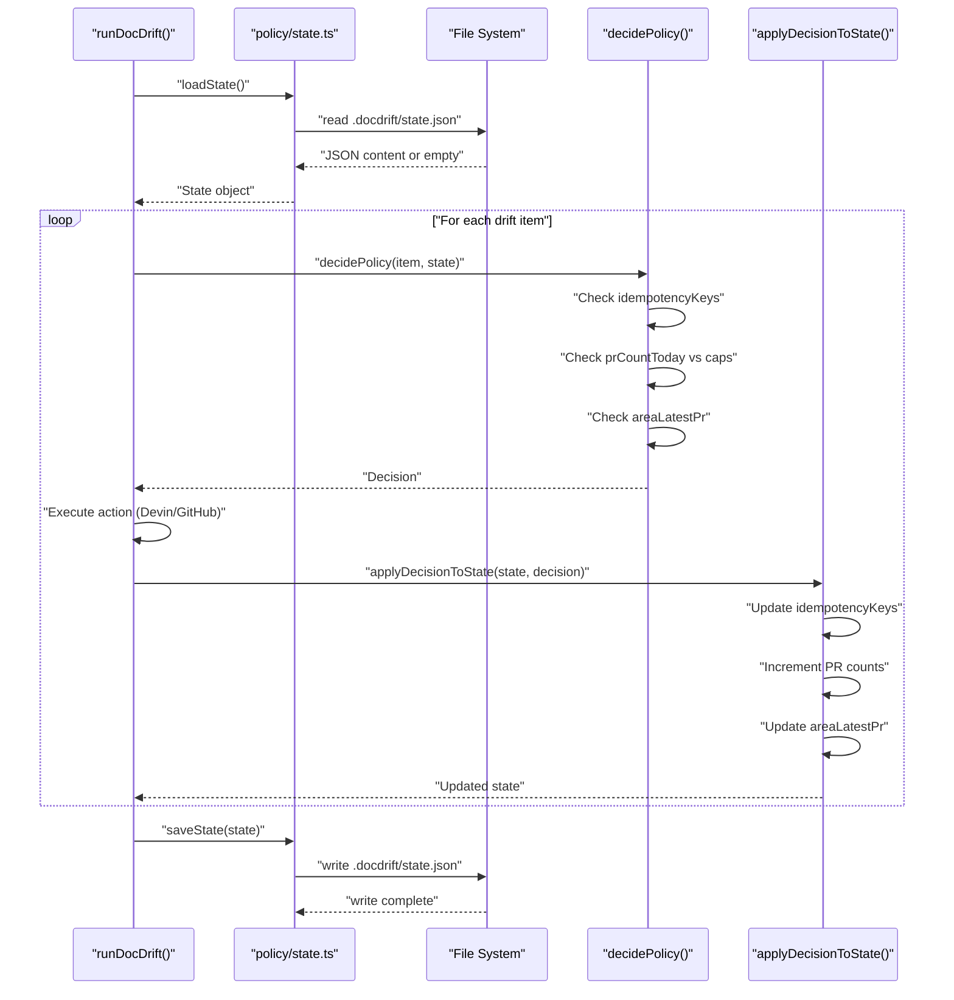
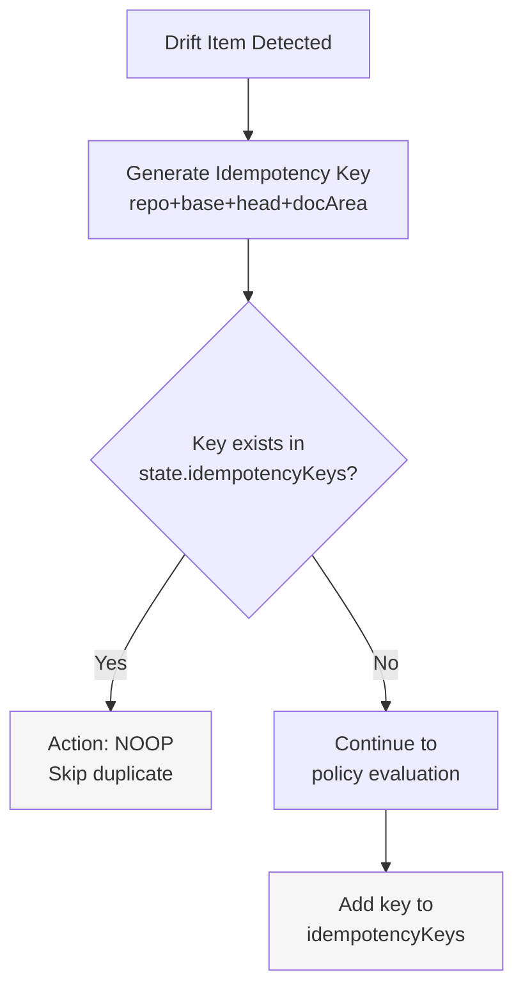
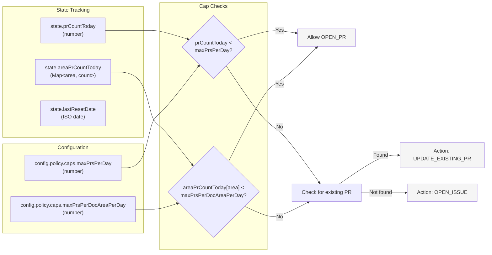
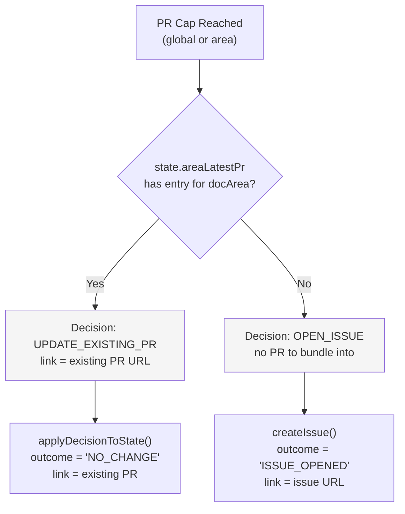
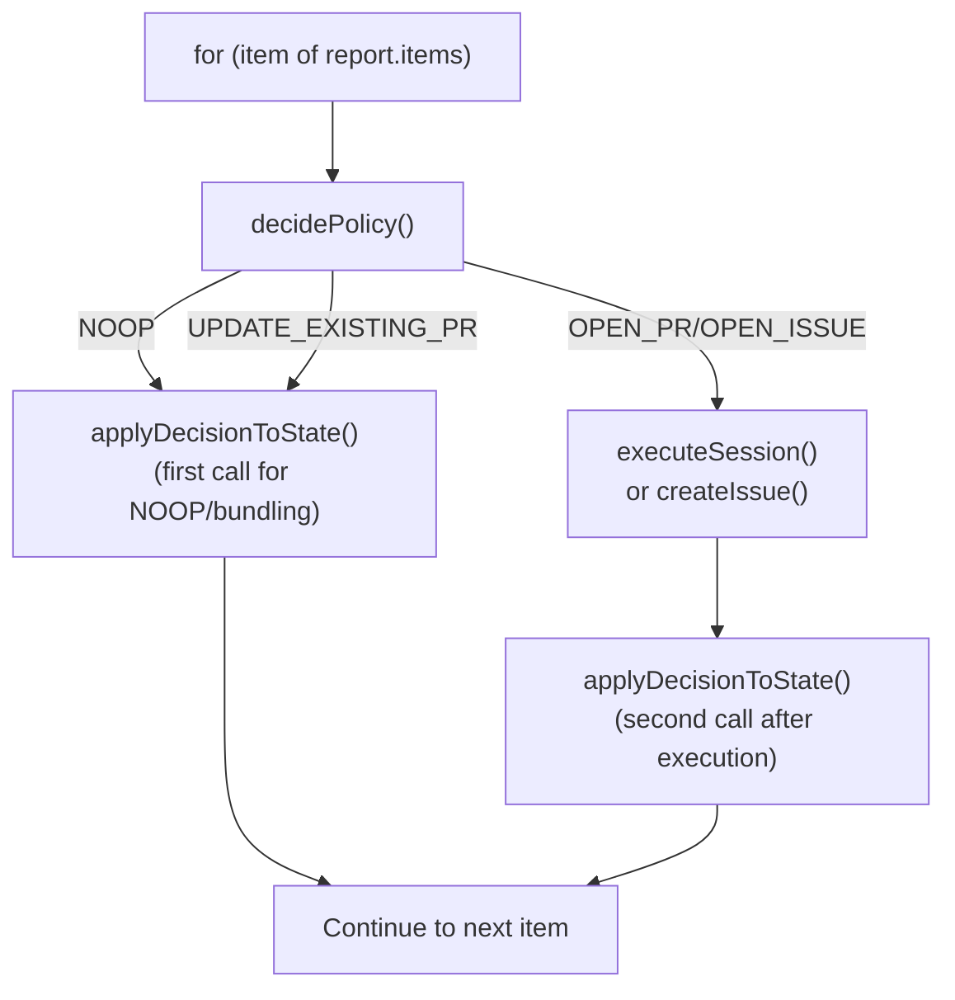

# State Management

<details>
<summary>Relevant source files</summary>

The following files were used as context for generating this wiki page:

- [docdrift-yml.md](docdrift-yml.md)
- [src/index.ts](src/index.ts)

</details>


This document describes how DocDrift maintains persistent state across runs to enforce policy caps, prevent duplicate actions, and enable intelligent bundling. State management is the persistence layer that supports the Policy Engine's decision-making capabilities.

For information about how state influences policy decisions, see [Decision Logic](#5.1). For noise reduction mechanisms that rely on state, see [Noise Reduction](#5.2).

**Sources:** [README.md:1-185](), [src/index.ts:1-446]()

---

## Purpose and Scope

The state management system provides persistent storage that enables:

- **Idempotency**: Preventing duplicate actions for the same code changes
- **PR Cap Enforcement**: Tracking daily PR counts to respect configured limits
- **Bundling Intelligence**: Identifying existing PRs to bundle related changes
- **Historical Tracking**: Maintaining a record of actions taken per doc area

State is stored in `.docdrift/state.json` in the repository where DocDrift runs. This file is read at the start of each run, updated during execution, and saved atomically at completion.

**Sources:** [README.md:16-21](), [src/index.ts:200-365]()

---

## State File Structure

The state file contains several key data structures that support policy enforcement:

| Field | Type | Purpose |
|-------|------|---------|
| `idempotencyKeys` | `Set<string>` | Tracks processed drift items to prevent duplicates |
| `areaLatestPr` | `Map<string, string>` | Maps doc area name to most recent PR URL |
| `prCountToday` | `number` | Total PRs opened today (for global cap) |
| `areaPrCountToday` | `Map<string, number>` | PRs opened today per doc area |
| `lastResetDate` | `string` | ISO date string for daily counter reset |
| `history` | `Array` | Log of past actions (for debugging/auditing) |

The state is loaded via `loadState()` and saved via `saveState()`, which handle file I/O and JSON serialization.

**Sources:** [src/index.ts:200](), [src/index.ts:365]()

---

## State Lifecycle



**State Lifecycle Phases:**

1. **Load**: Read existing state from disk at the start of `runDocDrift()` [src/index.ts:200]()
2. **Query**: Policy engine reads state to make decisions [src/index.ts:221-229]()
3. **Update**: After each action, state is updated via `applyDecisionToState()` [src/index.ts:256-262](), [src/index.ts:356-362]()
4. **Save**: Final state is persisted atomically at run completion [src/index.ts:365]()

**Sources:** [src/index.ts:200](), [src/index.ts:221-229](), [src/index.ts:256-262](), [src/index.ts:365]()

---

## Idempotency System



**Idempotency Key Format:**

The idempotency key is a unique identifier composed of:
```
{repository}/{baseSha}/{headSha}/{docArea}/{action}
```

This ensures that:
- The same drift detection on the same commit range will not trigger duplicate actions
- Different doc areas can be processed independently
- Re-running the CLI on unchanged code will not create redundant PRs or issues

The policy engine checks this key first, before any other evaluation [src/index.ts:221-229](). If the key exists, the decision is immediately set to `NOOP`.

**Sources:** [README.md:21](), [src/index.ts:221-229]()

---

## PR Cap Enforcement

State management enables two levels of PR caps:



**Cap Reset Logic:**

On each run, if `state.lastResetDate` differs from today's date:
1. `prCountToday` is reset to 0
2. `areaPrCountToday` is cleared
3. `lastResetDate` is updated to current date

This daily reset ensures caps are enforced on a per-day basis, allowing fresh capacity each day.

**Sources:** [README.md:17-18](), [src/index.ts:221-229]()

---

## Bundling via State

When PR caps are reached, the state's `areaLatestPr` map enables intelligent bundling:



The `areaLatestPr` map is populated when a PR is successfully opened:

1. Decision action is `OPEN_PR`
2. Devin session completes with `outcome: "PR_OPENED"` and a `prUrl`
3. `applyDecisionToState()` updates `state.areaLatestPr[docArea] = prUrl` [src/index.ts:356-362]()

On subsequent drift items for the same doc area (within the same day), if caps are reached, the policy engine can reference this existing PR URL and bundle the new changes by returning `UPDATE_EXISTING_PR` [src/index.ts:241-263]().

**Sources:** [README.md:17](), [src/index.ts:241-263](), [src/index.ts:356-362]()

---

## State Update Operations

The `applyDecisionToState()` function is the single entry point for all state mutations:

**Update Scenarios:**

| Decision Action | State Updates |
|----------------|---------------|
| `NOOP` | Add idempotency key only |
| `OPEN_PR` (success) | Increment `prCountToday`, increment `areaPrCountToday[area]`, set `areaLatestPr[area]`, add idempotency key |
| `OPEN_PR` (blocked) | Add idempotency key, no count increment |
| `UPDATE_EXISTING_PR` | Add idempotency key, no count increment (already counted) |
| `OPEN_ISSUE` | Add idempotency key, increment issue counters (if tracked) |

**State Update Call Sites:**



The function is called at two points in the main loop:
1. **Early exit**: For `NOOP` and `UPDATE_EXISTING_PR` decisions [src/index.ts:256-262]()
2. **Post-execution**: After Devin session or GitHub issue creation [src/index.ts:356-362]()

**Sources:** [src/index.ts:256-262](), [src/index.ts:356-362]()

---

## State File Location

The state file is always written to:
```
.docdrift/state.json
```

This path is resolved relative to the current working directory where the CLI is invoked [src/index.ts:445](). Key characteristics:

- **Repository-local**: Each repository using DocDrift maintains its own state
- **Gitignore recommended**: Add `.docdrift/` to `.gitignore` to avoid committing run artifacts [README.md:32]()
- **Persistent across runs**: State survives between CI runs when the file system persists
- **Ephemeral in CI**: In GitHub Actions, state resets on each workflow run unless explicitly cached

**State in CI/CD:**

In continuous integration environments, state behaves differently:

- **GitHub Actions**: Each workflow run starts with empty state (unless using `actions/cache`)
- **Self-hosted runners**: State may persist if the runner workspace persists
- **Daily resets**: Even with persistence, the date-based reset logic ensures caps refresh daily

This design means DocDrift naturally works in both persistent (local development) and ephemeral (CI) environments without configuration changes.

**Sources:** [src/index.ts:445](), [README.md:32]()

---

## State Consistency Guarantees

The state management system provides the following guarantees:

1. **Atomic writes**: State is written once at the end of the run [src/index.ts:365](), preventing partial state updates
2. **Read-only during execution**: The state object is read at the start and mutations happen in-memory until final save
3. **Fail-safe loading**: If `state.json` is missing or corrupted, an empty state is initialized
4. **Idempotency persistence**: Once a drift item is processed, its key remains in state forever (until manual cleanup)

**Concurrency:**

DocDrift does not implement file-level locking. If multiple instances run concurrently on the same repository:
- Each instance loads the initial state
- Each instance updates its in-memory copy
- Last writer wins on `saveState()`

This is acceptable because:
- DocDrift is typically triggered by single CI events
- Local development runs are usually sequential
- Idempotency keys prevent logical conflicts (duplicate actions)

**Sources:** [src/index.ts:200](), [src/index.ts:365]()

---

## State Schema Evolution

The state file format is not versioned in the current implementation. Future additions to the state schema should:

1. Add new fields with default values
2. Maintain backward compatibility with older state files
3. Handle missing fields gracefully during `loadState()`

Example of safe schema evolution:
```typescript
// Old state: { idempotencyKeys: Set, prCountToday: number }
// New state: { idempotencyKeys: Set, prCountToday: number, newField: [] }
// Loading old state should initialize newField as empty array
```

**Sources:** [src/index.ts:200]()

---