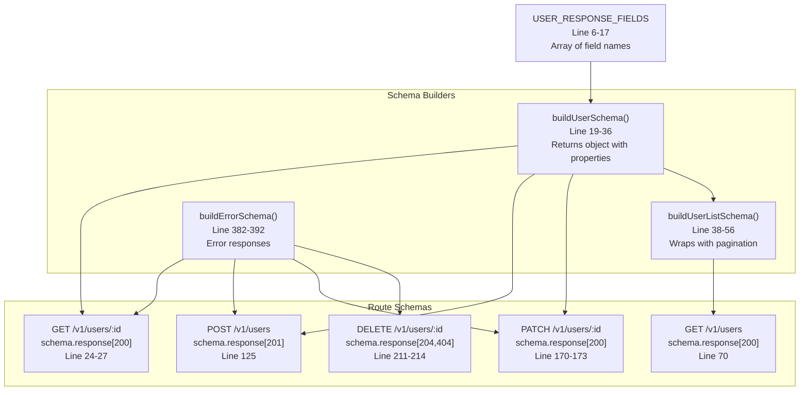

# Example API Endpoints

<details>
<summary>Relevant source files</summary>

The following files were used as context for generating this wiki page:

- [apps/api/src/model/schemas.ts](apps/api/src/model/schemas.ts)
- [apps/api/src/routes/users.ts](apps/api/src/routes/users.ts)

</details>


## Purpose and Scope

This page documents the user management endpoints in the DataStack example API, demonstrating complete CRUD (Create, Read, Update, Delete) operations. These endpoints illustrate how API specifications are programmatically generated from route definitions and consumed by docdrift's spec provider detection system.

The user endpoints serve as a concrete example of Tier 1 spec-based drift detection (see page 6.2). When these route definitions change, the OpenAPI spec regenerates automatically, triggering drift detection through the `openapi` spec provider configured in `docdrift.yaml`.

**Related Pages:**
- **11.2 OpenAPI Specification** - Structure of the generated spec
- **11.3 Schema Generation Script** - How `export-openapi.ts` extracts schemas
- **6.2 Spec Provider Detection** - How docdrift detects spec drift

## Endpoint Overview

The API exposes five user management endpoints implementing complete CRUD operations:

| Endpoint | Method | Purpose | Authentication Required |
|----------|--------|---------|------------------------|
| `/v1/users` | GET | List users with pagination and filtering | Yes |
| `/v1/users/:id` | GET | Retrieve a single user by ID | Yes |
| `/v1/users` | POST | Create a new user | Yes |
| `/v1/users/:id` | PATCH | Update an existing user | Yes |
| `/v1/users/:id` | DELETE | Delete a user | Yes |

All endpoints are registered through `registerUserRoutes()` in [apps/api/src/routes/users.ts:5-221]() and require the `X-Auth-Scope: api:read` header for authentication (defined in [apps/api/src/auth/policy.ts]()).

**Sources:** [apps/api/src/routes/users.ts:1-222]()

### CRUD Operations Architecture


**Sources:** [apps/api/src/routes/users.ts:1-222](), [apps/api/src/model/schemas.ts:1-393]()

## User Schema Structure

The user response schema is defined programmatically through `buildUserSchema()` at [apps/api/src/model/schemas.ts:19-36](), which constructs a JSON Schema object with explicit type definitions.

### Field Definitions

The `USER_RESPONSE_FIELDS` constant at [apps/api/src/model/schemas.ts:6-17]() defines the complete set of fields returned in user responses:

| Field | Type | Format | Enum Values | Description |
|-------|------|--------|-------------|-------------|
| `id` | string | - | - | Unique user identifier |
| `fullName` | string | - | - | User's full name |
| `email` | string | email | - | User's email address (format validated) |
| `avatarUrl` | string | - | - | URL to user's avatar image |
| `department` | string | - | - | User's department |
| `createdAt` | string | date-time | - | ISO 8601 timestamp of account creation |
| `updatedAt` | string | date-time | - | ISO 8601 timestamp of last update |
| `role` | string | - | admin, editor, viewer | User's access role |
| `status` | string | - | active, suspended, pending_verification | User's account status |
| `lastLoginAt` | string | date-time | - | ISO 8601 timestamp of last login |

Required fields (enforced at [apps/api/src/model/schemas.ts:34]()): `id`, `fullName`, `email`, `createdAt`, `role`, `status`

**Sources:** [apps/api/src/model/schemas.ts:6-36]()

### Schema Construction Pattern

The schema construction uses builder functions that return typed JSON Schema objects:



**Sources:** [apps/api/src/model/schemas.ts:6-392](), [apps/api/src/routes/users.ts:1-222]()

The `buildUserSchema()` function explicitly defines each property with its type, format, and enum constraints. This differs from dynamic iteration—each field is statically defined (lines 22-32), ensuring type safety and enabling TypeScript inference.

## Read Operations

### GET /v1/users/:id - Get User by ID

Retrieves a single user by their unique identifier.

**Route Handler:** [apps/api/src/routes/users.ts:6-45]()  
**Schema:** Defined at [apps/api/src/routes/users.ts:8-28]()

#### Request

| Component | Details |
|-----------|---------|
| **Path** | `/v1/users/:id` |
| **Method** | GET |
| **Path Parameters** | `id` (string, required) - User identifier |
| **Headers** | `X-Auth-Scope: api:read` (required, defined at line 17-23) |
| **Tags** | `["Identity & Access"]` - Groups endpoint in generated OpenAPI |

#### Response

**Success (200):** Returns `buildUserSchema()` output  
**Error (404):** Returns `buildErrorSchema()` output

Response handler at [apps/api/src/routes/users.ts:30-44]() returns mock user data:

```javascript
{
  id: params.id,                              // Echoes path parameter
  fullName: "Ada Lovelace",
  email: "ada@datastack.dev",
  avatarUrl: "https://api.datastack.dev/avatars/ada.png",
  department: "Engineering",
  createdAt: "2024-01-15T10:00:00Z",
  updatedAt: "2024-06-01T15:30:00Z",
  role: "admin",
  status: "active",
  lastLoginAt: "2024-06-10T08:00:00Z"
}
```

**Sources:** [apps/api/src/routes/users.ts:6-45](), [apps/api/src/model/schemas.ts:19-36]()

### GET /v1/users - List Users

Retrieves a paginated, filterable list of users.

**Route Handler:** [apps/api/src/routes/users.ts:47-100]()  
**Schema:** Defined at [apps/api/src/routes/users.ts:49-71]()

#### Request

| Component | Details |
|-----------|---------|
| **Path** | `/v1/users` |
| **Method** | GET |
| **Headers** | `X-Auth-Scope: api:read` (required, defined at line 63-69) |
| **Tags** | `["Identity & Access"]` |

**Query Parameters:**

| Parameter | Type | Default | Constraints | Description |
|-----------|------|---------|-------------|-------------|
| `page` | integer | 1 | min: 1 | Page number for pagination |
| `perPage` | integer | 20 | min: 1, max: 100 | Items per page |
| `role` | string | - | enum: admin, editor, viewer | Filter by role |
| `status` | string | - | enum: active, suspended, pending_verification | Filter by status |
| `search` | string | - | - | Search by name or email |

Query parameter validation at [apps/api/src/routes/users.ts:53-61](). Handler bounds enforcement at [apps/api/src/routes/users.ts:74-76]():
- `page` is clamped to minimum 1
- `perPage` is clamped between 1 and 100

#### Response

**Success (200):** Returns `buildUserListSchema()` output defined at [apps/api/src/model/schemas.ts:38-56]()


**Response Structure:**

| Field | Type | Description |
|-------|------|-------------|
| `data` | array | Array of user objects, each matching `buildUserSchema()` |
| `pagination.total` | integer | Total number of users matching filter |
| `pagination.page` | integer | Current page number |
| `pagination.perPage` | integer | Items per page |
| `pagination.hasMore` | boolean | Whether more pages exist |

The handler at [apps/api/src/routes/users.ts:73-99]() returns mock data with a single user and pagination metadata.

**Sources:** [apps/api/src/routes/users.ts:47-100](), [apps/api/src/model/schemas.ts:38-56]()

## Create Operation

### POST /v1/users - Create User

Creates a new user account.

**Route Handler:** [apps/api/src/routes/users.ts:102-142]()  
**Schema:** Defined at [apps/api/src/routes/users.ts:104-128]()

#### Request

| Component | Details |
|-----------|---------|
| **Path** | `/v1/users` |
| **Method** | POST |
| **Headers** | `X-Auth-Scope: api:read` (required, defined at line 117-123) |
| **Tags** | `["Identity & Access"]` |

**Request Body Schema:** Defined at [apps/api/src/routes/users.ts:108-116]()

| Field | Type | Format | Required | Constraints | Description |
|-------|------|--------|----------|-------------|-------------|
| `fullName` | string | - | Yes | - | User's full name |
| `email` | string | email | Yes | Valid email format | User's email address |
| `role` | string | - | Yes | enum: admin, editor, viewer | User's access role |

#### Response

**Success (201 Created):** Returns `buildUserSchema()` output  
**Error (400 Bad Request):** Returns `buildErrorSchema()` output for validation errors

Response handler at [apps/api/src/routes/users.ts:130-141]() returns the created user:

```javascript
{
  id: "u-new",                                // Generated identifier
  fullName: body.fullName,                    // From request body
  email: body.email,                          // From request body
  createdAt: new Date().toISOString(),        // Current timestamp
  updatedAt: new Date().toISOString(),        // Current timestamp
  role: body.role,                            // From request body
  status: "pending_verification"              // Default initial status
}
```

Note: This is a mock implementation. Real implementations would validate uniqueness, hash passwords, and persist to a database.

**Sources:** [apps/api/src/routes/users.ts:102-142](), [apps/api/src/model/schemas.ts:19-36, 382-392]()

## Update Operation

### PATCH /v1/users/:id - Update User

Updates an existing user's properties.

**Route Handler:** [apps/api/src/routes/users.ts:144-191]()  
**Schema:** Defined at [apps/api/src/routes/users.ts:146-174]()

#### Request

| Component | Details |
|-----------|---------|
| **Path** | `/v1/users/:id` |
| **Method** | PATCH |
| **Path Parameters** | `id` (string, required) - User identifier |
| **Headers** | `X-Auth-Scope: api:read` (required, defined at line 163-169) |
| **Tags** | `["Identity & Access"]` |

**Request Body Schema:** Defined at [apps/api/src/routes/users.ts:155-162]()

All fields are optional (partial update):

| Field | Type | Constraints | Description |
|-------|------|-------------|-------------|
| `fullName` | string | - | Updated full name |
| `role` | string | enum: admin, editor, viewer | Updated role |
| `status` | string | enum: active, suspended | Updated account status |

Note: `pending_verification` is not allowed in updates (only in creation).

#### Response

**Success (200):** Returns `buildUserSchema()` output with updated fields  
**Error (404):** Returns `buildErrorSchema()` if user not found

Response handler at [apps/api/src/routes/users.ts:176-190]() returns mock updated user with:
- `updatedAt` set to current timestamp
- Other fields preserved from existing user

**Sources:** [apps/api/src/routes/users.ts:144-191](), [apps/api/src/model/schemas.ts:19-36, 382-392]()

## Delete Operation

### DELETE /v1/users/:id - Delete User

Deletes a user account.

**Route Handler:** [apps/api/src/routes/users.ts:193-221]()  
**Schema:** Defined at [apps/api/src/routes/users.ts:195-215]()

#### Request

| Component | Details |
|-----------|---------|
| **Path** | `/v1/users/:id` |
| **Method** | DELETE |
| **Path Parameters** | `id` (string, required) - User identifier |
| **Headers** | `X-Auth-Scope: api:read` (required, defined at line 204-210) |
| **Tags** | `["Identity & Access"]` |

#### Response

**Success (204 No Content):** Empty response body, defined at [apps/api/src/routes/users.ts:212]()  
**Error (404):** Returns `buildErrorSchema()` if user not found

Response handler at [apps/api/src/routes/users.ts:217-219]() sets status code 204 and returns no content.

**Sources:** [apps/api/src/routes/users.ts:193-221](), [apps/api/src/model/schemas.ts:382-392]()

## Schema Construction Patterns

The user endpoints demonstrate a programmatic schema construction pattern that ensures consistency between runtime validation and OpenAPI generation.

### Relationship Between Components


**Sources:** [apps/api/src/model.ts:1-40](), [apps/api/src/routes/users.ts:5-80]()

### Key Design Principles

1. **Single Source of Truth:** The `USER_RESPONSE_FIELDS` array at [apps/api/src/model.ts:1-8]() defines all user fields in one location.

2. **Programmatic Generation:** Schema builders at [apps/api/src/model.ts:10-40]() iterate over the fields array using `Object.fromEntries()` and `map()`, eliminating manual duplication.

3. **Schema Composition:** The list schema at [apps/api/src/model.ts:24-40]() embeds the user schema through `buildUserSchema()` (line 35), ensuring consistency when the base schema changes.

4. **Type Safety:** Both schemas return typed objects with explicit `type`, `properties`, and `required` fields, enabling TypeScript inference and runtime validation.

This pattern ensures that changes to user fields automatically propagate through route schemas, Fastify validation, and OpenAPI generation, which is critical for the Tier 1 drift detection system described in [Tier 1: OpenAPI Drift](#4.2).

**Sources:** [apps/api/src/model.ts:1-40](), [apps/api/src/routes/users.ts:5-80]()

---