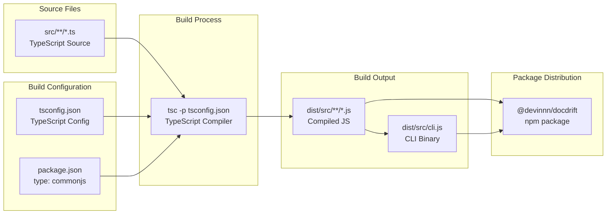
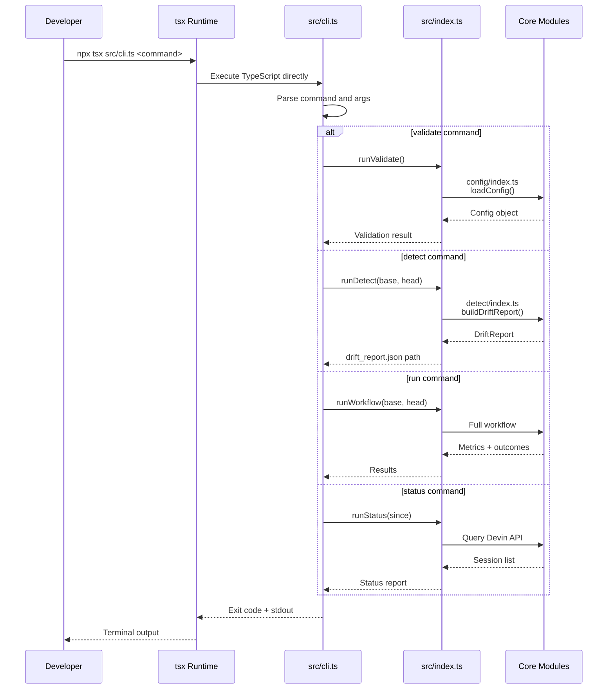
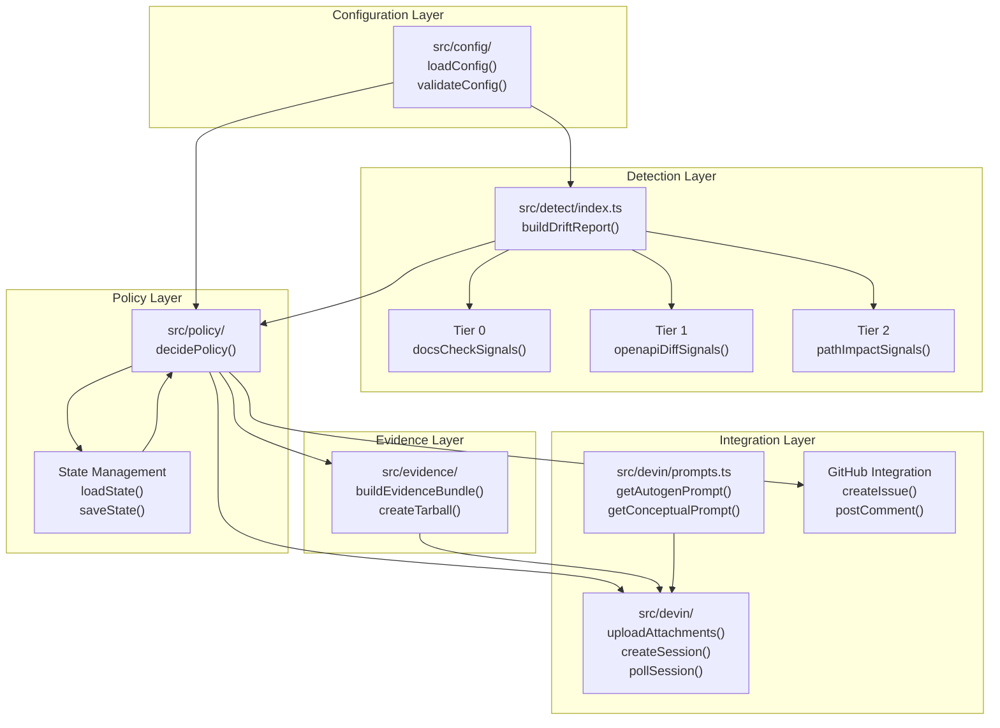
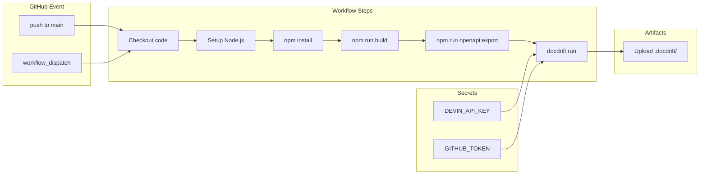

# Development

<details>
<summary>Relevant source files</summary>

The following files were used as context for generating this wiki page:

- [package.json](package.json)
- [src/cli.ts](src/cli.ts)
- [src/devin/v1.ts](src/devin/v1.ts)

</details>


This page guides developers who want to contribute to or extend DocDrift. It covers the repository structure, development setup, build system, and key areas of the codebase where features are implemented.

For information on using DocDrift as an end user, see [Getting Started](#2). For API-specific development, see [API Application](#10).

---

## Overview

DocDrift is a TypeScript-based CLI tool distributed as an npm package. The repository contains:

- **Core CLI and detection engine** in `src/`
- **Example API application** in `apps/api/` demonstrating OpenAPI drift detection
- **Build artifacts** in `dist/` (gitignored, generated by TypeScript compiler)
- **Runtime artifacts** in `.docdrift/` (gitignored, created when running the tool)

Development requires Node.js ≥20 and uses standard TypeScript tooling with `tsx` for local execution without compilation.

**Sources:** [README.md:64-69](), [package.json:11-13]()

---

## Project Structure

The repository is organized into distinct areas for the CLI tool, example application, and supporting scripts:

```mermaid
graph TB
    subgraph "Repository Root"
        Root["/"]
    end
    
    subgraph "Core CLI Source"
        SrcDir["src/"]
        CliTS["src/cli.ts<br/>CLI Entry Point"]
        IndexTS["src/index.ts<br/>Core Orchestration"]
        ConfigTS["src/config/<br/>Config Loading"]
        DetectDir["src/detect/<br/>Detection Engine"]
        PolicyDir["src/policy/<br/>Policy Engine"]
        DevinDir["src/devin/<br/>Devin Integration"]
        EvidenceDir["src/evidence/<br/>Evidence Bundling"]
    end
    
    subgraph "Example API Application"
        AppsDir["apps/"]
        ApiDir["apps/api/"]
        ApiSrc["apps/api/src/<br/>Fastify Server"]
        ApiModel["apps/api/src/model.ts<br/>User Schema"]
        ApiAuth["apps/api/src/auth/**<br/>Auth Logic"]
        ExportScript["apps/api/scripts/export-openapi.ts<br/>OpenAPI Exporter"]
    end
    
    subgraph "Build Output"
        DistDir["dist/<br/>(gitignored)"]
        DistSrc["dist/src/<br/>Compiled JS"]
        DistCli["dist/src/cli.js<br/>CLI Binary"]
    end
    
    subgraph "Runtime Artifacts"
        DriftDir[".docdrift/<br/>(gitignored)"]
        DriftReport[".docdrift/drift_report.json"]
        StateJson[".docdrift/state.json"]
        EvidenceOut[".docdrift/evidence/"]
    end
    
    subgraph "Configuration & Scripts"
        ConfigFiles["docdrift.yaml<br/>tsconfig.json<br/>package.json"]
        ScriptsDir["scripts/<br/>docs-check.js"]
        DocsDir["docs/<br/>Published Docs"]
        OpenAPIDir["openapi/<br/>generated.json"]
    end
    
    Root --> SrcDir
    Root --> AppsDir
    Root --> DistDir
    Root --> DriftDir
    Root --> ConfigFiles
    Root --> ScriptsDir
    Root --> DocsDir
    Root --> OpenAPIDir
    
    SrcDir --> CliTS
    SrcDir --> IndexTS
    SrcDir --> ConfigTS
    SrcDir --> DetectDir
    SrcDir --> PolicyDir
    SrcDir --> DevinDir
    SrcDir --> EvidenceDir
    
    AppsDir --> ApiDir
    ApiDir --> ApiSrc
    ApiSrc --> ApiModel
    ApiSrc --> ApiAuth
    ApiDir --> ExportScript
    
    DistDir --> DistSrc
    DistSrc --> DistCli
    
    DriftDir --> DriftReport
    DriftDir --> StateJson
    DriftDir --> EvidenceOut
```



### Directory Purposes

| Path | Purpose |
|------|---------|
| `src/` | Core DocDrift implementation: CLI, detection engine, policy engine, Devin integration |
| `src/cli.ts` | Command-line interface entry point with command definitions |
| `src/index.ts` | Main orchestration logic for `run`, `detect`, `validate` commands |
| `src/config/` | Configuration file loading and validation |
| `src/detect/` | Three-tier drift detection implementation |
| `src/policy/` | Policy decision logic and state management |
| `src/devin/` | Devin API client, prompts, and session management |
| `src/evidence/` | Evidence bundle creation and tarball generation |
| `apps/api/` | Example Fastify API demonstrating OpenAPI drift detection |
| `apps/api/scripts/` | OpenAPI spec export script |
| `scripts/` | Repository-level utility scripts (docs validation) |
| `dist/` | TypeScript compilation output (distributed in npm package) |
| `.docdrift/` | Runtime output directory created in consuming repositories |
| `docs/` | Published documentation (API reference, guides) |
| `openapi/` | Generated OpenAPI specifications |

**Sources:** [README.md:44-52](), [package.json:6-9](), [package.json:23-25]()

---

## Development Setup

### Prerequisites

- **Node.js** ≥20
- **npm** or **pnpm**
- **Git**

### Initial Setup

```bash
# Clone the repository
git clone https://github.com/cameronking4/docdrift.git
cd docdrift

# Install dependencies
npm install

# Verify installation
npx tsx src/cli.ts --help
```

### Environment Configuration

Create a `.env` file at the repository root for local development:

```env
DEVIN_API_KEY=your_devin_api_key_here
GITHUB_TOKEN=your_github_token_here
GITHUB_REPOSITORY=owner/repo
GITHUB_SHA=commit_sha
```

**Environment Variables:**

| Variable | Required For | Purpose |
|----------|--------------|---------|
| `DEVIN_API_KEY` | `run` command | Authentication with Devin API for session creation |
| `GITHUB_TOKEN` | `run` command (optional) | GitHub API authentication for comments and issues |
| `GITHUB_REPOSITORY` | `run` command (optional) | Target repository for GitHub operations (format: `owner/repo`) |
| `GITHUB_SHA` | `run` command (optional) | Commit SHA for GitHub commit comments |

The `.env` file is gitignored. Omitting GitHub variables allows local testing without GitHub integration (Devin sessions still run, but no comments/issues are created).

**Sources:** [README.md:68-69](), [README.md:88-93](), [.gitignore:10-11]()

---

## Build System

### TypeScript Compilation

DocDrift uses standard TypeScript compilation to produce CommonJS modules:



### Build Commands

```bash
# Compile TypeScript to dist/
npm run build

# Run without building (uses tsx)
npx tsx src/cli.ts validate

# Clean build artifacts
rm -rf dist/
```

The build process:
1. Reads `tsconfig.json` for compiler configuration
2. Compiles all `.ts` files in `src/` to `.js` in `dist/src/`
3. Preserves directory structure
4. Outputs CommonJS modules (`type: "commonjs"` in [package.json:10]())

**Package Distribution:**
- Only `dist/src/` is included in the npm package ([package.json:14]())
- Consumers receive compiled JavaScript
- The CLI binary entry point is `dist/src/cli.js` ([package.json:8]())
- Main module entry is `dist/src/index.js` ([package.json:6]())

**Sources:** [package.json:19](), [package.json:10](), [package.json:14](), [README.md:176-177]()

---

## Testing and Quality

### Test Suite

```bash
# Run tests
npm test

# Run tests in watch mode (development)
npx vitest

# Run linting
npm run lint

# Format code
npm run format
```

The repository uses:
- **Vitest** for unit testing
- **ESLint** for linting
- **Prettier** for code formatting

**Sources:** [package.json:20-22](), [package.json:33-41]()

### Manual Testing

The repository includes intentional drift for testing detection and remediation:

```bash
# 1. Export current OpenAPI spec from code
npm run openapi:export

# 2. Validate configuration
npx tsx src/cli.ts validate

# 3. Detect drift between two commits
npx tsx src/cli.ts detect --base <old-sha> --head <new-sha>

# 4. Run full remediation (requires DEVIN_API_KEY)
export $(grep -v '^#' .env | xargs)
npx tsx src/cli.ts run --base <old-sha> --head <new-sha>
```

**Test Data Location:**
- `apps/api/src/model.ts` - User model with fields that can be modified to create drift
- `docs/reference/openapi.json` - Published OpenAPI spec (can become stale)
- `openapi/generated.json` - Generated spec (updated by `npm run openapi:export`)
- `docs/guides/auth.md` - Conceptual documentation for testing path-based detection

**Sources:** [README.md:79-94](), [README.md:132](), [package.json:23-24]()

---

## Development Workflow

### Code-to-CLI Flow



**Key Entry Points:**

| File | Function | Purpose |
|------|----------|---------|
| [src/cli.ts]() | CLI argument parsing | Command routing and argument validation |
| [src/index.ts]() | `runValidate()` | Configuration validation implementation |
| [src/index.ts]() | `runDetect()` | Detection-only workflow |
| [src/index.ts]() | `runWorkflow()` | Full detection + remediation workflow |
| [src/index.ts]() | `runStatus()` | Status reporting implementation |

**Sources:** [README.md:65-68](), [package.json:25](), [README.md:7-10]()

---

## Core Module Architecture

### Module Responsibilities



### Key Modules and Their Functions

**Configuration (`src/config/`)**
- `loadConfig()` - Loads and parses `docdrift.yaml`
- `validateConfig()` - Validates against schema
- Exports: `DocDriftConfig` type

**Detection (`src/detect/`)**
- `buildDriftReport()` - Orchestrates all detection tiers
- `docsCheckSignals()` - Tier 0: runs `npm run docs:check`
- `openapiDiffSignals()` - Tier 1: compares OpenAPI specs
- `pathImpactSignals()` - Tier 2: maps code paths to docs
- Exports: `DriftReport`, `DriftSignal` types

**Policy (`src/policy/`)**
- `decidePolicy()` - Decision tree implementation
- `loadState()` - Reads `.docdrift/state.json`
- `saveState()` - Persists state changes
- Exports: `PolicyAction` enum, `PolicyDecision` type

**Evidence (`src/evidence/`)**
- `buildEvidenceBundle()` - Collects drift evidence
- `createTarball()` - Compresses evidence for upload
- Exports: `EvidenceManifest` type

**Devin Integration (`src/devin/`)**
- `uploadAttachments()` - Uploads evidence to Devin API
- `createSession()` - Initiates Devin session
- `pollSession()` - Polls for terminal status
- `getAutogenPrompt()` - Generates autogen mode prompt
- `getConceptualPrompt()` - Generates conceptual mode prompt
- Exports: `DevinSession`, `StructuredOutput` types

**Sources:** [README.md:34-42](), High-level architecture diagrams

---

## Extending DocDrift

### Adding a New Detection Tier

To add a new detection mechanism:

1. **Create detection function** in `src/detect/`:
```typescript
// src/detect/tier3-custom.ts
export async function customSignals(
  config: DocDriftConfig,
  baseSHA: string,
  headSHA: string
): Promise<DriftSignal[]> {
  // Implementation
  return signals;
}
```

2. **Integrate into detection engine** in [src/detect/index.ts]():
```typescript
// Add to buildDriftReport()
const tier3Signals = await customSignals(config, baseSHA, headSHA);
allSignals.push(...tier3Signals);
```

3. **Update policy logic** in [src/policy/]() if new tier requires special handling

### Adding a New Policy Action

To add a new remediation action:

1. **Extend PolicyAction enum** in `src/policy/`:
```typescript
export enum PolicyAction {
  OPEN_PR = 'OPEN_PR',
  UPDATE_EXISTING_PR = 'UPDATE_EXISTING_PR',
  OPEN_ISSUE = 'OPEN_ISSUE',
  NOOP = 'NOOP',
  BLOCKED = 'BLOCKED',
  CUSTOM_ACTION = 'CUSTOM_ACTION' // New action
}
```

2. **Update decision logic** in `decidePolicy()` to return new action

3. **Implement handler** in [src/index.ts]() `runWorkflow()` switch statement

### Customizing Prompts

Devin prompts are defined in [src/devin/prompts.ts](). To modify:

1. Edit `getAutogenPrompt()` for autogen mode behavior
2. Edit `getConceptualPrompt()` for conceptual mode escalation
3. Ensure structured output schemas remain compatible with Devin API

**Sources:** Inferred from architecture, [README.md:57]()

---

## Publishing to npm

### Pre-publication Checklist

1. **Update package metadata** in [package.json]():
   - Set `"private": false` or remove it
   - Update `"version"` following semver
   - Set `"repository"` URL

2. **Build and verify**:
```bash
npm run build
npm pack
tar -tzf devinnn-docdrift-*.tgz  # Inspect contents
```

3. **Test the built package**:
```bash
npm link
cd ../test-repo
docdrift validate
```

### Publishing

```bash
# Public scoped package
npm publish --access public

# Or for unscoped
npm publish
```

Only `dist/src/` is included in the package ([package.json:14]()). Consumers receive:
- Compiled CLI at `dist/src/cli.js`
- Core library exports at `dist/src/index.js`
- All supporting modules compiled to JavaScript

**Sources:** [README.md:172-177](), [package.json:2-16]()

---

## Common Development Tasks

### Running the Example API

```bash
# Start the Fastify server
cd apps/api
npm install
npm start

# In another terminal, export OpenAPI spec
npm run openapi:export
```

This generates `openapi/generated.json` from the running API server, which can then be compared against `docs/reference/openapi.json` for drift detection.

**Sources:** [README.md:66](), [package.json:23]()

### Simulating Drift

To create test drift:

1. **Modify API model** at [apps/api/src/model.ts]():
   - Change field names, types, or add new fields
   - Update API endpoints in [apps/api/src/]()

2. **Export updated spec**:
```bash
npm run openapi:export
```

3. **Do NOT update** `docs/reference/openapi.json` - this creates drift

4. **Detect the drift**:
```bash
npx tsx src/cli.ts detect --base <before-changes> --head <after-changes>
```

**Sources:** [README.md:77](), [README.md:180-181]()

### Debugging Detection

To debug detection logic:

1. **Run detect command** with verbose output:
```bash
npx tsx src/cli.ts detect --base <sha1> --head <sha2> > output.log 2>&1
```

2. **Inspect drift report** at `.docdrift/drift_report.json`

3. **Check evidence bundles** at `.docdrift/evidence/<runId>/`

4. **Verify tier execution** by examining logs for each tier (Tier 0, 1, 2)

**Sources:** [README.md:96-100]()

---

## CI/CD Development

The GitHub Actions workflow at [.github/workflows/devin-doc-drift.yml]() demonstrates CI integration:



**Key Workflow Elements:**

| Step | Purpose |
|------|---------|
| Checkout with `fetch-depth: 2` | Ensures previous commit is available for comparison |
| Set base/head SHAs | Calculates `HEAD^` and `HEAD` for drift detection |
| Export OpenAPI | Generates fresh spec before detection |
| Run docdrift | Executes full workflow with environment variables |
| Upload artifacts | Preserves drift reports, evidence, and metrics |

**Sources:** [README.md:102-110](), [README.md:126-128]()

---

This development guide provides the foundation for contributing to DocDrift. For specific feature areas, consult the referenced subsections in [Project Structure](#11.1), [Building and Testing](#11.2), and related pages in the wiki.

---