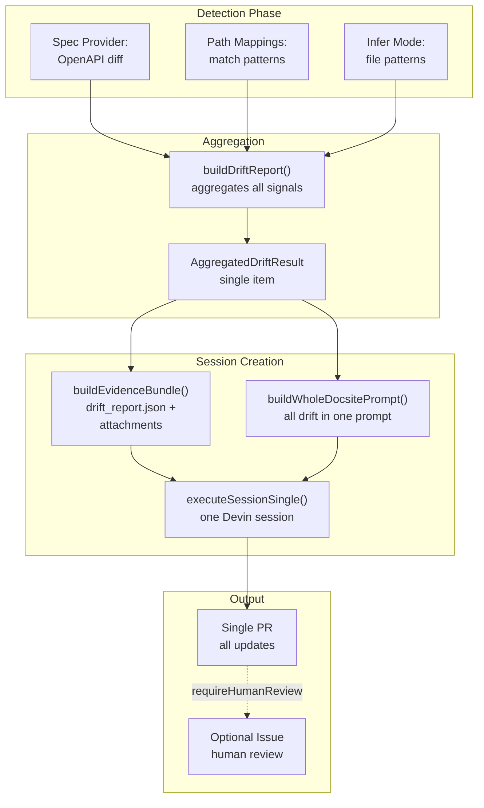
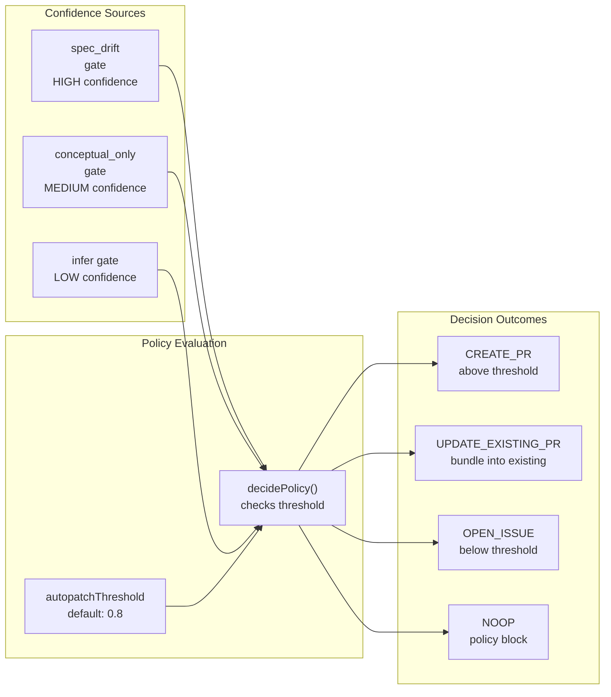
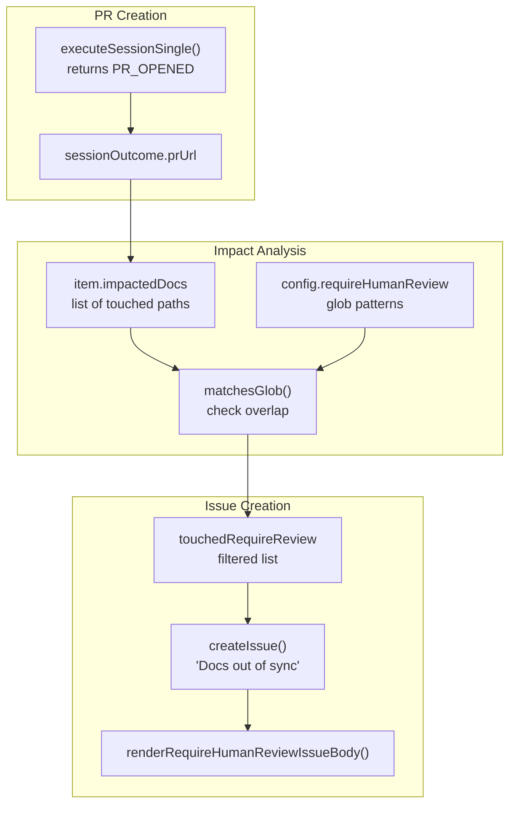
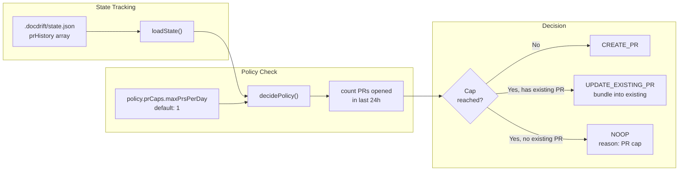
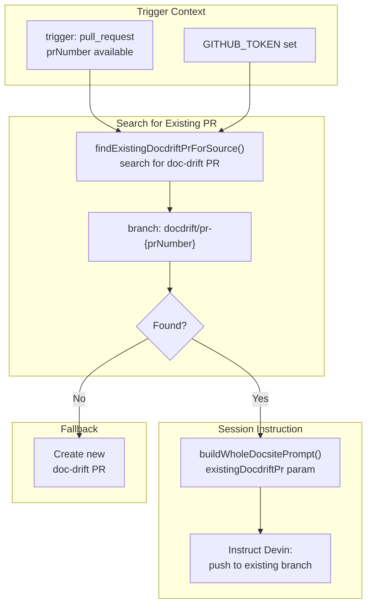
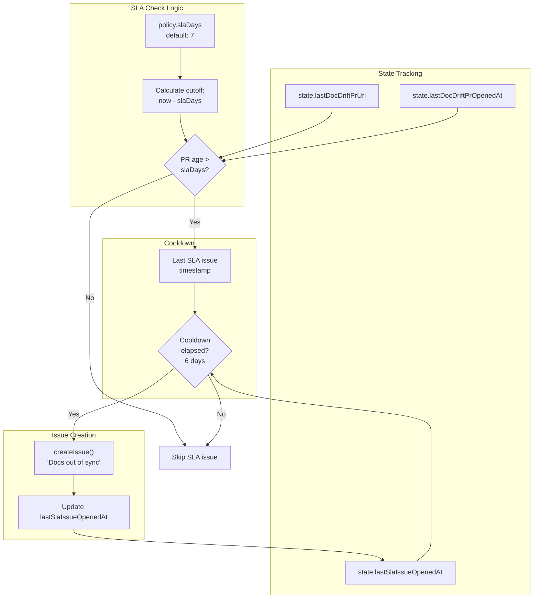

# Confidence and Noise Reduction

<details>
<summary>Relevant source files</summary>

The following files were used as context for generating this wiki page:

- [.gitignore](.gitignore)
- [README.md](README.md)
- [docdrift-yml.md](docdrift-yml.md)
- [src/index.ts](src/index.ts)

</details>


## Purpose and Scope

This document explains docdrift's low-noise design mechanisms that minimize false positives and PR proliferation. The system implements multiple layers of gating and consolidation to ensure high signal-to-noise ratio in automated documentation updates.

For the overall policy decision logic that invokes these mechanisms, see [Policy Decision Logic](#7.1). For state tracking that enables rate limiting and deduplication, see [State Management](#7.3).

---

## Design Principles

The docdrift system is architected around a **single session, single PR** model with multiple confidence gates. This contrasts with naive approaches that create separate PRs per doc file or per detected change. The core principle: consolidate all documentation updates into one coherent remediation session, and apply strict gates before invoking AI assistance.

**Key mechanisms:**

| Mechanism | Purpose | Implementation |
|-----------|---------|----------------|
| **Single session** | One Devin session per docsite | `executeSessionSingle` creates one session for aggregated drift |
| **Confidence gating** | Block low-confidence updates | `policy.confidence.autopatchThreshold` threshold check |
| **Allowlist enforcement** | Restrict file modifications | `policy.allowlist` glob matching |
| **Human review escalation** | Flag sensitive path changes | `requireHumanReview` triggers issue creation |
| **PR rate limiting** | Cap PRs per time window | `policy.prCaps.maxPrsPerDay` limit |
| **Update-in-place** | Reuse existing doc-drift PRs | `findExistingDocdriftPrForSource` deduplication |
| **SLA monitoring** | Nudge stale PRs | `slaDays` threshold with cooldown |

Sources: [README.md:93-99](), [docdrift-yml.md:84-137](), [src/index.ts:244-530]()

---

## Single Session Consolidation

### Aggregation Architecture



**Single session consolidation flow**

The system aggregates all detected drift (spec changes, path heuristics, inferred impacts) into a single `AggregatedDriftResult` structure. This is passed to `executeSessionSingle`, which creates exactly one Devin session using `buildWholeDocsitePrompt`. The prompt contains all drift evidence, eliminating the need for multiple sessions.

**Code flow:**

1. [src/index.ts:256-264]() - `buildDriftReport` aggregates drift from all sources
2. [src/index.ts:336]() - `buildEvidenceBundle` packages all evidence
3. [src/index.ts:360-372]() - `executeSessionSingle` creates one session
4. [src/index.ts:101-109]() - `buildWholeDocsitePrompt` receives aggregated drift

**Configuration:** This is the default behavior when using the simple `openapi + docsite` configuration pattern (v2 config). Legacy `docAreas` configurations (v1) could create multiple sessions, but this is discouraged.

Sources: [src/index.ts:83-169](), [src/index.ts:244-264](), [docdrift-yml.md:140-162]()

---

## Confidence Threshold Gating

### Threshold Decision Logic



**Confidence gating decision tree**

The `policy.confidence.autopatchThreshold` field (default `0.8`) controls when the system proceeds with automated updates versus escalation. The run gate implicitly sets confidence levels:

| Run Gate | Implied Confidence | Reasoning |
|----------|-------------------|-----------|
| `spec_drift` | High (≥0.8) | OpenAPI/GraphQL diff is deterministic source of truth |
| `conceptual_only` | Medium (0.5-0.8) | Path mappings are explicit hints but require human verification |
| `infer` | Low (&lt;0.5) | File pattern inference is heuristic, high false positive risk |
| `none` | N/A | No drift detected, no session created |

**Implementation:** While the system currently uses run gates to implicitly determine confidence, the `autopatchThreshold` configuration field is reserved for future enhancements where explicit confidence scoring is implemented.

**Code references:**
- [src/policy/engine.ts]() - `decidePolicy` function checks confidence and other policy constraints
- [src/index.ts:294-302]() - Policy decision invocation
- [docdrift-yml.md:93-97]() - Configuration schema for `autopatchThreshold`

Sources: [src/index.ts:294-312](), [docdrift-yml.md:93-97](), [README.md:51-52]()

---

## Allowlist Enforcement

### File Modification Restrictions

The `policy.allowlist` configuration restricts which files Devin is permitted to modify. This prevents the AI from touching unrelated files (e.g., source code, configuration files, test fixtures) and ensures documentation updates stay within intended boundaries.

**Configuration example:**

```yaml
policy:
  allowlist:
    - "docs/**"
    - "apps/docs-site/**"
    - "openapi/**"
```

**Glob matching:** The allowlist uses glob patterns matched against file paths relative to the repository root. Only files matching at least one allowlist pattern can be modified in generated PRs.

**Enforcement point:** The allowlist is embedded in the Devin prompt via `buildWholeDocsitePrompt`, instructing the AI to restrict its edits. While Devin itself performs the primary enforcement, the system also validates that modified files match the allowlist in post-processing.

**Noise reduction impact:** Without an allowlist, Devin might update unrelated files (e.g., fixing typos in source code comments, updating README.md files outside the docsite). The allowlist ensures focus on the declared documentation surface.

**Code references:**
- [docdrift-yml.md:99-103]() - Allowlist configuration schema
- [src/devin/prompts.ts]() - Prompt generation includes allowlist constraints

Sources: [docdrift-yml.md:99-103](), [docdrift-yml.md:282]()

---

## Human Review Escalation

### requireHumanReview Paths



**Human review escalation flow**

The `requireHumanReview` configuration field lists glob patterns for documentation paths that require human verification before merging. When a doc-drift PR touches any of these paths, the system automatically creates a GitHub issue to direct human attention.

**Typical use case:** Conceptual guides, authentication documentation, billing/pricing pages, and other prose-heavy content where AI-generated changes need careful review.

**Code flow:**

1. [src/index.ts:389-420]() - After PR creation, check if `impactedDocs` match `requireHumanReview` patterns
2. [src/utils/glob.ts]() - `matchesGlob` function performs pattern matching
3. [src/github/client.ts]() - `createIssue` with `renderRequireHumanReviewIssueBody` template

**Configuration example:**

```yaml
requireHumanReview:
  - "apps/docs-site/docs/guides/**"
  - "apps/docs-site/docs/security/**"
  - "apps/docs-site/docs/billing/**"
```

**Noise reduction:** This mechanism ensures that even when the system has high confidence in API reference updates, it still surfaces conceptual doc changes for human review without blocking the entire remediation flow.

**Important:** Issues are **only** created when a PR touches `requireHumanReview` paths. The system does **not** create issues for `BLOCKED` sessions or `NO_CHANGE` outcomes (those are reported in commit comments only).

Sources: [src/index.ts:403-420](), [docdrift-yml.md:145-149](), [docdrift-yml.md:287-320]()

---

## PR Rate Limiting

### Daily PR Caps



**PR rate limiting decision flow**

The `policy.prCaps.maxPrsPerDay` configuration (default `1`) limits the number of documentation PRs opened within a 24-hour window. This prevents PR flooding when multiple commits occur in rapid succession.

**State persistence:** The system tracks PR creation timestamps in `.docdrift/state.json` via the `prHistory` array. Each time `decidePolicy` is invoked, it counts how many PRs were opened in the last 24 hours.

**Bundling behavior:** When the cap is reached but an existing doc-drift PR is open, the policy returns `UPDATE_EXISTING_PR`. The system instructs Devin to push additional changes to the existing PR's branch rather than creating a new PR.

**Code references:**
- [src/policy/engine.ts]() - `decidePolicy` function checks `maxPrsPerDay` against state
- [src/index.ts:315-333]() - Handling `UPDATE_EXISTING_PR` decision
- [src/policy/state.ts]() - `loadState` and `saveState` functions manage state persistence
- [docdrift-yml.md:86-91]() - Configuration schema for `prCaps`

**Noise reduction impact:** Without rate limiting, CI workflows could open dozens of doc-drift PRs per day (one per commit). The cap ensures a maximum of one active PR, consolidating all updates.

Sources: [src/index.ts:315-333](), [docdrift-yml.md:86-91](), [src/policy/state.ts]()

---

## Update-in-Place for Pull Requests

### PR Deduplication Logic



**Update-in-place deduplication**

When docdrift runs on a pull request trigger (e.g., via the `pull_request` GitHub Actions event), it searches for an existing doc-drift PR created for that source PR. If found, Devin is instructed to push updates to the existing PR rather than opening a new one.

**Branch naming convention:** Doc-drift PRs created for source PR #123 use branch `docdrift/pr-123`. This deterministic naming allows `findExistingDocdriftPrForSource` to locate the PR efficiently.

**Code flow:**

1. [src/index.ts:340-347]() - Check if trigger is `pull_request` and search for existing PR
2. [src/github/client.ts]() - `findExistingDocdriftPrForSource` queries GitHub API
3. [src/index.ts:101-109]() - Pass `existingDocdriftPr` to `buildWholeDocsitePrompt`
4. [src/devin/prompts.ts]() - Prompt includes instructions to update existing branch

**Noise reduction impact:** Without this mechanism, every push to a source PR would create a new doc-drift PR, leading to PR proliferation. Update-in-place ensures one doc-drift PR per source PR throughout the development lifecycle.

**User experience:** When a developer opens a source PR that changes the API, docdrift creates a draft doc-drift PR. As the developer iterates on the source PR (adding commits), docdrift updates the doc-drift PR in place. Both PRs can be merged together once the feature is complete.

Sources: [src/index.ts:340-347](), [src/github/client.ts](), [README.md:93-99]()

---

## SLA Monitoring and Reminders

### Stale PR Detection



**SLA monitoring and reminder flow**

The `policy.slaDays` configuration (default `7`) triggers a reminder issue when a doc-drift PR has been open for the specified number of days without being merged. This nudges teams to review and merge documentation updates.

**Cooldown mechanism:** To avoid issue spam, the system enforces a 6-day cooldown between SLA reminder issues. This is tracked in `state.lastSlaIssueOpenedAt`.

**Code flow:**

1. [src/index.ts:498-520]() - After successful session, check if PR age exceeds `slaDays`
2. [src/index.ts:542-594]() - `runSlaCheck` command performs standalone SLA monitoring
3. [src/github/client.ts]() - `listOpenPrsWithLabel` finds stale PRs by label
4. [src/policy/state.ts]() - State persistence for SLA tracking

**Configuration:**

```yaml
policy:
  slaDays: 7        # Days before reminder
  slaLabel: docdrift  # Label to filter PRs
```

**Noise reduction:** The cooldown prevents daily nagging. The system assumes that if a reminder issue was opened recently, the team is aware and working on it.

**Standalone command:** The `docdrift sla-check` command can be run independently (e.g., on a daily cron schedule) to monitor all open doc-drift PRs.

Sources: [src/index.ts:498-520](), [src/index.ts:542-594](), [docdrift-yml.md:130-137]()

---

## Issue Creation Policy

### When Issues Are Created

The system has a strict policy about when issues are created, minimizing noise while ensuring critical attention points are surfaced.

**Issues are created ONLY in three cases:**

| Condition | Issue Title | Trigger Code |
|-----------|-------------|--------------|
| **requireHumanReview paths touched** | `[docdrift] Docs out of sync — review doc drift PR` | [src/index.ts:407-418]() |
| **Doc-drift PR open ≥ slaDays** | `[docdrift] Docs out of sync — merge doc drift PR(s)` | [src/index.ts:505-518]() |
| **DEVIN_API_KEY missing** | `[docdrift] Configuration required — set DEVIN_API_KEY` | [src/index.ts:421-442]() |

**Issues are NOT created for:**

- Devin sessions that report `status: BLOCKED` (evidence questions)
- Policy decision `OPEN_ISSUE` (reserved for future use)
- Sessions that complete with `NO_CHANGE` (no PR opened)
- Sessions that timeout or error

These non-issue outcomes are reported in commit comments only, providing observability without creating actionable issues.

**Rationale:** The system distinguishes between "needs human action" (create issue) and "informational status" (commit comment). Issues represent actionable items that require human intervention, while commit comments provide transparency into system behavior.

**Code references:**
- [src/index.ts:403-443]() - Issue creation conditions
- [docdrift-yml.md:287-320]() - Documentation of issue policy
- [src/github/client.ts]() - Issue rendering functions

Sources: [src/index.ts:403-443](), [docdrift-yml.md:287-320]()

---

## Summary: Noise Reduction Strategy

The docdrift system achieves low noise through a defense-in-depth approach:

1. **Pre-session gates:** Run gate logic prevents sessions when no meaningful drift is detected
2. **Single session consolidation:** One session per docsite eliminates per-file PR proliferation
3. **Allowlist boundaries:** Restricts modifications to declared documentation surfaces
4. **Rate limiting:** Caps PRs per time window, encouraging bundling
5. **Update-in-place:** Reuses existing doc-drift PRs for source PR iterations
6. **Selective issue creation:** Only creates issues for actionable human review needs
7. **SLA monitoring with cooldown:** Nudges stale PRs without nagging

This multi-layered approach ensures that teams receive high-signal notifications: typically one PR per day with drift evidence, optional issues for sensitive paths, and periodic SLA reminders. The system avoids the "PR storm" anti-pattern common in naive auto-documentation tools.

Sources: [README.md:93-101](), [src/index.ts:244-530](), [docdrift-yml.md:1-440]()

---