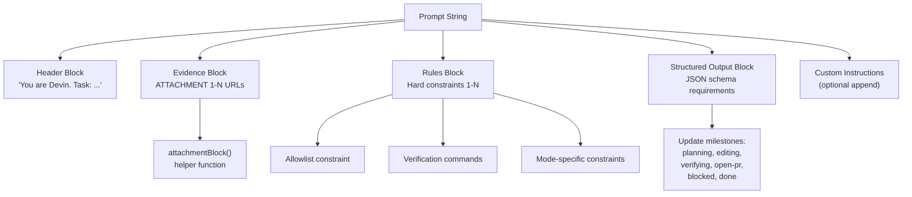
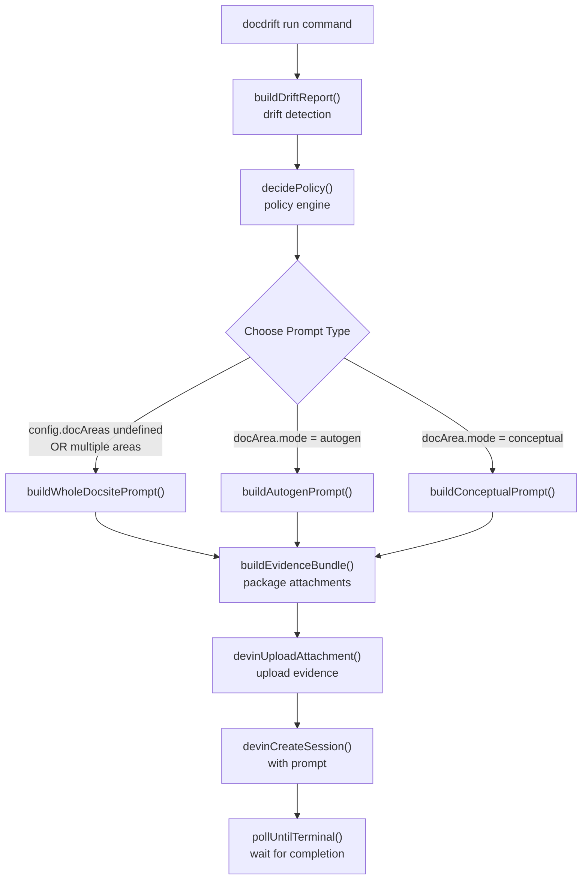
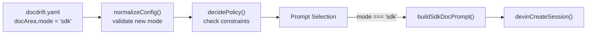
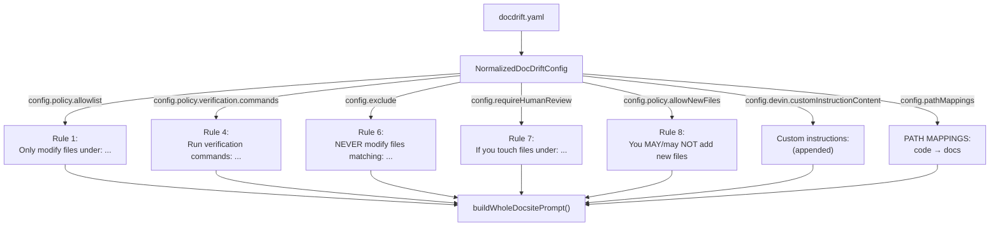

# Extending Prompt Generation

<details>
<summary>Relevant source files</summary>

The following files were used as context for generating this wiki page:

- [.github/workflows/devin-doc-drift.yml](.github/workflows/devin-doc-drift.yml)
- [src/config/validate.ts](src/config/validate.ts)
- [src/devin/prompts.ts](src/devin/prompts.ts)
- [src/github/client.ts](src/github/client.ts)

</details>


## Purpose and Scope

This document provides guidance for developers who need to modify existing Devin AI prompts or add new prompt types to docdrift. Prompt generation is the critical interface between drift detection results and Devin AI sessions—prompts translate detected changes into actionable instructions for the AI agent.

The prompt generation system is located in [src/devin/prompts.ts:1-195](). For information about how prompts are consumed by Devin sessions, see [Session Lifecycle](#8.3). For details on how drift detection feeds into prompt generation, see [Detection Pipeline](#6.1).

**Sources:** [src/devin/prompts.ts:1-195]()

---

## Prompt Types Overview

The system provides three specialized prompt builders, each optimized for different documentation scenarios:

| Prompt Type | Function | Use Case | Confidence Level |
|-------------|----------|----------|------------------|
| Whole Docsite | `buildWholeDocsitePrompt` | Comprehensive updates across API reference and guides | High (spec drift) |
| Autogen | `buildAutogenPrompt` | Focused API reference updates from spec changes | High (spec drift, single area) |
| Conceptual | `buildConceptualPrompt` | Guide/prose updates from heuristic signals | Low to Medium (path mappings) |

### Whole Docsite Prompt

The whole docsite prompt ([src/devin/prompts.ts:76-194]()) handles comprehensive documentation updates in a single session. It is invoked when:
- Multiple doc areas are impacted
- The configuration uses a unified docsite approach (no `docAreas` defined)
- A pull request trigger requires coordinated updates

This prompt includes context for the entire drift report, path mappings, run gate information, and handles special cases like updating existing PRs versus creating new ones.

### Autogen Prompt

The autogen prompt ([src/devin/prompts.ts:17-48]()) targets API reference documentation with high-confidence changes. It enforces:
- Minimal, surgical edits
- Strict adherence to allowlist paths
- Mandatory verification command execution
- Single PR per doc area

### Conceptual Prompt

The conceptual prompt ([src/devin/prompts.ts:50-73]()) handles guide and prose documentation with lower confidence signals. It emphasizes:
- Conservative changes
- Question-asking over guessing
- Issue creation when confidence is below threshold
- Explicit assumption checklists in PRs

**Sources:** [src/devin/prompts.ts:17-194]()

---

## Prompt Structure and Components

All prompts follow a consistent structure with reusable components:



**Sources:** [src/devin/prompts.ts:13-15, 17-194]()

### Attachment Block Helper

The `attachmentBlock` function ([src/devin/prompts.ts:13-15]()) formats evidence URLs consistently:

```typescript
function attachmentBlock(attachmentUrls: string[]): string {
  return attachmentUrls.map((url, index) => `- ATTACHMENT ${index + 1}: ${url}`).join("\n");
}
```

This helper is used by all three prompt types to present uploaded evidence (OpenAPI specs, changed files, drift reports) to Devin.

**Sources:** [src/devin/prompts.ts:13-15]()

### Rules Formatting Pattern

Rules follow a numbered list format with nested verification commands. Example from autogen prompt ([src/devin/prompts.ts:24-30]()):

```
Rules (hard):
1) Only modify files under: docs/api, docs/reference
2) Make the smallest change that makes docs correct.
3) Run verification commands and record results:
   - npm run lint:docs
   - npm run test:docs
4) Open ONE pull request for this doc area with a clear title.
```

The pattern emphasizes:
- **Hard constraints**: Non-negotiable rules prefixed with "hard"
- **Numbered format**: Easy scanning and reference
- **Nested items**: Sub-requirements indented under parent rules
- **Imperative voice**: Clear, actionable directives

**Sources:** [src/devin/prompts.ts:24-30, 57-61, 170-181]()

### Structured Output Requirements

All prompts include instructions for maintaining structured output ([src/devin/prompts.ts:32-41, 63-65, 183-186]()):

- Update at specific milestones (planning, editing, verifying, etc.)
- Provide status, confidence, and outcome fields
- Include verification results when applicable
- Populate `questions` array when blocked

This structured output enables programmatic parsing of session results via `parseStructured` ([see Structured Output Parsing](#8.5)).

**Sources:** [src/devin/prompts.ts:32-41, 63-65, 183-186]()

---

## Input Interfaces and Configuration

### PromptInput Interface

The `PromptInput` interface ([src/devin/prompts.ts:4-11]()) defines common parameters for autogen and conceptual prompts:

```typescript
interface PromptInput {
  item: DriftItem;                    // Single doc area's drift data
  attachmentUrls: string[];           // Uploaded evidence URLs
  verificationCommands: string[];     // Commands to validate changes
  allowlist: string[];                // Permitted file paths
  confidenceThreshold: number;        // Minimum confidence for PR creation
  customAppend?: string;              // Optional custom instructions
}
```

### Whole Docsite Prompt Input

The whole docsite prompt uses a more comprehensive input structure ([src/devin/prompts.ts:76-85]()):

```typescript
export function buildWholeDocsitePrompt(input: {
  aggregated: AggregatedDriftResult;           // All drift detection results
  config: NormalizedDocDriftConfig;            // Full normalized configuration
  attachmentUrls: string[];                    // Uploaded evidence
  runGate?: "spec_drift" | "conceptual_only" | "infer" | "none";
  trigger?: "push" | "manual" | "schedule" | "pull_request";
  prNumber?: number;                           // Source PR number if applicable
  existingDocdriftPr?: {                       // Existing PR to update
    number: number;
    url: string;
    headRef: string;
  };
}): string
```

**Sources:** [src/devin/prompts.ts:4-11, 76-85]()

### Configuration-Driven Customization

Prompts consume configuration fields to tailor instructions:

| Configuration Field | Prompt Impact | Lines |
|---------------------|---------------|-------|
| `config.exclude` | Adds "NEVER modify" rule | [src/devin/prompts.ts:86-89]() |
| `config.requireHumanReview` | Adds note about review requirements | [src/devin/prompts.ts:90-93]() |
| `config.policy.allowNewFiles` | Controls file creation permissions | [src/devin/prompts.ts:94-97]() |
| `config.devin.customInstructionContent` | Appends custom instructions | [src/devin/prompts.ts:44-46, 69-71, 190-192]() |
| `config.policy.verification.commands` | Specifies verification steps | [src/devin/prompts.ts:174-175]() |
| `config.pathMappings` | Lists code-to-doc mappings | [src/devin/prompts.ts:149-159]() |

**Sources:** [src/devin/prompts.ts:86-97, 149-192]()

---

## Prompt Selection and Invocation Flow



**Sources:** [src/devin/prompts.ts:1-195](), [src/github/client.ts:1-254]()

The selection logic is typically implemented in the run command orchestration layer. Prompt functions are pure—they take structured input and return formatted strings without side effects.

---

## Modifying Existing Prompts

### Step 1: Identify the Prompt Function

Locate the relevant prompt builder in [src/devin/prompts.ts:1-195]():
- `buildAutogenPrompt` for API reference changes
- `buildConceptualPrompt` for guide/prose changes  
- `buildWholeDocsitePrompt` for comprehensive updates

### Step 2: Understand Current Structure

Each prompt consists of:
1. **Header**: Task definition and role ([src/devin/prompts.ts:19, 52, 162]())
2. **Context blocks**: Drift summary, evidence, path mappings
3. **Rules**: Numbered hard constraints
4. **Structured output**: JSON schema milestones
5. **Custom append**: Optional configuration-driven additions

### Step 3: Modify Safely

**Adding a new rule:**
```typescript
// In buildAutogenPrompt, after existing rules
const base = [
  "You are Devin. Task: update API reference docs to match actual code/spec changes.",
  "",
  "EVIDENCE (attachments):",
  attachmentBlock(input.attachmentUrls),
  "",
  "Rules (hard):",
  `1) Only modify files under: ${input.allowlist.join(", ")}`,
  "2) Make the smallest change that makes docs correct.",
  "3) Run verification commands and record results:",
  ...input.verificationCommands.map((cmd) => `   - ${cmd}`),
  "4) Open ONE pull request for this doc area with a clear title.",
  "5) Keep a reviewer-friendly PR description: what changed, why docs were wrong, how to validate.",
  "6) NEW RULE: Always include a summary of API changes in the PR description.", // Add here
  // ...
];
```

**Modifying confidence guidance:**

In `buildConceptualPrompt` ([src/devin/prompts.ts:60]()), adjust the confidence threshold messaging:

```typescript
`3) Prefer OPEN_ISSUE when confidence < ${input.confidenceThreshold.toFixed(2)}.`,
// Could modify to:
`3) When confidence < ${input.confidenceThreshold.toFixed(2)}, open an issue with questions instead of a PR.`,
```

**Sources:** [src/devin/prompts.ts:17-73]()

### Step 4: Test Changes

After modifying a prompt:

1. **Validate config**: Run `npx tsx src/cli.ts validate` to ensure configuration compatibility
2. **Test with detect**: Run `npx tsx src/cli.ts detect --base <sha> --head <sha>` to verify drift detection
3. **Dry-run session**: Review the prompt by logging it before session creation
4. **Monitor outcome**: Check `.docdrift/run-output.json` for session results

**Sources:** [.github/workflows/devin-doc-drift.yml:52-68]()

---

## Adding New Prompt Types

### When to Add a New Prompt Type

Consider adding a new prompt type when:
- Existing prompts don't handle a new documentation paradigm (e.g., SDK documentation, CLI references)
- A new detection mechanism requires specialized instructions (e.g., database schema drift)
- Confidence levels or constraints differ significantly from autogen/conceptual patterns

### Function Signature Pattern

New prompt builders should follow the established pattern ([src/devin/prompts.ts:4-11, 76-85]()):

```typescript
export function buildNewPromptType(input: {
  // Core drift data
  item: DriftItem;
  
  // Evidence and validation
  attachmentUrls: string[];
  verificationCommands: string[];
  
  // Constraints
  allowlist: string[];
  confidenceThreshold?: number;
  
  // Configuration
  customAppend?: string;
  
  // Type-specific fields
  specialParameter?: string;
}): string {
  // Implementation
}
```

### Implementation Template

```typescript
export function buildSdkDocPrompt(input: {
  item: DriftItem;
  attachmentUrls: string[];
  verificationCommands: string[];
  allowlist: string[];
  sdkLanguage: string;
  examplePaths?: string[];
}): string {
  const base = [
    `You are Devin. Task: update ${input.sdkLanguage} SDK documentation to match API changes.`,
    "",
    "EVIDENCE (attachments):",
    attachmentBlock(input.attachmentUrls),
    "",
    "Rules (hard):",
    `1) Only modify files under: ${input.allowlist.join(", ")}`,
    `2) Update code examples to use current ${input.sdkLanguage} syntax.`,
    "3) Verify examples compile/run:",
    ...input.verificationCommands.map((cmd) => `   - ${cmd}`),
    "4) Maintain existing example structure unless API breaking changes require reorganization.",
    "",
    "Structured Output:",
    "- Update at: planning, editing, verifying, open-pr, blocked, done.",
    "",
    `Goal: Sync ${input.sdkLanguage} SDK docs with API changes from evidence.`,
  ].join("\n");
  
  return base;
}
```

**Sources:** [src/devin/prompts.ts:17-73]()

### Integration Points

After creating a new prompt function, integrate it into the run orchestration:

1. **Add to mode enum** if applicable (in configuration schema)
2. **Update prompt selection logic** in the run command handler
3. **Map configuration** to prompt input parameters
4. **Test end-to-end** with real drift scenarios



**Sources:** [src/devin/prompts.ts:1-195](), [src/config/validate.ts:1-51]()

---

## Special Cases and Advanced Patterns

### Existing PR Updates

The whole docsite prompt includes logic to update existing PRs instead of creating new ones ([src/devin/prompts.ts:126-147]()):

```typescript
const draftPrBlock = (() => {
  if (input.trigger !== "pull_request" || !input.prNumber) return "";
  if (input.existingDocdriftPr) {
    return [
      "",
      "CRITICAL: An existing doc-drift PR already exists for this API PR.",
      `You MUST UPDATE that PR — do NOT create a new one.`,
      `- Existing PR: #${input.existingDocdriftPr.number} (${input.existingDocdriftPr.url})`,
      `- Branch to update: ${input.existingDocdriftPr.headRef}`,
      "Checkout that branch, pull latest main, apply your doc changes, push. The existing PR will update.",
      "Do NOT open a new pull request.",
      "",
    ].join("\n");
  }
  // ... new PR creation instructions
})();
```

This pattern:
- Detects existing PRs via `findExistingDocdriftPrForSource` ([src/github/client.ts:228-253]())
- Injects explicit "UPDATE" instructions with branch name
- Prevents PR proliferation during iterative development

**Sources:** [src/devin/prompts.ts:126-147](), [src/github/client.ts:228-253]()

### Run Gate Context

The whole docsite prompt adapts instructions based on the run gate ([src/devin/prompts.ts:116-124]()):

```typescript
const inferBlock =
  input.runGate === "infer"
    ? [
        "INFER MODE: No API spec diff was available. These file changes may impact docs.",
        "Infer what documentation might need updates from the changed files. Update or create docs as needed.",
        "Do NOT invent APIs; only document what you can infer from the code changes.",
        "",
      ].join("\n")
    : "";
```

This conditional block:
- Activates only when `runGate === "infer"` ([see Run Gate Logic](#6.4))
- Sets different expectations for evidence completeness
- Emphasizes conservative inference over invention

**Sources:** [src/devin/prompts.ts:116-124]()

### Path Mappings Block

Path mappings provide explicit code-to-doc relationships ([src/devin/prompts.ts:149-159]()):

```typescript
const pathMappingsBlock =
  pathMappings.length > 0
    ? [
        "PATH MAPPINGS (when these code paths change, consider these docs for updates):",
        ...pathMappings.map(
          (p) => `- ${p.match} → ${p.impacts.join(", ")}`
        ),
        "",
      ].join("\n")
    : "";
```

This block transforms configuration like:
```yaml
pathMappings:
  - match: "src/api/users/**"
    impacts: ["docs/api/users.md", "docs/guides/user-management.md"]
```

Into prompt instructions:
```
PATH MAPPINGS (when these code paths change, consider these docs for updates):
- src/api/users/** → docs/api/users.md, docs/guides/user-management.md
```

**Sources:** [src/devin/prompts.ts:149-159]()

### OpenAPI Spec Instructions

When OpenAPI specs are configured, the prompt includes specialized diff instructions ([src/devin/prompts.ts:99-114]()):

```typescript
const openapiPublished = input.config.openapi?.published;
const openapiGenerated = input.config.openapi?.generated;
const specLine =
  openapiPublished && openapiGenerated
    ? `Update ${openapiPublished} to match the generated spec (${openapiGenerated}). The attachments contain the full diff.`
    : "Update published docs to match the evidence (attachments).";
```

This enables precise instructions when both published and generated spec paths are known.

**Sources:** [src/devin/prompts.ts:99-114]()

---

## Best Practices

### Clarity and Specificity

**Do:**
- Use numbered lists for rules
- Specify exact file paths when possible
- Define success criteria explicitly
- Reference attachment numbers consistently

**Don't:**
- Use vague directives like "improve documentation"
- Assume Devin knows project conventions
- Mix multiple concerns in a single rule
- Omit structured output requirements

### Maintaining Consistency

All prompts should:
1. Begin with role definition: "You are Devin. Task: ..."
2. Present evidence before rules
3. Number hard constraints
4. Include structured output instructions
5. Support optional custom append ([src/devin/prompts.ts:44-46, 69-71, 190-192]())

### Testing Prompts

**Unit testing approach:**
```typescript
import { buildAutogenPrompt } from "./prompts";

describe("buildAutogenPrompt", () => {
  it("includes all attachment URLs", () => {
    const input = {
      item: { docArea: "api-reference", /* ... */ },
      attachmentUrls: ["https://example.com/1", "https://example.com/2"],
      verificationCommands: ["npm test"],
      allowlist: ["docs/api"],
      confidenceThreshold: 0.7,
    };
    
    const prompt = buildAutogenPrompt(input);
    expect(prompt).toContain("ATTACHMENT 1: https://example.com/1");
    expect(prompt).toContain("ATTACHMENT 2: https://example.com/2");
  });
});
```

**Integration testing:**
- Run full drift detection and capture generated prompt
- Verify prompt contains expected sections for test scenario
- Check that configuration fields propagate correctly

**Sources:** [src/devin/prompts.ts:1-195]()

### Performance Considerations

Prompts are string concatenation operations—performance is rarely a concern. However:
- Avoid redundant evidence uploads (handled by evidence bundle builder)
- Keep custom instructions focused (large prompts increase token costs)
- Use conditional blocks to omit irrelevant sections ([src/devin/prompts.ts:86-97, 116-124, 126-147, 149-159]())

**Sources:** [src/devin/prompts.ts:86-159]()

---

## Prompt-Configuration Relationship



**Sources:** [src/devin/prompts.ts:76-194](), [src/config/validate.ts:1-51]()

---

## Complete Example: Adding a New Prompt Type

This example demonstrates adding a prompt type for database migration documentation.

### Step 1: Define Input Interface

```typescript
// Add to src/devin/prompts.ts
interface MigrationPromptInput {
  item: DriftItem;
  attachmentUrls: string[];
  verificationCommands: string[];
  allowlist: string[];
  migrationFiles: string[];
  schemaFiles: string[];
  customAppend?: string;
}
```

### Step 2: Implement Prompt Builder

```typescript
export function buildMigrationPrompt(input: MigrationPromptInput): string {
  const base = [
    "You are Devin. Task: document database migration changes and schema impacts.",
    "",
    "MIGRATION FILES (changed):",
    ...input.migrationFiles.map((f) => `- ${f}`),
    "",
    "SCHEMA FILES (for reference):",
    ...input.schemaFiles.map((f) => `- ${f}`),
    "",
    "EVIDENCE (attachments):",
    attachmentBlock(input.attachmentUrls),
    "",
    "Rules (hard):",
    `1) Only modify files under: ${input.allowlist.join(", ")}`,
    "2) Document schema changes: added/modified/removed tables, columns, indexes.",
    "3) Note breaking changes and migration steps required.",
    "4) Update schema diagrams if they exist in the docs.",
    "5) Run verification commands:",
    ...input.verificationCommands.map((cmd) => `   - ${cmd}`),
    "6) Open ONE pull request with migration impact summary.",
    "",
    "Structured Output:",
    "- Update at: planning (filesToEdit), editing, verifying, open-pr, done.",
    "- Include schema.changes array with table/column details.",
    "",
    "Goal: Accurately document database schema changes from migrations.",
  ].join("\n");
  
  if (input.customAppend) {
    return base + "\n\n---\n\nCustom instructions:\n\n" + input.customAppend;
  }
  return base;
}
```

### Step 3: Integrate into Configuration

Add to `docdrift.yaml` schema:
```yaml
docAreas:
  - name: database-docs
    mode: migration  # New mode
    detect:
      paths:
        - "migrations/**/*.sql"
        - "prisma/schema.prisma"
    patch:
      targets: ["docs/database"]
```

### Step 4: Wire into Run Logic

In the run command orchestration (conceptually):
```typescript
if (docArea.mode === "migration") {
  const prompt = buildMigrationPrompt({
    item: driftItem,
    attachmentUrls: evidenceUrls,
    verificationCommands: config.policy.verification.commands,
    allowlist: config.policy.allowlist,
    migrationFiles: driftItem.changedFiles.filter(f => f.endsWith(".sql")),
    schemaFiles: ["prisma/schema.prisma"], // from config
    customAppend: config.devin.customInstructionContent,
  });
  
  const sessionId = await devinCreateSession({ prompt, ...sessionConfig });
}
```

**Sources:** [src/devin/prompts.ts:1-195](), [src/config/validate.ts:1-51]()

---

## Debugging Prompt Issues

### Common Issues

**Issue: Devin creates multiple PRs instead of one**
- **Cause**: Prompt rule not explicit enough about "ONE pull request"
- **Fix**: Add "exactly ONE" or "CRITICAL: Do NOT open multiple PRs" emphasis ([src/devin/prompts.ts:29, 176]())

**Issue: Devin modifies files outside allowlist**
- **Cause**: Allowlist rule not positioned prominently
- **Fix**: Make it Rule #1, use "NEVER" for excluded paths ([src/devin/prompts.ts:25, 86-89, 171]())

**Issue: Verification commands not run**
- **Cause**: Commands not formatted as checklist
- **Fix**: Use indented list format with "record results" instruction ([src/devin/prompts.ts:27-28, 174-175]())

### Logging Prompts

To inspect generated prompts before session creation:
```typescript
const prompt = buildWholeDocsitePrompt(input);
console.log("=== GENERATED PROMPT ===");
console.log(prompt);
console.log("=== END PROMPT ===");

// Then create session
const sessionId = await devinCreateSession({ prompt, ...config });
```

### Analyzing Session Outcomes

Review `.docdrift/run-output.json` to correlate prompts with outcomes:
```json
[
  {
    "docArea": "api-reference",
    "outcome": "PR_OPENED",
    "sessionUrl": "https://api.devin.ai/sessions/abc123",
    "prUrl": "https://github.com/org/repo/pull/456"
  }
]
```

Compare session URL content (via Devin UI) with generated prompt to identify mismatches.

**Sources:** [.github/workflows/devin-doc-drift.yml:70-76]()

---

## Related Systems

The prompt generation system interfaces with:

- **Evidence Bundle Builder** ([#8.2](#8.2)): Packages attachments that prompts reference
- **Devin Client API** ([#8.1](#8.1)): Consumes prompts in session creation
- **Policy Engine** ([#7](#7)): Determines which prompt type to use
- **Configuration System** ([#4](#4)): Provides fields that customize prompts

Understanding these systems is essential for comprehensive prompt modifications.

**Sources:** [src/devin/prompts.ts:1-195](), [src/github/client.ts:1-254]()