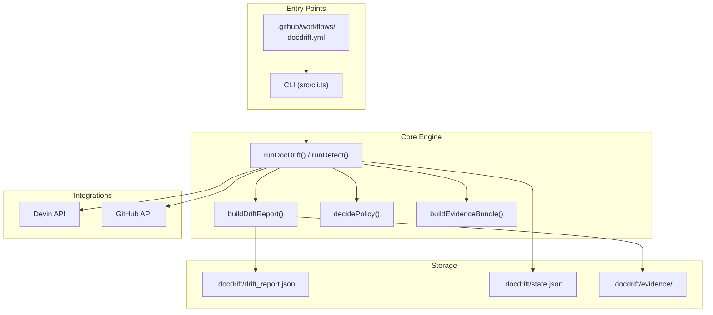

# Architecture

This document describes the internal architecture of docdrift: layers, detection flow, run gates, and orchestration. For terminology and concepts, see [Key Concepts](#1.2). For configuration, see [docdrift.yaml](../../docdrift-yml.md).

---

## System Layers

Docdrift is organized into four layers: **Entry Points**, **Core Engine**, **Integrations**, and **Storage**.

**Entry points:** CLI (`docdrift validate|detect|run|setup|baseline set|…`) or GitHub Actions workflows. **Core:** Detection builds a drift report; run gate decides whether to proceed; policy engine enforces caps and confidence; evidence builder packages attachments for Devin. **Integrations:** Devin API (sessions) and GitHub API (issues, comments, PR lookup). **Storage:** `.docdrift/` for reports, state, evidence.

---

## Detection and Run Gate

Detection runs in `buildDriftReport()` ([src/detect/index.ts]()):

1. **Spec providers** — Run in parallel (OpenAPI, GraphQL, etc.). Each compares current spec (export or local) vs published. Validation can flag incomplete exports.
2. **Baseline comparison** — If `lastKnownBaseline` is set, compare current export to published spec at that commit. Diff → baseline drift.
3. **Path heuristics** — When `docAreas[].detect.paths` or `pathMappings` are configured, match changed files and surface impacted docs.
4. **Run gate** — Decide whether to proceed or exit early.

### Run Gate Logic

| Gate | When | Effect |
|------|------|--------|
| `spec_export_invalid` | Export failed validation (e.g. missing requestBody) | Proceed; Devin fixes spec first |
| `spec_drift` | Generated ≠ published spec | Proceed |
| `baseline_drift` | Current export ≠ spec at `lastKnownBaseline` | Proceed |
| `baseline_missing` | No `lastKnownBaseline` and no other drift | Proceed (assume drift) |
| `conceptual_only` | Path heuristics match, no spec drift (auto mode) | Proceed |
| `infer` | Path mappings match, no spec (auto mode) | Proceed |
| `none` | No conditions met | Exit early; no session |

**Mode:** In `strict` mode only spec-related gates apply. In `auto` mode, heuristic and infer gates also apply.

---

## Policy Engine

The policy engine (`decidePolicy()` in [src/policy/engine.ts]()) enforces low-noise guarantees:

- **Idempotency** — Same repo/base/head/action already processed → `NOOP`
- **Confidence gating** — Signal confidence &lt; threshold → `OPEN_ISSUE` (no Devin PR)
- **PR caps** — Daily PR limit reached → escalate to issue or bundle into existing PR
- **Allowlist** — Only files matching `policy.allowlist` may be edited
- **Branch strategy** — `single`: one branch, update existing PR when present; `per-pr`: one branch per source PR

---

## State

State in `.docdrift/state.json` ([src/policy/state.ts](), [src/model/state.ts]()) tracks:

| Field | Purpose |
|-------|---------|
| `idempotency` | Map of action keys → records (prevents duplicates) |
| `dailyPrCount` | PRs opened per day (for caps) |
| `areaDailyPrOpened` | Per-doc-area PR opened today (for bundling) |
| `areaLatestPr` | Latest PR URL per area |
| `lastDocDriftPrUrl` | For SLA check |
| `lastSlaIssueOpenedAt` | SLA issue cooldown |

---

## Orchestration Flow

`runDocDrift()` ([src/index.ts]()):

1. Load config, validate
2. Build drift report
3. **Gate check:** If `runGate === "none"` or no items → exit
4. Load state, call `decidePolicy()` for the (single) item
5. Build evidence bundle, upload attachments
6. Create Devin session, poll to completion
7. Parse outcome (PR URL, blocked, etc.)
8. Apply decision to state, save, write metrics

**Single session:** One Devin session for the whole docsite; one PR per run (or update existing).

---

## Output Artifacts

| Path | Generated by | Purpose |
|------|--------------|---------|
| `.docdrift/drift_report.json` | detect, run | Drift findings, run gate |
| `.docdrift/state.json` | run | Persisted state |
| `.docdrift/metrics.json` | run | Timing, counts |
| `.docdrift/run-output.json` | run | Session outcomes |
| `.docdrift/evidence/{runId}/` | run | Changeset, spec diffs, attachments |

---

## CLI Commands

| Command | Purpose |
|---------|---------|
| `validate` | Check docdrift.yaml |
| `detect` | Detect drift only |
| `run` | Full run (detect + Devin session) |
| `baseline set [SHA]` | Update lastKnownBaseline |
| `setup` / `generate-yaml` | Generate config |
| `sla-check` | Reminder for stale PRs |
| `status` | Recent run status |
