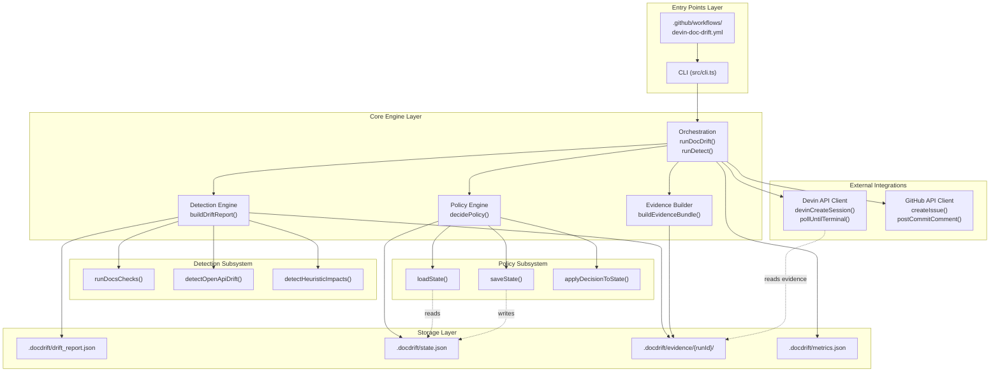
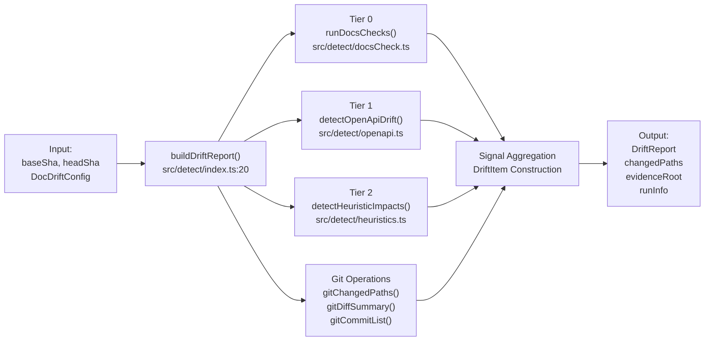
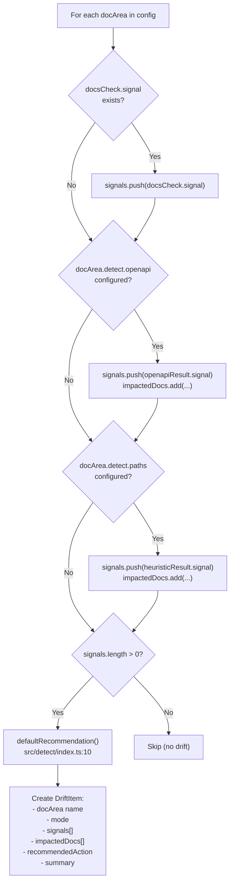
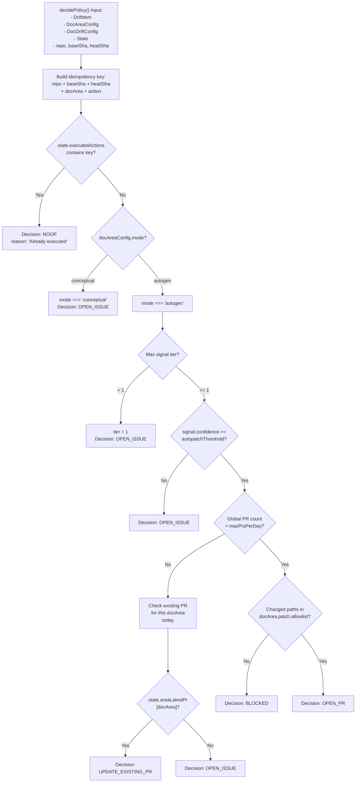
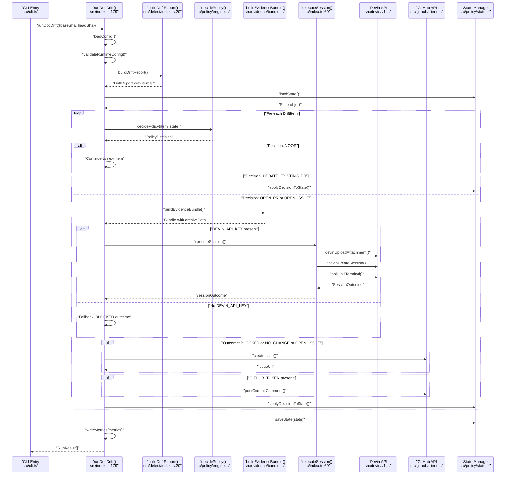
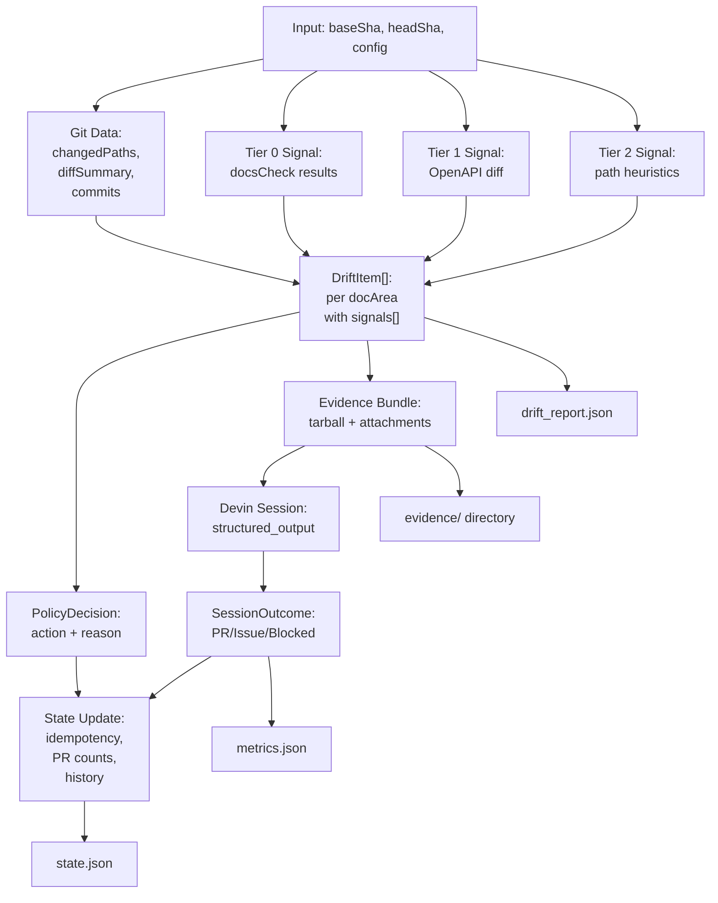

# Architecture

<details>
<summary>Relevant source files</summary>

The following files were used as context for generating this wiki page:

- [.gitignore](.gitignore)
- [README.md](README.md)
- [docdrift-yml.md](docdrift-yml.md)
- [src/cli.ts](src/cli.ts)
- [src/devin/v1.ts](src/devin/v1.ts)
- [src/index.ts](src/index.ts)

</details>


This document details the internal architecture of DocDrift, including the layered system design, detection engine components, policy enforcement mechanisms, external service integrations, and orchestration flow. This covers the technical implementation and code structure of the system's core components.

For information about conceptual terminology (drift, signals, confidence), see [Key Concepts](#1.2). For configuration structure, see [Configuration Reference](#9).

---

## System Layers

DocDrift is organized into four primary layers: **Entry Points**, **Core Engine**, **External Integrations**, and **Storage**.



**Sources**: [src/index.ts:1-446](), [src/detect/index.ts:1-116](), [src/cli.ts](), [.github/workflows/devin-doc-drift.yml]()

---

## Detection Engine Architecture

The detection engine is implemented by `buildDriftReport()` at [src/detect/index.ts:20-115]() and orchestrates three tiers of drift detection.

### Detection Flow Mapping



**Sources**: [src/detect/index.ts:20-115](), [src/detect/docsCheck.ts](), [src/detect/openapi.ts](), [src/detect/heuristics.ts]()

### Tier Implementation Details

Each detection tier produces a signal with tier level and confidence score:

| Tier | Function | Detection Method | Output |
|------|----------|------------------|--------|
| **Tier 0** | `runDocsChecks()` | Executes `config.policy.verification.commands` (e.g., `npm run docs:check`) | `{ tier: 0, confidence, type, description }` |
| **Tier 1** | `detectOpenApiDrift()` | Compares generated vs published OpenAPI specs | `{ tier: 1, confidence, type, description }`, impacted docs |
| **Tier 2** | `detectHeuristicImpacts()` | Matches code paths to doc areas via `docArea.detect.paths` | `{ tier: 2, confidence, type, description }`, impacted docs |

Detection results are aggregated per doc area at [src/detect/index.ts:54-94]():



The `defaultRecommendation()` function at [src/detect/index.ts:10-18]() provides initial policy guidance:
- **autogen mode**: `OPEN_PR` if any signal has `tier <= 1`, otherwise `OPEN_ISSUE`
- **conceptual mode**: always `OPEN_ISSUE`

**Sources**: [src/detect/index.ts:10-94](), [README.md:23-31]()

---

## Policy Engine Architecture

The policy engine, implemented primarily in [src/policy/engine.ts]() and invoked at [src/index.ts:221-229](), enforces noise reduction through multi-stage gating.

### Policy Decision Function Mapping



**Sources**: [src/policy/engine.ts](), [src/index.ts:221-229](), [README.md:16-21]()

### State Management

The state system maintains persistence across runs at [src/policy/state.ts]():

| Field | Type | Purpose |
|-------|------|---------|
| `executedActions` | `Set<string>` | Idempotency keys to prevent duplicate actions |
| `globalPrCount` | `number` | Total PRs opened today for cap enforcement |
| `lastResetDate` | `string` | ISO date for daily reset logic |
| `areaLatestPr` | `Record<string, string>` | Most recent PR URL per doc area for bundling |
| `history` | `Array` | Audit trail of all decisions |

State updates occur via `applyDecisionToState()` at [src/index.ts:256-263]() and [src/index.ts:356-362](), which:
1. Adds the idempotency key to `executedActions`
2. Increments `globalPrCount` if action is `OPEN_PR`
3. Updates `areaLatestPr[docArea]` with PR/issue URL
4. Appends to `history` with timestamp

State is persisted to `.docdrift/state.json` via `saveState()` at [src/index.ts:365]().

**Sources**: [src/policy/state.ts](), [src/index.ts:200-365]()

---

## Orchestration Flow

The primary orchestration function `runDocDrift()` at [src/index.ts:179-377]() implements the end-to-end workflow.

### Main Execution Sequence



**Sources**: [src/index.ts:179-377](), [src/cli.ts]()

### Session Execution Details

The `executeSession()` function at [src/index.ts:69-157]() handles Devin integration:

1. **Attachment Upload** ([src/index.ts:76-80]()): Calls `devinUploadAttachment()` for each evidence file
2. **Prompt Construction** ([src/index.ts:82-97]()): 
   - `buildAutogenPrompt()` for autogen mode
   - `buildConceptualPrompt()` for conceptual mode
3. **Session Creation** ([src/index.ts:99-113]()): Calls `devinCreateSession()` with:
   - Prompt text
   - Configuration (`unlisted`, `max_acu_limit`, `tags`)
   - Attachment URLs
   - `structured_output.schema = PatchPlanSchema`
   - Metadata (repository, docArea, mode)
4. **Polling** ([src/index.ts:115]()): `pollUntilTerminal()` waits for completion
5. **Outcome Parsing** ([src/index.ts:116-156]()): 
   - Extracts `structured_output` via `parseStructured()`
   - Infers PR URL via `inferPrUrl()`
   - Infers questions via `inferQuestions()`
   - Constructs `SessionOutcome` object

**Sources**: [src/index.ts:69-157](), [src/devin/v1.ts](), [src/devin/prompts.ts](), [src/devin/schemas.ts]()

---

## External Integration Points

### Devin API Client

The Devin API client at [src/devin/v1.ts]() provides three primary operations:

| Function | HTTP Method | Purpose | Returns |
|----------|-------------|---------|---------|
| `devinUploadAttachment()` | `POST /attachments` | Upload evidence tarball or files | Attachment URL |
| `devinCreateSession()` | `POST /sessions` | Create Devin session with prompt and structured output schema | Session object with `session_id`, `url` |
| `pollUntilTerminal()` | `GET /sessions/:id` | Poll every 5s until `status_enum` is terminal | Final session object |
| `devinListSessions()` | `GET /sessions` | Query recent sessions by tag | Array of session objects |

The structured output schema `PatchPlanSchema` at [src/devin/schemas.ts]() defines the expected response format:

```typescript
{
  status: "PR_OPENED" | "BLOCKED" | "NO_CHANGE",
  summary: string,
  pr?: { url: string },
  blocked?: { reason: string, questions: string[] },
  verification: { commands: string[], results: string[] }
}
```

**Sources**: [src/devin/v1.ts](), [src/devin/schemas.ts](), [src/index.ts:41-67]()

### GitHub API Client

The GitHub API client at [src/github/client.ts]() provides:

| Function | API Endpoint | Purpose |
|----------|--------------|---------|
| `createIssue()` | `POST /repos/:owner/:repo/issues` | Open drift escalation issue with questions |
| `postCommitComment()` | `POST /repos/:owner/:repo/commits/:sha/comments` | Surface run results on commit |
| `renderBlockedIssueBody()` | N/A (template function) | Format issue body with evidence summary and questions |
| `renderRunComment()` | N/A (template function) | Format commit comment with decision, outcome, links |

All GitHub operations require `GITHUB_TOKEN` environment variable and check for its presence at [src/index.ts:187]().

**Sources**: [src/github/client.ts](), [src/index.ts:296-354]()

---

## Artifact Generation and Storage

DocDrift generates structured artifacts under `.docdrift/` in the consuming repository.

### Directory Structure

```
.docdrift/
├── drift_report.json          # Detection results
├── state.json                 # Persistent state for caps/idempotency
├── metrics.json               # Performance metrics (after run)
└── evidence/
    └── {runId}/               # Unique per run
        ├── changeset.json     # Git diff summary
        └── {docArea}/         # Per doc area
            ├── evidence/      # Detection evidence files
            ├── impacted_docs/ # Copies of affected doc files
            ├── manifest.json  # Bundle metadata
            └── {docArea}.tar.gz # Compressed archive
```

### Artifact Locations in Code

| Artifact | Written By | File Path Reference |
|----------|-----------|---------------------|
| `drift_report.json` | [src/detect/index.ts:107]() | `.docdrift/drift_report.json` |
| `changeset.json` | [src/detect/index.ts:108-112]() | `.docdrift/evidence/{runId}/changeset.json` |
| `state.json` | [src/index.ts:365]() | `.docdrift/state.json` (via `STATE_PATH` at [src/index.ts:445]()) |
| `metrics.json` | [src/index.ts:370]() | `.docdrift/metrics.json` (via `writeMetrics()`) |
| Evidence bundles | [src/evidence/bundle.ts]() | `.docdrift/evidence/{runId}/{docArea}/` |

### Evidence Bundle Construction

The `buildEvidenceBundle()` function at [src/evidence/bundle.ts]() creates:

1. **Evidence directory** at `.docdrift/evidence/{runId}/{docArea}/evidence/`
2. **Impacted docs directory** at `.docdrift/evidence/{runId}/{docArea}/impacted_docs/`
3. **Manifest** at `.docdrift/evidence/{runId}/{docArea}/manifest.json` containing:
   - `runInfo` metadata
   - `driftItem` details
   - `files` list with paths and descriptions
4. **Tarball** at `.docdrift/evidence/{runId}/{docArea}/{docArea}.tar.gz` containing all above

The tarball is uploaded to Devin as a single attachment at [src/index.ts:76-80]().

**Sources**: [src/evidence/bundle.ts:30-97](), [src/index.ts:266-267](), [README.md:28-42]()

---

## Configuration Loading and Validation

Configuration flows through multiple stages before execution:

```mermaid
graph LR
    YAMLFile["docdrift.yaml<br/>in repo root"]
    
    LoadConfig["loadConfig()<br/>src/config/load.ts"]
    
    ParseYAML["Parse YAML<br/>Load schema types"]
    
    StaticValidation["Schema Validation<br/>DocDriftConfigSchema"]
    
    RuntimeValidation["validateRuntimeConfig()<br/>src/config/validate.ts"]
    
    CommandChecks["Check command availability<br/>e.g. npm, git"]
    
    Orchestration["Orchestration Layer<br/>runDocDrift(), runDetect()"]
    
    YAMLFile --> LoadConfig
    LoadConfig --> ParseYAML
    ParseYAML --> StaticValidation
    StaticValidation --> RuntimeValidation
    RuntimeValidation --> CommandChecks
    CommandChecks --> Orchestration
```



The `loadConfig()` function at [src/config/load.ts]() searches for `docdrift.yaml` in the current working directory (the consuming repository). Validation occurs at:
- **Static**: [src/config/schema.ts]() defines TypeScript types and Zod schemas
- **Runtime**: [src/config/validate.ts]() checks command availability and path validity

Both `runDocDrift()` and `runDetect()` perform validation at [src/index.ts:161-164]() and [src/index.ts:181-184](), throwing if any errors exist.

**Sources**: [src/config/load.ts](), [src/config/validate.ts](), [src/config/schema.ts](), [src/index.ts:160-184]()

---

## Data Flow Summary

The following diagram maps the complete data flow from input to output artifacts:



**Sources**: [src/index.ts:179-377](), [src/detect/index.ts:20-115](), [src/evidence/bundle.ts]()

---