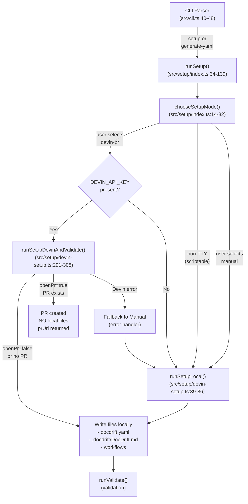
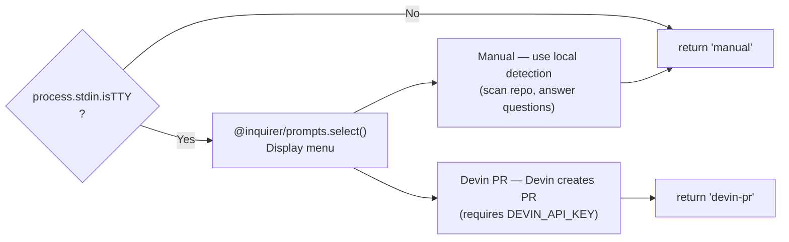
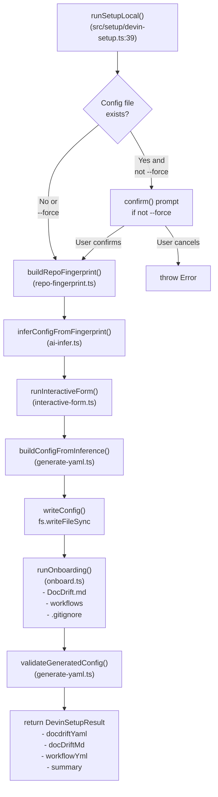
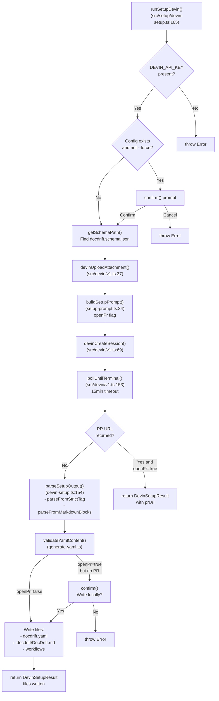
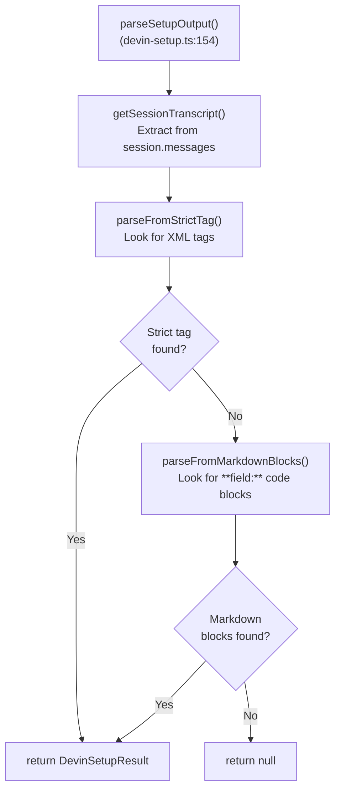
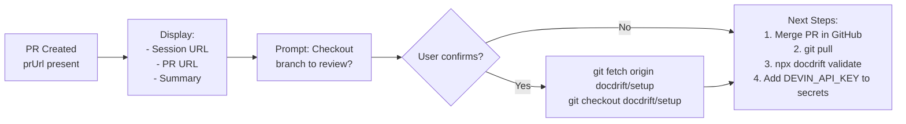
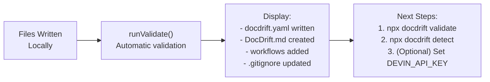

# setup and generate-yaml

<details>
<summary>Relevant source files</summary>

The following files were used as context for generating this wiki page:

- [docs/guides/setup.md](docs/guides/setup.md)
- [src/cli.ts](src/cli.ts)
- [src/devin/v1.ts](src/devin/v1.ts)
- [src/setup/devin-setup.ts](src/setup/devin-setup.ts)
- [src/setup/index.ts](src/setup/index.ts)
- [src/setup/setup-prompt.ts](src/setup/setup-prompt.ts)
- [test/setup-devin-pr.test.ts](test/setup-devin-pr.test.ts)

</details>


This page documents the `setup` and `generate-yaml` CLI commands used to create the `docdrift.yaml` configuration file and associated setup artifacts. These commands provide two operational paths: interactive setup with mode selection, and scriptable generation for CI/automation environments.

For information about the underlying setup system architecture, including repository fingerprinting and AI inference, see [Setup System](#5). For a step-by-step guide on running setup for the first time, see [Initial Setup](#2.2). For detailed configuration schema information, see [Configuration System](#4).

## Command Syntax

Both commands accept the same options and share the same underlying implementation via `runSetup()`:

```bash
# Interactive setup with mode selection
npx @devinnn/docdrift setup [--output <path>] [--force] [--open-pr]

# Scriptable generation (same as setup, but clearer intent)
npx @devinnn/docdrift generate-yaml [--output <path>] [--force] [--open-pr]
```

**Command Options:**

| Option | Type | Default | Description |
|--------|------|---------|-------------|
| `--output <path>` | string | `docdrift.yaml` | Output path for configuration file |
| `--force` | boolean | `false` | Overwrite existing file without prompting |
| `--open-pr` | boolean | `false` | When using Devin PR mode, create branch, commit, and open PR |

Sources: [src/cli.ts:40-48](), [src/setup/index.ts:5-11]()

## Setup Flow Entry Point

Both commands invoke the same `runSetup()` function, which orchestrates the mode selection and delegates to the appropriate implementation path.



**Mode Selection Logic:**

1. In TTY environments (interactive terminal), user is prompted to choose between Manual and Devin PR modes
2. In non-TTY environments (CI/scripts), defaults to Manual mode
3. If Devin PR mode is selected but `DEVIN_API_KEY` is not set, falls back to Manual mode with a warning
4. If Devin PR mode encounters an error, falls back to Manual mode with error message

Sources: [src/setup/index.ts:34-71](), [src/setup/index.ts:14-32]()

## Mode Selection Interface

When running in an interactive terminal (`stdin.isTTY`), the `chooseSetupMode()` function presents a menu using `@inquirer/prompts`:



Sources: [src/setup/index.ts:14-32]()

## Manual Mode Implementation

The `runSetupLocal()` function performs local configuration generation without invoking Devin. This path is deterministic and does not require external API keys.

### Manual Mode Pipeline



**Key Functions:**

- `buildRepoFingerprint()`: Scans repository structure, detects frameworks, finds OpenAPI specs (see [Repository Fingerprinting](#5.4))
- `inferConfigFromFingerprint()`: Uses AI or heuristics to infer configuration (see [AI Inference and Heuristics](#5.5))
- `runInteractiveForm()`: Prompts user to confirm/adjust inferred values (see [Manual Setup Flow](#5.2))
- `buildConfigFromInference()`: Constructs final `DocDriftConfig` object
- `writeConfig()`: Serializes to YAML and writes to disk
- `runOnboarding()`: Creates optional files (DocDrift.md, workflows) based on user choices
- `validateGeneratedConfig()`: Runs validation to ensure correctness

Sources: [src/setup/devin-setup.ts:39-86]()

## Devin PR Mode Implementation

The `runSetupDevin()` function delegates setup to a Devin AI session, which analyzes the repository and generates the configuration. When `openPr` is true, Devin creates a branch, commits files, and opens a PR. **No files are written locally until the user merges the PR.**

### Devin PR Mode Pipeline



**Devin Session Configuration:**

The session is created with specific parameters to constrain resource usage and ensure proper tagging:

```typescript
// From src/setup/devin-setup.ts:198-205
{
  prompt: buildSetupPrompt([attachmentUrl], { openPr: options.openPr }),
  unlisted: true,
  max_acu_limit: 2,
  tags: ["docdrift", "setup"],
  attachments: [attachmentUrl],
  metadata: { purpose: "docdrift-setup" }
}
```

Sources: [src/setup/devin-setup.ts:165-289](), [src/devin/v1.ts:37-67](), [src/devin/v1.ts:69-85](), [src/devin/v1.ts:153-180]()

## Devin Setup Prompt Structure

The `buildSetupPrompt()` function constructs a structured prompt that instructs Devin on:

1. **Schema attachment**: The `docdrift.schema.json` file is uploaded as an attachment for validation
2. **Configuration requirements**: Version 2, docsite path, spec providers detection, policy settings
3. **File creation**: `docdrift.yaml`, `.docdrift/DocDrift.md`, `.github/workflows/docdrift.yml`
4. **Output format**: Strict XML-tagged JSON block for reliable parsing

### Strict Output Format

Devin must emit output in this format for reliable parsing:

```xml
<docdrift_setup_output>
{"docdriftYaml":"# yaml...","docDriftMd":"# content...","workflowYml":"name: docdrift...","summary":"OpenAPI at..."}
</docdrift_setup_output>
```

The tag name is defined as a constant: `DOCDRIFT_SETUP_OUTPUT_TAG = "docdrift_setup_output"` [src/setup/setup-prompt.ts:8]().

**Prompt Sections:**

| Section | Purpose |
|---------|---------|
| Attachments block | Lists uploaded schema files |
| Requirements for docdrift.yaml | Version 2, docsite, specProviders, devin settings, policy |
| Requirements for DocDrift.md | Custom instructions, tone guidance |
| Requirements for workflow | GitHub Actions YAML with proper package name |
| PR creation block | Only included when `openPr=true` - branch, commit, push instructions |
| Strict output block | Required format for parsing |

Sources: [src/setup/setup-prompt.ts:34-98]()

## Output Parsing and Fallbacks

The `parseSetupOutput()` function implements a two-tier parsing strategy to extract configuration from the Devin session:



**Parsing Methods:**

1. **Strict Tag Parsing** [src/setup/devin-setup.ts:111-133](): Searches for `<docdrift_setup_output>...</docdrift_setup_output>` and extracts JSON
2. **Markdown Block Parsing** [src/setup/devin-setup.ts:136-151](): Fallback that looks for `**docdriftYaml:**` followed by code fences

**Session Transcript Extraction:**

The `getSessionTranscript()` function [src/setup/devin-setup.ts:89-108]() aggregates text from multiple possible locations in the session object:
- `session.output`, `session.result`, `session.transcript` (top-level fields)
- `session.messages[].content`, `session.messages[].text`, `session.messages[].message` (message array)
- `session.data.messages` (nested data object)

Sources: [src/setup/devin-setup.ts:89-163]()

## Output Files and Results

### DevinSetupResult Structure

Both `runSetupLocal()` and `runSetupDevin()` return a `DevinSetupResult` object:

```typescript
// From src/setup/devin-setup.ts:28-36
interface DevinSetupResult {
  docdriftYaml: string;        // Required: YAML content
  docDriftMd?: string;          // Optional: DocDrift.md content
  workflowYml?: string;         // Optional: GitHub workflow YAML
  summary: string;              // Required: Human-readable summary
  sessionUrl: string;           // Devin session URL (empty for manual)
  prUrl?: string;               // PR URL when openPr was used
}
```

### Files Written to Disk

**When Local Files Are Written:**

Manual mode always writes files locally. Devin PR mode writes files locally only when:
- `openPr=false` (no PR was requested), OR
- `openPr=true` but no PR URL was returned, AND user confirms to write locally

**File Paths:**

| File | Path | Created By | Description |
|------|------|------------|-------------|
| Config | `docdrift.yaml` (or `--output` path) | Both modes | Main configuration file |
| Instructions | `.docdrift/DocDrift.md` | Both modes (optional) | Custom instructions for Devin |
| Workflow | `.github/workflows/docdrift.yml` | Both modes (optional) | GitHub Actions workflow |
| SLA Workflow | `.github/workflows/docdrift-sla-check.yml` | `addSlaCheckWorkflow()` | Daily cron for stale PR checks |
| Gitignore | `.gitignore` | `ensureGitignore()` | Ensures `.docdrift/` exclusions |

Sources: [src/setup/devin-setup.ts:28-36](), [src/setup/devin-setup.ts:265-282]()

## Completion Flow and Next Steps

After setup completes, the CLI displays different next steps based on whether a PR was created or files were written locally:

### PR Creation Path



Sources: [src/setup/index.ts:73-103]()

### Local Files Path



Sources: [src/setup/index.ts:106-138]()

## Error Handling and Fallbacks

### DEVIN_API_KEY Not Set

When Devin PR mode is selected but `DEVIN_API_KEY` is not set:

```typescript
// From src/setup/index.ts:44-47
if (mode === "devin-pr" && !hasDevinKey) {
  console.log("\nDEVIN_API_KEY is not set. Using manual setup instead.\n");
  result = await runSetupLocal({ ... });
}
```

### Devin Session Failure

When Devin PR mode encounters an error during session creation or polling:

```typescript
// From src/setup/index.ts:54-70
try {
  result = await runSetupDevinAndValidate({ ... });
} catch (err) {
  console.error("\nDevin setup failed:", err.message);
  console.log("\nFalling back to local detection (repo fingerprint + heuristic)…\n");
  usedLocalFallback = true;
  result = await runSetupLocal({ ... });
}
```

### Config Already Exists

Both modes check for existing config and prompt for confirmation unless `--force` is provided:

```typescript
// From src/setup/devin-setup.ts:46-57 (manual)
// From src/setup/devin-setup.ts:179-189 (Devin)
if (configExists && !options.force) {
  const overwrite = await confirm({
    message: "docdrift.yaml already exists. Overwrite?",
    default: false,
  });
  if (!overwrite) {
    throw new Error("Setup cancelled.");
  }
}
```

### Validation Failures

After generating config, both paths validate the result:

```typescript
// From src/setup/devin-setup.ts:74-77 (manual)
// From src/setup/devin-setup.ts:283-286 (Devin)
const validation = validateGeneratedConfig(outputPath);
if (!validation.ok) {
  throw new Error("Generated config failed validation:\n" + validation.errors.join("\n"));
}
```

Sources: [src/setup/index.ts:44-71](), [src/setup/devin-setup.ts:46-57](), [src/setup/devin-setup.ts:179-189](), [src/setup/devin-setup.ts:283-286]()

## Command-Line Examples

### Interactive Setup

```bash
# Run interactive setup - choose Manual or Devin PR
npx @devinnn/docdrift setup

# Same as above, but explicit command name
npx @devinnn/docdrift generate-yaml
```

### Scriptable Manual Setup

```bash
# Non-interactive environment defaults to manual
npx @devinnn/docdrift setup --force

# Custom output path
npx @devinnn/docdrift generate-yaml --output config/docdrift.yaml --force
```

### Devin PR Setup

```bash
# Requires DEVIN_API_KEY environment variable
export DEVIN_API_KEY=your-key-here
npx @devinnn/docdrift setup --open-pr

# Overwrite existing config and create PR
npx @devinnn/docdrift generate-yaml --open-pr --force
```

### CI/Automation Usage

```bash
# In GitHub Actions or CI environment (non-TTY)
# Will use manual mode without prompting
DEVIN_API_KEY="${{ secrets.DEVIN_API_KEY }}" \
  npx @devinnn/docdrift generate-yaml --force
```

Sources: [src/cli.ts:40-48](), [docs/guides/setup.md:28-38]()

---