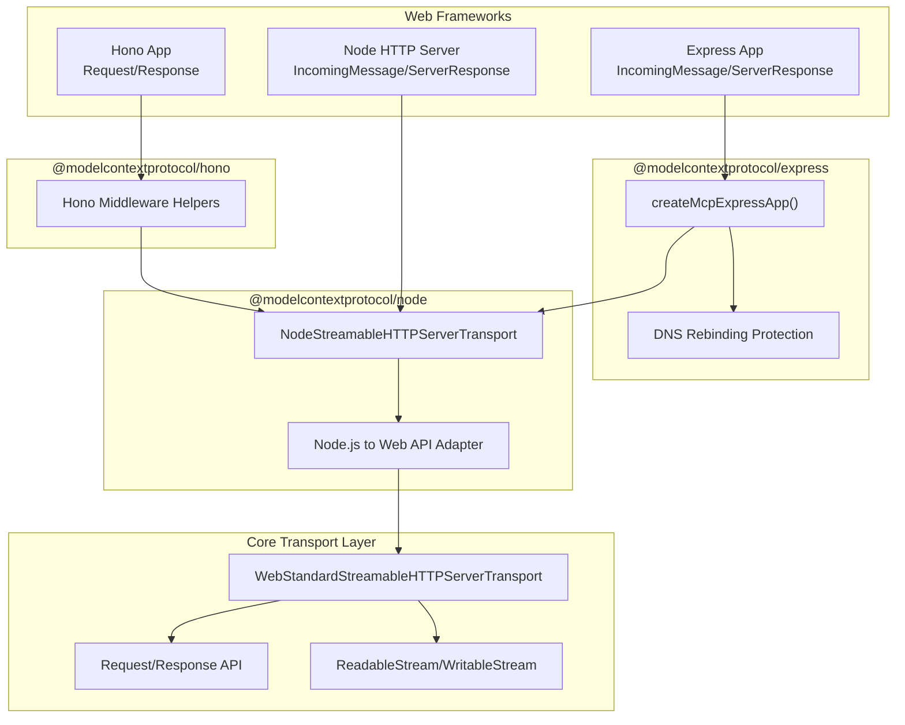
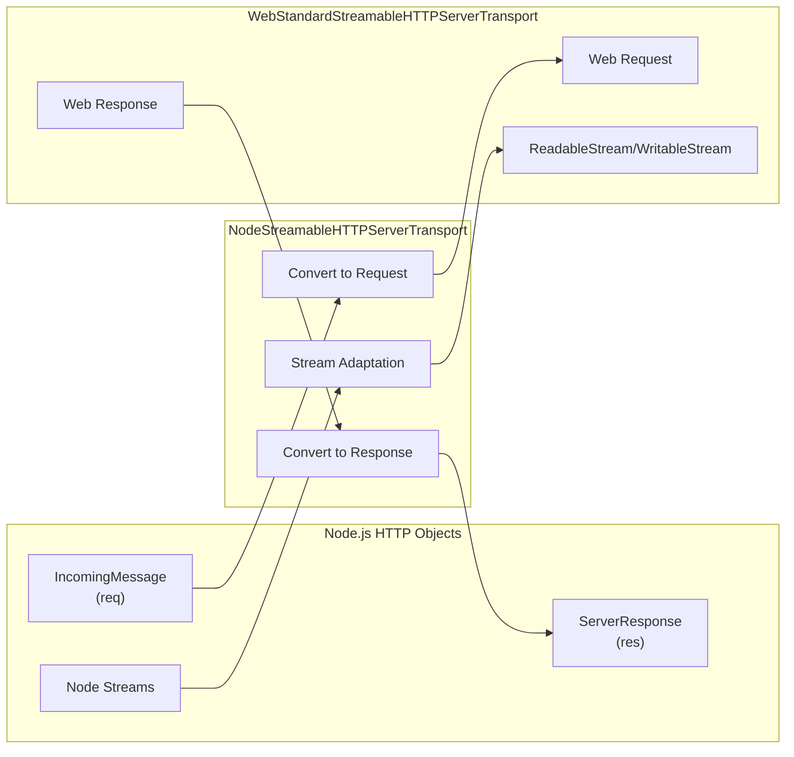
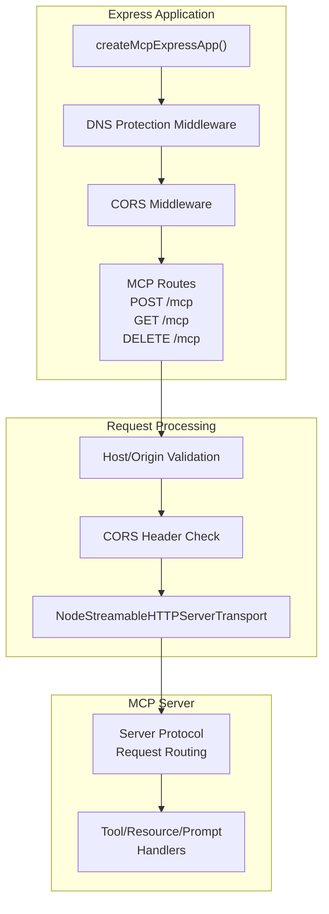
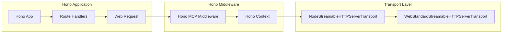
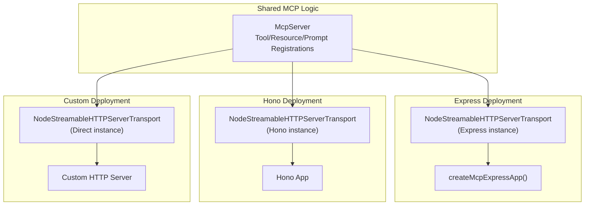

# Middleware Integration

<details>
<summary>Relevant source files</summary>

The following files were used as context for generating this wiki page:

- [README.md](README.md)
- [examples/server/src/elicitationUrlExample.ts](examples/server/src/elicitationUrlExample.ts)
- [examples/server/src/jsonResponseStreamableHttp.ts](examples/server/src/jsonResponseStreamableHttp.ts)
- [examples/server/src/simpleStatelessStreamableHttp.ts](examples/server/src/simpleStatelessStreamableHttp.ts)
- [examples/server/src/simpleStreamableHttp.ts](examples/server/src/simpleStreamableHttp.ts)
- [packages/server/package.json](packages/server/package.json)
- [packages/server/src/experimental/tasks/mcpServer.ts](packages/server/src/experimental/tasks/mcpServer.ts)
- [pnpm-lock.yaml](pnpm-lock.yaml)
- [pnpm-workspace.yaml](pnpm-workspace.yaml)

</details>


This document describes the framework-specific middleware packages that enable MCP servers to integrate with popular Node.js web frameworks. These packages provide convenience wrappers and helpers for Express, Hono, and Node.js HTTP servers, building on the core transport layer described in [Streamable HTTP Server Transport](#3.5).

For general server implementation patterns, see [McpServer High-Level API](#3.1). For OAuth authentication integration with these middleware packages, see [OAuth Server Integration](#5.2).

---

## Package Overview

The SDK provides three middleware packages that sit between web frameworks and the core MCP server implementation:

| Package | Purpose | Primary Export |
|---------|---------|----------------|
| `@modelcontextprotocol/node` | Node.js HTTP adapter layer | `NodeStreamableHTTPServerTransport` |
| `@modelcontextprotocol/express` | Express.js integration helpers | `createMcpExpressApp()` |
| `@modelcontextprotocol/hono` | Hono framework integration helpers | Hono middleware helpers |

All three packages depend on `@modelcontextprotocol/server` and provide runtime-specific bindings for the Web Standards-based transport layer.

**Sources:** [package.json:1-86](), Diagram 1 from high-level architecture

---

## Middleware Architecture

The middleware packages form a layered architecture that adapts Web Standards APIs to Node.js-specific HTTP objects:



**Architecture Diagram: Middleware Package Layering**

**Sources:** Diagram 3 from high-level architecture, [package.json:49-52]()

---

## @modelcontextprotocol/node

The `@modelcontextprotocol/node` package provides the foundational adapter between Node.js HTTP primitives and Web Standards APIs.

### NodeStreamableHTTPServerTransport

`NodeStreamableHTTPServerTransport` wraps `WebStandardStreamableHTTPServerTransport` and handles conversion between:

- Node.js `IncomingMessage` → Web API `Request`
- Node.js `ServerResponse` → Web API `Response`  
- Node.js streams → Web Streams API (`ReadableStream`, `WritableStream`)

This allows the core transport implementation to remain runtime-agnostic while providing Node.js compatibility.



**Diagram: NodeStreamableHTTPServerTransport Adaptation Layer**

The transport supports both stateful and stateless session modes, event stores for resumability, and all features of the underlying `WebStandardStreamableHTTPServerTransport`.

**Sources:** Diagram 3 from high-level architecture, [package.json:51]()

---

## @modelcontextprotocol/express

The `@modelcontextprotocol/express` package provides Express.js-specific integration helpers with built-in security features.

### createMcpExpressApp()

The primary export is `createMcpExpressApp()`, which creates an Express application configured with:

- MCP server integration
- DNS rebinding protection (automatically enabled for localhost bindings)
- CORS middleware setup
- Proper request/response handling

#### Basic Usage Pattern

```typescript
import { createMcpExpressApp } from '@modelcontextprotocol/express';

// Auto-enables DNS protection for 127.0.0.1
const app = createMcpExpressApp();

// Auto-enables DNS protection for localhost
const app = createMcpExpressApp({ host: 'localhost' });
```

**Sources:** [docs/server.md:77-87]()

#### DNS Rebinding Protection

When binding to `127.0.0.1` or `localhost`, DNS rebinding protection is automatically enabled. This prevents malicious websites from making requests to your local MCP server.

For deployments binding to all interfaces (`0.0.0.0` or `::`), you must explicitly provide an allow-list:

```typescript
import { createMcpExpressApp } from '@modelcontextprotocol/express';

const app = createMcpExpressApp({
    host: '0.0.0.0',
    allowedHosts: ['localhost', '127.0.0.1', 'myhost.local']
});
```

**Sources:** [docs/server.md:89-98]()

### Express Integration Flow



**Diagram: Express Integration Request Flow**

**Sources:** [docs/server.md:74-98](), Diagram 6 from high-level architecture

---

## @modelcontextprotocol/hono

The `@modelcontextprotocol/hono` package provides integration helpers for the Hono web framework, which is optimized for edge runtimes and lightweight applications.

### Hono Middleware Helpers

Like the Express integration, the Hono package provides middleware that bridges Hono's request/response handling with `NodeStreamableHTTPServerTransport`. Hono already uses Web Standards APIs (`Request`/`Response`), making the integration more direct than Express.

### Integration Pattern



**Diagram: Hono Integration Pattern**

**Sources:** [package.json:660-670](), Diagram 1 and Diagram 3 from high-level architecture

---

## Framework Selection Guide

Choose the appropriate middleware package based on your deployment requirements:

| Requirement | Recommended Package | Reason |
|-------------|---------------------|--------|
| Traditional Node.js server | `@modelcontextprotocol/express` | Mature ecosystem, extensive middleware, DNS protection built-in |
| Edge runtime deployment | `@modelcontextprotocol/hono` | Native Web Standards support, lightweight |
| Custom HTTP integration | `@modelcontextprotocol/node` | Direct access to transport layer |
| Maximum compatibility | `@modelcontextprotocol/express` | Most tested, widest deployment patterns |

All packages support the full MCP protocol including stateful sessions, event replay, and task resumability.

**Sources:** Diagram 1 from high-level architecture, [package.json:49-52]()

---

## Transport Configuration

All middleware packages ultimately configure `NodeStreamableHTTPServerTransport`, which accepts the same options as `WebStandardStreamableHTTPServerTransport`:

### Stateful vs Stateless Sessions

**Stateless mode:**
- No session ID tracking
- No event store required
- Simpler deployment model
- Cannot support resumability

**Stateful mode:**
- Session IDs for tracking
- Event store for message replay
- Supports task resumability
- Enables `Last-Event-ID` recovery

### Configuration Options

The transport supports:

- `sessionOptions` - Configure session ID generation and management
- `eventStore` - Provide an `EventStore` implementation for resumability
- `enableJsonResponse` - Disable SSE, return JSON-only responses
- DNS rebinding protection settings (Express only)

For detailed transport configuration, see [Streamable HTTP Server Transport](#3.5).

**Sources:** Diagram 3 from high-level architecture, [docs/server.md:40-51]()

---

## Multi-Framework Deployment

The middleware architecture allows running the same MCP server logic across multiple frameworks:



**Diagram: Multi-Framework Deployment Pattern**

This allows you to:
- Test with Express locally
- Deploy with Hono to edge runtimes
- Use custom HTTP servers for specialized deployments

All while sharing the same `McpServer` instance and tool/resource/prompt implementations.

**Sources:** Diagram 1 from high-level architecture, [package.json:49-52]()

---

## Example References

For complete working examples of middleware integration:

| Example | Framework | Features |
|---------|-----------|----------|
| `simpleStreamableHttp.ts` | Express | Sessions, DNS protection, full features |
| `jsonResponseStreamableHttp.ts` | Express | JSON-only mode, no SSE |
| `simpleStatelessStreamableHttp.ts` | Express | Stateless sessions |
| `sseAndStreamableHttpCompatibleServer.ts` | Express | Backward compatibility |

All examples are located in the repository's `examples/server/src/` directory.

**Sources:** [docs/server.md:13-20](), [docs/server.md:30-61]()

---