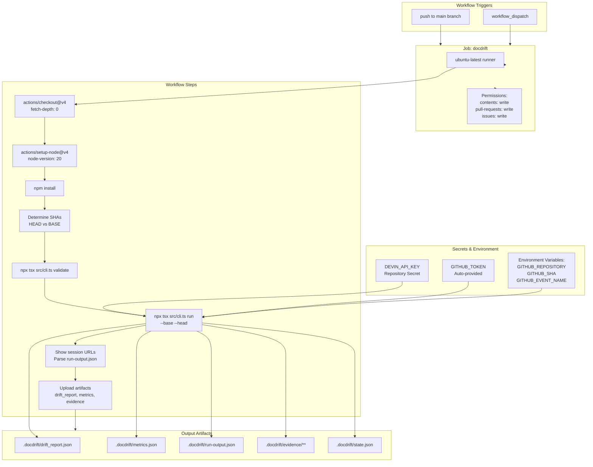
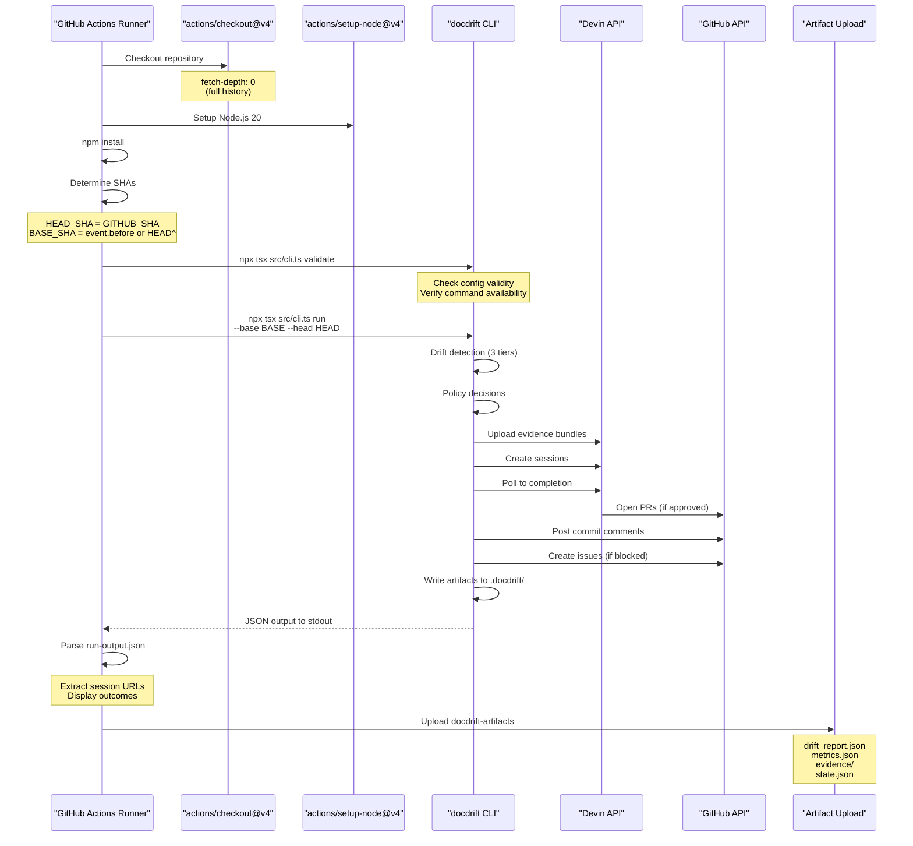
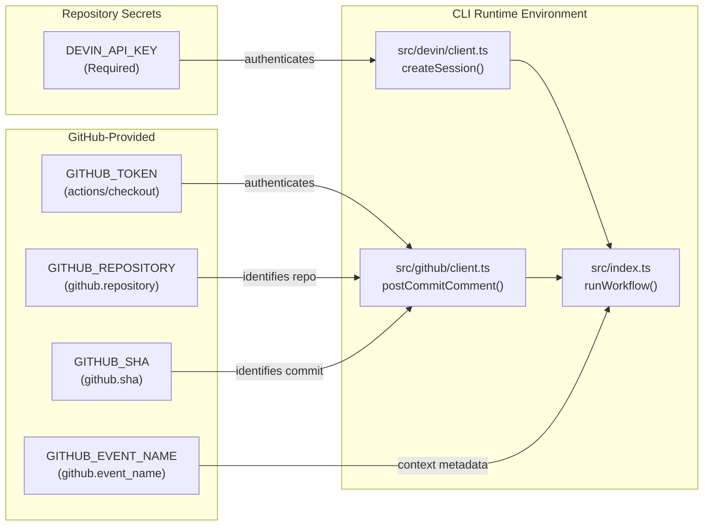
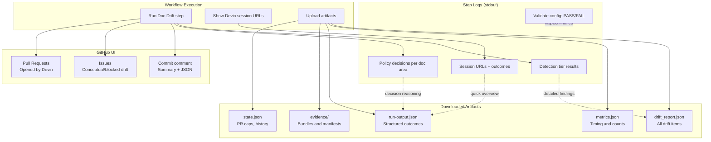

# GitHub Actions Workflow

<details>
<summary>Relevant source files</summary>

The following files were used as context for generating this wiki page:

- [.github/workflows/devin-doc-drift.yml](.github/workflows/devin-doc-drift.yml)
- [.gitignore](.gitignore)
- [README.md](README.md)
- [src/config/validate.ts](src/config/validate.ts)
- [src/devin/prompts.ts](src/devin/prompts.ts)
- [src/github/client.ts](src/github/client.ts)

</details>


## Purpose and Scope

This page documents the GitHub Actions workflow that runs DocDrift in continuous integration. The workflow executes drift detection and remediation automatically on every push to the main branch, enabling continuous documentation maintenance.

For general GitHub integration concepts, see [GitHub Integration](#7). For CLI command details, see [run Command](#3.3). For configuration setup, see [Configuration](#2.2).

## Workflow Overview

The DocDrift GitHub Actions workflow is defined in [.github/workflows/devin-doc-drift.yml:1-69](). Named `devin-doc-drift`, this workflow orchestrates the complete drift detection and remediation pipeline in a CI/CD environment. It runs the DocDrift CLI with appropriate environment variables, handles commit SHA resolution, validates configuration, executes the full drift detection and remediation workflow, and uploads all generated artifacts for inspection.

The workflow is designed to run with minimal configuration—requiring only the `DEVIN_API_KEY` secret—while leveraging GitHub's built-in `GITHUB_TOKEN` for API operations.

**Sources:** [.github/workflows/devin-doc-drift.yml:1-69](), [README.md:102-110]()

## Trigger Conditions

```yaml
on:
  push:
    branches: ["main"]
  workflow_dispatch:
```

The workflow triggers under two conditions:

| Trigger | Description | Use Case |
|---------|-------------|----------|
| `push` to `main` | Automatic execution on every merge to main branch | Continuous drift detection on production changes |
| `workflow_dispatch` | Manual execution via GitHub Actions UI | On-demand testing or drift checks |

When triggered by a push event, the workflow compares the current commit (`GITHUB_SHA`) against the previous commit (`github.event.before`). For manual runs or when the previous commit is unavailable, it falls back to comparing `HEAD` against `HEAD^`.

**Sources:** [.github/workflows/devin-doc-drift.yml:3-6](), [README.md:127-128]()

## Workflow Architecture



**Sources:** [.github/workflows/devin-doc-drift.yml:8-69](), [README.md:102-110]()

## Job Configuration

The workflow defines a single job named `docdrift` with the following configuration:

| Setting | Value | Purpose |
|---------|-------|---------|
| `runs-on` | `ubuntu-latest` | Linux runner for Node.js execution |
| `permissions.contents` | `write` | Clone repository with full history |
| `permissions.pull-requests` | `write` | Allow Devin to create/update PRs |
| `permissions.issues` | `write` | Create issues for low-confidence drift |

These permissions are required for DocDrift to interact with the GitHub API for posting commit comments and creating issues when drift is detected but cannot be automatically remediated.

**Sources:** [.github/workflows/devin-doc-drift.yml:9-14]()

## Workflow Steps Sequence



**Sources:** [.github/workflows/devin-doc-drift.yml:15-69]()

### Step 1: Repository Checkout

[.github/workflows/devin-doc-drift.yml:16-18]()

```yaml
- uses: actions/checkout@v4
  with:
    fetch-depth: 0
```

The workflow uses `actions/checkout@v4` with `fetch-depth: 0` to clone the entire Git history. This is required for DocDrift to:
- Access both base and head commits for comparison
- Generate accurate file diffs via `git diff`
- Resolve SHA references for the Determine SHAs step

### Step 2: Node.js Setup

[.github/workflows/devin-doc-drift.yml:20-22]()

```yaml
- uses: actions/setup-node@v4
  with:
    node-version: "20"
```

Sets up Node.js 20, which is the runtime required for executing the TypeScript CLI via `tsx`.

### Step 3: Dependency Installation

[.github/workflows/devin-doc-drift.yml:24]()

```yaml
- run: npm install
```

Installs all dependencies defined in `package.json`, including the `tsx` runtime and DocDrift's internal dependencies.

### Step 4: SHA Determination

[.github/workflows/devin-doc-drift.yml:26-35]()

This step resolves the base and head commit SHAs for comparison:

```bash
HEAD_SHA="${GITHUB_SHA}"
BASE_SHA="${{ github.event.before }}"
if [ -z "$BASE_SHA" ] || [ "$BASE_SHA" = "0000000000000000000000000000000000000000" ]; then
  BASE_SHA="$(git rev-parse HEAD^)"
fi
```

| Scenario | HEAD_SHA | BASE_SHA | Use Case |
|----------|----------|----------|----------|
| Push event | `GITHUB_SHA` | `github.event.before` | Normal push to main |
| First push / manual run | `GITHUB_SHA` | `git rev-parse HEAD^` | Fallback when before is unavailable |

The outputs are set via `GITHUB_OUTPUT` and referenced in later steps as `${{ steps.shas.outputs.base }}` and `${{ steps.shas.outputs.head }}`.

**Sources:** [.github/workflows/devin-doc-drift.yml:26-35](), [README.md:29-33]()

### Step 5: Configuration Validation

[.github/workflows/devin-doc-drift.yml:37-38]()

```yaml
- name: Validate config
  run: npx tsx src/cli.ts validate
```

Executes the `validate` command (see [validate Command](#3.1)) to verify:
- `docdrift.yaml` exists and is well-formed
- Required commands (`npm run docs:check`, `npm run openapi:export`) are available in `package.json`
- Configuration schema is valid

If validation fails, the workflow terminates before running drift detection.

### Step 6: Drift Detection and Remediation

[.github/workflows/devin-doc-drift.yml:40-48]()

The core step that executes the full DocDrift workflow:

```yaml
- name: Run Doc Drift
  env:
    DEVIN_API_KEY: ${{ secrets.DEVIN_API_KEY }}
    GITHUB_TOKEN: ${{ secrets.GITHUB_TOKEN }}
    GITHUB_REPOSITORY: ${{ github.repository }}
    GITHUB_SHA: ${{ github.sha }}
    GITHUB_EVENT_NAME: ${{ github.event_name }}
  run: |
    npx tsx src/cli.ts run --base ${{ steps.shas.outputs.base }} --head ${{ steps.shas.outputs.head }} | tee .docdrift/run-output.json
```

This step pipes the CLI output to both stdout and `.docdrift/run-output.json` for later parsing. The `run` command performs the complete workflow documented in [run Command](#3.3).

### Step 7: Session URL Display

[.github/workflows/devin-doc-drift.yml:50-56]()

```yaml
- name: Show Devin session URLs
  if: success()
  run: |
    node -e "
      const r = require('./.docdrift/run-output.json');
      if (Array.isArray(r)) r.forEach((x, i) => console.log('Doc area:', x.docArea, '| Session:', x.sessionUrl || '(none)', '| Outcome:', x.outcome));
    "
```

Parses the JSON output from the previous step and displays a summary table in the workflow logs:

```
Doc area: api_reference | Session: https://preview.devin.ai/sessions/... | Outcome: PR_OPENED
Doc area: auth_guide | Session: (none) | Outcome: ISSUE_OPENED
```

This provides immediate visibility into which doc areas triggered Devin sessions and their outcomes without downloading artifacts.

### Step 8: Artifact Upload

[.github/workflows/devin-doc-drift.yml:58-69]()

```yaml
- name: Upload artifacts
  if: always()
  uses: actions/upload-artifact@v4
  with:
    name: docdrift-artifacts
    path: |
      .docdrift/drift_report.json
      .docdrift/metrics.json
      .docdrift/run-output.json
      .docdrift/evidence/**
      .docdrift/state.json
```

Uses `if: always()` to upload artifacts even if the workflow fails, ensuring diagnostic information is available. The uploaded archive includes:

| Artifact | Purpose | Related Documentation |
|----------|---------|----------------------|
| `drift_report.json` | Structured drift findings from detection tiers | [drift_report.json](#8.1) |
| `metrics.json` | Performance metrics and counts | [metrics.json](#8.2) |
| `run-output.json` | CLI output with session URLs and outcomes | - |
| `evidence/**` | Evidence bundles, tarballs, and manifests | [Evidence Directory Structure](#8.3) |
| `state.json` | Persistent state for caps and idempotency | [State Management](#5.3) |

**Sources:** [.github/workflows/devin-doc-drift.yml:58-69](), [README.md:106-109]()

## Environment Variables and Secrets



**Sources:** [.github/workflows/devin-doc-drift.yml:41-46](), [README.md:120-124]()

### Required Secret: DEVIN_API_KEY

The `DEVIN_API_KEY` must be added to the repository as a secret:

1. Navigate to **Repository → Settings → Secrets and variables → Actions**
2. Click **New repository secret**
3. Set **Name:** `DEVIN_API_KEY`
4. Set **Value:** Your Devin API key (obtain from Devin dashboard)

This secret is used by the Devin client to authenticate API requests for uploading evidence bundles and creating sessions.

### Automatic GitHub Token

The `GITHUB_TOKEN` is automatically provided by GitHub Actions with the permissions specified in the job configuration. The DocDrift CLI uses this token to:

- Post commit comments with drift detection results
- Create GitHub issues for low-confidence or conceptual drift
- Provide context to Devin about the repository

No manual configuration is required—the token is scoped to the current repository and expires after the workflow completes.

### Repository Context Variables

Additional context variables are passed from GitHub Actions to the CLI:

| Variable | Source | Usage |
|----------|--------|-------|
| `GITHUB_REPOSITORY` | `${{ github.repository }}` | Repository identifier (e.g., `owner/repo`) |
| `GITHUB_SHA` | `${{ github.sha }}` | Current commit SHA for linking comments |
| `GITHUB_EVENT_NAME` | `${{ github.event_name }}` | Event type (`push`, `workflow_dispatch`) for metrics |

**Sources:** [.github/workflows/devin-doc-drift.yml:43-46](), [README.md:164-169]()

## Triggering the Workflow

### Automatic Execution on Push

Every push to the `main` branch automatically triggers the workflow. The workflow runs in the background and:

1. Compares the newly pushed commit against its parent
2. Detects drift across all configured doc areas
3. Opens PRs via Devin or creates issues based on policy decisions
4. Posts a commit comment summarizing the results

### Manual Execution via UI

To run the workflow manually:

1. Navigate to the **Actions** tab in the GitHub repository
2. Select **devin-doc-drift** from the workflow list
3. Click **Run workflow**
4. Select the branch (typically `main`)
5. Click **Run workflow**

Manual runs use `HEAD` and `HEAD^` as the comparison commits, checking drift between the latest commit and its parent.

**Sources:** [README.md:126-128](), [.github/workflows/devin-doc-drift.yml:6]()

## Workflow Outputs and Diagnostics



**Sources:** [.github/workflows/devin-doc-drift.yml:50-69](), [README.md:144-147]()

### Viewing Workflow Results

After a workflow run completes, results are available in multiple locations:

| Location | Information | Access Method |
|----------|-------------|---------------|
| **Step logs** | Real-time CLI output, validation results, policy decisions | Actions tab → Workflow run → Step name |
| **Show Devin session URLs** | Quick summary of session URLs and outcomes per doc area | Actions tab → Workflow run → Step 7 |
| **Artifacts** | Complete drift report, evidence bundles, metrics | Actions tab → Workflow run → Artifacts → Download |
| **Commit comment** | Summary with drift count and session links | Repository → Commits → Click commit → View comment |
| **Issues** | Conceptual drift or blocked items requiring human input | Repository → Issues tab |
| **Pull Requests** | Automated documentation updates opened by Devin | Repository → Pull requests tab |

### Artifact Download

To download artifacts:

1. Navigate to **Actions → Workflow run**
2. Scroll to the **Artifacts** section
3. Click **docdrift-artifacts** to download a ZIP archive
4. Extract to inspect `.docdrift/drift_report.json`, metrics, and evidence

Artifacts are retained for 90 days by default (configurable in repository settings).

**Sources:** [README.md:106-109](), [README.md:144-147]()

## Using the Workflow in Other Repositories

The workflow file can be copied to any repository that uses DocDrift. To adapt it:

1. **Copy workflow file** to `.github/workflows/devin-doc-drift.yml` in the target repository
2. **Add `docdrift.yaml`** configuration at repository root (see [Configuration](#2.2))
3. **Add `DEVIN_API_KEY` secret** to repository settings
4. **Adjust trigger conditions** if needed (e.g., run on PRs instead of push to main)
5. **Modify npm scripts** to match target repository's documentation build process

### Alternative: NPM Package Integration

Instead of copying the workflow file, repositories can use the published npm package directly:

```yaml
- run: npx @devinnn/docdrift run --base ${{ steps.shas.outputs.base }} --head ${{ steps.shas.outputs.head }}
  env:
    DEVIN_API_KEY: ${{ secrets.DEVIN_API_KEY }}
    GITHUB_TOKEN: ${{ secrets.GITHUB_TOKEN }}
    GITHUB_REPOSITORY: ${{ github.repository }}
    GITHUB_SHA: ${{ github.sha }}
```

This approach pulls the latest published version of DocDrift without maintaining a local copy of the source code. See [Using in another repo](#README.md:149-171) for complete integration examples.

**Sources:** [README.md:149-171](), [.github/workflows/devin-doc-drift.yml:1-69]()

---