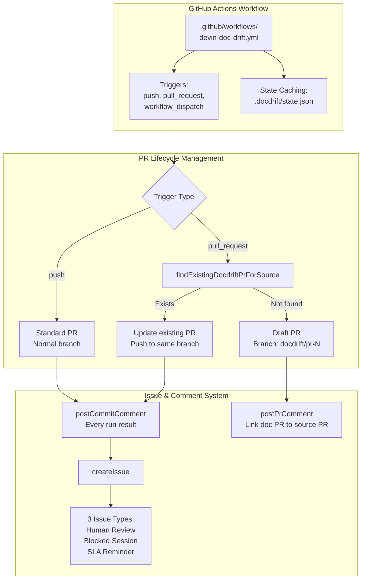
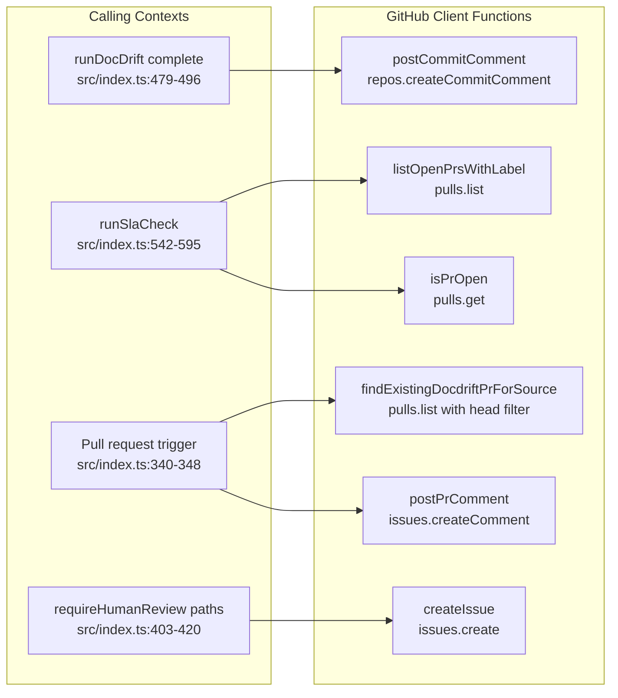
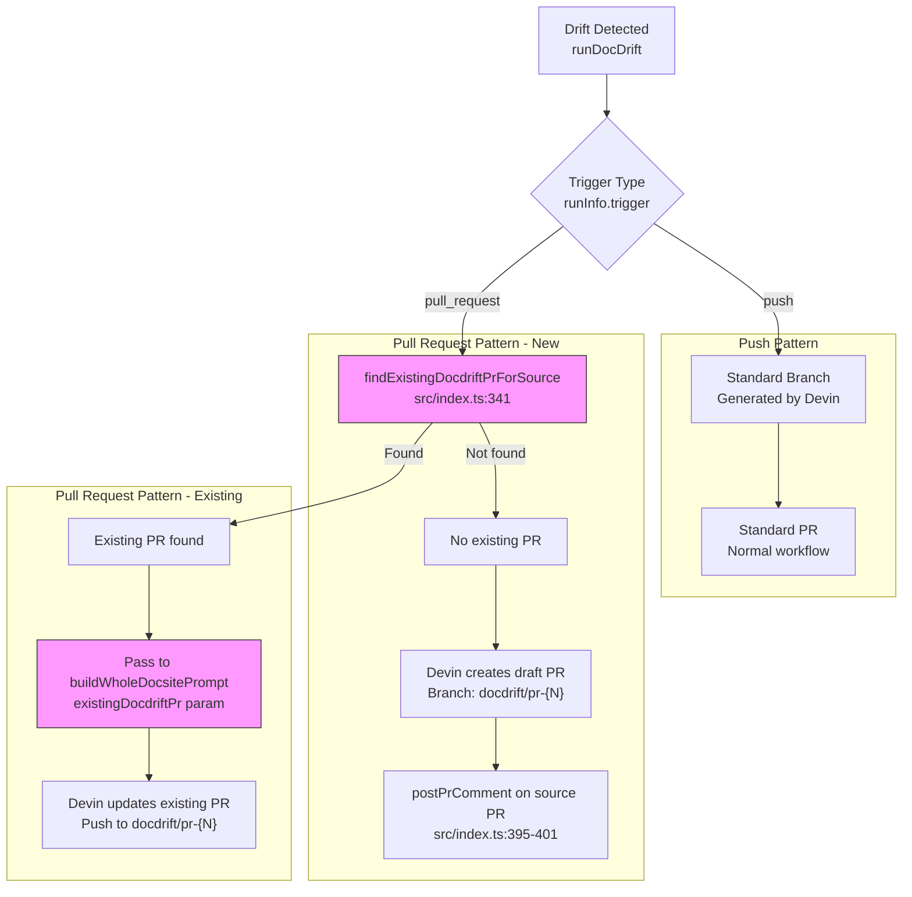
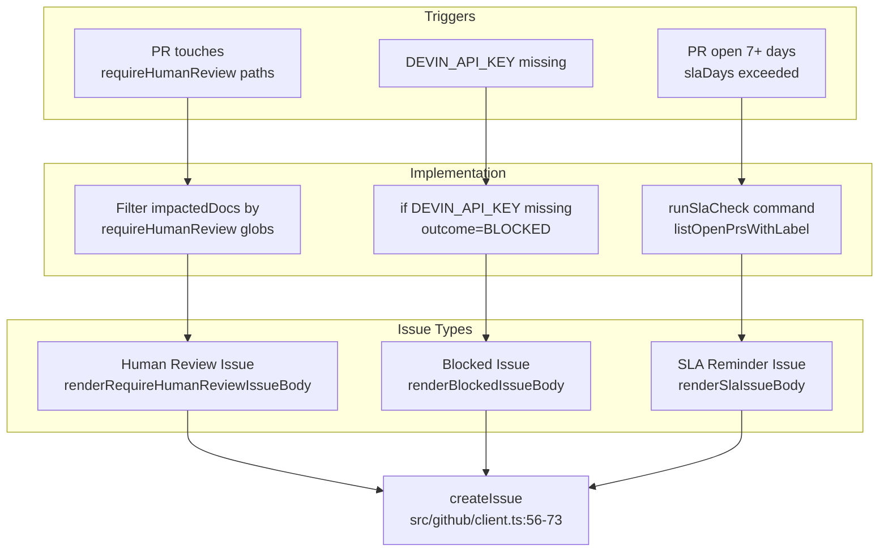
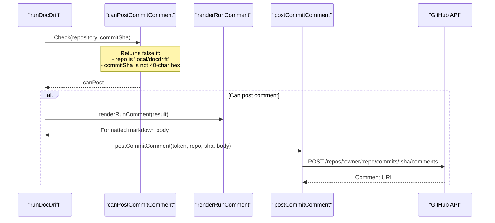
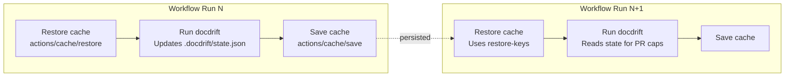

# GitHub Integration

<details>
<summary>Relevant source files</summary>

The following files were used as context for generating this wiki page:

- [.github/workflows/devin-doc-drift.yml](.github/workflows/devin-doc-drift.yml)
- [.gitignore](.gitignore)
- [README.md](README.md)
- [docdrift-yml.md](docdrift-yml.md)
- [src/config/validate.ts](src/config/validate.ts)
- [src/devin/prompts.ts](src/devin/prompts.ts)
- [src/github/client.ts](src/github/client.ts)
- [src/index.ts](src/index.ts)

</details>


## Purpose and Scope

This page documents the GitHub Integration subsystem, which orchestrates continuous integration, PR lifecycle management, and issue escalation. It covers three main areas:

1. **GitHub Actions Workflow** (see page 9.1): The `.github/workflows/devin-doc-drift.yml` workflow that runs drift detection in CI
2. **PR Lifecycle Management** (see page 9.2): How docdrift creates and updates PRs based on trigger type, including the `docdrift/pr-{N}` branch naming convention
3. **Issues and Notifications** (see page 9.3): The three types of issues (human review, blocked sessions, SLA reminders) and commit comment posting

---

## Overview

The GitHub integration implements a sophisticated PR lifecycle and notification system designed to minimize noise while maintaining visibility. Key architectural patterns:



**Diagram: GitHub Integration Architecture**

The system implements PR/commit patterns based on trigger type and `devin.prStrategy`:
- **Push to main**: Creates or updates standard PRs (single docdrift branch or per-run branch).
- **Pull request + commit-to-branch** (default): Devin commits to the source PR branch; no separate docdrift PR. Requires `GITHUB_PR_HEAD_REF` and `--pr-head-ref`.
- **Pull request + separate-pr**: Creates or updates draft PRs with `docdrift/pr-{N}` branch; optionally posts a comment on the source PR when a new docdrift PR is opened. Uses `findExistingDocdriftPrForSource` to update existing docdrift PRs.

**Sources**: [src/github/client.ts:1-254](), [src/index.ts:244-530](), [.github/workflows/devin-doc-drift.yml:1-96]()

---

## Authentication and Permissions

### Required Environment Variables

The GitHub integration relies on environment variables provided by GitHub Actions or set manually for local testing:

| Variable | Source | Purpose | Required |
|----------|--------|---------|----------|
| `GITHUB_TOKEN` | Actions runner (automatic) | Authenticate GitHub API calls | Yes (in CI) |
| `GITHUB_REPOSITORY` | Actions context | Repository slug (`owner/repo`) | Yes (in CI) |
| `GITHUB_SHA` | Actions context | Commit SHA for comment linking | Yes (in CI) |
| `GITHUB_EVENT_NAME` | Actions context | Trigger type (`push`, `pull_request`, etc.) | No |
| `GITHUB_PR_NUMBER` | Workflow extraction | Source PR number when trigger is `pull_request` | No |
| `GITHUB_PR_HEAD_REF` | `github.event.pull_request.head.ref` | Source PR branch name for commit-to-branch; passed as `--pr-head-ref` | No (required for commit-to-branch) |

All variables are read at [src/index.ts:251-254]() and used conditionally throughout the run. Missing `GITHUB_TOKEN` triggers local mode (no GitHub API calls).

**Sources**: [src/index.ts:251-254](), [.github/workflows/devin-doc-drift.yml:56-62]()

### Repository Permissions

The workflow requires these permissions to interact with GitHub:

```yaml
permissions:
  contents: write      # Checkout repository with full history
  pull-requests: write # Comment on source PRs, track Devin PRs
  issues: write        # Create review/SLA/blocked issues
```

These permissions are declared at [.github/workflows/devin-doc-drift.yml:16-19]().

**Sources**: [.github/workflows/devin-doc-drift.yml:16-19]()

---

## GitHub Client API Operations

The GitHub integration is implemented through `src/github/client.ts`, which provides six core API functions using `@octokit/rest`:



**Diagram: GitHub Client API Surface**

### Function Reference

| Function | Purpose | Implementation |
|----------|---------|----------------|
| `postCommitComment` | Post status comment on commit | [src/github/client.ts:17-34]() |
| `postPrComment` | Comment on pull request | [src/github/client.ts:37-54]() |
| `createIssue` | Create GitHub issue | [src/github/client.ts:56-73]() |
| `listOpenPrsWithLabel` | Query PRs by label | [src/github/client.ts:208-226]() |
| `findExistingDocdriftPrForSource` | Find PR for source PR | [src/github/client.ts:232-253]() |
| `isPrOpen` | Check if PR is open | [src/github/client.ts:193-205]() |

All functions use `parseRepo()` at [src/github/client.ts:3-9]() to extract `owner` and `repo` from the `GITHUB_REPOSITORY` slug.

**Sources**: [src/github/client.ts:1-254](), [src/index.ts:8-17]()

---

## PR Lifecycle Management

The GitHub integration implements three PR lifecycle patterns based on the trigger type, designed to minimize PR proliferation while maintaining traceability.

### PR Creation Patterns



**Diagram: PR Lifecycle Based on Trigger Type**

### Finding Existing PRs

The `findExistingDocdriftPrForSource` function at [src/github/client.ts:232-253]() searches for existing doc-drift PRs using the branch naming convention:

```typescript
const branchName = `docdrift/pr-${sourcePrNumber}`;
const { data } = await octokit.pulls.list({
  owner,
  repo,
  state: "open",
  head: branchName,
});
```

This function is called at [src/index.ts:340-348]() when the trigger is `pull_request` and a PR number is available. If found, the existing PR details are passed to the Devin prompt generation at [src/devin/prompts.ts:128-138](), which instructs Devin to update the existing PR instead of creating a new one.

**Key Implementation Details:**
- Branch naming convention: `docdrift/pr-{sourcePrNumber}` (hardcoded at [src/github/client.ts:239]())
- Search uses GitHub API `pulls.list` with `head` filter for exact branch match
- Returns `{ number, url, headRef }` or `null` if not found
- Result is stored in `existingDocdriftPr` variable and passed through the execution pipeline

### Draft PR Creation for Source PRs

When triggered by a pull request and no existing doc-drift PR is found, the system creates a **draft PR** with special handling:

1. **Branch naming**: Devin is instructed to use `docdrift/pr-{N}` at [src/devin/prompts.ts:144]()
2. **Draft status**: PR is marked as draft at [src/devin/prompts.ts:142]()
3. **Linking comment**: After PR creation, `postPrComment` is called at [src/index.ts:395-401]() to post a comment on the source PR linking to the doc-drift PR
4. **Merge instructions**: The comment states "Merge your API changes first, then review and merge this doc PR."

This pattern ensures documentation PRs remain connected to their triggering API changes throughout the review process.

**Sources**: [src/github/client.ts:232-253](), [src/index.ts:340-348](), [src/devin/prompts.ts:126-147](), [src/index.ts:394-401]()

---

## Issue Creation and Types

The GitHub integration creates issues for three specific scenarios, each with distinct purpose and formatting:



**Diagram: Three Issue Types and Their Triggers**

### 1. Human Review Issues

Created when a PR touches paths matching `requireHumanReview` globs in the configuration.

**Creation logic** at [src/index.ts:403-420]():
```typescript
const touchedRequireReview = (item.impactedDocs ?? []).filter((p) =>
  normalized.requireHumanReview.some((glob) => matchesGlob(glob, p))
);
if (githubToken && touchedRequireReview.length > 0) {
  issueUrl = await createIssue({
    token: githubToken,
    repository: repo,
    issue: {
      title: "[docdrift] Docs out of sync — review doc drift PR",
      body: renderRequireHumanReviewIssueBody({
        prUrl: sessionOutcome.prUrl,
        touchedPaths: touchedRequireReview,
      }),
      labels: ["docdrift"],
    },
  });
}
```

**Body format** at [src/github/client.ts:146-172]():
- "Why this issue" explanation
- Link to the doc-drift PR
- List of touched paths requiring review (up to 20, with count of additional)

### 2. Blocked Issues (API Key Missing)

Created when `DEVIN_API_KEY` is not set, preventing Devin session creation.

**Creation logic** at [src/index.ts:421-443]():
```typescript
if (
  githubToken &&
  sessionOutcome.outcome === "BLOCKED" &&
  sessionOutcome.summary.includes("DEVIN_API_KEY")
) {
  issueUrl = await createIssue({
    token: githubToken,
    repository: repo,
    issue: {
      title: "[docdrift] Configuration required — set DEVIN_API_KEY",
      body: renderBlockedIssueBody({
        docArea: item.docArea,
        evidenceSummary: sessionOutcome.summary,
        questions: sessionOutcome.questions ?? [
          "Set DEVIN_API_KEY in GitHub Actions secrets or environment.",
        ],
        sessionUrl: sessionOutcome.sessionUrl,
      }),
      labels: ["docdrift"],
    },
  });
}
```

**Note**: Issues are **NOT** created for Devin-reported blocked sessions (when Devin needs clarification). See [docdrift-yml.md:286-320]() for the complete escalation policy.

### 3. SLA Reminder Issues

Created by the `sla-check` command when doc-drift PRs have been open longer than `slaDays` (default 7).

**Creation logic** at [src/index.ts:542-595]():
```typescript
const openPrs = await listOpenPrsWithLabel(githubToken, repo, slaLabel);
const stalePrs = openPrs.filter((pr) => {
  const created = pr.created_at ? Date.parse(pr.created_at) : Date.now();
  return Number.isFinite(created) && created <= cutoff.getTime();
});

if (stalePrs.length === 0) {
  logInfo("No doc-drift PRs open longer than slaDays; nothing to do");
  return { issueOpened: false };
}

// Check cooldown (6 days) to avoid spam
const lastSla = state.lastSlaIssueOpenedAt ? Date.parse(state.lastSlaIssueOpenedAt) : 0;
const slaCooldown = 6 * 24 * 60 * 60 * 1000;
if (Date.now() - lastSla < slaCooldown) {
  logInfo("SLA issue cooldown; skipping");
  return { issueOpened: false };
}

const prUrls = stalePrs.map((p) => p.url).filter(Boolean);
await createIssue({
  token: githubToken,
  repository: repo,
  issue: {
    title: "[docdrift] Docs out of sync — merge doc drift PR(s)",
    body: renderSlaIssueBody({ prUrls, slaDays }),
    labels: ["docdrift"],
  },
});
```

**Body format** at [src/github/client.ts:174-190]():
- Explanation of SLA violation
- List of stale PR URLs
- Instructions to review/merge or close

**Cooldown logic**: SLA issues are rate-limited to prevent spam. After creating an SLA issue, the system waits 6 days before creating another, tracked via `state.lastSlaIssueOpenedAt` at [src/index.ts:517-518]() and [src/index.ts:591]().

**Sources**: [src/index.ts:403-420](), [src/index.ts:421-443](), [src/index.ts:542-595](), [src/github/client.ts:112-190](), [docdrift-yml.md:286-320]()

---

## Commit Comment Posting

Every run that completes drift detection posts a commit comment with the result summary. This provides transparency and traceability for all runs.

### Commit Comment Flow



**Diagram: Commit Comment Posting Flow**

### Conditional Posting

Comments are only posted when:
1. `GITHUB_TOKEN` is set (checked at [src/index.ts:479]())
2. `repository` is not `"local/docdrift"` (local testing mode)
3. `commitSha` is a valid 40-character hex string (real commit)

The guard function `canPostCommitComment` at [src/index.ts:77-81]() implements this logic:

```typescript
function canPostCommitComment(repository: string, commitSha: string): boolean {
  if (!repository || repository === "local/docdrift") return false;
  return /^[0-9a-f]{40}$/i.test(commitSha);
}
```

### Comment Format

The comment body is generated by `renderRunComment` at [src/github/client.ts:75-110]() and includes:

| Section | Content |
|---------|---------|
| **Header** | `## Doc Drift Result: {docArea}` |
| **Decision** | Policy decision (e.g., `CREATE_PR`, `NOOP`) |
| **Outcome** | Session outcome (e.g., `PR_OPENED`, `BLOCKED`) |
| **Summary** | Human-readable summary of what happened |
| **Links** | Devin session URL, PR URL, Issue URL (if applicable) |
| **Validation** | Results of verification commands |

Example comment structure:
```markdown
## Doc Drift Result: docsite

- Decision: CREATE_PR
- Outcome: PR_OPENED
- Summary: Updated API reference to match OpenAPI changes
- Devin Session: https://app.devin.ai/sessions/abc123
- PR: https://github.com/owner/repo/pull/456

### Validation
- `npm run docs:check`: passed
```

**Sources**: [src/index.ts:77-81](), [src/index.ts:479-496](), [src/github/client.ts:75-110]()

---

## State Persistence and Caching

The GitHub Actions workflow implements state persistence using GitHub Actions cache to maintain PR history and rate limiting across runs.

### Cache Strategy



**Diagram: State Caching Across Workflow Runs**

### Cache Configuration

The workflow implements a two-step cache pattern at [.github/workflows/devin-doc-drift.yml:43-51]():

```yaml
- name: Restore docdrift state
  uses: actions/cache/restore@v4
  id: docdrift-cache
  with:
    path: .docdrift
    key: docdrift-state-${{ github.event_name }}-main-${{ github.run_id }}
    restore-keys: |
      docdrift-state-${{ github.event_name }}-main-
```

The save step at [.github/workflows/devin-doc-drift.yml:78-83]() always runs (`if: always()`) to persist state even if the workflow fails:

```yaml
- name: Save docdrift state
  if: always()
  uses: actions/cache/save@v4
  with:
    path: .docdrift
    key: docdrift-state-${{ github.event_name }}-main-${{ github.run_id }}
```

### State File Contents

The cached `.docdrift/` directory contains:

| File | Purpose | Written By |
|------|---------|------------|
| `state.json` | PR history, rate limiting, SLA tracking | `saveState()` at [src/index.ts:477]() |
| `drift_report.json` | Latest drift detection results | `buildDriftReport()` |
| `metrics.json` | Performance and decision metrics | `writeMetrics()` at [src/index.ts:523]() |
| `run-output.json` | Session URLs and outcomes | Main run loop |
| `evidence/**` | Timestamped evidence bundles | `buildEvidenceBundle()` |

**Note**: The `.gitignore` at [.gitignore:5-8]() excludes all state files except `state.json` is also excluded for security (may contain PR URLs).

**Sources**: [.github/workflows/devin-doc-drift.yml:43-51](), [.github/workflows/devin-doc-drift.yml:78-83](), [.gitignore:5-9](), [src/index.ts:477](), [src/index.ts:523]()

---

## Artifact Upload

The workflow uploads comprehensive artifacts for debugging and auditing, regardless of run success:

```yaml
- name: Upload artifacts
  if: always()
  uses: actions/upload-artifact@v4
  with:
    name: docdrift-artifacts
    path: |
      .docdrift/drift_report.json
      .docdrift/metrics.json
      .docdrift/run-output.json
      .docdrift/evidence/**
      .docdrift/state.json
```

### Artifact Contents

| Artifact | Purpose | See Also |
|----------|---------|----------|
| `drift_report.json` | Complete drift detection results | Page 10.1 |
| `metrics.json` | Timing, counts, policy decisions | Page 10.2 |
| `run-output.json` | Per-area outcomes and links | Page 10.5 |
| `evidence/**` | Attachments sent to Devin | Page 10.4 |
| `state.json` | PR history and rate limiting | Page 10.3 |

The `if: always()` condition at [.github/workflows/devin-doc-drift.yml:86]() ensures artifacts are uploaded even if the workflow fails, enabling post-mortem debugging.

**Sources**: [.github/workflows/devin-doc-drift.yml:85-96]()

---

## Local Usage Without GitHub

DocDrift can run locally without any GitHub integration for development and testing:

```bash
# Omit GITHUB_TOKEN to skip comments and issues
unset GITHUB_TOKEN GITHUB_REPOSITORY GITHUB_SHA
npx tsx src/cli.ts run --base <base-sha> --head <head-sha>
```

In this mode:
- Drift detection still runs normally
- Devin sessions are created if `DEVIN_API_KEY` is set
- No commit comments are posted
- No issues are created
- Results are printed to stdout and saved to `.docdrift/` artifacts

This is demonstrated at [README.md:88-93]().

**Sources**: [README.md:88-93](), [src/index.ts:185-188](), [src/index.ts:296-316](), [src/index.ts:336-354]()

---