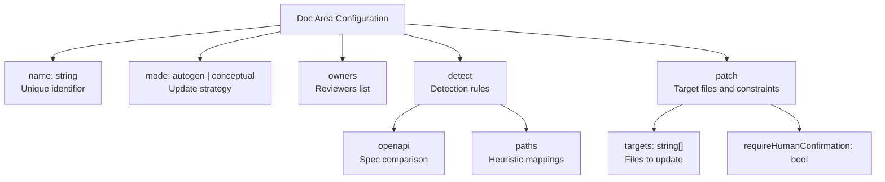
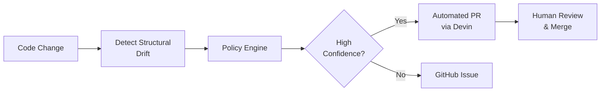
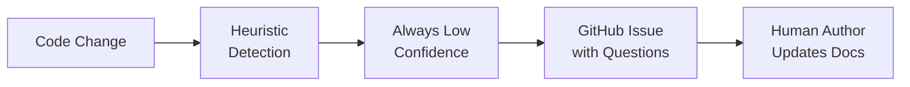
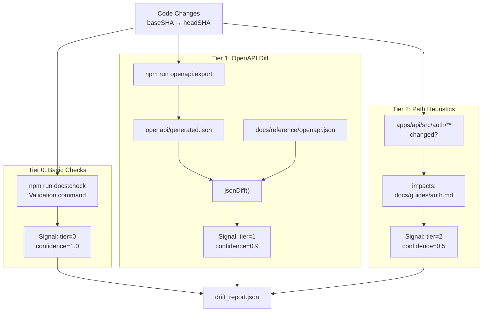
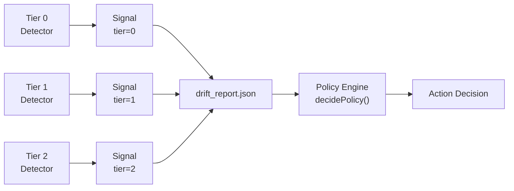
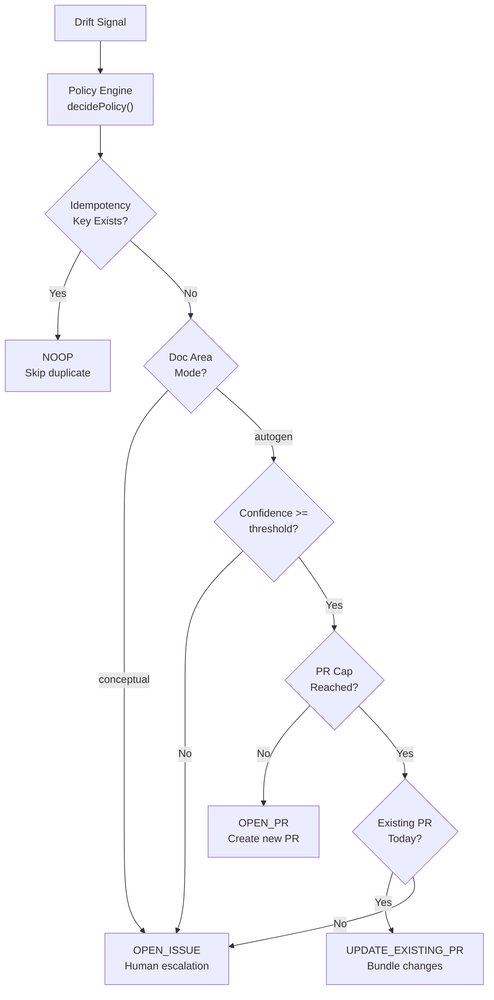
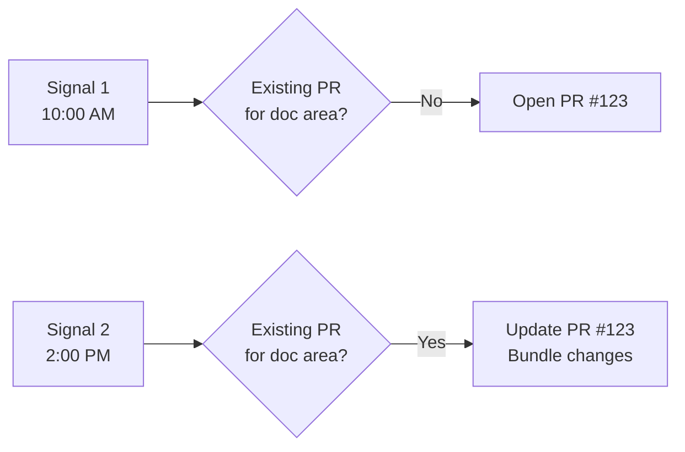
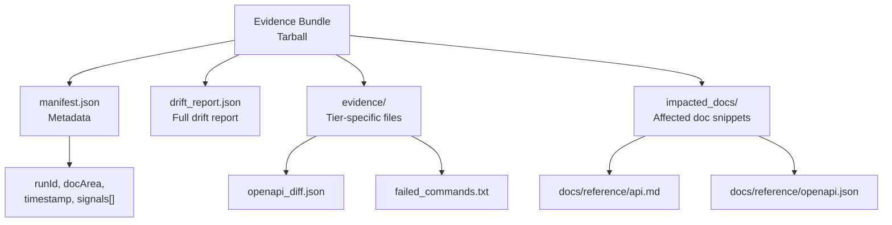
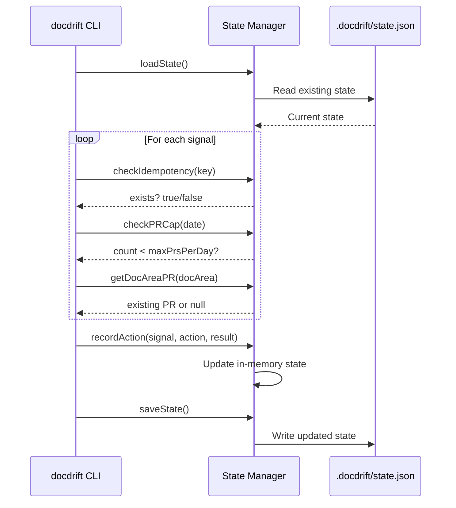
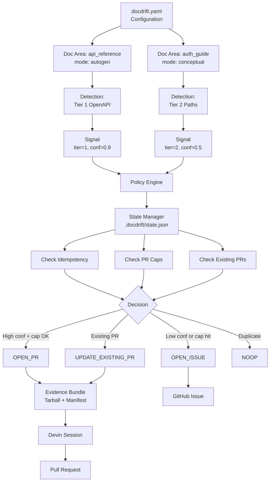

# Key Concepts

<details>
<summary>Relevant source files</summary>

The following files were used as context for generating this wiki page:

- [.gitignore](.gitignore)
- [README.md](README.md)
- [docdrift-yml.md](docdrift-yml.md)
- [docdrift.schema.json](docdrift.schema.json)
- [src/config/normalize.ts](src/config/normalize.ts)
- [src/config/schema.ts](src/config/schema.ts)
- [src/detect/index.ts](src/detect/index.ts)
- [src/index.ts](src/index.ts)
- [test/config.test.ts](test/config.test.ts)

</details>


This page defines the core terminology and conceptual framework used throughout DocDrift. Understanding these concepts is essential for configuring, operating, and extending the system. For architectural details on how these concepts are implemented, see [Architecture](#1.1). For practical configuration examples, see [Configuration](#2.2).

---

## Drift

**Drift** is the divergence between code behavior and documentation. DocDrift detects two categories of drift:

| Drift Type | Description | Example |
|------------|-------------|---------|
| **Structural Drift** | API contracts change (endpoints, request/response schemas, parameters) | Field renamed from `name` to `fullName` in API response |
| **Conceptual Drift** | Underlying behavior or logic changes that affect conceptual documentation | Authentication flow modified to add MFA support |

Structural drift is typically machine-detectable and machine-fixable. Conceptual drift requires human judgment to determine what documentation updates are needed.

**Sources:** [README.md:1-26](), [loom.md:12-23]()

---

## Doc Areas

A **doc area** is a logical grouping of related documentation files that share common characteristics and update policies. Each doc area is defined in `docdrift.yaml` under the `docAreas` array.

### Doc Area Structure



**Sources:** [docdrift.yaml:23-47](), [README.md:44-52]()

### Example: API Reference Doc Area

```yaml
name: api_reference
mode: autogen
owners:
  reviewers: ["datastack/api-owners"]
detect:
  openapi:
    exportCmd: "npm run openapi:export"
    generatedPath: "openapi/generated.json"
    publishedPath: "docs/reference/openapi.json"
patch:
  targets:
    - "docs/reference/openapi.json"
    - "docs/reference/api.md"
```

This configuration declares that `api_reference` uses OpenAPI drift detection (Tier 1) and targets two documentation files for automated updates.

**Sources:** [docdrift.yaml:24-36]()

---

## Modes: Autogen vs Conceptual

Doc areas operate in one of two modes, which determine their update policy:

### Autogen Mode



**Characteristics:**
- Documentation is **machine-generated** from code artifacts (e.g., OpenAPI specs)
- High-confidence drift triggers automated PR creation via Devin
- Updates are deterministic: correct API spec → correct documentation
- Target files are typically structured formats (JSON, Markdown tables)

**Use cases:** API references, CLI command lists, configuration schemas

**Sources:** [README.md:54-60](), [docdrift.yaml:24-36]()

### Conceptual Mode



**Characteristics:**
- Documentation explains **concepts, workflows, best practices**
- All drift signals escalate to GitHub issues with targeted questions
- No automated PR generation (flag: `requireHumanConfirmation: true`)
- Human judgment required to translate code changes into prose

**Use cases:** Guides, tutorials, architectural overviews, conceptual explanations

**Sources:** [README.md:20](), [docdrift.yaml:38-47]()

---

## Detection Tiers

DocDrift employs a **three-tier detection system** with increasing sophistication:



### Tier 0: Basic Checks

Executes validation commands configured in `policy.verification.commands[]`. Typically runs documentation build/lint steps to verify that existing docs are valid.

- **Implementation:** [src/detect/index.ts:48-58]()
- **Configuration:** `policy.verification.commands` in [docdrift.yaml:19-21]()
- **Confidence:** 1.0 (definitive failures)

### Tier 1: OpenAPI Diff

Compares a generated OpenAPI specification (from code) against the published specification (in docs). Detects structural API drift.

- **Implementation:** [src/detect/index.ts:60-72]()
- **Configuration:** `docAreas[].detect.openapi` in [docdrift.yaml:29-32]()
- **Confidence:** 0.9 (high, based on structural diff)
- **Generation:** [apps/api/scripts/export-openapi.ts:1-52]()

### Tier 2: Path Heuristics

Maps code file paths to documentation files using regex patterns. Detects when changes in specific code areas should trigger documentation review.

- **Implementation:** [src/detect/index.ts:74-83]()
- **Configuration:** `docAreas[].detect.paths` in [docdrift.yaml:43-45]()
- **Confidence:** 0.5 (moderate, requires human review)

**Sources:** [README.md:23-31](), [src/detect/index.ts:21-114]()

---

## Signals

A **signal** is a discrete drift detection result produced by one of the detection tiers. Signals are the atomic units of drift that flow through the policy engine.

### Signal Schema

```typescript
interface DriftSignal {
  tier: 0 | 1 | 2;                    // Detection tier
  confidence: number;                  // Range: 0.0 - 1.0
  type: 'docs_check_fail' | 'openapi_drift' | 'conceptual_drift';
  docArea: string;                     // e.g., "api_reference"
  summary: string;                     // Human-readable description
  impactedDocs: string[];             // Affected file paths
  evidence?: {                        // Tier-specific evidence
    diff?: object;                    // OpenAPI diff
    failedCommand?: string;           // Failed validation command
    matchedPaths?: string[];          // Matched code paths
  };
}
```

### Signal Flow



Signals are serialized to `.docdrift/drift_report.json` and consumed by the policy engine to determine remediation actions.

**Sources:** [src/detect/index.ts:10-19](), [.docdrift/drift_report.json:1-30]()

---

## Confidence Scores

**Confidence** is a floating-point value (0.0 - 1.0) indicating the certainty that detected drift is genuine and can be automatically remediated.

### Confidence Levels by Tier

| Tier | Typical Confidence | Rationale |
|------|-------------------|-----------|
| 0    | 1.0               | Failed validation commands are definitive |
| 1    | 0.9               | Structural diffs are highly reliable |
| 2    | 0.5               | Path heuristics may have false positives |

### Confidence Gating

The `policy.confidence.autopatchThreshold` in `docdrift.yaml` defines the minimum confidence required to trigger automated PR creation:

```yaml
policy:
  confidence:
    autopatchThreshold: 0.8
```

Signals with `confidence >= autopatchThreshold` are eligible for automated PRs (subject to other policy checks). Lower-confidence signals escalate to GitHub issues.

**Sources:** [docdrift.yaml:14-15](), [README.md:19]()

---

## Policy Actions

The policy engine evaluates each signal and determines one of four actions:

### Action Types



| Action | Description | Implementation |
|--------|-------------|----------------|
| `NOOP` | Duplicate signal already processed | [src/index.ts:170-177]() |
| `OPEN_PR` | Create new Devin session for PR | [src/index.ts:50-128]() |
| `UPDATE_EXISTING_PR` | Bundle into existing PR for doc area | [src/index.ts:178-190]() |
| `OPEN_ISSUE` | Create GitHub issue with questions | [src/index.ts:200-220]() |

### Idempotency Keys

Each action is associated with an idempotency key: `{repository}:{baseSHA}:{headSHA}:{docArea}:{action}`. This prevents duplicate actions when the same commit range is processed multiple times.

**Sources:** [README.md:34-42](), [src/index.ts:144-290]()

---

## Low-Noise Mechanisms

DocDrift implements several mechanisms to minimize notification noise and PR spam:

### 1. PR Bundling

Multiple drift signals for the same doc area on the same day are bundled into a single PR.



**Configuration:** Implicit based on state tracking in `.docdrift/state.json`

### 2. PR Caps

Global and per-doc-area limits prevent excessive PR creation:

```yaml
policy:
  prCaps:
    maxPrsPerDay: 3           # Global daily cap
    maxFilesTouched: 30       # Per-PR file limit
```

When caps are reached, low-priority signals escalate to issues instead.

### 3. Confidence Gating

Only high-confidence signals (`confidence >= autopatchThreshold`) trigger automated PRs. Lower-confidence signals require human review via issues.

### 4. Idempotency

Each signal is associated with an idempotency key based on repository, SHAs, doc area, and action type. Duplicate keys result in `NOOP` actions.

### 5. Allowlists

Only files matching `policy.allowlist[]` patterns can be modified by Devin sessions:

```yaml
policy:
  allowlist:
    - "docs/**"
    - "openapi/**"
```

This prevents unintended modifications to source code or configuration files.

**Sources:** [README.md:16-21](), [docdrift.yaml:10-21]()

---

## Evidence Bundles

An **evidence bundle** is a structured collection of artifacts packaged for upload to Devin sessions. Each bundle corresponds to one doc area and contains all information needed to remediate drift.

### Bundle Structure



### File System Layout

```
.docdrift/
  evidence/
    {runId}/
      {docArea}/
        manifest.json
        drift_report.json
        evidence/
          openapi_diff.json
          failed_commands.txt
        impacted_docs/
          docs/reference/api.md
          docs/reference/openapi.json
        {docArea}.tar.gz
```

### Tarball Creation

The bundle is compressed into `{docArea}.tar.gz` and uploaded to Devin as a session attachment:

- **Implementation:** [src/evidence/bundle.ts:30-97]()
- **Upload:** [src/index.ts:50-85]()

**Sources:** [README.md:35-38](), [src/evidence/bundle.ts:1-97]()

---

## State Management

**State** is persistent data stored in `.docdrift/state.json` that tracks actions taken across multiple runs. This enables idempotency, PR cap enforcement, and bundling decisions.

### State Schema

```json
{
  "version": 1,
  "lastRun": "2024-01-15T10:30:00Z",
  "prCounts": {
    "2024-01-15": 2
  },
  "docAreaPRs": {
    "api_reference": {
      "prNumber": 123,
      "createdAt": "2024-01-15T09:00:00Z",
      "url": "https://github.com/org/repo/pull/123"
    }
  },
  "processedSignals": [
    "org/repo:abc123:def456:api_reference:OPEN_PR"
  ]
}
```

### State Lifecycle



### State Operations

| Operation | Purpose | Implementation |
|-----------|---------|----------------|
| `loadState()` | Initialize from disk | [src/state/index.ts:10-25]() |
| `checkIdempotency()` | Detect duplicate signals | [src/state/index.ts:30-40]() |
| `checkPRCap()` | Enforce daily PR limit | [src/state/index.ts:45-55]() |
| `getDocAreaPR()` | Find existing PR for bundling | [src/state/index.ts:60-70]() |
| `recordAction()` | Log completed action | [src/state/index.ts:75-90]() |
| `saveState()` | Persist to disk | [src/state/index.ts:95-105]() |

**Sources:** [README.md:42](), [src/index.ts:240-250]()

---

## Concept Relationships

The following diagram illustrates how these concepts relate to each other in a typical workflow:



**Sources:** [README.md:34-42](), [docdrift.yaml:1-47](), [src/index.ts:144-290]()

---