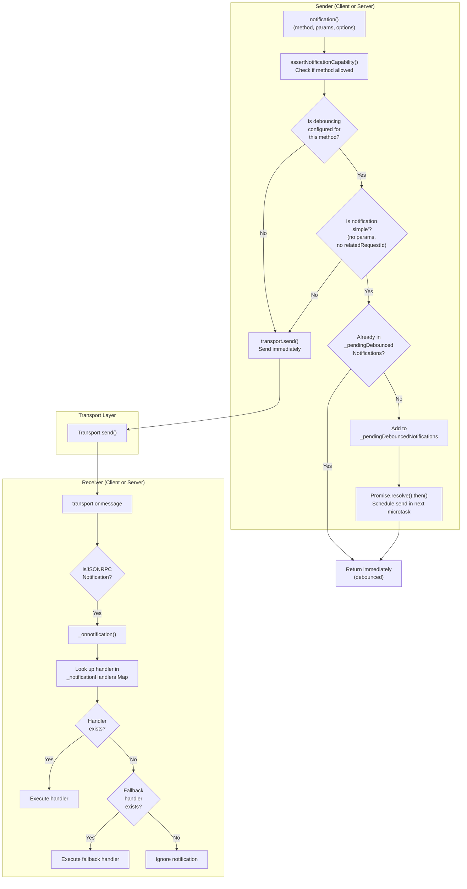
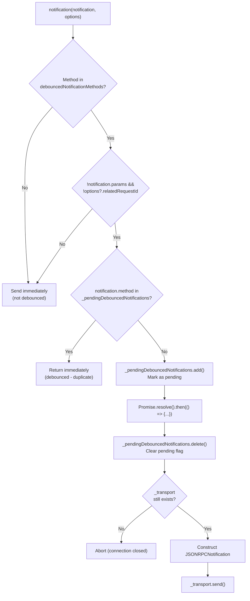
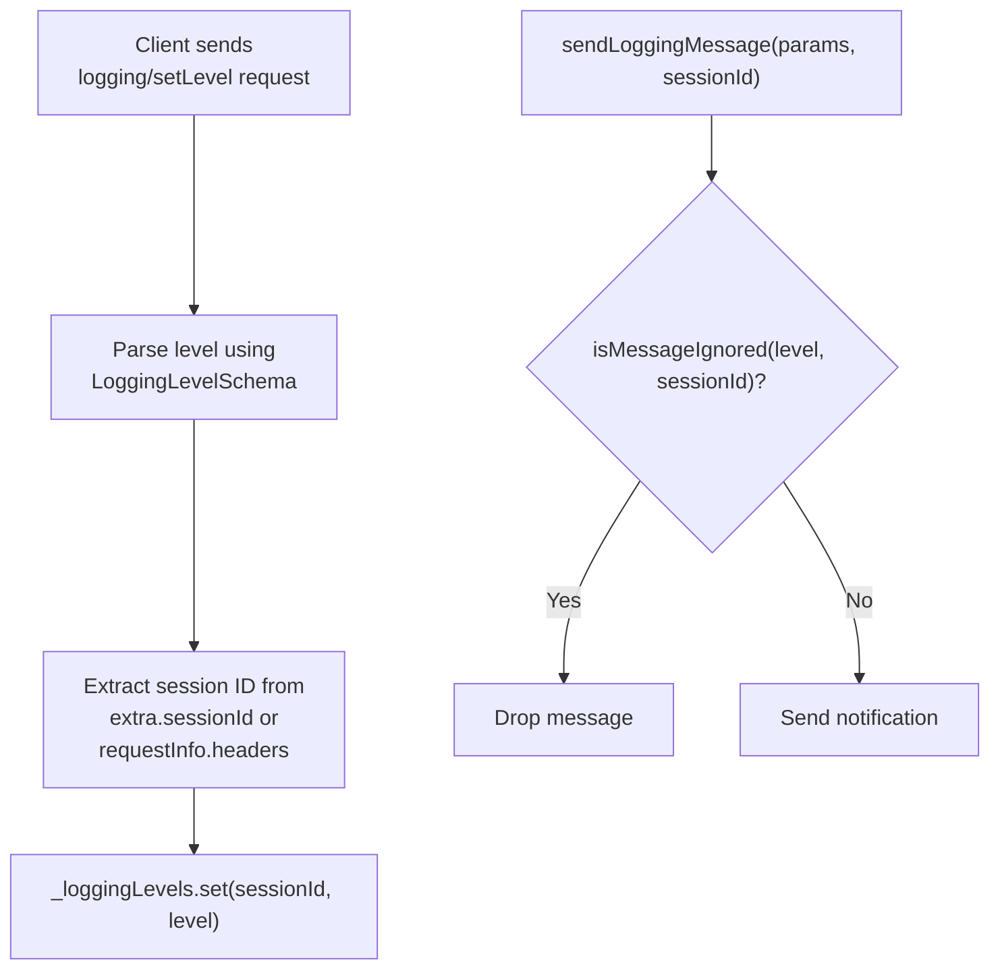
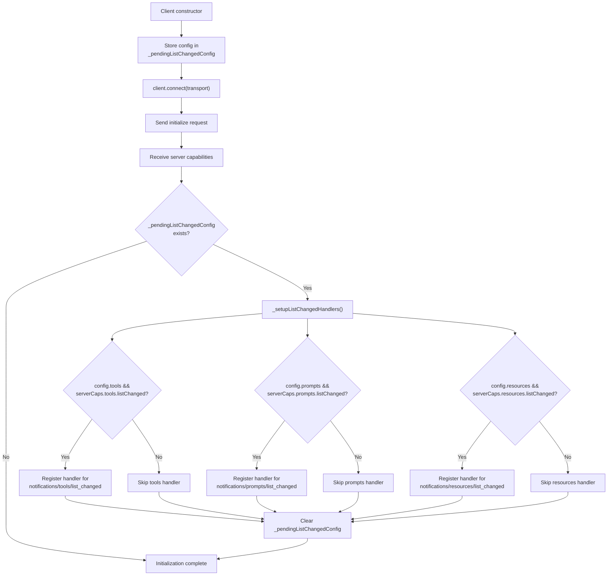
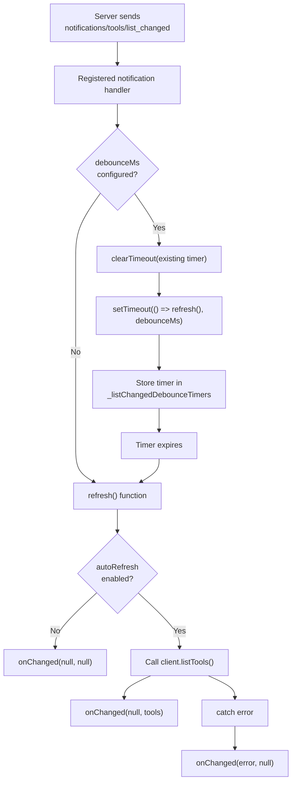
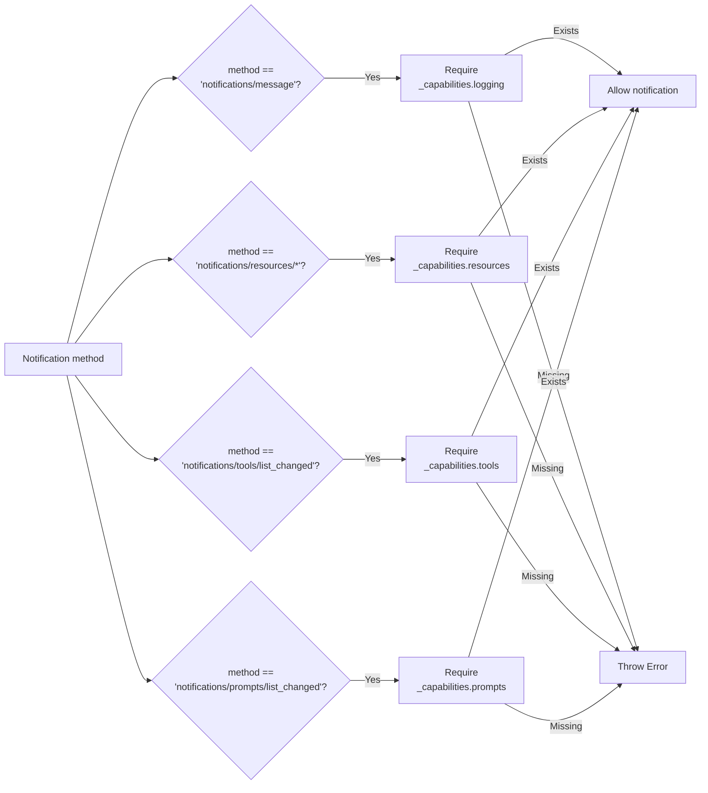

# Notification System and Logging

<details>
<summary>Relevant source files</summary>

The following files were used as context for generating this wiki page:

- [examples/client/src/simpleStreamableHttp.ts](examples/client/src/simpleStreamableHttp.ts)
- [examples/client/src/simpleTaskInteractiveClient.ts](examples/client/src/simpleTaskInteractiveClient.ts)
- [packages/client/src/client/client.ts](packages/client/src/client/client.ts)
- [packages/core/src/shared/protocol.ts](packages/core/src/shared/protocol.ts)
- [packages/core/src/types/types.ts](packages/core/src/types/types.ts)
- [packages/core/test/shared/protocol.test.ts](packages/core/test/shared/protocol.test.ts)
- [packages/server/src/server/mcp.ts](packages/server/src/server/mcp.ts)
- [packages/server/src/server/server.ts](packages/server/src/server/server.ts)
- [test/integration/test/client/client.test.ts](test/integration/test/client/client.test.ts)
- [test/integration/test/server.test.ts](test/integration/test/server.test.ts)
- [test/integration/test/server/mcp.test.ts](test/integration/test/server/mcp.test.ts)
- [test/integration/test/taskLifecycle.test.ts](test/integration/test/taskLifecycle.test.ts)

</details>


## Purpose and Scope

This document describes the notification system in the MCP TypeScript SDK, which enables one-way message passing between clients and servers without expecting responses. The focus is on server-to-client notifications, particularly logging messages, resource/tool/prompt list change notifications, and the debouncing mechanism for coalescing rapid notifications.

For bidirectional request-response patterns, see page 2.1. For transport-level message delivery, see page 6.1.

## Overview

The notification system provides asynchronous, one-way communication for events that don't require acknowledgment or response data. Common use cases include:

- **Logging**: Server sending diagnostic messages to client with severity levels (`notifications/message`)
- **List changes**: Server notifying client when resources/tools/prompts change (`notifications/{resources|tools|prompts}/list_changed`)
- **Resource updates**: Server notifying client when resource content changes (`notifications/resources/updated`)
- **Client notifications**: Client notifying server when roots list changes (`notifications/roots/list_changed`)
- **Progress updates**: Either side sending progress for long-running operations (`notifications/progress`)
- **Cancellation**: Either side cancelling in-flight requests (`notifications/cancelled`)

Notifications differ from requests in that they:
- Use `JSONRPCNotification` schema (no `id` field)
- Don't expect a response
- Flow through the same transport but with simpler handler pattern
- Can be debounced to coalesce rapid updates

**Sources:** [packages/core/src/shared/protocol.ts:583-634](), [packages/core/src/types/types.ts:188-197](), [packages/core/src/types/types.ts:282-307]()

## Notification Flow Architecture



**Sources:** [packages/core/src/shared/protocol.ts:583-634](), [packages/core/src/shared/protocol.ts:326-338](), [packages/core/src/types/types.ts:188-197]()

## Debouncing Mechanism

### Configuration

Debouncing is configured in two ways:

1. **Protocol-level**: Through `ProtocolOptions.debouncedNotificationMethods`:

```typescript
const server = new Server(serverInfo, {
  debouncedNotificationMethods: ['notifications/tools/list_changed']
});
```

2. **Client list changed handlers**: Through `ListChangedOptions.debounceMs`:

```typescript
const client = new Client(clientInfo, {
  listChanged: {
    tools: {
      onChanged: (error, tools) => console.log('Tools updated'),
      debounceMs: 1000  // Wait 1s before refreshing
    }
  }
});
```

Protocol-level debouncing coalesces multiple synchronous sends within the same event loop tick. Client list changed debouncing uses `setTimeout()` to delay the refresh after receiving a notification.

**Sources:** [packages/core/src/shared/protocol.ts:91-96](), [packages/core/src/types/types.ts](), [packages/client/src/client/client.ts:186]()

### Implementation Details

#### Protocol-Level Debouncing

| Component | Type | Purpose |
|-----------|------|---------|
| `_pendingDebouncedNotifications` | `Set<string>` | Tracks notification methods currently scheduled for sending |
| `debouncedNotificationMethods` | `string[]` | Configuration array of methods to debounce |
| `Promise.resolve().then()` | Microtask scheduling | Defers actual send to next microtask |

#### Client List Changed Debouncing

| Component | Type | Purpose |
|-----------|------|---------|
| `_listChangedDebounceTimers` | `Map<string, ReturnType<typeof setTimeout>>` | Tracks active debounce timers per list type |
| `debounceMs` | `number` (optional) | Delay in milliseconds before refreshing |
| `setTimeout()` | Timer scheduling | Defers refresh call after delay |

**Sources:** [packages/core/src/shared/protocol.ts:401](), [packages/core/src/shared/protocol.ts:590-626](), [packages/client/src/client/client.ts:205](), [packages/client/src/client/client.ts:876-891]()

### Debouncing Logic



The debouncing algorithm works as follows:

1. **Eligibility check**: A notification can only be debounced if:
   - Its method is in `debouncedNotificationMethods`
   - It has no `params` property (or params is undefined)
   - It has no `relatedRequestId` in options

2. **Duplicate detection**: If a notification of the same method is already in `_pendingDebouncedNotifications`, return immediately (the pending send will cover it)

3. **Schedule send**: Add the method to `_pendingDebouncedNotifications` and schedule the actual send via `Promise.resolve().then()`

4. **Execute in microtask**: When the microtask executes:
   - Remove the method from `_pendingDebouncedNotifications`
   - Check if transport still exists (connection may have closed)
   - Send the notification

**Sources:** [packages/core/src/shared/protocol.ts:590-626]()

### Connection Closure Handling

When the connection closes, `_pendingDebouncedNotifications` is cleared to prevent sending notifications after disconnect:

```typescript
private _onclose(): void {
    // ... other cleanup ...
    this._pendingDebouncedNotifications.clear();
    this._transport = undefined;
    // ...
}
```

The microtask scheduled for debounced notifications also performs a safety check before sending to ensure the transport still exists.

**Sources:** [packages/core/src/shared/protocol.ts:308-320](), [packages/core/src/shared/protocol.ts:611-613]()

## Notification Handler Registration

### Handler Maps

| Map | Type | Purpose |
|-----|------|---------|
| `_notificationHandlers` | `Map<string, (notification: JSONRPCNotification) => Promise<void>>` | Maps method names to handler functions |
| `fallbackNotificationHandler` | Optional function | Handles notifications with no registered handler |

**Sources:** [packages/core/src/shared/protocol.ts:182](), [packages/core/src/shared/protocol.ts:210]()

### Registration API

Handlers are registered using `setNotificationHandler()` with Zod schema validation:

```typescript
setNotificationHandler<T extends ZodObject<{ method: ZodLiteral<string> }>>(
    notificationSchema: T,
    handler: (notification: z.infer<T>) => void | Promise<void>
): void
```

The method extracts the method name from the schema and wraps the handler in a promise-based wrapper that performs validation.

**Sources:** [packages/core/src/shared/protocol.ts:678-686]()

### Built-in Handlers

The Protocol constructor automatically registers two built-in notification handlers:

| Notification | Schema | Purpose |
|--------------|--------|---------|
| `notifications/cancelled` | `CancelledNotificationSchema` | Aborts in-flight request handlers |
| `notifications/progress` | `ProgressNotificationSchema` | Updates progress callbacks and resets timeouts |

**Sources:** [packages/core/src/shared/protocol.ts:213-226]()

## Logging System

The logging system allows servers to send diagnostic messages to clients with severity filtering and session-aware configuration.

### Logging Levels

The MCP specification defines the following logging levels in order of increasing severity:

| Level | Index | Description |
|-------|-------|-------------|
| `debug` | 0 | Detailed diagnostic information |
| `info` | 1 | General informational messages |
| `notice` | 2 | Normal but significant events |
| `warning` | 3 | Warning messages |
| `error` | 4 | Error messages |
| `critical` | 5 | Critical conditions |
| `alert` | 6 | Action must be taken immediately |
| `emergency` | 7 | System is unusable |

**Sources:** [packages/core/src/types/types.ts]()

### Logging Level Management

The Server class tracks logging levels per session and filters messages accordingly:



**Session-aware filtering implementation:**

```typescript
// Map log levels by session ID
private _loggingLevels = new Map<string | undefined, LoggingLevel>();

// Severity comparison
private isMessageIgnored(level: LoggingLevel, sessionId?: string): boolean {
    const currentLevel = this._loggingLevels.get(sessionId);
    return currentLevel 
        ? this.LOG_LEVEL_SEVERITY.get(level)! < this.LOG_LEVEL_SEVERITY.get(currentLevel)! 
        : false;
}
```

**Sources:** [packages/server/src/server/server.ts:199-208](), [packages/server/src/server/server.ts:168-179]()

### Logging Capability Declaration

Servers must declare logging capability to send log messages:

```typescript
const server = new McpServer(
    { name: 'my-server', version: '1.0.0' },
    { capabilities: { logging: {} } }
);
```

The `logging/setLevel` request handler is automatically registered when the logging capability is present.

**Sources:** [packages/server/src/server/server.ts:168-179]()

### Sending Log Messages

The `Server` class provides two ways to send log messages:

#### 1. Direct method: `sendLoggingMessage()`

```typescript
await server.sendLoggingMessage({
    level: 'info',
    data: 'Server started successfully',
    logger: 'startup'
}, sessionId);
```

Messages are silently dropped if their severity is below the configured level for the session.

#### 2. Context method: `ctx.mcpReq.log()`

Tool handlers and request handlers receive a `ServerContext` with a convenience logging method:

```typescript
mcpServer.registerTool('example', {}, async (args, ctx) => {
    await ctx.mcpReq.log('info', 'Tool executing', 'example-tool');
    return { content: [{ type: 'text', text: 'Done' }] };
});
```

The `ctx.mcpReq.log` method is injected by `Server.buildContext()` and delegates to `sendLoggingMessage()`:

```typescript
mcpReq: {
    ...ctx.mcpReq,
    log: (level, data, logger) => this.sendLoggingMessage({ level, data, logger })
}
```

**Sources:** [packages/server/src/server/server.ts:635-646](), [packages/server/src/server/server.ts:131-152](), [test/integration/test/server/mcp.test.ts:100-146]()

## Server Notification Methods

The Server class provides convenience methods for sending various types of notifications:

### Notification Method Summary

| Method | Notification Type | Capability Required | Params |
|--------|-------------------|---------------------|--------|
| `sendLoggingMessage()` | `notifications/message` | `logging` | `{ level, data, logger? }` |
| `sendResourceUpdated()` | `notifications/resources/updated` | `resources` | `{ uri }` |
| `sendResourceListChanged()` | `notifications/resources/list_changed` | `resources` | None |
| `sendToolListChanged()` | `notifications/tools/list_changed` | `tools` | None |
| `sendPromptListChanged()` | `notifications/prompts/list_changed` | `prompts` | None |

Each method internally calls `assertNotificationCapability()` to verify the server has declared the required capability, then invokes the base `notification()` method from the Protocol class.

**Sources:** [packages/server/src/server/server.ts:327-354]()

## Client Notification Methods and List Changed Handlers

### Client-Initiated Notifications

The Client class provides notification methods for client-initiated events:

| Method | Notification Type | Capability Required |
|--------|-------------------|---------------------|
| `sendRootsListChanged()` | `notifications/roots/list_changed` | `roots.listChanged` |

**Sources:** [packages/client/src/client/client.ts:897-899]()

### List Changed Notification Handlers

The Client provides automatic handling of server list changed notifications through the `listChanged` configuration option. This feature automatically refreshes lists when the server sends change notifications and supports debouncing to batch rapid updates.

#### Configuration

Configure handlers via `ClientOptions.listChanged`:

```typescript
const client = new Client(
  { name: 'my-client', version: '1.0.0' },
  {
    listChanged: {
      tools: {
        onChanged: (error, tools) => {
          if (error) {
            console.error('Failed to refresh tools:', error);
            return;
          }
          console.log('Tools updated:', tools);
        },
        autoRefresh: true,      // Default: true
        debounceMs: 1000        // Optional delay
      },
      prompts: {
        onChanged: (error, prompts) => { /* ... */ }
      },
      resources: {
        onChanged: (error, resources) => { /* ... */ }
      }
    }
  }
);
```

**Sources:** [packages/client/src/client/client.ts:144-187]()

#### Handler Setup Flow



Handlers are only registered if both the client config includes them AND the server advertises the corresponding `listChanged` capability. This prevents unnecessary handler registration for servers that don't support list change notifications.

**Sources:** [packages/client/src/client/client.ts:419-471](), [packages/client/src/client/client.ts:222-225](), [packages/client/src/client/client.ts:237-258]()

#### Handler Execution with Debouncing



The debouncing mechanism uses `setTimeout()` and clears any existing timer for the same list type. This ensures that rapid notifications result in only one refresh after the debounce period expires.

**Sources:** [packages/client/src/client/client.ts:840-895](), [packages/client/src/client/client.ts:876-891]()

#### Handler Implementation Details

Each list type handler follows this pattern:

```typescript
private _setupListChangedHandler<T>(
    listType: string,
    notificationMethod: NotificationMethod,
    options: ListChangedOptions<T>,
    fetcher: () => Promise<T[]>
): void {
    // Validate options using Zod schema
    const parseResult = parseSchema(ListChangedOptionsBaseSchema, options);
    // Validate callback is a function
    // ...
    
    const { autoRefresh, debounceMs } = parseResult.data;
    const { onChanged } = options;
    
    const refresh = async () => {
        if (!autoRefresh) {
            onChanged(null, null);
            return;
        }
        
        try {
            const items = await fetcher();
            onChanged(null, items);
        } catch (error) {
            onChanged(error instanceof Error ? error : new Error(String(error)), null);
        }
    };
    
    const handler = () => {
        if (debounceMs) {
            // Clear existing timer and schedule new refresh
            const existingTimer = this._listChangedDebounceTimers.get(listType);
            if (existingTimer) clearTimeout(existingTimer);
            const timer = setTimeout(refresh, debounceMs);
            this._listChangedDebounceTimers.set(listType, timer);
        } else {
            // No debounce, refresh immediately
            refresh();
        }
    };
    
    // Register notification handler
    this.setNotificationHandler(notificationMethod, handler);
}
```

**Sources:** [packages/client/src/client/client.ts:840-895]()

#### Options Validation

The `ListChangedOptions` interface and its validation:

| Option | Type | Default | Purpose |
|--------|------|---------|---------|
| `onChanged` | `(error: Error \| null, items: T[] \| null) => void` | Required | Callback invoked after refresh or error |
| `autoRefresh` | `boolean` | `true` | Whether to automatically fetch the updated list |
| `debounceMs` | `number` | `undefined` | Optional delay in milliseconds before refreshing |

If `autoRefresh` is `false`, the callback is invoked with `(null, null)` - allowing the application to manually refresh at its discretion.

**Sources:** [packages/core/src/types/types.ts](), [packages/client/src/client/client.ts:848-851]()

## Capability-Based Authorization

### Server Capability Checks

The Server class validates that notification methods match declared capabilities:



**Sources:** [packages/server/src/server/server.ts:333-381]()

### Client Capability Checks

The Client class validates notifications against client capabilities:

| Notification | Required Capability |
|--------------|---------------------|
| `notifications/roots/list_changed` | `_capabilities.roots.listChanged` |
| `notifications/initialized` | Always allowed |
| `notifications/cancelled` | Always allowed |
| `notifications/progress` | Always allowed |

**Sources:** [packages/client/src/client/client.ts:241-260]()

## Common Notification Patterns

### Server-Side List Change Notifications

List change notifications are commonly debounced to avoid overwhelming the client during rapid updates:

```typescript
const server = new Server(serverInfo, {
    capabilities: { tools: {} },
    debouncedNotificationMethods: ['notifications/tools/list_changed']
});

// Multiple synchronous calls will be coalesced
await server.sendToolListChanged();
await server.sendToolListChanged();
await server.sendToolListChanged();
// Only one notification is actually sent
```

The `McpServer` high-level API automatically sends list changed notifications when tools/resources/prompts are added or modified:

```typescript
mcpServer.registerTool('example', {}, handler);  // Triggers sendToolListChanged()
tool.update({ enabled: false });                 // Also triggers sendToolListChanged()
```

**Sources:** [packages/core/src/shared/protocol.test.ts:543-568](), [packages/server/src/server/mcp.ts:453-461](), [packages/server/src/server/mcp.ts:617-628]()

### Client-Side List Changed Handling

Clients can automatically refresh lists when notifications arrive:

```typescript
const client = new Client(
  clientInfo,
  {
    listChanged: {
      tools: {
        onChanged: (error, tools) => {
          if (!error && tools) {
            updateToolsUI(tools);  // Update application UI
          }
        },
        debounceMs: 500  // Wait 500ms for additional notifications
      }
    }
  }
);
```

This pattern is useful for real-time applications that need to stay synchronized with server state changes.

**Sources:** [packages/client/src/client/client.ts:162-187](), [test/integration/test/client/client.test.ts:1062-1174]()

### Resource Update Notifications

Resource update notifications carry the URI of the changed resource:

```typescript
await server.sendResourceUpdated({ uri: 'file:///path/to/resource' });
```

These are typically not debounced since each carries specific data (the URI).

**Sources:** [packages/server/src/server/server.ts:335-340]()

### Context-Based Notification Sending

Tool handlers and request handlers receive a context object with methods for sending notifications:

#### Server Context Notifications

```typescript
mcpServer.registerTool('example', {}, async (args, ctx) => {
    // Send via ctx.mcpReq.notify()
    await ctx.mcpReq.notify({
        method: 'notifications/progress',
        params: {
            progressToken: ctx.mcpReq._meta?.progressToken,
            progress: 50,
            total: 100
        }
    });
    
    // Or use logging convenience method
    await ctx.mcpReq.log('info', 'Tool executing', 'example-tool');
    
    return { content: [{ type: 'text', text: 'Done' }] };
});
```

The `ServerContext.mcpReq.notify` method is injected by `Server.buildContext()` and properly associates the notification with the current request for transport-level routing.

**Sources:** [packages/server/src/server/server.ts:131-152](), [packages/core/src/shared/protocol.ts:264-308](), [test/integration/test/server/mcp.test.ts:253-349]()

#### Client Context Notifications

Similarly, client request handlers receive a `ClientContext` with notification capabilities:

```typescript
client.setRequestHandler('sampling/createMessage', async (request, ctx) => {
    // Send progress notification
    await ctx.mcpReq.notify({
        method: 'notifications/progress',
        params: {
            progressToken: ctx.mcpReq._meta?.progressToken,
            progress: 1,
            total: 1
        }
    });
    
    return { model: 'test', role: 'assistant', content: { type: 'text', text: 'Done' } };
});
```

**Sources:** [packages/core/src/shared/protocol.ts:264-308](), [packages/core/src/shared/protocol.ts:372-374]()

### Progress Notifications

Progress notifications are handled specially by the Protocol layer to reset request timeouts:

```typescript
// Handler is automatically installed by Protocol constructor
this.setNotificationHandler(ProgressNotificationSchema, notification => {
    this._onprogress(notification as unknown as ProgressNotification);
});
```

The `_onprogress()` method updates progress callbacks and optionally resets timeouts if `resetTimeoutOnProgress` is enabled.

**Sources:** [packages/core/src/shared/protocol.ts:218-220](), [packages/core/src/shared/protocol.ts:410-433]()

## Error Handling

Notification handlers execute within a promise chain that catches and reports errors:

```typescript
private _onnotification(notification: JSONRPCNotification): void {
    const handler = this._notificationHandlers.get(notification.method) 
        ?? this.fallbackNotificationHandler;

    if (handler === undefined) {
        return; // Ignore unhandled notifications
    }

    Promise.resolve()
        .then(() => handler(notification))
        .catch(error => 
            this._onerror(new Error(`Uncaught error in notification handler: ${error}`))
        );
}
```

Errors in notification handlers are non-fatal and reported via the `onerror` callback without disrupting the connection.

**Sources:** [packages/core/src/shared/protocol.ts:326-338]()

## Testing Considerations

### Microtask Flushing

Testing debounced notifications requires flushing the microtask queue:

```typescript
const flushMicrotasks = () => new Promise(resolve => setImmediate(resolve));

protocol.notification({ method: 'test/debounced' });
protocol.notification({ method: 'test/debounced' });

await flushMicrotasks(); // Allow scheduled send to execute
// Verify only one send occurred
```

**Sources:** [packages/core/src/shared/protocol.test.ts:474-654]()

### Connection Closure During Debounce

Tests should verify that scheduled notifications are aborted when the connection closes:

```typescript
protocol.notification({ method: 'test/debounced' });
await protocol.close(); // Clears _pendingDebouncedNotifications
await flushMicrotasks();
// Notification should NOT have been sent
```

**Sources:** [src/shared/protocol.test.ts:519-541]()

---