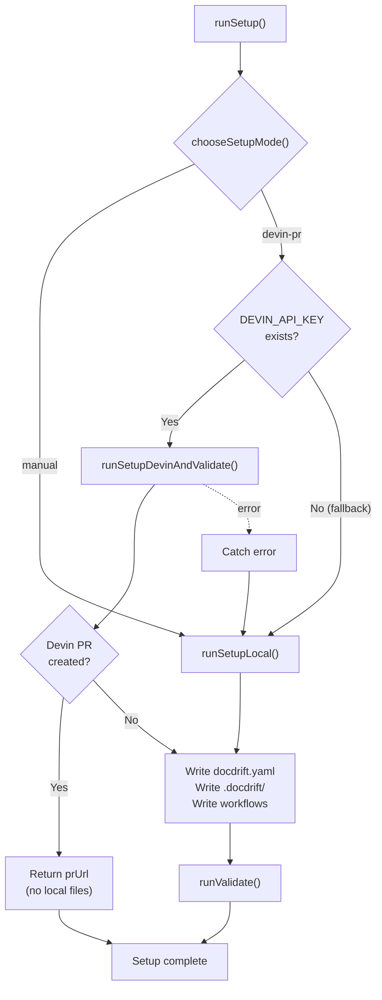
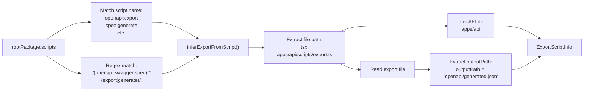
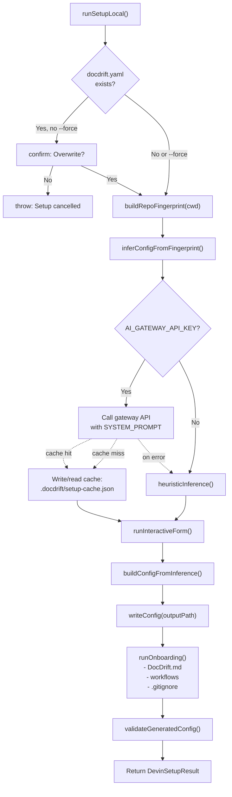
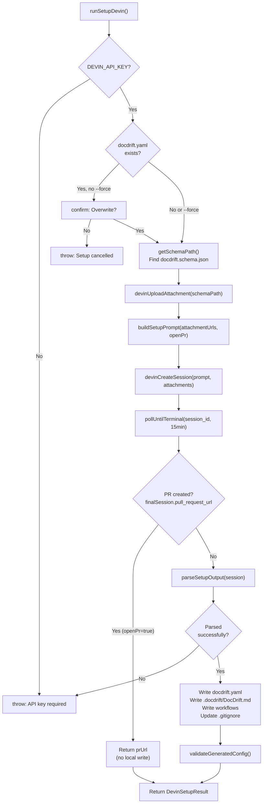
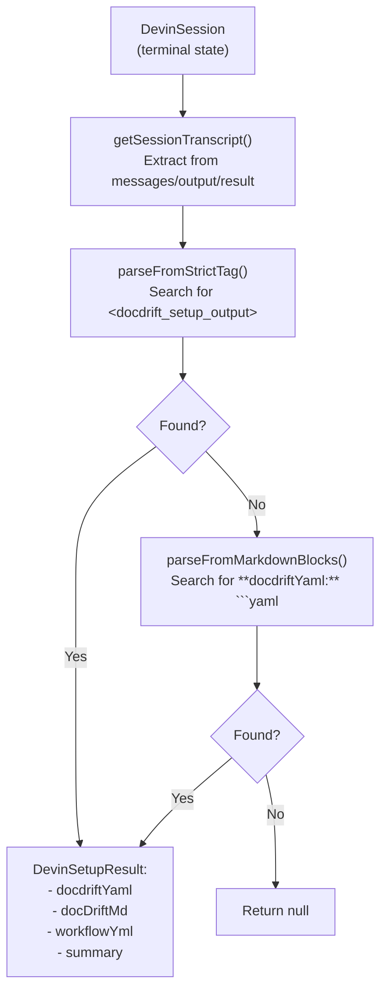
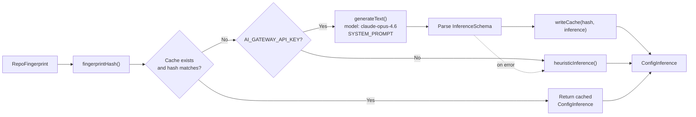

# Setup System

<details>
<summary>Relevant source files</summary>

The following files were used as context for generating this wiki page:

- [docs/guides/setup.md](docs/guides/setup.md)
- [src/setup/ai-infer.ts](src/setup/ai-infer.ts)
- [src/setup/devin-setup.ts](src/setup/devin-setup.ts)
- [src/setup/index.ts](src/setup/index.ts)
- [src/setup/prompts.ts](src/setup/prompts.ts)
- [src/setup/repo-fingerprint.ts](src/setup/repo-fingerprint.ts)
- [src/setup/setup-prompt.ts](src/setup/setup-prompt.ts)
- [test/setup-devin-pr.test.ts](test/setup-devin-pr.test.ts)
- [test/setup-infer.test.ts](test/setup-infer.test.ts)

</details>


The Setup System generates the `docdrift.yaml` configuration file and optional supporting files (`.docdrift/DocDrift.md`, GitHub workflows, `.gitignore` entries) for a repository. It provides two distinct paths: **Manual setup** (local repository scanning with optional AI inference and interactive prompts) and **Devin PR setup** (delegating configuration generation to a Devin AI session that creates a pull request).

For information about the configuration schema and validation, see [Configuration System](#4). For CLI commands that invoke setup, see [setup and generate-yaml](#3.1).

---

## Two Setup Modes

The setup system offers two modes, selected interactively via `chooseSetupMode()` or determined by environment constraints:

| Mode | Trigger | Requirements | Output Location |
|------|---------|--------------|-----------------|
| **Manual** | User selects "Manual" or no `DEVIN_API_KEY` | None (works offline) | Files written locally to `docdrift.yaml`, `.docdrift/`, `.github/workflows/` |
| **Devin PR** | User selects "Devin PR" and `DEVIN_API_KEY` exists | `DEVIN_API_KEY` environment variable, repository added to Devin's Machine | PR created on branch `docdrift/setup` (no local files until merged) |

When **Devin PR** mode is selected but `DEVIN_API_KEY` is missing, the system falls back to Manual mode [src/setup/index.ts:44-46](). If a Devin session fails, the system also falls back to Manual mode [src/setup/index.ts:61-70]().

**Sources:** [src/setup/index.ts:5-11](), [src/setup/index.ts:14-32]()

---

## Setup Flow Decision Tree



**Sources:** [src/setup/index.ts:34-139](), [src/setup/devin-setup.ts:38-86](), [src/setup/devin-setup.ts:165-289]()

---

## Repository Fingerprinting

The fingerprinting process scans the repository structure to detect frameworks, API specifications, documentation sites, and infer configuration hints. The `buildRepoFingerprint()` function produces a `RepoFingerprint` object containing:

### RepoFingerprint Structure

| Field | Type | Purpose |
|-------|------|---------|
| `fileTree` | `Record<string, string[]>` | Directory tree up to depth 3, excluding `node_modules`, `.git`, `dist`, `build` |
| `rootPackage` | `{ scripts?, dependencies?, workspaces? }` | Root `package.json` metadata |
| `workspacePackages` | `Array<{ path, scripts? }>` | Detected workspace package.json files |
| `foundPaths.openapi` | `string[]` | OpenAPI/Swagger spec files (`openapi*.json`, `openapi.yaml`, `api-spec.*`) |
| `foundPaths.docusaurusConfig` | `string[]` | `docusaurus.config.*` files |
| `foundPaths.mkdocs` | `string[]` | `mkdocs.yml` files |
| `foundPaths.vitepressConfig` | `string[]` | `vitepress.config.*` files |
| `foundPaths.nextConfig` | `string[]` | `next.config.*` files |
| `foundPaths.docsDirs` | `string[]` | Directories named `docs/` (depth ≤ 2) |
| `foundPaths.docsDirParents` | `string[]` | Parent directories of `docs/` (e.g., `packages/docs`) |
| `foundPaths.exportScript` | `ExportScriptInfo?` | Detected OpenAPI export script from `package.json` scripts |
| `foundPaths.apiDirs` | `string[]` | Candidate API/source directories |

**Sources:** [src/setup/repo-fingerprint.ts:16-33](), [src/setup/repo-fingerprint.ts:212-328]()

### Export Script Detection

The system searches `package.json` scripts for patterns matching OpenAPI export commands:



The `EXPORT_SCRIPT_NAMES` list includes `["openapi:export", "openapi:generate", "openapi:build", "spec:export", "spec:generate"]` [src/setup/repo-fingerprint.ts:141-147](). If a match is found, `inferExportFromScript()` parses the script command (e.g., `tsx apps/api/scripts/export-openapi.ts`) to extract:
- `inferredApiDir`: The API source directory (e.g., `apps/api`)
- `inferredOutputPath`: Where the spec is written (parsed from the script file content)

**Sources:** [src/setup/repo-fingerprint.ts:105-159]()

### API Directory Collection

The system collects API directory candidates using:
1. **Export script hint**: If `exportScript.inferredApiDir` exists, it's added first
2. **Monorepo structure**: Scans `packages/`, `apps/`, `libs/`, `services/` for subdirs named `api/`, `server/`, `backend/`
3. **Workspace packages**: Checks workspace paths containing "api" or with `routes/`, `controllers/`, `src/` subdirectories

**Sources:** [src/setup/repo-fingerprint.ts:161-210](), [src/setup/repo-fingerprint.ts:305-309]()

---

## Manual Setup Flow

The manual path executes entirely locally without external API calls (unless AI inference is available via `AI_GATEWAY_API_KEY`).



**Sources:** [src/setup/devin-setup.ts:38-86]()

### Interactive Form

The `runInteractiveForm()` function presents questions to the user based on inference confidence:

| Confidence | Behavior |
|------------|----------|
| `high` | Field skipped (no question) |
| `medium` | Question shown if value is ambiguous |
| `low` | Always asks user for confirmation or custom input |

Questions are generated from `ConfigInference.choices`, which contains entries like:

```typescript
{
  key: "specProviders.0.current.command",
  question: "OpenAPI export command",
  options: [{ value: "npm run openapi:export", label: "npm run openapi:export", recommended: true }],
  defaultIndex: 0,
  confidence: "medium"
}
```

The form result is merged with the suggested config via `buildConfigFromInference()`.

**Sources:** [src/setup/ai-infer.ts:55-72](), [src/setup/devin-setup.ts:62-68]()

---

## Devin PR Setup Flow

The Devin PR path delegates configuration generation to a Devin AI session and creates a pull request containing the setup files.



**Sources:** [src/setup/devin-setup.ts:165-289]()

### Devin Session Prompt

The `buildSetupPrompt()` function constructs a prompt instructing Devin to:

1. Analyze the repository (already loaded in Devin's environment)
2. Generate `docdrift.yaml` with:
   - `version: 2`
   - `specProviders` (if OpenAPI/export script found) or `pathMappings` only
   - `docsite` path
   - `devin` config with `apiVersion: v1`, `unlisted: true`, `maxAcuLimit: 2`
   - `policy` with `prCaps`, `confidence`, `allowlist`, `verification.commands`
3. Generate `.docdrift/DocDrift.md` with custom instructions
4. Generate `.github/workflows/docdrift.yml` (using `npx @devinnn/docdrift`, not `npx docdrift`)
5. If `openPr=true`: Create branch `docdrift/setup`, commit files, push, and open PR

The prompt includes strict output formatting requirements using `<docdrift_setup_output>...</docdrift_setup_output>` XML tags.

**Sources:** [src/setup/setup-prompt.ts:34-98]()

### Output Parsing Strategies

The system uses multiple parsing strategies to extract the configuration from the Devin session:



#### Strict Tag Parsing

Searches for `<docdrift_setup_output>{"docdriftYaml":"...","summary":"..."}</docdrift_setup_output>` and parses the JSON content [src/setup/devin-setup.ts:111-133]().

#### Markdown Block Parsing

Fallback that searches for markdown patterns:
- `**docdriftYaml:** ```yaml ... ``` `
- `**docDriftMd:** ```markdown ... ``` `
- `**workflowYml:** ```yaml ... ``` `
- `**summary:** (text until next block)`

This handles cases where the strict tag is missing but the output is structured [src/setup/devin-setup.ts:136-151]().

**Sources:** [src/setup/devin-setup.ts:88-163]()

---

## AI Inference and Heuristics

The `inferConfigFromFingerprint()` function generates configuration suggestions from the repository fingerprint. It uses AI inference when `AI_GATEWAY_API_KEY` is available, with heuristic fallback.

### Inference Pipeline



Cache is stored in `.docdrift/setup-cache.json` with the fingerprint hash to avoid regenerating for unchanged repos [src/setup/ai-infer.ts:77-109]().

**Sources:** [src/setup/ai-infer.ts:255-295]()

### Heuristic Inference Logic

The `heuristicInference()` function implements rule-based configuration generation:

#### Docsite Detection

1. Check `docusaurusConfig[0]` → use parent directory
2. Check `mkdocs[0]` → use parent directory
3. Check `vitepressConfig[0]` → use parent directory
4. Check `nextConfig[0]` → use parent directory
5. Check `docsDirParents[0]` → use first parent
6. Check `docsDirs[0]` → use parent directory
7. If none found → `docsite: undefined`, add to `choices` with `confidence: "low"`

**Sources:** [src/setup/ai-infer.ts:124-137]()

#### Spec Provider Configuration

```typescript
specProviders: [
  {
    format: "openapi3",
    current: {
      type: "export",
      command: exportScript ? `npm run ${scriptName}` : "npm run openapi:export",
      outputPath: exportScript?.inferredOutputPath ?? firstOpenapi ?? "openapi/generated.json"
    },
    published: (docsite && firstOpenapi?.includes(docsite)) 
               ? firstOpenapi 
               : `${docsite}/openapi/openapi.json`
  }
]
```

**Sources:** [src/setup/ai-infer.ts:115-145]()

#### Path Mappings

```typescript
pathMappings: [
  {
    match: apiDir ? `${apiDir}/**` : "**/api/**",
    impacts: docsite 
             ? [`${docsite}/docs/**`, `${docsite}/openapi/**`]
             : ["**/docs/**", "**/openapi/**"]
  }
]
```

**Sources:** [src/setup/ai-infer.ts:169-179]()

#### Policy Defaults

| Field | Default Value | Source |
|-------|---------------|--------|
| `policy.prCaps.maxPrsPerDay` | `5` | [src/setup/ai-infer.ts:241]() |
| `policy.prCaps.maxFilesTouched` | `30` | [src/setup/ai-infer.ts:241]() |
| `policy.confidence.autopatchThreshold` | `0.8` | [src/setup/ai-infer.ts:242]() |
| `policy.allowlist` | `["openapi/**", "{docsite}/**"]` + inferred spec dirs | [src/setup/ai-infer.ts:154-162]() |
| `policy.verification.commands` | `["npm run docs:gen", "npm run docs:build"]` or `["npm run build"]` | [src/setup/ai-infer.ts:146-149]() |
| `policy.slaDays` | `7` | [src/setup/ai-infer.ts:245]() |
| `policy.slaLabel` | `"docdrift"` | [src/setup/ai-infer.ts:246]() |
| `policy.allowNewFiles` | `false` | [src/setup/ai-infer.ts:247]() |

**Sources:** [src/setup/ai-infer.ts:240-248]()

#### Verification Commands

The system searches `rootPackage.scripts` for:
1. `docs:gen` → add `"npm run docs:gen"`
2. `docs:build` → add `"npm run docs:build"`
3. If neither found → default to `["npm run build"]`

**Sources:** [src/setup/ai-infer.ts:146-149]()

---

## Validation and File Writing

After configuration generation (by either path), the setup system:

### Configuration Validation

1. **Pre-validation** (YAML content): `validateYamlContent()` parses YAML and checks basic structure [src/setup/devin-setup.ts:241-249]()
2. **Post-validation** (generated file): `validateGeneratedConfig()` loads and validates the written file [src/setup/devin-setup.ts:74-77](), [src/setup/devin-setup.ts:283-286]()
3. **Runtime validation**: `runValidate()` performs comprehensive checks [src/setup/devin-setup.ts:107-109](), [src/setup/devin-setup.ts:299-305]()

### Onboarding Steps

The `runOnboarding()` function (invoked by manual setup) writes supporting files [src/setup/devin-setup.ts:72]():

| File | Condition | Purpose |
|------|-----------|---------|
| `.docdrift/DocDrift.md` | If `addCustomInstructions` | Custom instructions file for Devin sessions |
| `.github/workflows/docdrift.yml` | If `addWorkflow` | Main workflow for drift detection on push/PR |
| `.github/workflows/docdrift-sla-check.yml` | If `addWorkflow` | Daily cron job for SLA monitoring |
| `.gitignore` entries | Always | Add `.docdrift/state.json`, `.docdrift/evidence/`, `.docdrift/run-output.json` |

The Devin setup path handles file writing differently:
- When `openPr=true` and PR created: **No local files written** [src/setup/index.ts:73-104]()
- When `openPr=false` or PR creation failed: Files written locally [src/setup/devin-setup.ts:265-281]()

**Sources:** [src/setup/devin-setup.ts:265-281](), [src/setup/index.ts:106-119]()

---

## Configuration Inference Schema

The `ConfigInference` type structure returned by inference:

```typescript
interface ConfigInference {
  suggestedConfig: {
    version: 2
    specProviders?: Array<{
      format: "openapi3" | "swagger2" | "graphql" | "fern" | "postman"
      current: { type: "export", command: string, outputPath: string }
      published: string
    }>
    docsite?: string | string[]
    exclude?: string[]
    requireHumanReview?: string[]
    pathMappings?: Array<{ match: string, impacts: string[] }>
    mode?: "strict" | "auto"
    devin?: { apiVersion: "v1", unlisted?: boolean, maxAcuLimit?: number, tags?: string[] }
    policy?: { prCaps?, confidence?, allowlist?, verification?, slaDays?, slaLabel?, allowNewFiles? }
  }
  choices: Array<{
    key: string                    // e.g., "docsite", "pathMappings.0.match"
    question: string               // User-facing question text
    options: Array<{ value, label, recommended? }>
    defaultIndex: number
    help?: string
    warning?: string
    confidence: "high" | "medium" | "low"
  }>
  skipQuestions?: string[]         // Keys to skip (high confidence)
}
```

**Sources:** [src/setup/ai-infer.ts:10-75]()

---

## DevinSetupResult Structure

Both setup paths return a `DevinSetupResult`:

```typescript
interface DevinSetupResult {
  docdriftYaml: string       // YAML content
  docDriftMd?: string        // DocDrift.md content (or "(created)" marker)
  workflowYml?: string       // Workflow YAML content (or "(added)" marker)
  summary: string            // Human-readable summary of what was inferred
  sessionUrl: string         // Devin session URL (empty for manual)
  prUrl?: string            // GitHub PR URL (only when openPr=true and PR created)
}
```

When `prUrl` is present, the CLI skips validation and displays merge instructions instead of local file paths [src/setup/index.ts:73-104]().

**Sources:** [src/setup/devin-setup.ts:28-36](), [src/setup/index.ts:73-104]()

---

## Example: Monorepo with Docusaurus

For a repository structure:

```
packages/
  api/
    scripts/
      export-openapi.ts
    src/
      routes/
        users.ts
  docs/
    docusaurus.config.js
    docs/
      guides/
        getting-started.md
    openapi/
      openapi.json
```

### Fingerprinting Output

```typescript
{
  foundPaths: {
    docusaurusConfig: ["packages/docs/docusaurus.config.js"],
    openapi: ["packages/docs/openapi/openapi.json"],
    exportScript: {
      scriptName: "openapi:export",
      script: "tsx packages/api/scripts/export-openapi.ts",
      inferredApiDir: "packages/api",
      inferredOutputPath: "packages/docs/openapi/openapi.json"
    },
    apiDirs: ["packages/api"],
    docsDirParents: ["packages/docs"]
  }
}
```

### Generated Configuration

```yaml
version: 2
specProviders:
  - format: openapi3
    current:
      type: export
      command: "npm run openapi:export"
      outputPath: "packages/docs/openapi/openapi.json"
    published: "packages/docs/openapi/openapi.json"
docsite: "packages/docs"
pathMappings:
  - match: "packages/api/**"
    impacts: 
      - "packages/docs/docs/**"
      - "packages/docs/openapi/**"
requireHumanReview: ["packages/docs/docs/guides/**"]
mode: strict
policy:
  allowlist:
    - "openapi/**"
    - "packages/docs/**"
  verification:
    commands:
      - "npm run docs:gen"
      - "npm run docs:build"
```

**Sources:** [test/setup-infer.test.ts:42-64]()

---

## Error Handling and Fallbacks

| Scenario | Behavior | Code Reference |
|----------|----------|----------------|
| Missing `DEVIN_API_KEY` in Devin PR mode | Fall back to Manual mode with console message | [src/setup/index.ts:44-47]() |
| Devin session creation fails | Fall back to Manual mode after catching error | [src/setup/index.ts:61-70]() |
| Devin session finishes without PR | Prompt user to write locally from session output | [src/setup/devin-setup.ts:251-260]() |
| Parsed output fails validation | Throw error with validation messages and session URL | [src/setup/devin-setup.ts:241-249]() |
| AI inference fails (timeout/error) | Fall back to heuristic inference | [src/setup/ai-infer.ts:292-294]() |
| Existing `docdrift.yaml` without `--force` | Prompt for overwrite confirmation | [src/setup/devin-setup.ts:46-56]() |
| Schema file not found | Throw error listing attempted paths | [src/setup/devin-setup.ts:20-25]() |

**Sources:** [src/setup/index.ts:44-70](), [src/setup/devin-setup.ts:241-260](), [src/setup/ai-infer.ts:292-294]()

---