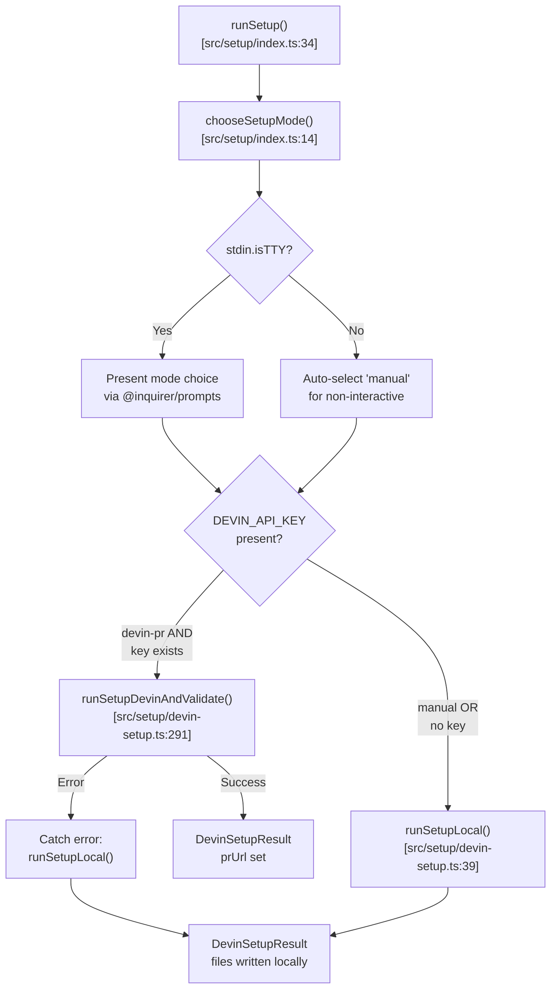
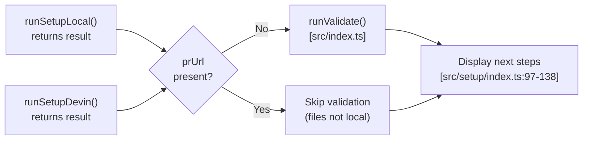
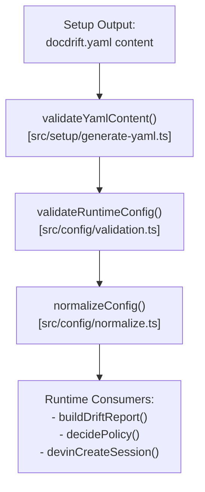

# Setup Overview

<details>
<summary>Relevant source files</summary>

The following files were used as context for generating this wiki page:

- [docs/guides/setup.md](docs/guides/setup.md)
- [src/setup/devin-setup.ts](src/setup/devin-setup.ts)
- [src/setup/index.ts](src/setup/index.ts)
- [src/setup/setup-prompt.ts](src/setup/setup-prompt.ts)
- [test/setup-devin-pr.test.ts](test/setup-devin-pr.test.ts)

</details>


This document explains the setup system architecture in docdrift, which provides two distinct paths for generating initial configuration: Manual mode (local detection with interactive prompts) and Devin PR mode (AI-powered PR-based setup). The setup system is responsible for creating `docdrift.yaml`, optional workflow files, and documentation context.

For detailed flow diagrams of each path, see [Manual Setup Flow](#5.2) and [Devin PR Setup Flow](#5.3). For information about how the system analyzes repositories, see [Repository Fingerprinting](#5.4) and [AI Inference and Heuristics](#5.5). For configuration schema details, see [Configuration System](#4).

## Setup Mode Architecture

The setup system implements a dual-path architecture with automatic fallback handling. The entry point [src/setup/index.ts:34-139]() orchestrates mode selection and delegates to specialized functions.

**Setup Mode Decision Flow**



**Sources:** [src/setup/index.ts:34-139](), [src/setup/devin-setup.ts:39-86](), [src/setup/devin-setup.ts:165-308]()

## Mode Selection Logic

The `chooseSetupMode()` function [src/setup/index.ts:14-32]() determines which setup path to follow:

| Condition | Mode Selected | Implementation |
|-----------|---------------|----------------|
| Non-interactive environment (`!process.stdin.isTTY`) | `"manual"` | Automatic fallback |
| Interactive with user choice | `"manual"` or `"devin-pr"` | Via `@inquirer/prompts.select` |
| `"devin-pr"` chosen but no `DEVIN_API_KEY` | `"manual"` | Forced fallback [src/setup/index.ts:44-47]() |
| `runSetupDevin()` throws error | `"manual"` | Exception fallback [src/setup/index.ts:54-70]() |

**Sources:** [src/setup/index.ts:14-32](), [src/setup/index.ts:39-71]()

## Entry Points

Two CLI commands provide access to the setup system:

### `docdrift setup` (Interactive)

Defined in [src/cli.ts](), calls `runSetup()` [src/setup/index.ts:34]() with default options. Always presents mode choice when interactive.

```bash
npx @devinnn/docdrift setup
npx @devinnn/docdrift setup --force
```

### `docdrift generate-yaml` (Scriptable)

Same as `setup` but designed for CI/scripted environments. Accepts additional options:

```bash
npx @devinnn/docdrift generate-yaml --output custom.yaml --force
npx @devinnn/docdrift generate-yaml --open-pr
```

| Option | Type | Purpose |
|--------|------|---------|
| `--output <path>` | `string` | Custom output path for `docdrift.yaml` |
| `--force` | `boolean` | Skip overwrite confirmation |
| `--open-pr` | `boolean` | Enable PR creation in Devin mode |

**Interface:** [src/setup/index.ts:5-11]()

**Sources:** [src/cli.ts](), [src/setup/index.ts:5-11](), [docs/guides/setup.md:1-46]()

## Setup Outcomes by Mode

The setup system returns a `DevinSetupResult` structure [src/setup/devin-setup.ts:28-36]() with different population patterns depending on the mode:

**Outcome Structure Mapping**

```mermaid
graph TB
    subgraph "Manual Mode Result"
        ManualFiles["Files Written Locally:<br/>- docdrift.yaml<br/>- .docdrift/DocDrift.md<br/>- .github/workflows/*.yml<br/>- .gitignore updated"]
        ManualResult["DevinSetupResult {<br/>  docdriftYaml: string<br/>  docDriftMd: string?<br/>  workflowYml: string?<br/>  summary: string<br/>  sessionUrl: empty<br/>  prUrl: undefined<br/>}"]
        ManualFiles -.written to disk.-> ManualResult
    end
    
    subgraph "Devin PR Mode Result (Success)"
        DevinPR["PR Created:<br/>branch: docdrift/setup"]
        DevinResult["DevinSetupResult {<br/>  docdriftYaml: string<br/>  docDriftMd: string?<br/>  workflowYml: string?<br/>  summary: string<br/>  sessionUrl: https://...<br/>  prUrl: https://github.com/.../pull/N<br/>}"]
        DevinNoFiles["NO files written locally<br/>(user must merge + pull)"]
        DevinPR --> DevinResult
        DevinResult --> DevinNoFiles
    end
    
    subgraph "Devin PR Mode Result (No PR)"
        DevinNoPR["Session finished<br/>but no PR created"]
        FallbackWrite["Files Written Locally<br/>(after confirmation)"]
        FallbackResult["DevinSetupResult {<br/>  ...<br/>  sessionUrl: https://...<br/>  prUrl: undefined<br/>}"]
        DevinNoPR --> FallbackWrite
        FallbackWrite --> FallbackResult
    end
```



**Critical Distinction:** When `prUrl` is set [src/setup/index.ts:73](), the system does NOT write files locally. The workflow expects the user to merge the PR and run `git pull`. This is detected at [src/setup/devin-setup.ts:218-227]().

**Sources:** [src/setup/index.ts:73-104](), [src/setup/devin-setup.ts:28-36](), [src/setup/devin-setup.ts:218-227]()

## Fallback Mechanisms

The setup system implements three layers of fallback:

### Layer 1: Missing API Key

```typescript
// src/setup/index.ts:44-47
if (mode === "devin-pr" && !hasDevinKey) {
  console.log("\nDEVIN_API_KEY is not set. Using manual setup instead.\n");
}
```

When user selects "devin-pr" but `process.env.DEVIN_API_KEY` is missing, forces manual mode.

### Layer 2: Devin Session Failure

```typescript
// src/setup/index.ts:54-70
try {
  result = await runSetupDevinAndValidate({...});
} catch (err) {
  console.error("\nDevin setup failed:", err instanceof Error ? err.message : String(err));
  console.log("\nFalling back to local detection...\n");
  usedLocalFallback = true;
  result = await runSetupLocal({...});
}
```

When `runSetupDevinAndValidate()` throws (session error, timeout, API failure), catches and falls back to `runSetupLocal()`.

### Layer 3: No PR Created

```typescript
// src/setup/devin-setup.ts:251-260
if (options.openPr && !prUrl) {
  const writeLocally = await confirm({
    message: "Devin did not open a PR. Write config locally from session output?",
    default: true,
  });
  if (!writeLocally) {
    throw new Error("Setup cancelled. Check session: " + session.url);
  }
}
```

When `openPr: true` but Devin session finishes without creating a PR, prompts user to write parsed output locally.

**Sources:** [src/setup/index.ts:44-70](), [src/setup/devin-setup.ts:251-260]()

## Validation and Next Steps

Both setup paths converge at validation. The system performs validation differently based on outcome:

**Validation Strategy**



**Next Steps Display Logic:** [src/setup/index.ts:73-138]()

| Outcome | Next Steps Displayed |
|---------|---------------------|
| `prUrl` present | 1. Merge PR in GitHub<br/>2. `git pull`<br/>3. `npx @devinnn/docdrift validate`<br/>4. Add `DEVIN_API_KEY` to repo secrets |
| Manual or local fallback | 1. `npx @devinnn/docdrift validate`<br/>2. `npx @devinnn/docdrift detect`<br/>3. Optional: Set up Devin for future use |

**Sources:** [src/setup/index.ts:73-138](), [src/setup/index.ts:106-109]()

## Integration with Configuration System

The setup system produces configuration consumed by the detection and policy subsystems:

**Configuration Flow from Setup**



The setup system uses `validateYamlContent()` [src/setup/generate-yaml.ts]() for pre-write validation, then delegates to the configuration system's validation pipeline described in [Configuration Schema](#4.1) and [Validation and Normalization](#4.2).

**Sources:** [src/setup/generate-yaml.ts](), [src/config/validation.ts](), [src/config/normalize.ts]()

## Function Reference

| Function | Location | Purpose |
|----------|----------|---------|
| `runSetup()` | [src/setup/index.ts:34]() | Main orchestrator; handles mode selection and fallback |
| `chooseSetupMode()` | [src/setup/index.ts:14]() | Presents mode choice in interactive environments |
| `runSetupLocal()` | [src/setup/devin-setup.ts:39]() | Manual path implementation |
| `runSetupDevin()` | [src/setup/devin-setup.ts:165]() | Devin PR path implementation |
| `runSetupDevinAndValidate()` | [src/setup/devin-setup.ts:291]() | Wrapper with validation for Devin path |
| `buildRepoFingerprint()` | [src/setup/repo-fingerprint.ts]() | Repo structure analysis (see [Repository Fingerprinting](#5.4)) |
| `inferConfigFromFingerprint()` | [src/setup/ai-infer.ts]() | AI inference or heuristic config generation (see [AI Inference](#5.5)) |
| `runInteractiveForm()` | [src/setup/interactive-form.ts]() | User prompts for manual mode (see [Manual Setup Flow](#5.2)) |
| `buildSetupPrompt()` | [src/setup/setup-prompt.ts:34]() | Devin prompt generation (see [Devin PR Setup Flow](#5.3)) |
| `parseSetupOutput()` | [src/setup/devin-setup.ts:154]() | Extract config from Devin session transcript |

**Sources:** [src/setup/index.ts:1-139](), [src/setup/devin-setup.ts:1-308](), [src/setup/setup-prompt.ts:1-98]()

---