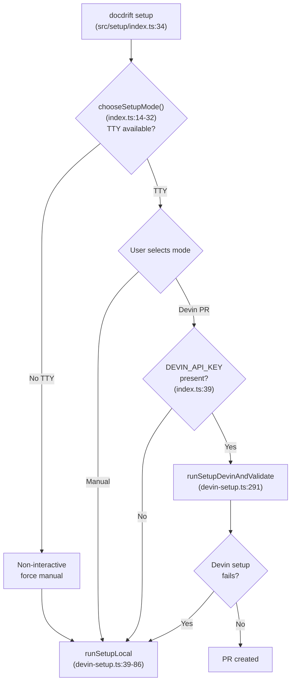
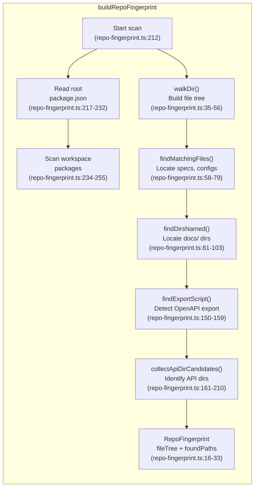
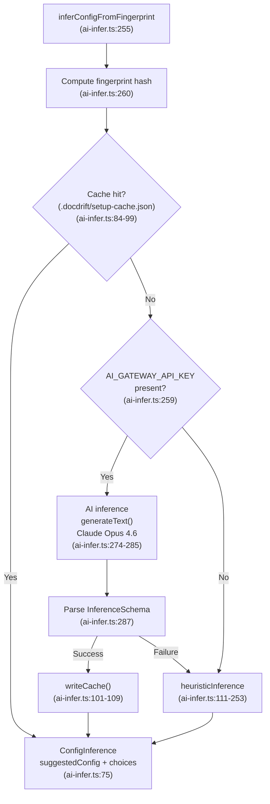
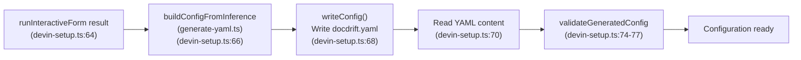
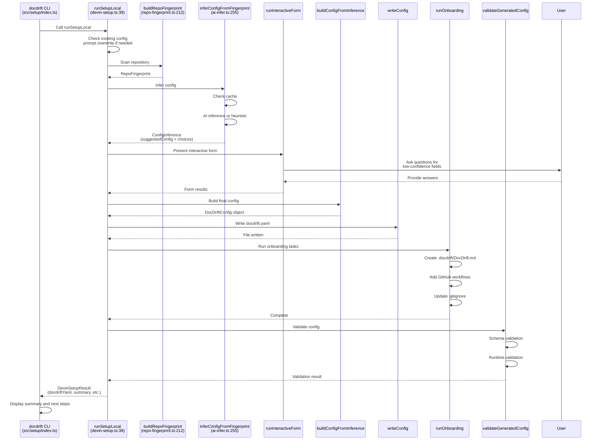

# Manual Setup Flow

<details>
<summary>Relevant source files</summary>

The following files were used as context for generating this wiki page:

- [src/setup/ai-infer.ts](src/setup/ai-infer.ts)
- [src/setup/devin-setup.ts](src/setup/devin-setup.ts)
- [src/setup/index.ts](src/setup/index.ts)
- [src/setup/prompts.ts](src/setup/prompts.ts)
- [src/setup/repo-fingerprint.ts](src/setup/repo-fingerprint.ts)
- [test/setup-infer.test.ts](test/setup-infer.test.ts)

</details>


## Purpose and Scope

This document describes the **manual setup flow**, one of two paths for generating a `docdrift.yaml` configuration file. The manual flow performs local repository scanning, configuration inference, and interactive user prompts to produce configuration files directly on disk.

For information about choosing between manual and Devin PR setup modes, see [Setup Overview](#5.1). For details on the Devin PR setup flow, see [Devin PR Setup Flow](#5.3). For deep dives into repository scanning and AI inference, see [Repository Fingerprinting](#5.4) and [AI Inference and Heuristics](#5.5).

---

## Entry Point and Mode Selection

The manual setup flow is triggered when the user runs `docdrift setup` or `docdrift generate-yaml` and either:
1. Explicitly selects "Manual" mode from the interactive prompt
2. The system falls back to manual mode due to missing `DEVIN_API_KEY`
3. The Devin PR setup fails and fallback is triggered

The mode selection logic resides in [src/setup/index.ts:14-32]() within the `chooseSetupMode` function. When manual mode is selected or forced, the system invokes `runSetupLocal` from [src/setup/devin-setup.ts:39-86]().

**Manual Setup Flow Trigger Points**



**Sources:** [src/setup/index.ts:14-71](), [src/setup/devin-setup.ts:39-86]()

---

## Phase 1: Repository Fingerprinting

The manual setup flow begins by scanning the repository to collect structural information. This is performed by `buildRepoFingerprint` from [src/setup/repo-fingerprint.ts:212-328]().

### Fingerprinting Process



**Sources:** [src/setup/repo-fingerprint.ts:212-328]()

### RepoFingerprint Structure

The fingerprinting process produces a `RepoFingerprint` object with the following structure:

| Field | Type | Description |
|-------|------|-------------|
| `fileTree` | `Record<string, string[]>` | Directory tree up to depth 3, excluding `node_modules`, `.git`, `dist`, etc. |
| `rootPackage` | `object` | Root `package.json` scripts, dependencies, workspaces |
| `workspacePackages` | `Array<object>` | Workspace package paths and scripts |
| `foundPaths` | `object` | Detected paths for specs, configs, docs, API dirs |

The `foundPaths` object contains:

| Field | Detected Files/Directories |
|-------|---------------------------|
| `openapi` | Files matching `openapi*.{json,yaml,yml}`, `api-spec.*`, `spec.*` |
| `swagger` | Files matching `swagger*.{json,yaml,yml}` |
| `docusaurusConfig` | Files matching `docusaurus.config.*` |
| `mkdocs` | Files matching `mkdocs.yml` |
| `vitepressConfig` | Files matching `vitepress.config.*` |
| `nextConfig` | Files matching `next.config.*` |
| `docsDirs` | Directories named `docs/` (up to depth 2) |
| `docsDirParents` | Parent directories of `docs/` dirs |
| `exportScript` | Script info for OpenAPI export (see below) |
| `apiDirs` | Candidate API/source directories |

**Sources:** [src/setup/repo-fingerprint.ts:16-33](), [src/setup/repo-fingerprint.ts:257-327]()

### Export Script Detection

The `findExportScript` function from [src/setup/repo-fingerprint.ts:150-159]() searches for scripts matching:
- Exact names: `openapi:export`, `openapi:generate`, `openapi:build`, `spec:export`, `spec:generate`
- Pattern: `/(openapi|swagger|spec).*(export|generate|build)/i`

When found, `inferExportFromScript` from [src/setup/repo-fingerprint.ts:106-139]() parses the script command to extract:
- **API directory**: Inferred from script file path (e.g., `tsx apps/api/scripts/export-openapi.ts` → `apps/api`)
- **Output path**: Extracted from script file content via regex `outputPath\s*[=:]\s*["'` ]([^"'` ]+)["'` ]`

**Sources:** [src/setup/repo-fingerprint.ts:106-159]()

---

## Phase 2: AI Inference or Heuristic Fallback

After fingerprinting, the system infers a suggested configuration. This is performed by `inferConfigFromFingerprint` from [src/setup/ai-infer.ts:255-295]().

### Inference Decision Flow



**Sources:** [src/setup/ai-infer.ts:255-295]()

### ConfigInference Output

The `inferConfigFromFingerprint` function returns a `ConfigInference` object defined by `InferenceSchema` at [src/setup/ai-infer.ts:25-73]():

| Field | Type | Description |
|-------|------|-------------|
| `suggestedConfig` | `object` | Partial `docdrift.yaml` configuration with inferred values |
| `choices` | `array` | Interactive questions for low-confidence fields |
| `skipQuestions` | `array` | Keys to skip if confidence is high |

Each item in `choices` contains:

```typescript
{
  key: string;              // Config field path (e.g., "docsite", "pathMappings.0.match")
  question: string;         // Question text
  options: Array<{          // Available options
    value: string;
    label: string;
    recommended?: boolean;
  }>;
  defaultIndex: number;     // Default option index
  help?: string;           // Help text
  warning?: string;        // Warning text
  confidence: "high" | "medium" | "low";
}
```

**Sources:** [src/setup/ai-infer.ts:25-75]()

### Heuristic Inference Logic

When AI inference is unavailable or fails, `heuristicInference` from [src/setup/ai-infer.ts:111-253]() uses deterministic rules:

**Heuristic Inference Decisions**

```mermaid
graph TB
    subgraph "heuristicInference (ai-infer.ts:111-253)"
        Start["Input: RepoFingerprint"]
        
        ExportCmd["Determine export command<br/>exportScript.scriptName<br/>or 'npm run openapi:export'<br/>(ai-infer.ts:115-118)"]
        
        OutputPath["Determine output path<br/>exportScript.inferredOutputPath<br/>or first openapi file<br/>or 'openapi/generated.json'<br/>(ai-infer.ts:120-122)"]
        
        Docsite["Determine docsite<br/>Priority:<br/>1. docusaurusConfig dir<br/>2. mkdocs dir<br/>3. vitepressConfig dir<br/>4. nextConfig dir<br/>5. docsDirParents[0]<br/>6. docs/ parent<br/>(ai-infer.ts:124-137)"]
        
        Published["Determine published spec path<br/>If openapi in docsite: use it<br/>Else: {docsite}/openapi/openapi.json<br/>or first openapi<br/>(ai-infer.ts:139-144)"]
        
        Verification["Determine verification commands<br/>Check for: docs:gen, docs:build<br/>Fallback: npm run build<br/>(ai-infer.ts:146-149)"]
        
        APIMatch["Determine API path glob<br/>apiDirs[0] or **/api/**<br/>(ai-infer.ts:151-152)"]
        
        Allowlist["Build allowlist<br/>openapi/**<br/>+ {docsite}/**<br/>+ openapi dir/**<br/>(ai-infer.ts:154-162)"]
        
        HumanReview["Build requireHumanReview<br/>{docsite}/docs/guides/**<br/>(ai-infer.ts:164-167)"]
        
        PathMappings["Build pathMappings<br/>match: API glob<br/>impacts: docsite docs + openapi<br/>(ai-infer.ts:169-179)"]
        
        Choices["Build choices array<br/>Add questions for:<br/>- export command (medium)<br/>- docsite (low if not found)<br/>- API path (low if not found)<br/>(ai-infer.ts:181-218)"]
        
        Output["Return ConfigInference"]
    end
    
    Start --> ExportCmd
    ExportCmd --> OutputPath
    OutputPath --> Docsite
    Docsite --> Published
    Published --> Verification
    Verification --> APIMatch
    APIMatch --> Allowlist
    Allowlist --> HumanReview
    HumanReview --> PathMappings
    PathMappings --> Choices
    Choices --> Output
```



**Sources:** [src/setup/ai-infer.ts:111-253]()

### Heuristic Examples

The test file [test/setup-infer.test.ts]() demonstrates heuristic behavior:

1. **Packages layout** (lines 42-64): Uses `packages/docs` and `packages/api` when fingerprint has monorepo structure
2. **Root layout** (lines 66-83): Uses root `docs/` and `openapi/` directories
3. **MkDocs** (lines 85-97): Detects `mkdocs.yml` and uses `docs/` as docsite
4. **Export script** (lines 99-119): Extracts command and API dir from `exportScript` field
5. **Missing docsite** (lines 121-132): Adds docsite to `choices` with low confidence when not detected
6. **Generic API glob** (lines 134-147): Falls back to `**/api/**` when no specific API dirs found

**Sources:** [test/setup-infer.test.ts:42-148]()

---

## Phase 3: Interactive Form

After inference, the system presents an interactive form to the user via `runInteractiveForm`. This function is imported but not defined in the provided files. Based on usage in [src/setup/devin-setup.ts:64](), it accepts `ConfigInference` and returns form results.

The form iterates through `choices` from the inference, presenting questions for fields with medium or low confidence. Users can accept defaults or provide custom values.

**Sources:** [src/setup/devin-setup.ts:63-64]()

---

## Phase 4: Config Generation and Validation

After the user completes the interactive form, the system generates the final configuration.

### Generation Pipeline



**Sources:** [src/setup/devin-setup.ts:66-77]()

### Validation

The `validateGeneratedConfig` function performs two-stage validation:

1. **Schema validation**: Ensures YAML content matches `docdrift.schema.json`
2. **Runtime validation**: Checks command existence, field constraints, mode requirements

If validation fails, setup throws an error with detailed error messages. See [Configuration System](#4) for validation details.

**Sources:** [src/setup/devin-setup.ts:74-77]()

---

## Phase 5: Onboarding

After successful configuration generation, `runOnboarding` from [src/setup/onboard.ts]() (referenced at [src/setup/devin-setup.ts:72]()) performs additional setup tasks based on form selections:

| Onboarding Task | Function | Description |
|----------------|----------|-------------|
| Custom instructions | `ensureDocdriftDir()` | Creates `.docdrift/DocDrift.md` for custom Devin instructions |
| GitHub Actions workflow | Workflow write | Adds `.github/workflows/docdrift.yml` and `docdrift-sla-check.yml` |
| Gitignore updates | `ensureGitignore()` | Adds `.docdrift/evidence/`, `.docdrift/state.json`, `.docdrift/metrics.json` |

**Sources:** [src/setup/devin-setup.ts:72]()

---

## Output Files

The manual setup flow writes files directly to disk (unlike Devin PR setup which creates a PR). The final output is reported in the `DevinSetupResult` structure from [src/setup/devin-setup.ts:28-36]():

### Primary Output

| File | Purpose | Written When |
|------|---------|--------------|
| `docdrift.yaml` | Main configuration file | Always |

### Optional Outputs

| File | Purpose | Written When |
|------|---------|--------------|
| `.docdrift/DocDrift.md` | Custom Devin instructions | `onboarding.addCustomInstructions` is true |
| `.github/workflows/docdrift.yml` | CI workflow for drift detection | `onboarding.addWorkflow` is true |
| `.github/workflows/docdrift-sla-check.yml` | SLA monitoring workflow | `onboarding.addWorkflow` is true |
| `.gitignore` (updated) | Ignore evidence and state files | Always |

**Sources:** [src/setup/devin-setup.ts:28-36](), [src/setup/devin-setup.ts:79-83]()

### Output Summary

After successful setup, the console displays:

```
docdrift setup complete

  docdrift.yaml     written and validated
  .docdrift/DocDrift.md   created (edit for custom instructions)
  .github/workflows/docdrift.yml         added
  .github/workflows/docdrift-sla-check.yml  added
  .gitignore        updated

Summary: Generated from repo fingerprint (local detection, no Devin).

Next steps:
  1. Run: npx @devinnn/docdrift validate   — verify config
  2. Run: npx @devinnn/docdrift detect     — check for drift
  3. (Optional) Add repo to Devin and set DEVIN_API_KEY to use Devin PR setup next time
```

**Sources:** [src/setup/index.ts:111-128]()

---

## Complete Manual Setup Flow

**End-to-End Manual Setup Sequence**



**Sources:** [src/setup/devin-setup.ts:39-86](), [src/setup/index.ts:34-139](), [src/setup/repo-fingerprint.ts:212-328](), [src/setup/ai-infer.ts:255-295]()

---

## Error Handling and Fallback

The manual setup flow includes several fallback mechanisms:

### Overwrite Protection

If `docdrift.yaml` exists and `--force` is not used, the system prompts for confirmation at [src/setup/devin-setup.ts:48-56]().

### AI Inference Fallback

When AI inference fails (missing API key, timeout, parsing error), the system falls back to `heuristicInference` at [src/setup/ai-infer.ts:292-294]().

### Validation Failure

If generated config fails validation, setup throws an error with detailed messages at [src/setup/devin-setup.ts:75-77]().

### Cache Strategy

The inference cache (`.docdrift/setup-cache.json`) prevents redundant AI calls. Cache is invalidated when fingerprint hash changes, implemented at [src/setup/ai-infer.ts:84-109]().

**Sources:** [src/setup/devin-setup.ts:48-77](), [src/setup/ai-infer.ts:84-109](), [src/setup/ai-infer.ts:292-294]()

---