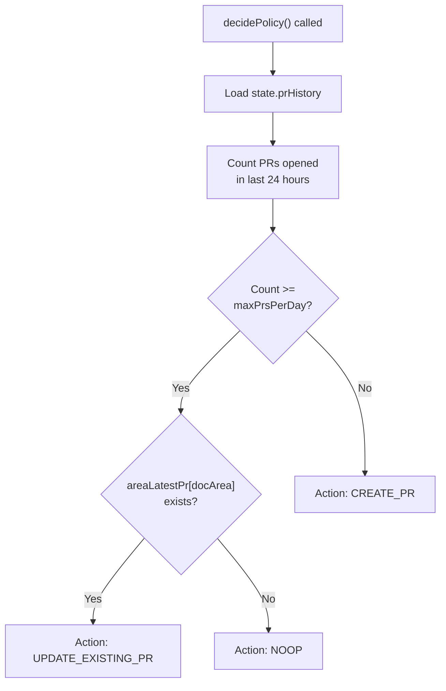
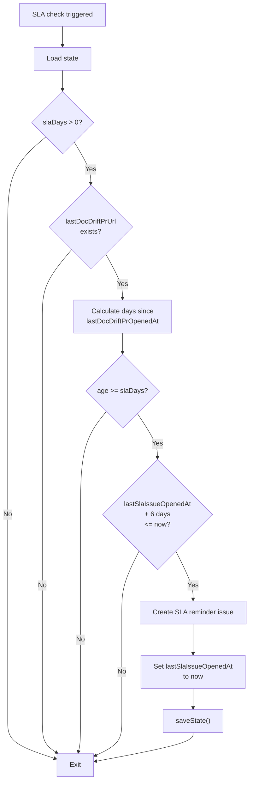
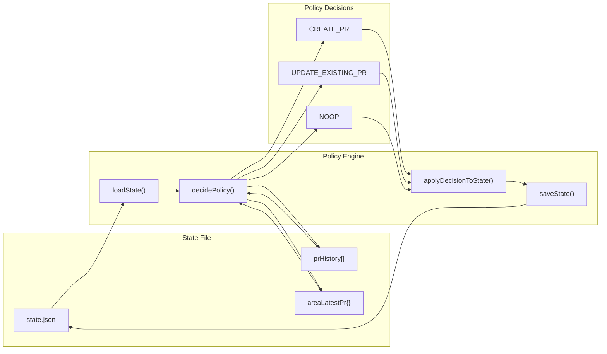
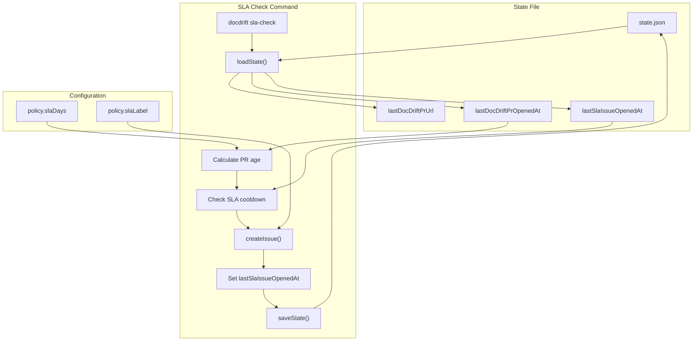

# state.json

<details>
<summary>Relevant source files</summary>

The following files were used as context for generating this wiki page:

- [docdrift-yml.md](docdrift-yml.md)
- [src/index.ts](src/index.ts)

</details>


## Purpose and Scope

The `state.json` file provides cross-run persistence for the docdrift system, tracking PR history, SLA timestamps, and per-docArea state to enable rate limiting, duplicate PR prevention, and SLA enforcement. This document describes the schema, lifecycle, and usage patterns of the state file.

For information about other output files, see [drift_report.json](#10.1), [metrics.json](#10.2), [run-output.json](#10.5), and [Evidence Directory](#10.4). For policy configuration that consumes state, see [Policy Configuration](#4.6) and [Policy Engine](#7).

---

## File Location and Initialization

The state file is stored at `.docdrift/state.json` in the repository root. The path is defined as `STATE_PATH` in [src/index.ts:662]().

```
.docdrift/
└── state.json
```

The state file is automatically created on the first run if it does not exist. If the file is missing or corrupted, the system initializes an empty state with default values. State is loaded at the beginning of each run and saved after policy decisions are applied.

**Sources:** [src/index.ts:662]()

---

## State Schema

### State Structure

The state object contains five top-level fields that track cross-run metadata:

| Field | Type | Purpose |
|-------|------|---------|
| `prHistory` | `array` | Array of PR records tracking when PRs were opened (for rate limiting) |
| `areaLatestPr` | `object` | Map of docArea name to most recent PR URL for that area |
| `lastDocDriftPrUrl` | `string` | URL of the most recently opened doc-drift PR (any area) |
| `lastDocDriftPrOpenedAt` | `string` | ISO 8601 timestamp when `lastDocDriftPrUrl` was opened |
| `lastSlaIssueOpenedAt` | `string` | ISO 8601 timestamp when the last SLA reminder issue was created |

### State Type Definition

```typescript
interface State {
  prHistory: Array<{
    docArea: string;
    openedAt: string;  // ISO 8601 timestamp
    prUrl?: string;
  }>;
  areaLatestPr: {
    [docArea: string]: string;  // docArea -> PR URL
  };
  lastDocDriftPrUrl?: string;
  lastDocDriftPrOpenedAt?: string;  // ISO 8601 timestamp
  lastSlaIssueOpenedAt?: string;    // ISO 8601 timestamp
}
```

### Example State File

```json
{
  "prHistory": [
    {
      "docArea": "docsite",
      "openedAt": "2024-01-15T14:32:00.000Z",
      "prUrl": "https://github.com/org/repo/pull/123"
    }
  ],
  "areaLatestPr": {
    "docsite": "https://github.com/org/repo/pull/123"
  },
  "lastDocDriftPrUrl": "https://github.com/org/repo/pull/123",
  "lastDocDriftPrOpenedAt": "2024-01-15T14:32:00.000Z",
  "lastSlaIssueOpenedAt": "2024-01-08T09:00:00.000Z"
}
```

**Sources:** [src/index.ts:281-331](), [src/index.ts:391-393](), [src/index.ts:473-475]()

---

## State Lifecycle

### Load → Decision → Update → Save Flow

```mermaid
graph TB
    subgraph "Run Initialization"
        RunStart["docdrift run starts"]
        LoadState["loadState()"]
        DefaultState["Empty state if missing"]
    end
    
    subgraph "Policy Decision Phase"
        DecidePolicy["decidePolicy()"]
        CheckHistory["Check prHistory<br/>against maxPrsPerDay"]
        CheckLatest["Check areaLatestPr<br/>for existing PR"]
        Decision["PolicyDecision<br/>CREATE_PR | UPDATE_EXISTING_PR | NOOP"]
    end
    
    subgraph "Devin Session Execution"
        ExecuteSession["executeSessionSingle()"]
        SessionOutcome["SessionOutcome<br/>PR_OPENED | BLOCKED | NO_CHANGE"]
    end
    
    subgraph "State Update Phase"
        ApplyDecision["applyDecisionToState()"]
        UpdateHistory["Add to prHistory"]
        UpdateLatest["Update areaLatestPr"]
        UpdateTimestamps["Set lastDocDriftPrUrl,<br/>lastDocDriftPrOpenedAt"]
    end
    
    subgraph "SLA Check Phase"
        SLACheck["Check lastDocDriftPrOpenedAt"]
        SLAElapsed{"≥ slaDays?"}
        SLACooldown{"lastSlaIssueOpenedAt<br/>cooldown?"}
        CreateSLA["Create SLA issue"]
        UpdateSLATime["Set lastSlaIssueOpenedAt"]
    end
    
    subgraph "Persistence"
        SaveState["saveState()"]
        WriteFile["Write .docdrift/state.json"]
    end
    
    RunStart --> LoadState
    LoadState --> DefaultState
    DefaultState --> DecidePolicy
    
    DecidePolicy --> CheckHistory
    CheckHistory --> CheckLatest
    CheckLatest --> Decision
    
    Decision --> ExecuteSession
    ExecuteSession --> SessionOutcome
    
    SessionOutcome --> ApplyDecision
    ApplyDecision --> UpdateHistory
    UpdateHistory --> UpdateLatest
    UpdateLatest --> UpdateTimestamps
    
    UpdateTimestamps --> SLACheck
    SLACheck --> SLAElapsed
    SLAElapsed -->|Yes| SLACooldown
    SLAElapsed -->|No| SaveState
    SLACooldown -->|Ready| CreateSLA
    SLACooldown -->|Not ready| SaveState
    CreateSLA --> UpdateSLATime
    UpdateSLATime --> SaveState
    
    SaveState --> WriteFile
```



**Sources:** [src/index.ts:244-530](), [src/index.ts:542-595]()

---

## Usage in Policy Engine

### Rate Limiting with prHistory

The policy engine uses `prHistory` to enforce `policy.prCaps.maxPrsPerDay`. When deciding whether to create a PR, it counts PRs opened in the last 24 hours.

**Policy Decision Flow:**



**Implementation:** The policy engine reads `state.prHistory` in [src/policy/engine.ts]() (referenced by [src/index.ts:294-302]()) to determine if the daily PR cap has been reached. If the cap is reached and an existing PR exists for the docArea, the decision is `UPDATE_EXISTING_PR`. If the cap is reached but no existing PR exists, the decision is `NOOP` with reason "PR cap reached".

**Sources:** [src/index.ts:294-334]()

---

### Duplicate PR Prevention with areaLatestPr

The `areaLatestPr` map tracks the most recent PR URL for each docArea. This enables two critical behaviors:

1. **Bundling updates into existing PRs:** When `UPDATE_EXISTING_PR` is the policy decision, the system instructs Devin to push to the existing PR's branch rather than creating a new PR.

2. **Preventing duplicate PRs for the same area:** If a PR is already open for a docArea, subsequent drift detections for that area update the existing PR instead of opening a new one.

**Example scenario:**

```json
{
  "areaLatestPr": {
    "docsite": "https://github.com/org/repo/pull/456"
  }
}
```

When drift is detected for `docsite` again, the system:
1. Checks `state.areaLatestPr["docsite"]`
2. Finds existing PR #456
3. Sets `existingDocdriftPr` parameter when creating Devin session
4. Devin pushes to the existing PR's branch

**Sources:** [src/index.ts:316-334](), [src/index.ts:339-348]()

---

### State Updates via applyDecisionToState

After a Devin session completes, the system calls `applyDecisionToState()` to update the state based on the policy decision and session outcome.

**Update Logic:**

| Decision | Outcome | State Changes |
|----------|---------|---------------|
| `CREATE_PR` | `PR_OPENED` | Add to `prHistory`, set `areaLatestPr[docArea]`, update `lastDocDriftPrUrl`, set `lastDocDriftPrOpenedAt` |
| `CREATE_PR` | `BLOCKED` | Add to `prHistory` (no PR URL) |
| `CREATE_PR` | `NO_CHANGE` | Add to `prHistory` (no PR URL) |
| `UPDATE_EXISTING_PR` | Any | No state changes (existing PR remains tracked) |
| `NOOP` | Any | No state changes |

**Code Reference:** [src/index.ts:324-331](), [src/index.ts:464-476]()

**Sources:** [src/index.ts:324-476]()

---

## SLA Tracking

### SLA Check Mechanism

The state file enables SLA (Service Level Agreement) enforcement by tracking when PRs are opened and when SLA reminder issues are created.

**SLA Fields:**

- **`lastDocDriftPrUrl`**: The most recent doc-drift PR URL (any docArea)
- **`lastDocDriftPrOpenedAt`**: When `lastDocDriftPrUrl` was opened (ISO 8601 timestamp)
- **`lastSlaIssueOpenedAt`**: When the last SLA reminder issue was created (ISO 8601 timestamp)

### SLA Check Logic



**Implementation Details:**

1. **Age Calculation:** `(Date.now() - Date.parse(lastDocDriftPrOpenedAt)) / (24 * 60 * 60 * 1000)`
2. **Cooldown Period:** 6 days (prevents issue spam)
3. **SLA Threshold:** Configured via `policy.slaDays` (default: 7)

**Code Reference:** [src/index.ts:498-520]() for inline SLA check during run, [src/index.ts:542-595]() for standalone `sla-check` command.

**Sources:** [src/index.ts:498-520](), [src/index.ts:542-595]()

---

## State Persistence Operations

### loadState Function

The `loadState()` function is called at the beginning of each run and SLA check. It reads `.docdrift/state.json` and returns a state object. If the file does not exist or is invalid, it returns an empty state with default values.

**Usage:**

```typescript
let state = loadState();  // Returns State object
```

**Caller Locations:**
- [src/index.ts:281]() - Main run entry point
- [src/index.ts:573]() - SLA check command

**Sources:** [src/index.ts:281](), [src/index.ts:573]()

---

### saveState Function

The `saveState()` function writes the state object to `.docdrift/state.json`. It is called after state updates to persist changes across runs.

**Usage:**

```typescript
saveState(state);  // Writes to .docdrift/state.json
```

**Caller Locations:**
- [src/index.ts:331]() - After policy decision applied (NOOP or UPDATE_EXISTING_PR)
- [src/index.ts:477]() - After Devin session completes
- [src/index.ts:518]() - After SLA issue created (inline check)
- [src/index.ts:592]() - After SLA issue created (sla-check command)

**Sources:** [src/index.ts:331](), [src/index.ts:477](), [src/index.ts:518](), [src/index.ts:592]()

---

## State Fields Reference

### prHistory

**Type:** `Array<{ docArea: string; openedAt: string; prUrl?: string }>`

**Purpose:** Tracks all PRs opened by docdrift for rate limiting enforcement.

**Structure:**
```json
{
  "prHistory": [
    {
      "docArea": "docsite",
      "openedAt": "2024-01-15T14:32:00.000Z",
      "prUrl": "https://github.com/org/repo/pull/123"
    }
  ]
}
```

**Fields:**
- `docArea`: The docArea name for this PR (e.g., "docsite", "api_reference")
- `openedAt`: ISO 8601 timestamp when the PR was opened
- `prUrl`: (Optional) GitHub PR URL if a PR was successfully opened

**Consumers:**
- Policy engine for rate limiting ([src/index.ts:294-302]())

**Sources:** [src/index.ts:294-334]()

---

### areaLatestPr

**Type:** `{ [docArea: string]: string }`

**Purpose:** Maps each docArea to its most recent PR URL, enabling PR updates and duplicate prevention.

**Structure:**
```json
{
  "areaLatestPr": {
    "docsite": "https://github.com/org/repo/pull/456",
    "api_reference": "https://github.com/org/repo/pull/789"
  }
}
```

**Behavior:**
- Updated when `CREATE_PR` decision results in `PR_OPENED` outcome
- Checked during policy decisions to determine if an existing PR can be updated
- Used to pass `existingDocdriftPr` parameter to Devin session

**Consumers:**
- Policy engine ([src/index.ts:316]())
- Devin session setup ([src/index.ts:339-348]())

**Sources:** [src/index.ts:316-348]()

---

### lastDocDriftPrUrl

**Type:** `string | undefined`

**Purpose:** Stores the URL of the most recently opened doc-drift PR (across all docAreas).

**Example:**
```json
{
  "lastDocDriftPrUrl": "https://github.com/org/repo/pull/123"
}
```

**Behavior:**
- Set when `outcome === "PR_OPENED"` ([src/index.ts:391](), [src/index.ts:473]())
- Used for SLA checks ([src/index.ts:499]())

**Consumers:**
- SLA check logic (inline and standalone command)

**Sources:** [src/index.ts:391](), [src/index.ts:473](), [src/index.ts:499]()

---

### lastDocDriftPrOpenedAt

**Type:** `string | undefined` (ISO 8601 timestamp)

**Purpose:** Tracks when `lastDocDriftPrUrl` was opened, enabling age-based SLA enforcement.

**Example:**
```json
{
  "lastDocDriftPrOpenedAt": "2024-01-15T14:32:00.000Z"
}
```

**Behavior:**
- Set to `new Date().toISOString()` when `outcome === "PR_OPENED"` ([src/index.ts:392](), [src/index.ts:474]())
- Compared against current time to calculate PR age ([src/index.ts:500-501]())

**Consumers:**
- SLA check logic (inline and standalone command)

**Sources:** [src/index.ts:392](), [src/index.ts:474](), [src/index.ts:500-501]()

---

### lastSlaIssueOpenedAt

**Type:** `string | undefined` (ISO 8601 timestamp)

**Purpose:** Tracks when the last SLA reminder issue was created, enforcing a 6-day cooldown to prevent issue spam.

**Example:**
```json
{
  "lastSlaIssueOpenedAt": "2024-01-08T09:00:00.000Z"
}
```

**Behavior:**
- Set to `new Date().toISOString()` after SLA issue creation ([src/index.ts:517](), [src/index.ts:591]())
- Checked before creating new SLA issue to enforce cooldown ([src/index.ts:502-504](), [src/index.ts:574-579]())
- Cooldown period: 6 days (`6 * 24 * 60 * 60 * 1000` milliseconds)

**Consumers:**
- SLA check logic (inline and standalone command)

**Sources:** [src/index.ts:502-504](), [src/index.ts:517](), [src/index.ts:574-579](), [src/index.ts:591]()

---

## Integration with Other Systems

### State and Policy Engine Integration



**Sources:** [src/index.ts:244-530]()

---

### State and SLA Check Integration



**Sources:** [src/index.ts:542-595]()

---

## State Lifecycle Examples

### Example 1: First Run (Empty State)

**Initial state.json:**
```json
{}
```

**After first PR opened:**
```json
{
  "prHistory": [
    {
      "docArea": "docsite",
      "openedAt": "2024-01-15T14:32:00.000Z",
      "prUrl": "https://github.com/org/repo/pull/123"
    }
  ],
  "areaLatestPr": {
    "docsite": "https://github.com/org/repo/pull/123"
  },
  "lastDocDriftPrUrl": "https://github.com/org/repo/pull/123",
  "lastDocDriftPrOpenedAt": "2024-01-15T14:32:00.000Z"
}
```

---

### Example 2: PR Cap Reached (UPDATE_EXISTING_PR)

**State before run:**
```json
{
  "prHistory": [
    {
      "docArea": "docsite",
      "openedAt": "2024-01-15T14:32:00.000Z",
      "prUrl": "https://github.com/org/repo/pull/123"
    }
  ],
  "areaLatestPr": {
    "docsite": "https://github.com/org/repo/pull/123"
  }
}
```

**Policy decision:** `UPDATE_EXISTING_PR` (PR cap of 1 per day reached, existing PR available)

**State after run:** No changes (existing PR is reused)

---

### Example 3: SLA Issue Created

**State before SLA check:**
```json
{
  "lastDocDriftPrUrl": "https://github.com/org/repo/pull/123",
  "lastDocDriftPrOpenedAt": "2024-01-08T09:00:00.000Z"
}
```

**Conditions:**
- PR is 8 days old (exceeds `slaDays: 7`)
- No recent SLA issue (cooldown satisfied)

**State after SLA check:**
```json
{
  "lastDocDriftPrUrl": "https://github.com/org/repo/pull/123",
  "lastDocDriftPrOpenedAt": "2024-01-08T09:00:00.000Z",
  "lastSlaIssueOpenedAt": "2024-01-16T10:15:00.000Z"
}
```

---

## Manual State Management

### Viewing State

```bash
cat .docdrift/state.json | jq
```

### Resetting State

To clear all state (e.g., to reset rate limiting counters or SLA tracking):

```bash
rm .docdrift/state.json
```

The next run will initialize a fresh state.

### Editing State

**Warning:** Manual state edits can cause unexpected behavior. Use caution.

To manually reset PR history:
```bash
jq '.prHistory = []' .docdrift/state.json > .docdrift/state.json.tmp
mv .docdrift/state.json.tmp .docdrift/state.json
```

To manually clear SLA timestamp:
```bash
jq 'del(.lastSlaIssueOpenedAt)' .docdrift/state.json > .docdrift/state.json.tmp
mv .docdrift/state.json.tmp .docdrift/state.json
```

---

## State and GitHub Actions

In CI/CD environments (GitHub Actions), the state file persists across workflow runs because it is committed to the repository under `.docdrift/`.

**Workflow considerations:**

1. **State is checked into the repository:** Unlike build artifacts, `state.json` is tracked by Git and committed after each run.
2. **Concurrent runs:** If multiple workflow runs execute simultaneously, the last run to commit wins. This is generally safe because state updates are additive (PR history grows, timestamps update).
3. **Branch isolation:** Each branch has its own state file. Merging branches may cause state conflicts (resolve by accepting the target branch's state).

**Best practice:** Add `.docdrift/state.json` to your repository's default commit patterns so state is automatically committed by CI.

**Sources:** [.github/workflows/devin-doc-drift.yml (if present)]()

---

## Summary

The `state.json` file is the persistence layer for docdrift's cross-run behavior:

| Capability | State Field(s) | Purpose |
|------------|---------------|---------|
| **Rate Limiting** | `prHistory` | Enforce `policy.prCaps.maxPrsPerDay` by counting recent PRs |
| **Duplicate Prevention** | `areaLatestPr` | Track existing PRs per docArea to enable updates instead of new PRs |
| **SLA Enforcement** | `lastDocDriftPrUrl`, `lastDocDriftPrOpenedAt`, `lastSlaIssueOpenedAt` | Calculate PR age and create reminder issues after `slaDays` |
| **Cross-Run Continuity** | All fields | Maintain state across workflow runs, manual executions, and scheduled jobs |

The state file is loaded at the start of each run, consulted during policy decisions, updated after Devin sessions, and saved to disk for the next run.

**Sources:** [src/index.ts:244-595](), [docdrift-yml.md:1-441]()

---