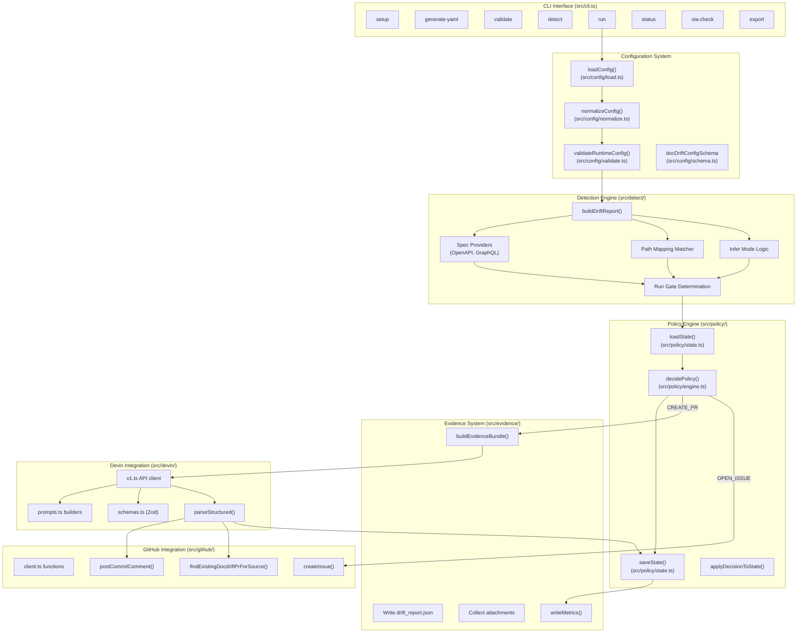
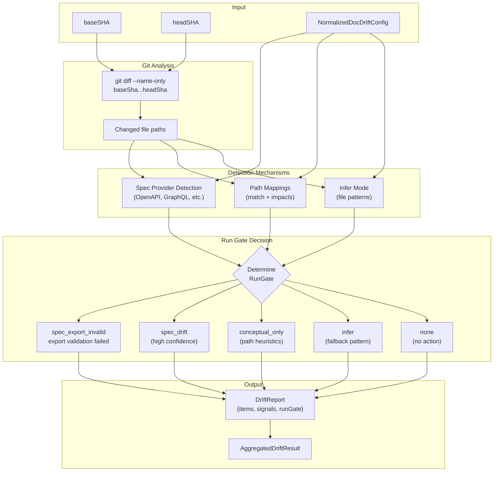
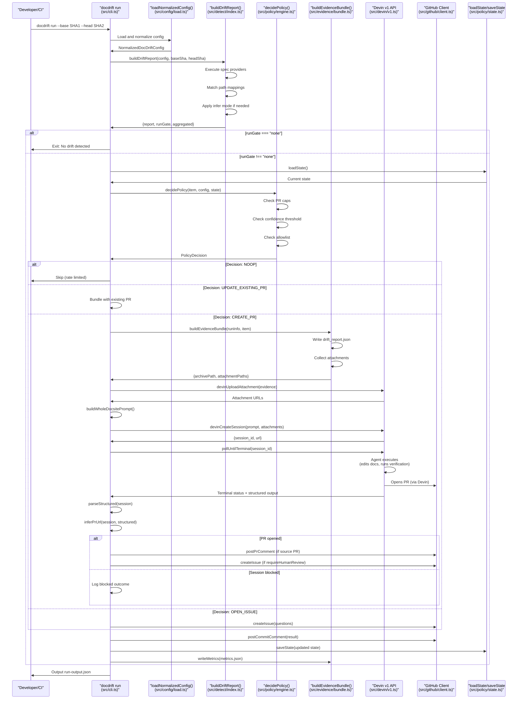
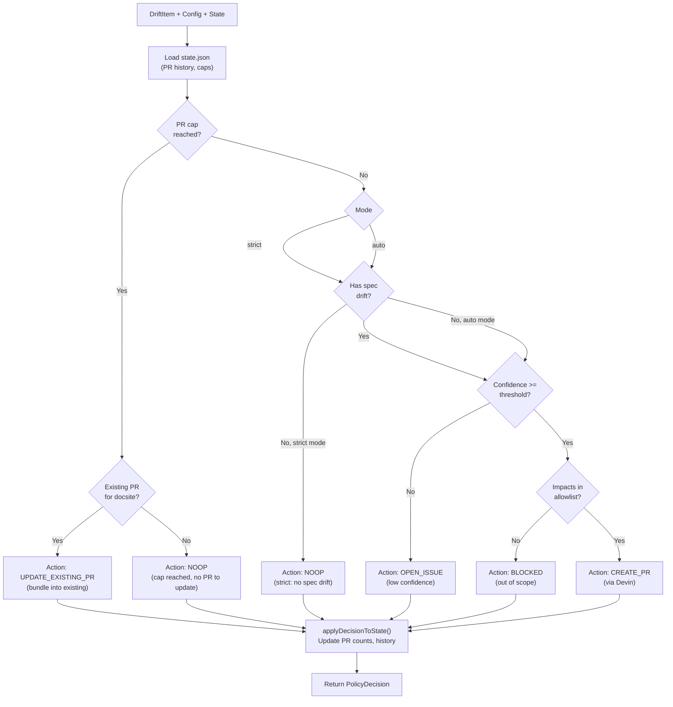
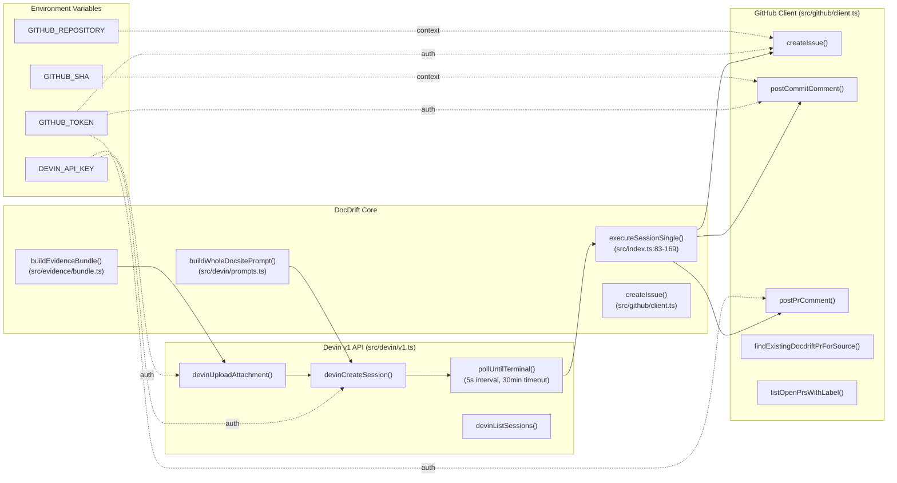
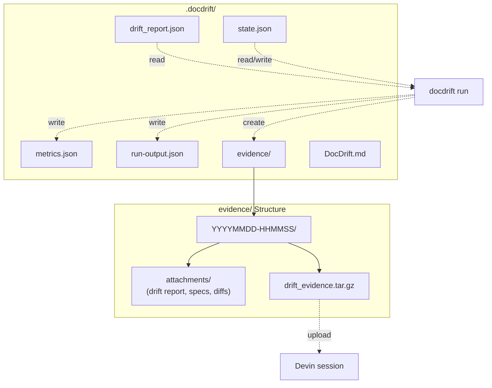
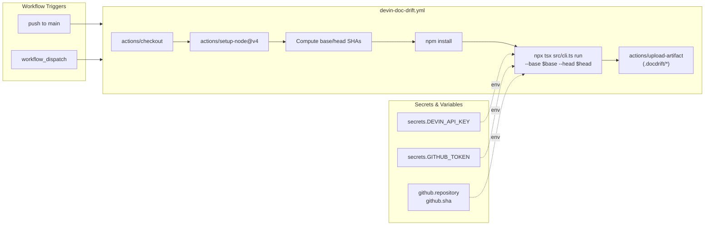

<details>
<summary>Relevant source files</summary>

The following files were used as context for generating this wiki page:

- [.gitignore](.gitignore)
- [README.md](README.md)
- [docdrift-yml.md](docdrift-yml.md)
- [package.json](package.json)
- [src/index.ts](src/index.ts)

</details>


This document provides a high-level introduction to DocDrift, its purpose, architecture, and core workflow. DocDrift is a documentation drift detection and remediation system that automatically identifies when code changes cause documentation to become outdated, then orchestrates low-noise, evidence-based fixes through AI-powered sessions or human escalation.

For detailed information about specific subsystems, see:
- Architecture internals: [Architecture](#1.1)
- Terminology and design principles: [Key Concepts](#1.2)
- Configuration details: [Configuration](#2.2)
- CLI command reference: [CLI Reference](#3)

## Purpose and Problem Statement

DocDrift addresses the problem of documentation falling out of sync with code after merges to production branches. When developers update API endpoints, change authentication logic, or modify data models, the corresponding documentation often remains unchanged, leading to inaccurate developer resources.

DocDrift operates as both a CLI tool (`docdrift`) and GitHub Action that:
1. **Detects** documentation drift through three tiers of analysis
2. **Decides** appropriate remediation strategies using a policy engine
3. **Remediates** by either opening PRs via Devin AI or escalating to GitHub issues
4. **Enforces** low-noise guarantees through bundling, caps, and confidence gating

**Sources:** [README.md:1-5](), [README.md:16-21]()

## System Components

The system consists of six major subsystems that work together to detect and remediate documentation drift:

**Title: System Architecture and Components**



**Key Code Entities:**

| Component | Primary Files | Core Functions/Classes |
|-----------|--------------|------------------------|
| CLI Interface | [src/cli.ts]() | 8 command handlers: `setup`, `generate-yaml`, `validate`, `detect`, `run`, `status`, `sla-check`, `export` |
| Configuration | [src/config/load.ts](), [src/config/normalize.ts](), [src/config/schema.ts]() | `loadConfig()`, `normalizeConfig()`, `docDriftConfigSchema` |
| Detection Engine | [src/detect/index.ts]() | `buildDriftReport()`, spec provider execution, run gate logic |
| Policy Engine | [src/policy/engine.ts](), [src/policy/state.ts]() | `decidePolicy()`, `loadState()`, `saveState()`, `applyDecisionToState()` |
| Evidence System | [src/evidence/bundle.ts]() | `buildEvidenceBundle()`, `writeMetrics()` |
| Devin Integration | [src/devin/v1.ts](), [src/devin/prompts.ts](), [src/devin/schemas.ts]() | `devinCreateSession()`, `pollUntilTerminal()`, `buildWholeDocsitePrompt()` |
| GitHub Integration | [src/github/client.ts]() | `createIssue()`, `postCommitComment()`, `findExistingDocdriftPrForSource()` |
| Setup System | [src/setup/index.ts](), [src/setup/infer.ts]() | `runSetup()`, `inferConfigFromFingerprint()` |

**Sources:** [src/cli.ts](), [src/index.ts](), [src/config/](), [src/detect/](), [src/policy/](), [src/devin/](), [src/github/](), [package.json:7-9]()

## Detection System

DocDrift uses a multi-mechanism detection system that analyzes code changes for documentation impacts:

**Title: Detection Mechanisms and Run Gates**



**Detection Mechanisms:**

| Mechanism | Implementation | Confidence | When It Runs |
|-----------|---------------|------------|--------------|
| **Spec Providers** | Compares generated vs published API specs | High | When `specProviders` configured (OpenAPI, GraphQL, etc.) |
| **Path Mappings** | Matches code changes to doc impacts via globs | Medium | When `pathMappings` configured with `match` patterns |
| **Infer Mode** | Pattern-based detection from file changes | Lower | Fallback when spec/path detection yields no results |

**Run Gates:**

The detection system produces one of five run gates that determine whether remediation proceeds:

- `spec_export_invalid`: Exported spec failed completeness validation (e.g. missing requestBody); highest priority — fix spec source first, then re-export and update docs
- `spec_drift`: API specification changes detected
- `conceptual_only`: Only path heuristics matched, no spec changes
- `infer`: Inferred from file patterns (mode-dependent behavior)
- `none`: No drift detected, exit early

**Detection Flow:**

1. `buildDriftReport()` executes Git analysis to get changed files between `baseSha` and `headSha`
2. Each configured spec provider (OpenAPI, GraphQL, etc.) runs its detection logic
3. Path mappings are evaluated: if changed files match `match` patterns, corresponding `impacts` are added
4. Run gate is determined based on detection results and configuration mode (`strict` vs `auto`)
5. Output includes `DriftReport` with items array and `AggregatedDriftResult` for session creation

**Sources:** [src/detect/index.ts](), [src/config/schema.ts](), [README.md:47-56]()

## Core Workflow

The primary workflow executes when `docdrift run` is invoked, either locally or in CI:

**Title: Drift Detection to Remediation Pipeline**



**Key Steps:**

1. **Configuration Loading** [src/config/load.ts](): Loads and normalizes `docdrift.yaml` into `NormalizedDocDriftConfig`
2. **Validation** [src/config/validate.ts](): Checks schema correctness and command availability
3. **Detection** [src/detect/index.ts](): Executes spec providers, path mappings, determines run gate
4. **Run Gate Check** [src/index.ts:266-270](): Early exit if `runGate === "none"`
5. **Policy Decision** [src/policy/engine.ts](): Evaluates `decidePolicy()` for action: `CREATE_PR`, `UPDATE_EXISTING_PR`, `OPEN_ISSUE`, or `NOOP`
6. **Evidence Bundling** [src/evidence/bundle.ts](): Creates evidence bundle with drift report and attachments
7. **Devin Session** [src/devin/v1.ts](): Uploads attachments, creates session, polls until terminal status
8. **Outcome Processing** [src/index.ts:128-169](): Parses structured output, infers PR URL, determines session outcome
9. **GitHub Actions** [src/github/client.ts](): Posts comments, creates issues, handles requireHumanReview
10. **State Persistence** [src/policy/state.ts](): Updates `state.json` with PR counts, timestamps, history

**Sources:** [src/index.ts:244-530](), [src/detect/index.ts](), [src/policy/engine.ts](), [src/devin/v1.ts](), [src/github/client.ts]()

## Policy Engine and Low-Noise Guarantees

The policy engine enforces low-noise operation through multiple gating mechanisms defined in `decidePolicy()`:

**Title: Policy Decision Logic**



**Policy Mechanisms:**

| Mechanism | Field | Purpose |
|-----------|-------|---------|
| **PR Caps** | `policy.prCaps.maxPrsPerDay` | Limit PRs created per day (default: 1) |
| **Single Session** | Whole-docsite approach | One Devin session, one PR per run |
| **Confidence Gating** | `policy.confidence.autopatchThreshold` | Only automate high-confidence fixes (default: 0.8) |
| **Mode Gating** | `mode: strict \| auto` | `strict`: only run on spec drift; `auto`: also run on path matches |
| **Allowlist** | `policy.allowlist` | Only modify files matching these globs |
| **requireHumanReview** | Top-level config array | Create issue when PR touches these paths |
| **SLA Enforcement** | `policy.slaDays` | Reminder issue for PRs open 7+ days (default: 7) |

**Low-Noise Design Principles:**

1. **Single PR per Run**: Whole-docsite session creates one consolidated PR, not per-file or per-area PRs
2. **Rate Limiting**: `maxPrsPerDay` prevents PR spam (existing PRs are updated in-place)
3. **Spec-Driven Gate**: In `strict` mode, no spec drift = no session (eliminates false positives)
4. **Confidence Threshold**: Low-confidence drift escalates to issues instead of PRs
5. **Update-in-Place**: For pull request triggers, finds existing `docdrift/pr-{N}` PR and updates it
6. **Allowlist Enforcement**: Devin cannot modify files outside configured allowlist
7. **Human Review Flags**: Automatically creates review issues when conceptual docs are touched

**Sources:** [src/policy/engine.ts](), [src/index.ts:294-334](), [README.md:94-101](), [src/policy/state.ts]()

## External Service Integration

DocDrift integrates with two external platforms to orchestrate remediation:

**Title: External Service Integration Architecture**



**Integration Points:**

### Devin v1 API Integration

Functions in [src/devin/v1.ts]():

| Function | Endpoint | Purpose |
|----------|----------|---------|
| `devinUploadAttachment()` | `POST /v1/attachments` | Upload evidence tarball (multipart/form-data) |
| `devinCreateSession()` | `POST /v1/sessions` | Create session with prompt, attachments, structured output schema |
| `devinGetSession()` | `GET /v1/sessions/:id` | Query session status and results |
| `devinListSessions()` | `GET /v1/sessions` | List sessions filtered by tag |
| `pollUntilTerminal()` | Polling wrapper | Polls every 5 seconds until terminal status (30min timeout) |

**Terminal Statuses:** `finished`, `blocked`, `error`, `cancelled`, `done`, `complete`, `terminated`

**Structured Output:** Sessions use `PatchPlanSchema` (Zod schema) defined in [src/devin/schemas.ts]() to validate AI responses

### GitHub API Integration

Functions in [src/github/client.ts]():

| Function | API | Purpose |
|----------|-----|---------|
| `createIssue()` | `POST /repos/:owner/:repo/issues` | Create issues for human review, blocked sessions, SLA reminders |
| `postCommitComment()` | `POST /repos/:owner/:repo/commits/:sha/comments` | Post run summary on head commit |
| `postPrComment()` | `POST /repos/:owner/:repo/issues/:number/comments` | Link doc PR to source PR |
| `findExistingDocdriftPrForSource()` | `GET /repos/:owner/:repo/pulls` | Find existing `docdrift/pr-{N}` PR for update-in-place |
| `listOpenPrsWithLabel()` | `GET /repos/:owner/:repo/pulls` | List PRs for SLA check |

**Authentication:**
- `DEVIN_API_KEY`: Required for all Devin API calls [README.md:36]()
- `GITHUB_TOKEN`: Required for GitHub API calls, auto-provided in GitHub Actions
- `GITHUB_REPOSITORY`: Format `owner/repo`, identifies target repository
- `GITHUB_SHA`: Commit SHA for posting comments

**Sources:** [src/devin/v1.ts](), [src/github/client.ts](), [src/index.ts:83-169](), [src/devin/prompts.ts](), [src/devin/schemas.ts]()

## Output Artifacts

All DocDrift outputs are written to `.docdrift/` directory in the consuming repository:

**Title: Output Artifacts and Directory Structure**



**Artifact Descriptions:**

| File | Purpose | Written By | Structure |
|------|---------|-----------|-----------|
| `drift_report.json` | Detection results | `buildDriftReport()` | `{ runInfo, items: DriftItem[], aggregated }` |
| `state.json` | PR caps, history, SLA tracking | `saveState()` | `{ prHistory, areaLatestPr, lastDocDriftPrUrl, lastSlaIssueOpenedAt }` |
| `metrics.json` | Performance metrics | `writeMetrics()` | `{ driftItemsDetected, prsOpened, issuesOpened, timeToSessionTerminalMs }` |
| `run-output.json` | Quick reference output | `runDocDrift()` | `{ docArea, decision, outcome, summary, sessionUrl, prUrl, issueUrl }` |
| `evidence/{timestamp}/` | Evidence bundles | `buildEvidenceBundle()` | Timestamped directory with attachments and archive |
| `DocDrift.md` | System documentation | `runSetup()` | Generated explanation of docdrift configuration |

**Evidence Bundle Contents:**
- `drift_report.json`: Full drift detection report with signals and impacts
- `openapi/generated.json`: Generated API spec (if applicable)
- `openapi/published.json`: Published API spec (if applicable)
- Git diff output and changed file lists
- `drift_evidence.tar.gz`: Compressed archive uploaded to Devin

**Git Ignore:**
The following files in `.docdrift/` are ignored by Git [.gitignore:5-8]():
- `evidence/`
- `*.log`
- `state.json`
- `run-output.json`

**Sources:** [src/evidence/bundle.ts](), [src/policy/state.ts](), [src/index.ts:282-293](), [.gitignore:5-8](), [README.md:80-88]()

## GitHub Actions Integration

DocDrift provides a GitHub Actions workflow for continuous integration:



**Workflow Configuration:** [.github/workflows/devin-doc-drift.yml:1-65]()

**Key Steps:**
1. Checkout repository with full history (`fetch-depth: 0`)
2. Setup Node.js 20.x
3. Compute base SHA (previous commit) and head SHA (current commit)
4. Install dependencies with `npm install`
5. Run `docdrift run` with computed SHAs
6. Upload `.docdrift/` directory as artifacts

**Required Secrets:**
- `DEVIN_API_KEY`: Add in repository settings → Secrets → Actions

**Provided Automatically:**
- `GITHUB_TOKEN`: Auto-generated token with repository access
- `github.repository`: Repository identifier (`owner/repo`)
- `github.sha`: Current commit SHA

**Sources:** [.github/workflows/devin-doc-drift.yml:1-65](), [README.md:102-110](), [README.md:119-128]()

## NPM Package Distribution

DocDrift is published as `@devinnn/docdrift` on npm, enabling usage in any repository:

**Package Metadata:** [package.json:1-42]()
- **Binary:** `docdrift` CLI command [package.json:7-9]()
- **Entry Point:** `dist/src/index.js` [package.json:6]()
- **Files Included:** `dist/src/` only [package.json:14]()
- **Node Requirement:** `>= 20` [package.json:11-13]()

**Usage in External Repositories:**

```bash
# Install globally or use npx
npx @devinnn/docdrift validate
npx @devinnn/docdrift detect --base SHA1 --head SHA2

# With environment for full run
DEVIN_API_KEY=... GITHUB_TOKEN=... GITHUB_REPOSITORY=owner/repo \
  npx @devinnn/docdrift run --base SHA1 --head SHA2
```

**Repository Requirements:**
1. Create `docdrift.yaml` at repository root
2. Configure detection commands and doc areas
3. Set `DEVIN_API_KEY` secret in CI
4. Optional: Add `.docdrift/` to `.gitignore`

**Sources:** [package.json:1-42](), [README.md:149-178]()

---