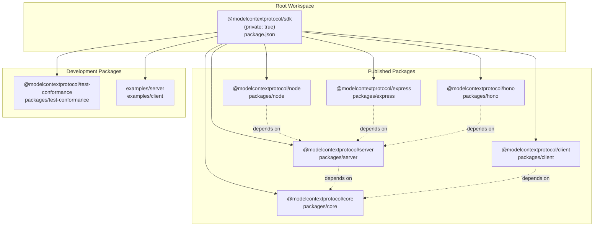
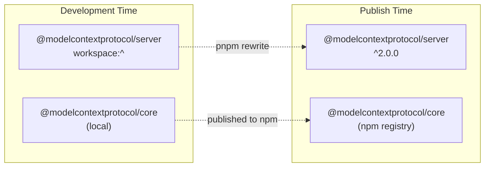
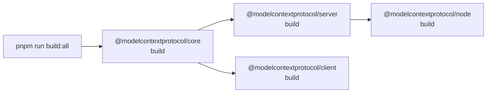
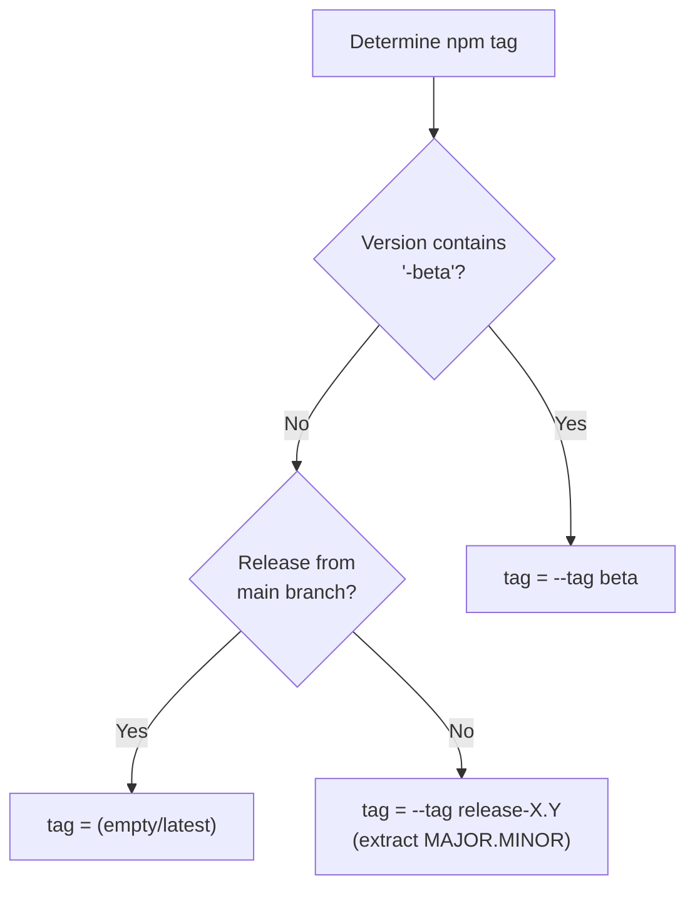
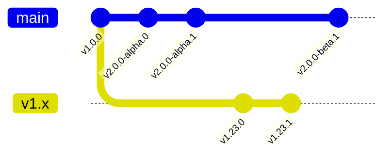
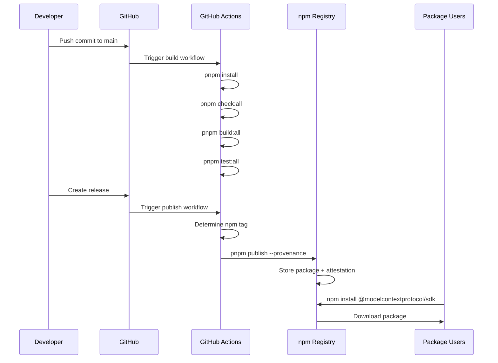
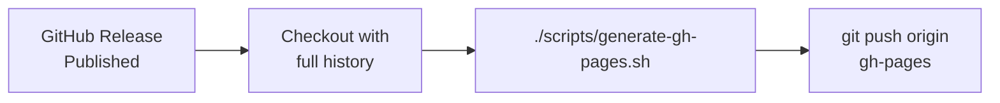

# Package Structure and Distribution

<details>
<summary>Relevant source files</summary>

The following files were used as context for generating this wiki page:

- [.github/workflows/main.yml](.github/workflows/main.yml)
- [package-lock.json](package-lock.json)
- [package.json](package.json)

</details>


This page documents how the MCP TypeScript SDK packages are structured, built, and distributed to npm. It covers the monorepo organization, build tooling, dependency management, and the npm publishing strategy with version-specific tags.

For information about the release process and Changesets workflow, see [CI/CD and Release Process](#8.3). For guidance on building and testing locally, see [Building and Testing](#8.1).

---

## Monorepo Organization

The SDK uses a **pnpm workspace** to manage multiple interdependent packages within a single repository. The workspace configuration is defined in the root [package.json:1-81]().



**Root Package Metadata**

The root package is marked `"private": true` [package.json:3]() to prevent accidental publication. It serves as the workspace coordinator and contains shared development tooling. Key metadata includes:

| Field | Value | Purpose |
|-------|-------|---------|
| `name` | `@modelcontextprotocol/sdk` | Workspace identifier |
| `version` | `2.0.0-alpha.0` | Coordinated version |
| `packageManager` | `pnpm@10.26.1` | Enforces pnpm version |
| `engines.node` | `>=20` | Minimum Node.js version |
| `engines.pnpm` | `>=10.24.0` | Minimum pnpm version |

**Sources:** [package.json:1-22]()

---

## Package Dependencies and Workspace Protocol

Packages within the monorepo use the **workspace protocol** (`workspace:^`) to reference each other [package.json:49-51](). This ensures that:

1. Local packages always use the current workspace versions during development
2. Published packages reference published npm versions (pnpm automatically rewrites `workspace:^` to actual version ranges on publish)



**Peer Dependencies**

The SDK requires Zod as a peer dependency to avoid version conflicts in consuming applications. From [package-lock.json:57-67]():

```json
"peerDependencies": {
    "zod": "^3.25 || ^4.0"
}
```

This allows users to install either Zod v3 or v4, with the SDK supporting both versions.

**Sources:** [package.json:49-51](), [package-lock.json:57-67]()

---

## Build System and Output Structure

Each package is built independently using its own build configuration. The root workspace provides coordinated build commands:

```bash
pnpm run build:all      # Build all packages
pnpm run prepack:all    # Prepare packages for publishing
pnpm run typecheck:all  # Type-check all packages
```

**Build Orchestration**

The [package.json:30]() script `build:all` executes `pnpm -r build`, which runs the `build` script in each package in dependency order.



Each package typically produces:
- **ESM modules** in `dist/` directory
- **TypeScript declarations** (`.d.ts` files)
- **Source maps** for debugging
- **package.json** with `exports` field mapping

**Sources:** [package.json:24-31]()

---

## npm Publishing Strategy

Packages are published to npm with **provenance attestation** to ensure supply chain security. The publishing workflow is defined in [.github/workflows/main.yml:61-110]().

**Provenance Publishing**

The `publish` job runs only on `release` events and uses GitHub Actions' OIDC token to sign package attestations [.github/workflows/main.yml:67-69]():

```yaml
permissions:
    contents: read
    id-token: write
```

The publish command [.github/workflows/main.yml:108]():
```bash
pnpm publish --provenance --access public ${{ steps.npm-tag.outputs.tag }}
```

**npm Tag Strategy**

The SDK uses a sophisticated tagging strategy to support multiple release streams:

| Release Type | Condition | npm Tag | Example |
|--------------|-----------|---------|---------|
| **Latest (main)** | From `main` branch | `latest` (default) | `npm install @modelcontextprotocol/sdk` |
| **Beta** | Version contains `-beta` | `beta` | `npm install @modelcontextprotocol/sdk@beta` |
| **Maintenance** | From version branch (e.g., `v1.x`) | `release-X.Y` | `npm install @modelcontextprotocol/sdk@release-1.23` |

The tag determination logic [.github/workflows/main.yml:87-106]():



**Maintenance Tag Example**

For a release of version `1.23.5` from branch `v1.x`:
1. Extract major.minor: `1.23`
2. Publish with tag: `--tag release-1.23`
3. Users can install: `npm install @modelcontextprotocol/sdk@release-1.23`
4. Tag updates if `1.23.6` is released later

This allows users to pin to specific minor version streams while receiving patches.

**Sources:** [.github/workflows/main.yml:87-110]()

---

## Package Exports and Entry Points

Each published package defines its public API through the `exports` field in its `package.json`. This provides:

1. **Subpath exports** for accessing specific modules
2. **Conditional exports** for different module systems (ESM)
3. **TypeScript type definitions** via `types` conditions

**Typical Package Structure**

```
@modelcontextprotocol/server/
├── package.json
├── dist/
│   ├── index.js
│   ├── index.d.ts
│   ├── McpServer.js
│   ├── McpServer.d.ts
│   └── ...
└── src/
    └── ...
```

The `exports` field maps import paths to physical files:

```json
{
  "exports": {
    ".": {
      "types": "./dist/index.d.ts",
      "default": "./dist/index.js"
    },
    "./McpServer": {
      "types": "./dist/McpServer.d.ts",
      "default": "./dist/McpServer.js"
    }
  }
}
```

**Sources:** General package structure based on monorepo organization

---

## Version Management

The repository uses **Changesets** for version management, as indicated by [package.json:46-47](). This provides:

- Coordinated version bumps across packages
- Automatic changelog generation
- Pre-release (beta) support

Version information is centralized in the root [package.json:4]() and propagated to child packages during the release process.

**Version Branches**

The repository maintains multiple version streams:



| Branch | Purpose | npm Tag |
|--------|---------|---------|
| `main` | Active development (v2) | `latest` or `beta` |
| `v1.x` | Maintenance releases (v1) | `release-1.x` |

**Sources:** [package.json:4,46-47](), [.github/workflows/main.yml:1-150]()

---

## Distribution Workflow

The complete distribution process from commit to npm:



**Build Workflow** [.github/workflows/main.yml:14-34]():
1. Install pnpm and dependencies
2. Run `check:all` (typecheck + lint)
3. Run `build:all`

**Test Workflow** [.github/workflows/main.yml:36-59]():
1. Run on Node.js 20, 22, 24
2. Execute `test:all` (unit + conformance tests)

**Publish Workflow** [.github/workflows/main.yml:61-110]():
1. Wait for build and test to pass
2. Determine appropriate npm tag
3. Publish with provenance and access public
4. Use `NODE_AUTH_TOKEN` from GitHub secrets

**Sources:** [.github/workflows/main.yml:14-110]()

---

## GitHub Pages Documentation

The repository automatically publishes API documentation to GitHub Pages on each release [.github/workflows/main.yml:114-149]():



The `publish-gh-pages` job:
1. Runs after successful `publish` job [.github/workflows/main.yml:117]()
2. Requires `contents: write` permission [.github/workflows/main.yml:120]()
3. Fetches full git history [.github/workflows/main.yml:125]()
4. Executes `scripts/generate-gh-pages.sh` with the release tag [.github/workflows/main.yml:146]()
5. Pushes generated documentation to `gh-pages` branch [.github/workflows/main.yml:149]()

This provides versioned documentation at `https://modelcontextprotocol.github.io/typescript-sdk/`.

**Sources:** [.github/workflows/main.yml:114-149]()

---

## Package Access and Scope

All published packages use the `@modelcontextprotocol` scope and are published as **public packages** [.github/workflows/main.yml:108]().

**Scoped Package Benefits**:
- Namespace isolation (prevents name conflicts)
- Clear ownership and branding
- Ability to manage access across package set

**Installation Examples**:

```bash
# Install latest version
npm install @modelcontextprotocol/server

# Install specific version
npm install @modelcontextprotocol/server@2.0.0

# Install from beta tag
npm install @modelcontextprotocol/server@beta

# Install from maintenance tag (v1.23 stream)
npm install @modelcontextprotocol/server@release-1.23
```

**Sources:** [.github/workflows/main.yml:108](), [package.json:2]()

---

## Summary

The MCP TypeScript SDK distribution strategy emphasizes:

1. **Monorepo coordination**: All packages versioned together with workspace protocol
2. **Build consistency**: Shared tooling and coordinated build scripts
3. **Supply chain security**: Provenance attestation on all published packages
4. **Flexible versioning**: Beta and maintenance release streams via npm tags
5. **Type safety**: Peer dependencies for schema validation (Zod)
6. **Documentation**: Automated API docs generation and publishing

This structure enables independent package consumption while maintaining consistency across the SDK ecosystem.

---