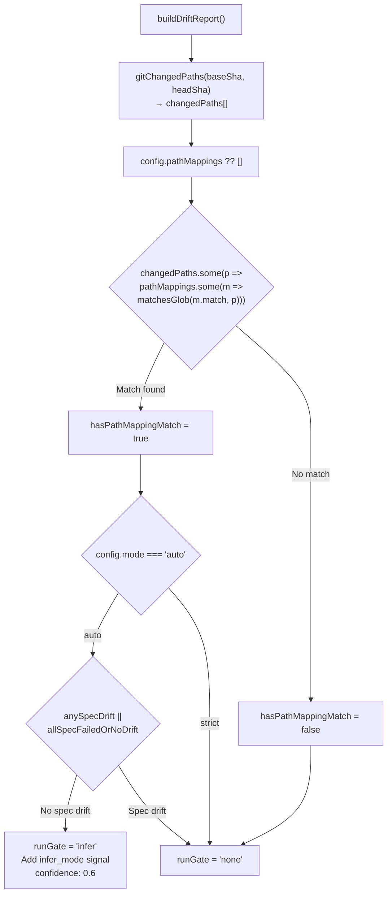
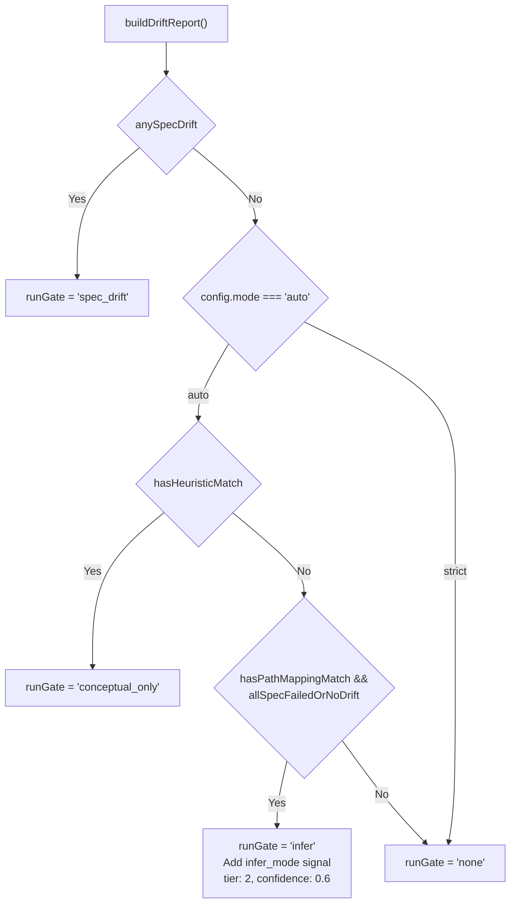
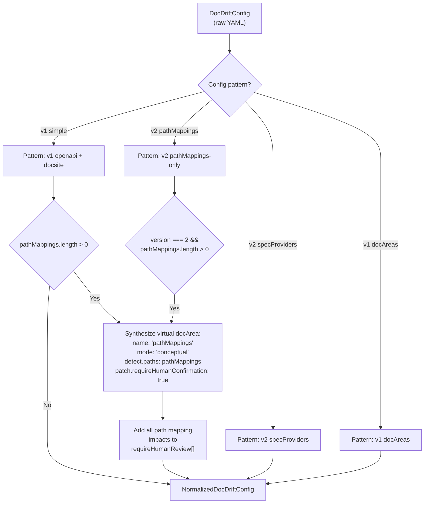
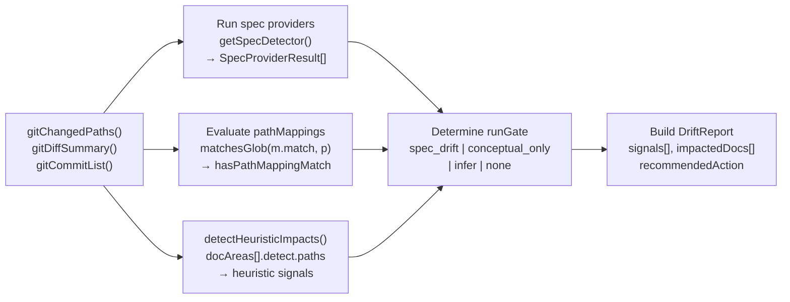
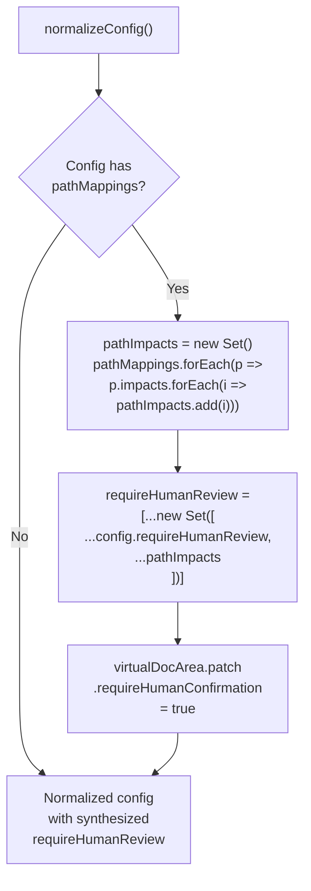

# Path Mappings

<details>
<summary>Relevant source files</summary>

The following files were used as context for generating this wiki page:

- [.gitignore](.gitignore)
- [README.md](README.md)
- [docdrift.schema.json](docdrift.schema.json)
- [src/config/normalize.ts](src/config/normalize.ts)
- [src/config/schema.ts](src/config/schema.ts)
- [src/detect/index.ts](src/detect/index.ts)
- [test/config.test.ts](test/config.test.ts)

</details>


## Purpose and Scope

Path mappings provide a mechanism for explicitly declaring which code paths impact which documentation areas. When code files matching a `match` pattern change, the system recognizes that documentation files listed in `impacts` may need updates. This allows teams to encode domain knowledge about code-to-docs relationships without relying solely on API specification drift detection.

Path mappings are defined in the `pathMappings` array at the top level of `docdrift.yaml`. They also appear as `detect.paths` within individual `docAreas` configurations. For information about how path mappings participate in drift detection alongside spec providers, see [Drift Detection System](#6). For information about run gate logic that determines when path mappings trigger actions, see [Run Gate Logic](#6.4).

---

## Configuration Structure

Path mappings follow the `pathRuleSchema` structure, which defines two required fields:

| Field | Type | Description |
|-------|------|-------------|
| `match` | string | Glob pattern matching source code file paths |
| `impacts` | string[] | Array of glob patterns identifying impacted documentation paths |

**Sources:** [src/config/schema.ts:3-7](), [docdrift.schema.json:160-185]()

### Schema Definition

The `pathRuleSchema` is a Zod schema that validates path mapping objects:

```typescript
pathRuleSchema = z.object({
  match: z.string().min(1),
  impacts: z.array(z.string().min(1)).min(1),
})
```

This schema is reused in two locations:
- Top-level `pathMappings` array
- `docAreas[].detect.paths` arrays

**Sources:** [src/config/schema.ts:3-7](), [src/config/schema.ts:108](), [src/config/schema.ts:44]()

### Example Configuration

```yaml
version: 2
mode: auto
pathMappings:
  - match: "src/api/users/**"
    impacts: 
      - "docs/api/users.mdx"
      - "docs/guides/user-management.mdx"
  - match: "packages/auth/**"
    impacts:
      - "docs/guides/authentication.mdx"
```

**Sources:** [test/config.test.ts:79-101]()

---

## Detection Behavior

Path mappings participate in the drift detection pipeline through two mechanisms: direct evaluation during detection and normalization into virtual `docAreas`.

### Path Mapping Evaluation Flow



**Sources:** [src/detect/index.ts:99-136]()

### Detection Code Path

The detection logic evaluates path mappings in `buildDriftReport`:

1. **Load changed paths:** `gitChangedPaths(baseSha, headSha)` retrieves all files modified in the commit range
2. **Load path mappings:** Extract `config.pathMappings` from normalized config
3. **Pattern matching:** Use `matchesGlob(m.match, p)` to test if any changed path matches any mapping pattern
4. **Set flag:** `hasPathMappingMatch` boolean indicates whether any mappings triggered
5. **Run gate evaluation:** Path mapping matches only affect behavior in `auto` mode when spec drift is absent

**Sources:** [src/detect/index.ts:99-103](), [src/detect/index.ts:111-136]()

---

## Mode Interaction

The `mode` configuration field controls whether path mappings can trigger drift remediation sessions:

| Mode | Behavior with Path Mappings |
|------|----------------------------|
| `strict` | Path mappings are evaluated but **never** trigger sessions. Only spec drift triggers sessions. |
| `auto` | Path mappings can trigger sessions when `hasPathMappingMatch && !anySpecDrift && allSpecFailedOrNoDrift`. Sets `runGate = "infer"`. |

### Run Gate Logic with Path Mappings



**Sources:** [src/detect/index.ts:105-136](), [README.md:49-52]()

### Strict Mode Behavior

In `strict` mode (default), path mappings are recorded but do not trigger Devin sessions. The run gate remains `"none"` even when path mapping matches occur. This prevents noise from conceptual documentation changes that may not require immediate AI remediation.

**Sources:** [src/config/schema.ts:110](), [src/detect/index.ts:105-108]()

### Auto Mode Behavior

In `auto` mode, path mapping matches can trigger the `"infer"` run gate. This occurs only when:
- No spec drift detected (`!anySpecDrift`)
- Either no spec providers configured, or all spec providers failed/returned no drift (`allSpecFailedOrNoDrift`)
- At least one changed path matches a path mapping pattern

When `runGate = "infer"` is set, the system creates a low-confidence signal and proceeds to policy evaluation.

**Sources:** [src/detect/index.ts:111-136]()

---

## Normalization and Virtual DocAreas

The configuration normalization process (`normalizeConfig`) transforms top-level `pathMappings` into virtual `docAreas` for internal processing. This allows the detection and policy systems to treat path-based rules uniformly with spec-based rules.

### Normalization Logic



**Sources:** [src/config/normalize.ts:1-142]()

### Simple Config Pattern

When a v1 config uses the simple pattern (`openapi` + `docsite` + `pathMappings`), normalization performs these transformations:

1. **Extract impacts:** Collect all `impacts` from all path mappings into a set
2. **Update `requireHumanReview`:** Add all impact paths to the `requireHumanReview` array
3. **Create virtual docArea:** Synthesize a `docArea` with:
   - `name: "pathMappings"`
   - `mode: "conceptual"`
   - `owners.reviewers: ["docdrift"]`
   - `detect.paths: config.pathMappings`
   - `patch.requireHumanConfirmation: true`
4. **Append to docAreas:** Add the virtual docArea to the `docAreas` array

**Sources:** [src/config/normalize.ts:51-65]()

### V2 PathMappings-Only Pattern

In v2 configs, `pathMappings` can exist without `openapi` or `docsite` fields. This pattern is useful for documentation that doesn't track API specifications:

```yaml
version: 2
mode: auto
pathMappings:
  - match: "src/components/**"
    impacts: ["docs/components/**"]
devin: { apiVersion: "v1" }
policy:
  # ... policy fields
```

Normalization handles this by:
1. Setting `specProviders: []` (empty array)
2. Setting `openapi` to dummy values
3. Deriving `docsite` from impact path roots
4. Creating the virtual "pathMappings" docArea

**Sources:** [src/config/normalize.ts:106-128](), [test/config.test.ts:126-153]()

### Code Entity Mapping

| Configuration Entity | Normalized Entity | Code Reference |
|---------------------|-------------------|----------------|
| `config.pathMappings[]` | `docAreas[].detect.paths[]` | [src/config/normalize.ts:51-65]() |
| `pathMapping.impacts[]` | `requireHumanReview[]` | [src/config/normalize.ts:53-54]() |
| Virtual docArea mode | Always `"conceptual"` | [src/config/normalize.ts:59]() |
| Virtual docArea confirmation | Always `true` | [src/config/normalize.ts:62]() |

**Sources:** [src/config/normalize.ts:51-128](), [src/config/schema.ts:160-169]()

---

## Integration with Detection Pipeline

Path mappings integrate into the broader drift detection system through multiple touchpoints:

### Detection Pipeline Integration



**Sources:** [src/detect/index.ts:13-198]()

### Relationship to Other Detection Mechanisms

Path mappings are one of three detection mechanisms:

1. **Spec providers** (highest priority): OpenAPI, GraphQL, etc. diff detection
2. **Heuristic path impacts** (medium priority): `docAreas[].detect.paths` evaluation
3. **Path mappings** (lowest priority): Top-level `pathMappings` evaluation

The system evaluates all three mechanisms, but the run gate prioritizes spec drift > heuristics > path mappings.

**Sources:** [src/detect/index.ts:58-136]()

### Signal Generation

When path mappings trigger in `auto` mode, the system generates an `infer_mode` signal:

```typescript
signals.push({
  kind: "infer_mode",
  tier: 2,
  confidence: 0.6,
  evidence: [path.join(evidenceRoot, "changeset.json")],
});
```

This signal has:
- **Kind:** `"infer_mode"` (distinct from `"heuristic_path_impact"`)
- **Tier:** 2 (lower than spec drift tier 1)
- **Confidence:** 0.6 (below typical auto-patch threshold of 0.8)
- **Evidence:** Points to `changeset.json` containing Git metadata

**Sources:** [src/detect/index.ts:127-134]()

---

## Usage Patterns

### Pattern 1: Complementing Spec Providers

Path mappings work alongside spec providers to catch conceptual documentation drift:

```yaml
version: 2
mode: auto
specProviders:
  - format: openapi3
    current:
      type: export
      command: npm run openapi:export
      outputPath: openapi/generated.json
    published: docs/api/openapi.json
pathMappings:
  - match: "src/core/auth/**"
    impacts: ["docs/guides/authentication.mdx"]
  - match: "src/models/**"
    impacts: ["docs/guides/data-model.mdx"]
```

In this pattern:
- Spec drift triggers immediate sessions (high confidence)
- Path mapping matches trigger sessions only when no spec drift detected (low confidence)

**Sources:** [test/config.test.ts:155-177]()

### Pattern 2: Standalone Documentation Tracking

For projects without API specifications, path mappings can work alone in v2 configs:

```yaml
version: 2
mode: auto
pathMappings:
  - match: "src/components/Button/**"
    impacts: ["docs/components/button.mdx"]
  - match: "src/components/Modal/**"
    impacts: ["docs/components/modal.mdx"]
docsite: docs/
devin: { apiVersion: "v1" }
policy:
  allowlist: ["docs/**"]
  verification: { commands: ["npm run docs:build"] }
  # ... other required fields
```

**Sources:** [src/config/schema.ts:150](), [src/config/normalize.ts:106-128]()

### Pattern 3: Fine-Grained DocArea Paths

Path mappings can also appear within `docAreas` for fine-grained control:

```yaml
version: 2
docAreas:
  - name: component_docs
    mode: conceptual
    owners: { reviewers: ["team/frontend"] }
    detect:
      paths:
        - match: "src/components/**"
          impacts: ["docs/components/**"]
    patch:
      targets: ["docs/components/**"]
      requireHumanConfirmation: true
```

This pattern provides per-area ownership and review policies.

**Sources:** [src/config/schema.ts:42-74]()

---

## Human Review Synthesis

Path mapping `impacts` automatically populate the `requireHumanReview` array during normalization. This ensures that documentation areas updated via path mapping heuristics trigger GitHub issue creation rather than automatic PRs when confidence is low.

### Review Synthesis Logic



**Sources:** [src/config/normalize.ts:51-65](), [src/config/normalize.ts:109-119]()

### Review Policy Impact

When a changed path matches a path mapping and affects an impacted documentation path in `requireHumanReview`, the policy engine may decide to open an issue rather than a PR. This gives human reviewers control over conceptual documentation updates that lack high-confidence spec-based signals.

**Sources:** [src/config/normalize.ts:53-54](), [src/config/normalize.ts:111]()

---

## Limitations and Constraints

### No Recursive Matching

Glob patterns in `match` and `impacts` use the `matchesGlob` utility, which performs standard glob matching without recursion beyond `**` patterns. Complex nested patterns may not match as expected.

**Sources:** [src/detect/index.ts:102](), [src/utils/glob.ts]()

### Mode Dependency

Path mappings only trigger sessions in `auto` mode. In `strict` mode (default), they are evaluated but never result in session creation. Teams must explicitly opt into `mode: auto` to enable path mapping triggers.

**Sources:** [src/detect/index.ts:105-116](), [src/config/schema.ts:110]()

### Low Confidence by Default

Path mapping signals have `tier: 2` and `confidence: 0.6`, which typically falls below the `autopatchThreshold` (default 0.8). This means path mapping-triggered sessions usually result in human review issues rather than automatic PRs unless the threshold is lowered.

**Sources:** [src/detect/index.ts:130](), [src/config/schema.ts:82]()

### Single Virtual DocArea

When using top-level `pathMappings`, all mappings collapse into a single virtual docArea named "pathMappings". This prevents fine-grained ownership and review policies per mapping. For per-mapping control, define separate `docAreas` with individual `detect.paths` blocks.

**Sources:** [src/config/normalize.ts:58-64]()

---

## Validation

Path mappings undergo validation at two stages:

### Schema Validation

The `pathRuleSchema` enforces:
- `match` must be a non-empty string
- `impacts` must be a non-empty array of non-empty strings

**Sources:** [src/config/schema.ts:3-7]()

### Runtime Validation

The `validateRuntimeConfig` function does not perform additional validation on path mapping patterns beyond schema validation. Glob pattern syntax errors are only detected at runtime during `matchesGlob` evaluation.

**Sources:** [src/config/validate.ts]()

---

## Testing

Path mapping functionality is covered by test cases in `test/config.test.ts`:

| Test Case | Coverage |
|-----------|----------|
| `accepts simple config with pathMappings` | Validates schema acceptance of top-level pathMappings |
| `normalize synthesizes virtual docArea from pathMappings block` | Verifies virtual docArea creation and requireHumanReview synthesis |

**Sources:** [test/config.test.ts:79-153]()

---