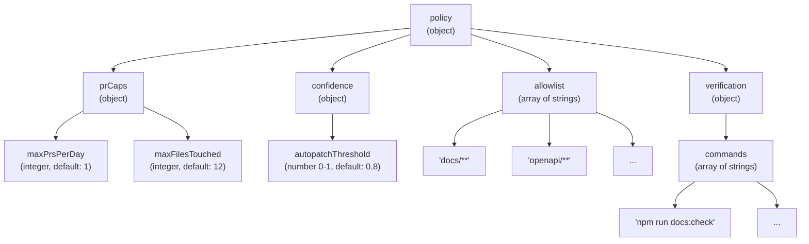
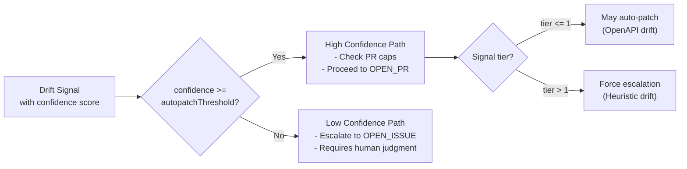
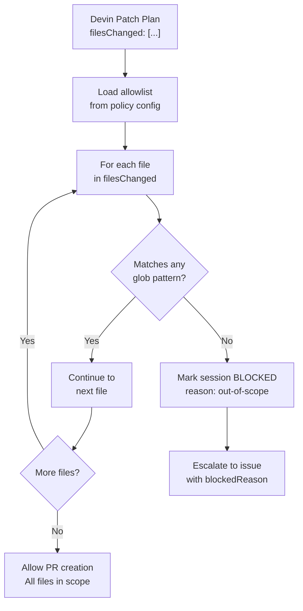
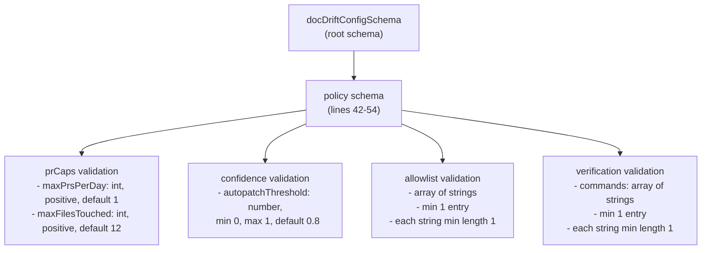
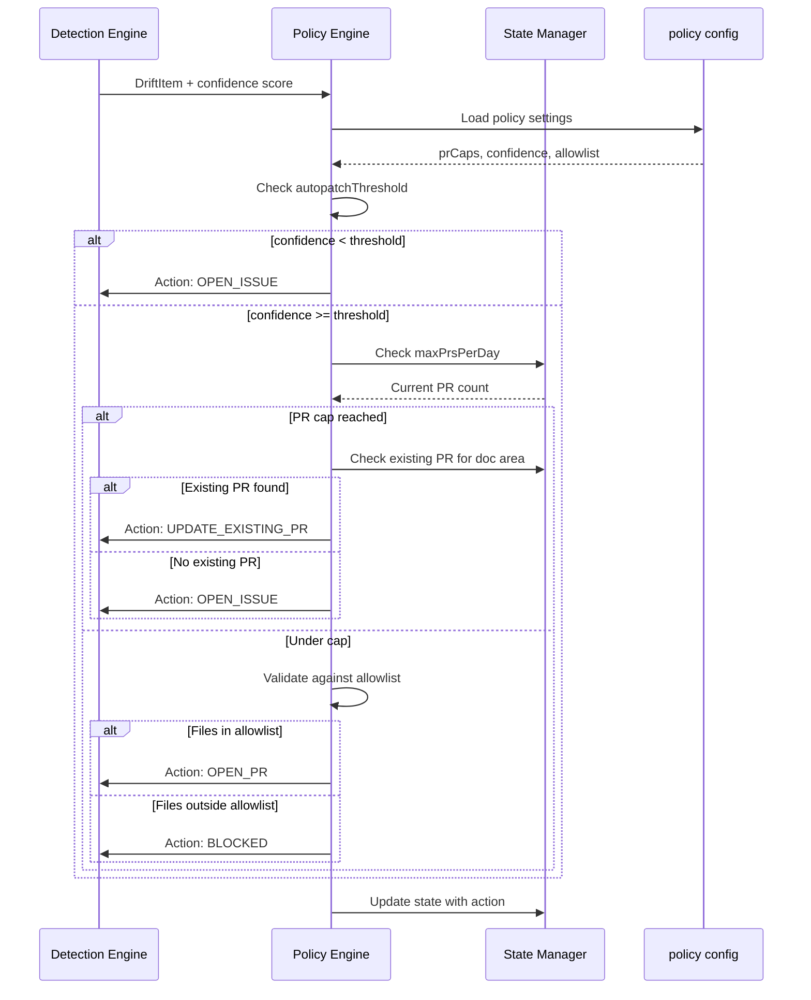

# Policy Configuration

<details>
<summary>Relevant source files</summary>

The following files were used as context for generating this wiki page:

- [.gitignore](.gitignore)
- [README.md](README.md)
- [docdrift-yml.md](docdrift-yml.md)
- [src/index.ts](src/index.ts)

</details>


## Purpose and Scope

This page documents the `policy` section of the [docdrift.yaml]() configuration file, which controls how DocDrift enforces noise reduction constraints and determines when to open PRs versus escalate to issues. The policy settings define global limits and gating mechanisms that apply across all doc areas.

For information about how policy decisions are made based on these settings, see [Decision Logic](#5.1). For the broader configuration structure including `devin` and `docAreas`, see [Top-Level Configuration](#9.1).

**Sources:** [docdrift-yml.md:42-86]()

---

## Overview

The `policy` object contains four subsections that work together to implement DocDrift's "low-noise" design philosophy:

| Subsection | Purpose | Key Settings |
|------------|---------|--------------|
| `prCaps` | Limit PR frequency and size | `maxPrsPerDay`, `maxFilesTouched` |
| `confidence` | Gate automated fixes by confidence score | `autopatchThreshold` |
| `allowlist` | Define which paths PRs may modify | Glob patterns |
| `verification` | Validate patches before submission | Shell commands |

These settings are enforced by the policy engine during the [run command](#3.3) workflow after drift detection completes.

**Sources:** [docdrift-yml.md:42-44](), [src/config/schema.ts:42-54]()

---

## Policy Configuration Structure



**Diagram: Policy Configuration Object Structure**

The diagram above shows the hierarchical structure of the `policy` section as it appears in [docdrift.yaml](). Each node represents a configuration field with its type and default value where applicable.

**Sources:** [src/config/schema.ts:42-54](), [docdrift-yml.md:42-86]()

---

## PR Caps

PR caps control the volume of automated pull requests to prevent overwhelming repository maintainers.

### Configuration Fields

| Field | Type | Required | Default | Description |
|-------|------|----------|---------|-------------|
| `maxPrsPerDay` | integer | No | `1` | Maximum PRs opened per day across all doc areas |
| `maxFilesTouched` | integer | No | `12` | Maximum files a single PR may modify |

### Schema Definition

The PR caps schema is defined in [src/config/schema.ts:43-46]():

```
prCaps: z.object({
  maxPrsPerDay: z.number().int().positive().default(1),
  maxFilesTouched: z.number().int().positive().default(12)
})
```

### Enforcement Behavior

The `maxPrsPerDay` cap is enforced by checking the state file ([.docdrift/state.json]()) to count PRs opened in the current calendar day. When the cap is reached, the policy engine has two options:

1. **Bundle with existing PR** - If an open PR already exists for the doc area, additional changes are bundled into that PR (action: `UPDATE_EXISTING_PR`)
2. **Escalate to issue** - If no existing PR is available, drift is escalated to a GitHub issue instead (action: `OPEN_ISSUE`)

The `maxFilesTouched` cap is checked against the evidence bundle before PR creation. If exceeded, the session is marked as blocked and escalated to an issue.

**Example Configuration:**

```yaml
policy:
  prCaps:
    maxPrsPerDay: 3
    maxFilesTouched: 30
```

**Sources:** [docdrift-yml.md:46-52](), [src/config/schema.ts:43-46](), [docdrift.yaml:11-13]()

---

## Confidence Threshold

The confidence threshold determines when DocDrift will automatically open a PR versus escalating to human review.

### Configuration Fields

| Field | Type | Required | Default | Description |
|-------|------|----------|---------|-------------|
| `autopatchThreshold` | number | No | `0.8` | Confidence score (0.0 to 1.0) required to auto-patch |

### Schema Definition

Defined in [src/config/schema.ts:47-49]():

```
confidence: z.object({
  autopatchThreshold: z.number().min(0).max(1).default(0.8)
})
```

### Confidence Gating Logic



**Diagram: Confidence Gating Decision Flow**

This diagram shows how the `autopatchThreshold` setting gates automated PR creation. Drift signals with confidence scores below the threshold are always escalated to issues. Even high-confidence signals may be escalated if they come from Tier 2 (heuristic detection), as these typically indicate conceptual drift requiring human judgment.

**Sources:** [docdrift-yml.md:53-58](), [src/config/schema.ts:47-49]()

---

## Allowlist

The allowlist defines which file paths may be modified by DocDrift-generated PRs. This is a critical safety mechanism that prevents unintended modifications to source code or infrastructure files.

### Configuration Fields

| Field | Type | Required | Default | Description |
|-------|------|----------|---------|-------------|
| `allowlist` | array of strings | **Yes** | — | Glob patterns for permitted paths (e.g., `"docs/**"`) |

### Schema Definition

Defined in [src/config/schema.ts:50]():

```
allowlist: z.array(z.string().min(1)).min(1)
```

At least one glob pattern is required. Each pattern must be a non-empty string.

### Enforcement

Before a PR is opened, DocDrift validates that all files in the patch plan match at least one allowlist pattern. If any file falls outside the allowlist, the session is marked as blocked and the drift is escalated to an issue with an explanation.

### Common Patterns

```yaml
policy:
  allowlist:
    - "docs/**"                    # All documentation files
    - "openapi/**"                 # OpenAPI specifications
    - "*.md"                       # Root-level markdown files
    - "README.md"                  # Specific file
```

### Allowlist Validation Flow



**Diagram: Allowlist Enforcement Flow**

This diagram shows how the allowlist is enforced during PR creation. Each file in the Devin patch plan is checked against all allowlist patterns. If any file fails to match, the entire session is blocked.

**Sources:** [docdrift-yml.md:59-64](), [src/config/schema.ts:50](), [docdrift.yaml:16-18]()

---

## Verification Commands

Verification commands are shell commands executed after patching to validate that documentation still builds correctly and passes quality checks.

### Configuration Fields

| Field | Type | Required | Default | Description |
|-------|------|----------|---------|-------------|
| `commands` | array of strings | **Yes** | — | Commands to run for verification (e.g., `"npm run docs:check"`) |

### Schema Definition

Defined in [src/config/schema.ts:51-53]():

```
verification: z.object({
  commands: z.array(z.string().min(1)).min(1)
})
```

At least one command is required. Each command must be a non-empty string.

### Command Execution

Verification commands are included in the Devin session prompt to ensure patches are validated before PR creation. If any command fails, Devin's structured output should indicate a blocked state with the failure reason.

### Binary Validation

During [docdrift validate](#3.1), the system checks that the binary for each verification command exists on the system. For example, if `commands` includes `"npm run docs:check"`, the `npm` binary must be present.

**Example Configuration:**

```yaml
policy:
  verification:
    commands:
      - "npm run docs:check"
      - "npm run lint:docs"
      - "npm run build:docs"
```

### Common Verification Commands

| Command Pattern | Purpose |
|----------------|---------|
| `npm run docs:check` | Validate documentation build |
| `npm run lint:docs` | Check documentation style/format |
| `npm run test:docs` | Run documentation tests |
| `make docs` | Build documentation with Make |

**Sources:** [docdrift-yml.md:65-70](), [src/config/schema.ts:51-53](), [docdrift.yaml:19-21]()

---

## Schema Validation

The entire policy configuration is validated using Zod schemas when the configuration file is loaded.

### Policy Schema Structure



**Diagram: Policy Schema Validation Structure**

This diagram shows the schema validation hierarchy for the policy section. Each subsection has specific validation rules enforced by Zod validators.

### Validation Types

| Validation | Enforced By | Error Condition |
|------------|-------------|-----------------|
| Type checking | Zod type validators | Wrong type (e.g., string instead of number) |
| Range validation | `.min()`, `.max()`, `.positive()` | Values outside allowed range |
| Required fields | Schema structure | Missing required field |
| Array constraints | `.min(1)` | Empty arrays where items required |
| String constraints | `.min(1)` | Empty strings |

### Validation Example

Invalid configuration:
```yaml
policy:
  prCaps:
    maxPrsPerDay: -1        # Error: must be positive
  confidence:
    autopatchThreshold: 1.5  # Error: must be <= 1
  allowlist: []             # Error: must have at least one entry
  verification:
    commands: []            # Error: must have at least one command
```

**Sources:** [src/config/schema.ts:42-54](), [docdrift-yml.md:203-207]()

---

## Complete Policy Example

Here is a complete policy configuration with common settings:

```yaml
policy:
  prCaps:
    maxPrsPerDay: 3
    maxFilesTouched: 30
  confidence:
    autopatchThreshold: 0.8
  allowlist:
    - "docs/**"
    - "openapi/**"
    - "README.md"
  verification:
    commands:
      - "npm run docs:check"
      - "npm run lint:docs"
```

### Configuration Trade-offs

| Setting | Conservative | Aggressive |
|---------|-------------|-----------|
| `maxPrsPerDay` | `1` (fewer PRs, more bundling) | `5+` (more PRs, faster fixes) |
| `maxFilesTouched` | `5-10` (smaller PRs) | `30+` (larger PRs) |
| `autopatchThreshold` | `0.9` (high confidence only) | `0.6` (lower confidence accepted) |
| `allowlist` | Narrow (specific paths) | Broad (entire `docs/` tree) |
| `verification.commands` | Multiple checks | Single check |

**Sources:** [docdrift.yaml:10-21](), [docdrift-yml.md:71-86]()

---

## Policy Enforcement Flow



**Diagram: Policy Enforcement Sequence**

This sequence diagram shows how the policy engine uses configuration settings to determine the appropriate action for a detected drift item. The policy settings act as gates at multiple decision points.

**Sources:** [docdrift-yml.md:42-86](), [src/config/schema.ts:42-54]()

---