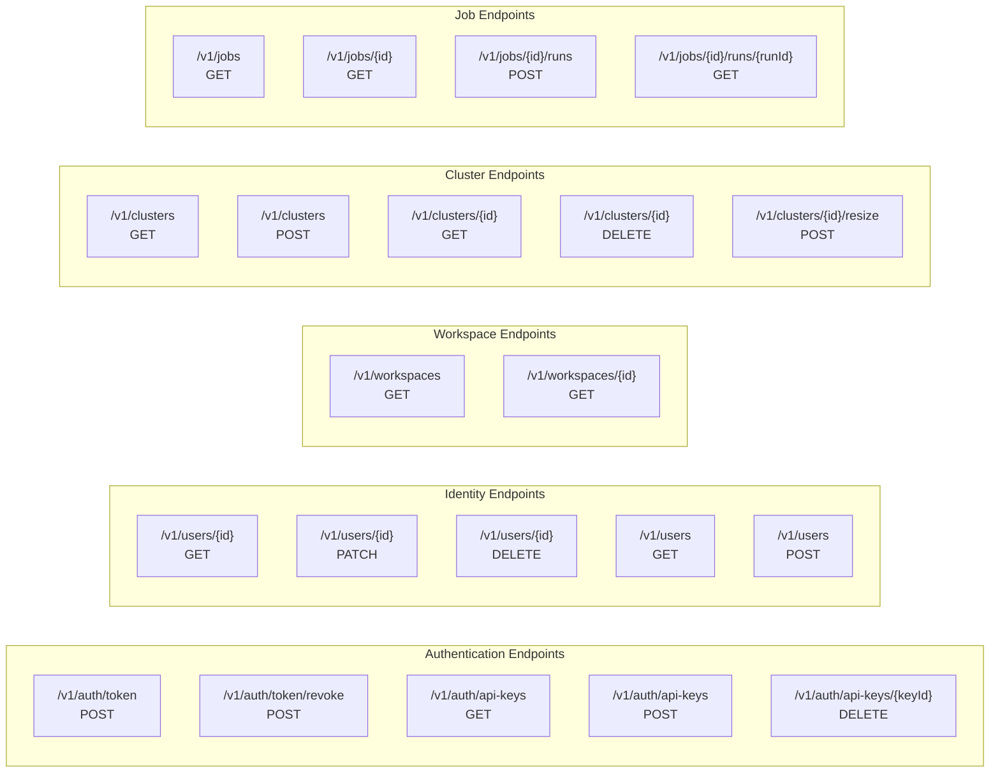
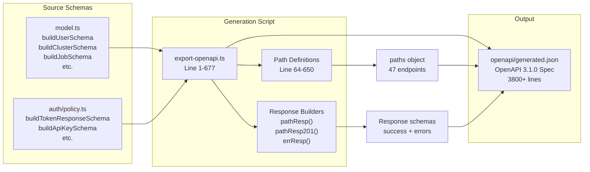
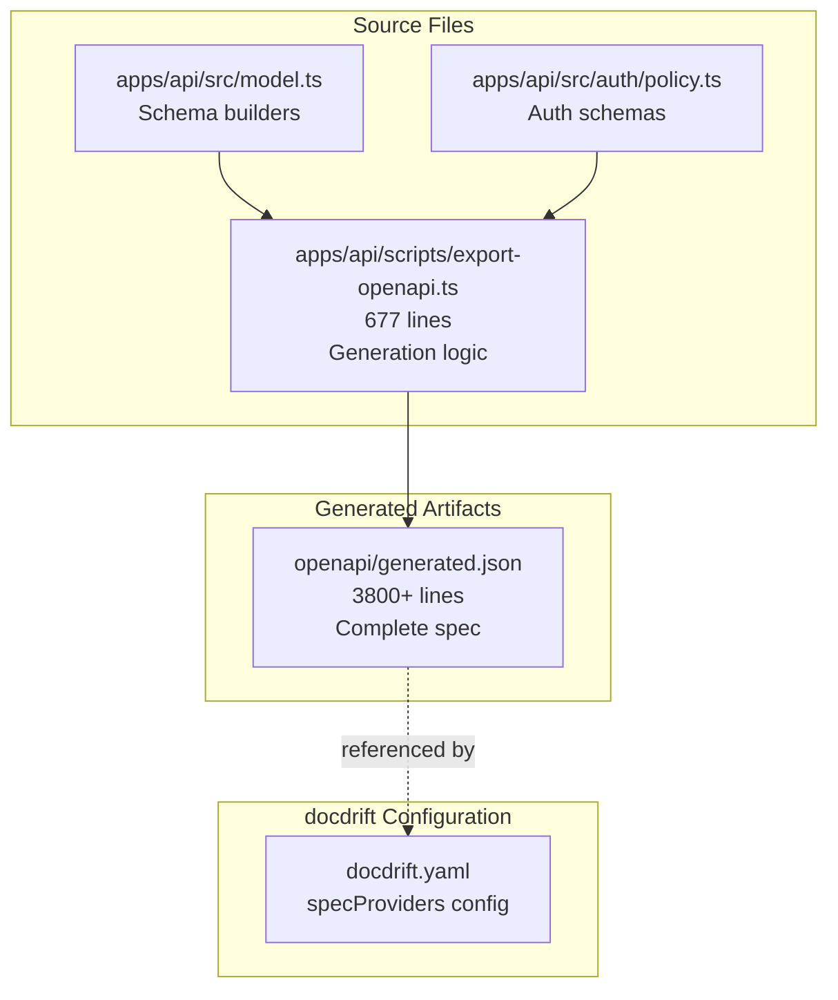

# DataStack API Overview

<details>
<summary>Relevant source files</summary>

The following files were used as context for generating this wiki page:

- [apps/api/scripts/export-openapi.ts](apps/api/scripts/export-openapi.ts)
- [openapi/generated.json](openapi/generated.json)

</details>


This page introduces the DataStack API, a comprehensive example REST API that serves as the primary demonstration platform for docdrift's spec provider detection and drift remediation capabilities. The DataStack API is a fictional data platform API modeled after real-world data infrastructure platforms.

For detailed information about the OpenAPI specification structure, see [OpenAPI Specification](#11.2). For implementation details of the generation script, see [Schema Generation Script](#11.3). For specific endpoint examples, see [Example API Endpoints](#11.4).

## Purpose and Scope

The DataStack API exists within the docdrift repository as a complete working example that demonstrates:

1. **Spec-based drift detection** - Changes to the API specification trigger high-confidence drift signals
2. **Realistic complexity** - Provides a multi-resource API with authentication, CRUD operations, and lifecycle management
3. **Generated documentation** - Shows how programmatically generated OpenAPI specs integrate with docdrift's detection system
4. **Reference implementation** - Serves as a template for users implementing docdrift with their own APIs

The API is defined in [openapi/generated.json]() and generated by [apps/api/scripts/export-openapi.ts]().

Sources: [openapi/generated.json:1-7](), [apps/api/scripts/export-openapi.ts:652-676]()

## API Architecture

The DataStack API follows a hierarchical resource model with nine major categories, each representing a distinct domain of functionality in a data platform.

```mermaid
graph TB
    DataStack["DataStack API<br/>v2.0.0"]
    
    Auth["Authentication<br/>/v1/auth"]
    Identity["Identity & Access<br/>/v1/users"]
    Workspaces["Workspaces<br/>/v1/workspaces"]
    Compute["Compute / Clusters<br/>/v1/clusters"]
    Jobs["Jobs<br/>/v1/jobs"]
    Notebooks["Notebooks<br/>/v1/notebooks"]
    Pipelines["Pipelines<br/>/v1/pipelines"]
    SQLWarehouses["SQL Warehouses<br/>/v1/sql/warehouses"]
    Webhooks["Webhooks<br/>/v1/webhooks"]
    
    DataStack --> Auth
    DataStack --> Identity
    DataStack --> Workspaces
    DataStack --> Compute
    DataStack --> Jobs
    DataStack --> Notebooks
    DataStack --> Pipelines
    DataStack --> SQLWarehouses
    DataStack --> Webhooks
    
    Auth --> TokenOps["Token Operations"]
    Auth --> KeyMgmt["API Key Management"]
    
    Compute --> ClusterLifecycle["Cluster Lifecycle"]
    Compute --> ClusterResize["Cluster Resize"]
    
    Jobs --> JobCRUD["Job CRUD"]
    Jobs --> JobRuns["Job Run Execution"]
    
    Pipelines --> PipelineLifecycle["Pipeline Lifecycle"]
    Pipelines --> PipelineEvents["Pipeline Events"]
    
    SQLWarehouses --> WarehouseLifecycle["Warehouse Lifecycle"]
    SQLWarehouses --> WarehouseOps["Start/Stop Operations"]
    
    Webhooks --> WebhookCRUD["Webhook CRUD"]
    Webhooks --> WebhookDelivery["Delivery Tracking"]
```



**API Version**: 2.0.0  
**OpenAPI Version**: 3.1.0  
**Base Path Pattern**: `/v1/{resource}`

Sources: [openapi/generated.json:2-7](), [openapi/generated.json:8-44]()

## Resource Categories

The API organizes endpoints into nine tagged categories, each with distinct responsibilities:

| Category | Tag | Description | Path Prefix | Key Operations |
|----------|-----|-------------|-------------|----------------|
| **Authentication** | `Authentication` | OAuth2 token exchange and API key management | `/v1/auth` | Token exchange, token revocation, API key CRUD |
| **Identity & Access** | `Identity & Access` | Users and permissions | `/v1/users` | User CRUD, role management, status updates |
| **Workspaces** | `Workspaces` | Workspace management | `/v1/workspaces` | Workspace listing, workspace retrieval |
| **Compute / Clusters** | `Compute / Clusters` | Spark compute clusters | `/v1/clusters` | Cluster CRUD, cluster resize, cluster termination |
| **Jobs** | `Jobs` | Scheduled and triggered jobs | `/v1/jobs` | Job CRUD, job run triggering, run status |
| **Notebooks** | `Notebooks` | Notebook CRUD and export | `/v1/notebooks` | Notebook listing, create/overwrite, export |
| **Pipelines** | `Pipelines` | Delta Live Tables pipeline management | `/v1/pipelines` | Pipeline CRUD, start/stop, event tracking |
| **SQL Warehouses** | `SQL Warehouses` | SQL warehouse lifecycle | `/v1/sql/warehouses` | Warehouse listing, warehouse start/stop |
| **Webhooks** | `Webhooks` | Webhook registration and delivery tracking | `/v1/webhooks` | Webhook CRUD, test delivery, delivery history |

Sources: [openapi/generated.json:8-44](), [apps/api/scripts/export-openapi.ts:659-669]()

## Endpoint Structure

The API defines 47 total endpoints across the nine resource categories. Each endpoint follows consistent patterns for HTTP methods, request/response schemas, and error handling.

### Endpoint Distribution



Sources: [openapi/generated.json:46-2262]()

### Common HTTP Methods

The API uses standard REST conventions:

- **GET** - Retrieve resources (list or single)
- **POST** - Create new resources or trigger actions
- **PATCH** - Partial update of resources
- **PUT** - Full replacement (notebooks only)
- **DELETE** - Remove resources

Sources: [apps/api/scripts/export-openapi.ts:64-650]()

## Schema Generation Process

The OpenAPI specification is programmatically generated by the `export-openapi.ts` script, which bridges TypeScript code to the OpenAPI schema format.



The generation process involves:

1. **Schema Import** - Import builder functions from `../src/model` and `../src/auth/policy`
2. **Response Builder Functions** - Helper functions `pathResp()`, `pathResp201()`, `errResp()` construct response objects
3. **Path Definition** - Each endpoint defined with summary, tags, parameters, request body, and responses
4. **Spec Assembly** - Combine metadata (title, version, tags) with paths into complete OpenAPI object
5. **File Output** - Write JSON to `openapi/generated.json` with formatting

Sources: [apps/api/scripts/export-openapi.ts:1-677]()

### Schema Builder Functions

The script imports 23 schema builder functions that construct JSON Schema objects for each data model:

```typescript
// User management
buildUserSchema()
buildUserListSchema()

// Workspace management
buildWorkspaceSchema()
buildWorkspaceListSchema()

// Compute clusters
buildClusterSchema()
buildClusterListSchema()

// Jobs
buildJobSchema()
buildJobRunSchema()
buildJobListSchema()

// Notebooks
buildNotebookSchema()
buildNotebookListSchema()

// Pipelines
buildPipelineSchema()
buildPipelineListSchema()
buildPipelineEventSchema()

// SQL Warehouses
buildSqlWarehouseSchema()
buildSqlWarehouseListSchema()

// Webhooks
buildWebhookSchema()
buildWebhookListSchema()
buildWebhookDeliverySchema()

// Authentication
buildTokenResponseSchema()
buildApiKeySchema()
buildApiKeyListSchema()
buildApiKeyCreatedSchema()
```

Sources: [apps/api/scripts/export-openapi.ts:3-29]()

### Response Construction Pattern

The script uses three helper functions to construct consistent response objects:

```typescript
function pathResp(schema: object)
// Returns: 200 OK response with application/json content

function pathResp201(schema: object)
// Returns: 201 Created response with application/json content

function errResp(code: string, desc: string)
// Returns: Error response (401, 403, 404, 400) with standard error schema
```

All error responses follow a consistent structure:
- `code`: String error code
- `message`: Human-readable error message
- `details`: Optional object with additional error context

Sources: [apps/api/scripts/export-openapi.ts:31-62]()

## Role in docdrift Testing

The DataStack API serves multiple purposes within the docdrift ecosystem:

### 1. Spec Provider Validation

The generated OpenAPI spec at `openapi/generated.json` is used to test docdrift's OpenAPI spec provider detection. When configured in `docdrift.yaml`, the spec provider:

- Detects changes to the JSON schema
- Compares versions to identify drift
- Generates high-confidence drift signals for spec changes

### 2. Path Mapping Demonstrations

Changes to source files that generate the API (like `apps/api/scripts/export-openapi.ts` or model files) can be mapped to documentation impacts via `pathMappings` configuration.

Example mapping:
```yaml
pathMappings:
  - match: "apps/api/**/*.ts"
    impacts:
      - "docs/api-reference/**/*.md"
```

### 3. Realistic Complexity

The API provides:
- **47 endpoints** - Sufficient complexity to test detection at scale
- **9 resource categories** - Multiple documentation areas to track
- **Nested resources** - Tests detection of sub-resource changes (e.g., `/jobs/{jobId}/runs/{runId}`)
- **Multiple HTTP methods** - Tests detection across GET, POST, PATCH, PUT, DELETE operations

### 4. Version Evolution

As a v2.0.0 API, it demonstrates:
- Version tracking across API iterations
- Breaking vs non-breaking change detection
- Documentation versioning requirements

Sources: [openapi/generated.json:1-7](), [apps/api/scripts/export-openapi.ts:652-677]()

## API Statistics

| Metric | Count |
|--------|-------|
| Total Endpoints | 47 |
| Resource Categories | 9 |
| Tags | 9 |
| Path Parameters | 14 distinct parameter names |
| Query Parameters | ~30 distinct parameter names |
| Request Bodies | 15 endpoints with request bodies |
| Response Codes | 200, 201, 204, 400, 401, 403, 404 |
| Schema Builders | 23 functions |
| Lines in Generated Spec | 3,800+ |
| OpenAPI Version | 3.1.0 |
| API Version | 2.0.0 |

Sources: [openapi/generated.json:1-3800](), [apps/api/scripts/export-openapi.ts:3-29]()

## File Structure

The DataStack API implementation consists of two primary files:



**Key Files**:
1. `apps/api/scripts/export-openapi.ts` - Generation script
2. `openapi/generated.json` - Output OpenAPI specification
3. `apps/api/src/model.ts` - Schema builder functions (referenced, not shown)
4. `apps/api/src/auth/policy.ts` - Authentication schema builders (referenced, not shown)

Sources: [apps/api/scripts/export-openapi.ts:1-677](), [openapi/generated.json:1-3800]()

---