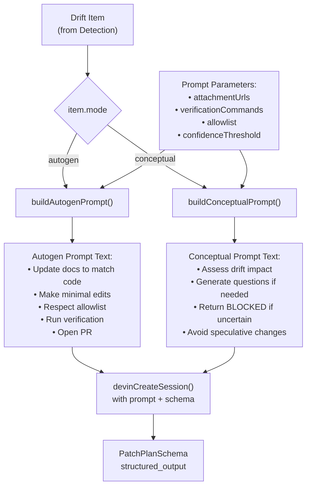
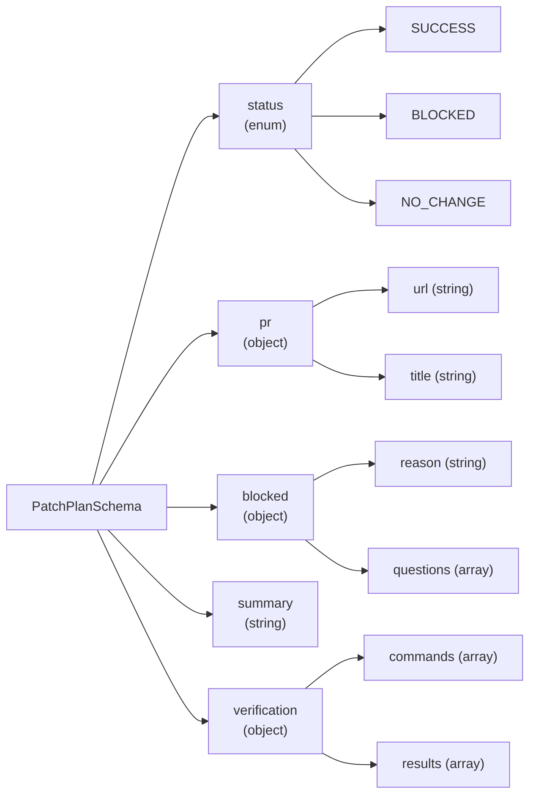
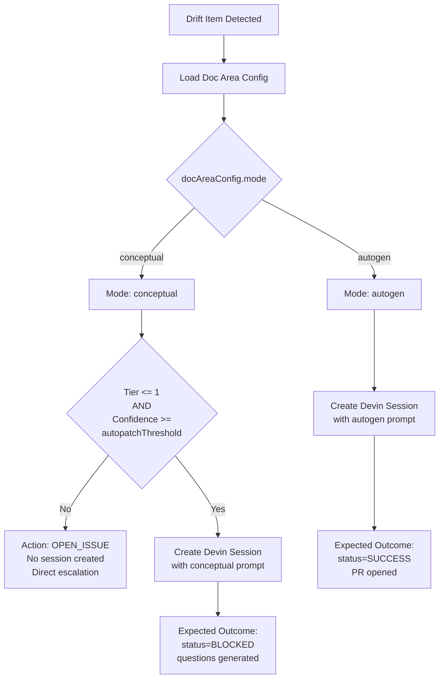
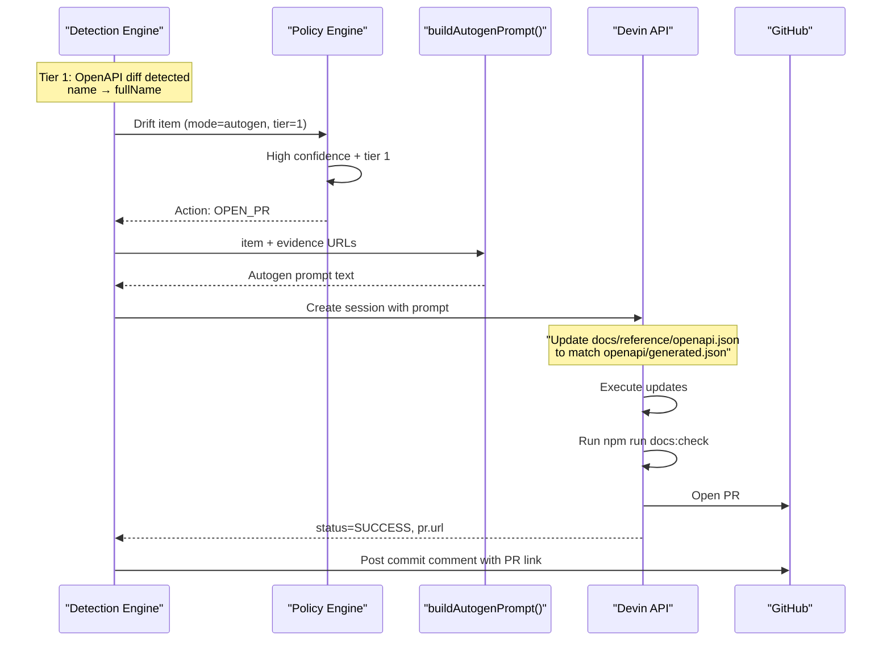
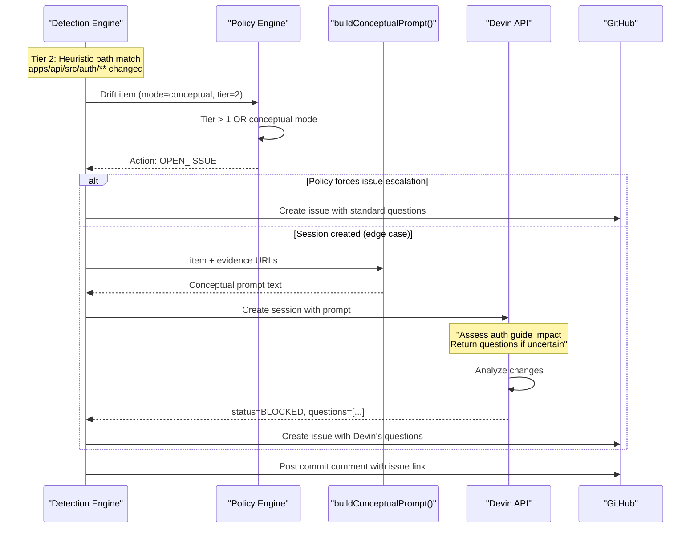

# Prompts and Modes

<details>
<summary>Relevant source files</summary>

The following files were used as context for generating this wiki page:

- [.github/workflows/devin-doc-drift.yml](.github/workflows/devin-doc-drift.yml)
- [docdrift-yml.md](docdrift-yml.md)
- [src/config/validate.ts](src/config/validate.ts)
- [src/devin/prompts.ts](src/devin/prompts.ts)
- [src/github/client.ts](src/github/client.ts)
- [src/index.ts](src/index.ts)

</details>


This document explains the two documentation modes (`autogen` and `conceptual`) in DocDrift and how they determine the prompts sent to Devin AI sessions. The mode controls both the remediation path (PR vs issue escalation) and the specific instructions given to the AI agent.

For information about session lifecycle and polling, see [Session Management](#6.2). For details on evidence preparation, see [Evidence Bundles](#6.1). For policy decisions that route based on mode, see [Policy Engine](#5).

---

## Mode Overview

DocDrift supports two documentation modes, configured per doc area in `docdrift.yaml`:

| Mode | Purpose | Typical Doc Types | Remediation Path |
|------|---------|-------------------|------------------|
| `autogen` | Auto-generated documentation that can be mechanically updated from code | API references, OpenAPI specs, generated schemas | Direct PR via Devin |
| `conceptual` | Human-authored guides requiring judgment and context | User guides, tutorials, architecture docs | Issue escalation with questions |

The mode is specified in each doc area configuration and determines the entire downstream behavior of the system.

**Sources:** [README.md:1-185](), [src/index.ts:82-97]()

---

## Autogen Mode

### Characteristics

Autogen mode is designed for documentation that can be mechanically synchronized with code. These docs typically have a clear, deterministic relationship to code artifacts (e.g., OpenAPI specs, API endpoint lists, schema definitions).

### When Autogen Mode Applies

- **API Reference Documentation**: Generated from OpenAPI specifications
- **Endpoint Lists**: Mechanically derived from route definitions
- **Schema Documentation**: Auto-generated from data models
- **Low-Tier Drift Signals**: High-confidence changes detected by Tier 0 or Tier 1 detection

### Autogen Prompt Behavior

The autogen prompt instructs Devin to:

1. **Update documentation files** to match current code state
2. **Make minimal, precise edits** - only change what's necessary
3. **Respect the allowlist** - only modify approved file paths
4. **Run verification commands** - execute doc build/validation before completing
5. **Open one PR** per doc area with clear description
6. **Include structured output** conforming to `PatchPlanSchema`

Example doc areas configured for autogen mode:
- `docs/reference/openapi.json` - Published OpenAPI spec
- `docs/reference/api.md` - Human-readable API reference

**Sources:** [README.md:44-60](), [src/index.ts:82-90]()

---

## Conceptual Mode

### Characteristics

Conceptual mode is designed for documentation that requires human judgment, understanding of user intent, and contextual decision-making. These docs cannot be mechanically updated because they involve narrative structure, pedagogical choices, and semantic understanding.

### When Conceptual Mode Applies

- **User Guides**: Explaining how to use features
- **Tutorials**: Step-by-step walkthroughs
- **Architecture Docs**: System design explanations
- **High-Tier Drift Signals**: Heuristic-based impacts (Tier 2) requiring interpretation

### Conceptual Prompt Behavior

The conceptual prompt instructs Devin to:

1. **Assess if mechanical updates are possible** - determine if changes can be made confidently
2. **Generate targeted questions** if updates require human judgment
3. **Return structured output** with `status: "BLOCKED"` and `questions` array
4. **Avoid making speculative changes** to conceptual content

Example doc areas configured for conceptual mode:
- `docs/guides/auth.md` - Authentication guide requiring narrative coherence

The system automatically escalates conceptual drift to GitHub issues with the generated questions, rather than attempting automated PRs.

**Sources:** [README.md:20-20](), [README.md:50-50](), [loom.md:19-23]()

---

## Prompt Construction Flow



**Figure 1: Prompt Construction Pipeline**

The prompt construction occurs in [src/index.ts:82-97]() during session execution. Both prompt builders receive identical parameters but generate different instructions based on the doc area's mode.

**Sources:** [src/index.ts:69-157]()

---

## Prompt Construction Parameters

Both `buildAutogenPrompt()` and `buildConceptualPrompt()` functions accept the same input parameters:

```typescript
{
  item: any,                    // Drift item with docArea, mode, summary, evidence
  attachmentUrls: string[],     // Uploaded evidence bundle URLs
  verificationCommands: string[], // Commands to run (e.g., "npm run docs:check")
  allowlist: string[],          // File path patterns allowed for modification
  confidenceThreshold: number   // Minimum confidence for autopatch
}
```

These parameters come from:
- **item**: The drift detection output (doc area, impacted files, evidence)
- **attachmentUrls**: Evidence tarballs uploaded via `devinUploadAttachment()` 
- **verificationCommands**: From `config.policy.verification.commands`
- **allowlist**: From `config.policy.allowlist` (e.g., `["docs/**", "openapi/**"]`)
- **confidenceThreshold**: From `config.policy.confidence.autopatchThreshold`

The prompt text embeds these parameters as instructions and constraints for the Devin agent.

**Sources:** [src/index.ts:82-97](), [README.md:57-58]()

---

## Constraints and Guardrails

Both modes enforce strict constraints to ensure safe, minimal, and verifiable documentation updates:

### Allowlist Enforcement

The prompt explicitly instructs Devin to **only modify files matching the allowlist patterns**. Example allowlist:
```yaml
allowlist:
  - "docs/**"
  - "openapi/**"
```

This prevents the AI from making changes to application code, tests, or configuration files.

### Verification Commands

Before completing, Devin must run all configured verification commands:
```yaml
verification:
  commands:
    - "npm run docs:check"
    - "npm run lint:docs"
```

The structured output includes verification results, which are surfaced in GitHub commit comments.

### Minimal Edits Principle

The prompt instructs Devin to make the **smallest possible changes** to achieve documentation consistency. This reduces diff size and PR review burden.

### Scoped to Doc Area

Each session is scoped to a single doc area (e.g., `api_reference`, `auth_guide`). The prompt includes the doc area name and target file paths from the drift item.

**Sources:** [README.md:57-58](), [src/index.ts:88-89](), [src/index.ts:94-96]()

---

## Structured Output Schema

All Devin sessions use the `PatchPlanSchema` for structured output, regardless of mode. This schema enforces deterministic parsing of session outcomes:



**Figure 2: PatchPlanSchema Structure**

The schema is passed to `devinCreateSession()` at [src/index.ts:105-107](). After session completion, the structured output is parsed at [src/index.ts:116]() to determine the outcome.

### Autogen Expected Output

For autogen mode, success typically produces:
```json
{
  "status": "SUCCESS",
  "pr": {
    "url": "https://github.com/owner/repo/pull/123",
    "title": "[docdrift] Update API reference for new endpoints"
  },
  "summary": "Updated OpenAPI spec and API reference to match current API",
  "verification": {
    "commands": ["npm run docs:check"],
    "results": ["✓ All checks passed"]
  }
}
```

### Conceptual Expected Output

For conceptual mode, blocked status typically produces:
```json
{
  "status": "BLOCKED",
  "blocked": {
    "reason": "Auth behavior change requires human judgment",
    "questions": [
      "Should the auth guide mention the new token expiration policy?",
      "How should we explain the migration path for existing users?"
    ]
  },
  "summary": "Conceptual drift detected; human input required",
  "verification": {
    "commands": ["npm run docs:check"],
    "results": ["not applicable"]
  }
}
```

**Sources:** [src/index.ts:105-107](), [src/index.ts:116-129]()

---

## Mode Decision Logic



**Figure 3: Mode-Based Decision Flow**

The mode check occurs at [src/index.ts:82-83](). If `item.mode === "autogen"`, the autogen prompt is built. Otherwise, the conceptual prompt is used.

However, the policy engine (see [Policy Engine](#5)) may override this and force issue escalation for conceptual mode **before** a session is even created, based on tier and confidence thresholds.

**Sources:** [src/index.ts:82-97](), [README.md:14-21](), [loom.md:19-23]()

---

## Prompt Comparison Table

| Aspect | Autogen Mode | Conceptual Mode |
|--------|--------------|-----------------|
| **Target Docs** | API references, OpenAPI specs, generated content | User guides, tutorials, architecture docs |
| **Primary Instruction** | "Update docs to match code exactly" | "Assess if changes require human judgment" |
| **Expected Outcome** | PR with mechanical updates | Either PR (if confident) or BLOCKED with questions |
| **Verification Requirement** | Must pass all verification commands | May skip verification if BLOCKED |
| **Allowlist Scope** | Full allowlist (docs/**, openapi/**) | Same allowlist, but rarely modifies files |
| **Edit Philosophy** | Minimal, precise, deterministic | Conservative, question-oriented |
| **Fallback Behavior** | Issue escalation if session fails | Issue escalation with generated questions |
| **Confidence Gating** | High confidence required (>= threshold) | Low confidence expected; questions preferred |

**Sources:** [README.md:44-60](), [src/index.ts:82-97]()

---

## Environment and Session Metadata

When creating Devin sessions, the system includes metadata that helps contextualize the mode and doc area:

```typescript
{
  metadata: {
    repository: process.env.GITHUB_REPOSITORY,
    docArea: item.docArea,          // e.g., "api_reference"
    mode: item.mode                  // e.g., "autogen"
  }
}
```

This metadata is passed at [src/index.ts:108-112]() and allows Devin sessions to be filtered and analyzed by mode in the Devin dashboard.

The session is also tagged with `"docdrift"` and the doc area name at [src/index.ts:103](), enabling easy filtering via the `status` command (see [status Command](#3.4)).

**Sources:** [src/index.ts:99-113]()

---

## Example: Autogen Flow



**Figure 4: Autogen Mode End-to-End Flow**

**Sources:** [README.md:179-181](), [loom.md:12-18](), [src/index.ts:82-157]()

---

## Example: Conceptual Flow



**Figure 5: Conceptual Mode End-to-End Flow**

**Sources:** [README.md:179-181](), [loom.md:19-23](), [src/index.ts:295-316]()

---

## Inference of Questions

If a Devin session completes with `status=BLOCKED` but does not include a `questions` array in the structured output, the system falls back to default questions:

```typescript
[
  "Which conceptual docs should be updated for this behavior change?",
  "What are the exact user-visible semantics after this merge?"
]
```

This fallback is implemented at [src/index.ts:58-67]() to ensure GitHub issues always include actionable questions, even if the structured output is incomplete.

**Sources:** [src/index.ts:58-67]()

---

## Summary

The mode system provides a clear separation between mechanical documentation updates (autogen) and human-judgment-requiring updates (conceptual):

- **Autogen mode** produces PRs with deterministic updates to generated documentation
- **Conceptual mode** produces issues with targeted questions for human decision-making
- Both modes use the same `PatchPlanSchema` for structured output
- Prompts embed allowlist, verification, and confidence constraints
- Policy engine enforces mode-based routing before sessions are created

This design ensures DocDrift remains **low-noise** by routing conceptual drift to issues and only automating high-confidence, mechanical changes.

**Sources:** [README.md:1-185](), [src/index.ts:1-446](), [loom.md:1-32]()

---