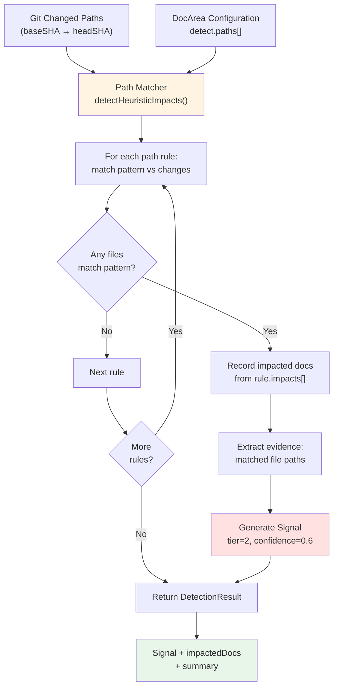
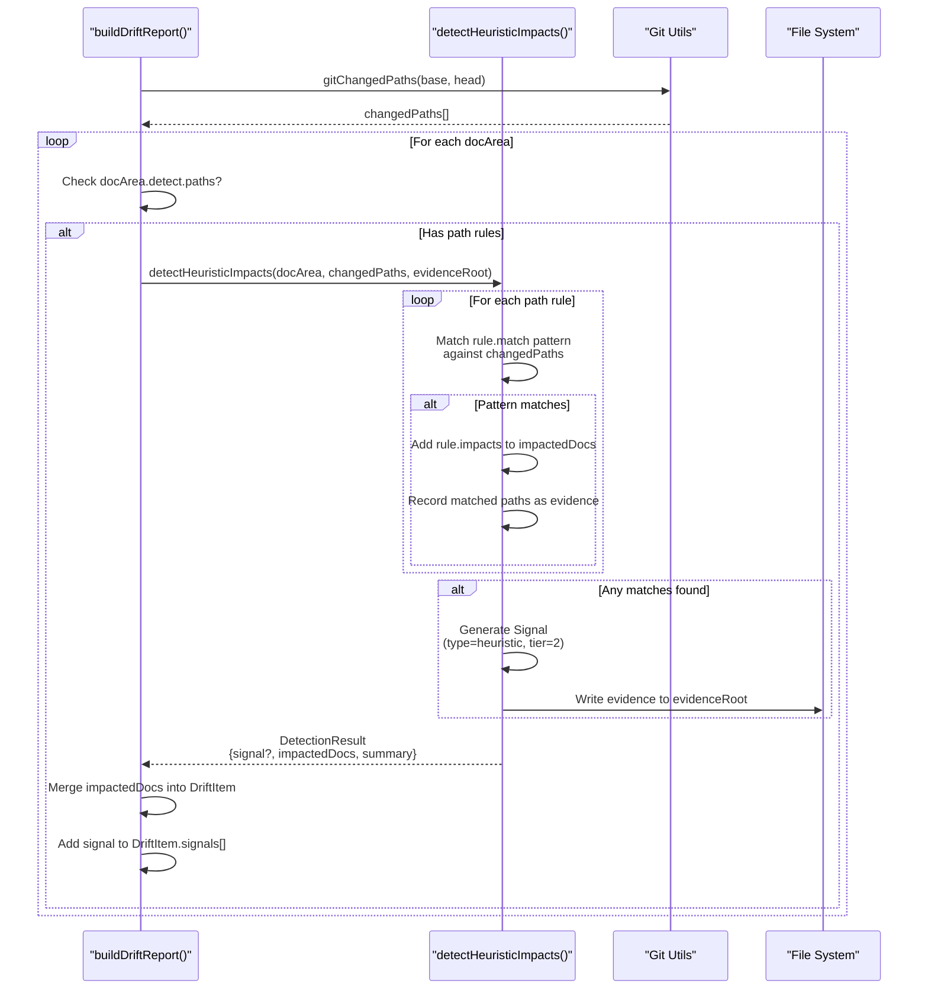
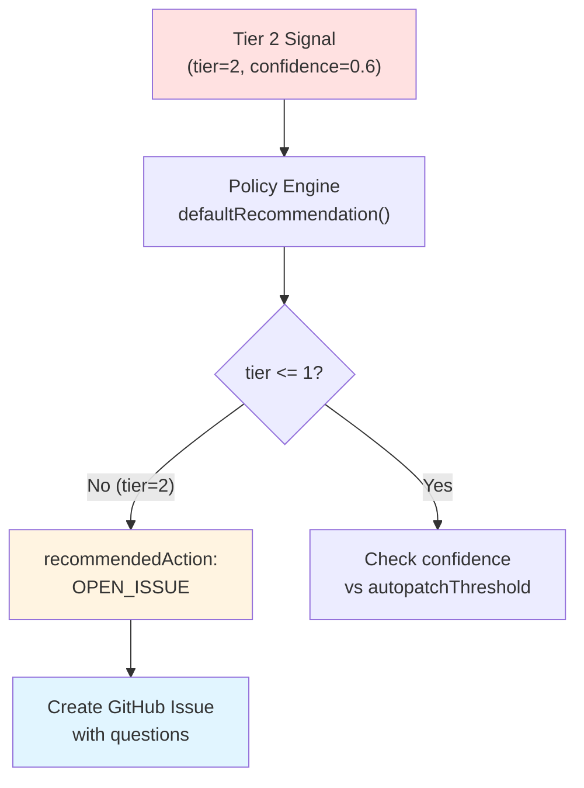
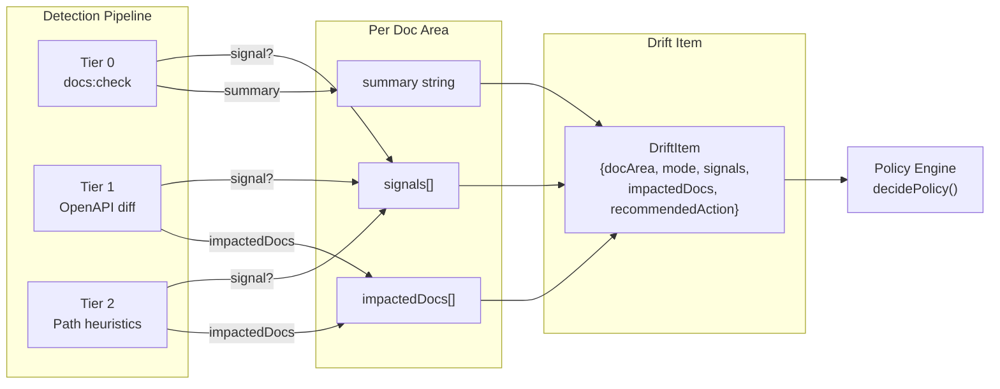

# Tier 2: Heuristic Impacts

<details>
<summary>Relevant source files</summary>

The following files were used as context for generating this wiki page:

- [.gitignore](.gitignore)
- [README.md](README.md)
- [docdrift.schema.json](docdrift.schema.json)
- [src/config/normalize.ts](src/config/normalize.ts)
- [src/config/schema.ts](src/config/schema.ts)
- [src/detect/index.ts](src/detect/index.ts)
- [test/config.test.ts](test/config.test.ts)

</details>


## Purpose and Scope

This page documents the Tier 2 detection mechanism in DocDrift's three-tier detection system. Tier 2 uses path-based heuristics to identify when code changes in specific directories should trigger updates to related conceptual documentation. This tier is primarily designed for detecting drift in guides, tutorials, and other narrative documentation that cannot be automatically regenerated from code.

For information about basic validation checks, see [Tier 0: Basic Checks](#4.1). For information about API specification drift detection, see [Tier 1: OpenAPI Drift](#4.2). For the overall detection architecture, see [Detection System](#4).

---

## Overview

Tier 2 detection operates on a simple principle: **certain code paths impact certain documentation files**. When code changes are detected in designated paths, DocDrift flags the associated documentation as potentially outdated, generating a drift signal for human review.

Unlike Tier 0 (validation commands) and Tier 1 (structural API comparison), Tier 2 does not attempt to automatically determine what changed or how to fix it. Instead, it produces **conceptual drift signals** that escalate to GitHub issues with targeted questions for human judgment.

**Key Characteristics:**
- **Pattern-based**: Uses glob patterns to match changed files against configured paths
- **Declarative**: All mappings are defined in `docdrift.yaml` configuration
- **Conservative**: Generates signals with tier=2, triggering issue escalation rather than automatic PRs
- **Evidence-aware**: Collects evidence about what changed for inclusion in escalation issues

---

## Detection Flow



**Sources:** [src/detect/index.ts:73-80](), [README.md:26]()

---

## Configuration Structure

Tier 2 detection is configured in the `detect.paths` section of each doc area definition in `docdrift.yaml`:

```yaml
docAreas:
  - name: auth_guide
    mode: conceptual
    detect:
      paths:
        - match: "apps/api/src/auth/**"
          impacts: ["docs/guides/auth.md"]
        - match: "apps/api/src/permissions/**"
          impacts: ["docs/guides/auth.md", "docs/guides/rbac.md"]
```

### Path Rule Schema

| Field | Type | Description |
|-------|------|-------------|
| `match` | `string` | Glob pattern to match against changed file paths |
| `impacts` | `string[]` | List of documentation files that should be updated if the pattern matches |

**Pattern Matching:**
- Uses standard glob syntax (e.g., `**` for recursive directory matching, `*` for filename wildcards)
- Patterns are matched against the full relative path from repository root
- Multiple rules can target the same documentation file
- A single rule can impact multiple documentation files

**Sources:** [docdrift.yaml:42-45](), [README.md:26]()

---

## Detection Logic

The heuristic detection is invoked from the main detection pipeline when a doc area has path rules configured:



**Sources:** [src/detect/index.ts:73-80](), [src/detect/index.ts:45-47]()

---

## Signal Generation

When Tier 2 detection finds matches, it generates a drift signal with specific characteristics designed to route to issue escalation:

### Signal Properties

| Property | Value | Rationale |
|----------|-------|-----------|
| `type` | `"heuristic"` | Identifies this as path-based detection |
| `tier` | `2` | Routes through policy engine as low-confidence |
| `confidence` | `0.6` | Below typical `autopatchThreshold` (0.8), triggers issue escalation |
| `source` | `"paths"` | Indicates detection mechanism |
| `description` | `"Code changes in {paths} may impact {docs}"` | Human-readable explanation |

### Policy Routing

The policy engine uses the signal's tier and confidence to make routing decisions:



The default recommendation logic explicitly routes Tier 2 signals to issue escalation:

```typescript
function defaultRecommendation(mode: "autogen" | "conceptual", signals: Signal[]): DriftItem["recommendedAction"] {
  if (!signals.length) {
    return "NOOP";
  }
  if (mode === "autogen") {
    return signals.some((s) => s.tier <= 1) ? "OPEN_PR" : "OPEN_ISSUE";
  }
  return "OPEN_ISSUE";
}
```

**Key insight:** Tier 2 signals have `tier=2`, so `tier <= 1` evaluates to false, resulting in `OPEN_ISSUE` even for autogen mode. Conceptual mode doc areas always escalate to issues regardless of tier.

**Sources:** [src/detect/index.ts:10-18](), [README.md:20]()

---

## Evidence Collection

When Tier 2 detection finds drift, it collects evidence for inclusion in GitHub issues or Devin sessions:

### Evidence Structure

```
.docdrift/evidence/{runId}/{docArea}/
├── heuristic_evidence.json
├── impacted_docs/
│   ├── docs/guides/auth.md
│   └── docs/guides/rbac.md
└── changeset.json
```

### Evidence Contents

**heuristic_evidence.json:**
```json
{
  "matchedPaths": [
    "apps/api/src/auth/jwt.ts",
    "apps/api/src/auth/oauth.ts"
  ],
  "rules": [
    {
      "match": "apps/api/src/auth/**",
      "impacts": ["docs/guides/auth.md"]
    }
  ],
  "timestamp": "2024-01-15T10:30:00Z"
}
```

This evidence is bundled into a tarball and either:
1. **Uploaded to Devin** as session attachments (for autogen mode with high-confidence signals from other tiers)
2. **Linked in GitHub issues** for human review (typical Tier 2 outcome)

**Sources:** [src/detect/index.ts:42-43](), [README.md:38]()

---

## Integration with Detection Pipeline

Tier 2 is one component in the multi-tier detection system, contributing signals that are aggregated with other tiers:



**Sources:** [src/detect/index.ts:54-94]()

---

## Use Cases

### Conceptual Documentation

The primary use case for Tier 2 is detecting drift in conceptual documentation that describes how systems work, rather than what APIs exist:

**Example: Authentication Guide**

```yaml
- name: auth_guide
  mode: conceptual
  detect:
    paths:
      - match: "apps/api/src/auth/**"
        impacts: ["docs/guides/auth.md"]
```

**Scenario:** Developer adds OAuth2 PKCE flow to `apps/api/src/auth/oauth.ts`. Tier 2 detects the change, creates a GitHub issue asking:
- "What changed in the auth module?"
- "Does docs/guides/auth.md need updates?"
- "Should we add a section about PKCE?"

**Sources:** [docdrift.yaml:38-45](), [README.md:181]()

### Multi-Impact Rules

A single code change can impact multiple documentation files:

```yaml
detect:
  paths:
    - match: "apps/api/src/permissions/**"
      impacts: 
        - "docs/guides/auth.md"
        - "docs/guides/rbac.md"
        - "docs/reference/permissions-api.md"
```

**Scenario:** Developer refactors permission checking logic. Tier 2 flags all three docs as potentially outdated, bundling them into a single drift item for efficient review.

### Autogen with Conceptual Fallback

Doc areas can mix autogen and conceptual detection:

```yaml
- name: api_reference
  mode: autogen
  detect:
    openapi:
      exportCmd: "npm run openapi:export"
      generatedPath: "openapi/generated.json"
      publishedPath: "docs/reference/openapi.json"
    paths:
      - match: "apps/api/src/middleware/**"
        impacts: ["docs/reference/api.md"]
```

If OpenAPI drift (Tier 1, high confidence) is detected, the system opens a PR. If only middleware changes (Tier 2, lower confidence) are detected, it escalates to an issue. This hybrid approach handles both structural and behavioral changes.

---

## Detection Result Schema

The `detectHeuristicImpacts()` function returns a structured result:

```typescript
interface DetectionResult {
  signal: Signal | null;
  impactedDocs: string[];
  summary: string;
}
```

### Signal Schema (when generated)

```typescript
interface Signal {
  type: "heuristic";
  tier: 2;
  confidence: number;  // typically 0.6
  source: "paths";
  description: string;
  evidence?: {
    matchedPaths: string[];
    rules: PathRule[];
  };
}
```

### Summary Format

The summary string provides a human-readable description for the drift report:

- **No matches:** `"No path-based impacts detected"`
- **Matches found:** `"Code changes in apps/api/src/auth/** may impact docs/guides/auth.md (3 files changed)"`

**Sources:** [src/detect/index.ts:73-80](), [src/model/types.ts]()

---

## Comparison with Other Tiers

| Aspect | Tier 0 | Tier 1 | Tier 2 |
|--------|--------|--------|--------|
| **Detection Method** | Run validation commands | Compare OpenAPI specs | Match file paths |
| **Precision** | High (docs build or not) | High (exact API diff) | Low (heuristic) |
| **Confidence** | 1.0 (binary) | 0.9-1.0 (structural) | 0.6 (contextual) |
| **Drift Type** | Build failures | API spec drift | Conceptual drift |
| **Typical Action** | Issue (broken docs) | PR (autogen fixes) | Issue (human review) |
| **Doc Mode** | Any | Autogen | Conceptual |
| **Evidence** | Command output | Spec diff | File paths |
| **Automation Potential** | Low | High | Low |

**Sources:** [README.md:23-26]()

---

## Limitations and Tradeoffs

### False Positives

Path-based matching can trigger false alarms:
- **Refactoring without behavior change:** Moving files triggers detection even if functionality is unchanged
- **Test-only changes:** Changes to `tests/auth/**` might match `auth/**` patterns
- **Comment updates:** Documentation comments in code trigger detection unnecessarily

**Mitigation:** Configure patterns carefully to exclude test directories and focus on implementation files.

### False Negatives

Tier 2 only detects changes in configured paths:
- **New features in unexpected locations:** A new auth mechanism in `apps/api/src/core/` won't trigger auth guide updates
- **Cross-cutting changes:** Behavior changes spread across multiple modules may not match any single pattern
- **Indirect dependencies:** Changes to shared utilities that affect auth behavior won't be detected

**Mitigation:** Regularly review and update path configurations as the codebase evolves.

### Configuration Maintenance

Path rules require ongoing maintenance:
- **Code reorganization:** Moving code requires updating patterns
- **New features:** New modules need new rules
- **Documentation reorganization:** Renaming docs requires updating all impacts arrays

**Best practice:** Include path rule updates in the same PR that reorganizes code or documentation structure.

**Sources:** [README.md:16-21]()

---

## Summary

Tier 2 heuristic detection provides a **safety net for conceptual documentation** by flagging potential drift when code changes in designated areas. While less precise than structural detection (Tiers 0 and 1), it ensures that narrative documentation receives attention when related code evolves.

The tier's low confidence scores ensure it routes to human review via GitHub issues rather than automated PRs, maintaining DocDrift's low-noise design while catching drift that automated systems cannot fix.

**Key Takeaways:**
- Tier 2 uses glob patterns to map code paths to documentation files
- Generates tier=2 signals that route to issue escalation
- Primary use case is conceptual documentation that cannot be auto-generated
- Requires configuration maintenance but provides broad coverage
- Complements structural detection with contextual awareness

**Sources:** [src/detect/index.ts:73-94](), [README.md:23-27](), [docdrift.yaml:42-48]()

---