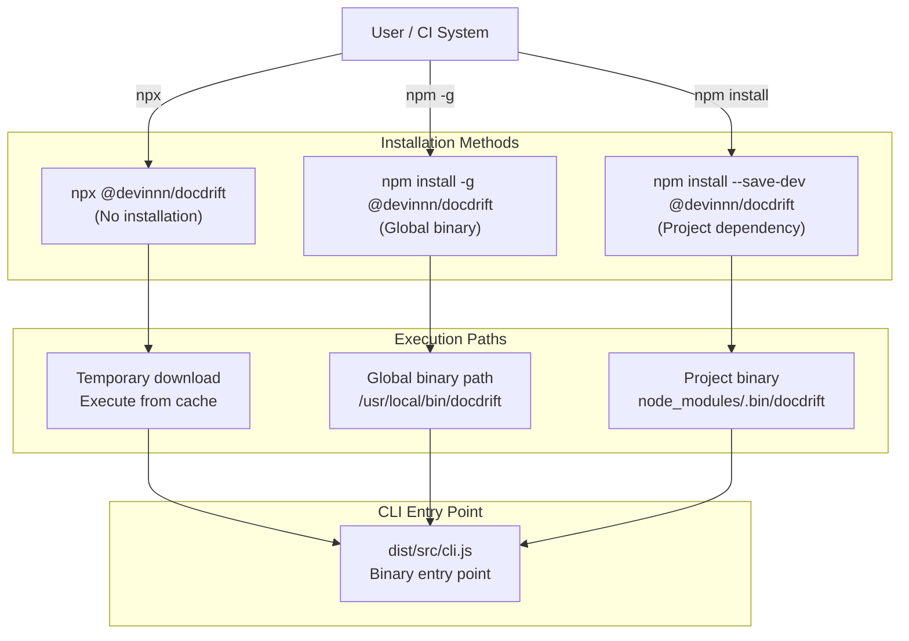
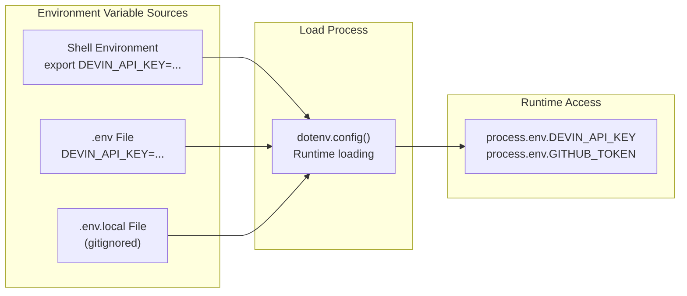
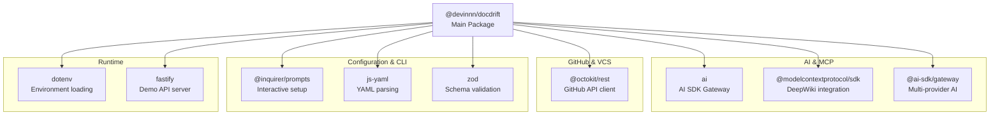

# Installation

<details>
<summary>Relevant source files</summary>

The following files were used as context for generating this wiki page:

- [.gitignore](.gitignore)
- [README.md](README.md)
- [package.json](package.json)

</details>


This page explains how to install docdrift as an npm package, including prerequisites, installation methods, environment variable setup, and verification steps. For guidance on running the initial setup after installation, see [Initial Setup](#2.2). For details on the CLI commands available after installation, see [CLI Reference](#3).

---

## Prerequisites

docdrift requires specific runtime and authentication prerequisites before installation.

### Node.js Version Requirement

docdrift requires Node.js version **20 or higher**. This constraint is enforced by the package engines field to ensure compatibility with ES modules, modern TypeScript features, and dependency requirements.

**Sources:** [package.json:11-13]()

### Required Environment Variables

docdrift integrates with external services that require authentication credentials:

| Variable | Required For | Purpose |
|----------|-------------|---------|
| `DEVIN_API_KEY` | Devin AI integration | Authenticate with Devin API for session creation, attachment uploads, and remediation workflows |
| `GITHUB_TOKEN` | GitHub operations | Authenticate with GitHub API for PR creation, issue management, and commit commenting |

**Optional:** Additional variables may be needed for AI inference features during setup:

| Variable | Used By | Purpose |
|----------|---------|---------|
| `ANTHROPIC_API_KEY` | Setup inference | AI-powered configuration generation during `docdrift setup` |
| `OPENAI_API_KEY` | Setup inference | Alternative AI provider for configuration inference |

**Sources:** [README.md:36-40](), [package.json:51-60]()

### Service Prerequisites

Before using docdrift, ensure:

1. **Devin Machine Access**: Repository must be added to a Devin Machine instance for Devin session creation
2. **GitHub Repository Access**: Token must have appropriate permissions (`repo` scope for private repositories, `public_repo` for public)

---

## Installation Methods

docdrift can be installed in three ways depending on your use case: direct execution via `npx`, global installation, or local project installation.



**Sources:** [package.json:6-9](), [README.md:36-40]()

### Method 1: Using npx (Recommended for Quick Start)

The simplest method for immediate use without installation. This is recommended for initial setup or one-off executions:

```bash
npx @devinnn/docdrift setup
```

This method:
- Downloads the latest published version from npm registry
- Executes the command directly
- Does not persist the package locally
- Always fetches the latest version unless pinned

**Use case:** Initial repository setup, CI/CD environments, or trying docdrift without committing to installation.

**Sources:** [README.md:36-40]()

### Method 2: Global Installation

Install docdrift globally to use the `docdrift` command from any directory:

```bash
npm install -g @devinnn/docdrift
```

After installation, verify access:

```bash
docdrift --version
```

The binary is installed according to npm's global binary path configuration (typically `/usr/local/bin/docdrift` on Unix systems or `%APPDATA%\npm\docdrift.cmd` on Windows).

**Use case:** Frequent manual invocations across multiple projects, local development workflows.

**Sources:** [package.json:6-9]()

### Method 3: Local Project Installation

Install docdrift as a development dependency in your project:

```bash
npm install --save-dev @devinnn/docdrift
```

Execute via npm scripts or npx:

```bash
# Via npm scripts (add to package.json scripts)
npm run docdrift -- setup

# Via npx (from project root)
npx docdrift setup
```

The binary is installed to `node_modules/.bin/docdrift` and is available to npm scripts without prefix.

**Use case:** Consistent versioning across team members, CI/CD integration, dependency locking with package-lock.json.

**Sources:** [package.json:6-9]()

---

## Environment Variable Configuration

docdrift reads environment variables from multiple sources with the following precedence (highest to lowest):



**Sources:** [package.json:57](), [.gitignore:11-12]()

### Creating Environment Files

Create a `.env` file in your project root (or use `.env.local` for local-only configuration):

```bash
# .env.local (recommended - gitignored by default)
DEVIN_API_KEY=your_devin_api_key_here
GITHUB_TOKEN=your_github_token_here

# Optional: AI providers for setup inference
ANTHROPIC_API_KEY=your_anthropic_key_here
# OR
OPENAI_API_KEY=your_openai_key_here
```

The `.env.local` file is automatically ignored by git according to the `.gitignore` pattern to prevent credential leakage.

**Sources:** [.gitignore:11-12]()

### CI/CD Environment Configuration

For GitHub Actions or other CI environments, configure secrets rather than using `.env` files:

**GitHub Actions example:**

1. Add secrets to repository settings: `Settings > Secrets and variables > Actions`
2. Reference in workflow:

```yaml
env:
  DEVIN_API_KEY: ${{ secrets.DEVIN_API_KEY }}
  GITHUB_TOKEN: ${{ secrets.GITHUB_TOKEN }}
```

For details on GitHub Actions integration, see [GitHub Actions Workflow](#9.1).

**Sources:** [README.md:69]()

---

## Package Structure

Understanding what gets installed helps with troubleshooting and integration.

### Installed Files

The published package includes only essential runtime files as specified in the `files` field:

| Path | Contents | Purpose |
|------|----------|---------|
| `dist/src/` | Compiled JavaScript + type definitions | All runtime code (CLI, detection, Devin client, GitHub client) |
| `docdrift.schema.json` | JSON Schema for configuration | IDE autocomplete, validation tooling |

The package excludes source TypeScript files, tests, and development artifacts.

**Sources:** [package.json:14-17]()

### Binary Entry Point

The `docdrift` binary maps to the compiled CLI entry point:

```
docdrift → dist/src/cli.js
```

This file implements the command dispatcher for all CLI commands: `setup`, `generate-yaml`, `validate`, `detect`, `run`, `status`, `sla-check`, and `export`.

**Sources:** [package.json:6-9]()

### Dependency Tree Overview

docdrift installs the following dependency categories:



**Sources:** [package.json:51-61]()

---

## Installation Verification

After installation, verify docdrift is accessible and correctly configured.

### Version Check

Confirm the installed version:

```bash
docdrift --version
# Or with npx
npx @devinnn/docdrift --version
```

Expected output should match the published package version (currently `0.1.16`).

**Sources:** [package.json:3]()

### Command Availability Test

List available commands to verify CLI functionality:

```bash
docdrift --help
```

Expected output should list all eight commands: `setup`, `generate-yaml`, `validate`, `detect`, `run`, `status`, `sla-check`, and `export`.

**Sources:** [README.md:17-25]()

### Environment Variable Verification

Test that environment variables are loaded correctly:

```bash
# This command requires DEVIN_API_KEY
docdrift status --since 24h
```

If `DEVIN_API_KEY` is not set, the command will fail with an authentication error, confirming environment loading works. A successful connection (even with no sessions) confirms proper configuration.

For commands that require `GITHUB_TOKEN`, test with:

```bash
docdrift sla-check
```

This command accesses the GitHub API and will fail if `GITHUB_TOKEN` is missing or invalid.

**Sources:** [README.md:22-23]()

---

## Troubleshooting Installation Issues

### Node.js Version Mismatch

If you encounter errors during installation, verify Node.js version:

```bash
node --version
```

Output must show `v20.x.x` or higher. If using an older version, update Node.js via your package manager or [nodejs.org](https://nodejs.org/).

**Sources:** [package.json:11-13]()

### Binary Not Found After Global Install

If `docdrift` command is not found after global installation, check npm's global binary path:

```bash
npm config get prefix
```

Ensure this path is in your system `PATH` environment variable. On Unix systems:

```bash
echo $PATH | grep $(npm config get prefix)/bin
```

### Permission Errors on Global Install

On Unix systems, global installations may require elevated permissions. Use one of:

```bash
# Option 1: Use sudo (not recommended)
sudo npm install -g @devinnn/docdrift

# Option 2: Configure npm prefix (recommended)
mkdir ~/.npm-global
npm config set prefix '~/.npm-global'
export PATH=~/.npm-global/bin:$PATH
npm install -g @devinnn/docdrift
```

### Environment Variables Not Loading

If environment variables are not recognized:

1. Verify `.env` or `.env.local` exists in the directory where docdrift is executed
2. Check file contents for syntax errors (no spaces around `=`, no quotes unless literal)
3. Ensure `dotenv` is included in dependencies (it should be automatically)

For CI environments, verify secrets are configured in the CI system settings and properly mapped to environment variables in the workflow configuration.

**Sources:** [package.json:57](), [.gitignore:11-12]()

---

## Next Steps

After successful installation:

1. **Run Initial Setup**: Use `docdrift setup` or `docdrift generate-yaml` to create configuration. See [Initial Setup](#2.2) for detailed guidance.
2. **Explore CLI Commands**: Review available commands in [CLI Reference](#3).
3. **Configure for CI/CD**: Set up GitHub Actions workflow for automated drift detection. See [GitHub Actions Workflow](#9.1).

---