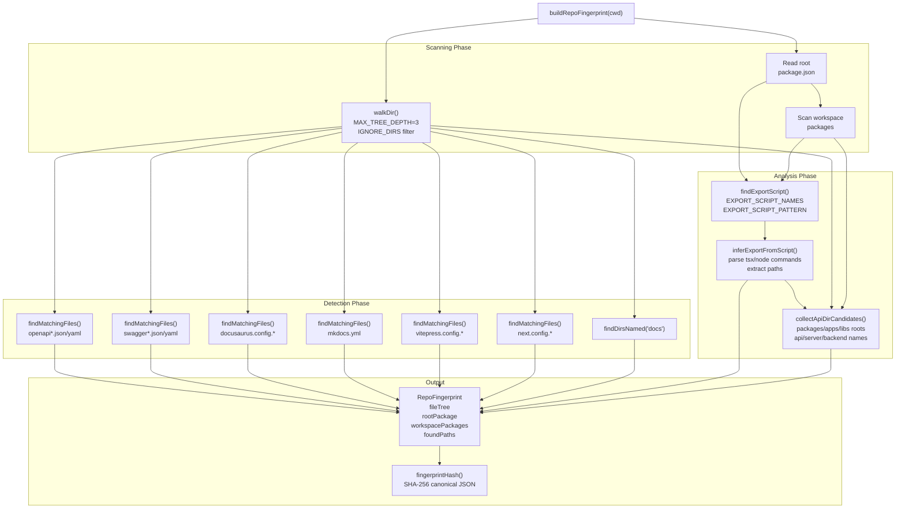
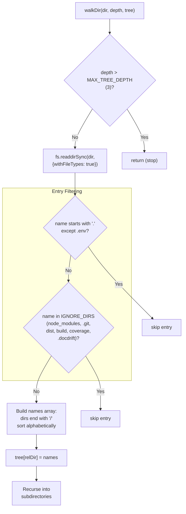
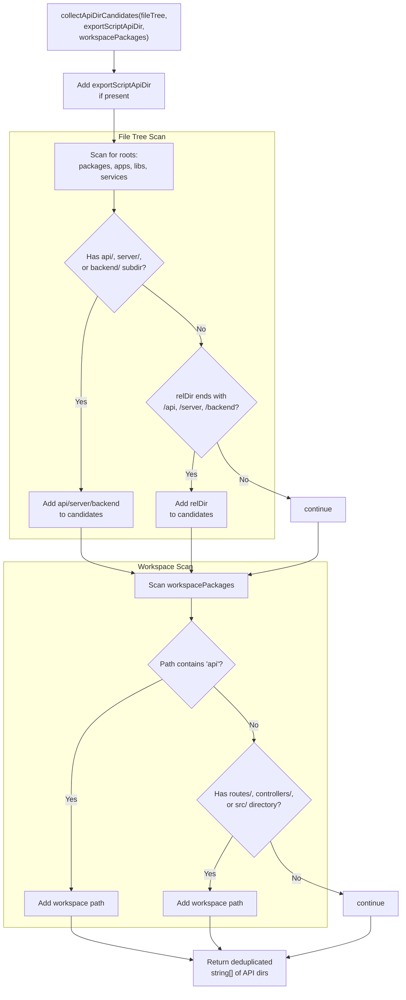

# Repository Fingerprinting

<details>
<summary>Relevant source files</summary>

The following files were used as context for generating this wiki page:

- [src/setup/ai-infer.ts](src/setup/ai-infer.ts)
- [src/setup/prompts.ts](src/setup/prompts.ts)
- [src/setup/repo-fingerprint.ts](src/setup/repo-fingerprint.ts)
- [test/setup-infer.test.ts](test/setup-infer.test.ts)

</details>


**Purpose**: This page explains how `buildRepoFingerprint` analyzes repository structure to detect documentation frameworks, API specifications, and code organization patterns. The resulting `RepoFingerprint` is consumed by AI inference and heuristic logic to generate docdrift configuration.

**Scope**: Covers the scanning algorithms, detection patterns, and data structures used during repository fingerprinting. For information about how the fingerprint is used to generate configuration, see [AI Inference and Heuristics](#5.5). For the overall setup flow, see [Setup Overview](#5.1).

---

## Overview

Repository fingerprinting is the initial analysis phase of docdrift setup. The system scans the codebase to build a structured representation of its layout, identifying:

- File tree structure (limited depth traversal)
- Package.json scripts and workspace configuration
- Documentation framework configurations (Docusaurus, MkDocs, VitePress, Next.js)
- API specification files (OpenAPI, Swagger)
- Export scripts that generate specifications
- API/server directories

The `buildRepoFingerprint` function in [src/setup/repo-fingerprint.ts:212-328]() is the primary entry point. It returns a `RepoFingerprint` object that is deterministically hashable for caching.

**Sources**: [src/setup/repo-fingerprint.ts:1-334](), [src/setup/ai-infer.ts:1-296]()

---

## Fingerprinting Architecture



**Sources**: [src/setup/repo-fingerprint.ts:212-328]()

---

## RepoFingerprint Data Structure

The `RepoFingerprint` interface defines the output of the scanning process:

| Field | Type | Description |
|-------|------|-------------|
| `fileTree` | `Record<string, string[]>` | Directory paths mapped to their immediate children (files and subdirectories) |
| `rootPackage` | `{ scripts, dependencies, workspaces }` | Root package.json contents with filtered dependencies |
| `workspacePackages` | `Array<{ path, scripts }>` | Workspace package.json files with their scripts |
| `foundPaths.openapi` | `string[]` | Paths to OpenAPI specification files |
| `foundPaths.swagger` | `string[]` | Paths to Swagger specification files |
| `foundPaths.docusaurusConfig` | `string[]` | Paths to docusaurus.config.* files |
| `foundPaths.mkdocs` | `string[]` | Paths to mkdocs.yml files |
| `foundPaths.vitepressConfig` | `string[]` | Paths to vitepress.config.* files |
| `foundPaths.nextConfig` | `string[]` | Paths to next.config.* files |
| `foundPaths.docsDirs` | `string[]` | Paths to directories named "docs" |
| `foundPaths.docsDirParents` | `string[]` | Parent directories of docs/ directories |
| `foundPaths.exportScript` | `ExportScriptInfo \| undefined` | Detected OpenAPI export script metadata |
| `foundPaths.apiDirs` | `string[]` | Candidate API/server directories |

The `ExportScriptInfo` type contains:

| Field | Type | Description |
|-------|------|-------------|
| `scriptName` | `string` | The npm script name (e.g. "openapi:export") |
| `script` | `string` | The full script command |
| `inferredApiDir` | `string \| undefined` | The API directory inferred from the script path |
| `inferredOutputPath` | `string \| undefined` | The output path extracted from the script file |

**Sources**: [src/setup/repo-fingerprint.ts:9-33]()

---

## File Tree Walking



The `walkDir` function implements depth-limited directory traversal:

- **Maximum depth**: `MAX_TREE_DEPTH = 3` prevents deep traversal that would slow down scanning
- **Ignored directories**: `IGNORE_DIRS` set includes `node_modules`, `.git`, `dist`, `build`, `coverage`, `.docdrift`
- **Hidden file handling**: Files starting with `.` are skipped except `.env`
- **Relative paths**: All paths are stored relative to the repository root
- **Sorted output**: Directory entries are alphabetically sorted for deterministic output

The resulting `fileTree` maps each directory path to an array of its immediate children, with directories suffixed by `/`.

**Sources**: [src/setup/repo-fingerprint.ts:5-7](), [src/setup/repo-fingerprint.ts:35-56]()

---

## Package.json Detection

The fingerprinting process reads package.json files at two levels: root and workspace packages.

### Root Package Analysis

[src/setup/repo-fingerprint.ts:216-232]() reads the root package.json to extract:

1. **Scripts**: All npm scripts for export script detection
2. **Dependencies**: Filtered to only documentation-related dependencies (containing hints: `openapi`, `swagger`, `docusaurus`, `mkdocs`, `next`, `vitepress`)
3. **Workspaces**: Workspace patterns for monorepo detection

### Workspace Package Detection

[src/setup/repo-fingerprint.ts:234-255]() processes workspace patterns:

1. Expands glob patterns (e.g., `packages/*` → individual package directories)
2. Reads package.json from each workspace package
3. Collects scripts for export script detection across workspaces
4. Stores relative paths to workspace packages

This two-level approach ensures that export scripts defined in workspace packages (e.g., `packages/api/package.json`) are discovered.

**Sources**: [src/setup/repo-fingerprint.ts:216-255]()

---

## Framework and Spec Detection

The system uses `findMatchingFiles` [src/setup/repo-fingerprint.ts:58-79]() to locate specific file patterns:

### Detection Patterns

| Category | Pattern | Function |
|----------|---------|----------|
| OpenAPI | `openapi*.json`, `openapi*.yaml`, `openapi*.yml` | Name-based match |
| OpenAPI | `openapi/openapi.json`, `openapi/generated.json` | Path-based match |
| Swagger | `swagger*.json`, `swagger*.yaml`, `swagger*.yml` | Name-based match |
| Docusaurus | `docusaurus.config.*` | Prefix match |
| MkDocs | `mkdocs.yml` | Exact match |
| VitePress | `vitepress.config.*` | Prefix match |
| Next.js | `next.config.*` | Prefix match |

### OpenAPI Special Cases

OpenAPI detection uses a two-pass approach [src/setup/repo-fingerprint.ts:257-274]():

1. **Generic name matching**: Finds `openapi*.{json,yaml,yml}` and `{api-spec,spec}.{json,yaml,yml}`
2. **Directory convention matching**: Finds `openapi/openapi.json`, `openapi/generated.json`, `openapi/published.json`
3. **Deduplication**: Combines results, ensuring no duplicates

This handles both conventional locations (e.g., `openapi/openapi.json`) and custom locations (e.g., `specs/api.json`).

### Docs Directory Detection

`findDirsNamed` [src/setup/repo-fingerprint.ts:81-103]() locates directories named `docs`:

- Maximum depth: 2 levels
- Returns paths to docs directories
- Computes parent directories (e.g., `packages/docs/docs` → parent is `packages/docs`)

Parent directories are stored in `foundPaths.docsDirParents` for docsite path inference.

**Sources**: [src/setup/repo-fingerprint.ts:58-79](), [src/setup/repo-fingerprint.ts:81-103](), [src/setup/repo-fingerprint.ts:257-288]()

---

## Export Script Analysis

```mermaid
graph TB
    FindScript["findExportScript(scripts, cwd)"]
    
    SearchExact["Search EXPORT_SCRIPT_NAMES:<br/>'openapi:export'<br/>'openapi:generate'<br/>'openapi:build'<br/>'spec:export'<br/>'spec:generate'"]
    
    SearchPattern["Search EXPORT_SCRIPT_PATTERN:<br/>/(openapi|swagger|spec).*(export|generate|build)/i"]
    
    Found{"Script found?"}
    
    InferPath["inferExportFromScript(script, cwd)"]
    
    subgraph "Path Inference"
        MatchCommand["Regex: /\b(?:tsx|node|npx)\s+(.+?\.(?:ts|js|mjs|cjs))(?:\s|$)/"]
        ParsePath["Parse file path<br/>relative to cwd"]
        CheckExport{"File name contains<br/>'export'?"}
        InferAPI1["Infer API dir:<br/>parent of scripts/ dir<br/>or dirname of file"]
        InferAPI2["Infer API dir:<br/>dirname of file"]
        ReadFile["Read script file<br/>if exists"]
        ExtractOutput["Regex: /outputPath\s*[=:]\s*['\"``]([^'\"``]+)['\"``]/"]
    end
    
    Result["ExportScriptInfo:<br/>scriptName<br/>script<br/>inferredApiDir<br/>inferredOutputPath"]
    
    FindScript --> SearchExact
    SearchExact --> SearchPattern
    SearchPattern --> Found
    
    Found -->|No| ReturnUndef["return undefined"]
    Found -->|Yes| InferPath
    
    InferPath --> MatchCommand
    MatchCommand --> ParsePath
    ParsePath --> CheckExport
    
    CheckExport -->|Yes, and in scripts/| InferAPI1
    CheckExport -->|Yes, not in scripts/| InferAPI2
    CheckExport -->|No| InferAPI2
    
    InferAPI1 --> ReadFile
    InferAPI2 --> ReadFile
    ReadFile --> ExtractOutput
    
    ExtractOutput --> Result
```

The export script analysis follows a three-step process:

### 1. Script Name Detection

`findExportScript` [src/setup/repo-fingerprint.ts:150-159]() searches for npm scripts in priority order:

1. **Exact matches**: Checks `EXPORT_SCRIPT_NAMES` array (`openapi:export`, `openapi:generate`, `openapi:build`, `spec:export`, `spec:generate`)
2. **Pattern matches**: Applies `EXPORT_SCRIPT_PATTERN` regex: `/(openapi|swagger|spec).*(export|generate|build)/i`

This finds scripts like `"openapi:export": "tsx apps/api/scripts/export-openapi.ts"`.

### 2. Path Inference

`inferExportFromScript` [src/setup/repo-fingerprint.ts:106-139]() extracts metadata from the script command:

**Command parsing**:
- Regex: `/\b(?:tsx|node|npx)\s+(.+?\.(?:ts|js|mjs|cjs))(?:\s|$)/`
- Extracts the executed file path (e.g., `apps/api/scripts/export-openapi.ts`)

**API directory inference**:
- If file name contains "export" and is in a `scripts/` subdirectory → parent of scripts directory
- Otherwise → directory containing the file
- Example: `apps/api/scripts/export-openapi.ts` → `apiDir = "apps/api"`

**Output path extraction**:
- Reads the script file contents (if it exists)
- Regex: `/outputPath\s*[=:]\s*["'`]([^"'`]+)["'`]/`
- Extracts the output path variable (e.g., `outputPath = "openapi/generated.json"`)

### 3. Workspace Handling

[src/setup/repo-fingerprint.ts:290-303]() checks workspace packages if no root export script is found:

- Iterates through workspace packages
- Applies the same detection logic
- Adjusts `inferredApiDir` to be relative to repository root (e.g., `packages/api/src` → `packages/api/src`)

**Sources**: [src/setup/repo-fingerprint.ts:106-159](), [src/setup/repo-fingerprint.ts:290-303]()

---

## API Directory Collection



`collectApiDirCandidates` [src/setup/repo-fingerprint.ts:161-210]() assembles potential API directories from multiple sources:

### 1. Export Script API Directory

The `inferredApiDir` from the export script analysis is added first (highest priority).

### 2. Monorepo Root Scan

Looks for API directories in conventional monorepo layouts:

- **Roots**: Checks if top-level directory is `packages`, `apps`, `libs`, or `services`
- **Subdirectories**: Looks for `api/`, `server/`, or `backend/` subdirectories
- **Example**: File tree contains `packages: ["api/", "docs/"]` → adds `packages/api`

Also checks if any directory path ends with `/api`, `/server`, or `/backend`.

### 3. Workspace Package Scan

Examines workspace packages for API indicators:

- **Path contains "api"**: If workspace path includes "api" (e.g., `packages/api-server`)
- **Has API markers**: Checks for `routes/`, `controllers/`, or `src/` subdirectories in the package

### 4. Deduplication

Uses a `Set<string>` to ensure each directory appears only once in the results.

The resulting `apiDirs` array is used by heuristic inference to populate `pathMappings.match` patterns.

**Sources**: [src/setup/repo-fingerprint.ts:161-210](), [src/setup/repo-fingerprint.ts:305-309]()

---

## Fingerprint Hashing and Caching

### Deterministic Hashing

`fingerprintHash` [src/setup/repo-fingerprint.ts:330-333]() creates a SHA-256 hash of the fingerprint:

1. **Canonicalization**: Sorts object keys alphabetically using `JSON.stringify(fingerprint, Object.keys(fingerprint).sort())`
2. **Hashing**: Computes SHA-256 digest in hexadecimal format
3. **Purpose**: Enables cache invalidation when repository structure changes

### Cache Management

The AI inference system uses the fingerprint hash for caching [src/setup/ai-infer.ts:77-109]():

**Cache location**: `.docdrift/setup-cache.json`

**Cache structure**:
```typescript
{
  fingerprintHash: string,
  inference: ConfigInference,
  timestamp: number
}
```

**Cache operations**:

- `readCache` [src/setup/ai-infer.ts:84-99](): Reads and validates cached inference results
- `writeCache` [src/setup/ai-infer.ts:101-109](): Writes inference results with timestamp
- Cache hit check [src/setup/ai-infer.ts:263](): Compares current hash with cached hash

This avoids re-running expensive AI inference when the repository structure hasn't changed.

**Sources**: [src/setup/repo-fingerprint.ts:330-333](), [src/setup/ai-infer.ts:77-109](), [src/setup/ai-infer.ts:255-263]()

---

## Integration with Setup Flow

```mermaid
graph LR
    SetupCmd["docdrift setup<br/>or generate-yaml"]
    
    BuildFP["buildRepoFingerprint(cwd)"]
    
    HashFP["fingerprintHash(fp)"]
    
    CheckCache{"Cache hit?"}
    
    AIInfer["inferConfigFromFingerprint()<br/>AI_GATEWAY_API_KEY present?"]
    
    AIPath["AI inference via<br/>gateway('anthropic/claude-opus-4.6')"]
    
    HeuristicPath["heuristicInference(fp)"]
    
    ConfigInfer["ConfigInference:<br/>suggestedConfig<br/>choices<br/>skipQuestions"]
    
    InteractiveForm["Interactive prompts<br/>for low-confidence fields"]
    
    WriteConfig["Write docdrift.yaml"]
    
    SetupCmd --> BuildFP
    BuildFP --> HashFP
    HashFP --> CheckCache
    
    CheckCache -->|No| AIInfer
    CheckCache -->|Yes| ConfigInfer
    
    AIInfer -->|API key present| AIPath
    AIInfer -->|No API key| HeuristicPath
    
    AIPath -->|Success| ConfigInfer
    AIPath -->|Failure| HeuristicPath
    
    HeuristicPath --> ConfigInfer
    
    ConfigInfer --> InteractiveForm
    InteractiveForm --> WriteConfig
```



The fingerprint integrates into the setup flow as follows:

### 1. Fingerprint Generation

Setup commands call `buildRepoFingerprint` to analyze the repository structure.

### 2. Cache Check

The fingerprint is hashed and checked against `.docdrift/setup-cache.json`. If the hash matches, cached inference results are returned immediately.

### 3. Inference Path Selection

`inferConfigFromFingerprint` [src/setup/ai-infer.ts:255-295]() chooses between:

- **AI inference**: If `AI_GATEWAY_API_KEY` is present, sends fingerprint to Claude Opus with `SYSTEM_PROMPT`
- **Heuristic fallback**: If no API key or AI inference fails, uses `heuristicInference`

### 4. Configuration Generation

Both paths produce a `ConfigInference` object containing:
- `suggestedConfig`: Partial docdrift configuration inferred from fingerprint
- `choices`: Interactive questions for low-confidence fields
- `skipQuestions`: Fields with high confidence that don't need user input

### 5. Interactive Refinement

The setup flow presents interactive questions to the user for fields marked with low or medium confidence in the inference results.

The fingerprint-driven approach ensures that generated configurations are grounded in actual repository structure rather than assumptions or templates.

**Sources**: [src/setup/ai-infer.ts:255-295](), [src/setup/ai-infer.ts:111-253]()

---

## Example Fingerprints

### Monorepo with Docusaurus

```json
{
  "fileTree": {
    "packages": ["api/", "docs/"]
  },
  "rootPackage": {
    "scripts": {
      "openapi:export": "tsx packages/api/scripts/export-openapi.ts",
      "docs:gen": "npm run --prefix packages/docs docusaurus gen-api-docs",
      "docs:build": "npm run --prefix packages/docs build"
    },
    "workspaces": ["packages/*"]
  },
  "foundPaths": {
    "openapi": ["openapi/generated.json"],
    "docusaurusConfig": ["packages/docs/docusaurus.config.js"],
    "docsDirs": ["packages/docs/docs"],
    "docsDirParents": ["packages/docs"],
    "exportScript": {
      "scriptName": "openapi:export",
      "script": "tsx packages/api/scripts/export-openapi.ts",
      "inferredApiDir": "packages/api",
      "inferredOutputPath": "openapi/generated.json"
    },
    "apiDirs": ["packages/api"]
  }
}
```

This fingerprint produces:
- `docsite`: `packages/docs` (from docusaurusConfig parent)
- `pathMappings.match`: `packages/api/**` (from apiDirs)
- `specProviders.current.command`: `npm run openapi:export` (from exportScript)

**Sources**: [test/setup-infer.test.ts:42-64]()

### Single-Root with MkDocs

```json
{
  "fileTree": {
    ".": ["docs/", "openapi/", "backend/"]
  },
  "rootPackage": {
    "scripts": {}
  },
  "foundPaths": {
    "openapi": ["openapi/spec.json"],
    "mkdocs": ["docs/mkdocs.yml"],
    "docsDirs": ["docs"],
    "apiDirs": ["backend"]
  }
}
```

This fingerprint produces:
- `docsite`: `docs` (from mkdocs parent)
- `pathMappings.match`: `backend/**` (from apiDirs)
- Export command prompt with medium confidence (no export script detected)

**Sources**: [test/setup-infer.test.ts:85-97]()

---